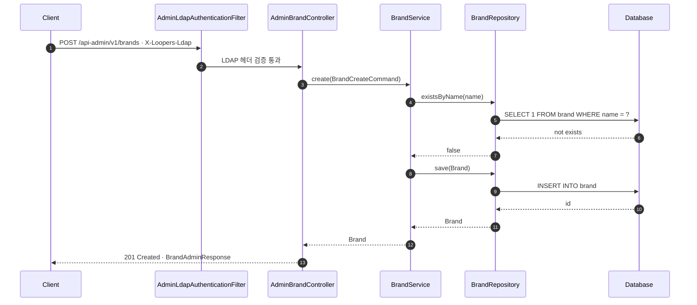
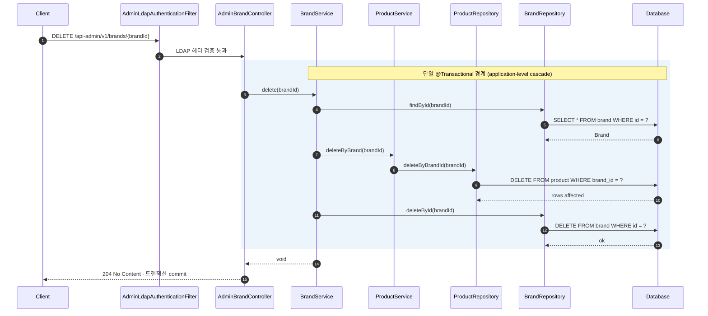
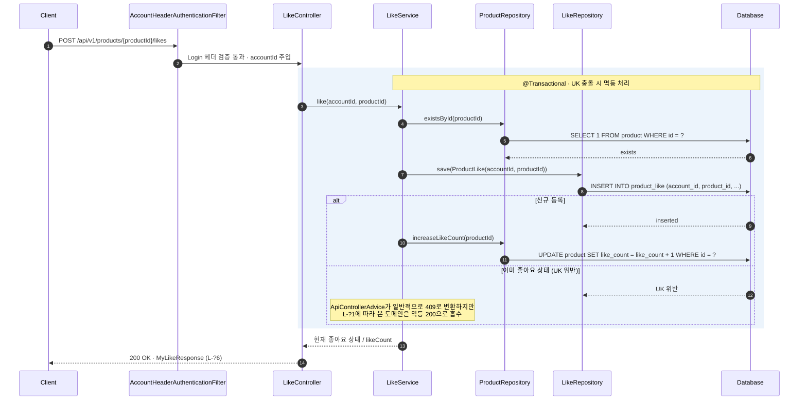
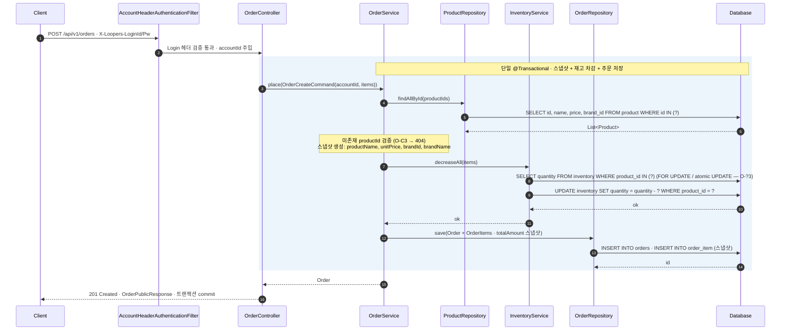
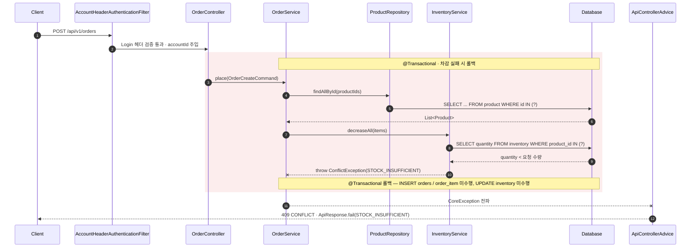
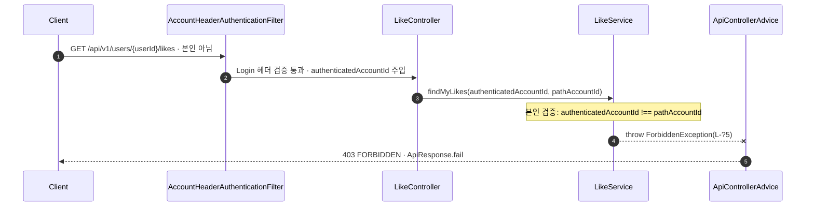

# Week 2 · API 시퀀스 다이어그램 종합

> 4개 도메인(Brand / Product / Likes / Order) 시나리오 HTML(`docs/week2/scenarios/*-final.html`, 일부는 비-final HTML이 최신)을 단일 진실 출처(SSOT)로 삼아 도출한 대표 시퀀스 모음입니다.
> 어휘 / 컴포넌트 풀네임 / 인증 헤더 / 응답 status 매핑은 `docs/ubiquitous-language.md`를 따릅니다. 충돌 시 사전이 정답입니다.
>
> 본 문서가 다루지 않는 영역:
> - 도메인 모델 / DB 스키마 → 각 도메인 시나리오 HTML (`docs/week2/scenarios/`)
> - 에러 핸들링 패턴 / Exception 매핑 → `CLAUDE.md` §2 Error Handling
> - 영속성 공통 규약(FK 미설정 / Soft delete / Cascade 정책) → `docs/conventions.md`

---

## 0. 인증 / 컴포넌트 어휘 (공통 전제)

본 시퀀스 모음 전반에서 사용하는 어휘 — `docs/ubiquitous-language.md` §3, §9 정렬.

| 축 | 헤더 | 필터 (풀네임) | 적용 API |
|----|------|----------------|----------|
| **LDAP 인증** | `X-Loopers-Ldap` (값: `loopers.admin`) | `AdminLdapAuthenticationFilter` | `/api-admin/v1/**` |
| **로그인 인증** | `X-Loopers-LoginId` + `X-Loopers-LoginPw` | `AccountHeaderAuthenticationFilter` | 로그인 필요 `/api/v1/**` |

**참여 컴포넌트 (풀네임 — 약어 금지)**: Controller / Service / Repository / Filter / Database / ApiControllerAdvice.
**식별자 매핑**: 외부 `userId` ↔ 내부 `accountId` (컨트롤러에서 매핑, 본 시퀀스는 내부 어휘 사용).
**필터 통과 메시지**: `LDAP 헤더 검증 통과` / `Login 헤더 검증 통과 · accountId 주입`.
**필터 차단 메시지**: `401 UNAUTHORIZED`.

---

## 1. Brand · 관리자 등록 (S-C1)

**시나리오**: 관리자가 신규 브랜드를 등록한다.
**경로**: `POST /api-admin/v1/brands`
**핵심**: LDAP 인증 → 도메인 생성 → DB persist → 201 응답.

**연결된 예외 분기**:
- 헤더 누락/불일치 → `AdminLdapAuthenticationFilter`에서 단락. Controller 진입 못함. 응답 `401 UNAUTHORIZED` (S-C2).
- 중복 `brandName` → DB unique 제약 위반 → `ApiControllerAdvice`의 `DataIntegrityViolationException` 핸들러가 `409 CONFLICT`로 변환 (S-C3). 본 흐름은 사전 `existsByName`이 race를 모두 막지 못한다는 사실을 전제 (Service 레벨 `try-catch` 금지 — `CLAUDE.md` §2 DB unique race 처리 참조).
- 필수 필드 누락 / 형식 오류 → `400 BAD_REQUEST` (S-C4).

---

## 2. Brand · 관리자 삭제 + Product application-level cascade (S-D1)

**시나리오**: 관리자가 브랜드를 삭제하면 해당 브랜드의 모든 상품도 함께 삭제된다.
**경로**: `DELETE /api-admin/v1/brands/{brandId}`
**핵심**: **DB cascade 사용 안 함**. 같은 `@Transactional` 안에서 `BrandService`가 `ProductService.deleteByBrand(brandId)`를 먼저 호출 → 그 후 brand 삭제. 주문 스냅샷은 별도 도메인이라 영향 없음.

**설계 결정 (B-?3, `docs/conventions.md` §1)**:
- DB에 `ON DELETE CASCADE` 두지 않음 → 향후 샤딩/MSA 대비 + 다른 도메인 영향(주문 스냅샷 등)을 명시적으로 통제.
- 주문 도메인은 `order_item`에 product/brand 정보를 스냅샷으로 보존 → 과거 주문 기록은 무영향.

---

## 3. Likes · 사용자 좋아요 등록 (L-C1, 멱등)

**시나리오**: 로그인 사용자가 상품에 좋아요를 누른다.
**경로**: `POST /api/v1/products/{productId}/likes`
**핵심**: 로그인 인증 → product 존재 확인 → `product_like` INSERT. (`accountId`, `productId`) 복합 UK 위반 시 멱등 200으로 처리 (L-?1). `Product.likeCount` 비정규화 증감 (L-?3 / P-?5).

**연결된 예외 분기**:
- 인증 헤더 누락/오류 → `AccountHeaderAuthenticationFilter` 단락 → `401 UNAUTHORIZED` (L-C2).
- `productId` 미존재 → `404 NOT_FOUND` (L-C3).
- `productId` 형식 오류 → `400 BAD_REQUEST` (L-C5).

---

## 4. Order · 사용자 주문 생성 (O-C1, 스냅샷 + 재고 차감)

**시나리오**: 로그인 사용자가 여러 상품을 한 번에 주문한다.
**경로**: `POST /api/v1/orders`
**핵심**: 단일 `@Transactional` 경계 안에서 (1) Product 일괄 조회로 스냅샷 데이터 확보 → (2) **Inventory 도메인의 차감 인터페이스 호출** → (3) Order + OrderItem 저장 + `total_amount` 스냅샷. 재고 정합성은 Inventory 도메인 책임 (O-?2 / O-?3).

**스냅샷 범위 (O-?4)**: `productId` (soft ref) / `productName` / `unitPrice` / `brandId` / `brandName` / `quantity`. product/brand 행이 사라지거나 변경되어도 주문 기록 불변.

---

## 5. Order · 재고 부족으로 주문 거부 (O-C4, 트랜잭션 롤백)

**시나리오**: 주문 항목 중 하나라도 재고가 요청 수량을 충족하지 못하면 주문 전체를 거부한다.
**핵심**: Inventory 도메인이 차감 인터페이스에서 부족을 감지하고 `ConflictException(STOCK_INSUFFICIENT)`을 던짐 → Order 트랜잭션 롤백 → `ApiControllerAdvice`가 `ApiResponse.fail`로 직렬화하여 `409 CONFLICT` 응답. **재고는 절대 차감되지 않는다.**

**메모**: `CLAUDE.md` §2 패턴 — 비즈니스 실패는 `CoreException` 서브클래스(`ConflictException`)로만 던지고, 매핑은 `ApiControllerAdvice`가 일괄 처리. 도메인 throw 시 PII를 `customMessage`에 끼워넣지 않음.

---

## 6. Likes · 본인 검증 실패 — 타 사용자 userId로 조회 시도 (L-R3)

**시나리오**: 인증은 OK이지만 path `{userId}`가 본인의 accountId와 일치하지 않는 경우.
**경로**: `GET /api/v1/users/{userId}/likes`
**핵심**: `AccountHeaderAuthenticationFilter`는 통과 → `LikeController`에서 `pathAccountId !== authenticatedAccountId` 비교 → `ForbiddenException` 발생.

**참고 — 본인 검증 응답 정책 (`docs/ubiquitous-language.md` §14)**:
- **Like 도메인 (L-?5) → 403 FORBIDDEN** — 좋아요는 공개성 강함. 권한 없음 명시.
- **Order 도메인 (O-?7) → 404 NOT_FOUND** — 주문은 PII. ID enumeration 방어 (OWASP A01:2021).
- 같은 "타 사용자 리소스 접근" 상황이지만 도메인 특성에 따라 status가 의도적으로 갈림.

---

## 7. 다이어그램 인덱스

| # | 도메인 | 시나리오 ID | API | 핵심 |
|---|--------|-------------|-----|------|
| 1 | Brand | S-C1 | `POST /api-admin/v1/brands` | LDAP 인증 + 등록 정상 흐름 |
| 2 | Brand → Product | S-D1 | `DELETE /api-admin/v1/brands/{brandId}` | application-level cascade · 단일 트랜잭션 |
| 3 | Likes | L-C1 | `POST /api/v1/products/{productId}/likes` | 로그인 인증 + 멱등 처리 + likeCount 증감 |
| 4 | Order | O-C1 | `POST /api/v1/orders` | 스냅샷 생성 + Inventory 차감 + 단일 트랜잭션 |
| 5 | Order | O-C4 | `POST /api/v1/orders` | 재고 부족 → 트랜잭션 롤백 + 409 매핑 |
| 6 | Likes | L-R3 | `GET /api/v1/users/{userId}/likes` | 본인 검증 실패 → 403 (vs Order 404 대조) |

---

> 원본 SSOT: `docs/week2/scenarios/01-brand-final.html`, `docs/week2/scenarios/02-product-final.html`, `docs/week2/scenarios/03-likes.html`, `docs/week2/scenarios/04-orders-final.html`.
> 시나리오 ID(`S-`, `P-`, `L-`, `O-`)와 결정 카드(`-?N`)는 각 HTML / 정제본 md에서 정의됩니다.
