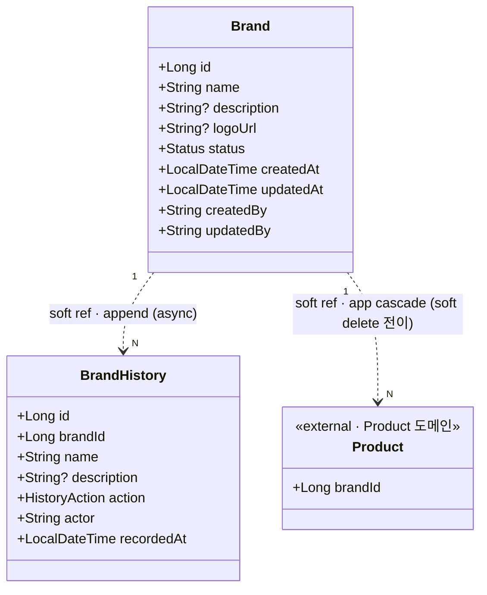
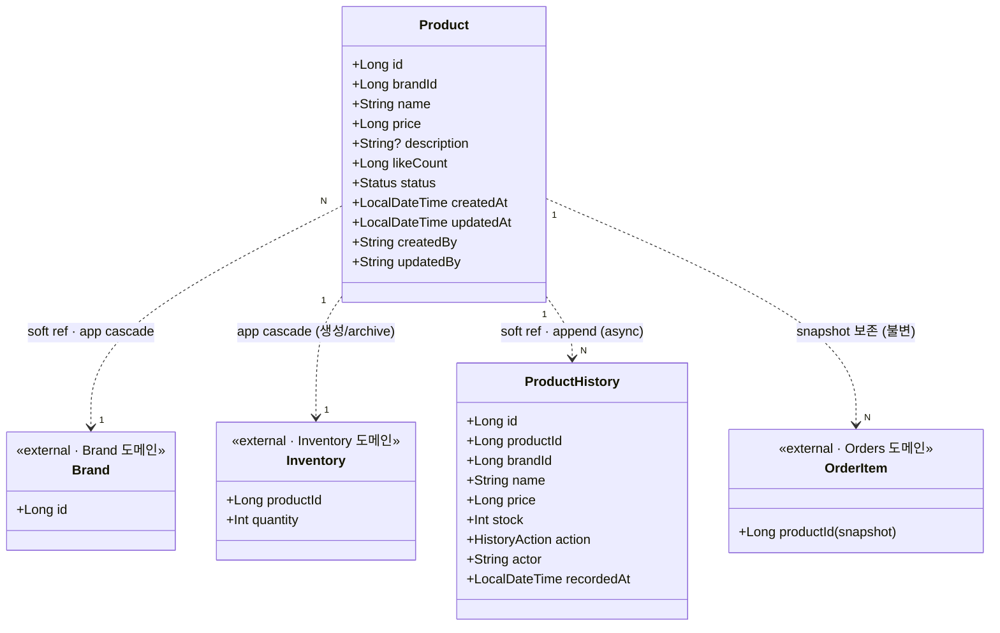
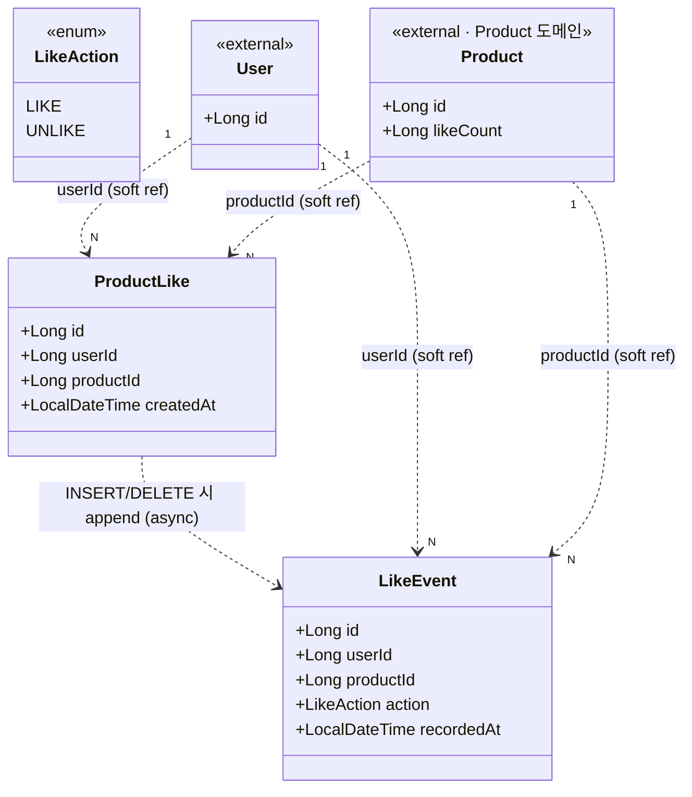

# Week 2 도메인 객체 설계 (Class Diagram)

> 4개 도메인(Brand · Product · Likes · Orders)의 클래스/엔티티 구조, 필드, 도메인 invariant, 연관 관계를 한 곳에서 조망하는 종합 본.
>
> **SSOT = `docs/week2/{도메인}/*-final.html`.** 본 문서는 그 4개 HTML(특히 각 파일의 §3 "시나리오 → 도메인 모델" 섹션)의 종합이며, 필드/타입/제약/관계 정의가 충돌하면 항상 `*-final.html`이 정답입니다. 본 문서가 누락되거나 어긋나는 경우 SSOT를 갱신한 뒤 본 문서를 같은 PR에서 반영합니다.
>
> 본 문서는 영속성/구현 계약(예: `@Entity`, `@Embeddable`, `@OneToMany(cascade)`) 가이드가 **아닙니다**. JPA 매핑 등 구현 디테일은 각 도메인 final HTML 또는 추후 구현 노트가 담당합니다.

---

## 0. 빠른 인덱스

- [1. 도메인 한눈에](#1-도메인-한눈에)
- [2. 통합 클래스 다이어그램](#2-통합-클래스-다이어그램)
- [3. 도메인별 상세](#3-도메인별-상세)
  - [3.1 Brand](#31-brand)
  - [3.2 Product](#32-product)
  - [3.3 Likes (ProductLike · LikeEvent)](#33-likes-productlike--likeevent)
  - [3.4 Orders (Order · OrderItem)](#34-orders-order--orderitem)
- [4. 공통 패턴](#4-공통-패턴)
- [5. SSOT 동기화 체크리스트](#5-ssot-동기화-체크리스트)

---

## 1. 도메인 한눈에

| 도메인 | 핵심 엔티티 | 보조 엔티티 (이력/이벤트) | 삭제 정책 | status 컬럼 | 변경 이력 |
|---|---|---|---|---|---|
| **Brand** | `Brand` | `BrandHistory` | soft delete | O (ACTIVE / DELETED) | snapshot · after-only · append-only |
| **Product** | `Product` | `ProductHistory` | soft delete | O (ACTIVE / DELETED) | snapshot · after-only · append-only |
| **Likes** | `ProductLike` | `LikeEvent` | **hard delete** (예외) | X (UK로 멱등성 보장) | action event (LIKE / UNLIKE) · append-only |
| **Orders** | `Order`, `OrderItem` | (미래 OrderEvent) | (당주차 범위 외) | O (자체 상태 모델) | (당주차 미설계) |

> 삭제 정책의 전반 규칙은 `docs/conventions.md` §3, Likes 예외는 §4 참조.
> 변경 이력 정책 매트릭스는 같은 문서 §5 참조.

### 도메인 간 의존 방향 (한 줄 요약)

```
Brand 1 ──soft ref──→ N Product ──snapshot──→ N OrderItem ──belongs to──→ Order
                       │                                                    ↑
                       ├──1:1──→ Inventory (외부 도메인 · 차감 인터페이스)──┘
                       │
                       └──N:1──→ ProductLike ──by──→ User (외부)
                                     │
                                     └──INSERT/DELETE 트리거──→ LikeEvent (append-only)
```

- 모든 도메인 간 FK는 **DB 제약을 두지 않습니다 (논리 참조)**. 무결성과 cascade는 애플리케이션 레이어가 책임집니다. (`docs/conventions.md` §1)
- 외부 도메인(`User`, `Inventory`)은 본 문서 범위 밖이며, 인터페이스 경계로만 표시합니다.

---

## 2. 통합 클래스 다이어그램

> 4개 도메인의 핵심 엔티티와 관계를 단일 mermaid 다이어그램으로 종합한 overview입니다. 각 클래스의 세부 필드/invariant는 §3에서 도메인별로 다룹니다.

```mermaid
classDiagram
    direction LR

    class BaseEntity {
        <<abstract>>
        +LocalDateTime createdAt
        +LocalDateTime updatedAt
        +String createdBy
        +String updatedBy
    }

    class Status {
        <<enum>>
        ACTIVE
        DELETED
    }

    class Brand {
        +Long id
        +String name
        +String? description
        +String? logoUrl
        +Status status
    }

    class BrandHistory {
        +Long id
        +Long brandId
        +String name
        +String? description
        +HistoryAction action
        +String actor
        +LocalDateTime recordedAt
    }

    class HistoryAction {
        <<enum>>
        CREATE
        UPDATE
        DELETE
    }

    class Product {
        +Long id
        +Long brandId
        +String name
        +Long price
        +String? description
        +Long likeCount
        +Status status
    }

    class ProductHistory {
        +Long id
        +Long productId
        +Long brandId
        +String name
        +Long price
        +Int stock
        +HistoryAction action
        +String actor
        +LocalDateTime recordedAt
    }

    class Inventory {
        <<external>>
        +Long id
        +Long productId
        +Int quantity
    }

    class ProductLike {
        +Long id
        +Long userId
        +Long productId
        +LocalDateTime createdAt
    }

    class LikeEvent {
        +Long id
        +Long userId
        +Long productId
        +LikeAction action
        +LocalDateTime recordedAt
    }

    class LikeAction {
        <<enum>>
        LIKE
        UNLIKE
    }

    class Order {
        +Long id
        +Long userId
        +LocalDateTime orderedAt
        +Long totalAmount
        +OrderStatus status
    }

    class OrderItem {
        +Long id
        +Long orderId
        +Long productId
        +Long? brandId
        +String productName
        +String? brandName
        +Long unitPrice
        +Int quantity
        +LocalDateTime createdAt
    }

    class OrderStatus {
        <<enum>>
        (결정 카드 O-?1)
    }

    class User {
        <<external>>
        +Long id
    }

    Brand --|> BaseEntity
    Product --|> BaseEntity
    Order --|> BaseEntity
    BrandHistory ..|> BaseEntity : 일부 채택
    ProductHistory ..|> BaseEntity : 일부 채택
    ProductLike ..|> BaseEntity : createdAt만
    OrderItem ..|> BaseEntity : createdAt만

    Brand "1" ..> "N" Product : soft ref · app cascade
    Brand "1" ..> "N" BrandHistory : append on CUD (async)
    Product "1" ..> "N" ProductHistory : append on CUD (async)
    Product "1" ..> "1" Inventory : app cascade
    Product "1" ..> "N" ProductLike : soft ref
    Product "1" ..> "N" OrderItem : snapshot (불변)

    User "1" ..> "N" ProductLike : soft ref
    User "1" ..> "N" Order : userId

    ProductLike ..> LikeEvent : INSERT/DELETE 시 append (async)

    Order "1" *-- "N" OrderItem : composition
```

> **다이어그램 범례**
> - 실선 화살표 `-->` / `--|>` — 상속·composition·강한 연관.
> - 점선 화살표 `..>` / `..|>` — soft reference 또는 부분 채택(논리적 의존).
> - `*--` — composition (Order ↔ OrderItem). Order 삭제 시 OrderItem cascade는 의미 단위로 묶이지만, **본 주차 범위에서 Order의 hard/soft delete는 다루지 않습니다** (`O-?1`).
> - 약어 alias는 사용하지 않습니다 (`docs/ubiquitous-language.md` §9).

---

## 3. 도메인별 상세

각 도메인 절은 다음 구조를 따릅니다.

1. mermaid 클래스 다이어그램 (해당 도메인만)
2. 엔티티 필드 표 (타입/제약/출처 시나리오 ID)
3. 도메인 invariant
4. 연관 관계
5. 결정 미정 항목 (해당 도메인의 `?N` 카드 인덱스)

---

### 3.1 Brand

> SSOT: `docs/week2/01-brand/01-brand-final.html` §3



#### Brand 필드

| 필드 | 타입 | 제약 / 비고 | 출처 |
|---|---|---|---|
| `id` | `Long` | PK · 시스템 부여 · 불변 | 전부 |
| `name` | `String` | UNIQUE · 길이 1~50 | S-C1 · S-C3 · S-C4 · S-U1 · S-U3 |
| `description` | `String?` | NULL 허용 · 최대 500 | — |
| `logoUrl` | `String?` | NULL 허용 · 최대 500 | — |
| `status` | `Status` (ACTIVE / DELETED) | 단방향 전이 | S-D1 |
| `createdAt` / `updatedAt` / `createdBy` / `updatedBy` | BaseEntity 표준 4컬럼 | 응답 비노출 | 감사 · S-U1 |

#### BrandHistory 필드

| 필드 | 타입 | 제약 / 비고 | 출처 |
|---|---|---|---|
| `id` | `Long` | PK | 감사 |
| `brandId` | `Long` | NOT NULL · **soft reference (FK 없음)** | S-C1 · S-U1 · S-D1 |
| `name`, `description` | snapshot | 변경 **후** 값만 기록 | 감사 |
| `action` | `HistoryAction` (CREATE / UPDATE / DELETE) | NOT NULL | S-C1 · S-U1 · S-D1 |
| `actor` | `String` | 변경 주체(관리자 식별자) | 감사 |
| `recordedAt` | `LocalDateTime` | 이력 적재 시각 | 감사 |

#### Invariant

- `name`은 유일하며 길이 1~50 (S-C3 · S-U3 · S-C4).
- `id`는 시스템 부여, **수정 불가** (S-U1 — `brandId` 불변).
- `status` 전이는 **ACTIVE → DELETED 단방향** (복원 시나리오 없음).
- BrandHistory는 **after-only snapshot · append-only**. UPDATE/DELETE 발생 안 함.
- BrandHistory.`brandId`는 soft reference — Brand가 soft delete 되어도 row는 보존.

#### 관계

- `Brand 1 ──→ N Product` : soft reference (FK 없음). Brand 삭제 시 application cascade로 Product도 `status=DELETED` 전이 (S-D1, `BrandService.delete` → `ProductService.softDeleteByBrand`).
- `Brand 1 ──→ N BrandHistory` : CUD 시 비동기 append. 실패 시 로깅만 남기고 본 트랜잭션은 성공시킴 (`conventions.md` §5).

#### 결정 미정 항목

- `B-?1` : `description` / `logoUrl` 컬럼 도입 여부 확정 — SSOT 참조.

---

### 3.2 Product

> SSOT: `docs/week2/02-product/02-product-final.html` §3



#### Product 필드

| 필드 | 타입 | 제약 / 비고 | 출처 |
|---|---|---|---|
| `id` | `Long` | PK · 시스템 부여 · 불변 | 전부 |
| `brandId` | `Long` | NOT NULL · **soft reference (FK 없음)** · 생성 후 불변 | P-C1 · P-C3 · P-R3 · P-U1 · P-U2 |
| `name` | `String` | NOT NULL · 길이 1~100 | P-C4 |
| `price` | `Long` | NOT NULL · `>= 0` (CHECK) | P-C4 · P-R4 |
| `description` | `String?` | NULL · 최대 1000 | — |
| `likeCount` | `Long` | NOT NULL · DEFAULT 0 · **비정규화** (정렬 `likes_desc` 지원) | P-R4 |
| `status` | `Status` (ACTIVE / DELETED) | 단방향 전이 | P-D1 |
| `createdAt` / `updatedAt` / `createdBy` / `updatedBy` | BaseEntity 표준 4컬럼 | 응답 비노출 · `createdAt`은 `sort=latest` 정렬 키 | P-R2 · P-U1 · 감사 |

> **재고 수량은 Product 필드가 아닙니다.** `Inventory` 도메인으로 분리되어 별도 테이블 `inventory`에 보관하며 `inventory.product_id` (UK)로 1:1 연결됩니다. 분리 근거는 `docs/ubiquitous-language.md` §7 참조.

#### ProductHistory 필드

| 필드 | 타입 | 제약 / 비고 | 출처 |
|---|---|---|---|
| `id` | `Long` | PK | 감사 |
| `productId` | `Long` | NOT NULL · **soft reference** | P-C1 · P-U1 · P-D1 |
| `brandId` | `Long` | NOT NULL · snapshot | 감사 |
| `name`, `price`, `stock` | snapshot | 변경 **후** 값만 기록 · `stock`은 Inventory에서 조회 | 감사 |
| `action` | `HistoryAction` (CREATE / UPDATE / DELETE) | NOT NULL | P-C1 · P-U1 · P-D1 |
| `actor` | `String` | 관리자 식별자 | 감사 |
| `recordedAt` | `LocalDateTime` | 이력 적재 시각 | 감사 |

#### Invariant

- `brandId`는 존재하는 Brand여야 하며 생성 후 **불변** (P-C1 · P-C3 · P-U1 · P-U2).
- `price >= 0` (P-C4).
- `name` 길이 1~100 (P-C4).
- `status` 전이는 **ACTIVE → DELETED 단방향** (P-D1).
- `likeCount`는 비정규화 캐시 — 권위(원장)는 `ProductLike` 테이블의 행 수. 갱신 전략은 결정 카드 참조.
- 재고 관련 invariant(`quantity >= 0`, 주문 차감 보장 등)는 **Inventory 도메인이 소유**합니다.

#### 관계

- `Product N ──→ 1 Brand` : soft ref. Brand soft delete 시 application cascade로 Product `status=DELETED` 전이 (S-D1 trigger).
- `Product 1 ──→ 1 Inventory` : 외부 도메인. Product 생성/삭제 트랜잭션 내에서 함께 생성/archive (application cascade).
- `Product 1 ──→ N ProductHistory` : CUD 시 비동기 append.
- `Product 1 ──→ N OrderItem` : OrderItem이 productId를 **snapshot으로만** 보유. Product가 soft delete 되어도 OrderItem 기록에는 영향 없음.
- `Product 1 ──→ N ProductLike` : soft ref. Product 삭제 시 cascade 정책은 [3.3 Likes](#33-likes-productlike--likeevent) 참조.

#### 결정 미정 항목

- `P-?N` (정렬 옵션, history 외부 노출, 재고 모델 디테일 등) — SSOT의 결정 카드 섹션 참조.

---

### 3.3 Likes (ProductLike · LikeEvent)

> SSOT: `docs/week2/03-likes/03-likes-final.html` §3
>
> Likes는 **현재 상태**(`ProductLike` · hard delete)와 **이력**(`LikeEvent` · append-only)을 책임 분리한 도메인입니다. 다른 도메인과 가장 큰 차이는 (1) `status` 컬럼이 없고 (2) hard delete를 쓴다는 점입니다 (`conventions.md` §4 예외 조항).



#### ProductLike 필드 — 현재 상태 (hard delete)

| 필드 | 타입 | 제약 / 비고 | 출처 |
|---|---|---|---|
| `id` | `Long` | PK | 전부 |
| `userId` | `Long` | NOT NULL · soft ref | L-C1 · L-R1 · L-R3 |
| `productId` | `Long` | NOT NULL · soft ref | L-C1 · L-C3 · L-D1 |
| `createdAt` | `LocalDateTime` | BaseEntity 중 **`createdAt`만 부분 채택** | BaseEntity |

> BaseEntity 부분 채택 근거: ProductLike는 immutable이라 `updatedAt`이 영원히 `createdAt`과 동일해 dead column이며, `createdBy`/`updatedBy`는 `userId`와 의미가 중복됩니다. 토글 이력 audit은 `LikeEvent`가 책임집니다. (`03-likes-final.html` §3)

#### LikeEvent 필드 — 이력 (append-only)

| 필드 | 타입 | 제약 / 비고 | 출처 |
|---|---|---|---|
| `id` | `Long` | PK | 신규 |
| `userId` | `Long` | NOT NULL · soft ref | L-C1 · L-D1 |
| `productId` | `Long` | NOT NULL · soft ref | L-C1 · L-D1 |
| `action` | `LikeAction` (LIKE / UNLIKE) | NOT NULL | 신규 |
| `recordedAt` | `LocalDateTime` | NOT NULL | 신규 |

#### Invariant

- **ProductLike**
  - `(userId, productId)` 유일성 — 같은 사용자가 같은 상품에 좋아요를 두 번 가질 수 없음. **UK로 멱등성 보장** (L-C4).
  - **status 컬럼 없음 · state machine 없음** — UNLIKE 시 row hard delete, 다시 LIKE 시 새 row INSERT.
  - mutable 필드 없음 — UPDATE 그룹이 시나리오에 없는 이유.
- **LikeEvent**
  - append-only — UPDATE/DELETE 없음.
  - UK 없음 — 같은 `(userId, productId)` 쌍이 LIKE → UNLIKE → LIKE 식으로 여러 row 가질 수 있음.

#### 관계

- `User 1 ──→ N ProductLike` · `Product 1 ──→ N ProductLike` : soft ref. 사용자/상품이 사라질 때 cascade 정책은 결정 보류.
- `ProductLike (INSERT/DELETE) ──→ LikeEvent (append)` : 비동기, 실패 시 로깅만 (`conventions.md` §5).
- `Product.likeCount` 비정규화 ↔ `COUNT(*) on product_like` : `likes_desc` 정렬 성능을 위해 비정규화 캐시 옵션 (L-?N 결정 카드, P-R4와 연동).

#### 본 주차 결정 카드 (SSOT 정합)

- `L-?1` 중복 좋아요 → **멱등 200** (L-C4 분기).
- `L-?2` 좋아요 안 한 상품 취소 → **멱등 204** (L-D3 분기).
- `L-?3` `product.like_count` **비정규화 채택** (P-?5와 통일, 토글 시 동기 증감).
- `L-?5` 타 사용자 userId로 조회 → **403 FORBIDDEN** (학습 컨텍스트, 의미 정합성 우선).
- `L-?6` 좋아요 등록 응답 → **200 OK + Body** (좋아요 상태 / likeCount).
- `L-?7` LikeEvent 적재 → **비동기 append, 실패 시 로깅**.

#### 결정 미정 항목

- Product 삭제 시 ProductLike cascade 정책 (Brand 도메인 cascade 흐름과 정합 필요).

---

### 3.4 Orders (Order · OrderItem)

> SSOT: `docs/week2/04-orders/04-orders-final.html` §3
>
> 핵심은 **주문 시점 스냅샷 보존**과 **재고 차감 인터페이스 보장**입니다. Product/Brand 변경/삭제가 과거 주문 기록에 영향 주지 않도록 OrderItem이 `productName`, `brandName`, `unitPrice`를 자기 컬럼으로 보존합니다.

```mermaid
classDiagram
    direction TB

    class Order {
        +Long id
        +Long userId
        +LocalDateTime orderedAt
        +Long totalAmount
        +OrderStatus status
        +LocalDateTime createdAt
        +LocalDateTime updatedAt
    }

    class OrderItem {
        +Long id
        +Long orderId
        +Long productId
        +Long? brandId
        +String productName
        +String? brandName
        +Long unitPrice
        +Int quantity
        +LocalDateTime createdAt
    }

    class OrderStatus {
        <<enum>>
        (결정 카드 O-?1)
    }

    class User {
        <<external>>
        +Long id
    }

    class Product {
        <<external · 스냅샷 참조용>>
        +Long id
    }

    class Inventory {
        <<external · Inventory 도메인>>
        +Long productId
        +Int quantity
    }

    User "1" ..> "N" Order : userId (soft ref)
    Order "1" *-- "N" OrderItem : composition
    OrderItem ..> Product : productId snapshot (FK 없음)
    Order ..> Inventory : 트랜잭션 내 재고 차감 호출
```

#### Order 필드

| 필드 | 타입 | 제약 / 비고 | 출처 |
|---|---|---|---|
| `id` | `Long` | PK | 전부 |
| `userId` | `Long` | NOT NULL · soft ref · 본인 검증 축 | O-C1 · O-R1 · O-R4 |
| `orderedAt` | `LocalDateTime` | NOT NULL · 날짜 범위 조회 키 | O-R1 |
| `totalAmount` | `Long` | NOT NULL · = Σ(`unitPrice × quantity`) 스냅샷 | O-C1 |
| `status` | `OrderStatus` | 결정 카드 O-?1 (기존 status 모델 유지 · DELETED 별도 도입 X) | O-?1 |
| `createdAt` / `updatedAt` | BaseEntity 부분 채택 (`createdBy` / `updatedBy` 미사용) | `updatedAt`은 미래 status 변경 추적용 | 감사 |

#### OrderItem 필드 — 주문 시점 스냅샷

| 필드 | 타입 | 제약 / 비고 | 출처 |
|---|---|---|---|
| `id` | `Long` | PK | 전부 |
| `orderId` | `Long` | NOT NULL · 부모 주문 (composition · ON DELETE CASCADE는 도메인 cascade에 한정) | O-C1 |
| `productId` | `Long` | NOT NULL · **soft reference** | O-C1 · O-?4 |
| `brandId` | `Long?` | NULL · 스냅샷 (미래 brand별 집계용) | O-?4 · O-F5 |
| `productName` | `String` | NOT NULL · 주문 시점 상품명 스냅샷 | O-C1 |
| `brandName` | `String?` | NULL · 주문 시점 brand 이름 스냅샷 | O-?4 |
| `unitPrice` | `Long` | NOT NULL · 주문 시점 단가 스냅샷 | O-C1 |
| `quantity` | `Int` | NOT NULL · `>= 1` (CHECK) | O-C1 · O-C5 |
| `createdAt` | `LocalDateTime` | BaseEntity 중 `createdAt`만 부분 채택 (스냅샷 immutable) | 감사 |

#### Invariant

- Order.items 최소 1개 (O-C6).
- OrderItem.quantity `>= 1` (O-C5).
- **주문 시점 스냅샷(productName, brandName, unitPrice)은 생성 이후 불변** — Product/Brand 변경·삭제가 OrderItem에 영향 X (O-C1).
- `Order.totalAmount = Σ(item.unitPrice × item.quantity)` (O-C1).
- 주문 생성 트랜잭션 내에서 **Inventory 도메인의 재고 확인 + 차감 인터페이스**가 모두 성공해야 함 (O-C1 · O-C4 · O-C7). 재고 정합성 자체는 Inventory 도메인 책임.
- 주문 단건 조회는 `Order.userId === 요청자 userId` (O-R4).
- BaseEntity **부분 채택** — Order는 `createdAt` + `updatedAt`만, OrderItem은 `createdAt`만. 양쪽 모두 `createdBy`/`updatedBy` 미사용 — 행위자는 `userId`가 보유.

#### 관계

- `Order 1 ──*── N OrderItem` : composition. 같은 트랜잭션에서 함께 persist.
- `Order N ──→ 1 User` : soft ref (userId).
- `OrderItem ──→ Product / Brand` : **참조만, 스냅샷 보존**. FK 없음 — product/brand가 사라지거나 변경되어도 주문 기록은 그대로 유지됩니다 (O-C1).
- `Order ──→ Inventory` : 동일 트랜잭션 내 재고 확인 + 차감 호출. OrderItem과 직접 FK는 없음 — 재고 잔량은 주문 스냅샷의 일부가 아닙니다.

#### 본 주차 결정 카드 (SSOT 정합)

- `O-?1` `Order.status` enum → **본 주차 `CREATED` 단일 값** (결제 도입 시 enum 값만 추가).
- `O-?2` 재고 차감 시점 → **주문 생성 시 즉시 차감** (`InventoryService.decreaseAll` 주문 트랜잭션 내 호출).
- `O-?3` 동시 주문 경합 → **본 주차는 인터페이스/시그니처만**. 동시성 구현은 Inventory 도메인 내부 후속.
- `O-?4` 스냅샷 범위 → 필수 `productId`/`productName`/`unitPrice`/`quantity` + 강추 `brandId`/`brandName`.
- `O-?5` 사용자/관리자 응답 DTO 분리 → `OrderResponse` / `OrderAdminResponse`.
- `O-?6` 멱등키(Idempotency-Key) → **본 주차 미도입** (결제 도입 시점에 함께).
- `O-?7` 타 사용자 주문 조회 → **404 NOT_FOUND** (PII 보호, ID enumeration 차단).
- `O-?8` 본인 주문 날짜 범위 → `startAt`/`endAt` 둘 다 필수, max range 제약 본 주차 미도입.
- `O-?9` OrderItem 모델링 → `@Entity` (Order `@OneToMany` OrderItem).

#### 미래 카드 (당주차 명시적 비범위)

- `O-F1`~`O-F5` : 결제·취소·환불·쿠폰·Brand별 집계 (Section 7 미래 카드).
- `O-F6` : OrderEvent 로그 — 상태 전이 이벤트 누적 (결제 도입과 함께).

---

## 4. 공통 패턴

### 4.1 BaseEntity 부분 채택 매트릭스

BaseEntity는 표준 4컬럼(`createdAt`, `updatedAt`, `createdBy`, `updatedBy`)을 정의하지만, 도메인 특성에 따라 **부분 채택**합니다. 이는 dead column / 의미 중복을 방지하기 위한 의도된 설계입니다 (`docs/conventions.md` §2).

| 엔티티 | createdAt | updatedAt | createdBy | updatedBy | 근거 |
|---|:-:|:-:|:-:|:-:|---|
| `Brand` | O | O | O | O | 표준 채택 (mutable 도메인 + 관리자 actor 추적) |
| `Product` | O | O | O | O | 표준 채택 |
| `BrandHistory` | (recordedAt 대체) | — | — | — | append-only · `actor` + `recordedAt` 자체 필드 |
| `ProductHistory` | (recordedAt 대체) | — | — | — | 동일 |
| `ProductLike` | O | — | — | — | immutable · `userId`가 actor와 중복 |
| `LikeEvent` | (recordedAt 대체) | — | — | — | append-only · `userId`가 actor |
| `Order` | O | O | — | — | `userId`가 actor · audit은 미래 OrderEvent |
| `OrderItem` | O | — | — | — | 스냅샷 immutable |

### 4.2 Status enum (Soft delete state machine)

- 채택 도메인: `Brand`, `Product` (단방향 ACTIVE → DELETED).
- 미채택 도메인: `ProductLike` (UK 멱등성으로 대체), `LikeEvent` / `BrandHistory` / `ProductHistory` (append-only 이력은 상태 없음).
- `Order`는 **자체 상태 모델**을 가지며 ACTIVE/DELETED enum을 따로 두지 않습니다 (O-?1).

### 4.3 변경 이력 — Snapshot history vs Action event

| 패턴 | 적용 도메인 | 책임 | 키 컬럼 | 적재 시점 |
|---|---|---|---|---|
| **Snapshot (after-only) · append-only** | Brand → BrandHistory<br>Product → ProductHistory | "변경 후 상태"를 그대로 보존. 감사·복원에 유리. | `{도메인}Id`, `name`/`price` 등 변경 후 값, `action`, `actor`, `recordedAt` | CUD 시 비동기 append |
| **Action event · append-only** | ProductLike → LikeEvent | 토글 액션 자체를 기록. 통계·행동 분석에 유리. | `userId`, `productId`, `action(LIKE/UNLIKE)`, `recordedAt` | INSERT/DELETE 시 비동기 append |

- 두 패턴 모두 **append-only**, **soft reference (FK 없음)**, **비동기 적재 (실패 시 로깅만)** 라는 공통점을 가집니다 (`conventions.md` §5).
- Order는 **본 주차에서 이력 설계를 하지 않습니다** — 결제 도메인 도입 시 OrderEvent로 함께 설계.

### 4.4 Cascade 흐름 (애플리케이션 레벨)

DB 레벨 FK / `ON DELETE CASCADE`를 두지 않으므로(`conventions.md` §1), cascade는 모두 service 레이어에서 명시적으로 호출됩니다.

```
관리자가 Brand 삭제 (DELETE /api-admin/v1/brands/{id})
  │
  └─ BrandService.delete(brandId)
        ├─ Brand.status = DELETED          (이 도메인의 상태 전이)
        ├─ BrandHistory append (async)     (이력)
        └─ ProductService.softDeleteByBrand(brandId)
              ├─ Product.status = DELETED  (cascade 전이)
              ├─ ProductHistory append (async)
              └─ InventoryService.archiveByProduct(productId)  (application cascade)
```

- OrderItem은 위 흐름에서 **건드리지 않습니다** — 스냅샷 보존 원칙 때문입니다 (O-C1).
- ProductLike의 cascade 정책은 결정 보류 — Product cascade 흐름과 어떻게 정합을 맞출지 별도 결정 카드.

### 4.5 FK 정책 요약 (전 도메인 공통)

- DB에 FOREIGN KEY 제약을 **두지 않습니다**. `brand_id`, `product_id`, `user_id`, `order_id`(OrderItem→Order 제외 가능성) 모두 **논리 참조**입니다.
- 무결성 보장은 service 레이어 책임 — 존재 검증은 `existsById` / `findById` 호출로, 동시성은 도메인별 잠금 전략으로.
- 이유: 쓰기 성능 + 미래 샤딩/MSA 대비. 자세한 근거는 `docs/conventions.md` §1.

### 4.6 명명 컨벤션 (다이어그램 / 본문 공통)

- **약어 alias 금지** — 클래스/엔티티/필터/서비스/리포지토리/컨트롤러 이름은 모두 **풀네임 PascalCase**. `Ctrl`, `Svc`, `Repo`, `Mgr`, `Cfg`, `LoginAuthFilter` 같은 축약형은 본 문서·mermaid·코드·PR 본문에서 모두 금지 (`docs/ubiquitous-language.md` §9).
- mermaid 클래스 다이어그램의 클래스 이름은 **소스 코드의 정식 클래스명**과 동일하게 유지합니다.
- 행위자(actor) 호칭은 **"사용자 / 로그인 사용자 / 관리자"** 만 사용합니다 (`docs/ubiquitous-language.md` §1).

---

## 5. SSOT 동기화 체크리스트

본 문서를 갱신할 때 다음을 함께 점검합니다.

- [ ] 변경 사항이 `docs/week2/{도메인}/*-final.html` §3 (도메인 모델) 에 먼저 반영되었는가?
- [ ] 새 어휘 / 약어 / actor 호칭이 `docs/ubiquitous-language.md`에 등록되어 있는가?
- [ ] 영속성 정책 변경(FK · 삭제 정책 · 이력 정책)이 `docs/conventions.md`와 정합한가?
- [ ] mermaid 다이어그램에 약어 alias / 단일 문자 alias가 섞이지 않았는가?
- [ ] 외부 평가 스펙(`/api/v1/users/{userId}`)과 내부 도메인 어휘(`account`)의 분리가 유지되는가?
- [ ] 결정 미정 항목(`?N` 카드)의 ID 인덱스가 SSOT의 결정 카드와 일치하는가?

> 본 문서가 SSOT와 어긋나면 **SSOT(`*-final.html`)가 항상 정답**입니다. 본 문서는 그 종합 본일 뿐입니다.
