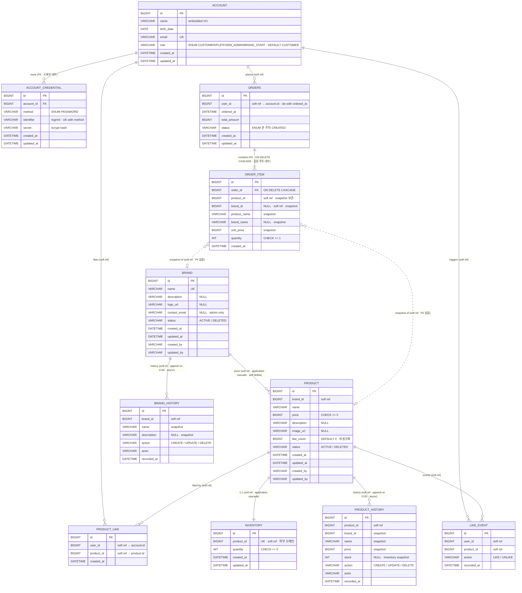

# Week 2 ERD · 전체 테이블 구조 및 관계

> 4개 도메인(Account · Brand · Product · Likes · Orders)에서 도출된 모든 테이블의 컬럼·제약·관계 종합본.
>
> **SSOT(Single Source of Truth) = `docs/week2/{도메인}/*-final.html`.** 본 문서는 4개 final HTML과 기존 `account-domain` 코드에서 컬럼/제약을 종합한 ERD입니다. 정의가 충돌하면 항상 `*-final.html`이 정답입니다.
>
> 본 문서는 **물리 ERD** — JPA `@Entity` 매핑이 만들어낼 실제 DB 스키마를 다룹니다. 도메인 모델(엔티티 책임 / VO / invariant)은 각 시나리오의 `*-final.html` Section 3 참조.

---

## 1. 범위 · 비범위

### 1.1 본 ERD 범위

| 테이블 | 도메인 | 비고 |
|---|---|---|
| `account` | Account | 코드 베이스 기존 — `role` 컬럼 추가 (본 주차 결정) |
| `account_credential` | Account | 코드 베이스 기존 (loginId/secret 저장) |
| `brand` | Brand | Week 2 신규 |
| `brand_history` | Brand | Week 2 신규 — after-only snapshot · append-only (CUD 시 비동기 append) |
| `product` | Product | Week 2 신규 |
| `product_history` | Product | Week 2 신규 — after-only snapshot · append-only |
| `inventory` | Inventory (외부 도메인) | Product와 1:1, 본 주차는 인터페이스만 합의 |
| `product_like` | Likes | Week 2 신규 — 현재 상태 · hard delete |
| `like_event` | Likes | Week 2 신규 — 이력 · append-only (LIKE / UNLIKE) |
| `orders` | Orders | Week 2 신규 (테이블명 `orders` — `ORDER`가 SQL 예약어) |
| `order_item` | Orders | Week 2 신규 — 스냅샷 immutable |

### 1.2 비범위

- `order_event` 주문 상태 전이 이벤트 outbox — 미래 카드 (O-F6, 결제 도입과 함께)
- 결제 / 멱등키 / 쿠폰 관련 테이블 — 미래 카드 (O-F1, O-F3, O-?6)
- Brand staff Role 분리에 따른 권한 매핑 테이블 — 미래 카드 (B-F1, P-F1, L-F2, O-F5)
- Inventory 내부 컬럼 분화(`available` / `reserved`) — 본 주차 미결정 (P-?4)
- `brand_history` / `product_history` 외부 노출 endpoint — 미래 카드 (B-F3, P-F4)

---

## 2. 전역 정책 (모든 테이블 공통)

본 ERD는 아래 정책을 전제로 합니다. 충돌이 있으면 `docs/conventions.md`와 final HTML이 정답.

### 2.1 Naming

- Spring Boot 기본 `SpringPhysicalNamingStrategy`: camelCase → snake_case (예: `AccountCredential` → `account_credential`)
- 테이블명은 단수형 (`brand` / `product` / `product_like` / `order_item`). 예외: `orders` — `ORDER`가 SQL 예약어이므로 복수형
- 컬럼명은 snake_case (`brand_id`, `like_count`, `ordered_at`)

### 2.2 BaseEntity 컬럼

표준 BaseEntity는 **4컬럼** — `created_at` / `updated_at` / `created_by` / `updated_by` (모두 NOT NULL, DATETIME(6) 또는 VARCHAR(50)).

- `created_by` / `updated_by` 는 actor 식별자 (관리자 헤더 `X-Loopers-Ldap` 또는 로그인 헤더 `X-Loopers-LoginId` 값).
- 모두 자동 채움. 응답 DTO 비노출.

**부분 채택 매트릭스:**

| 엔티티 | created_at | updated_at | created_by | updated_by | 근거 |
|---|:-:|:-:|:-:|:-:|---|
| `brand` / `product` | O | O | O | O | 표준 채택 (mutable + 관리자 actor 추적) |
| `orders` | O | O | — | — | `user_id`가 actor와 중복 · audit은 미래 `order_event` (O-F6) |
| `product_like` | O | — | — | — | immutable · `user_id`가 actor와 중복 · 이력은 `like_event` |
| `order_item` | O | — | — | — | 스냅샷 immutable |
| `brand_history` / `product_history` / `like_event` | (`recorded_at` 대체) | — | (`actor` 대체) | — | append-only · 자체 컬럼 사용 (BaseEntity 미상속) |

### 2.3 FK 정책 (★ HTML SSOT의 핵심 결정)

> `*-final.html`에서 반복 명시: **"DB 제약(FK) 없음. 모든 도메인 간 관계는 `brand_id` / `product_id` / `user_id` 같은 논리 참조(soft reference)일 뿐 DB 레벨 FK 제약을 두지 않는다. 무결성·cascade는 애플리케이션 레이어 책임."** (출처: 01-brand-final L767, 02-product-final L816, 03-likes-final L805, 04-orders-final L717)

| 관계 | DB FK 제약 | 정합성 책임 |
|---|---|---|
| `account_credential.account_id` → `account.id` | **있음** (FK · NOT NULL) | 같은 도메인 집합 내부 — JPA `@ManyToOne` |
| `order_item.order_id` → `orders.id` | **있음** (FK · NOT NULL · ON DELETE CASCADE) | 같은 집합 루트 내부 — JPA cascade persist |
| 도메인 간 모든 참조 (`product.brand_id`, `product_like.user_id` / `product_like.product_id`, `inventory.product_id`, `orders.user_id`, `order_item.product_id` / `order_item.brand_id`) | **없음** (soft reference) | Application 레이어 (Service 검증 + cascade 명시 호출) |

**결과:**
- ERD 상의 도메인 간 관계선은 "논리적" 관계 — DB 스키마에는 FK 제약이 존재하지 않음
- 무결성 위반은 SQL exception이 아니라 application 예외(`NotFoundException` 등)로 변환됨
- `BrandService.delete`는 `ProductService.deleteByBrand`를 명시적으로 호출 (DB ON DELETE CASCADE 의존 X)

### 2.4 식별자 외부 ↔ 내부 매핑

`ubiquitous-language.md` §4 준수.

| 외부 (API path / JSON) | 내부 (DB / 도메인) |
|---|---|
| `userId` | `account_id` (또는 단순히 `user_id` 컬럼명 유지 — `product_like` / `orders`) |
| `loginId` | `account_credential.identifier` |

**컬럼명 명명 규칙:** `product_like` · `orders` 테이블에서 사용자를 가리키는 컬럼은 **`user_id`로 명명** (외부 spec `userId`와 정렬, 또한 시나리오 final HTML 표기와 일치). 내부 application 레이어가 `accountId`로 다룬다.

---

## 3. 테이블 정의

### 3.1 `account`

기존 `modules/account-domain/src/main/kotlin/com/loopers/account/domain/Account.kt`. **본 주차 신규 컬럼: `role`** — Week 2의 Platform Admin 권한 축과 미래 Brand staff(B-F1 등) 확장을 데이터 모델에서 받아내기 위함.

| 컬럼 | 타입 | 제약 | 출처 |
|---|---|---|---|
| `id` | BIGINT | PK, AUTO_INCREMENT | BaseEntity |
| `name` | VARCHAR(N) | NOT NULL (`@Embedded AccountName` VO) | 코드 |
| `birth_date` | DATE | NOT NULL | 코드 |
| `email` | VARCHAR(N) | NOT NULL, UK (`uk_account_email`) | 코드 |
| **`role`** | VARCHAR(32) | NOT NULL, DEFAULT `'CUSTOMER'` (ENUM: `CUSTOMER`, `PLATFORM_ADMIN`, `BRAND_STAFF`) | 본 주차 결정 — `ubiquitous-language.md` §2 |
| `created_at` | DATETIME(6) | NOT NULL | BaseEntity |
| `updated_at` | DATETIME(6) | NOT NULL | BaseEntity |

**제약:** `UNIQUE KEY uk_account_email (email)` — 기존 코드

**role 컬럼 결정 배경:**
- `ubiquitous-language.md` §2의 Role 어휘(`Customer` / `Platform Admin` / `Brand Staff`)를 데이터 모델에서 받아내는 단일 컬럼
- 현재 운영 활성: `CUSTOMER` (회원가입 default). `PLATFORM_ADMIN`은 LDAP 헤더(`X-Loopers-Ldap=loopers.admin`)와는 별도 축이지만, account row에도 enum 값을 보유해 향후 LDAP 의존성 제거 시 자연 확장 가능
- `BRAND_STAFF`는 미래(B-F1 / P-F1 / L-F2 / O-F5) — enum 값만 미리 자리 잡음
- 응답 DTO 노출 여부는 결정 카드(미래 — admin 응답에만 노출하거나 미노출)

### 3.2 `account_credential`

기존 `modules/account-domain/src/main/kotlin/com/loopers/account/domain/AccountCredential.kt`. Account 1:N 매핑(현재 활성 method는 PASSWORD 단일).

| 컬럼 | 타입 | 제약 | 출처 |
|---|---|---|---|
| `id` | BIGINT | PK, AUTO_INCREMENT | BaseEntity |
| `account_id` | BIGINT | NOT NULL, **FK** → `account(id)` (도메인 내부 FK) | 코드 |
| `method` | VARCHAR(50) | NOT NULL (ENUM: `PASSWORD`, ...) | 코드 |
| `identifier` | VARCHAR(N) | NOT NULL (`@Embedded CredentialIdentifier` — loginId 저장) | 코드 |
| `secret` | VARCHAR(N) | NOT NULL (`@Embedded CredentialSecret` — bcrypt hash) | 코드 |
| `created_at` | DATETIME(6) | NOT NULL | BaseEntity |
| `updated_at` | DATETIME(6) | NOT NULL | BaseEntity |

**제약:** `UNIQUE KEY uk_account_credential_method_identifier (method, identifier)` — 기존 코드

### 3.3 `brand`

출처: `docs/week2/01-brand/01-brand-final.html` §4.

| 컬럼 | 타입 | 제약 | 출처 |
|---|---|---|---|
| `id` | BIGINT | PK, AUTO_INCREMENT | BaseEntity |
| `name` | VARCHAR(50) | NOT NULL, UK (`uk_brand_name`) | S-C1, S-C3, S-C4, S-U3 (B-?4) |
| `description` | VARCHAR(500) | NULL | B-?1 |
| `logo_url` | VARCHAR(500) | NULL | B-?1 |
| `contact_email` | VARCHAR(N) | NULL (관리자 응답에만 노출) | B-?1, B-?2 |
| `status` | VARCHAR(20) | NOT NULL · ACTIVE / DELETED | S-D1, B-?3 |
| `created_at` | DATETIME(6) | NOT NULL | BaseEntity |
| `updated_at` | DATETIME(6) | NOT NULL | BaseEntity, S-U1 |
| `created_by` | VARCHAR(50) | NOT NULL | BaseEntity |
| `updated_by` | VARCHAR(50) | NOT NULL | BaseEntity |

**제약:** `UNIQUE KEY uk_brand_name (name)` — S-C3, S-U3

**Soft delete (B-?3):** `status: ACTIVE → DELETED` 단방향 전이. hard delete 아님 — row 보존.

### 3.4 `product`

출처: `docs/week2/02-product/02-product-final.html` §4.

| 컬럼 | 타입 | 제약 | 출처 |
|---|---|---|---|
| `id` | BIGINT | PK, AUTO_INCREMENT | BaseEntity |
| `brand_id` | BIGINT | NOT NULL, **soft reference** (FK 없음) | P-C1, P-C3 |
| `name` | VARCHAR(100) | NOT NULL | P-C4, P-?1 |
| `price` | BIGINT | NOT NULL, CHECK ≥ 0 | P-R4, P-?1 |
| `description` | VARCHAR(1000) | NULL | P-?1 |
| `image_url` | VARCHAR(500) | NULL | P-?1 |
| `like_count` | BIGINT | NOT NULL, DEFAULT 0 (비정규화) | P-R4, P-?5, L-?3 |
| `status` | VARCHAR(20) | NOT NULL · ACTIVE / DELETED | P-D1, P-?6 |
| `created_at` | DATETIME(6) | NOT NULL | BaseEntity, P-R2 |
| `updated_at` | DATETIME(6) | NOT NULL | BaseEntity, P-U1 |
| `created_by` | VARCHAR(50) | NOT NULL | BaseEntity |
| `updated_by` | VARCHAR(50) | NOT NULL | BaseEntity |

**Cascade:** Brand 삭제 시 application 레벨에서 `BrandService.delete` → `ProductService.softDeleteByBrand` 호출 (S-D1). Product도 `status=DELETED`로 전이 (soft delete).

**Soft delete (P-?6):** `status: ACTIVE → DELETED` 단방향. 주문 스냅샷은 별도 도메인이라 영향 없음 — `order_item`이 product 정보를 자기 컬럼으로 보존 (P-D1).

**like_count 비정규화:** Likes 도메인의 토글(L-C1, L-D1)에서 동기 증감. `sort=likes_desc` (P-?3) 정렬 비용 절감. 비동기 집계로의 전환 여지는 L-F1.

> `stock` / `quantity` 컬럼은 `product`에 두지 않음 — 별도 `inventory` 테이블 소유 (P-?4).

### 3.5 `inventory` (외부 도메인 — Inventory)

출처: `docs/week2/02-product/02-product-final.html` §4. 본 주차는 **인터페이스만** 합의 — 컬럼 분화 / 동시성 메커니즘 / 이력은 Inventory 도메인 내부 결정.

| 컬럼 | 타입 | 제약 | 출처 |
|---|---|---|---|
| `id` | BIGINT | PK, AUTO_INCREMENT | BaseEntity |
| `product_id` | BIGINT | NOT NULL, **UK**, **soft reference** (FK 없음) | 1:1 매핑 |
| `quantity` | INT | NOT NULL, CHECK ≥ 0 | P-?4 (단일 quantity 시작) |
| `created_at` | DATETIME(6) | NOT NULL | BaseEntity |
| `updated_at` | DATETIME(6) | NOT NULL | BaseEntity |

**제약:** `UNIQUE KEY uk_inventory_product (product_id)` — 1:1 매핑 보장

**Cascade:** Product 생성 시 application 트랜잭션에서 `inventory` row 함께 생성. Product 삭제 시 함께 archive (P-?4 본문).

### 3.6 `product_like`

출처: `docs/week2/03-likes/03-likes-final.html` §4.

| 컬럼 | 타입 | 제약 | 출처 |
|---|---|---|---|
| `id` | BIGINT | PK, AUTO_INCREMENT | BaseEntity |
| `user_id` | BIGINT | NOT NULL, **soft reference** (FK 없음) — `account.id` 가리킴 | L-C1, L-R1 |
| `product_id` | BIGINT | NOT NULL, **soft reference** (FK 없음) — `product.id` 가리킴 | L-C1, L-C3 |
| `created_at` | DATETIME(6) | NOT NULL | BaseEntity |

> `updated_at` 없음 — toggle 도메인 immutable (출처 03-likes-final §3 "BaseEntity 부분 채택").

**제약:** `UNIQUE KEY uk_product_like_user_product (user_id, product_id)` — 도메인 유일성 (L-C4 / L-?1 멱등성 보장)

### 3.7 `orders`

출처: `docs/week2/04-orders/04-orders-final.html` §4. 테이블명 `orders` (예약어 회피).

| 컬럼 | 타입 | 제약 | 출처 |
|---|---|---|---|
| `id` | BIGINT | PK, AUTO_INCREMENT | BaseEntity |
| `user_id` | BIGINT | NOT NULL, **soft reference** (FK 없음) — `account.id` 가리킴 | O-C1, O-R4 |
| `ordered_at` | DATETIME(6) | NOT NULL | O-R1 |
| `total_amount` | BIGINT | NOT NULL | O-C1 |
| `status` | VARCHAR(32) | NOT NULL (본 주차 ENUM: `CREATED` 단일 값) | O-?1 |
| `created_at` | DATETIME(6) | NOT NULL | BaseEntity |
| `updated_at` | DATETIME(6) | NOT NULL | BaseEntity |

**인덱스:** `idx_orders_user_ordered_at (user_id, ordered_at)` — 본인 주문 목록 날짜 범위 조회 (O-R1)

### 3.8 `order_item`

출처: `docs/week2/04-orders/04-orders-final.html` §4. **주문 시점 스냅샷** 보존이 핵심.

| 컬럼 | 타입 | 제약 | 출처 |
|---|---|---|---|
| `id` | BIGINT | PK, AUTO_INCREMENT | BaseEntity |
| `order_id` | BIGINT | NOT NULL, **FK** → `orders(id)`, **ON DELETE CASCADE** (집합 루트 내부) | O-C1 |
| `product_id` | BIGINT | NOT NULL, **soft reference** (FK 없음) | O-C1, O-?4 |
| `brand_id` | BIGINT | NULL (스냅샷), **soft reference** (FK 없음) | O-?4, O-F5 |
| `product_name` | VARCHAR(255) | NOT NULL (스냅샷) | O-C1, O-?4 |
| `brand_name` | VARCHAR(50) | NULL (스냅샷) | O-?4 |
| `unit_price` | BIGINT | NOT NULL (스냅샷) | O-C1, O-?4 |
| `quantity` | INT | NOT NULL, CHECK ≥ 1 | O-C1, O-C5 |
| `created_at` | DATETIME(6) | NOT NULL | BaseEntity |

**스냅샷 정책:** Product / Brand 행이 삭제·변경되어도 `order_item`의 스냅샷 컬럼은 보존 (O-C1, big-picture 명시). 따라서 `product_id` / `brand_id`는 가리킴 정보만 보유하고 FK 제약은 두지 않음.

> `updated_at` 없음 — 스냅샷 immutable (출처 04-orders-final §3 "BaseEntity 부분 채택").

### 3.9 `brand_history` (after-only snapshot · append-only)

출처: `docs/week2/01-brand/01-brand-final.html` §4. CUD 시 비동기 append (실패 시 로깅만).

| 컬럼 | 타입 | 제약 | 출처 |
|---|---|---|---|
| `id` | BIGINT | PK, AUTO_INCREMENT | 감사 |
| `brand_id` | BIGINT | NOT NULL · **soft reference** (FK 없음) | S-C1, S-U1, S-D1 |
| `name` | VARCHAR(50) | NOT NULL · 변경 후 snapshot | 감사 |
| `description` | VARCHAR(500) | NULL · 변경 후 snapshot | 감사 |
| `action` | VARCHAR(20) | NOT NULL · CREATE / UPDATE / DELETE | S-C1, S-U1, S-D1 |
| `actor` | VARCHAR(50) | NOT NULL — 관리자 식별자 | 감사 |
| `recorded_at` | DATETIME(6) | NOT NULL | 감사 |

**append-only:** UPDATE / DELETE 없음 · CUD 마다 새 row append. brand 삭제 후에도 row 보존 (soft ref).

### 3.10 `product_history` (after-only snapshot · append-only)

출처: `docs/week2/02-product/02-product-final.html` §4. CUD 시 비동기 append (실패 시 로깅만).

| 컬럼 | 타입 | 제약 | 출처 |
|---|---|---|---|
| `id` | BIGINT | PK, AUTO_INCREMENT | 감사 |
| `product_id` | BIGINT | NOT NULL · **soft reference** (FK 없음) | P-C1, P-U1, P-D1 |
| `brand_id` | BIGINT | NOT NULL · snapshot | 감사 |
| `name` | VARCHAR(100) | NOT NULL · 변경 후 snapshot | 감사 |
| `price` | BIGINT | NOT NULL · 변경 후 snapshot | 감사 |
| `stock` | INT | NULL · Inventory에서 조회한 snapshot | 감사 |
| `action` | VARCHAR(20) | NOT NULL · CREATE / UPDATE / DELETE | P-C1, P-U1, P-D1 |
| `actor` | VARCHAR(50) | NOT NULL — 관리자 식별자 | 감사 |
| `recorded_at` | DATETIME(6) | NOT NULL | 감사 |

**append-only:** product 삭제 후에도 row 보존 (soft ref).

### 3.11 `like_event` (이력 · append-only · 신규)

출처: `docs/week2/03-likes/03-likes-final.html` §4. 토글 시 (LIKE / UNLIKE) 새 row append. `product_like`(현재 상태)와 책임 분리.

| 컬럼 | 타입 | 제약 | 출처 |
|---|---|---|---|
| `id` | BIGINT | PK, AUTO_INCREMENT | 신규 |
| `user_id` | BIGINT | NOT NULL · **soft reference** (FK 없음) | L-C1, L-D1 |
| `product_id` | BIGINT | NOT NULL · **soft reference** (FK 없음) | L-C1, L-D1 |
| `action` | VARCHAR(20) | NOT NULL · LIKE / UNLIKE | 신규 |
| `recorded_at` | DATETIME(6) | NOT NULL | 신규 |

**append-only:** UPDATE / DELETE 없음. UK 없음 — 같은 (user_id, product_id) 페어가 LIKE → UNLIKE → LIKE 식으로 여러 row 가질 수 있음. 책임: 통계 · 행동 분석 · 이력 보존 (미래 비동기 집계 소스 L-F1).

---

## 4. 통합 ER 다이어그램

---

## 5. 관계 요약표

| 관계 | 카디널리티 | DB FK | 정합성 책임 | 출처 |
|---|---|---|---|---|
| Account → AccountCredential | 1 : N | **FK 있음** (`account_id`) | 도메인 내부 — JPA `@ManyToOne` | `AccountCredential.kt` |
| Brand → Product | 1 : N | **FK 없음** (soft ref) | Application — `BrandService.delete` → `ProductService.softDeleteByBrand` (soft delete 전이) | 01-brand-final S-D1, 02-product-final §4 |
| Brand → BrandHistory | 1 : N | **FK 없음** (soft ref) | Application — CUD 시 비동기 append. 실패 시 로깅 | 01-brand-final §3·§4 |
| Product → ProductHistory | 1 : N | **FK 없음** (soft ref) | Application — CUD 시 비동기 append. 실패 시 로깅 | 02-product-final §3·§4 |
| Product → Inventory | 1 : 1 | **FK 없음** (UK + soft ref) | Application — Product 생성/삭제 트랜잭션 내 cascade | 02-product-final P-?4 |
| Account → ProductLike | 1 : N | **FK 없음** (soft ref) | Application — 회원 탈퇴 cascade는 미결정 | 03-likes-final §3 |
| Product → ProductLike | 1 : N | **FK 없음** (soft ref) | Application — Product 삭제 시 `like_count` / `product_like` 정리 | 03-likes-final §3, P-?5 |
| Account → LikeEvent | 1 : N | **FK 없음** (soft ref) | Application — 토글 시 비동기 append | 03-likes-final §3·§4 |
| Product → LikeEvent | 1 : N | **FK 없음** (soft ref) | Application — 토글 시 비동기 append | 03-likes-final §3·§4 |
| Account → Orders | 1 : N | **FK 없음** (soft ref) | Application — 본인 검증 | 04-orders-final O-C1, O-R4 |
| Orders → OrderItem | 1 : N | **FK 있음** (`order_id`, ON DELETE CASCADE) | 집합 루트 내부 — JPA cascade persist | 04-orders-final §4 |
| OrderItem → Product | N : 1 (soft) | **FK 없음** (스냅샷) | 무관 — 스냅샷 컬럼이 보존 | 04-orders-final O-?4 |
| OrderItem → Brand | N : 1 (soft) | **FK 없음** (스냅샷) | 무관 — 스냅샷 컬럼이 보존 | 04-orders-final O-?4, O-F5 |
| Orders → Inventory (협업) | — (직접 관계 아님) | — | 주문 트랜잭션 내 `InventoryService.decreaseAll` 동기 호출 | 04-orders-final O-C1, O-?2 |

---

## 6. 본 ERD가 받아내야 할 미래 확장

각 시나리오 final HTML의 §7 미래 카드와 직접 연결되는 ERD 상의 자리.

| 미래 카드 | 이번 주 ERD가 받아낸 것 |
|---|---|
| **B-F1 / P-F1 / L-F2 / O-F5** (Brand staff = Tenant) | `product.brand_id` 분리 유지 (비정규화 X), `order_item.brand_id` 스냅샷 보존, `account.role` 컬럼이 `BRAND_STAFF` enum 값 자리 보유 |
| **P-F2 / L-F1 / O-F4** (행동 데이터 기반 랭킹) | `product.like_count` 비정규화 컬럼, `orders.ordered_at` 시계열 인덱스, `order_item` 스냅샷 보존 — 후속 배치 ETL이 붙기 쉬움 |
| **O-F1 / O-F2 / O-?6** (결제 / 취소 / 환불 / 멱등키) | `orders.status` enum 자리 (현재 `CREATED` 단일 값에서 `PAID` / `CANCELLED` 등 enum 추가만으로 확장), `order_item` immutable 스냅샷 (환불은 별도 RefundLog로 분리 가능) |
| **O-F3** (쿠폰) | `orders.total_amount`가 단일 컬럼 — `applied_discount` / `coupon_id` 컬럼 추가 자리 보유 |
| **Inventory 내부 결정** (P-?4 후속) | `inventory.quantity` 단일 컬럼에서 `available` / `reserved` 분리로 확장 가능. 외부(Order 도메인)에서 보는 인터페이스는 동일 유지 |

---

## 7. 출처 · 변경 정책

- 시나리오 정의: `docs/week2/{01-brand,02-product,03-likes,04-orders}/{도메인}-final.html` (★ SSOT)
- 시나리오 종합본: `docs/week2/{도메인}/*.md` (HTML 기반 정제본)
- 요구사항 종합: `docs/design/01-requirements.md`
- 어휘/Role/식별자 매핑: `docs/ubiquitous-language.md`
- 코드 베이스 (account 기존 구조): `modules/account-domain/src/main/kotlin/com/loopers/account/domain/{Account,AccountCredential}.kt`
- FK 정책 (soft reference) 출처: `docs/conventions.md` + 각 final HTML §4 말미

**변경 규칙:**
- 시나리오 변경 시 → 해당 `*-final.html` 수정 → 본 ERD 동기화
- 컬럼 추가/제거는 해당 시나리오 final HTML §3·§4가 먼저 변해야 본 ERD가 따라감 (역방향 금지)
- `account.role` enum 값 변경은 본 문서 §3.1 + `ubiquitous-language.md` §2 양쪽 갱신 필요
