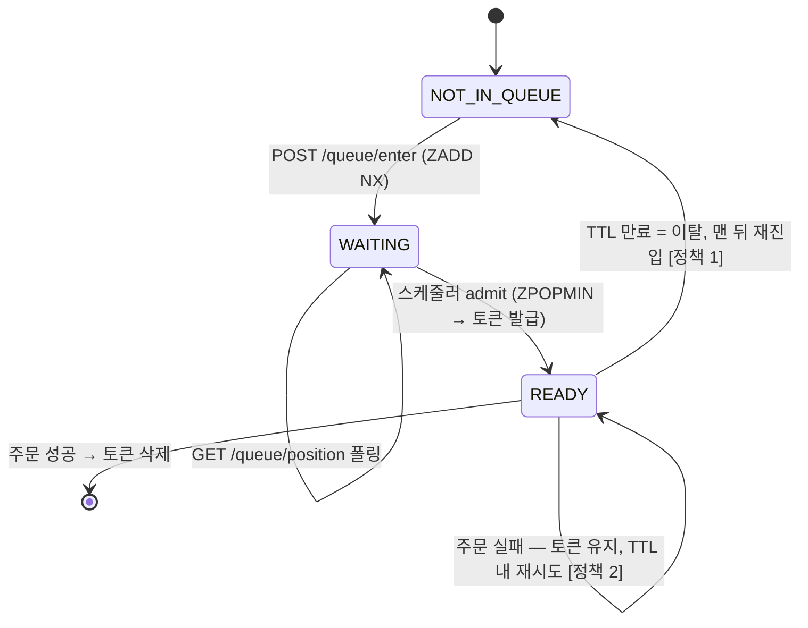
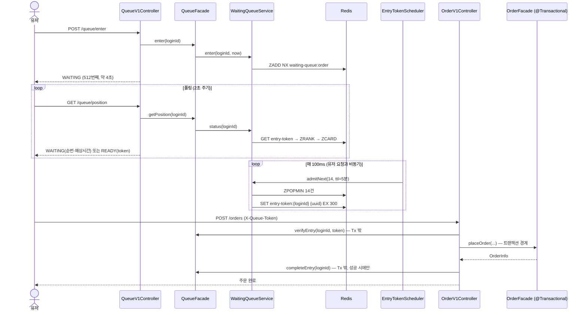
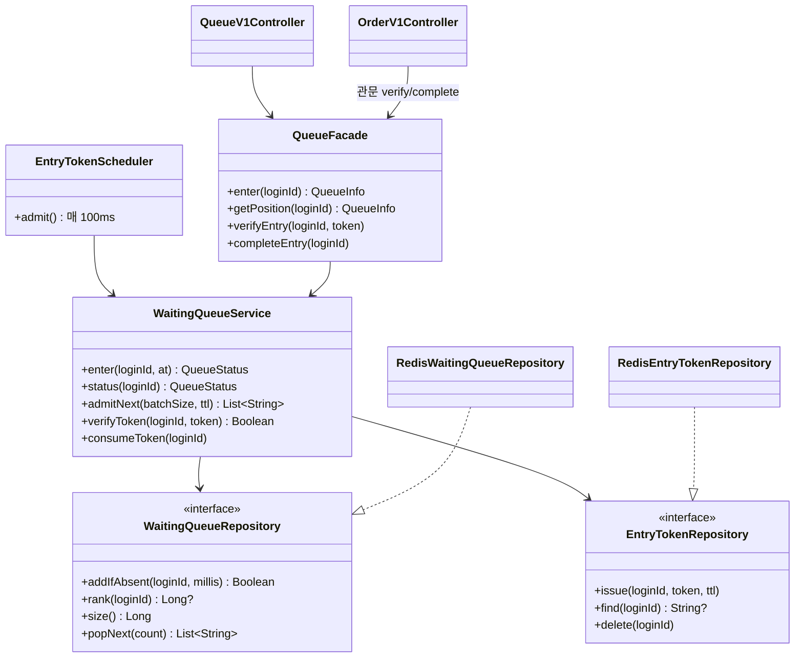

# R8 주문 대기열 시스템 설계서

> 블랙 프라이데이급 트래픽에서 주문 API를 보호하면서, 유저에게 공정한 순서와 실시간 피드백을 제공하는 대기열 설계.

## 1. 문제 재정의

표면 요구는 "Redis 대기열 + 토큰 + 스케줄러 + 폴링"이지만, 실제 문제는 다음과 같다.

> **하류 처리 용량(DB 커넥션 40개)은 고정인데 유입이 100배 폭증하는 순간, 초과 수요를 '거부'하지 않고
> '시간축으로 재배치'하되, 그 재배치가 선착순으로 공정하고 유저에게 보이게 만드는 문제.**

| 관점 | 문제 정의 |
|---|---|
| 사용자 | "512번째, 약 4초"가 보이면 기다리고, 안 보이면 새로고침한다. **가시성이 곧 이탈 방지 장치** |
| 비즈니스 | 429 거부는 매출 기회 손실. Token Conversion Rate가 대기열 품질의 최종 지표 |
| 시스템 | Back-pressure 밸브. 유입 속도를 하류 감당 속도(≈140 TPS)로 변환. **부하 제거가 아니라 평탄화** |

## 2. 정책 결정 로그 (2026-07-07 합의)

| # | 결정 사항 | 선택 | 근거 / 트레이드오프 |
|---|---|---|---|
| 1 | 토큰 만료 유저 | **맨 뒤로 재진입** | 만료 = 이탈로 간주. 만료 이력 상태를 두지 않아 단순하고 어뷰징 여지 없음. 네트워크 문제로 놓친 유저에게 가혹한 것은 감수 |
| 2 | 주문 실패 시 토큰 | **TTL 내 재시도 허용** | 토큰 = "TTL 동안의 입장 자격"(입장권 1회 아님). 성공 시에만 삭제. 쿠폰 실수 등 유저 잘못 아닌 실패에 재줄서기 강요하지 않음 |
| 3 | 만료분 보충 발급 | **고정 배치** | 스케줄러는 고정 속도 밸브(14명/100ms). 만료율이 높으면 실 처리량이 설계치를 밑도는 것은 Token Expiry Rate 지표로 감지해 운영에서 배치 크기 조정 |
| 4 | Redis 장애 | **수동 bypass 스위치** | `queue.enabled=false`로 사람이 우회 결정. 오탐 없이 확실하나 대응까지 지연 — 블프 당일 온콜 상주 전제 |

### 전제 가정
- 스케줄러 단일 인스턴스 전제 (다중화·리더 선출은 범위 외)
- 대기열 범위: 주문 API 전체에 글로벌 큐 1개 (상품/행사별 분리는 확장 시나리오)
- 어뷰징 경계: `X-Loopers-LoginId` 인증 전제. 비로그인 핑거프린트는 범위 외
- 평시(대기 0명): enter 후 다음 스케줄러 틱(≤100ms)에 토큰 발급 — 체감 지연은 폴링 1회 수준으로 수용

### bypass 스위치 동작 정의 (Runbook)
`queue.enabled=false` 시:
- `POST /queue/enter`, `GET /queue/position` → 즉시 `READY`(token 없이) 응답 — 대기 중이던 유저가 붕 뜨지 않게
- 주문 API 관문(verify/complete) → 검증 생략, 통과
- 복구 후 `true` 전환 시 대기열은 빈 상태에서 재시작 (기존 ZSet 잔여 데이터는 유효)

## 3. 개념 모델

**액터**: 유저(구매자) / 스케줄러(시스템 액터) / 운영자(장애 시 스위치 조작)

**핵심 도메인 개념**

| 개념 | 책임 | 불변식 |
|---|---|---|
| 대기열 (WaitingQueue) | 순서가 보장된 대기자 집합 | 한 유저는 한 자리만 점유 (중복 진입 불가) |
| 입장 토큰 (EntryToken) | TTL 동안 유효한 주문 진입 자격 | 유저당 최대 1개 |
| 관문 (Gate) | 주문 API 앞단에서 토큰 검증/회수 | 유효 토큰 없이는 주문 진입 불가 |

**유저 상태는 정확히 한 곳에만 존재한다**: ZSet에 있으면 `WAITING`, 토큰 키가 있으면 `READY`, 둘 다 없으면 `NOT_IN_QUEUE`.

### 상태 전이

정책 4개가 모두 "상태 전이의 엣지"에 대한 결정이므로, 전이도 한 장이 정책 합의를 검증한다.



- `WAITING → READY` 전이의 주체는 유저가 아니라 **스케줄러**다. 유저는 폴링으로 인지만 한다.
- `READY`에서 나가는 두 경로(성공 vs 만료)가 정책 1·2의 구현 지점이다.

## 4. 시퀀스 다이어그램 — 책임 분리와 트랜잭션 경계

관문 검증/토큰 회수가 주문 트랜잭션의 안인지 밖인지를 검증하기 위한 다이어그램.



**읽는 포인트**
- `verifyEntry`/`completeEntry`는 **주문 트랜잭션 밖**이다. Redis 연산을 DB 트랜잭션에 묶으면 Redis 지연이 커넥션 점유 시간을 늘려 — 대기열이 보호하려던 커넥션 풀을 대기열이 갉아먹는 모순이 생긴다.
- `completeEntry`가 `placeOrder` **성공 후에만** 호출된다. 주문이 예외로 실패하면 토큰이 남는다 → 정책 2가 코드 "순서"로 구현된다. 별도 분기 없음.
- 주문 이후 흐름(이벤트 발행 → Outbox → Kafka → collector)은 R7 파이프라인 그대로. 대기열은 앞단 관문일 뿐 주문 도메인을 변경하지 않는다.

## 5. 클래스 다이어그램 — 의존 방향

대기열이 주문 도메인에 의존하지 않는 단방향 관문인지, domain 레이어가 Redis를 모르는지(의존성 역전)를 검증.



**읽는 포인트**
- 의존은 주문 → 대기열 한 방향뿐(`OrderV1Controller → QueueFacade`). queue 패키지는 order를 import하지 않는다 → 쿠폰 발급 등 다른 API 앞단에도 재사용 가능.
- `OrderFacade`는 대기열의 존재를 모른다 → 기존 주문 통합 테스트가 깨지지 않고, 관문 책임이 컨트롤러 진입점에 명시적으로 드러난다.
- Repository 인터페이스가 domain에 있고 Redis 구현체는 infrastructure에 → 기존 레이어드 아키텍처 규칙(ArchitectureTest) 준수.

## 6. 저장 구조 — Redis 키 스키마 (ERD 대응)

영속 구조가 RDB가 아니므로 관계 대신 **키 설계와 원자성 단위**를 검증한다.

| 키 | 타입 | 구조 | 소멸 시점 |
|---|---|---|---|
| `waiting-queue:order` | Sorted Set | member=loginId, score=진입 epoch millis | 스케줄러 ZPOPMIN으로 소비 |
| `entry-token:order:{loginId}` | String | UUID 토큰 | TTL 300s 자동 만료 or 주문 성공 시 DEL |

| 연산 | Redis 명령 | 원자성이 해결하는 문제 |
|---|---|---|
| 진입 | `ZADD NX` | check-then-act 없이 중복 진입 방지 (기존 score 유지 → 재요청해도 순번 안 밀림) |
| 순번 | `ZRANK` | 0-based rank → +1 해서 1-based 순번 |
| 입장 | `ZPOPMIN n` | 읽기+삭제가 한 명령 → 스케줄러 다중 실행에도 중복 발급 없음 |
| 토큰 | `SET EX` / `GET` / `DEL` | TTL 만료를 Redis에 위임 — 만료 배치 불필요 |

**읽기 일관성**: 순번 조회까지 master에서 읽는다. 진입 직후 replica 복제 지연으로 rank가 null이면 유저에게 "대기열에 없음"으로 보여 재진입(새로고침)을 유발한다 — 대기열은 정합성이 곧 UX다. 폴링 부하는 ZRANK O(log N)이라 Redis 기준 무시 가능.

## 7. 처리량 설계 — 스케줄러 배치 크기 산정

이 프로젝트의 실제 설정값 기준:

```
HikariCP maximum-pool-size : 40        (modules/jpa/src/main/resources/jpa.yml)
주문 1건 평균 처리 시간      : ~200ms   (재고 비관적 락 + 쿠폰 + 주문 저장, 실측 보정 예정)

이론 최대 TPS  = 40 / 0.2          = 200 TPS
안전 마진 70%  = 200 × 0.7         = 140 TPS   ← 커넥션은 주문 외 API·스케줄러도 사용
발급 분할      = 140 TPS ÷ 10틱     = 14명 / 100ms (Thundering Herd 평탄화)
```

- 1초 140명 일괄 발급 대신 100ms마다 14명 → 순간 동시 진입이 1/10로 평탄화된다.
- 예상 대기 시간 = ⌈내 순번 ÷ 140⌉ 초. 토큰 만료·주문 실패 재시도 등 변수로 **추정값**이며, 클라이언트에는 "약 N초"로 표기한다.
- 200ms는 추정치다. k6 실측 후 배치 크기를 보정한다 — 고정 배치 정책이므로 이 보정이 운영 절차의 일부다.

## 8. 잠재 리스크

| # | 리스크 | 내용 | 결정 (2026-07-07) |
|---|---|---|---|
| 1 | admit 순간 상태 공백 | ZPOPMIN 후 SET 전(ms 구간)에 폴링이 오면 NOT_IN_QUEUE로 응답 → 클라이언트가 곧장 재진입하면 맨 뒤로 밀림 | **수용** — 문제 발생 여부를 측정으로 먼저 검증. 실측에서 관찰되면 Lua 원자화 재검토 |
| 2 | 스케줄러 단일 장애점 | 멈추면 아무도 입장 못함. 다중 인스턴스 시 발급 속도가 인스턴스 수배로 증가 | **범위 외** — 스케줄러 단일 인스턴스 전제. 다중화는 고려하지 않음 |
| 3 | 검증~주문 사이 만료 | verifyEntry 통과 직후 TTL 만료돼도 주문은 진행 | 관문 통과 시점 기준으로 유효 정의(정책). completeEntry의 DEL은 멱등이라 무해 |
| 4 | bypass 전환 시 잔여 대기자 | 스위치 off 시 WAITING 유저가 붕 뜸 | enter/position이 즉시 READY 응답하도록 정의(위 Runbook) — 클라이언트 수정 불필요 |
| 5 | 설계치의 가정 의존 | 평균 200ms는 추정 | k6 실측 → 배치 크기 보정. Token Expiry Rate > 30% 시 TTL·배치 재검토 |

## 9. 운영 지표

| 지표 | 수집 | 경보 기준 |
|---|---|---|
| Queue Depth | `ZCARD` 주기 수집 | 급증 = 유입 > 처리량 |
| Token Expiry Rate | 발급 수 대비 미사용 만료 수 | > 30% — TTL/UX 점검 |
| Token Conversion Rate | 토큰 발급 → 주문 완료 비율 | < 50% — 대기 경험 점검 |
| Scheduler Health | 마지막 admit 실행 시각 | 1분 미실행 시 알림 |

## 10. API 계약

```
POST /api/v1/queue/enter        (X-Loopers-LoginId)
→ { status: WAITING|READY, position, totalWaiting, estimatedWaitSeconds, token? }
  - 이미 대기 중이면 기존 순번 유지, 이미 READY면 토큰 재응답 (멱등)

GET /api/v1/queue/position      (X-Loopers-LoginId)   ← 2초 폴링
→ 동일 스키마. NOT_IN_QUEUE면 재진입 필요 신호

POST /api/v1/orders             (X-Loopers-LoginId, X-Queue-Token)
→ 토큰 검증 실패 시 403 FORBIDDEN. 성공 시 토큰 삭제 후 R7 파이프라인 진행
```
