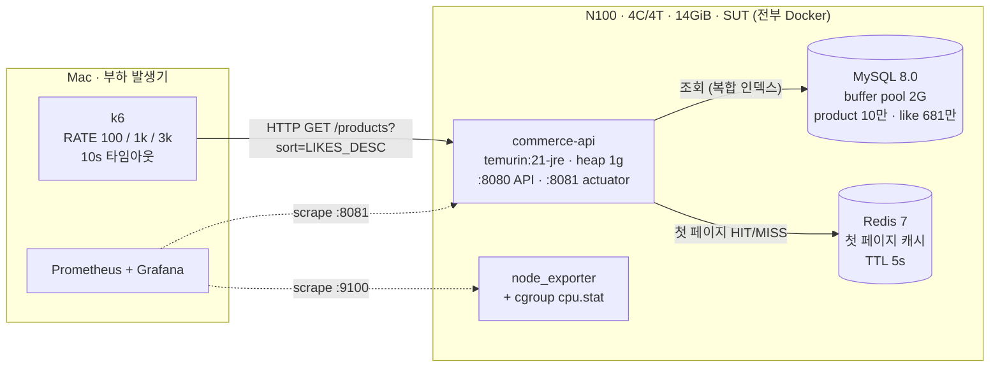
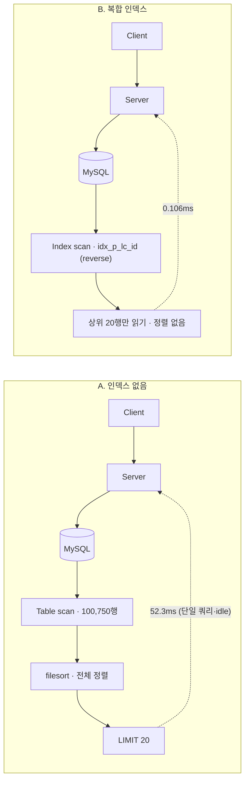
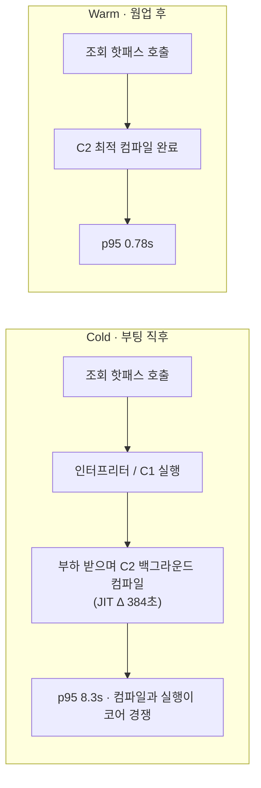
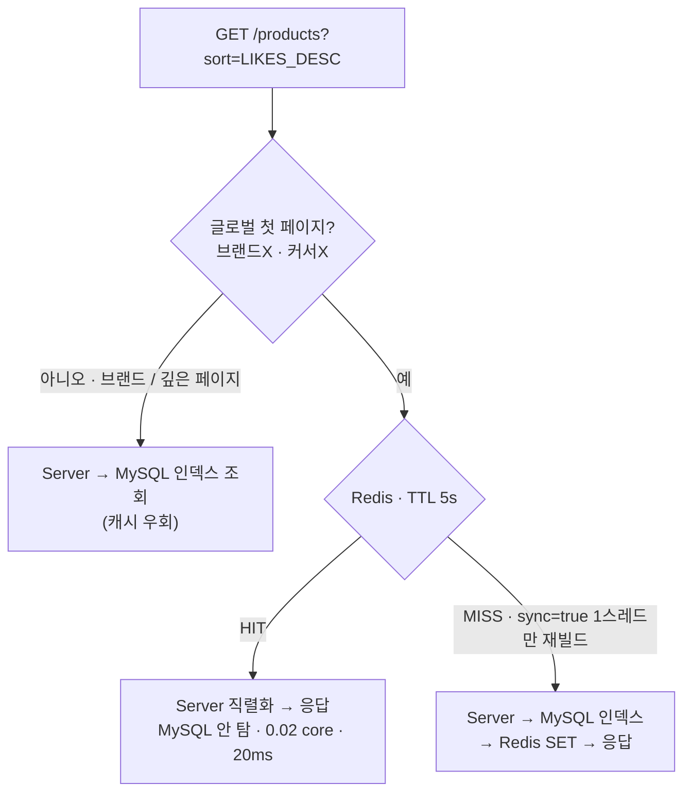

# Week 5 — 읽기 성능 최적화 결정 문서 (인덱스 · JVM 웜업 · 캐시)

> 좋아요순 상품 목록 조회의 읽기 병목을 인덱스·캐시로 개선하고, 단일 박스(N100)에서 부하 측정으로 각 선택을 검증한 기록.

---

## 공통 측정 환경 (Setup)

### 하드웨어 · 구성

| 역할 | 항목 | 사양 |
|---|---|---|
| **SUT (측정 대상)** | 머신 | Intel N100 4C/4T · 14GiB · 512GB NVMe |
| | OS / 런타임 | Ubuntu Server 26.04 · Docker 29 |
| | app | `commerce-api` · eclipse-temurin:21-jre · heap 1g |
| | DB | MySQL 8.0 · innodb buffer pool 2G |
| | cache | Redis 7 · 첫 페이지 캐시 TTL 5s |
| | 자원 정책 | **CPU 제한 없음** — app·MySQL·Redis가 4코어 경쟁 |
| **부하 발생기** | 머신 | Mac → 공인 IP |
| | 도구 | k6 · 요청 10s 타임아웃 · 측정 3분/런 |
| **데이터** | 규모 | product 100,750 · product_like 6,814,195 · brand 500 |
| | 분포 | 멱법칙 4티어 · 불변식 `like_count == COUNT` 검증 |

- **대상 쿼리**: `GET /api/v1/products?sort=LIKES_DESC` → `ORDER BY like_count DESC, id DESC LIMIT 20`
- **요청 10s 타임아웃**(프론트 표준: axios 관례 + Nielsen 10초 한계) → 포화를 "SLA 위반율"로 측정
- **모니터링**: 컨테이너별 CPU = cgroup v2 `cpu.stat` 직접 샘플링(Docker 29 containerd 스냅샷터로 cAdvisor 비호환) · 호스트 CPU·PSI = node_exporter · JVM(JIT/GC/Hikari) = Actuator → Prometheus

### 토폴로지 — 요청 흐름 & 각 박스 구성

---

## 결정 1. 좋아요순 조회 — 복합 인덱스

### Question

- **결정해야 했던 것**: 좋아요순 정렬 조회를 인덱스 없이 둘 것인가, 복합 인덱스를 걸 것인가
- **후보**: A) 인덱스 없음(PK만) vs B) 복합 인덱스 `idx_p_lc_id(like_count, id)` + `idx_p_brand_lc_id(brand_id, like_count, id)`

### Results (warm 기준)

| 항목 | A. 인덱스 없음 | B. 복합 인덱스 |
|------|---|---|
| 실행계획 | `Table scan(100,750행) + Sort(filesort)` | `Index scan idx_p_lc_id (reverse)` · **Sort 없음** |
| 단일 쿼리 실측(EXPLAIN ANALYZE) | 52.3ms | **0.106ms** |
| p99 레이턴시 (100 TPS) | 10,000ms (대부분 타임아웃) | **18.5ms** |
| Throughput @100 offered | 92.6 RPS | **100 RPS** |
| Throughput @1,000 offered | 131 RPS (천장) | **978 RPS** |
| Throughput @3,000 offered | 285 RPS (천장) | **937 RPS** |
| 에러율 (100 TPS) | 82% | **0%** |

### 경로 비교 — 어떻게 타는가 (Server → DB)

> 같은 `Client → Server → MySQL` 경로지만, **MySQL 내부 작업**이 다르다 — A는 전체 스캔+정렬, B는 인덱스 순서로 20행만.

### Decision

- **선택**: **B. 복합 인덱스**
- **선택 이유**:
  - 인덱스 없는 정렬은 매 요청 10만 행 풀스캔 + filesort → MySQL이 정렬에만 **2.5~3.6 코어**를 태우고, 100 TPS도 못 버팀(실패 82%, p95 ~10s).
  - 복합 인덱스는 **정렬 키 순서로 저장**돼 있어 filesort가 통째로 사라짐(52.3ms → 0.106ms). 단일 박스 처리 천장이 **~100 RPS → ~950 RPS (약 10배)**.
  - 비용은 `CREATE INDEX` 선언 한 번 + 쓰기 시 인덱스 유지 오버헤드뿐. 읽기 이득 대비 압도적.
- **포기한 것**: 쓰기 약간의 인덱스 유지 비용, 인덱스 저장 공간. (읽기:쓰기 비율상 무시 가능)

---

## 결정 2. JVM 웜업 — 측정 분리 이유 & 배포 전략

### Question

- **결정해야 했던 것**: 측정에서 cold JVM과 warm JVM을 구분할 것인가. 그리고 **운영 배포 시 새 인스턴스를 어떻게 투입할 것인가**
- **후보**: A) 부팅 직후 바로 풀 트래픽(cold) vs B) 웜업 후 풀 트래픽(warm)

### Results — cold vs warm (indexing, 동일 조건)

| 항목 | A. cold(부팅 직후) | B. warm(웜업 후) |
|------|---|---|
| p95 (1,000 TPS) | 8,345ms | **781ms** |
| Throughput (1,000 TPS) | 614 RPS | **978 RPS** |
| p95 (3,000 TPS) | 9,033ms | **4,253ms** |
| JIT 컴파일량 Δ (3분간) | **384,319ms** (부하 받으며 컴파일) | 19,535ms |

> 참고: baseline(인덱스 없음)에서는 cold ≈ warm — 병목이 MySQL filesort라 JVM 웜업이 묻힌다. **웜업 효과는 CPU 바운드(인덱스 적용 후)일 때만 드러난다.**

### JVM 내부 — cold vs warm

### 배포 전략 — 점진적 트래픽 램프로 웜업

> cold 인스턴스에 풀 트래픽을 바로 꽂으면 위 cold 곡선(p95 8.3s) 재현 → 카나리 / LB slow-start 로 데운 뒤 올린다.

### Decision

- **선택**: 측정은 **cold/warm 분리**, 운영 투입은 **점진적 트래픽 램프(warm 후 풀 투입)**
- **왜 웜업을 따로 측정했나 (의미)**:
  - HotSpot Tiered Compilation은 핫 메서드가 호출 임계치(Tier4/C2 ≈ 5,000회)를 넘어야 C2로 최적 컴파일된다. **부팅 직후엔 조회 핫패스가 인터프리터/C1로 돌고, 부하를 받으며 백그라운드에서 C2 컴파일**이 일어난다.
  - 그 결과 cold JVM은 측정 3분 동안 **JIT 컴파일에만 384초**(스레드 합산)를 쓰며 p95가 8.3초까지 치솟는다. warm은 웜업 1분에 컴파일을 끝내 781ms.
  - 이 cold 페널티를 "인덱스/캐시의 정상 성능"과 **섞으면 측정이 오염**된다. 그래서 cold/warm을 분리해 **순수 웜업 비용**을 따로 본 것.
- **실제 배포 전략 (핵심)**:
  - 새 인스턴스를 배포할 때 **부팅 직후 풀 프로덕션 트래픽을 그대로 꽂지 않는다.** cold JVM에 풀 트래픽을 주면 위 cold 곡선(p95 8s) 그대로 재현 → 지연 스파이크 + health/SLA 위반 위험.
  - 대신 **트래픽을 조금씩 나눠 넣어 웜업**한다: 카나리/가중치 롤아웃 또는 LB slow-start로 **가벼운 트래픽으로 먼저 JIT를 데우고**, 핫패스가 C2로 컴파일된 뒤 점진적으로 풀 트래픽으로 올린다.
  - 이번 측정의 "웜업 1분 램프 → 본 측정 3분" 절차가 바로 이 배포 시나리오의 축소판이다.
- **포기한 것**: 배포 직후 즉시 풀 캐파 도달(점진 램프라 풀 트래픽까지 수십 초~수 분 지연). 대신 **지연 스파이크·SLA 위반을 회피**.

---

## 결정 3. 캐시 — "첫 페이지만" Redis 캐싱

### Question

- **결정해야 했던 것**: (1) 캐시를 적용할 것인가 (2) 적용한다면 어디까지 캐시할 것인가
- **후보**: A) 인덱스만(캐시 없음) vs B) **글로벌 첫 페이지만** Redis 캐시(`@Cacheable sync=true`, TTL 5s). 브랜드 필터·깊은 페이지(커서)는 캐시 우회 후 인덱스 직행

### Results (indexing · warm · 글로벌 첫 페이지 100%)

> 부하 프로파일 주의: 이 실험은 캐시 효과를 격리하려 **100% 글로벌 첫 페이지**(단일 키)로 부하를 줬다. 결정 1·종합결론의 천장(~950 RPS)은 **혼합 부하**(70% 글로벌 + 30% 브랜드 필터)라, 같은 "indexing·캐시 없음"이라도 여기 cache-OFF 천장(1,600 RPS)이 더 높다(단일 쿼리 반복이라 버퍼·플랜이 더 핫). 모순이 아니라 부하 구성 차이.

| 항목 | A. 캐시 OFF | B. 캐시 ON |
|------|---|---|
| p95 (1,000 TPS) | 764ms | **20ms** |
| p99 (1,000 TPS) | 3,098ms | **45ms** |
| Throughput (1,000 TPS) | 983 RPS | **1,000 RPS** |
| Throughput (3,000 TPS) | 1,600 RPS | **2,609 RPS (+63%)** |
| 에러율 | 0.2% | 0% |
| **MySQL CPU** (1,000 TPS) | 0.96 core | **0.02 core** (DB offload) |
| app CPU (1,000 TPS) | 2.05 core | 1.47 core |
| Redis CPU | — | **0.01 core** (무시 가능) |
| 호스트 CPU (1,000 TPS) | 77% | **42%** |

### 경로 — 어떻게 타는가 (Server / Cache / DB)

> 캐시 OFF는 모든 요청이 `Server → MySQL`(app 2.05c). ON은 글로벌 첫 페이지가 `Server → Redis`(HIT 시 DB 안 탐, MySQL 0.02c). 브랜드·깊은 페이지는 캐시를 우회해 인덱스로.

### Decision

- **선택**: **B. 글로벌 첫 페이지만 캐시**
- **왜 캐시를 적용했나**: 인덱스로 DB는 0.1ms가 됐지만, 고부하에서 앱이 직렬화·요청처리로 CPU를 쓰며 천장(약 1,600 rps)이 생겼다(1,000 TPS에서도 p95 764ms로 압박). 캐시 적중 시 **DB 조회 + 엔티티 매핑을 건너뛰어** 앱 부하를 줄이고 천장을 +63% 밀어냈다. MySQL은 사실상 idle(0.02 core)로 떨어졌다.
- **왜 "첫 페이지만"인가 (의미)**:
  - 좋아요순 리스트는 **보이는 페이지가 항상 멱법칙 head**(고카운트). 저카운트·변동 큰 꼬리는 이 리스트의 보이는 페이지에 안 나타난다 → **stale 무해**.
  - 글로벌 첫 페이지는 **단일 핫키**라 모든 트래픽이 한 키에 집중 → **적중률 최고**(키 폭발 없음).
  - 브랜드 필터·깊은 페이지는 캐시를 우회해 **인덱스가 처리**(이미 충분히 빠름) → 캐시 키 폭발 회피.
  - `sync=true`로 핫키 만료 시 **single-flight**(한 스레드만 재빌드)로 stampede를 단일화.
- **포기한 것**:
  - **카운트/순서의 실시간성**(TTL 5s만큼 지연). head에선 imperceptible해 수용.
  - 3,000 TPS 캐시 ON에서 **5s TTL + sync의 주기적 재빌드 stall** 관측(p95 1,757ms, p50 42ms로 bimodal) → TTL을 길게(30~60s)+refresh-ahead로 완화 여지(후속).
  - `@Cacheable`은 **객체 캐시**라 적중해도 **HTTP 직렬화 비용은 잔존**(앱 코어 부분만 감소). 더 밀려면 직렬화 바이트 캐싱(후속).

### 제외한 대안과 이유

| 대안 | 무엇 | 제외 이유 |
|---|---|---|
| **Redis SortedSet (ZSET)** | `score = like_count` 랭킹을 Redis에 두고 `ZRANGE`로 조회 | 브랜드 필터를 인코딩 못 함 → per-brand ZSET 수백 개 fan-out(쓰기·정합성·운영 폭증). `like_count` 동점이 산더미라 keyset 커서 처리가 지저분. **필터 차원이 늘수록 조합 폭발** → 글로벌 top-N 고정창에만 적합 |
| **Materialized View** | 정렬 결과를 별도 랭킹 테이블로 미리 만들어 주기 갱신 | "정렬을 얼려 stale 수용"이라는 핵심을 **첫 페이지 TTL 캐시가 인프라 추가 없이** 동일하게 달성. 별도 테이블 + 갱신 스케줄러 + 정합성 관리는 이 규모에 과함(YAGNI). 사실상 캐시가 가벼운 MV 역할 |
| **전체 페이지 캐싱 (every page)** | 첫 페이지뿐 아니라 모든 커서 페이지를 캐시 | 깊은 페이지는 트래픽이 극소인데 **커서별로 키가 폭발** → 적중률 급락. 게다가 인덱스로 이미 0.1ms라 캐시 이득이 미미. **핫키(첫 페이지) 하나만** 캐시가 적중률·비용 최적 |
| **Redis 카운터 overlay** | 순서는 캐시, `like_count`만 `INCR`+`MGET`으로 매 요청 실시간 덧씌움 | head는 멱법칙상 +1이 화면에 안 보여 **stale 카운트 무해** → overlay 복잡성·매 요청 MGET 불필요. 실시간 카운트가 필요한 곳은 **상세 페이지**뿐이라 거기서만 처리 |

> 핵심: 위 대안들은 **브랜드 필터·다차원 필터·깊은 페이지**가 들어오는 순간 키 폭발/정합성 비용이 커진다. 그 영역은 **인덱스가 질의 시점에 처리**하게 두고, 캐시는 **변하지 않고 트래픽이 몰리는 단일 핫키(글로벌 첫 페이지)** 에만 surgical하게 적용하는 게 최소 비용·최대 적중이다.

### 좋아요 "순서"를 캐시해도 되는 근거 (멱법칙)

- 좋아요 분포가 멱법칙이라 **상위권은 절대 카운트도 크고 인접 갭도 크다**(예: 58,991 vs 48,000). 반면 신규 좋아요 유입은 분당 소수.
- 역전까지 걸리는 시간 ≈ `인접 갭 / 유입속도` → head에선 **수시간~수일**. 즉 **분 단위 TTL이면 역전은 사실상 0**.
- 게다가 5만 옆의 +1은 화면상 보이지 않으니 **카운트 값도 stale로 둬도 무방**.
- 따라서 "변동하는 정렬 키(like_count)"라는 어려운 조건임에도, **head만 캐시하면 순서·카운트 모두 안정적** — 정렬을 의도적으로 "얼려서" 지연을 수용하는 게 안전하다.
- (반례 경계) 다른 정렬(가격순·최신순)에서 저카운트 상품에 좋아요 수를 띄우면 stale이 보일 수 있으므로, 그건 상세 페이지 등 다른 서피스에서 실시간(예: Redis 카운터)으로 처리.

---

## 종합 결론

| 단계 | 적용 | 효과(측정) | 본질 |
|---|---|---|---|
| 1. 인덱스 | `idx_p_lc_id`, `idx_p_brand_lc_id` | p95 9,997→13.9ms(719x), 천장 ~100→~950 RPS | filesort 제거 = **하중을 받치는 핵심 변화** |
| 2. JVM 웜업 | 측정 분리 + 점진 배포 | cold p95 8.3s → warm 0.78s | CPU 바운드일 때만 유효, **배포 시 트래픽 램프 필수** |
| 3. 첫 페이지 캐시 | Redis, sync=true, TTL 5s | 천장 1,600→2,609 RPS(+63%), MySQL offload | 병목을 앱 CPU에서 **한 핫키로 흡수** |

- **인덱스가 본질적 해결**이고, 캐시는 **앱 CPU 천장을 더 미는 surgical 레버**다.
- 측정이 일관되게 가리키는 다음 병목은 **앱 CPU(직렬화)** → 후속은 바이트 캐싱 / TTL 튜닝.
