# 시퀀스 다이어그램

## 0. 크로스 도메인 이벤트 흐름

### 브랜드 삭제 시 Cascade 흐름

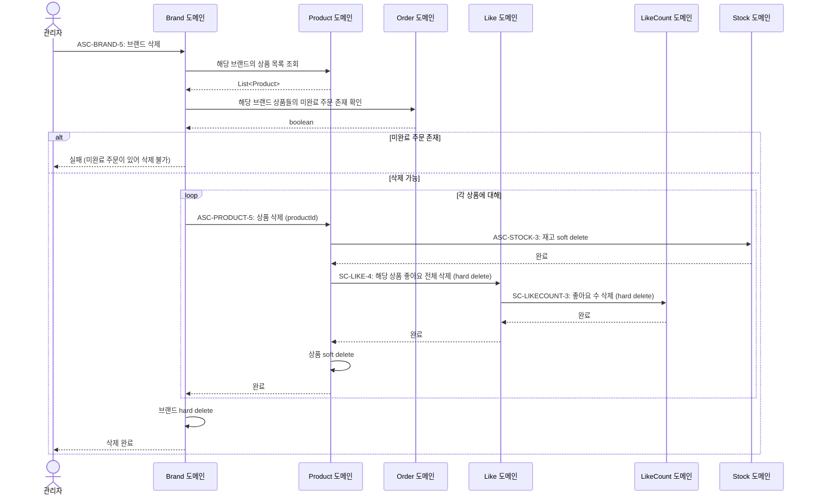
```mermaid
sequenceDiagram
    actor Admin as 관리자
    participant Brand as Brand 도메인
    participant Product as Product 도메인
    participant Order as Order 도메인
    participant Like as Like 도메인
    participant LikeCount as LikeCount 도메인
    participant Stock as Stock 도메인

    Admin->>Brand: ASC-BRAND-5: 브랜드 삭제
    Brand->>Product: 해당 브랜드의 상품 목록 조회
    Product-->>Brand: List<Product>

    Brand->>Order: 해당 브랜드 상품들의 미완료 주문 존재 확인
    Order-->>Brand: boolean

    alt 미완료 주문 존재
        Brand-->>Admin: 실패 (미완료 주문이 있어 삭제 불가)
    else 삭제 가능
        loop 각 상품에 대해
            Brand->>Product: ASC-PRODUCT-5: 상품 삭제 (productId)
            Product->>Stock: ASC-STOCK-3: 재고 soft delete
            Stock-->>Product: 완료
            Product->>Like: SC-LIKE-4: 해당 상품 좋아요 전체 삭제 (hard delete)
            Like->>LikeCount: SC-LIKECOUNT-3: 좋아요 수 삭제 (hard delete)
            LikeCount-->>Like: 완료
            Like-->>Product: 완료
            Product->>Product: 상품 soft delete
            Product-->>Brand: 완료
        end

        Brand->>Brand: 브랜드 hard delete
        Brand-->>Admin: 삭제 완료
    end
```

### 상품 등록 시 도메인 간 초기화 흐름

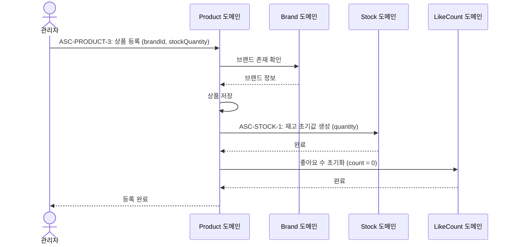
```mermaid
sequenceDiagram
    actor Admin as 관리자
    participant Product as Product 도메인
    participant Brand as Brand 도메인
    participant Stock as Stock 도메인
    participant LikeCount as LikeCount 도메인

    Admin->>Product: ASC-PRODUCT-3: 상품 등록 (brandId, stockQuantity)
    Product->>Brand: 브랜드 존재 확인
    Brand-->>Product: 브랜드 정보

    Product->>Product: 상품 저장
    Product->>Stock: ASC-STOCK-1: 재고 초기값 생성 (quantity)
    Stock-->>Product: 완료
    Product->>LikeCount: 좋아요 수 초기화 (count = 0)
    LikeCount-->>Product: 완료
    Product-->>Admin: 등록 완료
```

### 상품 수정 시 재고 연동 흐름

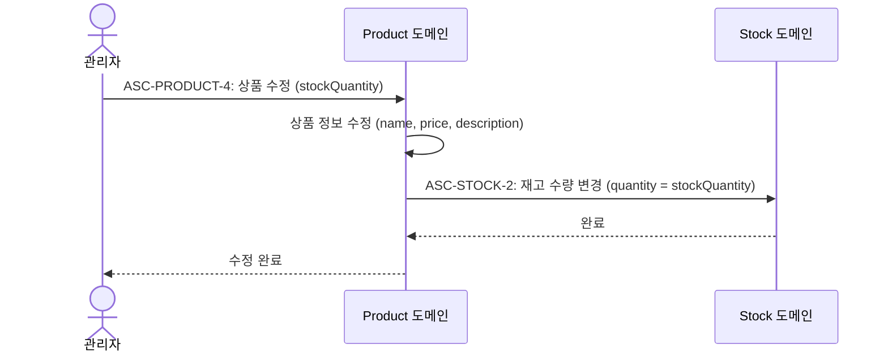
```mermaid
sequenceDiagram
    actor Admin as 관리자
    participant Product as Product 도메인
    participant Stock as Stock 도메인

    Admin->>Product: ASC-PRODUCT-4: 상품 수정 (stockQuantity)
    Product->>Product: 상품 정보 수정 (name, price, description)
    Product->>Stock: ASC-STOCK-2: 재고 수량 변경 (quantity = stockQuantity)
    Stock-->>Product: 완료
    Product-->>Admin: 수정 완료
```

### 상품 삭제 시 Cascade 흐름

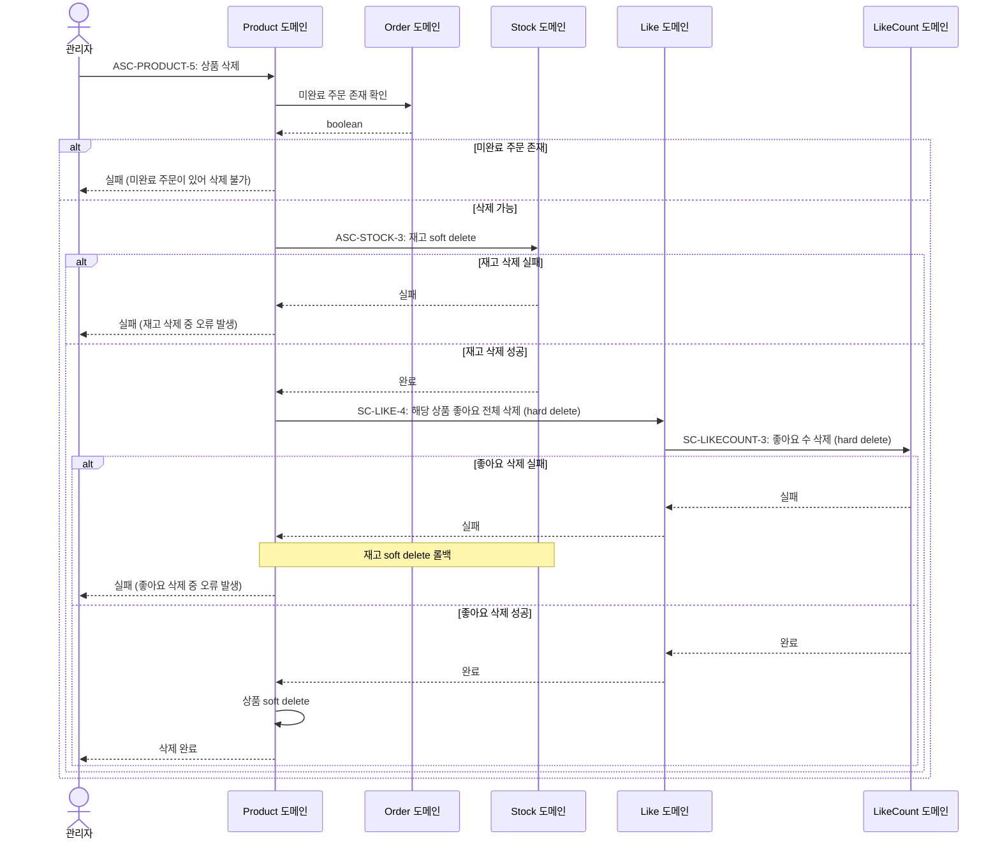
```mermaid
sequenceDiagram
    actor Admin as 관리자
    participant Product as Product 도메인
    participant Order as Order 도메인
    participant Stock as Stock 도메인
    participant Like as Like 도메인
    participant LikeCount as LikeCount 도메인

    Admin->>Product: ASC-PRODUCT-5: 상품 삭제
    Product->>Order: 미완료 주문 존재 확인
    Order-->>Product: boolean

    alt 미완료 주문 존재
        Product-->>Admin: 실패 (미완료 주문이 있어 삭제 불가)
    else 삭제 가능
        Product->>Stock: ASC-STOCK-3: 재고 soft delete
        alt 재고 삭제 실패
            Stock-->>Product: 실패
            Product-->>Admin: 실패 (재고 삭제 중 오류 발생)
        else 재고 삭제 성공
            Stock-->>Product: 완료
            Product->>Like: SC-LIKE-4: 해당 상품 좋아요 전체 삭제 (hard delete)
            Like->>LikeCount: SC-LIKECOUNT-3: 좋아요 수 삭제 (hard delete)
            alt 좋아요 삭제 실패
                LikeCount-->>Like: 실패
                Like-->>Product: 실패
                Note over Product,Stock: 재고 soft delete 롤백
                Product-->>Admin: 실패 (좋아요 삭제 중 오류 발생)
            else 좋아요 삭제 성공
                LikeCount-->>Like: 완료
                Like-->>Product: 완료
                Product->>Product: 상품 soft delete
                Product-->>Admin: 삭제 완료
            end
        end
    end
```

### 좋아요 등록/취소 시 좋아요 수 연동 흐름

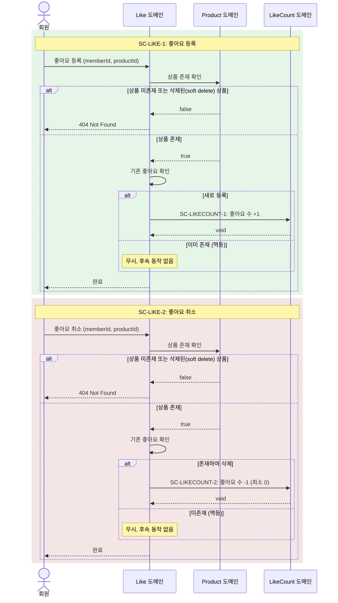
```mermaid
sequenceDiagram
    actor Member as 회원
    participant Like as Like 도메인
    participant Product as Product 도메인
    participant LikeCount as LikeCount 도메인

    rect rgb(230, 245, 230)
        Note over Member,LikeCount: SC-LIKE-1: 좋아요 등록
        Member->>Like: 좋아요 등록 (memberId, productId)
        Like->>Product: 상품 존재 확인
        alt 상품 미존재 또는 삭제된(soft delete) 상품
            Product-->>Like: false
            Like-->>Member: 404 Not Found
        else 상품 존재
            Product-->>Like: true
            Like->>Like: 기존 좋아요 확인
            alt 새로 등록
                Like->>LikeCount: SC-LIKECOUNT-1: 좋아요 수 +1
                LikeCount-->>Like: void
            else 이미 존재 (멱등)
                Note over Like: 무시, 후속 동작 없음
            end
            Like-->>Member: 완료
        end
    end

    rect rgb(245, 230, 230)
        Note over Member,LikeCount: SC-LIKE-2: 좋아요 취소
        Member->>Like: 좋아요 취소 (memberId, productId)
        Like->>Product: 상품 존재 확인
        alt 상품 미존재 또는 삭제된(soft delete) 상품
            Product-->>Like: false
            Like-->>Member: 404 Not Found
        else 상품 존재
            Product-->>Like: true
            Like->>Like: 기존 좋아요 확인
            alt 존재하여 삭제
                Like->>LikeCount: SC-LIKECOUNT-2: 좋아요 수 -1 (최소 0)
                LikeCount-->>Like: void
            else 미존재 (멱등)
                Note over Like: 무시, 후속 동작 없음
            end
            Like-->>Member: 완료
        end
    end
```

### 주문 생성 시 전체 도메인 이벤트 흐름

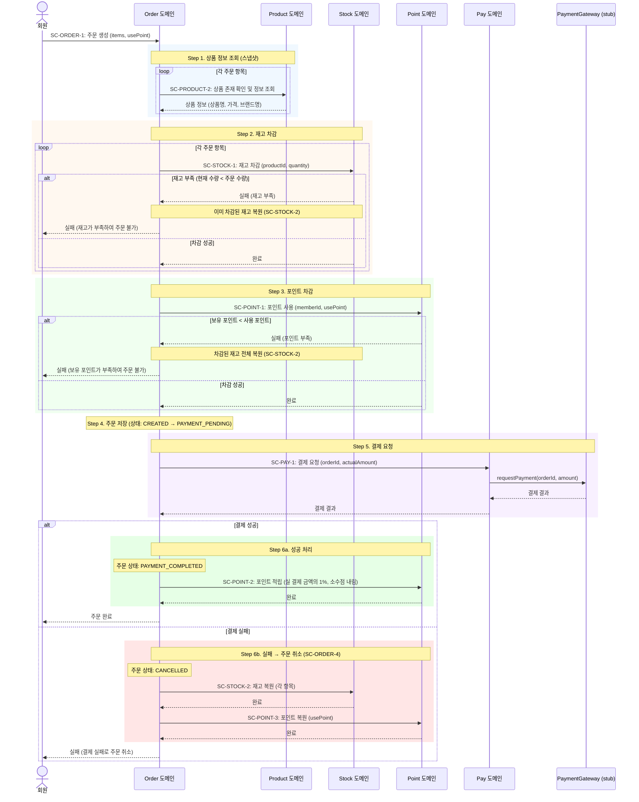
```mermaid
sequenceDiagram
    actor Member as 회원
    participant Order as Order 도메인
    participant Product as Product 도메인
    participant Stock as Stock 도메인
    participant Point as Point 도메인
    participant Pay as Pay 도메인
    participant Gateway as PaymentGateway (stub)

    Member->>Order: SC-ORDER-1: 주문 생성 (items, usePoint)

    rect rgb(240, 248, 255)
        Note over Order,Product: Step 1. 상품 정보 조회 (스냅샷)
        loop 각 주문 항목
            Order->>Product: SC-PRODUCT-2: 상품 존재 확인 및 정보 조회
            Product-->>Order: 상품 정보 (상품명, 가격, 브랜드명)
        end
    end

    rect rgb(255, 248, 240)
        Note over Order,Stock: Step 2. 재고 차감
        loop 각 주문 항목
            Order->>Stock: SC-STOCK-1: 재고 차감 (productId, quantity)
            alt 재고 부족 (현재 수량 < 주문 수량)
                Stock-->>Order: 실패 (재고 부족)
                Note over Order,Stock: 이미 차감된 재고 복원 (SC-STOCK-2)
                Order-->>Member: 실패 (재고가 부족하여 주문 불가)
            else 차감 성공
                Stock-->>Order: 완료
            end
        end
    end

    rect rgb(240, 255, 240)
        Note over Order,Point: Step 3. 포인트 차감
        Order->>Point: SC-POINT-1: 포인트 사용 (memberId, usePoint)
        alt 보유 포인트 < 사용 포인트
            Point-->>Order: 실패 (포인트 부족)
            Note over Order,Stock: 차감된 재고 전체 복원 (SC-STOCK-2)
            Order-->>Member: 실패 (보유 포인트가 부족하여 주문 불가)
        else 차감 성공
            Point-->>Order: 완료
        end
    end

    Note over Order: Step 4. 주문 저장 (상태: CREATED → PAYMENT_PENDING)

    rect rgb(248, 240, 255)
        Note over Order,Gateway: Step 5. 결제 요청
        Order->>Pay: SC-PAY-1: 결제 요청 (orderId, actualAmount)
        Pay->>Gateway: requestPayment(orderId, amount)
        Gateway-->>Pay: 결제 결과
        Pay-->>Order: 결제 결과
    end

    alt 결제 성공
        rect rgb(230, 255, 230)
            Note over Order,Point: Step 6a. 성공 처리
            Note over Order: 주문 상태: PAYMENT_COMPLETED
            Order->>Point: SC-POINT-2: 포인트 적립 (실 결제 금액의 1%, 소수점 내림)
            Point-->>Order: 완료
        end
        Order-->>Member: 주문 완료
    else 결제 실패
        rect rgb(255, 230, 230)
            Note over Order,Point: Step 6b. 실패 → 주문 취소 (SC-ORDER-4)
            Note over Order: 주문 상태: CANCELLED
            Order->>Stock: SC-STOCK-2: 재고 복원 (각 항목)
            Stock-->>Order: 완료
            Order->>Point: SC-POINT-3: 포인트 복원 (usePoint)
            Point-->>Order: 완료
        end
        Order-->>Member: 실패 (결제 실패로 주문 취소)
    end
```

---

## 1. 브랜드(Brand)

### SC-BRAND-1: 브랜드 상세를 조회한다

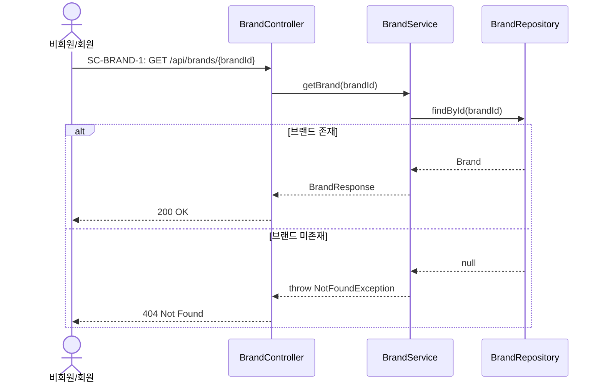
```mermaid
sequenceDiagram
    actor User as 비회원/회원
    participant Controller as BrandController
    participant Service as BrandService
    participant Repo as BrandRepository

    User->>Controller: SC-BRAND-1: GET /api/brands/{brandId}
    Controller->>Service: getBrand(brandId)
    Service->>Repo: findById(brandId)
    
    alt 브랜드 존재
        Repo-->>Service: Brand
        Service-->>Controller: BrandResponse
        Controller-->>User: 200 OK
    else 브랜드 미존재
        Repo-->>Service: null
        Service-->>Controller: throw NotFoundException
        Controller-->>User: 404 Not Found
    end
```

### ASC-BRAND-1: 브랜드 목록을 조회한다

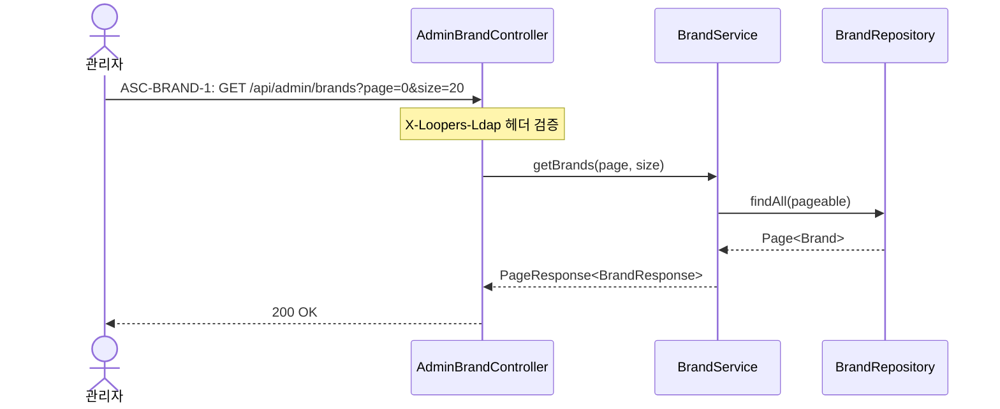
```mermaid
sequenceDiagram
    actor Admin as 관리자
    participant Controller as AdminBrandController
    participant Service as BrandService
    participant Repo as BrandRepository

    Admin->>Controller: ASC-BRAND-1: GET /api/admin/brands?page=0&size=20
    Note over Controller: X-Loopers-Ldap 헤더 검증
    Controller->>Service: getBrands(page, size)
    Service->>Repo: findAll(pageable)
    Repo-->>Service: Page<Brand>
    Service-->>Controller: PageResponse<BrandResponse>
    Controller-->>Admin: 200 OK
```

### ASC-BRAND-2: 브랜드 상세를 조회한다

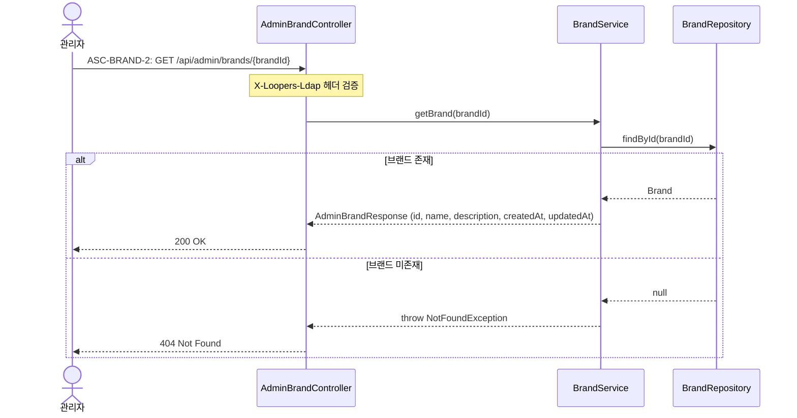
```mermaid
sequenceDiagram
    actor Admin as 관리자
    participant Controller as AdminBrandController
    participant Service as BrandService
    participant Repo as BrandRepository

    Admin->>Controller: ASC-BRAND-2: GET /api/admin/brands/{brandId}
    Note over Controller: X-Loopers-Ldap 헤더 검증
    Controller->>Service: getBrand(brandId)
    Service->>Repo: findById(brandId)

    alt 브랜드 존재
        Repo-->>Service: Brand
        Service-->>Controller: AdminBrandResponse (id, name, description, createdAt, updatedAt)
        Controller-->>Admin: 200 OK
    else 브랜드 미존재
        Repo-->>Service: null
        Service-->>Controller: throw NotFoundException
        Controller-->>Admin: 404 Not Found
    end
```

### ASC-BRAND-3: 브랜드를 등록한다

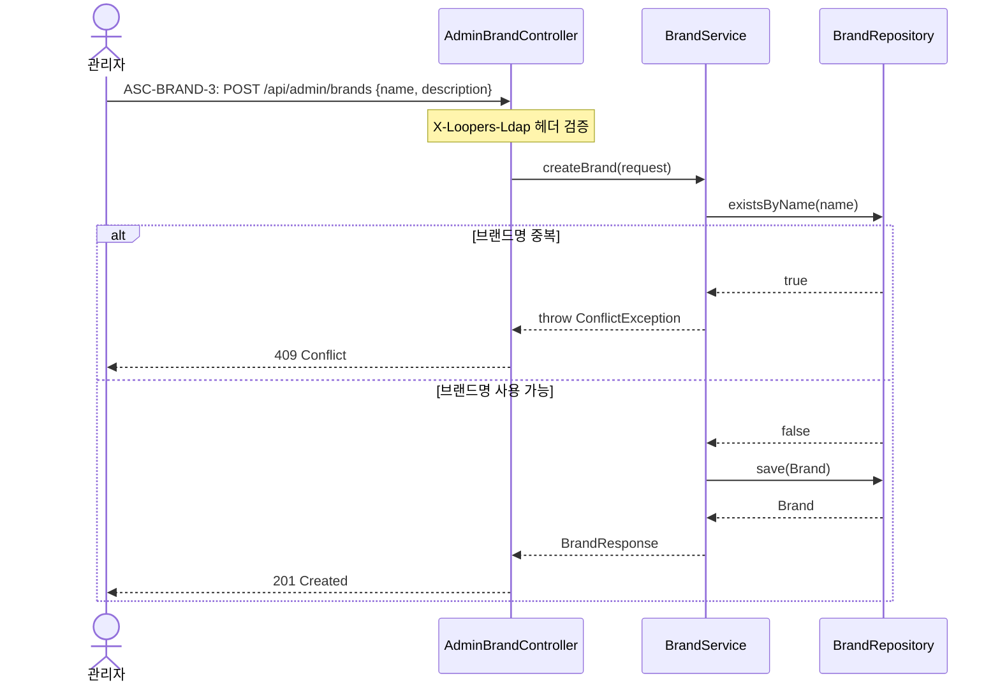
```mermaid
sequenceDiagram
    actor Admin as 관리자
    participant Controller as AdminBrandController
    participant Service as BrandService
    participant Repo as BrandRepository

    Admin->>Controller: ASC-BRAND-3: POST /api/admin/brands {name, description}
    Note over Controller: X-Loopers-Ldap 헤더 검증

    Controller->>Service: createBrand(request)
    Service->>Repo: existsByName(name)

    alt 브랜드명 중복
        Repo-->>Service: true
        Service-->>Controller: throw ConflictException
        Controller-->>Admin: 409 Conflict
    else 브랜드명 사용 가능
        Repo-->>Service: false
        Service->>Repo: save(Brand)
        Repo-->>Service: Brand
        Service-->>Controller: BrandResponse
        Controller-->>Admin: 201 Created
    end
```

### ASC-BRAND-4: 브랜드 정보를 수정한다

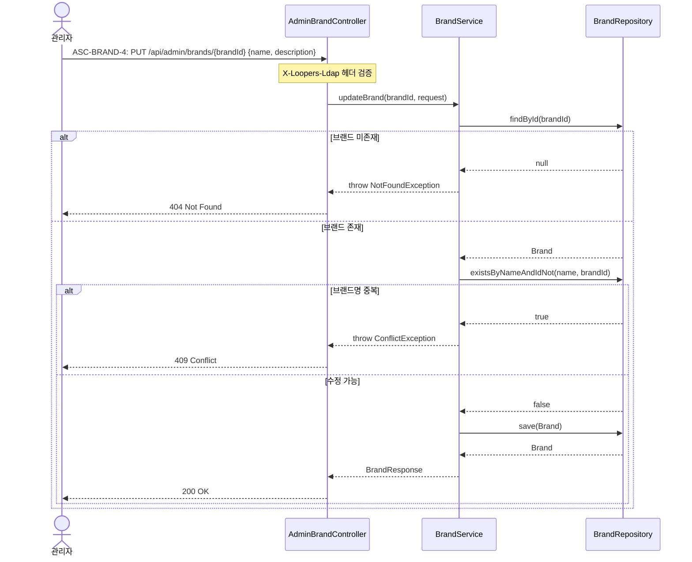
```mermaid
sequenceDiagram
    actor Admin as 관리자
    participant Controller as AdminBrandController
    participant Service as BrandService
    participant Repo as BrandRepository

    Admin->>Controller: ASC-BRAND-4: PUT /api/admin/brands/{brandId} {name, description}
    Note over Controller: X-Loopers-Ldap 헤더 검증

    Controller->>Service: updateBrand(brandId, request)
    Service->>Repo: findById(brandId)

    alt 브랜드 미존재
        Repo-->>Service: null
        Service-->>Controller: throw NotFoundException
        Controller-->>Admin: 404 Not Found
    else 브랜드 존재
        Repo-->>Service: Brand
        Service->>Repo: existsByNameAndIdNot(name, brandId)
        alt 브랜드명 중복
            Repo-->>Service: true
            Service-->>Controller: throw ConflictException
            Controller-->>Admin: 409 Conflict
        else 수정 가능
            Repo-->>Service: false
            Service->>Repo: save(Brand)
            Repo-->>Service: Brand
            Service-->>Controller: BrandResponse
            Controller-->>Admin: 200 OK
        end
    end
```

### ASC-BRAND-5: 브랜드를 삭제한다

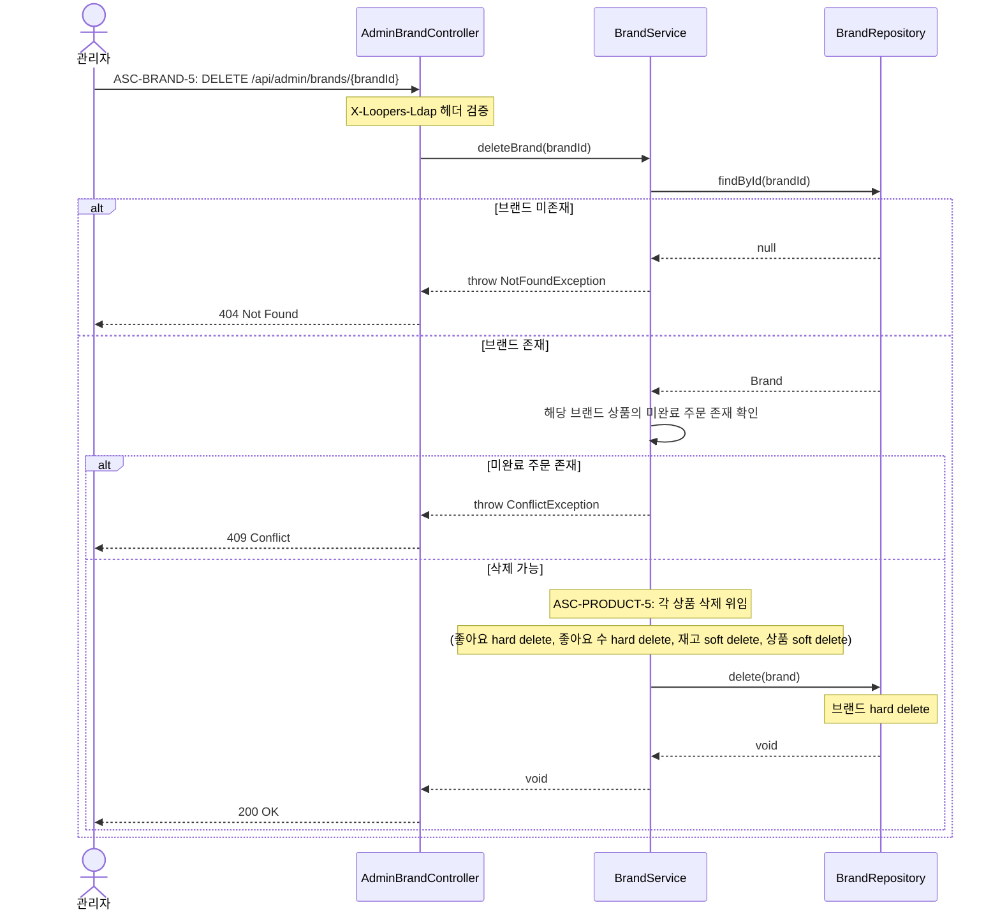
```mermaid
sequenceDiagram
    actor Admin as 관리자
    participant Controller as AdminBrandController
    participant Service as BrandService
    participant Repo as BrandRepository

    Admin->>Controller: ASC-BRAND-5: DELETE /api/admin/brands/{brandId}
    Note over Controller: X-Loopers-Ldap 헤더 검증

    Controller->>Service: deleteBrand(brandId)
    Service->>Repo: findById(brandId)

    alt 브랜드 미존재
        Repo-->>Service: null
        Service-->>Controller: throw NotFoundException
        Controller-->>Admin: 404 Not Found
    else 브랜드 존재
        Repo-->>Service: Brand
        Service->>Service: 해당 브랜드 상품의 미완료 주문 존재 확인
        alt 미완료 주문 존재
            Service-->>Controller: throw ConflictException
            Controller-->>Admin: 409 Conflict
        else 삭제 가능
            Note over Service: ASC-PRODUCT-5: 각 상품 삭제 위임
            Note over Service: (좋아요 hard delete, 좋아요 수 hard delete, 재고 soft delete, 상품 soft delete)
            Service->>Repo: delete(brand)
            Note over Repo: 브랜드 hard delete
            Repo-->>Service: void
            Service-->>Controller: void
            Controller-->>Admin: 200 OK
        end
    end
```

---

## 2. 상품(Product)

### SC-PRODUCT-1: 상품 목록을 조회한다

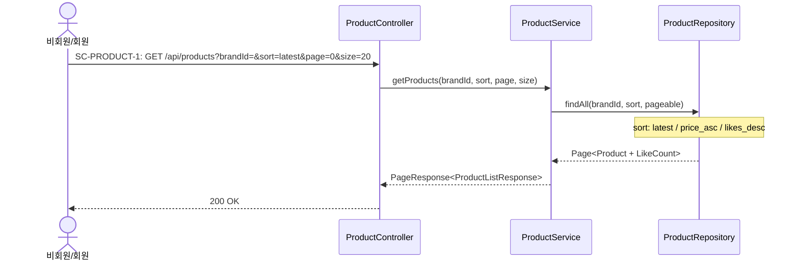
```mermaid
sequenceDiagram
    actor User as 비회원/회원
    participant Controller as ProductController
    participant Service as ProductService
    participant Repo as ProductRepository

    User->>Controller: SC-PRODUCT-1: GET /api/products?brandId=&sort=latest&page=0&size=20
    Controller->>Service: getProducts(brandId, sort, page, size)
    Service->>Repo: findAll(brandId, sort, pageable)
    Note over Repo: sort: latest / price_asc / likes_desc
    Repo-->>Service: Page<Product + LikeCount>
    Service-->>Controller: PageResponse<ProductListResponse>
    Controller-->>User: 200 OK
```

### SC-PRODUCT-2: 상품 상세를 조회한다

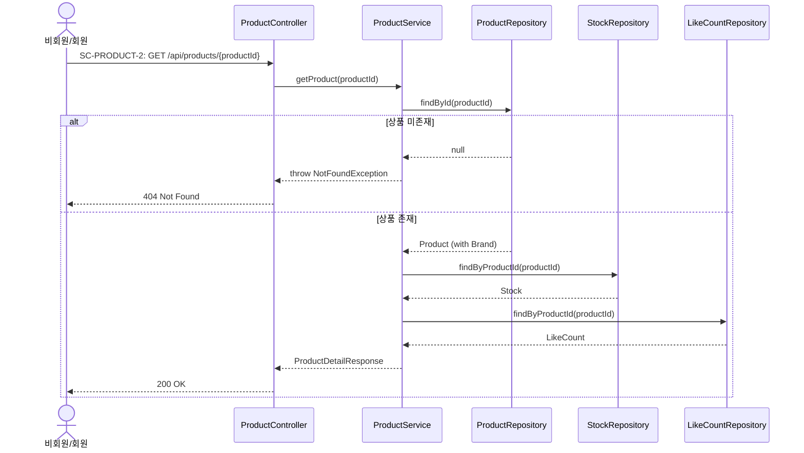
```mermaid
sequenceDiagram
    actor User as 비회원/회원
    participant Controller as ProductController
    participant Service as ProductService
    participant ProductRepo as ProductRepository
    participant StockRepo as StockRepository
    participant LikeCountRepo as LikeCountRepository

    User->>Controller: SC-PRODUCT-2: GET /api/products/{productId}
    Controller->>Service: getProduct(productId)
    Service->>ProductRepo: findById(productId)

    alt 상품 미존재
        ProductRepo-->>Service: null
        Service-->>Controller: throw NotFoundException
        Controller-->>User: 404 Not Found
    else 상품 존재
        ProductRepo-->>Service: Product (with Brand)
        Service->>StockRepo: findByProductId(productId)
        StockRepo-->>Service: Stock
        Service->>LikeCountRepo: findByProductId(productId)
        LikeCountRepo-->>Service: LikeCount
        Service-->>Controller: ProductDetailResponse
        Controller-->>User: 200 OK
    end
```

### ASC-PRODUCT-1: 상품 목록을 조회한다

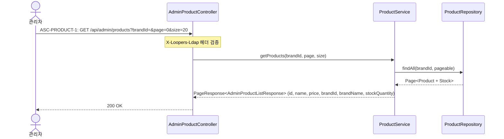
```mermaid
sequenceDiagram
    actor Admin as 관리자
    participant Controller as AdminProductController
    participant Service as ProductService
    participant Repo as ProductRepository

    Admin->>Controller: ASC-PRODUCT-1: GET /api/admin/products?brandId=&page=0&size=20
    Note over Controller: X-Loopers-Ldap 헤더 검증
    Controller->>Service: getProducts(brandId, page, size)
    Service->>Repo: findAll(brandId, pageable)
    Repo-->>Service: Page<Product + Stock>
    Service-->>Controller: PageResponse<AdminProductListResponse> (id, name, price, brandId, brandName, stockQuantity)
    Controller-->>Admin: 200 OK
```

### ASC-PRODUCT-2: 상품 상세를 조회한다

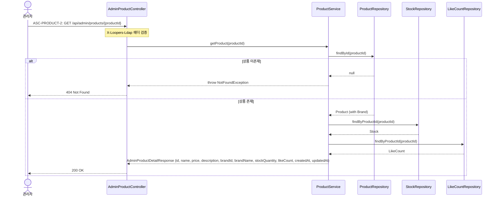
```mermaid
sequenceDiagram
    actor Admin as 관리자
    participant Controller as AdminProductController
    participant Service as ProductService
    participant ProductRepo as ProductRepository
    participant StockRepo as StockRepository
    participant LikeCountRepo as LikeCountRepository

    Admin->>Controller: ASC-PRODUCT-2: GET /api/admin/products/{productId}
    Note over Controller: X-Loopers-Ldap 헤더 검증
    Controller->>Service: getProduct(productId)
    Service->>ProductRepo: findById(productId)

    alt 상품 미존재
        ProductRepo-->>Service: null
        Service-->>Controller: throw NotFoundException
        Controller-->>Admin: 404 Not Found
    else 상품 존재
        ProductRepo-->>Service: Product (with Brand)
        Service->>StockRepo: findByProductId(productId)
        StockRepo-->>Service: Stock
        Service->>LikeCountRepo: findByProductId(productId)
        LikeCountRepo-->>Service: LikeCount
        Service-->>Controller: AdminProductDetailResponse (id, name, price, description, brandId, brandName, stockQuantity, likeCount, createdAt, updatedAt)
        Controller-->>Admin: 200 OK
    end
```

### ASC-PRODUCT-3: 상품을 등록한다

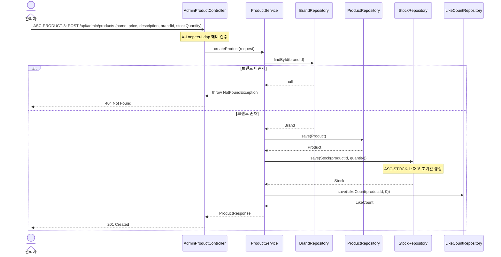
```mermaid
sequenceDiagram
    actor Admin as 관리자
    participant Controller as AdminProductController
    participant Service as ProductService
    participant BrandRepo as BrandRepository
    participant ProductRepo as ProductRepository
    participant StockRepo as StockRepository
    participant LikeCountRepo as LikeCountRepository

    Admin->>Controller: ASC-PRODUCT-3: POST /api/admin/products {name, price, description, brandId, stockQuantity}
    Note over Controller: X-Loopers-Ldap 헤더 검증

    Controller->>Service: createProduct(request)
    Service->>BrandRepo: findById(brandId)

    alt 브랜드 미존재
        BrandRepo-->>Service: null
        Service-->>Controller: throw NotFoundException
        Controller-->>Admin: 404 Not Found
    else 브랜드 존재
        BrandRepo-->>Service: Brand
        Service->>ProductRepo: save(Product)
        ProductRepo-->>Service: Product
        Service->>StockRepo: save(Stock(productId, quantity))
        Note over StockRepo: ASC-STOCK-1: 재고 초기값 생성
        StockRepo-->>Service: Stock
        Service->>LikeCountRepo: save(LikeCount(productId, 0))
        LikeCountRepo-->>Service: LikeCount
        Service-->>Controller: ProductResponse
        Controller-->>Admin: 201 Created
    end
```

### ASC-PRODUCT-4: 상품 정보를 수정한다

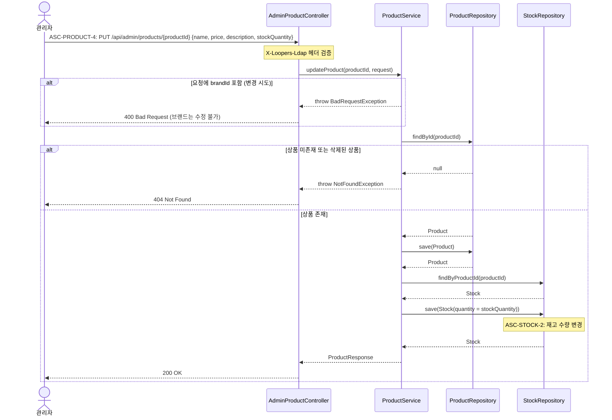
```mermaid
sequenceDiagram
    actor Admin as 관리자
    participant Controller as AdminProductController
    participant Service as ProductService
    participant ProductRepo as ProductRepository
    participant StockRepo as StockRepository

    Admin->>Controller: ASC-PRODUCT-4: PUT /api/admin/products/{productId} {name, price, description, stockQuantity}
    Note over Controller: X-Loopers-Ldap 헤더 검증

    Controller->>Service: updateProduct(productId, request)

    alt 요청에 brandId 포함 (변경 시도)
        Service-->>Controller: throw BadRequestException
        Controller-->>Admin: 400 Bad Request (브랜드는 수정 불가)
    end

    Service->>ProductRepo: findById(productId)

    alt 상품 미존재 또는 삭제된 상품
        ProductRepo-->>Service: null
        Service-->>Controller: throw NotFoundException
        Controller-->>Admin: 404 Not Found
    else 상품 존재
        ProductRepo-->>Service: Product
        Service->>ProductRepo: save(Product)
        ProductRepo-->>Service: Product
        Service->>StockRepo: findByProductId(productId)
        StockRepo-->>Service: Stock
        Service->>StockRepo: save(Stock(quantity = stockQuantity))
        Note over StockRepo: ASC-STOCK-2: 재고 수량 변경
        StockRepo-->>Service: Stock
        Service-->>Controller: ProductResponse
        Controller-->>Admin: 200 OK
    end
```

### ASC-PRODUCT-5: 상품을 삭제한다

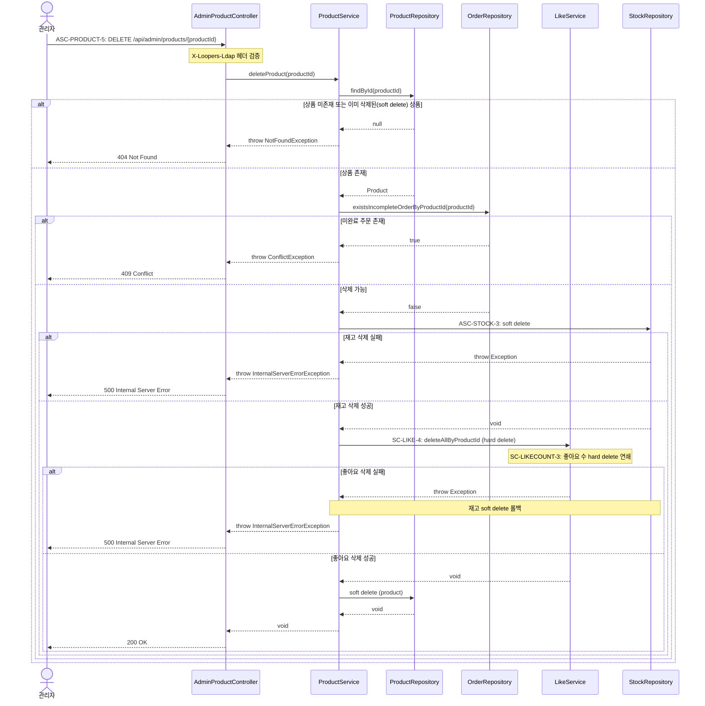
```mermaid
sequenceDiagram
    actor Admin as 관리자
    participant Controller as AdminProductController
    participant Service as ProductService
    participant ProductRepo as ProductRepository
    participant OrderRepo as OrderRepository
    participant LikeService as LikeService
    participant StockRepo as StockRepository

    Admin->>Controller: ASC-PRODUCT-5: DELETE /api/admin/products/{productId}
    Note over Controller: X-Loopers-Ldap 헤더 검증

    Controller->>Service: deleteProduct(productId)
    Service->>ProductRepo: findById(productId)

    alt 상품 미존재 또는 이미 삭제된(soft delete) 상품
        ProductRepo-->>Service: null
        Service-->>Controller: throw NotFoundException
        Controller-->>Admin: 404 Not Found
    else 상품 존재
        ProductRepo-->>Service: Product
        Service->>OrderRepo: existsIncompleteOrderByProductId(productId)
        alt 미완료 주문 존재
            OrderRepo-->>Service: true
            Service-->>Controller: throw ConflictException
            Controller-->>Admin: 409 Conflict
        else 삭제 가능
            OrderRepo-->>Service: false
            Service->>StockRepo: ASC-STOCK-3: soft delete
            alt 재고 삭제 실패
                StockRepo-->>Service: throw Exception
                Service-->>Controller: throw InternalServerErrorException
                Controller-->>Admin: 500 Internal Server Error
            else 재고 삭제 성공
                StockRepo-->>Service: void
                Service->>LikeService: SC-LIKE-4: deleteAllByProductId (hard delete)
                Note over LikeService: SC-LIKECOUNT-3: 좋아요 수 hard delete 연쇄
                alt 좋아요 삭제 실패
                    LikeService-->>Service: throw Exception
                    Note over Service,StockRepo: 재고 soft delete 롤백
                    Service-->>Controller: throw InternalServerErrorException
                    Controller-->>Admin: 500 Internal Server Error
                else 좋아요 삭제 성공
                    LikeService-->>Service: void
                    Service->>ProductRepo: soft delete (product)
                    ProductRepo-->>Service: void
                    Service-->>Controller: void
                    Controller-->>Admin: 200 OK
                end
            end
        end
    end
```

---

## 3. 재고(Stock)

### SC-STOCK-1: 재고를 N만큼 차감한다

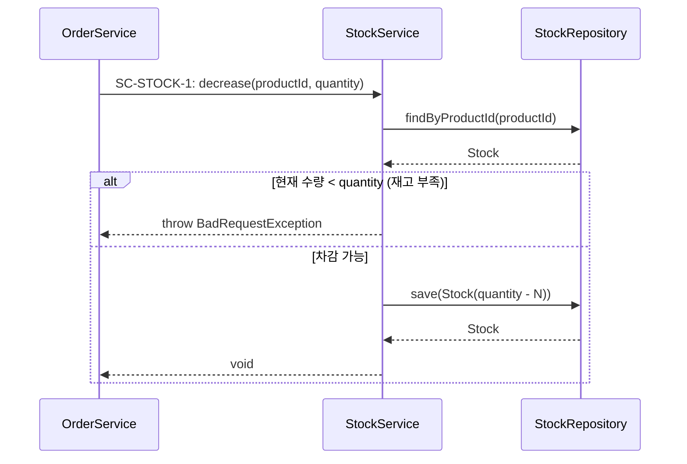
```mermaid
sequenceDiagram
    participant OrderService as OrderService
    participant Service as StockService
    participant Repo as StockRepository

    OrderService->>Service: SC-STOCK-1: decrease(productId, quantity)
    Service->>Repo: findByProductId(productId)
    Repo-->>Service: Stock

    alt 현재 수량 < quantity (재고 부족)
        Service-->>OrderService: throw BadRequestException
    else 차감 가능
        Service->>Repo: save(Stock(quantity - N))
        Repo-->>Service: Stock
        Service-->>OrderService: void
    end
```

### SC-STOCK-2: 재고를 N만큼 복원한다

```mermaid
sequenceDiagram
    participant OrderService as OrderService
    participant Service as StockService
    participant Repo as StockRepository

    OrderService->>Service: SC-STOCK-2: restore(productId, quantity)
    Service->>Repo: findByProductId(productId)
    Repo-->>Service: Stock
    Service->>Repo: save(Stock(quantity + N))
    Repo-->>Service: Stock
    Service-->>OrderService: void
```

### ASC-STOCK-1: 재고를 초기값으로 생성한다

```mermaid
sequenceDiagram
    participant ProductService as ProductService
    participant Service as StockService
    participant Repo as StockRepository

    ProductService->>Service: ASC-STOCK-1: create(productId, quantity)
    Service->>Repo: save(Stock(productId, quantity))
    Repo-->>Service: Stock
    Service-->>ProductService: void
```

### ASC-STOCK-2: 재고를 N으로 변경한다

```mermaid
sequenceDiagram
    participant ProductService as ProductService
    participant Service as StockService
    participant Repo as StockRepository

    ProductService->>Service: ASC-STOCK-2: update(productId, quantity)
    Service->>Repo: findByProductId(productId)
    Repo-->>Service: Stock
    Service->>Repo: save(Stock(quantity = N))
    Repo-->>Service: Stock
    Service-->>ProductService: void
```

### ASC-STOCK-3: 재고를 삭제한다

```mermaid
sequenceDiagram
    participant ProductService as ProductService
    participant Service as StockService
    participant Repo as StockRepository

    ProductService->>Service: ASC-STOCK-3: delete(productId)
    Service->>Repo: findByProductId(productId)
    Repo-->>Service: Stock
    Service->>Repo: soft delete (Stock)
    Repo-->>Service: void
    Service-->>ProductService: void
```

---

## 4. 좋아요(Like)

### SC-LIKE-1: 상품에 좋아요를 등록한다

```mermaid
sequenceDiagram
    actor Member as 회원
    participant Controller as LikeController
    participant Service as LikeService
    participant ProductRepo as ProductRepository
    participant LikeRepo as LikeRepository
    participant LikeCountRepo as LikeCountRepository

    Member->>Controller: SC-LIKE-1: POST /api/products/{productId}/likes
    Note over Controller: X-Loopers-LoginId + X-Loopers-LoginPw 헤더 검증

    Controller->>Service: addLike(memberId, productId)
    Service->>ProductRepo: existsActiveById(productId)

    alt 상품 미존재 또는 삭제된(soft delete) 상품
        ProductRepo-->>Service: false
        Service-->>Controller: throw NotFoundException
        Controller-->>Member: 404 Not Found
    else 상품 존재
        ProductRepo-->>Service: true
        Service->>LikeRepo: findByMemberIdAndProductId(memberId, productId)
        alt 이미 좋아요 존재 (멱등)
            LikeRepo-->>Service: Like
            Service-->>Controller: void
            Controller-->>Member: 200 OK (무시)
        else 좋아요 미존재
            LikeRepo-->>Service: null
            Service->>LikeRepo: save(Like(memberId, productId))
            LikeRepo-->>Service: Like
            Service->>LikeCountRepo: incrementByProductId(productId)
            Note over LikeCountRepo: SC-LIKECOUNT-1: 좋아요 수 +1
            LikeCountRepo-->>Service: void
            Service-->>Controller: void
            Controller-->>Member: 200 OK
        end
    end
```

### SC-LIKE-2: 상품 좋아요를 취소한다

```mermaid
sequenceDiagram
    actor Member as 회원
    participant Controller as LikeController
    participant Service as LikeService
    participant ProductRepo as ProductRepository
    participant LikeRepo as LikeRepository
    participant LikeCountRepo as LikeCountRepository

    Member->>Controller: SC-LIKE-2: DELETE /api/products/{productId}/likes
    Note over Controller: X-Loopers-LoginId + X-Loopers-LoginPw 헤더 검증

    Controller->>Service: removeLike(memberId, productId)
    Service->>ProductRepo: existsActiveById(productId)

    alt 상품 미존재 또는 삭제된(soft delete) 상품
        ProductRepo-->>Service: false
        Service-->>Controller: throw NotFoundException
        Controller-->>Member: 404 Not Found
    else 상품 존재
        ProductRepo-->>Service: true
        Service->>LikeRepo: findByMemberIdAndProductId(memberId, productId)
        alt 좋아요 미존재 (멱등)
            LikeRepo-->>Service: null
            Service-->>Controller: void
            Controller-->>Member: 200 OK (무시)
        else 좋아요 존재
            LikeRepo-->>Service: Like
            Service->>LikeRepo: delete(like)
            LikeRepo-->>Service: void
            Service->>LikeCountRepo: decrementByProductId(productId)
            Note over LikeCountRepo: SC-LIKECOUNT-2: 좋아요 수 -1 (최소 0)
            LikeCountRepo-->>Service: void
            Service-->>Controller: void
            Controller-->>Member: 200 OK
        end
    end
```

### SC-LIKE-3: 좋아요한 상품 목록을 조회한다

```mermaid
sequenceDiagram
    actor Member as 회원
    participant Controller as LikeController
    participant Service as LikeService
    participant LikeRepo as LikeRepository

    Member->>Controller: SC-LIKE-3: GET /api/members/{memberId}/likes
    Note over Controller: X-Loopers-LoginId + X-Loopers-LoginPw 헤더 검증

    alt 존재하지 않는 userId
        Controller-->>Member: 404 Not Found
    else 본인이 아닌 memberId
        Controller-->>Member: 403 Forbidden
    else 본인 확인
        Controller->>Service: getLikedProducts(memberId)
        Service->>LikeRepo: findAllByMemberId(memberId)
        Note over LikeRepo: Product + Brand JOIN
        LikeRepo-->>Service: List<Like + Product>
        Service-->>Controller: List<LikedProductResponse>
        Controller-->>Member: 200 OK
    end
```

### SC-LIKE-4: 상품의 좋아요를 전체 삭제한다

```mermaid
sequenceDiagram
    participant ProductService as ProductService
    participant Service as LikeService
    participant LikeRepo as LikeRepository
    participant LikeCountService as LikeCountService
    participant LikeCountRepo as LikeCountRepository

    ProductService->>Service: SC-LIKE-4: deleteAllByProductId(productId)
    Service->>LikeRepo: hard delete all by productId
    LikeRepo-->>Service: void
    Service->>LikeCountService: SC-LIKECOUNT-3: deleteByProductId(productId)
    LikeCountService->>LikeCountRepo: hard delete by productId
    LikeCountRepo-->>LikeCountService: void
    LikeCountService-->>Service: void
    Service-->>ProductService: void
```

### SC-LIKECOUNT-1: 좋아요 수를 1 증가시킨다

```mermaid
sequenceDiagram
    participant LikeService as LikeService
    participant Service as LikeCountService
    participant LikeCountRepo as LikeCountRepository

    LikeService->>Service: SC-LIKECOUNT-1: increment(productId)
    Service->>LikeCountRepo: incrementByProductId(productId)
    Note over LikeCountRepo: count = count + 1
    LikeCountRepo-->>Service: void
    Service-->>LikeService: void
```

### SC-LIKECOUNT-2: 좋아요 수를 1 감소시킨다

```mermaid
sequenceDiagram
    participant LikeService as LikeService
    participant Service as LikeCountService
    participant LikeCountRepo as LikeCountRepository

    LikeService->>Service: SC-LIKECOUNT-2: decrement(productId)
    Service->>LikeCountRepo: findByProductId(productId)
    LikeCountRepo-->>Service: LikeCount

    alt 좋아요 수가 0인 경우
        Note over Service: 0 유지 (음수 방지)
    else 감소 가능
        Service->>LikeCountRepo: decrementByProductId(productId)
        Note over LikeCountRepo: count = count - 1
        LikeCountRepo-->>Service: void
    end
    Service-->>LikeService: void
```

### SC-LIKECOUNT-3: 상품의 좋아요 수를 삭제한다

```mermaid
sequenceDiagram
    participant LikeService as LikeService
    participant Service as LikeCountService
    participant LikeCountRepo as LikeCountRepository

    LikeService->>Service: SC-LIKECOUNT-3: deleteByProductId(productId)
    Service->>LikeCountRepo: hard delete by productId
    LikeCountRepo-->>Service: void
    Service-->>LikeService: void
```

---

## 5. 주문(Order)

### SC-ORDER-1: 주문을 생성한다

```mermaid
sequenceDiagram
    actor Member as 회원
    participant Controller as OrderController
    participant OrderService as OrderService
    participant ProductRepo as ProductRepository
    participant StockService as StockService
    participant PointService as PointService
    participant OrderRepo as OrderRepository
    participant PayService as PayService
    participant Gateway as PaymentGateway (stub)

    Member->>Controller: SC-ORDER-1: POST /api/orders {items: [{productId, quantity}], usePoint}
    Note over Controller: X-Loopers-LoginId + X-Loopers-LoginPw 헤더 검증

    Controller->>OrderService: createOrder(memberId, request)

    %% 1. 상품 존재 확인 및 정보 조회
    loop 각 주문 항목
        OrderService->>ProductRepo: findActiveById(productId)
        alt 상품 미존재 또는 삭제된(soft delete) 상품
            ProductRepo-->>OrderService: null
            OrderService-->>Controller: throw NotFoundException
            Controller-->>Member: 404 Not Found
        else
            ProductRepo-->>OrderService: Product (스냅샷용: 상품명, 가격, 브랜드명)
        end
    end

    %% 1.5. 주문 금액 검증
    Note over OrderService: totalAmount = Σ(상품 가격 × 수량)
    alt 사용 포인트 > 총 주문 금액
        OrderService-->>Controller: throw BadRequestException
        Controller-->>Member: 400 Bad Request (포인트가 주문 금액 초과)
    end

    %% 2. 재고 차감
    loop 각 주문 항목
        OrderService->>StockService: decrease(productId, quantity)
        alt 재고 부족
            Note over OrderService: 이미 차감된 재고 복원 (SC-STOCK-2)
            StockService-->>OrderService: throw BadRequestException
            OrderService-->>Controller: throw BadRequestException
            Controller-->>Member: 400 Bad Request (재고 부족)
        else
            StockService-->>OrderService: void
        end
    end

    %% 3. 포인트 차감
    OrderService->>PointService: use(memberId, usePoint)
    alt 보유 포인트 부족
        PointService-->>OrderService: throw BadRequestException
        Note over OrderService: 차감된 재고 전체 복원 (SC-STOCK-2)
        loop 각 주문 항목
            OrderService->>StockService: restore(productId, quantity)
            StockService-->>OrderService: void
        end
        OrderService-->>Controller: throw BadRequestException
        Controller-->>Member: 400 Bad Request (포인트 부족)
    else
        PointService-->>OrderService: void
    end

    %% 4. 주문 생성
    OrderService->>OrderRepo: save(Order(CREATED, items with snapshots))
    OrderRepo-->>OrderService: Order

    %% 5~6. 결제 요청
    OrderService->>PayService: requestPayment(orderId, actualAmount)
    PayService->>Gateway: requestPayment(orderId, amount)

    alt 결제 성공
        Gateway-->>PayService: SUCCESS
        PayService-->>OrderService: PaymentResult(SUCCESS)
        OrderService->>OrderRepo: updateStatus(PAYMENT_COMPLETED)
        OrderRepo-->>OrderService: void
        OrderService->>PointService: earn(memberId, actualAmount * 1%)
        Note over PointService: SC-POINT-2: 포인트 적립 (소수점 내림)
        PointService-->>OrderService: void
        OrderService-->>Controller: OrderResponse
        Controller-->>Member: 201 Created
    else 결제 실패
        Gateway-->>PayService: FAIL
        PayService-->>OrderService: PaymentResult(FAIL)
        Note over OrderService: SC-ORDER-4: 주문 취소 처리
        OrderService->>OrderRepo: updateStatus(CANCELLED)
        OrderRepo-->>OrderService: void
        OrderService->>StockService: restore(각 항목의 productId, quantity)
        Note over StockService: SC-STOCK-2: 재고 복원
        StockService-->>OrderService: void
        OrderService->>PointService: restore(memberId, usePoint)
        Note over PointService: SC-POINT-3: 포인트 복원
        PointService-->>OrderService: void
        OrderService-->>Controller: throw PaymentFailedException
        Controller-->>Member: 500 Internal Server Error
    end
```

### SC-ORDER-2: 주문 목록을 조회한다

```mermaid
sequenceDiagram
    actor Member as 회원
    participant Controller as OrderController
    participant Service as OrderService
    participant Repo as OrderRepository

    Member->>Controller: SC-ORDER-2: GET /api/orders?startAt=&endAt=&page=0&size=20
    Note over Controller: X-Loopers-LoginId + X-Loopers-LoginPw 헤더 검증

    Controller->>Service: getOrders(memberId, startAt, endAt, page, size)

    alt startAt이 endAt보다 이후인 경우
        Service-->>Controller: throw BadRequestException
        Controller-->>Member: 400 Bad Request (잘못된 조회 기간)
    else
        Service->>Repo: findByMemberIdAndCreatedAtBetween(memberId, startAt, endAt, pageable)
        Repo-->>Service: Page<Order>
        Service-->>Controller: PageResponse<OrderListResponse>
        Controller-->>Member: 200 OK
    end
```

### SC-ORDER-3: 주문 상세를 조회한다

```mermaid
sequenceDiagram
    actor Member as 회원
    participant Controller as OrderController
    participant Service as OrderService
    participant Repo as OrderRepository

    Member->>Controller: SC-ORDER-3: GET /api/orders/{orderId}
    Note over Controller: X-Loopers-LoginId + X-Loopers-LoginPw 헤더 검증

    Controller->>Service: getOrder(memberId, orderId)
    Service->>Repo: findById(orderId)

    alt 주문 미존재
        Repo-->>Service: null
        Service-->>Controller: throw NotFoundException
        Controller-->>Member: 404 Not Found
    else 주문 존재
        Repo-->>Service: Order (with OrderItems)
        alt 본인의 주문이 아님
            Service-->>Controller: throw ForbiddenException
            Controller-->>Member: 403 Forbidden
        else 본인의 주문
            Service-->>Controller: OrderDetailResponse
            Controller-->>Member: 200 OK
        end
    end
```

### ASC-ORDER-1: 주문 목록을 조회한다 (관리자)

```mermaid
sequenceDiagram
    actor Admin as 관리자
    participant Controller as AdminOrderController
    participant Service as OrderService
    participant Repo as OrderRepository

    Admin->>Controller: ASC-ORDER-1: GET /api/admin/orders?page=0&size=20
    Note over Controller: X-Loopers-Ldap 헤더 검증

    Controller->>Service: getAllOrders(page, size)
    Service->>Repo: findAll(pageable)
    Repo-->>Service: Page<Order>
    Service-->>Controller: PageResponse<AdminOrderListResponse>
    Controller-->>Admin: 200 OK
```

### ASC-ORDER-2: 주문 상세를 조회한다 (관리자)

```mermaid
sequenceDiagram
    actor Admin as 관리자
    participant Controller as AdminOrderController
    participant Service as OrderService
    participant Repo as OrderRepository

    Admin->>Controller: ASC-ORDER-2: GET /api/admin/orders/{orderId}
    Note over Controller: X-Loopers-Ldap 헤더 검증

    Controller->>Service: getOrderForAdmin(orderId)
    Service->>Repo: findById(orderId)

    alt 주문 미존재
        Repo-->>Service: null
        Service-->>Controller: throw NotFoundException
        Controller-->>Admin: 404 Not Found
    else 주문 존재
        Repo-->>Service: Order (with OrderItems)
        Service-->>Controller: AdminOrderDetailResponse
        Controller-->>Admin: 200 OK
    end
```

---

## 6. 결제(Pay)

### SC-PAY-1 / SC-PAY-2: 결제를 요청한다

```mermaid
sequenceDiagram
    participant OrderService as OrderService
    participant PayService as PayService
    participant PayRepo as PayRepository
    participant Gateway as PaymentGateway (stub)

    OrderService->>PayService: SC-PAY-1: requestPayment(orderId, amount)
    PayService->>PayRepo: save(Pay(orderId, amount, READY))
    PayRepo-->>PayService: Pay

    PayService->>PayRepo: updateStatus(IN_PROGRESS)
    PayRepo-->>PayService: void

    PayService->>Gateway: requestPayment(orderId, amount)

    alt 결제 성공
        Gateway-->>PayService: PaymentResult(SUCCESS)
        PayService->>PayRepo: updateStatus(SUCCESS)
        PayRepo-->>PayService: void
        PayService-->>OrderService: PaymentResult(SUCCESS)
    else 결제 실패 (SC-PAY-2)
        Gateway-->>PayService: PaymentResult(FAIL)
        PayService->>PayRepo: updateStatus(FAIL)
        PayRepo-->>PayService: void
        PayService-->>OrderService: PaymentResult(FAIL)
    end
```

---

## 7. 포인트(Point)

### SC-POINT-1: 주문 시 포인트를 사용한다

```mermaid
sequenceDiagram
    participant OrderService as OrderService
    participant PointService as PointService
    participant PointRepo as PointRepository

    OrderService->>PointService: SC-POINT-1: use(memberId, usePoint)
    PointService->>PointRepo: findByMemberId(memberId)
    PointRepo-->>PointService: Point

    alt 사용 포인트 < 0
        PointService-->>OrderService: throw BadRequestException
    else 보유 포인트 < 사용 포인트
        PointService-->>OrderService: throw BadRequestException
    else 차감 가능
        PointService->>PointRepo: save(Point(balance - usePoint))
        PointRepo-->>PointService: Point
        PointService-->>OrderService: void
    end
```

### SC-POINT-2: 결제 완료 시 포인트가 적립된다

```mermaid
sequenceDiagram
    participant OrderService as OrderService
    participant PointService as PointService
    participant PointRepo as PointRepository

    OrderService->>PointService: SC-POINT-2: earn(memberId, actualAmount)
    Note over PointService: earnPoint = floor(actualAmount * 0.01)
    PointService->>PointRepo: findByMemberId(memberId)
    PointRepo-->>PointService: Point
    PointService->>PointRepo: save(Point(balance + earnPoint))
    PointRepo-->>PointService: Point
    PointService-->>OrderService: void
```

### SC-POINT-3: 결제 실패/주문 취소 시 포인트가 복원된다

```mermaid
sequenceDiagram
    participant OrderService as OrderService
    participant PointService as PointService
    participant PointRepo as PointRepository

    OrderService->>PointService: SC-POINT-3: restore(memberId, usedPoint)
    PointService->>PointRepo: findByMemberId(memberId)
    PointRepo-->>PointService: Point
    PointService->>PointRepo: save(Point(balance + usedPoint))
    PointRepo-->>PointService: Point
    PointService-->>OrderService: void
```

