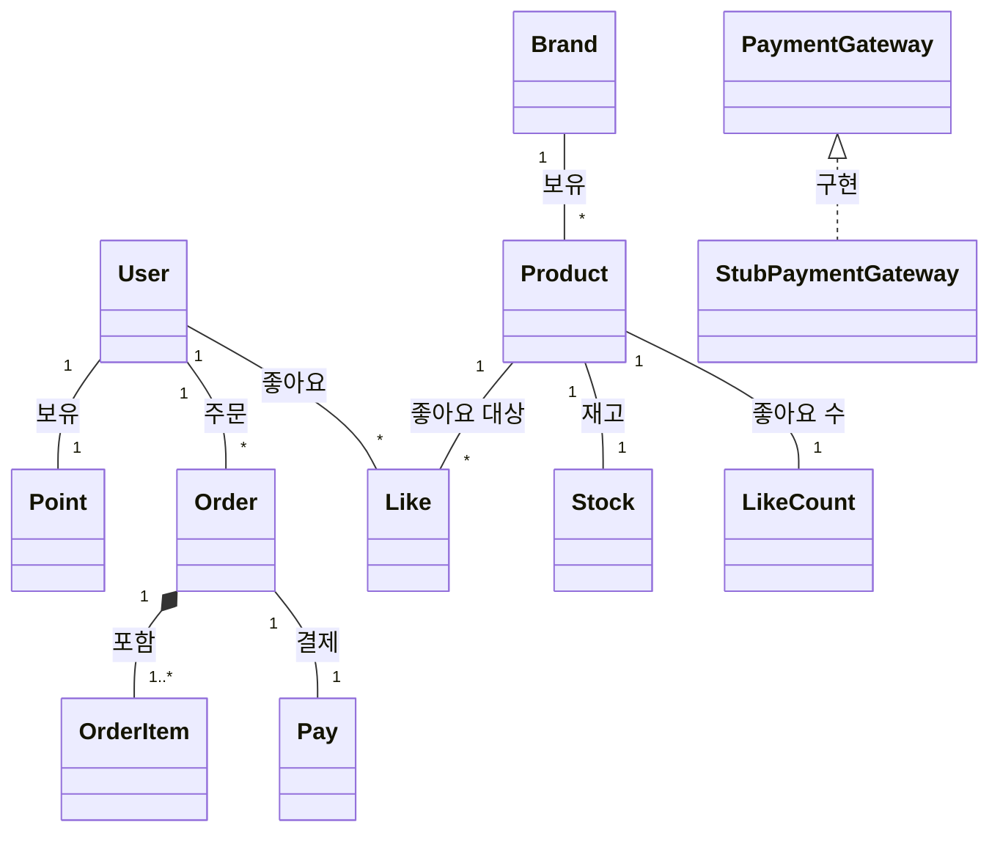
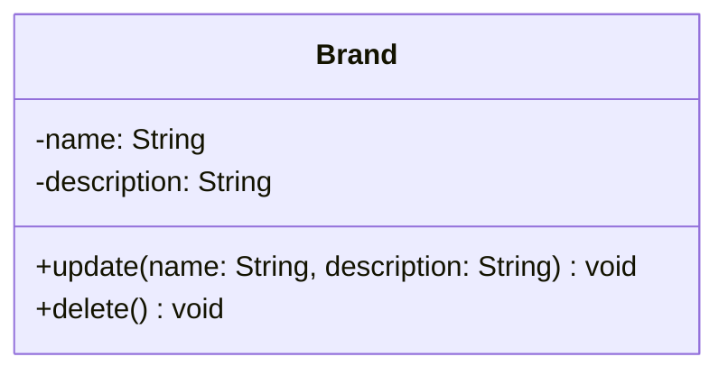
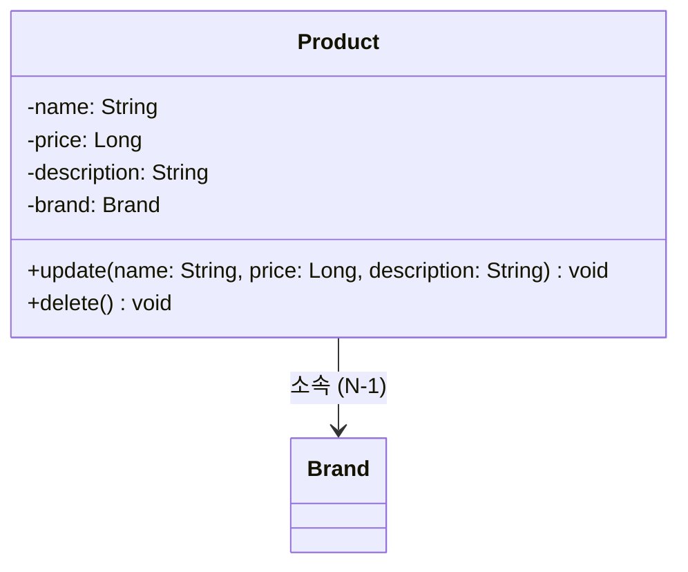
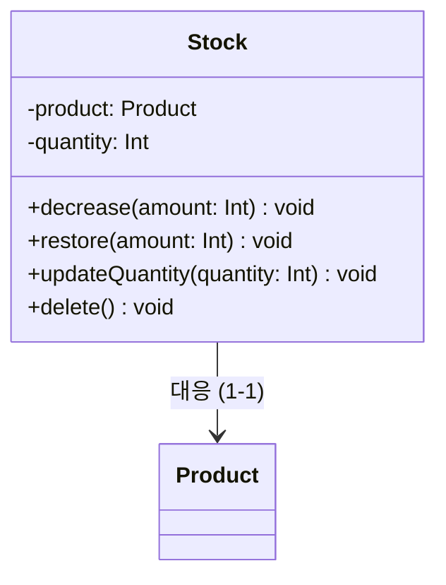
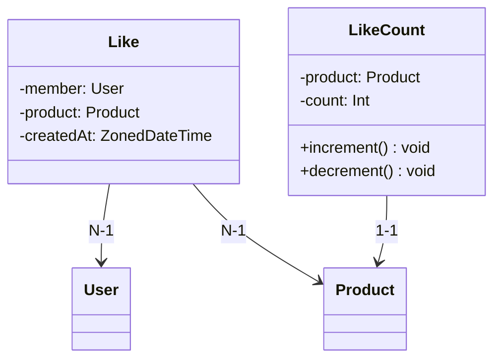
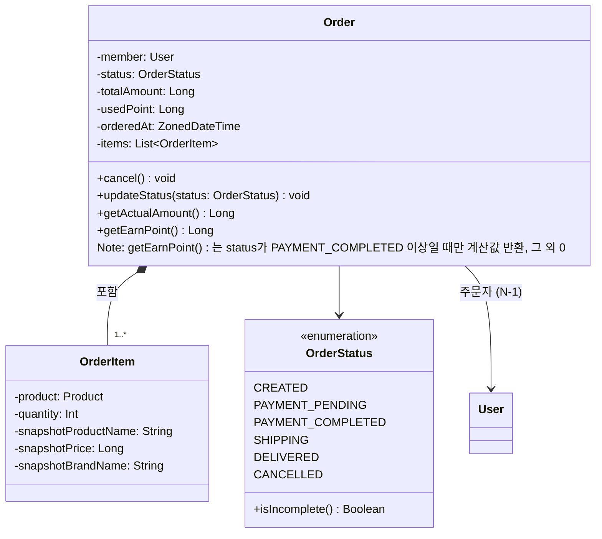
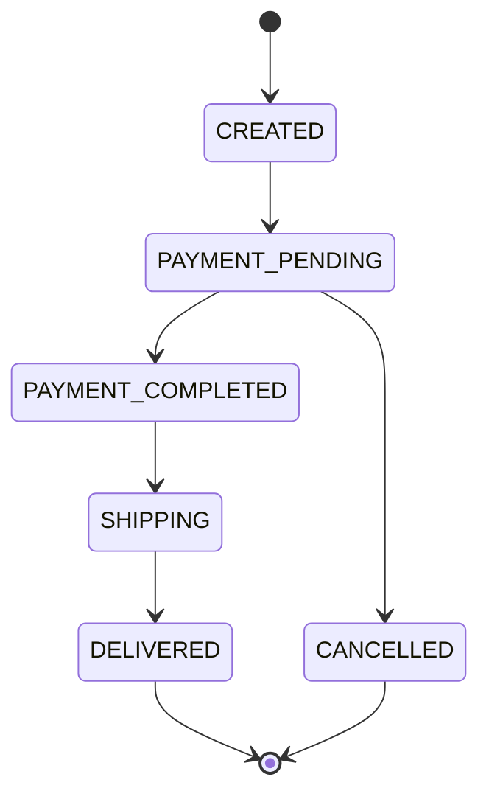
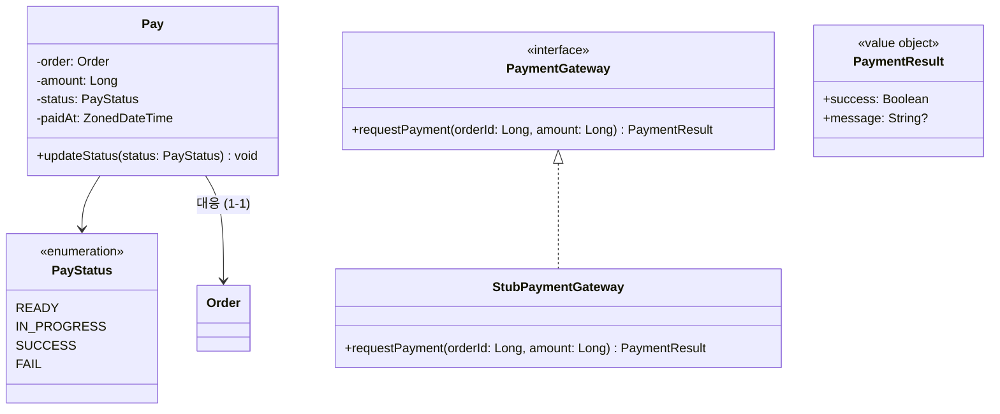
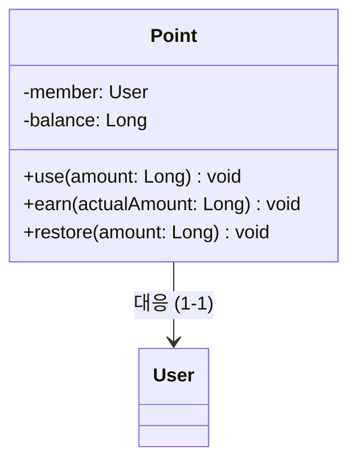
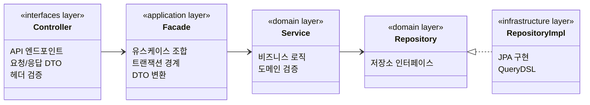

# 클래스 다이어그램

## 1. 전체 도메인 관계도

---

## 2. 도메인별 클래스 상세

### 2.1 Brand (브랜드)

| 규칙 | 설명 |
|---|---|
| 삭제 정책 | hard delete |
| name | 필수, 유니크 (중복 등록/수정 시 409 Conflict) |
| 삭제 선행조건 | 해당 브랜드 상품에 미완료 주문이 없어야 함 (있으면 409 Conflict) |
| Cascade 삭제 | 브랜드 삭제 → 각 상품에 대해 상품 삭제 흐름 수행 (상품 삭제, 재고 삭제, 좋아요 hard delete, 좋아요 수 hard delete) |

---

### 2.2 Product (상품)

| 규칙 | 설명 |
|---|---|
| 삭제 정책 | soft delete (조회 시 자동 필터링, 삭제된 상품은 노출되지 않음) |
| price | 필수, 0 초과 |
| brand | 등록 시 결정, 이후 변경 불가 (변경 시도 → 400 Bad Request) |
| 삭제 선행조건 | 미완료 주문이 없어야 함 (있으면 409 Conflict) |
| Cascade 삭제 | 상품 삭제 → 재고 삭제, 좋아요 전체 hard delete, 좋아요 수 hard delete |
| 목록 정렬 | `latest` (기본), `price_asc`, `likes_desc` |

---

### 2.3 Stock (재고)

| 규칙 | 설명 |
|---|---|
| 삭제 정책 | soft delete (상품과 동일 생명주기, 조회 시 자동 필터링) |
| quantity | 0 이상, 음수 불가 |
| decrease | 현재 수량 < 요청 수량이면 실패 (400 Bad Request) |
| restore | 주문 취소/결제 실패 시 차감했던 수량만큼 복원 |
| 생성 시점 | 상품 등록 시 초기 수량으로 함께 생성 |

---

### 2.4 Like (좋아요) & LikeCount (좋아요 수)

| 규칙 | 설명 |
|---|---|
| Like 삭제 정책 | hard delete |
| LikeCount 삭제 정책 | hard delete |
| 유니크 제약 | 동일 회원 + 동일 상품에 좋아요는 하나만 존재 |
| 멱등성 | 중복 등록 → 무시(200), 미등록 취소 → 무시(200) |
| 등록 후속 | 새로 등록된 경우에만 LikeCount +1 |
| 취소 후속 | 실제 삭제된 경우에만 LikeCount -1 (최소 0 유지) |
| 좋아요한 상품 조회 | 본인만 가능 (타인 → 403 Forbidden), 어드민은 모든 회원 조회 가능 |
| LikeCount 용도 | 상품 목록 `likes_desc` 정렬, 상품 상세 좋아요 수 표시 |
| 생성 시점 | LikeCount는 상품 등록 시 count=0으로 함께 생성 |

---

### 2.5 Order (주문) & OrderItem (주문 항목)

**주문 상태 흐름:**

| 규칙 | 설명 |
|---|---|
| 삭제 정책 | soft delete (상태 변경으로 관리) |
| 주문 항목 | 최소 1개 이상, 각 항목 수량 1 이상 |
| 부분 주문 | 불가 (하나라도 재고 부족 → 주문 전체 실패) |
| 스냅샷 | 주문 시점의 상품명, 가격, 브랜드명을 OrderItem에 저장 (이후 원본 변경과 무관) |
| 총 주문 금액 | `totalAmount = sum(snapshotPrice * quantity)` |
| 실 결제 금액 | `actualAmount = totalAmount - usedPoint` |
| 적립 포인트 | `earnPoint = floor(actualAmount * 0.01)` |
| 사용 포인트 제약 | 총 주문 금액 초과 불가, 보유 포인트 초과 불가 |
| 미완료 주문 | `CREATED`, `PAYMENT_PENDING`, `PAYMENT_COMPLETED`, `SHIPPING` 상태 |
| 주문 상세 조회 | 본인만 가능 (타인 → 403 Forbidden), 어드민은 모든 주문 조회 가능 |

**주문 생성 흐름:**
1. 상품 존재 확인 및 정보 조회 (스냅샷)
2. 재고 차감 (실패 시 이미 차감된 재고 복원)
3. 포인트 차감 (실패 시 재고 전체 복원)
4. 주문 저장 (CREATED → PAYMENT_PENDING)
5. 결제 요청
6. 결제 성공 → PAYMENT_COMPLETED + 포인트 적립 / 결제 실패 → 주문 취소 (재고 복원 + 포인트 복원)

---

### 2.6 Pay (결제)

| 규칙 | 설명 |
|---|---|
| 삭제 정책 | soft delete (상태 변경으로 관리) |
| 결제 가능 조건 | CREATED 상태의 주문만 결제 요청 가능 |
| 상태 흐름 | `READY → IN_PROGRESS → SUCCESS / FAIL` |
| 외부 결제 | `PaymentGateway` 인터페이스 + `StubPaymentGateway` (항상 성공) |
| 결제 실패 시 | 재고 복원 + 포인트 복원 + 주문 CANCELLED |

---

### 2.7 Point (포인트)

| 규칙 | 설명 |
|---|---|
| 삭제 정책 | soft delete (회원과 동일 생명주기) |
| balance | 0 이상, 음수 불가 |
| 사용 시점 | 주문 생성 시 (재고 차감과 함께) |
| 사용 제약 | 사용 포인트 < 0 → 400 Bad Request, 보유 포인트 < 사용 포인트 → 400 Bad Request |
| 적립 시점 | 결제 완료 시 |
| 적립 기준 | 실 결제 금액(totalAmount - usedPoint)의 1%, 소수점 내림(floor) |
| 복원 시점 | 결제 실패 또는 주문 취소 시 |
| 초기화 | 회원가입 시 balance = 0 |

---

## 3. 레이어 구조

| 레이어 | 패키지 | 역할 |
|---|---|---|
| interfaces | `com.loopers.interfaces.api` | Controller, ApiSpec, Request/Response DTO |
| application | `com.loopers.application` | Facade (유스케이스 조합, 트랜잭션 경계) |
| domain | `com.loopers.domain` | 도메인 객체, Service, Repository 인터페이스 |
| infrastructure | `com.loopers.infrastructure` | JPA Repository 구현, QueryDSL |

---

## 4. 설계 결정 요약

| 결정 사항 | 근거 |
|---|---|
| 도메인 객체는 다른 도메인 객체를 직접 참조 | ID가 아닌 객체 참조로 도메인 관계를 명확히 표현 |
| `Like`, `LikeCount`는 `BaseEntity` 미상속 | hard delete 대상이며 `deletedAt`, `updatedAt`이 불필요 |
| `OrderItem`은 `Order`의 일급 컬렉션 요소 | 1:N 컴포지션, Order 없이 독립 존재 불가 |
| `OrderItem`에 스냅샷 저장 | 주문 시점의 상품 정보 보존 (원본 변경에 영향받지 않음) |
| `Stock`을 `Product`에서 분리 | 동시성 제어 시 별도 락 가능, 관심사 분리 |
| `LikeCount`를 `Like`에서 분리 | 좋아요 수 조회 시 매번 count 쿼리 방지, 정렬 성능 확보 |
| `PaymentGateway`를 인터페이스로 정의 | DIP 원칙, stub → 실제 PG 교체 용이 |
| `PaymentResult`는 값 객체 | 결제 결과를 불변 객체로 전달 |
| `Point`는 회원과 1:1 | 잔액 관리 단순화, 이력 관리는 향후 확장 가능 |
| 가격/금액 타입은 `Long` | 원 단위 정수 처리, 소수점 연산 회피 |
