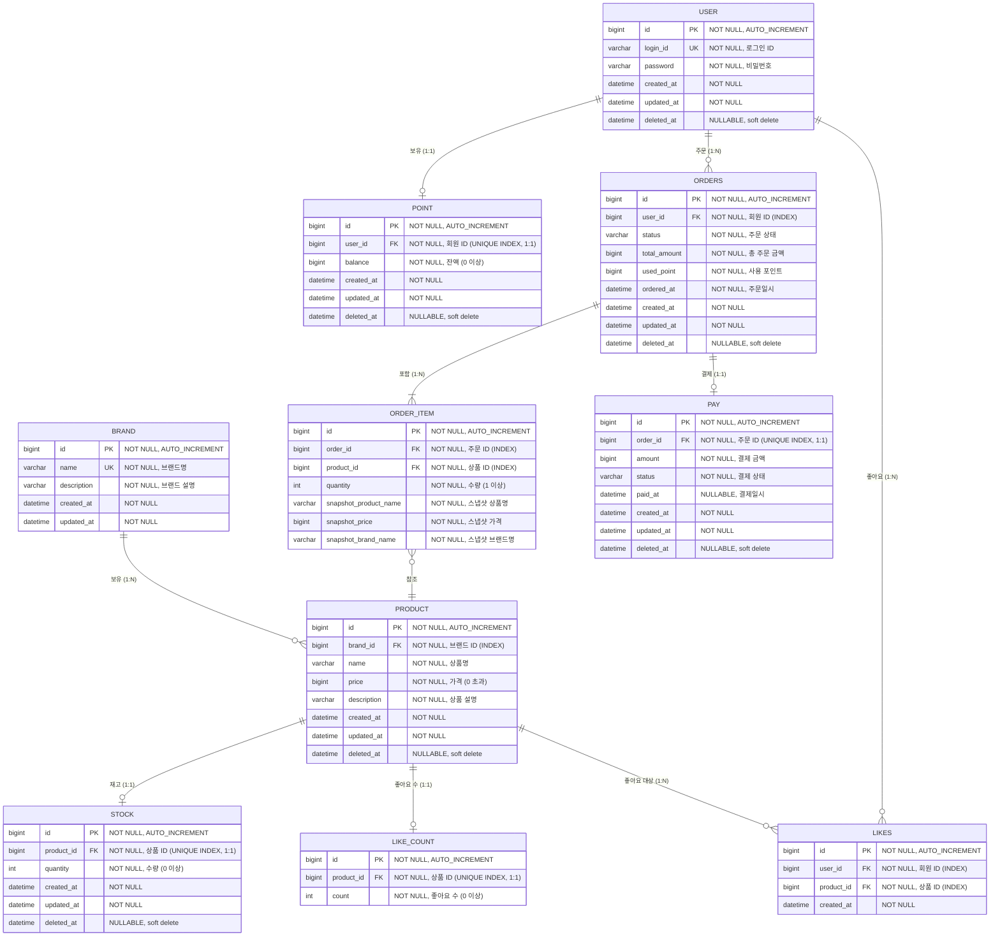
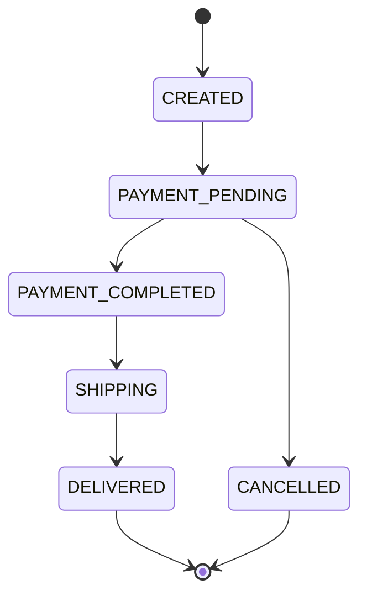

# ERD (Entity Relationship Diagram)

## 1. 전체 ERD

---

## 2. FK 정책

> ERD 상의 FK 관계는 **논리적 연결**만을 표현하며, 실제 데이터베이스에 **FK 제약조건(FOREIGN KEY CONSTRAINT)은 걸지 않는다.**
> 대신 FK 역할을 하는 컬럼에는 **INDEX**를 생성하여 조회 성능을 확보한다.

| 이유 | 설명 |
|---|---|
| 성능 | FK 제약조건은 INSERT/UPDATE/DELETE 시 참조 무결성 검사 비용 발생 |
| 유연성 | soft delete 사용 시 FK 제약과 충돌 가능 (삭제된 레코드 참조) |
| 운영 편의 | 데이터 마이그레이션, 벌크 작업 시 FK 제약이 장애 요인이 될 수 있음 |
| 무결성 보장 | 애플리케이션 레벨에서 도메인 로직으로 참조 무결성을 관리 |

### 인덱스 목록

| 테이블 | 컬럼 | 인덱스 타입 |
|---|---|---|
| `PRODUCT` | `brand_id` | INDEX |
| `STOCK` | `product_id` | UNIQUE INDEX |
| `LIKES` | `user_id, product_id` | UNIQUE INDEX (복합) |
| `LIKES` | `product_id` | INDEX |
| `LIKE_COUNT` | `product_id` | UNIQUE INDEX |
| `ORDERS` | `user_id` | INDEX |
| `ORDER_ITEM` | `order_id` | INDEX |
| `ORDER_ITEM` | `product_id` | INDEX |
| `PAY` | `order_id` | UNIQUE INDEX |
| `POINT` | `user_id` | UNIQUE INDEX |

---

## 3. Enum 정의

### OrderStatus (주문 상태)

| 값 | 설명 | 미완료 여부 |
|---|---|---|
| `CREATED` | 주문 생성 | O |
| `PAYMENT_PENDING` | 결제 대기 | O |
| `PAYMENT_COMPLETED` | 결제 완료 | O |
| `SHIPPING` | 배송 중 | O |
| `DELIVERED` | 배송 완료 | X |
| `CANCELLED` | 주문 취소 | X |

### PayStatus (결제 상태)

| 값 | 설명 |
|---|---|
| `READY` | 결제 준비 |
| `IN_PROGRESS` | 결제 진행 중 |
| `SUCCESS` | 결제 성공 |
| `FAIL` | 결제 실패 |

---

## 4. 삭제 정책 요약

| 테이블 | 삭제 정책 | 비고 |
|---|---|---|
| `USER` | soft delete | `deleted_at` |
| `BRAND` | hard delete | CASCADE: 소속 상품 삭제 흐름 수행 |
| `PRODUCT` | soft delete | `deleted_at` |
| `STOCK` | soft delete | `deleted_at`, 상품과 동일 생명주기 |
| `LIKES` | hard delete | 상품/브랜드 삭제 시 cascade |
| `LIKE_COUNT` | hard delete | 상품/브랜드 삭제 시 cascade |
| `ORDERS` | soft delete | 상태 변경으로 관리 |
| `ORDER_ITEM` | - | 주문에 종속, 독립 삭제 없음 |
| `PAY` | soft delete | 상태 변경으로 관리 |
| `POINT` | soft delete | 회원과 동일 생명주기 |

---

## 5. 유니크 제약조건

| 테이블 | 컬럼 | 설명 |
|---|---|---|
| `USER` | `login_id` | 로그인 ID 중복 불가 |
| `BRAND` | `name` | 브랜드명 중복 불가 |
| `STOCK` | `product_id` | 상품당 재고 1건 |
| `LIKE_COUNT` | `product_id` | 상품당 좋아요 수 1건 |
| `LIKES` | `user_id + product_id` | 동일 회원-상품 좋아요 1건 |
| `PAY` | `order_id` | 주문당 결제 1건 |
| `POINT` | `user_id` | 회원당 포인트 1건 |

---

## 6. 주요 비즈니스 규칙 (테이블 관점)

| 규칙 | 관련 테이블 | 설명 |
|---|---|---|
| 상품 가격 | `PRODUCT` | `price > 0` |
| 재고 수량 | `STOCK` | `quantity >= 0` |
| 포인트 잔액 | `POINT` | `balance >= 0` |
| 좋아요 수 | `LIKE_COUNT` | `count >= 0` |
| 주문 항목 수량 | `ORDER_ITEM` | `quantity >= 1` |
| 브랜드 변경 불가 | `PRODUCT` | `brand_id`는 등록 후 수정 불가 |
| 스냅샷 보존 | `ORDER_ITEM` | 주문 시점의 상품 정보를 별도 컬럼에 저장 |
| 포인트 적립 | `POINT` | 실 결제 금액의 1%, 소수점 내림(floor) |
