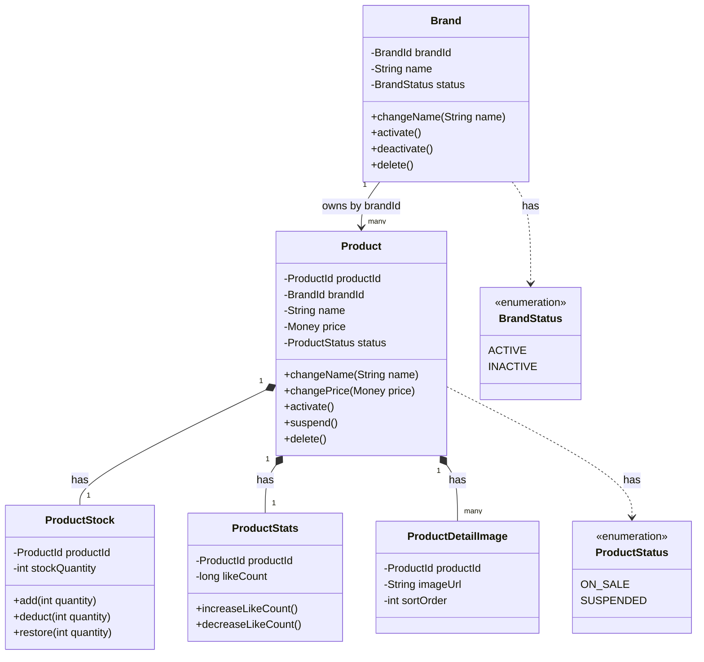
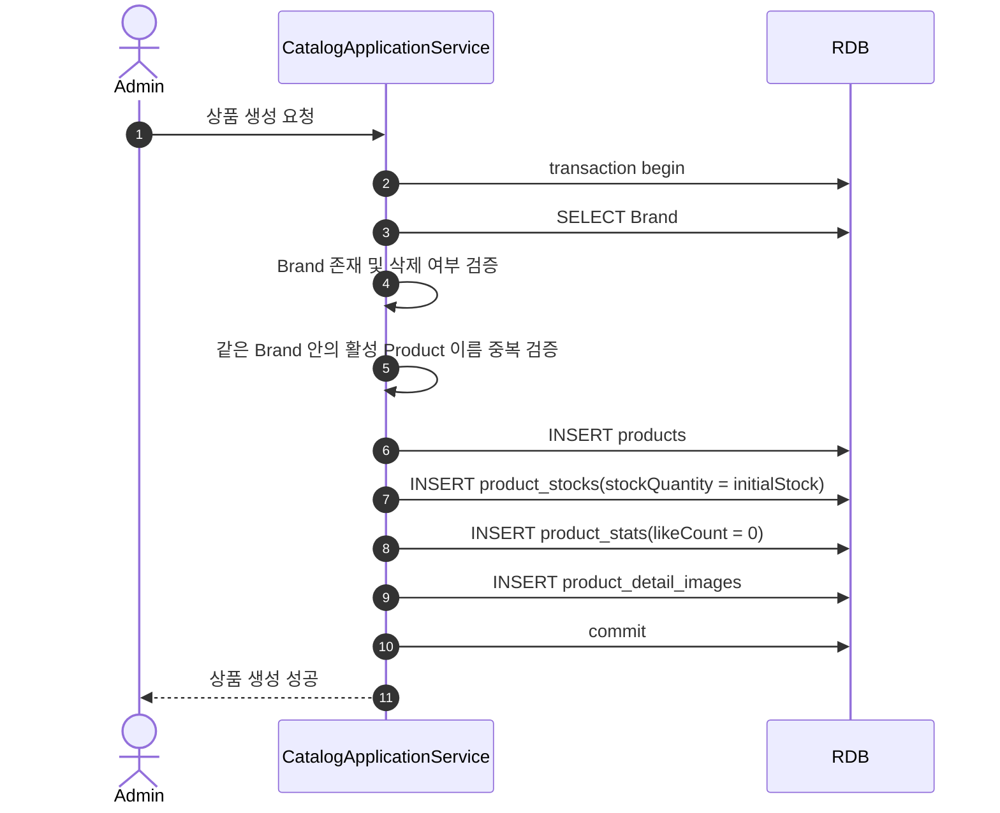
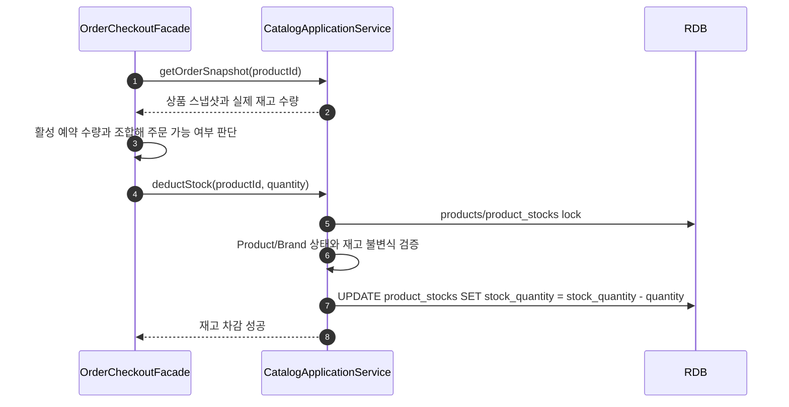

# Catalog Context 설계

## 1. 설계 기준

이 문서는 `docs/HLD.md`의 상품/브랜드 요구사항을 기준으로 Catalog Context를 정의한다.

현재 설계의 우선순위는 단순함이다.

- Catalog는 상품을 전시하고 주문에 필요한 상품 정보를 제공한다.
- Catalog는 브랜드, 상품, 실제 재고 수량, 상품 조회용 집계를 관리한다.
- Catalog는 좋아요 원장, 주문 예약, 결제, 배송을 관리하지 않는다.
- 현재 시스템은 모놀리식 구조와 단일 RDB를 전제로 한다.
- Bounded Context는 물리 서비스가 아니라 패키지와 테이블 소유권 경계다.

## 2. Context 경계

### Catalog가 소유하는 것

- `Brand`: 상품이 속한 브랜드
- `Product`: 소비자에게 전시되고 주문될 수 있는 상품
- `ProductStock`: Product의 실제 재고 수량
- `ProductStats`: 상품 조회용 집계 값
- `ProductDetailImage`: 상품 상세 설명 이미지

### Catalog가 소유하지 않는 것

- Like/Unlike 원장과 사용자별 좋아요 상태
- 주문 재고 예약과 예약 만료
- 주문 상태와 주문 스냅샷
- 결제 승인과 결제 취소
- 추천, 검색 엔진, 통계 전용 저장소

좋아요 Context는 실제 좋아요 history를 관리한다. Catalog는 상품 조회에 필요한 `likeCount` 집계 값만 `ProductStats`에 가진다.

Order Context는 예약 수량과 예약 생명주기를 관리한다. Catalog는 예약이라는 개념을 모른다.

## 3. Actor와 권한

Catalog의 command는 관리자만 수행한다.

- 관리자는 Brand를 생성, 수정, 비활성화, 삭제할 수 있다.
- 관리자는 Product를 생성, 수정, 비활성화, 삭제할 수 있다.
- 관리자는 Product의 실제 재고를 추가할 수 있다.

소비자는 Catalog를 조회만 한다.

- 소비자는 상품 목록을 조회할 수 있다.
- 소비자는 상품 상세를 조회할 수 있다.
- 소비자는 브랜드별 상품을 조회할 수 있다.

Seller 모델은 현재 범위에 포함하지 않는다. 브랜드별 판매자 소유권, 입점, 정산 같은 marketplace 규칙은 별도 요구가 생길 때 다룬다.

## 4. Ubiquitous Language

| 용어 | 의미 |
| :--- | :--- |
| Catalog | 소비자에게 전시되는 상품 정보와 주문에 필요한 상품 기준 정보를 제공하는 Context |
| Brand | 상품이 속한 브랜드. 운영 상태를 가진다 |
| Product | 소비자에게 전시되고 주문될 수 있는 상품 단위 |
| ProductStock | Product의 실제 재고 수량. 예약 수량은 포함하지 않는다 |
| ProductStats | 상품 조회용 집계 값. 현재는 좋아요 수를 저장한다 |
| ProductDetailImage | 상품 상세 설명 이미지 |
| Displayable | 소비자에게 전시될 수 있는 상태 |
| Sold Out | 소비자 화면에서 품절로 보이는 상태. Catalog 단독 상태가 아니라 조회 use case에서 계산한다 |
| Order Snapshot | 주문 Context가 주문 생성에 사용하기 위해 Catalog에서 가져가는 상품 스냅샷 |

## 5. Aggregate와 종속 객체

### 이유

Brand와 Product는 각각 독립적으로 생성/수정/비활성화될 수 있다. 반면 ProductStock, ProductStats, ProductDetailImage는 Product 없이 독립적으로 존재하거나 조회될 이유가 없다.

### 다이어그램



### 해석

`Brand`와 `Product`는 Catalog 안의 Aggregate Root다.

`Product`는 `Brand` 엔터티 객체를 직접 참조하지 않고 `brandId`만 가진다. 전시 가능 여부처럼 Brand 상태가 필요한 조회나 검증은 application/query 레이어에서 Brand와 Product를 함께 읽어 판단한다.

`ProductStock`, `ProductStats`, `ProductDetailImage`는 Product에 종속된다. 테이블은 분리하지만 독립 Aggregate로 보지 않는다.

## 6. Brand 규칙

`BrandStatus`는 운영 상태를 표현한다.

```text
BrandStatus
- ACTIVE
- INACTIVE
```

`ACTIVE`는 브랜드가 전시 가능한 상태라는 의미다.

`INACTIVE`는 브랜드가 운영상 비활성화된 상태다. 이 상태에서는 해당 브랜드의 상품도 소비자에게 전시되지 않는다.

Soft delete는 운영 상태가 아니라 제거 상태다. 브랜드를 숨기는 목적이면 `INACTIVE`를 사용하고, 브랜드를 시스템의 일반 운영 대상에서 제거할 때만 `deletedAt`을 설정한다.

브랜드 이름 중복 규칙은 다음과 같다.

- `brandId`는 재사용할 수 없다.
- `brandName`은 재사용할 수 있다.
- `deletedAt IS NULL`인 Brand 사이에서는 같은 이름을 사용할 수 없다.
- `INACTIVE` Brand는 삭제된 것이 아니므로 이름 중복 대상에 포함한다.
- Soft delete된 Brand의 이름은 새 Brand에서 다시 사용할 수 있다.

## 7. Product 규칙

`ProductStatus`는 관리자 의도만 표현한다.

```text
ProductStatus
- ON_SALE
- SUSPENDED
```

`ON_SALE`은 관리자가 상품을 판매 가능하게 열어둔 상태다.

`SUSPENDED`는 관리자가 상품 전시와 판매를 중지한 상태다.

`OUT_OF_STOCK`은 저장 상태로 두지 않는다. 품절은 재고와 예약 수량을 바탕으로 조회 use case에서 계산한다.

상품 이름 중복 규칙은 다음과 같다.

- `productId`는 재사용할 수 없다.
- 같은 Brand 안에서 `deletedAt IS NULL`인 Product는 같은 이름을 사용할 수 없다.
- 다른 Brand에는 같은 상품명이 존재할 수 있다.
- Soft delete된 Product의 이름은 같은 Brand 안에서도 다시 사용할 수 있다.

Product의 가격은 현재 판매가 하나만 가진다. 가격 이력은 현재 범위에 포함하지 않는다. 주문 Context는 주문 생성 시점의 가격을 주문 스냅샷으로 보존한다.

## 8. 전시 가능성과 품절

전시 가능 여부는 Catalog 기준으로 판단한다.

```text
displayable =
    brand.deletedAt == null
    && brand.status == ACTIVE
    && product.deletedAt == null
    && product.status == ON_SALE
```

Brand를 `INACTIVE`로 바꿀 때 소속 Product를 일괄 `SUSPENDED`로 변경하지 않는다. Product 자체 상태와 Brand 운영 상태는 서로 다른 의미다.

품절 여부는 Product의 저장 상태가 아니다. 소비자 조회 Facade가 필요한 정보를 조합해서 계산한다.

- 상품 목록에서는 Catalog의 실제 재고 수량으로 빠르게 품절 여부를 판단할 수 있다.
- 상품 상세와 주문창처럼 정확한 예약 반영이 필요한 화면에서는 Catalog의 실제 재고 수량과 Order의 활성 예약 수량을 함께 조회해 판단한다.
- Catalog는 Order의 예약 테이블을 직접 조회하지 않는다.
- Catalog는 `reservedQuantity`를 저장하지 않는다.

소비자 응답에는 정확한 재고 수량을 노출하지 않는다. `soldOut` 또는 `orderable` 같은 계산 결과만 내려준다.

관리자 조회에는 실제 재고 수량을 노출할 수 있다.

## 9. ProductStock 규칙

ProductStock은 Product의 실제 재고 수량만 저장한다.

```text
ProductStock
- productId
- stockQuantity
```

ProductStock은 Product 생성 시 같은 transaction 안에서 반드시 생성된다.

재고 불변식은 다음과 같다.

- 재고 수량은 0 미만이 될 수 없다.
- 예약 수량은 ProductStock에 저장하지 않는다.
- 주문 예약 생성, 예약 만료, 예약 취소는 Order Context 책임이다.
- 결제 성공 후 주문이 확정될 때 실제 재고를 차감한다.
- 확정 주문이 배송 시작 전 취소되면 실제 재고를 복구한다.

Catalog가 제공하는 재고 command는 실제 재고 수량 변경만 다룬다.

- `addStock(productId, quantity)`: 관리자가 실제 재고를 추가한다.
- `deductStock(productId, quantity)`: 주문 확정 시 실제 재고를 차감한다.
- `restoreStock(productId, quantity)`: 확정 주문 취소 시 실제 재고를 복구한다.
- `getStockQuantity(productId)`: 다른 use case가 현재 실제 재고 수량을 확인한다.

## 10. ProductStats 규칙

ProductStats는 상품 조회용 집계 값을 저장한다.

```text
ProductStats
- productId
- likeCount
```

ProductStats는 Product 생성 시 같은 transaction 안에서 `likeCount = 0`으로 생성된다.

Like Context는 `product_stats` 테이블을 직접 수정하지 않는다. Like/Unlike 상태 전환이 실제로 발생했을 때 application/facade가 Catalog의 집계 변경 command를 호출한다.

- `increaseLikeCount(productId)`
- `decreaseLikeCount(productId)`

`likeCount`는 0 미만이 될 수 없다.

좋아요 history, 사용자별 현재 좋아요 상태, 멱등 처리는 Like Context 책임이다.

## 11. ProductDetailImage 규칙

상품 상세 설명 이미지는 Product의 부속 정보다. 별도 Media Context를 만들지 않는다.

```text
ProductDetailImage
- productId
- imageUrl
- sortOrder
```

변경 방식은 전체 교체다.

- Product 생성 시 상세 이미지 목록을 함께 저장할 수 있다.
- Product 수정 시 요청으로 받은 이미지 목록이 기존 이미지 목록을 대체한다.
- `sortOrder`는 요청 배열 순서로 결정한다.
- 개별 이미지 추가, 삭제, 정렬 API는 현재 범위에 포함하지 않는다.

## 12. Catalog가 Order에 제공하는 계약

Order Context는 일반 상품 조회 API가 아니라 주문용 스냅샷 인터페이스를 사용한다.

```text
getOrderSnapshot(productId)
```

주문용 스냅샷은 최소 정보만 포함한다.

- `productId`
- `productName`
- `brandId`
- `brandName`
- `price`
- `stockQuantity`
- Catalog 기준 전시 가능 여부

포함하지 않는 정보는 다음과 같다.

- 상세 이미지
- 좋아요 수
- 정확한 예약 수량
- Order 내부 예약 상태

Order Context는 Catalog 스냅샷과 Order가 가진 활성 예약 수량을 조합해 예약 가능 여부를 판단한다.

Catalog는 예약 가능 여부의 최종 판단을 하지 않는다. Catalog는 자기 Context 안의 Product/Brand 상태와 실제 재고 수량만 제공한다.

## 13. 주요 흐름

### 상품 생성

#### 이유

Product는 실제 재고, 조회 집계, 상세 이미지를 종속 정보로 가진다. 생성 성공 단위도 함께 묶여야 한다.

#### 다이어그램



#### 해석

Brand가 `INACTIVE`여도 Product를 생성할 수 있는지는 관리자 운영 정책이다. 현재 Catalog의 핵심 전시 규칙은 생성 가능 여부가 아니라 소비자 전시 가능 여부다. 단순하게 시작하려면 삭제되지 않은 Brand에만 Product를 생성할 수 있게 한다.

### 주문 확정 재고 차감

#### 이유

Catalog는 예약을 모르고, 주문 확정 시점의 실제 재고 차감만 책임진다.

#### 다이어그램



#### 해석

Order가 예약 가능성을 판단하지만 실제 재고 차감 불변식은 Catalog가 마지막으로 한 번 더 보호한다. 차감 시점에 재고가 부족하면 Catalog는 실패를 반환하고, Order use case는 주문 완료로 진행하지 않는다.

## 14. Domain Event

Catalog는 현재 범위에서 필요한 상태 변경 사실만 이벤트로 남긴다.

- `BrandCreated`
- `BrandStatusChanged`
- `ProductCreated`
- `ProductUpdated`
- `ProductStatusChanged`
- `ProductStockChanged`

현재 범위에서 제외하는 이벤트는 다음과 같다.

- `ProductViewed`: 조회 이벤트는 현재 범위 밖이다.
- `ProductStatsChanged`: 좋아요 수 반영은 조회 집계 갱신이며 별도 이벤트가 필요한 use case가 없다.
- `ProductImageChanged`: 상품 수정 이벤트에 포함할 수 있다.

이 문서는 이벤트 저장 방식이나 재시도 정책을 정하지 않는다. 그런 규칙은 시스템 공통 아키텍처 또는 이벤트 처리 설계에서 다룬다.

## 15. 영속성 모델

물리 FK는 사용하지 않는다. Context 내부 참조도 DB constraint가 아니라 도메인 식별자와 application 검증으로 다룬다.

### `brands`

| 컬럼 | 의미 |
| :--- | :--- |
| `id` | 물리 PK |
| `brand_id` | 재사용 불가 도메인 식별자 |
| `name` | 브랜드 이름 |
| `status` | `ACTIVE`, `INACTIVE` |
| `created_at` | 생성 시각 |
| `updated_at` | 수정 시각 |
| `deleted_at` | soft delete 시각 |

제약과 조회 기준:

- `brand_id`는 unique다.
- 이름 중복은 `deleted_at IS NULL`인 row만 대상으로 검사한다.
- soft delete된 이름은 재사용할 수 있으므로 `name`에 unconditional unique constraint를 걸지 않는다.

### `products`

| 컬럼 | 의미 |
| :--- | :--- |
| `id` | 물리 PK |
| `product_id` | 재사용 불가 도메인 식별자 |
| `brand_id` | 소속 Brand의 도메인 식별자 |
| `name` | 상품 이름 |
| `price` | 현재 판매가 |
| `status` | `ON_SALE`, `SUSPENDED` |
| `created_at` | 생성 시각 |
| `updated_at` | 수정 시각 |
| `deleted_at` | soft delete 시각 |

제약과 조회 기준:

- `product_id`는 unique다.
- 같은 Brand 안의 상품명 중복은 `deleted_at IS NULL`인 row만 대상으로 검사한다.
- soft delete된 상품명은 같은 Brand 안에서도 재사용할 수 있으므로 `(brand_id, name)`에 unconditional unique constraint를 걸지 않는다.

### `product_stocks`

| 컬럼 | 의미 |
| :--- | :--- |
| `id` | 물리 PK |
| `product_id` | Product의 도메인 식별자 |
| `stock_quantity` | 실제 재고 수량 |
| `created_at` | 생성 시각 |
| `updated_at` | 수정 시각 |
| `deleted_at` | soft delete 시각 |

제약과 조회 기준:

- `product_id`는 unique다.
- Product와 1:1로 생성된다.
- `stock_quantity`는 0 미만이 될 수 없다.
- `reserved_quantity`는 두지 않는다.

### `product_stats`

| 컬럼 | 의미 |
| :--- | :--- |
| `id` | 물리 PK |
| `product_id` | Product의 도메인 식별자 |
| `like_count` | 현재 좋아요 수 집계 |
| `created_at` | 생성 시각 |
| `updated_at` | 수정 시각 |
| `deleted_at` | soft delete 시각 |

제약과 조회 기준:

- `product_id`는 unique다.
- Product와 1:1로 생성된다.
- `like_count`는 0 미만이 될 수 없다.

### `product_detail_images`

| 컬럼 | 의미 |
| :--- | :--- |
| `id` | 물리 PK |
| `product_id` | Product의 도메인 식별자 |
| `image_url` | 상세 설명 이미지 URL |
| `sort_order` | 표시 순서 |
| `created_at` | 생성 시각 |
| `updated_at` | 수정 시각 |
| `deleted_at` | soft delete 시각 |

제약과 조회 기준:

- 한 Product 안에서 `sort_order` 순서로 조회한다.
- 수정 시 기존 상세 이미지 목록을 새 목록으로 전체 교체한다.

## 16. 현재 제외하는 것

다음은 현재 Catalog 설계 범위에 포함하지 않는다.

- Seller 소유권 모델
- 가격 이력
- 재고 예약 수량 저장
- 재고 입출고 원장
- 창고별 재고
- Media/Image 별도 Context
- 검색 인덱스
- 추천 또는 통계 전용 저장소
- 조회수 이벤트
- 좋아요 원장과 사용자별 좋아요 상태
