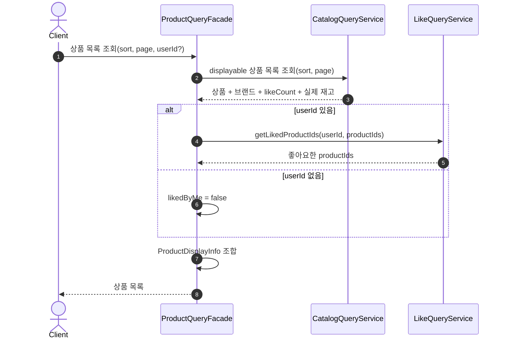
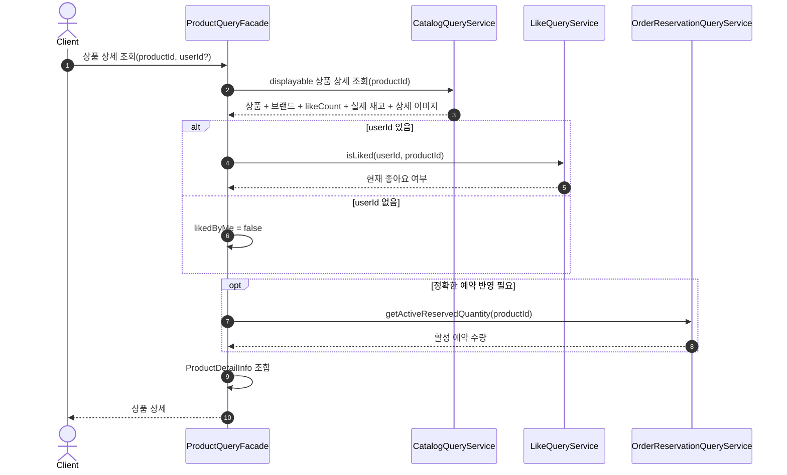

# Catalog 조회 조합 설계

## 1. 설계 기준

이 문서는 상품 목록과 상품 상세 조회에서 Catalog, Like, Order 정보를 어떻게 조합하는지 정의한다.

기존 Catalog 설계는 상품, 브랜드, 재고, 좋아요 수 집계를 소유한다. 이 문서는 그 데이터를 API 조회 결과로 조합하는 application/query 흐름만 다룬다.

- Catalog는 상품과 브랜드, 상품 조회용 집계를 조회한다.
- Like는 사용자별 현재 좋아요 상태를 조회한다.
- Order는 정확한 예약 반영이 필요한 경우 활성 예약 수량을 조회한다.
- 조회 결과는 domain entity가 아니라 application read model 또는 Info로 반환한다.

## 2. 조회 모델

상품 목록과 상품 상세는 다음 정보를 조합한다.

```text
ProductDisplayInfo
- productId
- productName
- brandId
- brandName
- price
- likeCount
- likedByMe
- soldOut
```

상품 상세는 여기에 상세 설명 이미지를 추가한다.

```text
ProductDetailInfo
- ProductDisplayInfo
- detailImages
```

`likedByMe`는 소비자 식별자가 있을 때만 Like Context에서 조회한다. 소비자 식별자가 없으면 `false`로 둔다.

## 3. 정렬 조건

상품 목록은 세 가지 정렬 조건을 제공한다.

```text
ProductSort
- latest
- price_asc
- likes_desc
```

정렬 기준은 다음과 같다.

- `latest`: 상품 생성 시각 내림차순
- `price_asc`: 가격 오름차순, 상품 생성 시각 내림차순
- `likes_desc`: `ProductStats.likeCount` 내림차순, 상품 생성 시각 내림차순

목록 조회는 Catalog 기준 전시 가능한 상품만 반환한다.

```text
displayable =
    brand.deletedAt == null
    && brand.status == ACTIVE
    && product.deletedAt == null
    && product.status == ON_SALE
```

## 4. 상품 목록 조회 흐름

### 이유

상품 목록은 Catalog 안의 상품/브랜드/집계를 기준으로 정렬하고, 사용자별 좋아요 상태만 Like에서 보강한다.

### 다이어그램



### 해석

`likes_desc` 정렬은 Like history를 직접 조회하지 않는다. Catalog의 `ProductStats.likeCount`를 기준으로 정렬한다.

상품 목록의 `soldOut`은 Catalog의 실제 재고 수량 기준으로 빠르게 계산한다. 예약 수량까지 반영한 정확한 주문 가능 여부는 주문창 접근에서 최종 검증한다.

## 5. 상품 상세 조회 흐름

### 이유

상품 상세는 상품, 브랜드, 좋아요 수, 상세 이미지, 사용자별 좋아요 상태를 함께 보여준다. 정확한 예약 반영이 필요한 화면이면 Order의 활성 예약 수량도 함께 조회한다.

### 다이어그램



### 해석

상품 상세 조회는 Catalog의 상품 상태를 먼저 확인한다. Catalog 기준 전시 가능하지 않은 상품은 소비자 조회에서 반환하지 않는다.

Order의 활성 예약 수량은 `soldOut` 또는 `orderable`을 더 정확히 표시해야 할 때만 사용한다. 이 조회는 재고 예약이 아니며 상태를 변경하지 않는다.

## 6. Application Layer 책임

`ProductQueryFacade`는 bounded context를 넘는 조회 조합만 담당한다.

- Catalog 조회 결과를 기준 데이터로 삼는다.
- Like에 사용자별 좋아요 상태를 요청한다.
- 필요한 경우 Order에 활성 예약 수량을 요청한다.
- API response에 필요한 read model을 만든다.

Catalog, Like, Order의 domain entity를 API response로 직접 반환하지 않는다.

## 7. 현재 제외하는 것

다음은 현재 Catalog 조회 조합 설계 범위에 포함하지 않는다.

- 검색어 기반 검색
- 카테고리 또는 필터 조건
- 추천 정렬
- 통계 전용 read store
- 캐시 전략
- 비동기 집계 보정
