# Sequence Diagrams

## 설계 의도

이 문서는 `01-requirements.md`와 `04-erd.md`를 기준으로 한 목표 런타임 협력 흐름을 정리한다.
현재 구현된 user 도메인의 패턴을 참고하지만, 엔드포인트와 컬럼명은 요구사항/ERD 문서를 우선한다.

시퀀스 다이어그램은 API 호출 목록이 아니라 유스케이스의 책임 흐름을 보여주는 데 집중한다.
따라서 API별 Controller 이름은 대부분 `CustomerAPI`, `AdminAPI` boundary로 추상화하고, 관련 endpoint는 각 다이어그램 아래에 별도로 남긴다.

현재 결제 흐름은 주문 생성, 결제 요청 기록, 외부 결제 호출, 결과 반영으로 경계를 나눈다. 주문 생성은 재고·쿠폰·주문만 원자적으로 처리하고, 별도 결제 요청이 `PaymentModel`을 만든 뒤 DB 트랜잭션 밖에서 외부 결제 시스템을 호출한다. 승인·실패·상태 불명은 각각의 결과 처리 트랜잭션과 내부/외부 outbox로 회복 가능하게 남긴다.
Round 8 대기열 흐름은 Redis를 유일한 권위 저장소로 사용하고, `WaitingQueuePort` 뒤의 단일 `RedissonWaitingQueueAdapter`가 Lua 원자 연산으로 대기/입장/토큰 상태를 전이한다. 주문 항목에 `LIMITED` 상품이 하나라도 있을 때만 주문 mutation 전에 `X-Queue-Token`을 예약하며, `NORMAL` 상품만 있는 주문은 기존 Round 7 흐름으로 바로 진행한다.

검증 관점은 다음과 같다.

- 사용자/관리자 인증 헤더가 API boundary에서 분리되는가?
- 도메인 간 협력은 Facade에서 조합되고, Service끼리 직접 의존하지 않는가?
- 여러 도메인 상태를 함께 바꾸는 유스케이스가 하나의 트랜잭션 경계 안에서 처리되는가?
- 좋아요 멱등성, 재고 부족 전체 거부, 쿠폰 중복 사용 방지, 브랜드 삭제 시 상품 soft delete 같은 핵심 정책이 흐름 안에 드러나는가?
- 좋아요·판매·조회 지표는 원천 상태와 이벤트에서 파생되는 `product_metrics` eventually consistent projection이며, 쿠폰 발급 요청은 비동기 command로 접수/처리/조회가 분리되는가?
- 로컬 부가 로그는 `ApplicationEvent`와 `@TransactionalEventListener(AFTER_COMMIT)`로 실행되고, 시스템 간 전파용 outbox는 `BEFORE_COMMIT`에서 원천 상태와 함께 저장되는가?
- 대기열은 Redis `INCR` sequence와 Sorted Set을 권위 순서로 삼고, enqueue/admit/token reserve/consume/release가 각각 하나의 Lua 원자 경계인가?

## 표기 규칙

- `CustomerAPI`, `AdminAPI`는 HTTP Controller 계층을 추상화한 boundary다. (영문 유지)
- `Facade`는 유스케이스 조합 책임, `Service`는 도메인 규칙 수행 책임, `Repository`는 영속성 port 책임을 뜻한다.
- 단일 도메인 변경은 Service가 트랜잭션 경계를 가진다. 여러 도메인을 함께 변경하는 유스케이스는 Facade가 트랜잭션 경계를 가진다.
- 메시지 라벨은 메서드 시그니처가 아니라 **한글 자연어로 의도**를 표기한다.
- 도메인 예외는 `예외(제약조건 간단 설명)` 형식으로 표기한다. 예: `예외(현재 비밀번호 불일치)`, `예외(재고 부족)`.
- HTTP 상태 코드는 코드 + 한글로 표기한다. 예: `200 성공`, `201 생성됨`, `204 응답 본문 없음`, `400 잘못된 요청`, `401 인증 실패`, `404 자원 없음`, `409 충돌`.

## 1. 공통 사용자 인증 흐름

로그인 필요 API는 `X-Loopers-LoginId`, `X-Loopers-LoginPw` 헤더로 사용자를 식별한다.
여정별 다이어그램에서는 이 흐름을 "고객 인증" 노트로 축약한다.

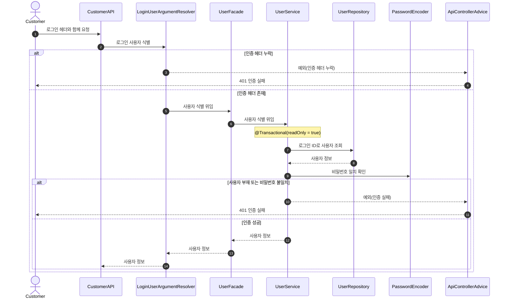
```mermaid
sequenceDiagram
    autonumber
    actor Customer
    participant CustomerAPI
    participant Resolver as LoginUserArgumentResolver
    participant UserFacade
    participant UserService
    participant UserRepository
    participant PasswordEncoder
    participant Advice as ApiControllerAdvice

    Customer->>CustomerAPI: 로그인 헤더와 함께 요청
    CustomerAPI->>Resolver: 로그인 사용자 식별
    alt 인증 헤더 누락
        Resolver-->>Advice: 예외(인증 헤더 누락)
        Advice-->>Customer: 401 인증 실패
    else 인증 헤더 존재
        Resolver->>UserFacade: 사용자 식별 위임
        UserFacade->>UserService: 사용자 식별 위임
        Note over UserService: @Transactional(readOnly = true)
        UserService->>UserRepository: 로그인 ID로 사용자 조회
        UserRepository-->>UserService: 사용자 정보
        UserService->>PasswordEncoder: 비밀번호 일치 확인
        alt 사용자 부재 또는 비밀번호 불일치
            UserService-->>Advice: 예외(인증 실패)
            Advice-->>Customer: 401 인증 실패
        else 인증 성공
            UserService-->>UserFacade: 사용자 정보
            UserFacade-->>Resolver: 사용자 정보
            Resolver-->>CustomerAPI: 사용자 정보
        end
    end
```

관련 API:

- 로그인 필요 API 전체

## 2. 공통 관리자 인증 흐름

관리자 API는 `/api-admin/v1` prefix와 `X-Loopers-Ldap` 헤더를 사용한다.
초기 구현은 관리자 전용 Controller 메서드에서 헤더를 직접 검증하고, 반복이 커지면 별도 resolver로 분리할 수 있다.

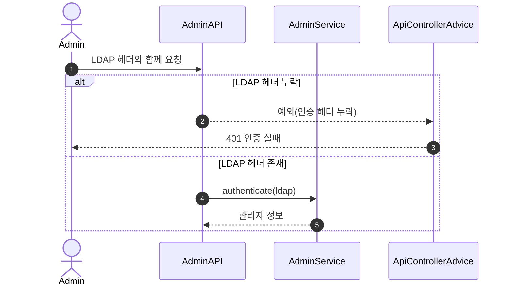
```mermaid
sequenceDiagram
    autonumber
    actor Admin
    participant AdminAPI
    participant AdminService
    participant Advice as ApiControllerAdvice

    Admin->>AdminAPI: LDAP 헤더와 함께 요청
    alt LDAP 헤더 누락
        AdminAPI-->>Advice: 예외(인증 헤더 누락)
        Advice-->>Admin: 401 인증 실패
    else LDAP 헤더 존재
        AdminAPI->>AdminService: authenticate(ldap)
        AdminService-->>AdminAPI: 관리자 정보
    end
```

관련 API:

- 관리자 API 전체 (`/api-admin/v1/**`)

## 3. User-J1 첫 주문

신규 사용자가 가입 후 상품을 탐색하고, 관심 상품을 좋아요로 표시한 뒤 주문을 확정하는 정상 흐름이다.
이 다이어그램은 전체 여정의 책임 연결을 보여주고, 좋아요 멱등성과 재고 부족 실패 정책은 별도 다이어그램에서 상세히 다룬다.

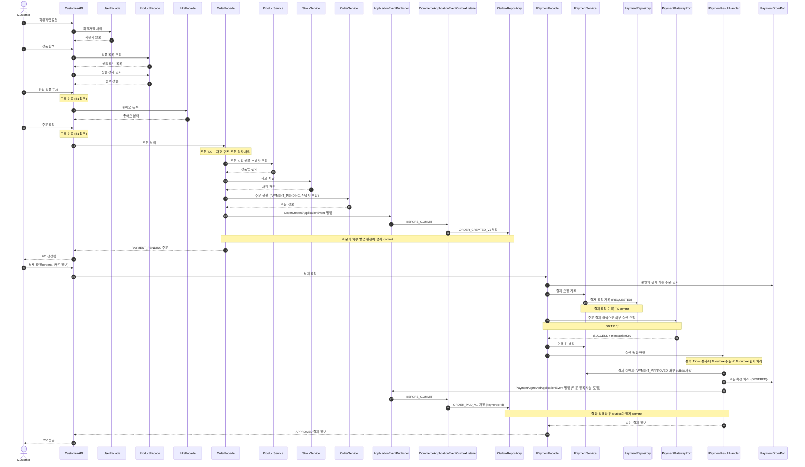
```mermaid
sequenceDiagram
    autonumber
    actor Customer
    participant CustomerAPI
    participant UserFacade
    participant CatalogFacade as ProductFacade
    participant LikeFacade
    participant OrderFacade
    participant ProductService
    participant StockService
    participant OrderService
    participant Events as ApplicationEventPublisher
    participant Listener as CommerceApplicationEventOutboxListener
    participant OutboxRepository
    participant PaymentFacade
    participant PaymentService
    participant PaymentRepository
    participant PaymentGateway as PaymentGatewayPort
    participant ResultHandler as PaymentResultHandler
    participant PaymentOrder as PaymentOrderPort

    Customer->>CustomerAPI: 회원가입 요청
    CustomerAPI->>UserFacade: 회원가입 처리
    UserFacade-->>CustomerAPI: 사용자 정보

    Customer->>CustomerAPI: 상품 탐색
    CustomerAPI->>CatalogFacade: 상품 목록 조회
    CatalogFacade-->>CustomerAPI: 상품 후보 목록
    CustomerAPI->>CatalogFacade: 상품 상세 조회
    CatalogFacade-->>CustomerAPI: 선택 상품

    Customer->>CustomerAPI: 관심 상품 표시
    Note over CustomerAPI: 고객 인증 (§1 참조)
    CustomerAPI->>LikeFacade: 좋아요 등록
    LikeFacade-->>CustomerAPI: 좋아요 상태

    Customer->>CustomerAPI: 주문 요청
    Note over CustomerAPI: 고객 인증 (§1 참조)
    CustomerAPI->>OrderFacade: 주문 처리
    Note over OrderFacade: 주문 TX — 재고·쿠폰·주문 원자 처리
    OrderFacade->>ProductService: 주문 시점 상품 스냅샷 조회
    ProductService-->>OrderFacade: 상품명·단가
    OrderFacade->>StockService: 재고 차감
    StockService-->>OrderFacade: 차감 완료
    OrderFacade->>OrderService: 주문 생성 (PAYMENT_PENDING, 스냅샷 포함)
    OrderService-->>OrderFacade: 주문 정보
    OrderFacade->>Events: OrderCreatedApplicationEvent 발행
    Events->>Listener: BEFORE_COMMIT
    Listener->>OutboxRepository: ORDER_CREATED_V1 저장
    Note over OrderFacade,OutboxRepository: 주문과 외부 발행 원천이 함께 commit
    OrderFacade-->>CustomerAPI: PAYMENT_PENDING 주문
    CustomerAPI-->>Customer: 201 생성됨

    Customer->>CustomerAPI: 결제 요청(orderId, 카드 정보)
    CustomerAPI->>PaymentFacade: 결제 요청
    PaymentFacade->>PaymentOrder: 본인의 결제 가능 주문 조회
    PaymentFacade->>PaymentService: 결제 요청 기록
    PaymentService->>PaymentRepository: 결제 요청 기록 (REQUESTED)
    Note over PaymentService,PaymentRepository: 결제 요청 기록 TX commit
    PaymentFacade->>PaymentGateway: 주문 결제 금액으로 외부 승인 요청
    Note over PaymentFacade,PaymentGateway: DB TX 밖
    PaymentGateway-->>PaymentFacade: SUCCESS + transactionKey
    PaymentFacade->>PaymentService: 거래 키 배정
    PaymentFacade->>ResultHandler: 승인 결과 반영
    Note over ResultHandler: 결과 TX — 결제·내부 outbox·주문·외부 outbox 원자 처리
    ResultHandler->>PaymentService: 결제 승인과 PAYMENT_APPROVED 내부 outbox 저장
    ResultHandler->>PaymentOrder: 주문 확정 처리 (ORDERED)
    ResultHandler->>Events: PaymentApprovedApplicationEvent 발행 (주문 항목 사실 포함)
    Events->>Listener: BEFORE_COMMIT
    Listener->>OutboxRepository: ORDER_PAID_V1 저장 (key=orderId)
    Note over ResultHandler,OutboxRepository: 결과 상태와 두 outbox가 함께 commit
    ResultHandler-->>PaymentFacade: 승인 결제 정보
    PaymentFacade-->>CustomerAPI: APPROVED 결제 정보
    CustomerAPI-->>Customer: 200 성공
```

관련 API:

- `POST /api/v1/users`
- `GET /api/v1/products`
- `GET /api/v1/products/{productId}`
- `POST /api/v1/products/{productId}/likes`
- `POST /api/v1/orders`
- `POST /api/v1/payments`
- `GET /api/v1/orders/{orderId}`

핵심 포인트:

- 상품 탐색은 `ProductFacade`로 묶고, 주문 생성의 핵심 책임은 스냅샷 생성, 재고 차감, 쿠폰 사용, 주문 저장이다. 결제 기록과 외부 결제는 별도 `PaymentFacade` 흐름이다.
- 주문 항목에는 상품명과 단가 스냅샷이 저장되어 이후 상품 변경과 독립적으로 과거 주문을 보여준다.
- 외부 결제 호출은 어떤 DB 트랜잭션에도 속하지 않는다. `PaymentService`가 `REQUESTED` 기록을 먼저 커밋하고, `PaymentFacade`가 외부 호출을 수행하며, `PaymentResultHandler`가 확정 결과를 별도 트랜잭션으로 반영한다.
- 결제 승인 트랜잭션은 route가 없는 내부 `PAYMENT_APPROVED` outbox와 Kafka 발행 원천인 `ORDER_PAID_V1` outbox를 함께 남긴다. relay는 후자의 저장된 topic/key/payload만 사용한다.

## 4. User-J3 비밀번호 변경

비밀번호 변경은 현재 인증이 이미 끝났더라도, 저장 직전 최신 비밀번호를 잠금 조회 후 다시 검증한다.

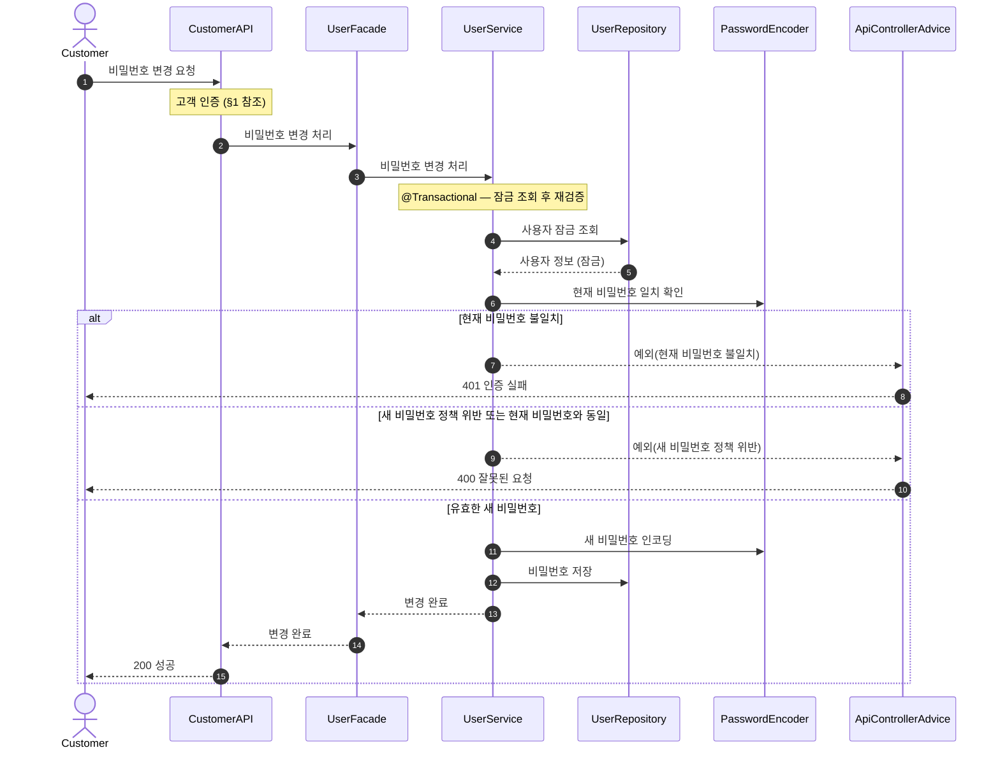
```mermaid
sequenceDiagram
    autonumber
    actor Customer
    participant CustomerAPI
    participant UserFacade
    participant UserService
    participant UserRepository
    participant PasswordEncoder
    participant Advice as ApiControllerAdvice

    Customer->>CustomerAPI: 비밀번호 변경 요청
    Note over CustomerAPI: 고객 인증 (§1 참조)
    CustomerAPI->>UserFacade: 비밀번호 변경 처리
    UserFacade->>UserService: 비밀번호 변경 처리
    Note over UserService: @Transactional — 잠금 조회 후 재검증
    UserService->>UserRepository: 사용자 잠금 조회
    UserRepository-->>UserService: 사용자 정보 (잠금)
    UserService->>PasswordEncoder: 현재 비밀번호 일치 확인
    alt 현재 비밀번호 불일치
        UserService-->>Advice: 예외(현재 비밀번호 불일치)
        Advice-->>Customer: 401 인증 실패
    else 새 비밀번호 정책 위반 또는 현재 비밀번호와 동일
        UserService-->>Advice: 예외(새 비밀번호 정책 위반)
        Advice-->>Customer: 400 잘못된 요청
    else 유효한 새 비밀번호
        UserService->>PasswordEncoder: 새 비밀번호 인코딩
        UserService->>UserRepository: 비밀번호 저장
        UserService-->>UserFacade: 변경 완료
        UserFacade-->>CustomerAPI: 변경 완료
        CustomerAPI-->>Customer: 200 성공
    end
```

관련 API:

- `PUT /api/v1/users/password`

핵심 포인트:

- 현재 비밀번호 불일치는 `401 인증 실패`로 응답한다.
- 새 비밀번호 포맷 오류, 생년월일 토큰 포함, 현재 비밀번호와 동일한 새 비밀번호는 모두 `400 잘못된 요청`으로 묶는다.

## 5. User-J4 좋아요 토글과 목록 조회

좋아요는 사용자와 상품 쌍의 현재 상태다.
`POST`와 `DELETE`는 최종 상태 기준으로 멱등하게 동작한다.

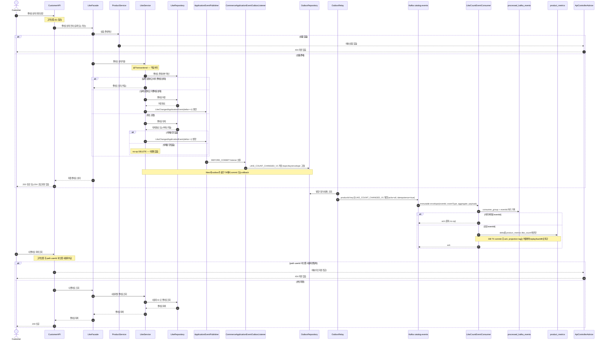
```mermaid
sequenceDiagram
    autonumber
    actor Customer
    participant CustomerAPI
    participant LikeFacade
    participant ProductService
    participant LikeService
    participant LikeRepository
    participant Events as ApplicationEventPublisher
    participant Listener as CommerceApplicationEventOutboxListener
    participant OutboxRepository
    participant Relay as OutboxRelay
    participant Kafka as Kafka catalog-events
    participant Consumer as LikeCountEventConsumer
    participant ProcessedEvents as processed_kafka_events
    participant Projection as product_metrics
    participant Advice as ApiControllerAdvice

    Customer->>CustomerAPI: 좋아요 상태 변경 요청
    Note over CustomerAPI: 고객 인증 (§1 참조)
    CustomerAPI->>LikeFacade: 좋아요 상태 전이 (등록 또는 취소)
    LikeFacade->>ProductService: 상품 존재 확인
    alt 상품 없음
        ProductService-->>Advice: 예외(상품 없음)
        Advice-->>Customer: 404 자원 없음
    else 상품 존재
        LikeFacade->>LikeService: 좋아요 상태 적용
        Note over LikeService: @Transactional — 멱등 처리
        LikeService->>LikeRepository: 좋아요 존재 여부 확인
        alt 등록 요청이고 이미 좋아요 상태
            LikeService-->>LikeFacade: 좋아요 유지 (멱등)
        else 등록 요청이고 미좋아요 상태
            LikeService->>LikeRepository: 좋아요 저장
            LikeRepository-->>LikeService: 저장 완료
            LikeService->>Events: LikeChangedApplicationEvent(delta=+1) 발행
        else 취소 요청
            LikeService->>LikeRepository: 좋아요 삭제
            LikeRepository-->>LikeService: 삭제 완료 또는 부재 (멱등)
            alt 삭제된 행 있음
                LikeService->>Events: LikeChangedApplicationEvent(delta=-1) 발행
            else 삭제된 행 없음
                Note over LikeService: no-op DELETE — 이벤트 없음
            end
        end
        Events->>Listener: BEFORE_COMMIT listener 호출
        Listener->>OutboxRepository: LIKE_COUNT_CHANGED_V1 저장 (topic/key/envelope 고정)
        Note over LikeService,OutboxRepository: likes와 outbox가 같은 TX에서 commit 또는 rollback
        LikeFacade-->>CustomerAPI: 최종 좋아요 상태
        CustomerAPI-->>Customer: 200 성공 또는 204 응답 본문 없음
    end

    Relay->>OutboxRepository: 발행 대기 이벤트 조회
    Relay->>Kafka: productId key로 LIKE_COUNT_CHANGED_V1 발행 (acks=all, idempotence=true)
    Kafka-->>Consumer: immutable envelope(eventId, eventType, aggregate, payload)
    Consumer->>ProcessedEvents: consumer_group + eventId 처리 기록
    alt 이미 처리된 eventId
        Consumer-->>Kafka: ack (중복 no-op)
    else 신규 eventId
        Consumer->>Projection: delta를 product_metrics.like_count에 반영
        Note over Consumer,Projection: DB TX commit 후 ack. projection lag는 허용하며 replay/backfill로 복구
        Consumer-->>Kafka: ack
    end

    Customer->>CustomerAPI: 내 좋아요 목록 조회
    Note over CustomerAPI: 고객 인증 후 path userId 와 인증 사용자 비교
    alt path userId 와 인증 사용자 불일치
        CustomerAPI-->>Advice: 예외(타인 자원 접근)
        Advice-->>Customer: 404 자원 없음
    else 본인 자원
        CustomerAPI->>LikeFacade: 내 좋아요 조회
        LikeFacade->>LikeService: 사용자별 좋아요 조회
        LikeService->>LikeRepository: 사용자 ID 로 좋아요 조회
        LikeRepository-->>LikeService: 좋아요 목록
        LikeService-->>LikeFacade: 좋아요 목록
        LikeFacade-->>CustomerAPI: 좋아요 목록
        CustomerAPI-->>Customer: 200 성공
    end
```

관련 API:

- `POST /api/v1/products/{productId}/likes`
- `DELETE /api/v1/products/{productId}/likes`
- `GET /api/v1/users/{userId}/likes`

핵심 포인트:

- 좋아요 목록은 user에서 likes 컬렉션을 양방향으로 열지 않고 `LikeRepository.findByUserId` 명시 쿼리로 조회한다.
- 좋아요 이력이 아니라 현재 상태만 필요하므로 취소는 hard delete를 기본으로 둔다.
- 좋아요 수는 `likes`의 직접 권위 상태가 아니라 `LIKE_COUNT_CHANGED_V1`을 Kafka consumer가 `product_metrics`에 반영한 eventually consistent projection이다. 실제 상태 전이가 없는 반복 `POST`/`DELETE`는 이벤트를 만들지 않는다.
- Kafka topic은 `catalog-events`, key는 `productId`, 이벤트 식별자는 UUID `eventId`, 증감량은 `delta=+1/-1`이다. consumer는 `processed_kafka_events`로 eventId를 dedupe하고 `product_metrics`에 중복 delta를 적용하지 않는다.
- consumer lag나 장애 후 재처리 때문에 상품 목록·상세의 좋아요 수는 짧게 늦을 수 있다. 필요 시 Kafka replay 또는 `likes` 기준 backfill/rebuild로 projection을 복구한다.
- 본인 외 자원 접근은 자원 존재 여부를 노출하지 않기 위해 `404 자원 없음`으로 응답한다.

## 5. Round 7 이벤트 파이프라인

로컬 이벤트는 트랜잭션 경계 안의 핵심 상태 변경과 커밋 이후 부가 처리를 나눈다.
시스템 간 전파가 필요한 이벤트는 outbox를 거쳐 Kafka로 발행한다.

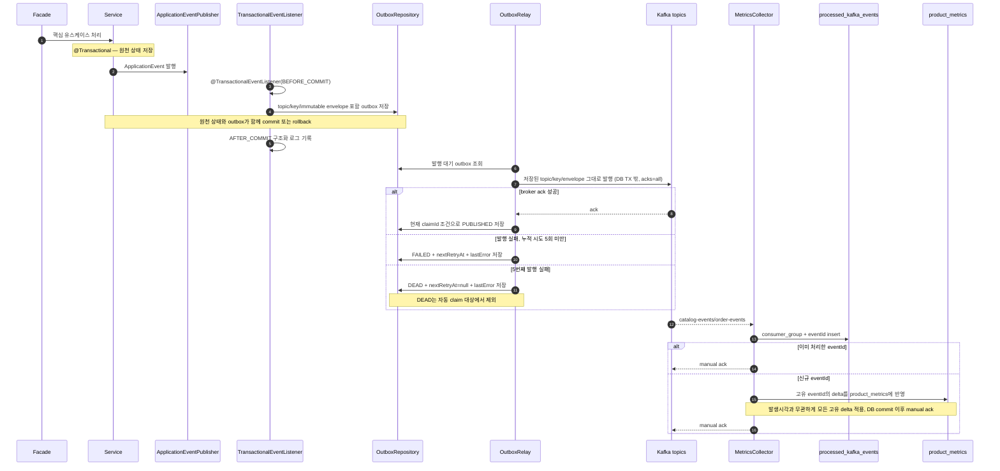
```mermaid
sequenceDiagram
    autonumber
    participant Facade
    participant Service
    participant Events as ApplicationEventPublisher
    participant Listener as TransactionalEventListener
    participant OutboxRepository
    participant Relay as OutboxRelay
    participant Kafka as Kafka topics
    participant Streamer as MetricsCollector
    participant ProcessedEvents as processed_kafka_events
    participant Metrics as product_metrics

    Facade->>Service: 핵심 유스케이스 처리
    Note over Service: @Transactional — 원천 상태 저장
    Service->>Events: ApplicationEvent 발행
    Listener->>Listener: @TransactionalEventListener(BEFORE_COMMIT)
    Listener->>OutboxRepository: topic/key/immutable envelope 포함 outbox 저장
    Note over Service,OutboxRepository: 원천 상태와 outbox가 함께 commit 또는 rollback
    Listener->>Listener: AFTER_COMMIT 구조화 로그 기록

    Relay->>OutboxRepository: 발행 대기 outbox 조회
    Relay->>Kafka: 저장된 topic/key/envelope 그대로 발행 (DB TX 밖, acks=all)
    alt broker ack 성공
        Kafka-->>Relay: ack
        Relay->>OutboxRepository: 현재 claimId 조건으로 PUBLISHED 저장
    else 발행 실패, 누적 시도 5회 미만
        Relay->>OutboxRepository: FAILED + nextRetryAt + lastError 저장
    else 5번째 발행 실패
        Relay->>OutboxRepository: DEAD + nextRetryAt=null + lastError 저장
        Note over Relay,OutboxRepository: DEAD는 자동 claim 대상에서 제외
    end
    Kafka-->>Streamer: catalog-events/order-events
    Streamer->>ProcessedEvents: consumer_group + eventId insert
    alt 이미 처리한 eventId
        Streamer-->>Kafka: manual ack
    else 신규 eventId
        Streamer->>Metrics: 고유 eventId의 delta를 product_metrics에 반영
        Note over Streamer,Metrics: 발생시각과 무관하게 모든 고유 delta 적용, DB commit 이후 manual ack
        Streamer-->>Kafka: manual ack
    end
```

관련 topic:

- `catalog-events`: 상품 조회, 좋아요, 카탈로그/재고 지표 이벤트. Kafka key는 `productId`.
- `order-events`: 주문 생성, 결제 승인/실패, 판매량 반영 이벤트. Kafka key는 `orderId`.
- `coupon-issue-requests`: 쿠폰 발급 요청 command. Kafka key는 `couponTemplateId`.

핵심 포인트:

- 이벤트 생산, routing, outbox row 저장은 API 애플리케이션 경계가 담당한다.
- streamer는 수집과 projection 갱신만 담당하고 권위 상태 변경을 수행하지 않는다.
- 결제의 `PAYMENT_STATUS_SYNC_REQUESTED`, `PAYMENT_APPROVED`, `PAYMENT_FAILED`는 topic/key가 없는 내부 처리 기록이다. 결제 결과의 Kafka 발행 원천은 별도 `ORDER_PAID_V1`/`ORDER_FAILED_V1` outbox이며, 결제 결과 상태·주문 전이와 같은 트랜잭션에서 저장된다.
- `product_metrics`는 `product_id`, `like_count`, `sales_count`, `view_count`, `last_event_at`, `last_like_event_at`, `last_sales_event_at`, `last_view_event_at`, `updated_at`을 갖는 rebuildable projection이다.
- consumer는 `processed_kafka_events` 또는 `event_handled` 기반 idempotency를 먼저 확보하고, DB commit 이후 manual ack 한다.
- relay의 자동 발행은 최초 시도를 포함해 5회로 제한한다. 마지막 실패는 `DEAD`에 격리하고 row와 오류를 보존하며, 운영자 수동 replay는 별도 후속 범위다.

## 6. User-E2 재고 부족 거부

주문 항목 중 하나라도 재고가 부족하면 주문 전체를 거부하고 어떤 항목도 차감하지 않는다.
이 다이어그램은 부분 성공 금지 정책을 검증하므로 트랜잭션과 잠금 조회를 상세히 표현한다.

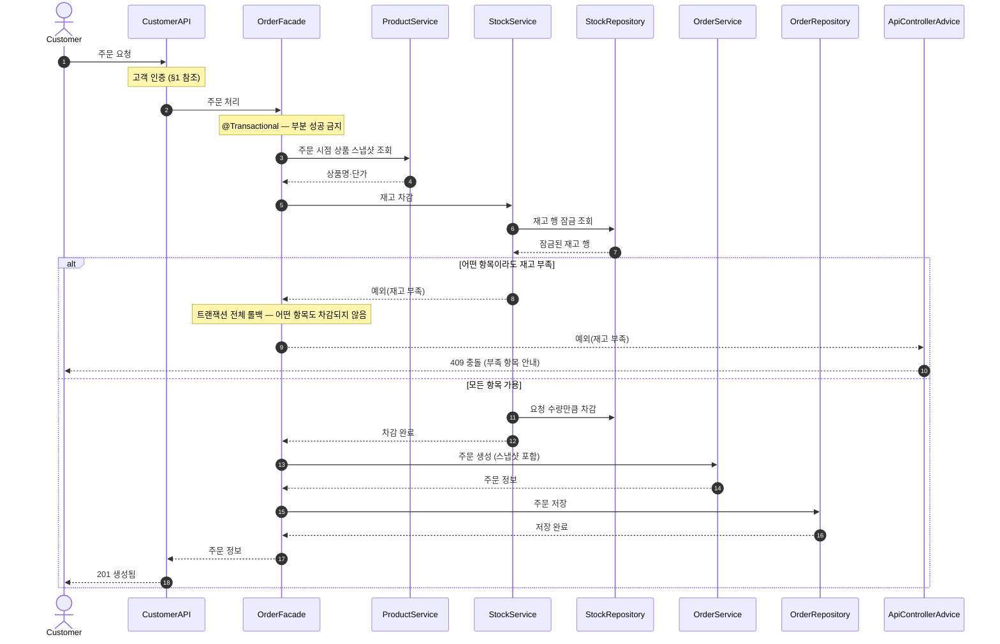
```mermaid
sequenceDiagram
    autonumber
    actor Customer
    participant CustomerAPI
    participant OrderFacade
    participant ProductService
    participant StockService
    participant StockRepository
    participant OrderService
    participant OrderRepository
    participant Advice as ApiControllerAdvice

    Customer->>CustomerAPI: 주문 요청
    Note over CustomerAPI: 고객 인증 (§1 참조)
    CustomerAPI->>OrderFacade: 주문 처리
    Note over OrderFacade: @Transactional — 부분 성공 금지
    OrderFacade->>ProductService: 주문 시점 상품 스냅샷 조회
    ProductService-->>OrderFacade: 상품명·단가
    OrderFacade->>StockService: 재고 차감
    StockService->>StockRepository: 재고 행 잠금 조회
    StockRepository-->>StockService: 잠금된 재고 행
    alt 어떤 항목이라도 재고 부족
        StockService-->>OrderFacade: 예외(재고 부족)
        Note over OrderFacade: 트랜잭션 전체 롤백 — 어떤 항목도 차감되지 않음
        OrderFacade-->>Advice: 예외(재고 부족)
        Advice-->>Customer: 409 충돌 (부족 항목 안내)
    else 모든 항목 가용
        StockService->>StockRepository: 요청 수량만큼 차감
        StockService-->>OrderFacade: 차감 완료
        OrderFacade->>OrderService: 주문 생성 (스냅샷 포함)
        OrderService-->>OrderFacade: 주문 정보
        OrderFacade->>OrderRepository: 주문 저장
        OrderRepository-->>OrderFacade: 저장 완료
        OrderFacade-->>CustomerAPI: 주문 정보
        CustomerAPI-->>Customer: 201 생성됨
    end
```

관련 API:

- `POST /api/v1/orders`

핵심 포인트:

- `StockRepository.findStocksForUpdate`로 주문 대상 재고 행을 잠금 조회한다.
- 재고 부족 시 `OrderRepository.save`에 도달하지 않고 전체 트랜잭션이 rollback된다.
- 재고 변경 근거는 주문 항목으로 추적한다. 입고/수동 보정이 생기면 `stock_movements`가 필요하다.

## 7. User-E3 결제 승인 실패

외부 결제 시스템의 명시적인 실패와 결과를 확인할 수 없는 장애는 다르게 처리한다.
명시적 실패는 결제·주문 실패와 재고·쿠폰 보상을 하나의 결과 트랜잭션으로 확정하고, 상태 불명 장애는 결제를 `UNKNOWN`으로 남긴 뒤 내부 회복 outbox를 기준으로 다시 확인한다.

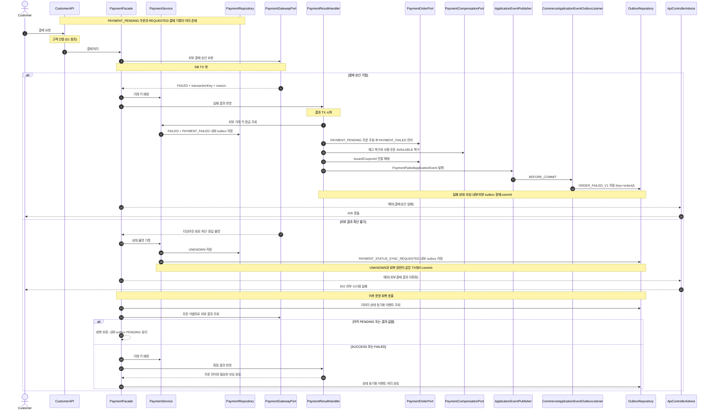
```mermaid
sequenceDiagram
    autonumber
    actor Customer
    participant CustomerAPI
    participant PaymentFacade
    participant PaymentService
    participant PaymentRepository
    participant PaymentGateway as PaymentGatewayPort
    participant ResultHandler as PaymentResultHandler
    participant PaymentOrder as PaymentOrderPort
    participant Compensation as PaymentCompensationPort
    participant Events as ApplicationEventPublisher
    participant Listener as CommerceApplicationEventOutboxListener
    participant OutboxRepository
    participant Advice as ApiControllerAdvice

    Note over CustomerAPI,PaymentRepository: PAYMENT_PENDING 주문과 REQUESTED 결제 기록이 이미 존재
    Customer->>CustomerAPI: 결제 요청
    Note over CustomerAPI: 고객 인증 (§1 참조)
    CustomerAPI->>PaymentFacade: 결제 처리
    PaymentFacade->>PaymentGateway: 외부 결제 승인 요청
    Note over PaymentFacade,PaymentGateway: DB TX 밖
    alt 결제 승인 거절
        PaymentGateway-->>PaymentFacade: FAILED + transactionKey + reason
        PaymentFacade->>PaymentService: 거래 키 배정
        PaymentFacade->>ResultHandler: 실패 결과 반영
        Note over ResultHandler: 결과 TX 시작
        ResultHandler->>PaymentService: 외부 거래 키 잠금 조회
        PaymentService->>PaymentRepository: FAILED + PAYMENT_FAILED 내부 outbox 저장
        ResultHandler->>PaymentOrder: PAYMENT_PENDING 주문 조회 후 PAYMENT_FAILED 전이
        ResultHandler->>Compensation: 재고 복구와 사용 쿠폰 AVAILABLE 복구
        ResultHandler->>PaymentOrder: issuedCouponId 연결 해제
        ResultHandler->>Events: PaymentFailedApplicationEvent 발행
        Events->>Listener: BEFORE_COMMIT
        Listener->>OutboxRepository: ORDER_FAILED_V1 저장 (key=orderId)
        Note over ResultHandler,OutboxRepository: 실패 상태·보상·내부/외부 outbox 함께 commit
        PaymentFacade-->>Advice: 예외(결제 승인 실패)
        Advice-->>Customer: 409 충돌
    else 외부 결과 확인 불가
        PaymentGateway-->>PaymentFacade: 타임아웃·회로 차단·응답 불명
        PaymentFacade->>PaymentService: 상태 불명 기록
        PaymentService->>PaymentRepository: UNKNOWN 저장
        PaymentService->>OutboxRepository: PAYMENT_STATUS_SYNC_REQUESTED 내부 outbox 저장
        Note over PaymentService,OutboxRepository: UNKNOWN과 회복 원천이 같은 TX에서 commit
        PaymentFacade-->>Advice: 예외(외부 결제 결과 미확정)
        Advice-->>Customer: 502 외부 시스템 실패

        Note over PaymentFacade,OutboxRepository: 이후 운영 회복 호출
        PaymentFacade->>OutboxRepository: 미처리 상태 동기화 이벤트 조회
        PaymentFacade->>PaymentGateway: 주문 식별자로 외부 결과 조회
        alt 아직 PENDING 또는 결과 없음
            PaymentFacade-->>PaymentFacade: 회복 보류, 내부 outbox PENDING 유지
        else SUCCESS 또는 FAILED
            PaymentFacade->>PaymentService: 거래 키 배정
            PaymentFacade->>ResultHandler: 확정 결과 반영
            ResultHandler-->>PaymentFacade: 주문 전이와 필요한 보상 완료
            PaymentFacade->>OutboxRepository: 상태 동기화 이벤트 처리 완료
        end
    end
```

관련 API:

- `POST /api/v1/payments`
- `POST /api/v1/payments/callback`
- `POST /api/v1/payments/recovery`

핵심 포인트:

- 결제 실패는 `payment_records.status = 30(FAILED)`와 `orders.order_status = PAYMENT_FAILED`로 기록해 주문 시도와 외부 승인 결과를 추적한다.
- 재고·쿠폰 복구는 주문 생성 트랜잭션의 롤백이 아니라 별도 결과 트랜잭션의 보상이다. 결제 실패 저장, 주문 실패 전이, 보상, 내부 `PAYMENT_FAILED`, 외부 `ORDER_FAILED_V1` outbox 중 하나라도 실패하면 결과 트랜잭션 전체가 롤백된다.
- `PaymentResultHandler`는 `PAYMENT_PENDING` 주문만 결과에 맞게 전이한다. 같은 완료 상태의 중복 콜백은 `changed=false`로 보상과 이벤트를 반복하지 않는다.
- 쿠폰 적용 주문의 결제 실패 보상은 발급 쿠폰을 `AVAILABLE`로 되돌리고 실패 주문의 `issuedCouponId`를 `NULL`로 분리한다.
- 주문 생성 API는 이미 `PAYMENT_PENDING` 주문을 `201`로 반환한다. 별도 결제 요청에서 명시적 거절은 `409`, 결과 미확정은 `UNKNOWN`과 회복 기록을 남기고 `502`다.
- `UNKNOWN`은 실패와 다르므로 즉시 재고·쿠폰을 복구하지 않는다. 회복은 거래 키가 없을 수 있어 주문 식별자로 외부 결제 시스템을 조회한다.
- 인증된 콜백의 `SUCCESS`/`FAILED`도 같은 `PaymentResultHandler`를 사용한다. `PENDING` 콜백은 현재 결제 정보를 반환하고 상태를 완료로 바꾸지 않는다.

## 8. Admin-J1 신규 브랜드와 상품 등록

관리자가 브랜드를 등록하고, 등록된 브랜드에 상품과 초기 재고를 연결해 노출시키는 흐름이다.
변경 작업은 `admin_operation_logs`에 기록한다.

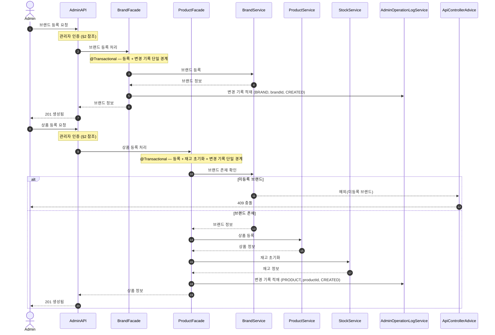
```mermaid
sequenceDiagram
    autonumber
    actor Admin
    participant AdminAPI
    participant BrandFacade
    participant ProductFacade
    participant BrandService
    participant ProductService
    participant StockService
    participant LogService as AdminOperationLogService
    participant Advice as ApiControllerAdvice

    Admin->>AdminAPI: 브랜드 등록 요청
    Note over AdminAPI: 관리자 인증 (§2 참조)
    AdminAPI->>BrandFacade: 브랜드 등록 처리
    Note over BrandFacade: @Transactional — 등록 + 변경 기록 단일 경계
    BrandFacade->>BrandService: 브랜드 등록
    BrandService-->>BrandFacade: 브랜드 정보
    BrandFacade->>LogService: 변경 기록 적재 (BRAND, brandId, CREATED)
    BrandFacade-->>AdminAPI: 브랜드 정보
    AdminAPI-->>Admin: 201 생성됨

    Admin->>AdminAPI: 상품 등록 요청
    Note over AdminAPI: 관리자 인증 (§2 참조)
    AdminAPI->>ProductFacade: 상품 등록 처리
    Note over ProductFacade: @Transactional — 등록 + 재고 초기화 + 변경 기록 단일 경계
    ProductFacade->>BrandService: 브랜드 존재 확인
    alt 미등록 브랜드
        BrandService-->>Advice: 예외(미등록 브랜드)
        Advice-->>Admin: 409 충돌
    else 브랜드 존재
        BrandService-->>ProductFacade: 브랜드 정보
        ProductFacade->>ProductService: 상품 등록
        ProductService-->>ProductFacade: 상품 정보
        ProductFacade->>StockService: 재고 초기화
        StockService-->>ProductFacade: 재고 정보
        ProductFacade->>LogService: 변경 기록 적재 (PRODUCT, productId, CREATED)
        ProductFacade-->>AdminAPI: 상품 정보
        AdminAPI-->>Admin: 201 생성됨
    end
```

관련 API:

- `POST /api-admin/v1/brands`
- `POST /api-admin/v1/products`

핵심 포인트:

- 상품 등록은 이미 등록된 브랜드에만 허용한다. 시스템 상태와의 충돌이므로 `400 잘못된 요청`이 아니라 `409 충돌`로 응답한다.
- 초기 재고는 상품 생명주기에 종속되며, 별도 삭제 시각을 갖지 않는다.
- 관리자 작업 로그는 변경 대상 검증과 저장이 성공한 뒤 기록한다. 조회 API와 실패한 변경 요청은 성공 이력으로 기록하지 않는다.

## 9. Admin-J2 브랜드 삭제와 상품 soft delete

브랜드 삭제 시 소속 상품도 함께 삭제 상태로 전환한다.
재고는 상품에 종속되므로 별도 삭제 호출을 두지 않는다.

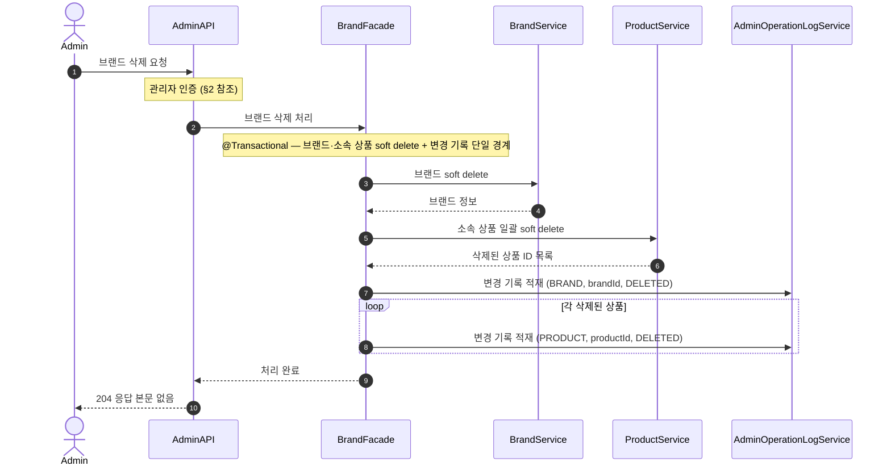
```mermaid
sequenceDiagram
    autonumber
    actor Admin
    participant AdminAPI
    participant BrandFacade
    participant BrandService
    participant ProductService
    participant LogService as AdminOperationLogService

    Admin->>AdminAPI: 브랜드 삭제 요청
    Note over AdminAPI: 관리자 인증 (§2 참조)
    AdminAPI->>BrandFacade: 브랜드 삭제 처리
    Note over BrandFacade: @Transactional — 브랜드·소속 상품 soft delete + 변경 기록 단일 경계
    BrandFacade->>BrandService: 브랜드 soft delete
    BrandService-->>BrandFacade: 브랜드 정보
    BrandFacade->>ProductService: 소속 상품 일괄 soft delete
    ProductService-->>BrandFacade: 삭제된 상품 ID 목록
    BrandFacade->>LogService: 변경 기록 적재 (BRAND, brandId, DELETED)
    loop 각 삭제된 상품
        BrandFacade->>LogService: 변경 기록 적재 (PRODUCT, productId, DELETED)
    end
    BrandFacade-->>AdminAPI: 처리 완료
    AdminAPI-->>Admin: 204 응답 본문 없음
```

관련 API:

- `DELETE /api-admin/v1/brands/{brandId}`

핵심 포인트:

- DB cascade 대신 애플리케이션 유스케이스에서 브랜드와 상품을 함께 soft delete한다.
- 과거 주문 내역은 `OrderItem` 스냅샷으로 보존되므로 상품 soft delete 이후에도 훼손되지 않는다.
- 관리자 로그의 `target_id`는 브랜드/상품 다형 대상이므로 DB FK를 강제하지 않는다.
- 관리자 작업 로그는 브랜드·소속 상품 soft delete 성공 후 같은 유스케이스 경계 안에서 기록한다.

## 10. 상품/브랜드 공개 조회

익명 방문자와 일반 사용자는 인증 없이 브랜드 단건, 상품 목록, 상품 상세를 조회할 수 있다.
조회 흐름은 쓰기 트랜잭션이 아니라 필터와 정렬, 삭제 상태 제외 조건을 확인하는 데 집중한다.

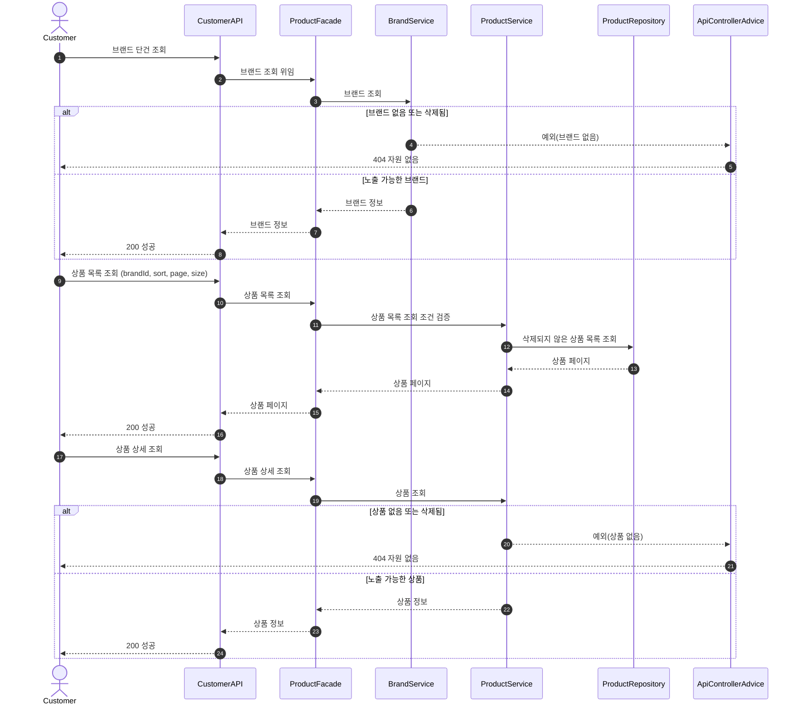
```mermaid
sequenceDiagram
    autonumber
    actor Customer
    participant CustomerAPI
    participant ProductFacade
    participant BrandService
    participant ProductService
    participant ProductRepository
    participant Advice as ApiControllerAdvice

    Customer->>CustomerAPI: 브랜드 단건 조회
    CustomerAPI->>ProductFacade: 브랜드 조회 위임
    ProductFacade->>BrandService: 브랜드 조회
    alt 브랜드 없음 또는 삭제됨
        BrandService-->>Advice: 예외(브랜드 없음)
        Advice-->>Customer: 404 자원 없음
    else 노출 가능한 브랜드
        BrandService-->>ProductFacade: 브랜드 정보
        ProductFacade-->>CustomerAPI: 브랜드 정보
        CustomerAPI-->>Customer: 200 성공
    end

    Customer->>CustomerAPI: 상품 목록 조회 (brandId, sort, page, size)
    CustomerAPI->>ProductFacade: 상품 목록 조회
    ProductFacade->>ProductService: 상품 목록 조회 조건 검증
    ProductService->>ProductRepository: 삭제되지 않은 상품 목록 조회
    ProductRepository-->>ProductService: 상품 페이지
    ProductService-->>ProductFacade: 상품 페이지
    ProductFacade-->>CustomerAPI: 상품 페이지
    CustomerAPI-->>Customer: 200 성공

    Customer->>CustomerAPI: 상품 상세 조회
    CustomerAPI->>ProductFacade: 상품 상세 조회
    ProductFacade->>ProductService: 상품 조회
    alt 상품 없음 또는 삭제됨
        ProductService-->>Advice: 예외(상품 없음)
        Advice-->>Customer: 404 자원 없음
    else 노출 가능한 상품
        ProductService-->>ProductFacade: 상품 정보
        ProductFacade-->>CustomerAPI: 상품 정보
        CustomerAPI-->>Customer: 200 성공
    end
```

관련 API:

- `GET /api/v1/brands/{brandId}`
- `GET /api/v1/products`
- `GET /api/v1/products/{productId}`

핵심 포인트:

- 공개 조회는 인증이 필요 없지만, soft delete 된 브랜드/상품은 노출하지 않는다.
- 최신순(`latest`) 정렬은 필수이고, 가격 낮은 순·좋아요 많은 순은 선택 확장이다.

## 11. Admin-J3/J4 카탈로그 변경과 주문 모니터링

관리자는 브랜드/상품을 수정하거나 상품을 단건 삭제할 수 있고, 주문 운영 현황을 조회할 수 있다.
카탈로그 변경 작업은 관리자 변경 로그 대상이며, 주문 조회는 읽기 작업이므로 로그 대상이 아니다.

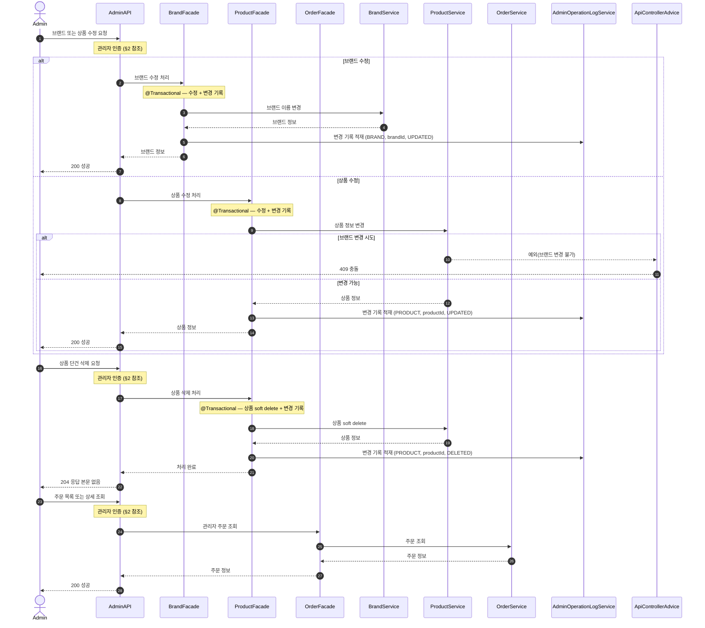
```mermaid
sequenceDiagram
    autonumber
    actor Admin
    participant AdminAPI
    participant BrandFacade
    participant ProductFacade
    participant OrderFacade
    participant BrandService
    participant ProductService
    participant OrderService
    participant LogService as AdminOperationLogService
    participant Advice as ApiControllerAdvice

    Admin->>AdminAPI: 브랜드 또는 상품 수정 요청
    Note over AdminAPI: 관리자 인증 (§2 참조)
    alt 브랜드 수정
        AdminAPI->>BrandFacade: 브랜드 수정 처리
        Note over BrandFacade: @Transactional — 수정 + 변경 기록
        BrandFacade->>BrandService: 브랜드 이름 변경
        BrandService-->>BrandFacade: 브랜드 정보
        BrandFacade->>LogService: 변경 기록 적재 (BRAND, brandId, UPDATED)
        BrandFacade-->>AdminAPI: 브랜드 정보
        AdminAPI-->>Admin: 200 성공
    else 상품 수정
        AdminAPI->>ProductFacade: 상품 수정 처리
        Note over ProductFacade: @Transactional — 수정 + 변경 기록
        ProductFacade->>ProductService: 상품 정보 변경
        alt 브랜드 변경 시도
            ProductService-->>Advice: 예외(브랜드 변경 불가)
            Advice-->>Admin: 409 충돌
        else 변경 가능
            ProductService-->>ProductFacade: 상품 정보
            ProductFacade->>LogService: 변경 기록 적재 (PRODUCT, productId, UPDATED)
            ProductFacade-->>AdminAPI: 상품 정보
            AdminAPI-->>Admin: 200 성공
        end
    end

    Admin->>AdminAPI: 상품 단건 삭제 요청
    Note over AdminAPI: 관리자 인증 (§2 참조)
    AdminAPI->>ProductFacade: 상품 삭제 처리
    Note over ProductFacade: @Transactional — 상품 soft delete + 변경 기록
    ProductFacade->>ProductService: 상품 soft delete
    ProductService-->>ProductFacade: 상품 정보
    ProductFacade->>LogService: 변경 기록 적재 (PRODUCT, productId, DELETED)
    ProductFacade-->>AdminAPI: 처리 완료
    AdminAPI-->>Admin: 204 응답 본문 없음

    Admin->>AdminAPI: 주문 목록 또는 상세 조회
    Note over AdminAPI: 관리자 인증 (§2 참조)
    AdminAPI->>OrderFacade: 관리자 주문 조회
    OrderFacade->>OrderService: 주문 조회
    OrderService-->>OrderFacade: 주문 정보
    OrderFacade-->>AdminAPI: 주문 정보
    AdminAPI-->>Admin: 200 성공
```

관련 API:

- `PUT /api-admin/v1/brands/{brandId}`
- `PUT /api-admin/v1/products/{productId}`
- `DELETE /api-admin/v1/products/{productId}`
- `GET /api-admin/v1/orders`
- `GET /api-admin/v1/orders/{orderId}`

핵심 포인트:

- 상품 브랜드 변경은 등록 후 불변 정책이므로 `409 충돌`로 거부한다.
- 상품 단건 삭제는 브랜드 삭제와 달리 해당 상품만 soft delete 한다.
- 관리자 작업 로그는 변경 저장 성공 후 기록한다. 브랜드 변경 시도처럼 실패한 요청은 성공 이력으로 기록하지 않는다.
- 관리자 주문 조회는 읽기 작업이므로 `admin_operation_logs` 기록 대상이 아니다.

## 12. User-J5 쿠폰 발급 요청, 처리 상태 조회, 내 쿠폰 조회

쿠폰 발급 API는 실제 발급을 완료하지 않고 요청을 durable하게 접수한다.
실제 발급은 `coupon-issue-requests`를 소비하는 worker가 별도 트랜잭션에서 수행하며, 사용자는 polling API로 결과를 확인한다.

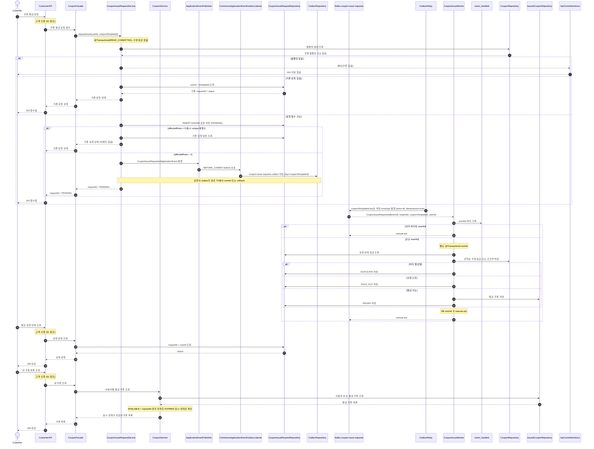
```mermaid
sequenceDiagram
    autonumber
    actor Customer
    participant CustomerAPI
    participant CouponFacade
    participant RequestService as CouponIssueRequestService
    participant CouponService
    participant Events as ApplicationEventPublisher
    participant Listener as CommerceApplicationEventOutboxListener
    participant RequestRepository as CouponIssueRequestRepository
    participant OutboxRepository
    participant Kafka as Kafka coupon-issue-requests
    participant Relay as OutboxRelay
    participant Worker as CouponIssueWorker
    participant EventHandled as event_handled
    participant CouponRepository
    participant IssuedCouponRepository
    participant Advice as ApiControllerAdvice

    Customer->>CustomerAPI: 쿠폰 발급 요청
    Note over CustomerAPI: 고객 인증 (§1 참조)
    CustomerAPI->>CouponFacade: 쿠폰 발급 요청 접수
    CouponFacade->>RequestService: requestIssue(userId, couponTemplateId)
    Note over RequestService: @Transactional(READ_COMMITTED), 수량 잠금 없음
    RequestService->>CouponRepository: 템플릿 일반 조회
    CouponRepository-->>RequestService: 쿠폰 템플릿 또는 없음
    alt 템플릿 없음
        RequestService-->>Advice: 예외(쿠폰 없음)
        Advice-->>Customer: 404 자원 없음
    else 기존 요청 있음
        RequestService->>RequestRepository: userId + templateId 조회
        RequestRepository-->>RequestService: 기존 requestId + status
        RequestService-->>CouponFacade: 기존 요청 상태
        CouponFacade-->>CustomerAPI: 기존 요청 상태
        CustomerAPI-->>Customer: 202 접수됨
    else 요청 접수 가능
        RequestService->>RequestRepository: INSERT IGNORE 요청 저장 (PENDING)
        alt affectedRows = 0 (동시 unique 충돌)
            RequestService->>RequestRepository: 기존 요청 일반 조회
            RequestService-->>CouponFacade: 기존 요청 상태 (이벤트 없음)
            CouponFacade-->>CustomerAPI: 기존 요청 상태
        else affectedRows = 1
            RequestService->>Events: CouponIssueRequestedApplicationEvent 발행
            Events->>Listener: BEFORE_COMMIT listener 호출
            Listener->>OutboxRepository: coupon-issue-requests outbox 저장 (key=couponTemplateId)
            Note over RequestService,OutboxRepository: 요청과 outbox가 같은 TX에서 commit 또는 rollback
            RequestService-->>CouponFacade: requestId + PENDING
            CouponFacade-->>CustomerAPI: requestId + PENDING
        end
        CustomerAPI-->>Customer: 202 접수됨
    end

    Relay->>Kafka: couponTemplateId key로 저장 envelope 발행 (acks=all, idempotence=true)
    Kafka-->>Worker: CouponIssueRequested(eventId, requestId, couponTemplateId, userId)
    Worker->>EventHandled: eventId 처리 기록
    alt 이미 처리된 eventId
        Worker-->>Kafka: manual ack
    else 신규 eventId
        Note over Worker: 별도 @Transactional worker
        Worker->>RequestRepository: 요청 상태 잠금 조회
        Worker->>CouponRepository: 선착순 수량 잠금 또는 조건부 차감
        alt 이미 발급됨
            Worker->>RequestRepository: DUPLICATE 저장
        else 수량 소진
            Worker->>RequestRepository: SOLD_OUT 저장
        else 발급 가능
            Worker->>IssuedCouponRepository: 발급 쿠폰 저장
            Worker->>RequestRepository: ISSUED 저장
        end
        Note over Worker: DB commit 후 manual ack
        Worker-->>Kafka: manual ack
    end

    Customer->>CustomerAPI: 발급 요청 상태 조회
    Note over CustomerAPI: 고객 인증 (§1 참조)
    CustomerAPI->>CouponFacade: 요청 상태 조회
    CouponFacade->>RequestRepository: requestId + userId 조회
    RequestRepository-->>CouponFacade: status
    CouponFacade-->>CustomerAPI: 요청 상태
    CustomerAPI-->>Customer: 200 성공

    Customer->>CustomerAPI: 내 쿠폰 목록 조회
    Note over CustomerAPI: 고객 인증 (§1 참조)
    CustomerAPI->>CouponFacade: 내 쿠폰 조회
    CouponFacade->>CouponService: 사용자별 발급 쿠폰 조회
    CouponService->>IssuedCouponRepository: 사용자 ID 로 발급 쿠폰 조회
    IssuedCouponRepository-->>CouponService: 발급 쿠폰 목록
    Note over CouponService: AVAILABLE + expiredAt 경과 항목은 EXPIRED 표시 상태로 계산
    CouponService-->>CouponFacade: 표시 상태가 포함된 쿠폰 목록
    CouponFacade-->>CustomerAPI: 쿠폰 목록
    CustomerAPI-->>Customer: 200 성공
```

관련 API:

- `POST /api/v1/coupons/{couponId}/issue`
- `GET /api/v1/coupons/issue-requests/{requestId}`
- `GET /api/v1/users/me/coupons`

핵심 포인트:

- `CouponTemplate`은 관리자 정의이고, `IssuedCoupon`은 사용자 보유 상태다.
- `issued_coupons(user_id, coupon_template_id)` unique 제약으로 중복 발급을 최종 차단한다.
- 요청 접수와 실제 발급은 다른 트랜잭션이다. 접수 응답의 `202`는 실제 발급 성공을 뜻하지 않는다.
- 선착순 수량과 중복 발급은 worker 트랜잭션에서 처리한다. `event_handled`와 DB unique 제약이 Kafka 재전달과 중복 요청을 멱등하게 만든다.
- worker의 재시도 가능한 예외는 재시도 동안 요청을 `PENDING`으로 유지한다. 재시도를 모두 소진하면 설정된 쿠폰 실패 주제로 먼저 발행하고, 발행 성공 뒤 별도 복구 트랜잭션에서 아직 `PENDING`인 요청만 `FAILED`로 바꾼다. DLT 발행은 전용 `ByteArraySerializer`로 원본 payload bytes를 보존한다. 실패 주제 발행이 실패하거나 요청이 이미 최종 상태면 상태를 덮어쓰지 않는다.
- 쿠폰 요청 outbox, consumer 구독, 요청·실패 주제 생성, 실패 복구 목적지는 `commerce-events.coupon-issue-request` 설정을 함께 사용한다.
- `EXPIRED`는 저장 상태가 아니라 조회 응답을 만들 때 계산한 표시 상태다.
- 발급 가능한 쿠폰 목록 조회(`GET /api/v1/coupons`)는 원문 필수 API가 아니므로 선택 확장 후보로 분리한다.

## 13. User-J5 쿠폰 적용 주문

쿠폰을 적용한 주문은 주문 생성, 재고 차감, 발급 쿠폰 사용 처리를 하나의 트랜잭션으로 묶는다.
동일 발급 쿠폰으로 동시에 주문하더라도 한 주문만 성공해야 한다.

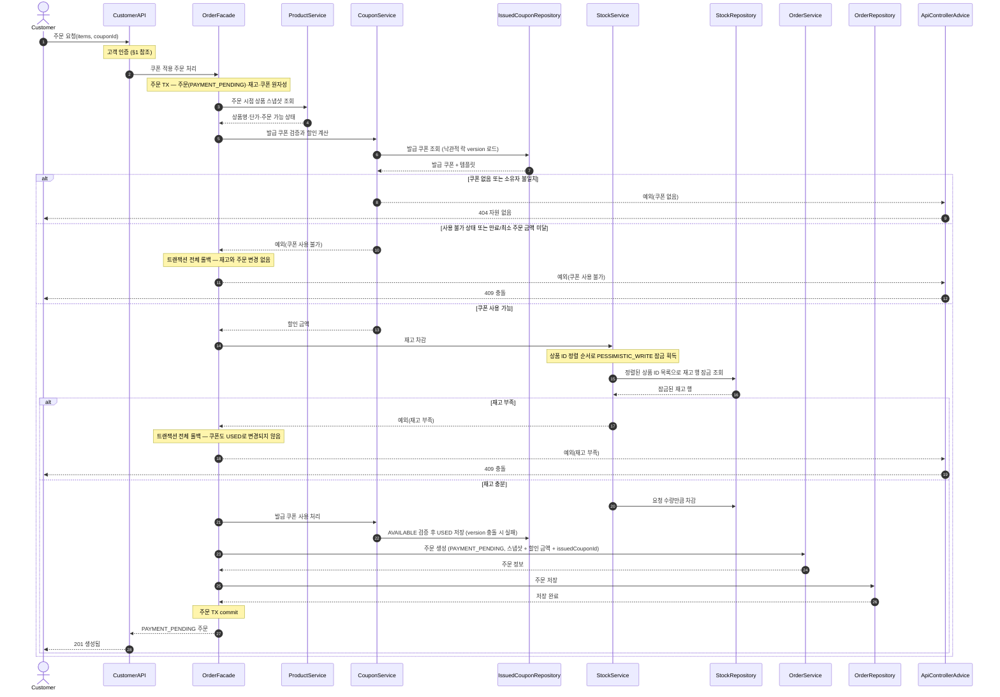
```mermaid
sequenceDiagram
    autonumber
    actor Customer
    participant CustomerAPI
    participant OrderFacade
    participant ProductService
    participant CouponService
    participant IssuedCouponRepository
    participant StockService
    participant StockRepository
    participant OrderService
    participant OrderRepository
    participant Advice as ApiControllerAdvice

    Customer->>CustomerAPI: 주문 요청(items, couponId)
    Note over CustomerAPI: 고객 인증 (§1 참조)
    CustomerAPI->>OrderFacade: 쿠폰 적용 주문 처리
    Note over OrderFacade: 주문 TX — 주문(PAYMENT_PENDING)·재고·쿠폰 원자성
    OrderFacade->>ProductService: 주문 시점 상품 스냅샷 조회
    ProductService-->>OrderFacade: 상품명·단가·주문 가능 상태
    OrderFacade->>CouponService: 발급 쿠폰 검증과 할인 계산
    CouponService->>IssuedCouponRepository: 발급 쿠폰 조회 (낙관적 락 version 로드)
    IssuedCouponRepository-->>CouponService: 발급 쿠폰 + 템플릿
    alt 쿠폰 없음 또는 소유자 불일치
        CouponService-->>Advice: 예외(쿠폰 없음)
        Advice-->>Customer: 404 자원 없음
    else 사용 불가 상태 또는 만료/최소 주문 금액 미달
        CouponService-->>OrderFacade: 예외(쿠폰 사용 불가)
        Note over OrderFacade: 트랜잭션 전체 롤백 — 재고와 주문 변경 없음
        OrderFacade-->>Advice: 예외(쿠폰 사용 불가)
        Advice-->>Customer: 409 충돌
    else 쿠폰 사용 가능
        CouponService-->>OrderFacade: 할인 금액
        OrderFacade->>StockService: 재고 차감
        Note over StockService: 상품 ID 정렬 순서로 PESSIMISTIC_WRITE 잠금 획득
        StockService->>StockRepository: 정렬된 상품 ID 목록으로 재고 행 잠금 조회
        StockRepository-->>StockService: 잠금된 재고 행
        alt 재고 부족
            StockService-->>OrderFacade: 예외(재고 부족)
            Note over OrderFacade: 트랜잭션 전체 롤백 — 쿠폰도 USED로 변경되지 않음
            OrderFacade-->>Advice: 예외(재고 부족)
            Advice-->>Customer: 409 충돌
        else 재고 충분
            StockService->>StockRepository: 요청 수량만큼 차감
            OrderFacade->>CouponService: 발급 쿠폰 사용 처리
            CouponService->>IssuedCouponRepository: AVAILABLE 검증 후 USED 저장 (version 충돌 시 실패)
            OrderFacade->>OrderService: 주문 생성 (PAYMENT_PENDING, 스냅샷 + 할인 금액 + issuedCouponId)
            OrderService-->>OrderFacade: 주문 정보
            OrderFacade->>OrderRepository: 주문 저장
            OrderRepository-->>OrderFacade: 저장 완료
            Note over OrderFacade: 주문 TX commit
            OrderFacade-->>CustomerAPI: PAYMENT_PENDING 주문
            CustomerAPI-->>Customer: 201 생성됨
        end
    end
```

관련 API:

- `POST /api/v1/orders`

핵심 포인트:

- 주문 요청의 쿠폰 필드는 외부 계약상 `couponId`이며, 내부에서는 발급 쿠폰 식별자 `issuedCouponId`로 매핑한다.
- 발급 쿠폰은 비관적 락으로 잠그지 않고, 사용 가능(`AVAILABLE`) 상태를 검증한 뒤 `USED`로 전환하며 `version` 낙관적 락으로 동시 사용을 감지한다. 동일 쿠폰 동시 주문 중 하나만 성공하고 나머지는 version 충돌로 실패한다.
- 여러 재고 행 잠금은 상품 ID 정렬 순서로 획득해 교착 가능성을 줄인다.
- 쿠폰 검증, 재고 차감, 쿠폰 사용, 주문 저장 중 하나라도 실패하면 주문 트랜잭션 전체를 rollback한다.
- 주문 생성 뒤 사용자가 별도 `POST /api/v1/payments`를 호출한다. 결제 요청·승인 흐름은 §3, 명시적 실패와 상태 불명 회복은 §7에서 다룬다.

## 14. Admin-J5 쿠폰 템플릿 운영

관리자는 쿠폰 템플릿을 생성, 수정, soft delete하고 발급 이력을 조회한다.
삭제된 템플릿은 신규 발급 대상에서 제외되지만 이미 발급된 쿠폰과 주문 스냅샷은 유지된다.

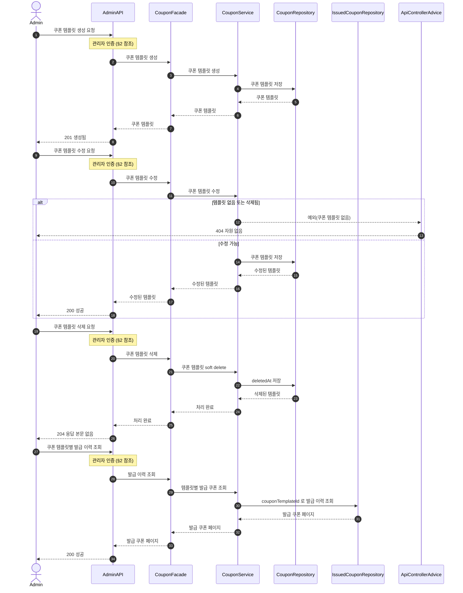
```mermaid
sequenceDiagram
    autonumber
    actor Admin
    participant AdminAPI
    participant CouponFacade
    participant CouponService
    participant CouponRepository
    participant IssuedCouponRepository
    participant Advice as ApiControllerAdvice

    Admin->>AdminAPI: 쿠폰 템플릿 생성 요청
    Note over AdminAPI: 관리자 인증 (§2 참조)
    AdminAPI->>CouponFacade: 쿠폰 템플릿 생성
    CouponFacade->>CouponService: 쿠폰 템플릿 생성
    CouponService->>CouponRepository: 쿠폰 템플릿 저장
    CouponRepository-->>CouponService: 쿠폰 템플릿
    CouponService-->>CouponFacade: 쿠폰 템플릿
    CouponFacade-->>AdminAPI: 쿠폰 템플릿
    AdminAPI-->>Admin: 201 생성됨

    Admin->>AdminAPI: 쿠폰 템플릿 수정 요청
    Note over AdminAPI: 관리자 인증 (§2 참조)
    AdminAPI->>CouponFacade: 쿠폰 템플릿 수정
    CouponFacade->>CouponService: 쿠폰 템플릿 수정
    alt 템플릿 없음 또는 삭제됨
        CouponService-->>Advice: 예외(쿠폰 템플릿 없음)
        Advice-->>Admin: 404 자원 없음
    else 수정 가능
        CouponService->>CouponRepository: 쿠폰 템플릿 저장
        CouponRepository-->>CouponService: 수정된 템플릿
        CouponService-->>CouponFacade: 수정된 템플릿
        CouponFacade-->>AdminAPI: 수정된 템플릿
        AdminAPI-->>Admin: 200 성공
    end

    Admin->>AdminAPI: 쿠폰 템플릿 삭제 요청
    Note over AdminAPI: 관리자 인증 (§2 참조)
    AdminAPI->>CouponFacade: 쿠폰 템플릿 삭제
    CouponFacade->>CouponService: 쿠폰 템플릿 soft delete
    CouponService->>CouponRepository: deletedAt 저장
    CouponRepository-->>CouponService: 삭제된 템플릿
    CouponService-->>CouponFacade: 처리 완료
    CouponFacade-->>AdminAPI: 처리 완료
    AdminAPI-->>Admin: 204 응답 본문 없음

    Admin->>AdminAPI: 쿠폰 템플릿별 발급 이력 조회
    Note over AdminAPI: 관리자 인증 (§2 참조)
    AdminAPI->>CouponFacade: 발급 이력 조회
    CouponFacade->>CouponService: 템플릿별 발급 쿠폰 조회
    CouponService->>IssuedCouponRepository: couponTemplateId 로 발급 이력 조회
    IssuedCouponRepository-->>CouponService: 발급 쿠폰 페이지
    CouponService-->>CouponFacade: 발급 쿠폰 페이지
    CouponFacade-->>AdminAPI: 발급 쿠폰 페이지
    AdminAPI-->>Admin: 200 성공
```

관련 API:

- `POST /api-admin/v1/coupons`
- `PUT /api-admin/v1/coupons/{couponId}`
- `DELETE /api-admin/v1/coupons/{couponId}`
- `GET /api-admin/v1/coupons`
- `GET /api-admin/v1/coupons/{couponId}`
- `GET /api-admin/v1/coupons/{couponId}/issues`

핵심 포인트:

- 쿠폰 템플릿 삭제는 soft delete다.
- 발급 쿠폰과 주문 할인 스냅샷은 템플릿 수정·삭제와 독립적으로 유지한다.
- 관리자 쿠폰 변경 작업 로그가 필요해지면 `AdminOperationLog`의 대상 유형에 `COUPON_TEMPLATE`을 추가한다.

## 15. Round 8 대기열과 주문 관문

Round 8 대기열은 `/queue/enter`, `/queue/position`, scheduler admission, `LIMITED` 선착순 상품의 `X-Queue-Token` 주문 관문으로 구성된다. Redis Sorted Set, sequence counter, TTL admission hash가 유일한 권위 상태이고, application은 `WaitingQueuePort` 뒤의 단일 `RedissonWaitingQueueAdapter`에만 의존한다.

### 15.1 대기열 진입 (`POST /queue/enter`)

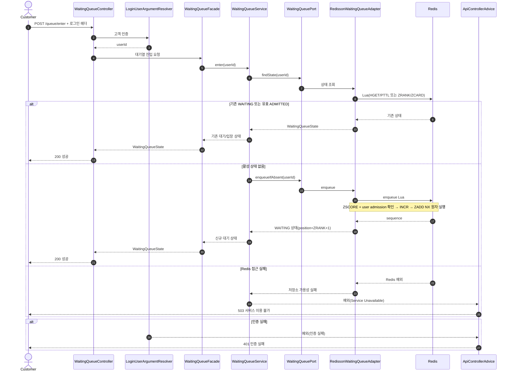
```mermaid
sequenceDiagram
    autonumber
    actor Customer
    participant QueueAPI as WaitingQueueController
    participant Resolver as LoginUserArgumentResolver
    participant QueueFacade as WaitingQueueFacade
    participant QueueService as WaitingQueueService
    participant QueuePort as WaitingQueuePort
    participant Redisson as RedissonWaitingQueueAdapter
    participant Redis
    participant Advice as ApiControllerAdvice

    Customer->>QueueAPI: POST /queue/enter + 로그인 헤더
    QueueAPI->>Resolver: 고객 인증
    Resolver-->>QueueAPI: userId
    QueueAPI->>QueueFacade: 대기열 진입 요청
    QueueFacade->>QueueService: enter(userId)
    QueueService->>QueuePort: findState(userId)
    QueuePort->>Redisson: 상태 조회
    Redisson->>Redis: Lua(HGET/PTTL 또는 ZRANK/ZCARD)
    alt 기존 WAITING 또는 유효 ADMITTED
        Redis-->>Redisson: 기존 상태
        Redisson-->>QueueService: WaitingQueueState
        QueueService-->>QueueFacade: 기존 대기/입장 상태
        QueueFacade-->>QueueAPI: WaitingQueueState
        QueueAPI-->>Customer: 200 성공
    else 활성 상태 없음
        QueueService->>QueuePort: enqueueIfAbsent(userId)
        QueuePort->>Redisson: enqueue
        Redisson->>Redis: enqueue Lua
        Note over Redisson,Redis: ZSCORE + user admission 확인 → INCR → ZADD NX 원자 실행
        Redis-->>Redisson: sequence
        Redisson-->>QueueService: WAITING 상태(position=ZRANK+1)
        QueueService-->>QueueFacade: 신규 대기 상태
        QueueFacade-->>QueueAPI: WaitingQueueState
        QueueAPI-->>Customer: 200 성공
    else Redis 접근 실패
        Redis-->>Redisson: Redis 예외
        Redisson-->>QueueService: 저장소 가용성 실패
        QueueService-->>Advice: 예외(Service Unavailable)
        Advice-->>Customer: 503 서비스 이용 불가
    end

    alt 인증 실패
        Resolver-->>Advice: 예외(인증 실패)
        Advice-->>Customer: 401 인증 실패
    end
```

핵심 포인트:

- 같은 사용자의 반복 진입은 enqueue Lua의 기존 member/admission 확인과 `ZADD NX`로 중복 member나 새 sequence를 만들지 않는다.
- Redis `INCR`로 발급한 sequence가 Sorted Set score이며, `enteredAt`만으로 순서를 정하지 않는다.
- 이미 유효 토큰을 가진 사용자는 재대기하지 않고 `ADMITTED` 상태와 토큰 정보를 받는다.
- Redis 장애 시 상태를 추측하거나 다른 저장소를 사용하지 않고 `503`으로 fail-closed한다.

### 15.2 순번 조회 (`GET /queue/position`)

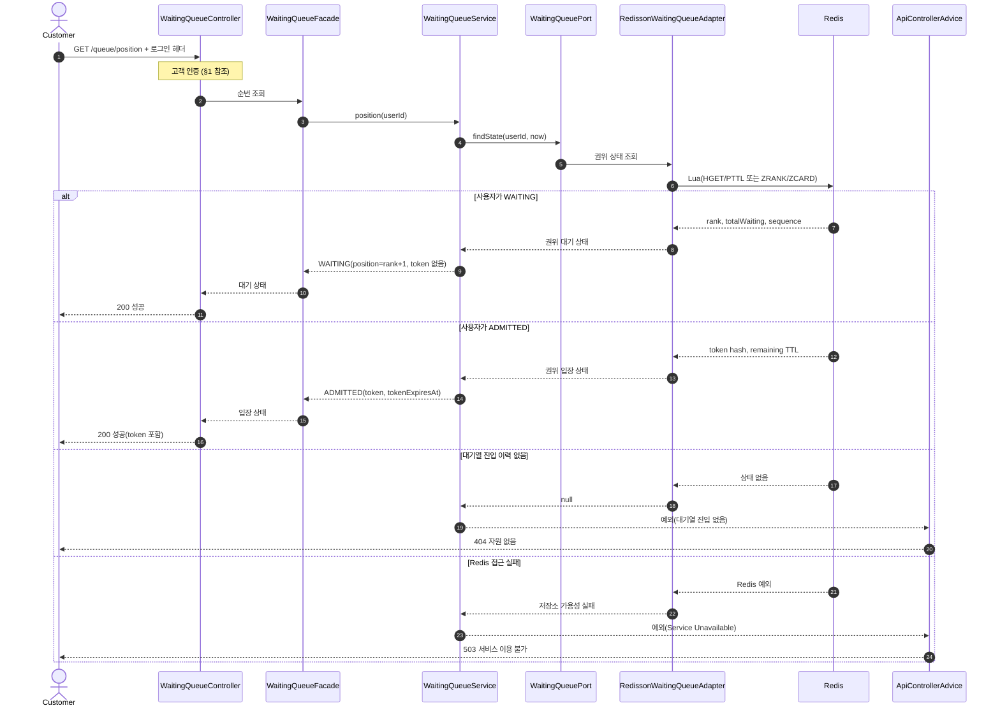
```mermaid
sequenceDiagram
    autonumber
    actor Customer
    participant QueueAPI as WaitingQueueController
    participant QueueFacade as WaitingQueueFacade
    participant QueueService as WaitingQueueService
    participant QueuePort as WaitingQueuePort
    participant Redisson as RedissonWaitingQueueAdapter
    participant Redis
    participant Advice as ApiControllerAdvice

    Customer->>QueueAPI: GET /queue/position + 로그인 헤더
    Note over QueueAPI: 고객 인증 (§1 참조)
    QueueAPI->>QueueFacade: 순번 조회
    QueueFacade->>QueueService: position(userId)
    QueueService->>QueuePort: findState(userId, now)
    QueuePort->>Redisson: 권위 상태 조회
    Redisson->>Redis: Lua(HGET/PTTL 또는 ZRANK/ZCARD)
    alt 사용자가 WAITING
        Redis-->>Redisson: rank, totalWaiting, sequence
        Redisson-->>QueueService: 권위 대기 상태
        QueueService-->>QueueFacade: WAITING(position=rank+1, token 없음)
        QueueFacade-->>QueueAPI: 대기 상태
        QueueAPI-->>Customer: 200 성공
    else 사용자가 ADMITTED
        Redis-->>Redisson: token hash, remaining TTL
        Redisson-->>QueueService: 권위 입장 상태
        QueueService-->>QueueFacade: ADMITTED(token, tokenExpiresAt)
        QueueFacade-->>QueueAPI: 입장 상태
        QueueAPI-->>Customer: 200 성공(token 포함)
    else 대기열 진입 이력 없음
        Redis-->>Redisson: 상태 없음
        Redisson-->>QueueService: null
        QueueService-->>Advice: 예외(대기열 진입 없음)
        Advice-->>Customer: 404 자원 없음
    else Redis 접근 실패
        Redis-->>Redisson: Redis 예외
        Redisson-->>QueueService: 저장소 가용성 실패
        QueueService-->>Advice: 예외(Service Unavailable)
        Advice-->>Customer: 503 서비스 이용 불가
    end
```

핵심 포인트:

- 대기 순번은 1-based다.
- 토큰은 입장된 사용자에게만 응답한다.
- polling 주기는 설정값을 반환하며, 동적 조절은 Round 8 필수 범위가 아니다.
- 조회의 유일한 원천은 Redis이며 응답에 별도 저하 모드 상태를 두지 않는다.

### 15.3 스케줄러 입장 처리와 토큰 발급

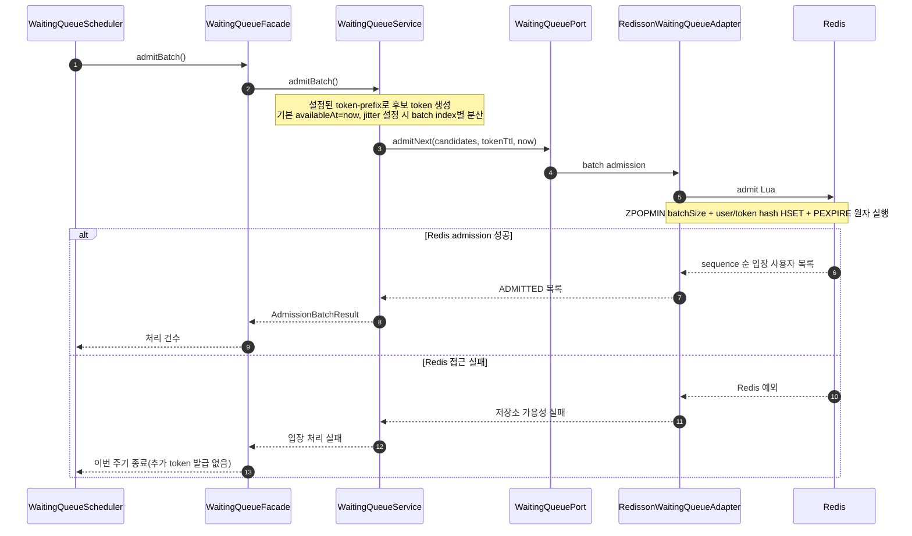
```mermaid
sequenceDiagram
    autonumber
    participant Scheduler as WaitingQueueScheduler
    participant QueueFacade as WaitingQueueFacade
    participant QueueService as WaitingQueueService
    participant QueuePort as WaitingQueuePort
    participant Redisson as RedissonWaitingQueueAdapter
    participant Redis

    Scheduler->>QueueFacade: admitBatch()
    QueueFacade->>QueueService: admitBatch()
    Note over QueueService: 설정된 token-prefix로 후보 token 생성<br/>기본 availableAt=now, jitter 설정 시 batch index별 분산
    QueueService->>QueuePort: admitNext(candidates, tokenTtl, now)
    QueuePort->>Redisson: batch admission
    Redisson->>Redis: admit Lua
    Note over Redisson,Redis: ZPOPMIN batchSize + user/token hash HSET + PEXPIRE 원자 실행
    alt Redis admission 성공
        Redis-->>Redisson: sequence 순 입장 사용자 목록
        Redisson-->>QueueService: ADMITTED 목록
        QueueService-->>QueueFacade: AdmissionBatchResult
        QueueFacade-->>Scheduler: 처리 건수
    else Redis 접근 실패
        Redis-->>Redisson: Redis 예외
        Redisson-->>QueueService: 저장소 가용성 실패
        QueueService-->>QueueFacade: 입장 처리 실패
        QueueFacade-->>Scheduler: 이번 주기 종료(추가 token 발급 없음)
    end
```

핵심 포인트:

- scheduler 실행 여부(`scheduler-enabled`), fixed delay, batch size, jitter, token TTL은 `commerce.waiting-queue` 단일 설정에서 읽는다. `scheduler-enabled`는 API/gate 전체 토글이 아니다.
- 토큰 TTL 기본값은 5분이다.
- token 문자열 prefix와 Redis logical key도 같은 설정의 `token-prefix`, `redis-key-prefix`, 중첩 `redis-keys`에서 읽는다.
- 여러 scheduler instance가 있어도 하나의 admit Lua가 pop과 token hash 생성을 묶으므로 같은 사용자를 중복 입장시키지 않는다.
- admit은 후보 token key의 중복/기존 존재를 pop 전에 검사한다. 충돌 시 기존 binding을 덮어쓰거나 대기자를 유실하지 않고 이번 batch를 비운다.

### 15.4 주문 API 관문과 토큰 소비 (`POST /api/v1/orders`)

```mermaid
sequenceDiagram
    autonumber
    actor Customer
    participant OrderAPI as OrderController
    participant Gate as OrderQueueGateFacade
    participant GatePolicy as OrderQueueGatePolicy
    participant ProductService
    participant QueueFacade as WaitingQueueFacade
    participant OrderFacade
    participant QueueStore as WaitingQueuePort
    participant Redisson as RedissonWaitingQueueAdapter
    participant Redis
    participant Advice as ApiControllerAdvice

    Customer->>OrderAPI: POST /api/v1/orders (대기열 헤더는 LIMITED 주문에서만 필수)
    Note over OrderAPI: 고객 인증 (§1 참조)
    OrderAPI->>Gate: 주문 요청
    Gate->>GatePolicy: requiresAdmission(command)
    GatePolicy->>ProductService: requiresWaitingQueue(productIds)
    ProductService-->>GatePolicy: 상품별 ProductSaleType
    GatePolicy-->>Gate: LIMITED 포함 여부
    alt NORMAL 상품으로만 구성
        Gate->>OrderFacade: 주문 생성 처리
        Note over OrderFacade: 기존 Round 7 트랜잭션·이벤트·outbox 흐름
        OrderFacade-->>Gate: 주문 결과
        Gate-->>OrderAPI: 주문 결과
        OrderAPI-->>Customer: 201 생성됨
    else LIMITED 상품 하나 이상 포함
        Note over Gate: X-Queue-Token과 공백이 아닌 Idempotency-Key 필수
        alt 필수 헤더 누락 또는 공백
            Gate-->>Advice: 400 멱등키 오류 또는 401 토큰 오류
            Advice-->>Customer: mutation 전 거부
        else 헤더 형식 유효
            Gate->>QueueFacade: validateForOrder(userId, token, idempotencyKey)
            QueueFacade->>QueueStore: validateToken(...)
            QueueStore->>Redisson: token 검증과 예약
            Redisson->>Redis: reserve Lua
            Note over Redisson,Redis: binding·availableAt 검증<br/>ACTIVE → PROCESSING + Idempotency-Key
            alt 토큰 무효/만료/다른 멱등키
                Redis-->>Redisson: 검증 실패
                Redisson-->>Gate: TokenValidationResult(거부)
                Gate->>OrderFacade: findByIdempotencyKeyOrNull(userId, key)
                alt 같은 사용자·키의 커밋 주문 있음
                    OrderFacade-->>Gate: 기존 주문
                    Note over Gate: token marker 만료 후에도 새 mutation 없이 회복
                    Gate-->>OrderAPI: 기존 주문 결과
                    OrderAPI-->>Customer: 기존 계약 응답
                else 커밋 주문 없음
                    OrderFacade-->>Gate: null
                    Gate-->>Advice: 대기열 토큰 검증 실패
                    Advice-->>Customer: 401 인증 실패
                end
            else not-yet-available
                Redis-->>Redisson: NOT_YET_AVAILABLE
                Redisson-->>QueueFacade: TokenValidationResult(사용 시각 전)
                QueueFacade-->>Advice: tokenAvailableAt 전 요청
                Advice-->>Customer: 409 Conflict
            else PROCESSING + 같은 Idempotency-Key
                Redis-->>Gate: PROCESSING_BY_SAME_IDEMPOTENCY_KEY
                Gate->>OrderFacade: findByIdempotencyKeyOrNull(userId, key)
                alt 커밋된 본인 주문 있음
                    OrderFacade-->>Gate: 기존 주문
                    Gate->>QueueFacade: consumeAfterOrderCreated(...)
                    QueueFacade->>QueueStore: consumeToken(...)
                    QueueStore->>Redisson: consume Lua
                    Redisson->>Redis: PROCESSING → CONSUMED CAS
                    Redis-->>Gate: true
                    Gate-->>OrderAPI: 기존 주문 결과
                    OrderAPI-->>Customer: 기존 계약 응답
                else 아직 주문 없음
                    OrderFacade-->>Gate: null
                    Gate-->>Advice: 같은 요청 처리 중
                    Advice-->>Customer: 409 Conflict
                end
            else CONSUMED + 같은 Idempotency-Key
                Redis-->>Gate: CONSUMED_BY_SAME_IDEMPOTENCY_KEY
                Gate->>OrderFacade: findByIdempotencyKeyOrNull(userId, key)
                alt 기존 주문 있음
                    OrderFacade-->>Gate: 기존 주문
                    Gate-->>OrderAPI: 기존 주문 결과
                    OrderAPI-->>Customer: 기존 계약 응답
                else 기존 주문 없음
                    OrderFacade-->>Gate: null
                    Gate-->>Advice: 멱등 주문 상태 불일치
                    Advice-->>Customer: 503 Service Unavailable
                end
            else 유효 ACTIVE 토큰 예약 성공
                Redis-->>Gate: VALID(PROCESSING 예약 완료)
                Gate->>OrderFacade: 주문 생성 처리
                alt 주문 처리 정상 반환
                    OrderFacade-->>Gate: 주문 결과
                    Gate->>QueueFacade: consumeAfterOrderCreated(...)
                    QueueFacade->>QueueStore: consumeToken(...)
                    QueueStore->>Redisson: consume Lua
                    Redisson->>Redis: PROCESSING → CONSUMED CAS
                    alt CAS true
                        Redis-->>Gate: true
                        Gate-->>OrderAPI: 주문 결과
                        OrderAPI-->>Customer: 201 생성됨
                    else CAS false 또는 Redis 실패
                        Redis-->>Advice: token 전이 실패
                        Advice-->>Customer: 503 Service Unavailable
                    end
                else OrderFacade 예외
                    OrderFacade-->>Gate: 예외
                    Gate->>OrderFacade: findByIdempotencyKeyOrNull(userId, key)
                    alt 같은 키 주문이 커밋됨
                        OrderFacade-->>Gate: 기존 주문
                        Note over Gate: release 금지
                        Gate->>QueueFacade: consumeAfterOrderCreated(...)
                        QueueFacade->>QueueStore: consumeToken(...) Boolean CAS
                        alt CAS true
                            Gate-->>Advice: 원래 주문 예외
                            Advice-->>Customer: 표준 오류 응답
                        else CAS false 또는 Redis 실패
                            QueueStore-->>Advice: token 전이 실패
                            Advice-->>Customer: 503 Service Unavailable
                        end
                    else 같은 키 주문 없음
                        OrderFacade-->>Gate: null
                        Gate->>QueueFacade: releaseAfterOrderFailed(...)
                        QueueFacade->>QueueStore: releaseToken(...) Boolean CAS
                        alt CAS true
                            Gate-->>Advice: 원래 주문 예외
                            Advice-->>Customer: 표준 오류 응답
                        else CAS false 또는 Redis 실패
                            QueueStore-->>Advice: token 전이 실패
                            Advice-->>Customer: 503 Service Unavailable
                        end
                    else 커밋 여부 조회 실패
                        Note over Gate: PROCESSING 유지, release 금지
                        Gate-->>Advice: fail-closed
                        Advice-->>Customer: 503 Service Unavailable
                    end
                end
            else Redis 접근 실패
                Redis-->>QueueFacade: 저장소 가용성 실패
                QueueFacade-->>Advice: Service Unavailable
                Advice-->>Customer: 503 서비스 이용 불가
            end
        end
    end
```

핵심 포인트:

- `OrderQueueGatePolicy`는 주문 항목 중 하나라도 `LIMITED`이면 주문 전체를 관문 대상으로 판단한다. `NORMAL`-only 주문은 Redis에 의존하지 않는다.
- 선착순 주문의 `X-Queue-Token`은 header-only 계약이고, 공백이 아닌 `Idempotency-Key`와 함께 필수다.
- `PROCESSING + same key`는 두 번째 mutation을 허용하지 않는다. 기존 주문이 확인되면 consume으로 회복하고, 없으면 `409`로 진행 중 상태를 알린다.
- `OrderFacade` 예외만으로 release하지 않는다. 같은 멱등키 주문이 없을 때만 release하고, 커밋된 주문이 있으면 consume하며, 커밋 여부를 판단할 수 없으면 `PROCESSING`을 유지한다.
- consume/release의 `Boolean` CAS 실패는 정상 전이로 취급하지 않고 fail-closed한다. 토큰 관문 이후 주문 이벤트 발행, outbox/Kafka 파이프라인, Metrics 집계는 Round 7 흐름을 그대로 사용한다.

### 15.5 Redis 장애 시 fail-closed

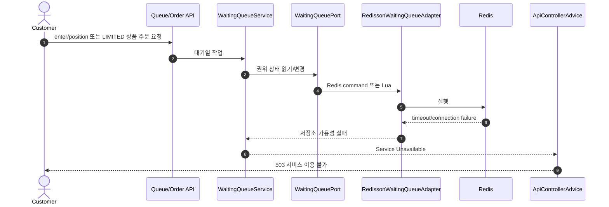
```mermaid
sequenceDiagram
    autonumber
    actor Customer
    participant API as Queue/Order API
    participant QueueService as WaitingQueueService
    participant QueuePort as WaitingQueuePort
    participant Redisson as RedissonWaitingQueueAdapter
    participant Redis
    participant Advice as ApiControllerAdvice

    Customer->>API: enter/position 또는 LIMITED 상품 주문 요청
    API->>QueueService: 대기열 작업
    QueueService->>QueuePort: 권위 상태 읽기/변경
    QueuePort->>Redisson: Redis command 또는 Lua
    Redisson->>Redis: 실행
    Redis-->>Redisson: timeout/connection failure
    Redisson-->>QueueService: 저장소 가용성 실패
    QueueService-->>Advice: Service Unavailable
    Advice-->>Customer: 503 서비스 이용 불가
```

핵심 포인트:

- Redis가 유일한 source of truth이므로 application-level 대체 저장소나 상태 재구축 경로는 두지 않는다.
- Redis 장애 중에는 대기 순서와 토큰 자격을 추측하지 않고 대기열 API와 `LIMITED` 상품 주문을 `503 Service Unavailable`로 거부한다. `NORMAL`-only 주문은 Redis 대기열에 의존하지 않는다.
- Redis persistence/replication/복구는 인프라 운영 책임이다. Redis가 다시 권위 상태를 제공할 수 있을 때 별도 application reconcile 없이 정상 요청을 재개한다.
- 주문 mutation 후 consume 시점에 Redis가 실패하면 응답은 `503`이 될 수 있다. 같은 멱등키 재시도는 기존 주문을 조회해 consume을 회복하며, 새 주문 mutation을 반복하지 않는다.
