# Sequence Diagrams

## 설계 의도

이 문서는 `01-requirements.md`와 `04-erd.md`를 기준으로 한 목표 런타임 협력 흐름을 정리한다.
현재 구현된 user 도메인의 패턴을 참고하지만, 엔드포인트와 컬럼명은 요구사항/ERD 문서를 우선한다.

시퀀스 다이어그램은 API 호출 목록이 아니라 유스케이스의 책임 흐름을 보여주는 데 집중한다.
따라서 API별 Controller 이름은 대부분 `CustomerAPI`, `AdminAPI` boundary로 추상화하고, 관련 endpoint는 각 다이어그램 아래에 별도로 남긴다.

Payment 관련 TX1/TX2 사가 흐름은 후속 결제 연동 단계의 목표 설계다. Round 4 구현 범위는 쿠폰/재고/주문 정합성 검증에 한정하며, 별도 이슈가 없으면 Payment 도메인과 외부 결제 게이트웨이 구현을 새로 추가하지 않는다.

검증 관점은 다음과 같다.

- 사용자/관리자 인증 헤더가 API boundary에서 분리되는가?
- 도메인 간 협력은 Facade에서 조합되고, Service끼리 직접 의존하지 않는가?
- 여러 도메인 상태를 함께 바꾸는 유스케이스가 하나의 트랜잭션 경계 안에서 처리되는가?
- 좋아요 멱등성, 재고 부족 전체 거부, 쿠폰 중복 사용 방지, 브랜드 삭제 시 상품 soft delete 같은 핵심 정책이 흐름 안에 드러나는가?

## 표기 규칙

- `CustomerAPI`, `AdminAPI`는 HTTP Controller 계층을 추상화한 boundary다. (영문 유지)
- `Facade`는 유스케이스 조합 책임, `Service`는 도메인 규칙 수행 책임, `Repository`는 영속성 port 책임을 뜻한다.
- 단일 도메인 변경은 Service가 트랜잭션 경계를 가진다. 여러 도메인을 함께 변경하는 유스케이스는 Facade가 트랜잭션 경계를 가진다.
- 메시지 라벨은 메서드 시그니처가 아니라 **한글 자연어로 의도**를 표기한다.
- 도메인 예외는 `예외(제약조건 간단 설명)` 형식으로 표기한다. 예: `예외(현재 비밀번호 불일치)`, `예외(재고 부족)`.
- HTTP 상태 코드는 코드 + 한글로 표기한다. 예: `200 성공`, `201 생성됨`, `204 응답 본문 없음`, `400 잘못된 요청`, `401 인증 실패`, `404 자원 없음`, `409 충돌`.

## 1. 공통 사용자 인증 흐름

로그인 필요 API는 `X-Loopers-LoginId`, `X-Loopers-LoginPw` 헤더로 사용자를 식별한다.
여정별 다이어그램에서는 이 흐름을 "고객 인증" 노트로 축약한다.

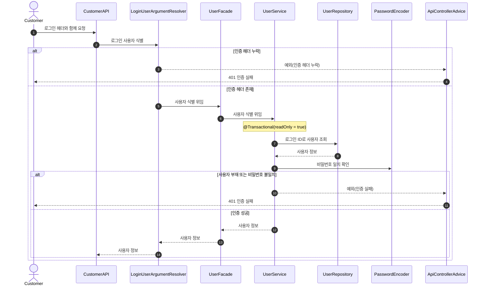

관련 API:

- 로그인 필요 API 전체

## 2. 공통 관리자 인증 흐름

관리자 API는 `/api-admin/v1` prefix와 `X-Loopers-Ldap` 헤더를 사용한다.
초기 구현은 관리자 전용 Controller 메서드에서 헤더를 직접 검증하고, 반복이 커지면 별도 resolver로 분리할 수 있다.

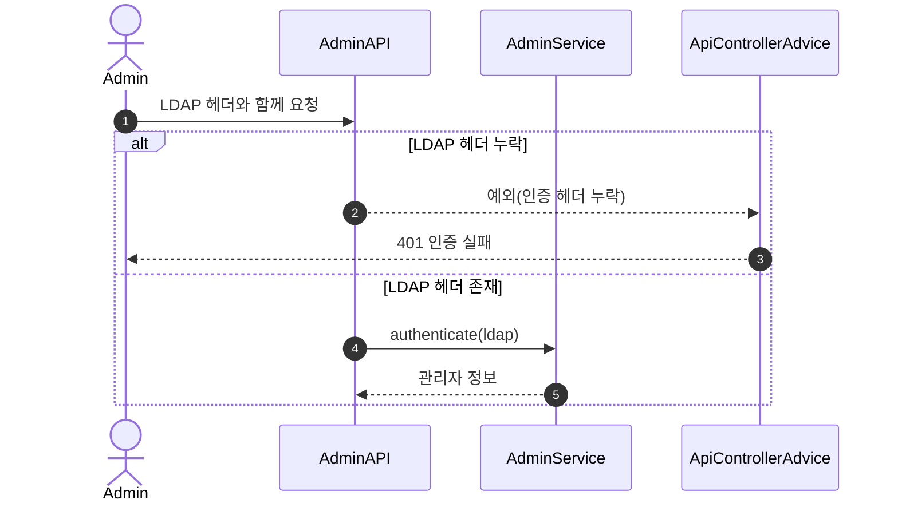

관련 API:

- 관리자 API 전체 (`/api-admin/v1/**`)

## 3. User-J1 첫 주문

신규 사용자가 가입 후 상품을 탐색하고, 관심 상품을 좋아요로 표시한 뒤 주문을 확정하는 정상 흐름이다.
이 다이어그램은 전체 여정의 책임 연결을 보여주고, 좋아요 멱등성과 재고 부족 실패 정책은 별도 다이어그램에서 상세히 다룬다.

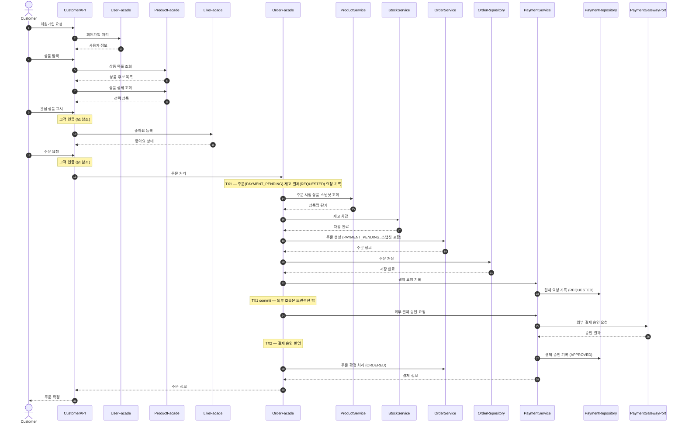

관련 API:

- `POST /api/v1/users`
- `GET /api/v1/products`
- `GET /api/v1/products/{productId}`
- `POST /api/v1/products/{productId}/likes`
- `POST /api/v1/orders`
- `GET /api/v1/orders/{orderId}`

핵심 포인트:

- 상품 탐색은 `ProductFacade`로 묶고, 주문 생성의 핵심 책임인 스냅샷 생성, 재고 차감, 주문 저장, 결제 기록을 중심으로 표현한다.
- 주문 항목에는 상품명과 단가 스냅샷이 저장되어 이후 상품 변경과 독립적으로 과거 주문을 보여준다.
- 외부 결제 호출은 어떤 DB 트랜잭션에도 속하지 않는다. `OrderFacade` 는 (TX1 → 외부 호출 → TX2) 세 구간으로 유스케이스를 구성한다. 주문은 `PAYMENT_PENDING`으로 생성되고 결제 승인 TX2에서 `ORDERED`가 된다. outbox 는 결제수단과 외부 연동 방식이 구체화되면 추가한다.

## 4. User-J3 비밀번호 변경

비밀번호 변경은 현재 인증이 이미 끝났더라도, 저장 직전 최신 비밀번호를 잠금 조회 후 다시 검증한다.

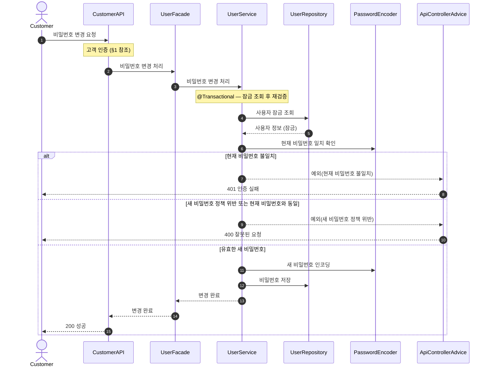

관련 API:

- `PUT /api/v1/users/password`

핵심 포인트:

- 현재 비밀번호 불일치는 `401 인증 실패`로 응답한다.
- 새 비밀번호 포맷 오류, 생년월일 토큰 포함, 현재 비밀번호와 동일한 새 비밀번호는 모두 `400 잘못된 요청`으로 묶는다.

## 5. User-J4 좋아요 토글과 목록 조회

좋아요는 사용자와 상품 쌍의 현재 상태다.
`POST`와 `DELETE`는 최종 상태 기준으로 멱등하게 동작한다.

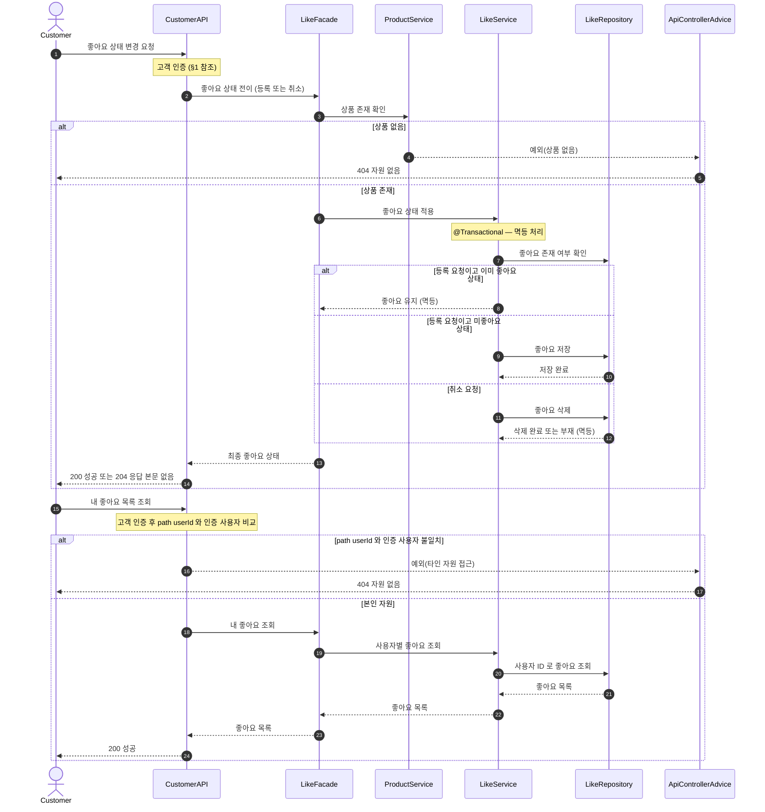

관련 API:

- `POST /api/v1/products/{productId}/likes`
- `DELETE /api/v1/products/{productId}/likes`
- `GET /api/v1/users/{userId}/likes`

핵심 포인트:

- 좋아요 목록은 user에서 likes 컬렉션을 양방향으로 열지 않고 `LikeRepository.findByUserId` 명시 쿼리로 조회한다.
- 좋아요 이력이 아니라 현재 상태만 필요하므로 취소는 hard delete를 기본으로 둔다.
- 본인 외 자원 접근은 자원 존재 여부를 노출하지 않기 위해 `404 자원 없음`으로 응답한다.

## 6. User-E2 재고 부족 거부

주문 항목 중 하나라도 재고가 부족하면 주문 전체를 거부하고 어떤 항목도 차감하지 않는다.
이 다이어그램은 부분 성공 금지 정책을 검증하므로 트랜잭션과 잠금 조회를 상세히 표현한다.

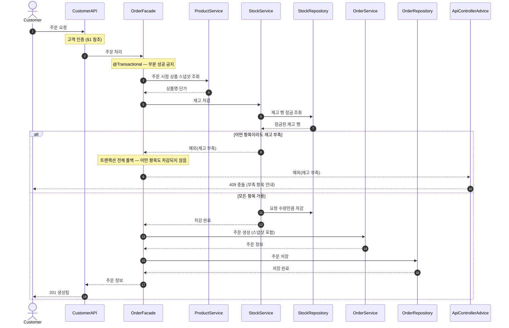

관련 API:

- `POST /api/v1/orders`

핵심 포인트:

- `StockRepository.findStocksForUpdate`로 주문 대상 재고 행을 잠금 조회한다.
- 재고 부족 시 `OrderRepository.save`에 도달하지 않고 전체 트랜잭션이 rollback된다.
- 재고 변경 근거는 주문 항목으로 추적한다. 입고/수동 보정이 생기면 `stock_movements`가 필요하다.

## 7. User-E3 결제 승인 실패

외부 결제 시스템이 승인을 거절하거나 장애를 반환하면 주문 row는 실패 이력으로 유지하고, API 응답은 실패로 반환한다.
TX2 실패 보상은 `PAYMENT_PENDING` 주문에 대해서만 수행해 중복 콜백이나 회복 프로세스가 재고와 쿠폰을 이중 복구하지 못하게 한다.
이 다이어그램은 후속 결제 연동 단계의 보상 설계이며, Round 4 쿠폰/동시성 구현 필수 범위는 아니다.

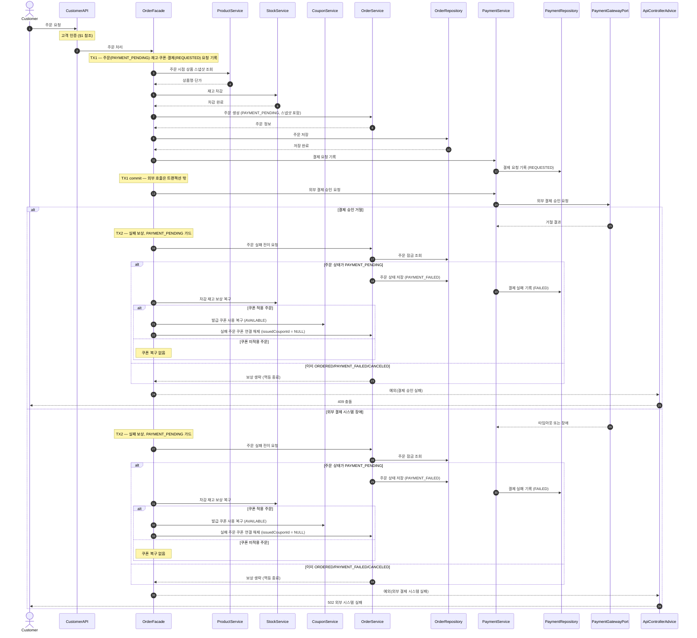

관련 API:

- `POST /api/v1/orders`

핵심 포인트:

- 결제 실패도 `payments.status = FAILED`와 `orders.order_status = PAYMENT_FAILED`로 기록해 주문 시도와 외부 승인 결과를 추적한다.
- 재고·쿠폰 복구는 트랜잭션 롤백이 아니라 **보상 트랜잭션(TX2)** 이다. TX1 이 이미 커밋되어 자동 원복할 수 없기 때문이다.
- 보상은 주문 상태가 `PAYMENT_PENDING`일 때만 수행한다. 상태 가드가 중복 콜백과 orphan 회복 프로세스의 이중 복구를 막는다.
- 쿠폰 적용 주문의 결제 실패 보상은 발급 쿠폰을 `AVAILABLE`로 되돌리고 실패 주문의 `issuedCouponId`를 `NULL`로 분리한다.
- 주문 row와 금액 스냅샷은 `PAYMENT_FAILED` 이력으로 유지되지만, `POST /api/v1/orders` 응답은 성공 생성(`201`)이 아니라 `409` 또는 `502`다.
- TX1 commit 후 TX2 도달 전에 프로세스가 종료되면 `orders.order_status = PAYMENT_PENDING`, `payments.status = REQUESTED`, 차감된 재고, `USED` 쿠폰이 남을 수 있다. 회수 전략(상태 폴링·웹훅·outbox)은 결제수단과 외부 연동 방식이 구체화될 때 확정한다.

## 8. Admin-J1 신규 브랜드와 상품 등록

관리자가 브랜드를 등록하고, 등록된 브랜드에 상품과 초기 재고를 연결해 노출시키는 흐름이다.
변경 작업은 `admin_operation_logs`에 기록한다.

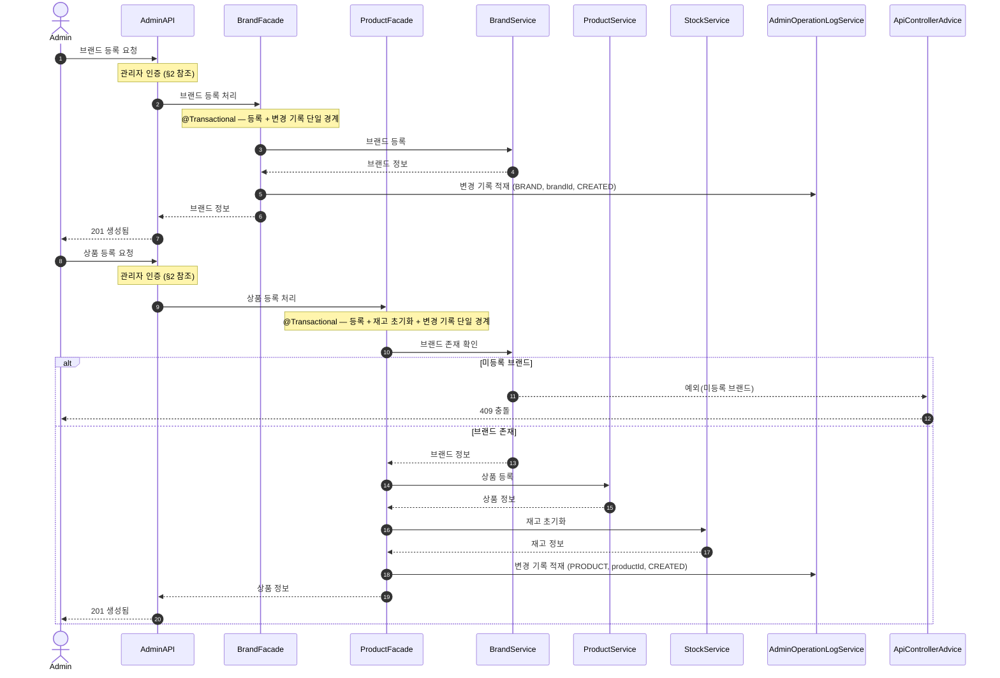

관련 API:

- `POST /api-admin/v1/brands`
- `POST /api-admin/v1/products`

핵심 포인트:

- 상품 등록은 이미 등록된 브랜드에만 허용한다. 시스템 상태와의 충돌이므로 `400 잘못된 요청`이 아니라 `409 충돌`로 응답한다.
- 초기 재고는 상품 생명주기에 종속되며, 별도 삭제 시각을 갖지 않는다.
- 관리자 작업 로그는 변경 대상 검증과 저장이 성공한 뒤 기록한다. 조회 API와 실패한 변경 요청은 성공 이력으로 기록하지 않는다.

## 9. Admin-J2 브랜드 삭제와 상품 soft delete

브랜드 삭제 시 소속 상품도 함께 삭제 상태로 전환한다.
재고는 상품에 종속되므로 별도 삭제 호출을 두지 않는다.

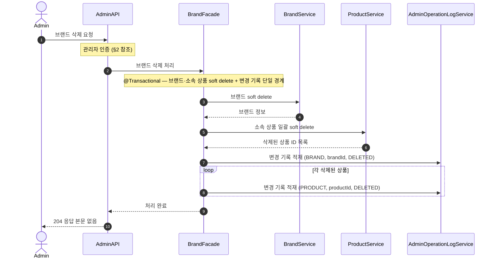

관련 API:

- `DELETE /api-admin/v1/brands/{brandId}`

핵심 포인트:

- DB cascade 대신 애플리케이션 유스케이스에서 브랜드와 상품을 함께 soft delete한다.
- 과거 주문 내역은 `OrderItem` 스냅샷으로 보존되므로 상품 soft delete 이후에도 훼손되지 않는다.
- 관리자 로그의 `target_id`는 브랜드/상품 다형 대상이므로 DB FK를 강제하지 않는다.
- 관리자 작업 로그는 브랜드·소속 상품 soft delete 성공 후 같은 유스케이스 경계 안에서 기록한다.

## 10. 상품/브랜드 공개 조회

익명 방문자와 일반 사용자는 인증 없이 브랜드 단건, 상품 목록, 상품 상세를 조회할 수 있다.
조회 흐름은 쓰기 트랜잭션이 아니라 필터와 정렬, 삭제 상태 제외 조건을 확인하는 데 집중한다.

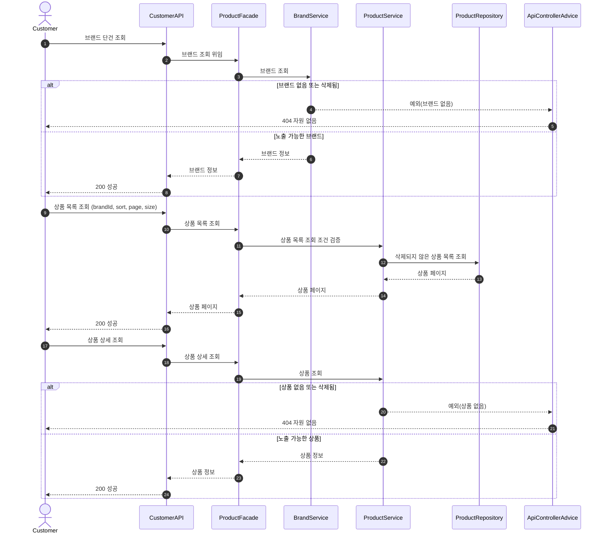

관련 API:

- `GET /api/v1/brands/{brandId}`
- `GET /api/v1/products`
- `GET /api/v1/products/{productId}`

핵심 포인트:

- 공개 조회는 인증이 필요 없지만, soft delete 된 브랜드/상품은 노출하지 않는다.
- 최신순(`latest`) 정렬은 필수이고, 가격 낮은 순·좋아요 많은 순은 선택 확장이다.

## 11. Admin-J3/J4 카탈로그 변경과 주문 모니터링

관리자는 브랜드/상품을 수정하거나 상품을 단건 삭제할 수 있고, 주문 운영 현황을 조회할 수 있다.
카탈로그 변경 작업은 관리자 변경 로그 대상이며, 주문 조회는 읽기 작업이므로 로그 대상이 아니다.

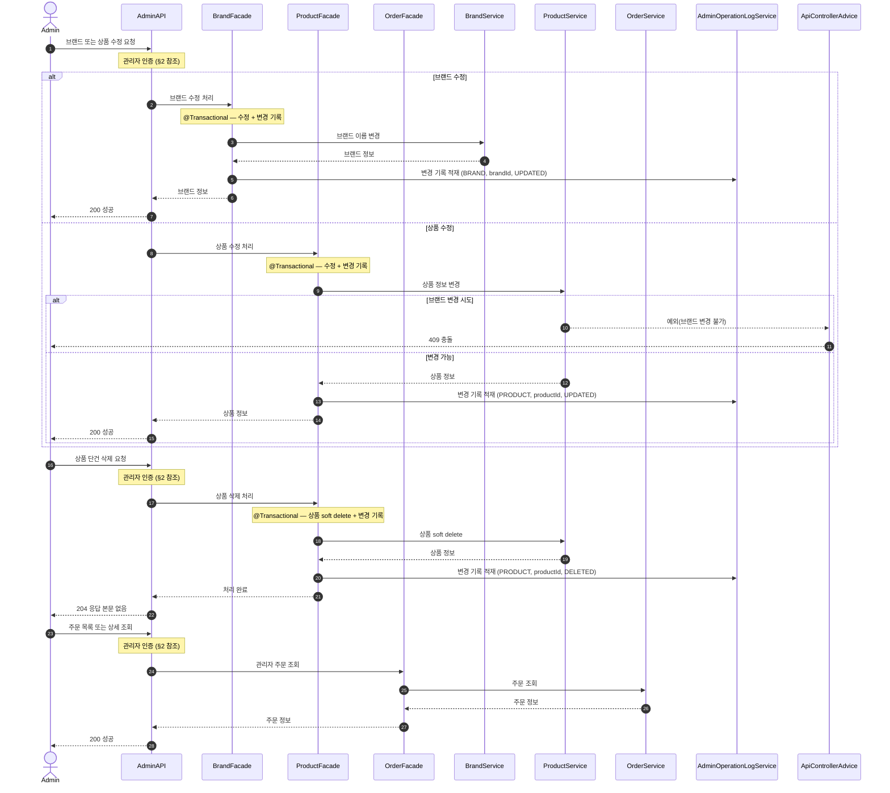

관련 API:

- `PUT /api-admin/v1/brands/{brandId}`
- `PUT /api-admin/v1/products/{productId}`
- `DELETE /api-admin/v1/products/{productId}`
- `GET /api-admin/v1/orders`
- `GET /api-admin/v1/orders/{orderId}`

핵심 포인트:

- 상품 브랜드 변경은 등록 후 불변 정책이므로 `409 충돌`로 거부한다.
- 상품 단건 삭제는 브랜드 삭제와 달리 해당 상품만 soft delete 한다.
- 관리자 작업 로그는 변경 저장 성공 후 기록한다. 브랜드 변경 시도처럼 실패한 요청은 성공 이력으로 기록하지 않는다.
- 관리자 주문 조회는 읽기 작업이므로 `admin_operation_logs` 기록 대상이 아니다.

## 12. User-J5 쿠폰 발급과 내 쿠폰 조회

쿠폰 발급은 쿠폰 템플릿과 사용자 사이에 `IssuedCoupon`을 생성하는 흐름이다.
한 사용자는 같은 쿠폰 템플릿을 한 번만 발급받을 수 있으며, DB unique 제약이 최종 중복을 막는다.

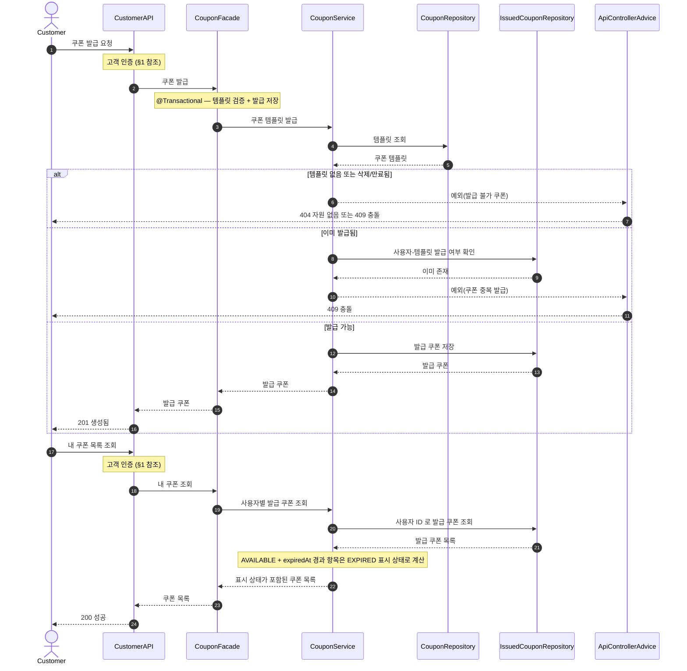

관련 API:

- `POST /api/v1/coupons/{couponId}/issue`
- `GET /api/v1/users/me/coupons`

핵심 포인트:

- `CouponTemplate`은 관리자 정의이고, `IssuedCoupon`은 사용자 보유 상태다.
- `issued_coupons(user_id, coupon_template_id)` unique 제약으로 중복 발급을 최종 차단한다.
- `EXPIRED`는 저장 상태가 아니라 조회 응답을 만들 때 계산한 표시 상태다.
- 발급 가능한 쿠폰 목록 조회(`GET /api/v1/coupons`)는 원문 필수 API가 아니므로 선택 확장 후보로 분리한다.

## 13. User-J5 쿠폰 적용 주문

쿠폰을 적용한 주문은 주문 생성, 재고 차감, 발급 쿠폰 사용 처리를 하나의 트랜잭션으로 묶는다.
동일 발급 쿠폰으로 동시에 주문하더라도 한 주문만 성공해야 한다.

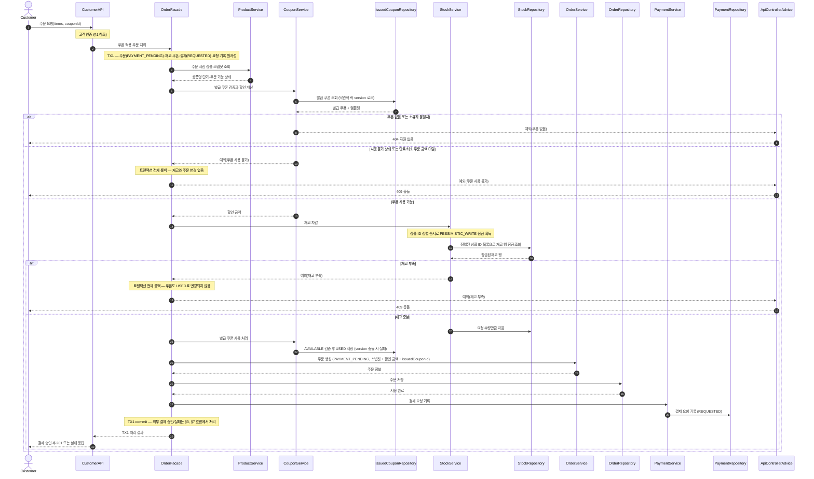

관련 API:

- `POST /api/v1/orders`

핵심 포인트:

- 주문 요청의 쿠폰 필드는 외부 계약상 `couponId`이며, 내부에서는 발급 쿠폰 식별자 `issuedCouponId`로 매핑한다.
- 발급 쿠폰은 비관적 락으로 잠그지 않고, 사용 가능(`AVAILABLE`) 상태를 검증한 뒤 `USED`로 전환하며 `version` 낙관적 락으로 동시 사용을 감지한다. 동일 쿠폰 동시 주문 중 하나만 성공하고 나머지는 version 충돌로 실패한다.
- 여러 재고 행 잠금은 상품 ID 정렬 순서로 획득해 교착 가능성을 줄인다.
- 쿠폰 검증, 재고 차감, 주문 저장, 결제 요청 기록 중 하나라도 실패하면 TX1 전체를 rollback한다.
- TX1 이후 외부 결제 실패 보상은 §7의 후속 결제 연동 설계에서 다룬다. Round 4 구현 이슈는 결제 호출 전 쿠폰/재고/주문 원자성까지를 우선 범위로 둔다.

## 14. Admin-J5 쿠폰 템플릿 운영

관리자는 쿠폰 템플릿을 생성, 수정, soft delete하고 발급 이력을 조회한다.
삭제된 템플릿은 신규 발급 대상에서 제외되지만 이미 발급된 쿠폰과 주문 스냅샷은 유지된다.

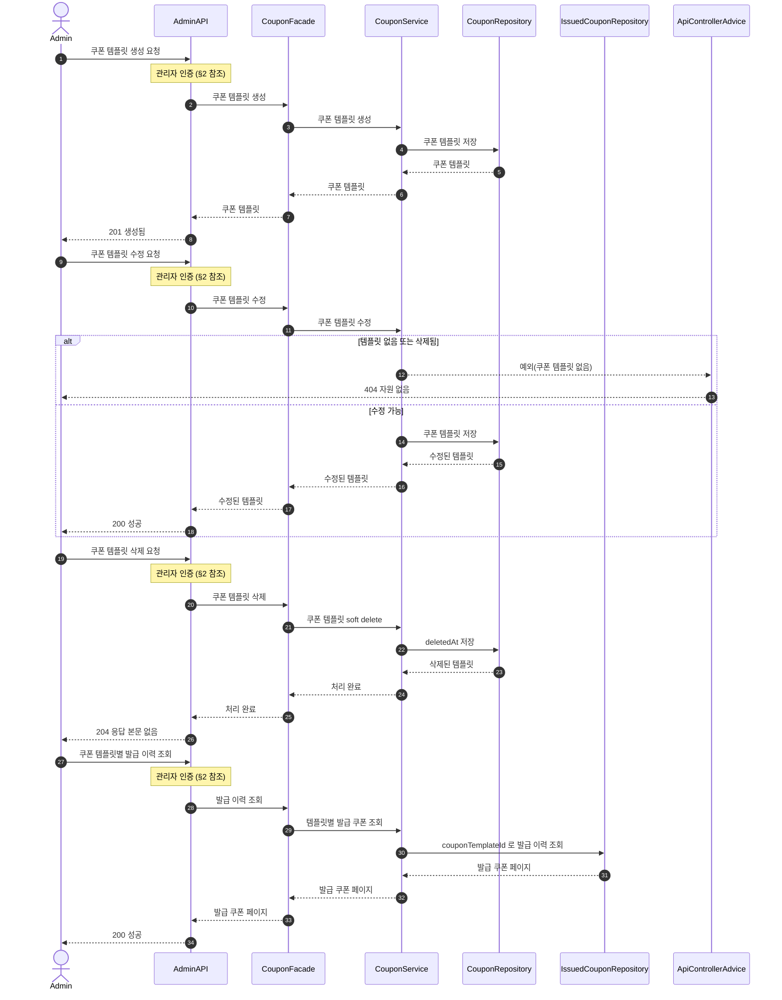

관련 API:

- `POST /api-admin/v1/coupons`
- `PUT /api-admin/v1/coupons/{couponId}`
- `DELETE /api-admin/v1/coupons/{couponId}`
- `GET /api-admin/v1/coupons`
- `GET /api-admin/v1/coupons/{couponId}`
- `GET /api-admin/v1/coupons/{couponId}/issues`

핵심 포인트:

- 쿠폰 템플릿 삭제는 soft delete다.
- 발급 쿠폰과 주문 할인 스냅샷은 템플릿 수정·삭제와 독립적으로 유지한다.
- 관리자 쿠폰 변경 작업 로그가 필요해지면 `AdminOperationLog`의 대상 유형에 `COUPON_TEMPLATE`을 추가한다.
