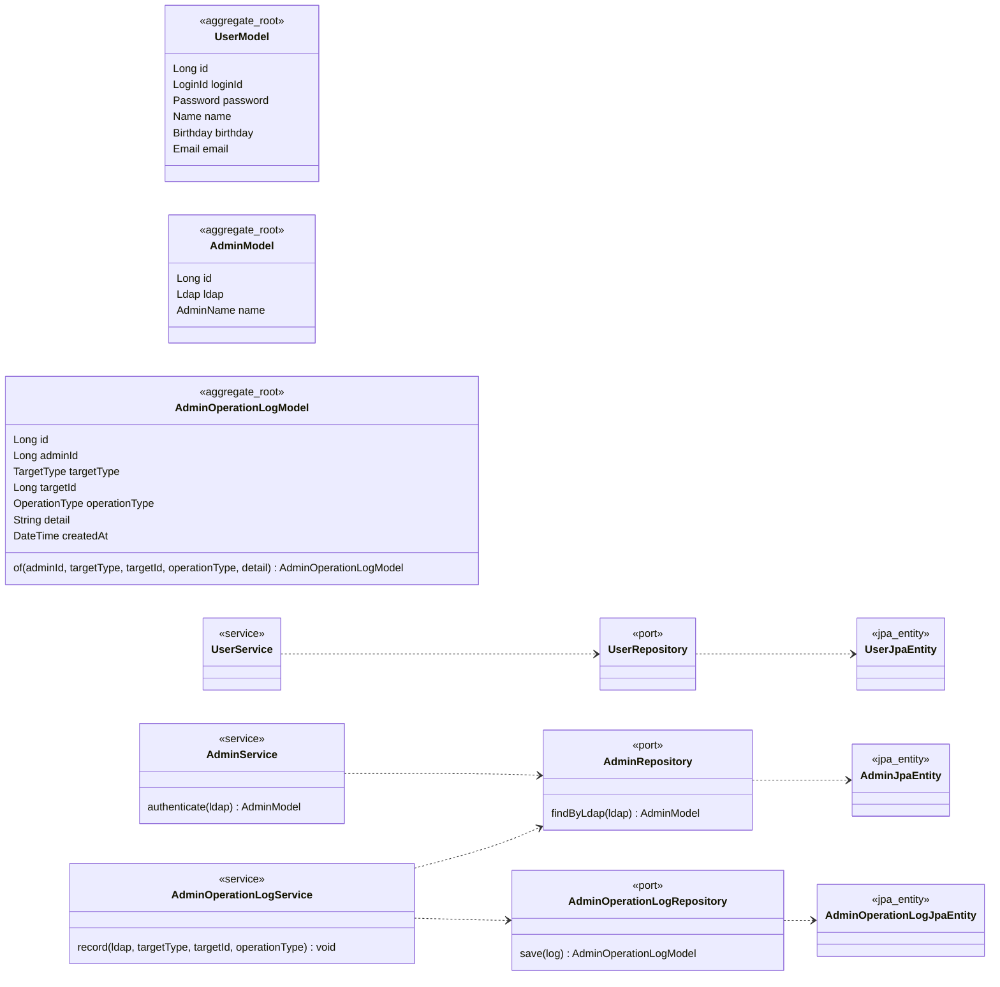
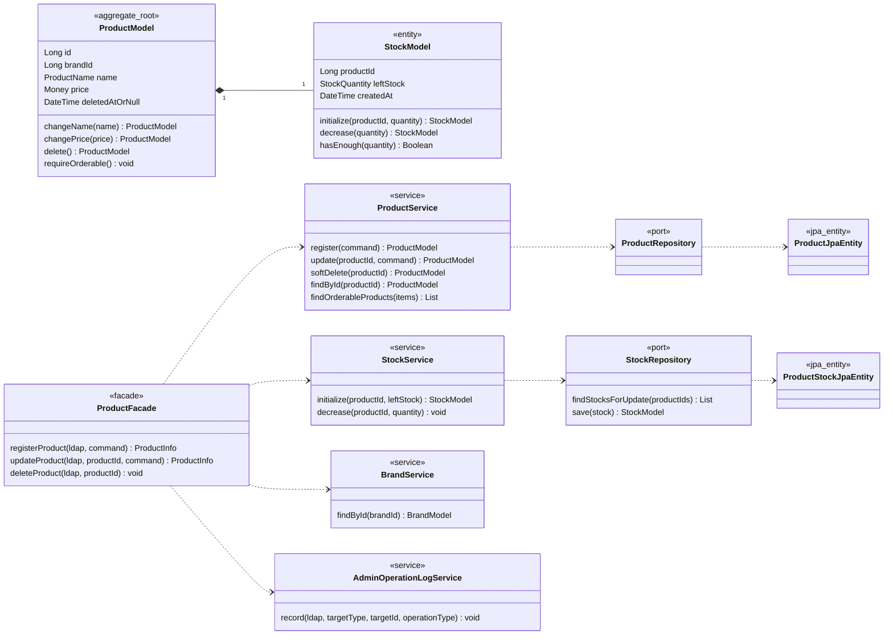
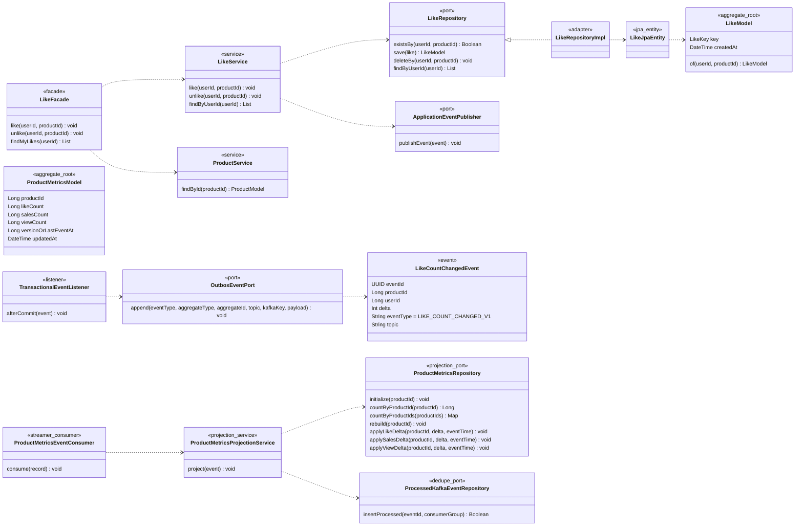
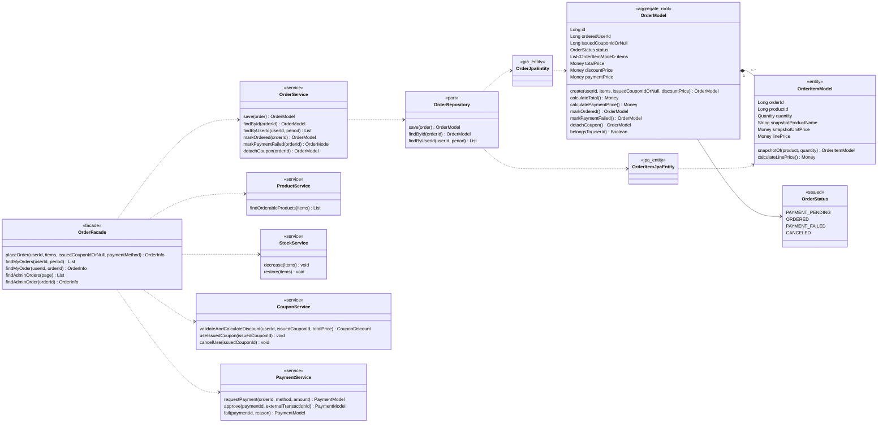
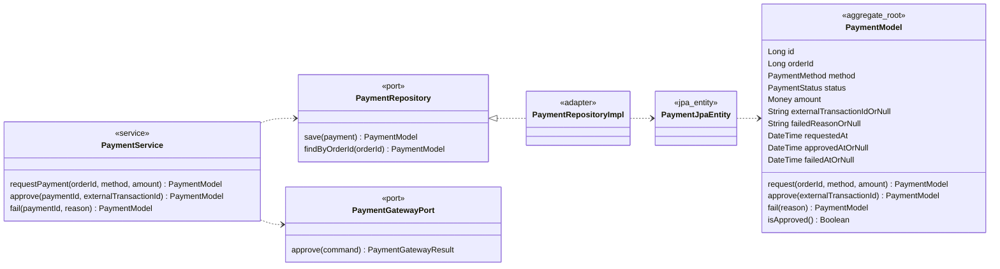
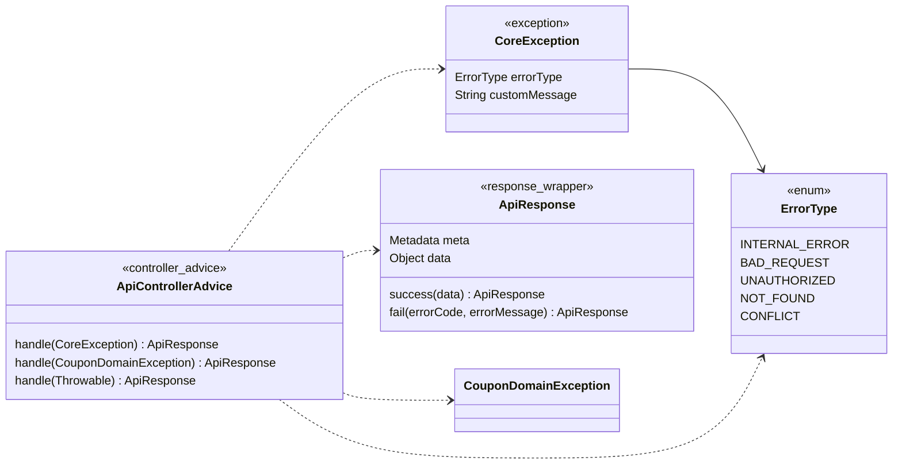
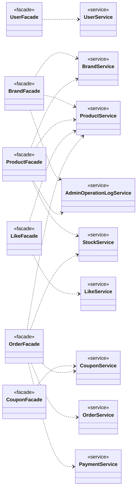

# Class Diagram

## 설계 의도

이 문서는 `01-requirements.md`와 `04-erd.md`를 기준으로 한 목표 정적 구조를 정리한다.
현재 구현된 user 도메인은 패턴 템플릿으로 사용하고, 미구현 도메인은 같은 패키지/계층 규칙을 적용한 목표 설계로 표현한다.
특히 이 문서의 목적은 컨트롤러/DB 테이블 목록이 아니라 **도메인 객체가 어떤 값을 갖고, 어떤 불변식을 지키며, 어떤 행위를 책임지는지**를 드러내는 것이다.
Round 2 핵심 설계 범위는 브랜드/상품, 좋아요, 주문, 재고, 결제 기록이며, user 도메인은 인증과 패턴 레퍼런스로만 둔다.
Round 4 핵심 설계 범위는 쿠폰 템플릿, 발급 쿠폰, 쿠폰 적용 주문의 원자성이다.
Payment 모델과 주문 결제 FSM은 후속 결제 연동 단계의 목표 구조다. Round 4 구현 이슈는 쿠폰/재고/주문 트랜잭션 정합성까지를 범위로 두며, 별도 이슈가 없으면 Payment 도메인 구현을 새로 추가하지 않는다.

기준은 다음과 같다.

- 문서 기준 엔드포인트와 컬럼명은 `01-requirements.md`, `04-erd.md`를 우선한다.
- 현재 user 구현과 문서 기준이 다른 부분은 구현이 나중에 맞춰야 할 차이로 본다.
- DDD 도메인 모델은 POJO로 유지하고, JPA Entity는 `infrastructure/persistence`에서 분리한다.
- 도메인 간 협력은 Facade가 조합한다. Service끼리는 직접 의존하지 않는다.
- 자기 도메인의 영속성/외부 협력은 port + adapter로 분리한다.
- Round 7 이벤트 생산, routing, outbox 저장은 API 애플리케이션 경계가 담당하고, streamer 쪽 모델은 collector/projection 구조로만 둔다.
- 클래스 다이어그램의 메서드는 구현 상세가 아니라 도메인 객체가 책임져야 할 행위와 규칙의 위치를 뜻한다.
- Value Object 는 별도 클래스 박스로 그리지 않는 것을 기본으로 한다. 도메인 속성에 해당하는 VO 는 소속 모델의 필드 타입으로 표기해 시각적 잡음을 줄이고, 각 도메인 절 하단에 사용된 VO 목록과 책임을 정리한다.

## 패턴 템플릿

현재 user 도메인에서 확인한 기본 슬롯이다.

| 슬롯 | 책임 |
| --- | --- |
| `model` | 애그리거트 루트/엔티티 POJO |
| `vo` | 값 객체와 도메인 규칙 검증 |
| `port` | 자기 도메인 인프라/외부 협력 추상화 |
| `application` | Service, Facade, command/info DTO |
| `infrastructure/persistence` | JPA Entity, Spring Data Repository, port 구현체 |
| `exception` | 도메인 예외 |
| `presentation` | Controller, API spec, request/response, auth resolver |

단일 도메인 변경은 Service에 트랜잭션을 둔다. 주문/관리자 변경 로그처럼 여러 도메인 상태를 함께 바꾸는 유스케이스는 Facade가 트랜잭션 경계를 가진다.

## 도메인 객체 표기 기준

다이어그램에서 도메인 설계 판단은 다음 순서로 읽는다.

| 표기 | 의미 |
| --- | --- |
| `<<aggregate_root>>` | 외부에서 직접 식별하고 저장/조회하는 일관성 경계의 루트 |
| `<<entity>>` | 루트 생명주기에 종속되지만 고유 식별 또는 상태 변경을 갖는 도메인 객체 |
| `<<value_object>>` | 값 자체와 검증 규칙을 함께 갖는 불변 객체 |
| `<<port>>` | 도메인/애플리케이션이 필요로 하는 저장소 또는 외부 협력 추상화 |
| `<<jpa_entity>>` | DB 매핑 전용 객체. 도메인 객체와 다른 개념이며 변환 경계에만 위치 |

- 도메인 객체의 필드는 비즈니스 언어 기준의 값이다. DB 컬럼명과 1:1로 맞추기보다 불변식 표현을 우선한다.
- 도메인 객체의 메서드는 `Service`에 흩어지면 안 되는 핵심 규칙을 나타낸다. 실제 구현에서는 mutable 방식과 immutable copy 방식 중 Kotlin 코드 스타일에 맞게 선택한다.
- 다른 애그리거트를 직접 참조하지 않고 식별자(`userId`, `brandId`, `productId`)로 참조한다. 존재 검증과 다중 도메인 조합은 Facade에서 수행한다.
- `createdAt`, `updatedAt`, `deletedAt`은 기본적으로 영속성 관심사다. 다만 삭제 여부, 주문 시점 스냅샷처럼 도메인 규칙에 영향을 주는 값은 도메인 모델에도 드러낸다.

## 도메인 객체 설계 요약

| 도메인 | 루트/엔티티 | 핵심 VO | 보장해야 할 불변식 | 주요 행위 |
| --- | --- | --- | --- | --- |
| User | `UserModel` | `LoginId`, `Password`, `Name`, `Birthday`, `Email` | 로그인 ID 형식/유일성, 비밀번호 형식/생년월일 포함 금지/인코딩 보관, 생년월일 과거 날짜 | 회원가입, 인증, 비밀번호 변경 |
| Admin | `AdminModel`, `AdminOperationLogModel` | `Ldap`, `AdminName`, `TargetType`, `OperationType` | 관리자 LDAP 유일성, 로그 대상은 브랜드/상품 변경 작업으로 제한 | 관리자 식별, 변경 작업 기록 |
| Brand | `BrandModel` | `BrandName` | 브랜드명 유효성, 삭제된 브랜드는 상품 등록 기준이 될 수 없음 | 등록, 이름 변경, soft delete |
| Product | `ProductModel`, `StockModel` | `ProductName`, `Money`, `Quantity`, `StockQuantity` | 상품은 존재하는 브랜드에 속함, 가격은 음수 불가, 재고는 음수 불가, 삭제된 상품은 주문 불가 | 상품 정보 변경, 삭제, 재고 초기화/차감 |
| Like | `LikeModel`, `ProductMetricsModel` | `LikeKey` | 사용자-상품 쌍은 하나의 현재 상태만 가짐, 등록/취소는 멱등, 좋아요 수는 `LIKE_COUNT_CHANGED_V1` 기반 eventually consistent projection | 좋아요 생성, 좋아요 취소, 내 좋아요 조회, 상품 지표 projection 조회/재구성 |
| Coupon | `CouponTemplateModel`, `IssuedCouponModel`, `CouponIssueRequestModel` | `CouponName`, `DiscountPolicy`, `IssuedCouponStatus`, `CouponIssueRequestStatus`, `Money` | 한 사용자-쿠폰 템플릿 조합은 한 번만 발급됨, 발급 요청은 비동기 상태를 가짐, 발급 쿠폰은 사용 가능 상태에서 한 번만 사용 가능, 만료 쿠폰은 사용 불가 | 쿠폰 템플릿 생성/수정/삭제, 쿠폰 발급 요청 접수, worker 발급, 상태 조회, 할인 계산, 쿠폰 사용/복구 |
| Order | `OrderModel`, `OrderItemModel` | `Money`, `Quantity`, `OrderStatus` | 주문 항목 1개 이상, 수량 양수, 주문 시점 상품명/단가/할인 스냅샷 불변, 생성 상태는 `PAYMENT_PENDING`, 전이는 `PAYMENT_PENDING -> ORDERED/PAYMENT_FAILED`만 허용 | 주문 생성, 금액 계산, 쿠폰 할인 반영, 결제 결과 전이, 본인 주문 검증 |
| Payment | `PaymentModel` | `PaymentMethod`, `PaymentStatus`, `Money` | 후속 결제 연동 설계에서 주문에 1:1로 속함, 결제 금액은 주문 결제 금액과 일치, 상태 전이는 요청 후 승인/실패 | 결제 요청 기록, 승인 기록, 실패 기록 |

## 1. User 패턴 레퍼런스

현재 구현된 user 도메인의 핵심 구조다. 이 다이어그램은 실제 코드 구조를 기준으로 한다.

### Value Objects

| VO | 책임 | 제약사항 |
| --- | --- | --- |
| `LoginId` | 사용자 로그인 식별자 | 영문/숫자 4~20자, 시스템 전체 유일 |
| `Password` | 인증 비밀값 정책과 인코딩 결과 표현 | 8~16자, 문자종류 조건 충족, 생년월일 토큰 포함 불가, BCrypt 인코딩 보관 |
| `Name` | 사용자 이름 | 공백 제외 1~50자 |
| `Birthday` | 사용자 생년월일 | `LocalDate`, 과거 날짜만 허용 |
| `Email` | 사용자 이메일 주소 | RFC 5322 간이 형식 |

### 객체 책임/불변식

- `UserModel`은 사용자 식별자와 프로필 값을 VO로 보관하는 애그리거트 루트다.
- 현재 구현에서는 사용자 값 규칙을 VO가 보유하고, 회원가입/인증/비밀번호 변경 유스케이스 규칙은 `UserService`가 조합한다.
- `Password`는 생성 시점에 평문 정책을 검증한 뒤 인코딩된 문자열만 보관한다. 평문 비밀번호는 도메인 객체 상태로 남기지 않는다.
- 로그인 ID 유일성은 `UserRepository.existsByLoginId` 사전 검사와 DB unique constraint가 함께 보장한다.

해석:

- `UserModel`은 VO 를 필드로 갖는 순수 도메인 모델이다.
- `UserService`는 비밀번호 검증/변경과 회원가입 규칙을 수행하고, `UserRepository`와 `PasswordEncoder` port에만 의존한다.
- `UserJpaEntity`가 도메인 변환 책임을 가지며, 도메인 모델은 JPA를 알지 않는다.

## 2. User/Admin 식별 컨텍스트 목표 구조

관리자와 관리자 변경 로그는 사용자/관리자 식별 컨텍스트에 둔다.
관리자 변경 로그는 브랜드/상품 변경 작업만 기록하며 조회 작업은 기록하지 않는다.

### Value Objects

| VO | 책임 | 제약사항 |
| --- | --- | --- |
| `Ldap` | 관리자 LDAP 식별자 | 시스템 전체 유일 |
| `AdminName` | 관리자 이름 | User `Name` 과 같은 규칙 |
| `TargetType` | 변경 대상 종류 | `BRAND` / `PRODUCT` 만 허용 |
| `OperationType` | 변경 종류 | `CREATED` / `UPDATED` / `DELETED` 만 허용 |

### 객체 책임/불변식

- `AdminModel`은 관리자 요청자의 식별 컨텍스트다. 관리자 권한은 `Ldap` 값으로 식별한다.
- `AdminOperationLogModel`은 브랜드/상품 변경 작업의 결과를 기록하는 독립 애그리거트다.
- `targetType`과 `targetId`는 다형 참조다. DB FK를 걸지 않는 대신, Facade가 변경 대상 존재 여부와 작업 성공 여부를 확인한 뒤 로그를 생성한다.
- 실패한 변경 요청이나 조회 작업은 성공 이력으로 기록하지 않는다.
- 조회 작업은 변경 로그 대상이 아니다. 변경 전/후 값 감사가 필요해지면 `detail`에 JSON/TEXT 스냅샷을 담는다.

해석:

- 관리자 인증은 `X-Loopers-Ldap` 헤더를 기준으로 수행한다.
- `AdminOperationLogModel.targetId`는 브랜드와 상품을 모두 가리키는 다형 대상이다. DB FK를 강제하지 않는다.
- 변경 전/후 값 감사가 필요해지면 `detail`을 JSON/TEXT 스냅샷으로 구체화한다.

## 3. Brand

브랜드는 상품의 소속 기준이다. 브랜드 삭제는 상품 soft delete cascade를 동반하므로 `BrandFacade`가 `ProductService`와 관리자 로그 서비스를 조합한다.

### Value Objects

| VO | 책임 | 제약사항 |
| --- | --- | --- |
| `BrandName` | 브랜드 이름 | 등록·수정 시 도메인 정책 검증 |

### 객체 책임/불변식

- `BrandModel`은 상품이 소속될 수 있는 카탈로그 기준이다.
- 삭제된 브랜드는 상품 등록/수정의 유효한 소속 대상이 될 수 없다.
- 브랜드 삭제는 브랜드 자신을 soft delete하고, `BrandFacade`가 소속 상품 soft delete와 관리자 변경 로그 기록을 같은 유스케이스로 묶는다.
- DB cascade가 아니라 애플리케이션 유스케이스가 소속 상품 삭제를 명시적으로 수행한다.

해석:

- 브랜드 등록/수정/삭제는 관리자 변경 로그 대상이다.
- 브랜드 삭제 시 DB cascade가 아니라 애플리케이션 유스케이스에서 소속 상품을 함께 soft delete한다.

## 4. Product

상품은 브랜드에 속하고, 재고는 상품 생명주기에 종속되는 부속 모델이다.
`StockModel`은 `updatedAt`/`deletedAt` 없이 현재 주문 가능 수량과 생성 시점만 가진다.

### Value Objects

| VO | 책임 | 제약사항 |
| --- | --- | --- |
| `ProductName` | 상품 이름 | 공백 문자열 불가 |
| `Money` | 가격 표현 — `OrderModel`/`OrderItemModel` 에서도 재사용 | 음수 불가, 단위 표준화 |
| `Quantity` | 주문 요청 수량 | 자연수만 허용 |
| `StockQuantity` | 재고 수량 | 0 이상 정수만 허용 |

### 객체 책임/불변식

- `ProductModel`은 상품의 판매 정보와 삭제 상태를 보관하는 애그리거트 루트다.
- `brandId`는 다른 애그리거트인 브랜드를 ID로 참조한다. 브랜드 존재 검증은 `ProductFacade`가 `BrandService`를 통해 수행한다.
- 삭제된 상품은 주문 가능 상품으로 사용할 수 없다. `requireOrderable()`은 주문 생성 전 상품 상태 검증 지점이다.
- `StockModel`은 상품 생명주기에 종속된 엔티티이며 재고 음수 방지 규칙을 직접 가진다.
- 재고 차감 책임은 `StockService`와 `StockModel.decrease`에 둔다. `ProductService`가 재고 저장소를 직접 다루지 않게 해 상품 정보 변경과 재고 변경 책임을 분리한다.

해석:

- 상품 등록은 `BrandService.findById`로 브랜드 존재를 먼저 검증한다.
- 재고 차감은 주문 유스케이스 트랜잭션 안에서 `StockService`를 통해 수행되어야 한다.
- 입고, 수동 보정, 재고 실사가 필요해지면 별도 `StockMovementModel`과 `stock_movements` 테이블을 추가한다.

## 5. Like

좋아요는 사용자와 상품 사이의 현재 상태다. 한 사용자와 한 상품 쌍은 하나의 좋아요만 가질 수 있다.

### Value Objects

| VO | 책임 | 제약사항 |
| --- | --- | --- |
| `LikeKey` | `userId` + `productId` 복합 식별자 | 한 사용자와 한 상품 쌍의 현재 좋아요 상태만 표현 |

### 객체 책임/불변식

- `LikeModel`은 사용자와 상품 사이의 현재 관심 상태를 나타내는 관계 애그리거트다.
- 좋아요는 이력보다 현재 상태가 중요하므로 취소 시 hard delete를 기본으로 한다.
- 같은 `LikeKey`는 하나만 존재할 수 있다. 멱등 처리는 `LikeService`가 repository 존재 여부를 기준으로 조합하고, DB 복합 PK가 최종 중복을 막는다.
- `LikeModel`은 `UserModel`이나 `ProductModel` 객체를 직접 들고 있지 않는다. 다른 애그리거트와는 식별자로만 연결한다.
- `LikeService`는 `likes` INSERT/DELETE가 실제 상태 전이를 만들 때만 `ApplicationEventPublisher`로 `LikeChangedApplicationEvent`를 발행한다. 커밋 이후 `@TransactionalEventListener`가 `LIKE_COUNT_CHANGED_V1` outbox event를 저장한다. 이벤트는 UUID `eventId`, `productId`, `userId`, `delta=+1/-1`을 포함하고, Kafka key는 `productId`, topic은 `catalog-events`이다. 이미 좋아요가 있거나 이미 취소된 멱등 no-op 요청은 이벤트를 만들지 않는다.
- `ProductMetricsModel`은 좋아요·판매·조회 원천에서 파생되는 eventually consistent projection이다. `LikeService`가 직접 변경하지 않으며, `ProductMetricsEventConsumer`가 Kafka record를 받은 뒤 `processed_kafka_events`에 `eventId`를 먼저 기록해 중복 처리를 막고 `ProductMetricsRepository.applyLikeDelta`로 projection을 반영한다.
- `ProductMetricsRepository`는 projection 조회, 상품 생성 시 초기화, 장애 복구용 backfill/rebuild 책임을 갖는다. projection lag가 있을 수 있으므로 상품 조회(`ProductFacade`)의 `likeCount`/`salesCount`/`viewCount`는 짧은 지연을 허용하며, 장기 불일치는 원천 테이블과 Kafka replay 기준 재구성으로 보정한다.

해석:

- `POST`는 이미 존재하면 그대로 성공하고, 없으면 생성한다.
- `DELETE`는 이미 없더라도 삭제 완료 상태로 보고 성공한다.
- user에서 likes 컬렉션을 양방향 매핑하지 않고 `LikeRepository.findByUserId` 명시 쿼리로 조회한다.

## 6. Order

주문은 주문자와 하나 이상의 주문 항목을 가진다.
주문 항목은 주문 당시 상품명과 단가를 스냅샷으로 보관한다.

### Value Objects

| VO | 책임 | 제약사항 |
| --- | --- | --- |
| `Money` | 주문 합계·할인·결제 금액과 주문 항목 단가 표현 | Product §4 와 동일 VO, 원 단위 정수 표현, 음수 불가, 결제 금액은 0 이상 |
| `Quantity` | 주문 항목 수량 | 양수만 허용 |
| `OrderStatus` | 주문 상태 전이 표현 | `PAYMENT_PENDING`에서 `ORDERED` 또는 `PAYMENT_FAILED`로만 전이, `CANCELED`는 확장 후보 |

### 객체 책임/불변식

- `OrderModel`은 주문자와 주문 항목 목록을 일관성 경계로 묶는 애그리거트 루트다.
- 주문은 항목을 1개 이상 가져야 하며, 총액은 항목별 `linePrice` 합계로 계산한다.
- `OrderModel.create()`는 주문을 항상 `PAYMENT_PENDING` 상태로 생성한다.
- 주문 상태 전이는 sealed/FSM으로 통제한다. 후속 결제 연동 설계에서 허용되는 전이는 `PAYMENT_PENDING -> ORDERED`, `PAYMENT_PENDING -> PAYMENT_FAILED`뿐이다.
- `markPaymentFailed()`는 현재 상태가 `PAYMENT_PENDING`일 때만 성공한다. 이 상태 가드가 중복 콜백이나 회복 프로세스의 이중 보상을 막는다.
- `issuedCouponIdOrNull`은 주문에 실제 적용된 발급 쿠폰 식별자 스냅샷이다. 쿠폰 정책 전체를 주문이 직접 참조하지 않는다.
- `discountPrice`는 주문 생성 시점에 확정된 할인 금액이다. 이후 쿠폰 템플릿이 수정되거나 삭제되어도 과거 주문 금액은 바뀌지 않는다.
- 결제 실패 보상 후 `issuedCouponIdOrNull`은 `NULL`로 분리될 수 있다. 이때 `discountPrice`는 실패 주문 시도 당시 할인 계산 스냅샷으로 유지한다.
- `OrderItemModel`은 주문 시점 상품명과 단가를 스냅샷으로 보관한다. 이후 상품명/가격이 바뀌어도 과거 주문 항목 값은 바뀌지 않는다.
- 본인 주문 조회 검증은 `OrderModel.belongsTo(userId)` 같은 도메인 행위로 표현한다. 외부 응답은 자원 존재 노출을 피하기 위해 정책에 맞는 상태로 변환한다.
- 주문 생성 유스케이스는 `OrderFacade`가 상품 주문 가능성 조회, 쿠폰 검증·할인 계산, 재고 차감, 주문 저장, 결제 기록을 조합한다.
- 외부 결제 호출은 어떤 DB 트랜잭션에도 속하지 않는다. `OrderFacade` 는 (TX1: 주문·재고·쿠폰·결제 요청 기록) → 외부 호출 → (TX2: 결제 결과 반영, 실패 시 `OrderService.markPaymentFailed` + `StockService.restore` + `CouponService.cancelUse` + `OrderService.detachCoupon` 보상) 의 3단 구조로 유스케이스를 구성한다.

해석:

- 주문 생성(`PAYMENT_PENDING`), 재고 차감, 쿠폰 사용 처리, 결제 요청 기록(`REQUESTED`)은 TX1 으로 묶고, 외부 결제 호출은 트랜잭션 밖에서 수행한 뒤 TX2 로 결과를 반영한다.
- 재고 부족 시 `409 Conflict`로 전체 주문을 거부하고, 어떤 항목도 차감하지 않는다.
- 쿠폰 사용 조건 불일치나 동시 사용 경쟁이 발생하면 `409 Conflict`로 전체 주문을 거부하고, 재고와 주문 저장은 함께 rollback한다.
- 결제 승인 시 주문은 `ORDERED`, 결제 실패 보상 완료 시 주문은 `PAYMENT_FAILED`가 된다.

## 7. Coupon

쿠폰은 관리자 정의인 `CouponTemplateModel`과 사용자 보유 상태인 `IssuedCouponModel`로 분리한다.
할인 계산은 쿠폰 템플릿의 도메인 행위로 두고, 주문은 확정된 할인 금액과 발급 쿠폰 식별자만 스냅샷으로 보관한다.

```mermaid
classDiagram
    direction LR

    class CouponTemplateModel {
        <<aggregate_root>>
        Long id
        CouponName name
        DiscountPolicy discountPolicy
        Money minOrderAmount
        Long issueLimit
        Long issuedCount
        DateTime expiredAt
        DateTime deletedAtOrNull
        calculateDiscount(totalPrice) Money
        requireIssuable(now) void
        requireUsable(totalPrice, now) void
        reserveIssueSlot() CouponTemplateModel
        changePolicy(command) CouponTemplateModel
        delete() CouponTemplateModel
    }

    class IssuedCouponModel {
        <<aggregate_root>>
        Long id
        Long couponTemplateId
        Long userId
        IssuedCouponStatus status
        DateTime issuedAt
        DateTime usedAtOrNull
        Long version
        issue(userId, couponTemplateId, now) IssuedCouponModel
        requireOwnedBy(userId) void
        requireAvailable() void
        use(now) IssuedCouponModel
        revertUse() IssuedCouponModel
        displayStatus(expiredAt, now) IssuedCouponDisplayStatus
    }

    class CouponIssueRequestModel {
        <<aggregate_root>>
        UUID requestId
        Long couponTemplateId
        Long userId
        CouponIssueRequestStatus status
        Long issuedCouponIdOrNull
        String failureReasonOrNull
        DateTime requestedAt
        DateTime completedAtOrNull
        accept(userId, couponTemplateId, now) CouponIssueRequestModel
        markIssued(issuedCouponId, now) CouponIssueRequestModel
        markDuplicate(now) CouponIssueRequestModel
        markSoldOut(now) CouponIssueRequestModel
        markFailed(reason, now) CouponIssueRequestModel
    }

    class CouponIssueRequestStatus {
        <<enum>>
        PENDING
        ISSUED
        DUPLICATE
        SOLD_OUT
        FAILED
    }

    class DiscountPolicy {
        <<sealed>>
        calculate(totalPrice) Money
    }

    class FixedAmountDiscountPolicy {
        <<value_object>>
        Money amount
        calculate(totalPrice) Money
    }

    class PercentageDiscountPolicy {
        <<value_object>>
        Int percent
        calculate(totalPrice) Money
    }

    class CouponFacade {
        <<facade>>
        createTemplate(ldap, command) CouponTemplateInfo
        updateTemplate(ldap, templateId, command) CouponTemplateInfo
        deleteTemplate(ldap, templateId) void
        requestIssue(userId, couponTemplateId) CouponIssueRequestInfo
        findIssueRequest(userId, requestId) CouponIssueRequestInfo
        findMyCoupons(userId) List
        findIssuedCouponsByTemplate(templateId, page) List
    }

    class CouponService {
        <<service>>
        createTemplate(command) CouponTemplateModel
        updateTemplate(templateId, command) CouponTemplateModel
        softDeleteTemplate(templateId) void
        acceptIssueRequest(userId, couponTemplateId) CouponIssueRequestModel
        issueFromRequest(requestId) IssuedCouponModel
        findMyCoupons(userId) List
        validateAndCalculateDiscount(userId, issuedCouponId, totalPrice) CouponDiscount
        useIssuedCoupon(issuedCouponId) void
        cancelUse(issuedCouponId) void
    }

    class CouponIssueWorker {
        <<worker>>
        consume(CouponIssueRequestedEvent) void
    }

    class CouponRepository {
        <<port>>
        save(template) CouponTemplateModel
        findById(templateId) CouponTemplateModel
        findByIdForIssue(templateId) CouponTemplateModel
    }

    class IssuedCouponRepository {
        <<port>>
        save(issuedCoupon) IssuedCouponModel
        existsByUserIdAndTemplateId(userId, templateId) Boolean
        findById(issuedCouponId) IssuedCouponModel
        findByUserId(userId, page) List
        findByTemplateId(templateId, page) List
    }

    class CouponIssueRequestRepository {
        <<port>>
        save(request) CouponIssueRequestModel
        findById(requestId) CouponIssueRequestModel
        findExisting(userId, templateId) CouponIssueRequestModel
    }

    class CouponIssueRequestedEvent {
        <<event>>
        UUID eventId
        UUID requestId
        Long couponTemplateId
        Long userId
        String topic
    }

    class EventHandledRepository {
        <<dedupe_port>>
        insertHandled(eventId, consumerName) Boolean
    }

    class CouponTemplateJpaEntity {
        <<jpa_entity>>
        String couponType
        Long discountValue
        toDomain() CouponTemplateModel
    }

    class IssuedCouponJpaEntity {
        <<jpa_entity>>
        Long version
    }

    class CouponIssueRequestJpaEntity {
        <<jpa_entity>>
    }

    CouponTemplateModel --> DiscountPolicy
    DiscountPolicy <|.. FixedAmountDiscountPolicy
    DiscountPolicy <|.. PercentageDiscountPolicy
    CouponIssueRequestModel --> CouponIssueRequestStatus
    CouponFacade ..> CouponService
    CouponFacade ..> ApplicationEventPublisher
    CouponService ..> CouponRepository
    CouponService ..> IssuedCouponRepository
    CouponService ..> CouponIssueRequestRepository
    CouponIssueWorker ..> CouponService
    CouponIssueWorker ..> EventHandledRepository
    CouponIssueRequestedEvent ..> CouponIssueRequestModel
    CouponRepository ..> CouponTemplateJpaEntity
    IssuedCouponRepository ..> IssuedCouponJpaEntity
    CouponIssueRequestRepository ..> CouponIssueRequestJpaEntity
    CouponTemplateJpaEntity ..> CouponTemplateModel
    IssuedCouponJpaEntity ..> IssuedCouponModel
    CouponIssueRequestJpaEntity ..> CouponIssueRequestModel
```

### Value Objects

| VO | 책임 | 제약사항 |
| --- | --- | --- |
| `CouponName` | 쿠폰 템플릿 이름 | 공백 문자열 불가 |
| `DiscountPolicy` | 할인 계산 전략 | sealed 전략. `FixedAmount` / `Percentage` 구현체만 허용 |
| `FixedAmountDiscountPolicy` | 정액 할인 계산 | 원 단위 양수 금액 |
| `PercentageDiscountPolicy` | 정률 할인 계산 | 1~100 정수 퍼센트, `BigDecimal` 중간 계산 후 `RoundingMode.FLOOR`로 원 단위 정수화 |
| `IssuedCouponStatus` | 저장 상태 | `AVAILABLE` / `USED` |
| `IssuedCouponDisplayStatus` | 조회 표시 상태 | `AVAILABLE` / `USED` / `EXPIRED`, `EXPIRED`는 저장하지 않고 계산 |
| `CouponIssueRequestStatus` | 비동기 발급 요청 상태 | `PENDING` / `ISSUED` / `DUPLICATE` / `SOLD_OUT` / `FAILED` |
| `Money` | 최소 주문 금액과 할인 금액 | 원 단위 정수 표현, 음수 불가, 할인 금액은 주문 총액을 초과할 수 없음 |

### 객체 책임/불변식

- `CouponTemplateModel`은 쿠폰 정책의 기준이다. 할인 전략, 최소 주문 금액, 만료 시각, 삭제 상태를 가진다.
- `CouponTemplateModel.issueLimit`/`issuedCount`는 선착순 발급 수량을 표현한다. worker는 발급 트랜잭션에서 잠금 또는 조건부 update로 `issuedCount <= issueLimit`을 보장한다.
- `CouponTemplateModel.calculateDiscount(totalPrice)`는 `DiscountPolicy.calculate(totalPrice)`에 계산을 위임하고, 할인 금액이 주문 총액을 넘지 않도록 제한한다.
- 영속성의 `coupon_type + discount_value`는 `CouponTemplateJpaEntity.toDomain()`에서 `FixedAmountDiscountPolicy` 또는 `PercentageDiscountPolicy`로 변환한다. JPA 상속 매핑은 사용하지 않는다.
- `IssuedCouponModel`은 사용자에게 발급된 쿠폰의 현재 상태다. 한 발급 쿠폰은 한 번만 `USED`로 전환될 수 있다.
- 결제 실패 보상에서는 `IssuedCouponModel.revertUse()`로 `USED` 상태를 `AVAILABLE`로 되돌린다.
- 한 사용자와 한 쿠폰 템플릿 조합은 하나의 `IssuedCouponModel`만 가질 수 있다. 애플리케이션 사전 검사와 DB unique 제약으로 함께 보장한다.
- `CouponIssueRequestModel`은 발급 요청 접수와 실제 발급 완료 사이의 비동기 상태를 보관한다. API는 `PENDING` 요청을 반환하고, `CouponIssueWorker`가 `coupon-issue-requests` 이벤트를 처리해 최종 상태를 확정한다.
- `CouponIssueWorker`는 event id 처리 이력을 먼저 남긴 뒤 요청 상태를 잠금 조회하고, 수량 차감과 `IssuedCouponModel` 생성을 같은 worker 트랜잭션에서 수행한다. Kafka 재전달이나 같은 사용자 중복 요청은 `DUPLICATE` 또는 기존 요청 반환으로 멱등하게 끝난다.
- 쿠폰 사용 검증과 `USED` 전환은 주문 트랜잭션 안에서 사용 가능(`AVAILABLE`) 상태를 검증한 뒤 수행하며, `version` 낙관적 락으로 동시 사용 시 lost update를 감지해 한 주문만 성공시킨다. 비관적 잠금 조회(`findByIdForUpdate`)는 사용하지 않는다.
- `EXPIRED`는 저장 상태가 아니라 `expiredAt`과 현재 시각을 기준으로 응답 모델에서 계산한다.

해석:

- 쿠폰 템플릿 수정·삭제는 이미 생성된 주문의 `discountPrice`를 변경하지 않는다.
- 쿠폰 발급 요청 접수는 `CouponFacade`/`CouponService`의 단일 요청 트랜잭션이고, 실제 발급은 `CouponIssueWorker`의 별도 트랜잭션이다.
- 쿠폰 적용 주문은 `OrderFacade`가 `CouponService`를 호출해 검증·할인 계산·사용 처리를 주문 트랜잭션에 포함한다.
- 쿠폰 사용 복구는 결제 실패 보상 TX2에서 `CouponService.cancelUse(issuedCouponId)`로 수행한다.
- 발급 가능한 쿠폰 목록 조회는 원문 필수 API가 아니므로 기본 클래스 책임에서 제외하고, 필요 시 선택 확장으로 추가한다.

## 8. Payment

결제는 주문과 연결된 지불 시도와 결과를 기록한다.
이 절은 후속 결제 연동 단계의 목표 설계이며, Round 4 쿠폰/동시성 구현 필수 범위가 아니다.
후속 결제 연동 구현에서는 주문당 하나의 결제 엔티티를 두고, 재시도나 다중 결제 이력은 결제 정책이 확장될 때 1:N으로 전환한다.

### Value Objects

| VO | 책임 | 제약사항 |
| --- | --- | --- |
| `PaymentMethod` | 결제 수단 식별 | 현재는 `CARD` 같은 최소 값으로 시작하고 결제수단별 정책은 추후 구체화 |
| `PaymentStatus` | 결제 상태 표현 | `REQUESTED` → `APPROVED` 또는 `FAILED` 상태 전이만 허용 |
| `Money` | 결제 금액 | 주문의 `paymentPrice`와 일치해야 함 |

### 객체 책임/불변식

- `PaymentModel`은 외부 결제 시스템에 대한 요청과 결과를 보관하는 결제 기록 애그리거트다.
- 후속 결제 연동 구현에서 하나의 주문은 하나의 결제 기록만 가진다. `payments.order_id` unique 제약으로 보장한다.
- 결제 상태는 요청 후 승인 또는 실패로만 전이한다. 승인된 기록에는 외부 거래 식별자를 보관한다.
- 결제 승인/실패 결과가 상품 지표나 외부 전파에 필요하면 `ApplicationEvent`와 `@TransactionalEventListener`를 거쳐 `order-events` outbox row를 남긴다. 결제수단별 비동기 승인, 웹훅, 재시도, 다중 결제 이력은 Payment 1:N 구조로 확장한다.

해석:

- `PaymentGatewayPort`는 외부 결제 시스템을 추상화한다.
- 결제 기록은 결제 수단 자체의 상세 모델이 아니라 주문별 결제 상태를 남기기 위한 원장이다.

## 9. 공유 API 인프라

이 절은 도메인 객체 설계의 핵심은 아니지만, 도메인/애플리케이션 실패가 API 응답으로 변환되는 경계를 확인하기 위한 부록이다.
API 예외 응답은 `CoreException`과 API 경계까지 전파된 도메인 예외를 `ApiControllerAdvice`가 변환한다. 애플리케이션 서비스 내부에 유스케이스 전체를 감싸는 포괄 예외 wrapper 를 두지 않는다.

해석:

- 조회 실패, 인증 실패처럼 유스케이스 정책이 곧 API 정책인 경우 애플리케이션 계층은 `CoreException(ErrorType)`으로 실패 의미를 전달한다.
- 도메인 불변식 예외는 서비스 내부의 공통 wrapper 로 대량 매핑하지 않고, 예외 계층을 유지한 채 API 경계에서 응답 상태로 변환한다.
- 응답 상태 매핑은 API 어댑터 계층의 공통 처리로 모은다.

## 10. 도메인 간 협력 맵

도메인 간 협력은 Facade에서만 조합한다.
Service끼리 직접 의존하지 않는 것을 기본 규칙으로 둔다.

해석:

- 관리자 변경 로그는 브랜드/상품 변경을 수행하는 Facade가 기록한다.
- 상품 존재 검증, 브랜드 존재 검증, 재고 차감처럼 다른 도메인이 필요한 협력은 Facade에서 조합한다.
- 쿠폰 발급과 템플릿 관리는 `CouponFacade`가 담당하고, 쿠폰 적용 주문은 `OrderFacade`가 `CouponService`를 조합한다.
- 다중 도메인 상태 변경은 Facade 트랜잭션으로 묶어 정합성을 보장한다.
