# Class Diagram

## 설계 의도

이 문서는 `01-requirements.md`와 `04-erd.md`를 기준으로 한 목표 정적 구조를 정리한다.
현재 구현된 user 도메인은 패턴 템플릿으로 사용하고, 미구현 도메인은 같은 패키지/계층 규칙을 적용한 목표 설계로 표현한다.
특히 이 문서의 목적은 컨트롤러/DB 테이블 목록이 아니라 **도메인 객체가 어떤 값을 갖고, 어떤 불변식을 지키며, 어떤 행위를 책임지는지**를 드러내는 것이다.
Round 2 핵심 설계 범위는 브랜드/상품, 좋아요, 주문, 재고, 결제 기록이며, user 도메인은 인증과 패턴 레퍼런스로만 둔다.
Round 4 핵심 설계 범위는 쿠폰 템플릿, 발급 쿠폰, 쿠폰 적용 주문의 원자성이다.
Round 8 핵심 설계 범위는 `domain/waitingqueue` 아래 Redis-only 대기열 API, Redisson/Lua 원자 연산, scheduler admission, `LIMITED` 선착순 상품의 `X-Queue-Token` 주문 관문이다.
Payment는 현재 `PaymentFacade`, `PaymentService`, `PaymentResultHandler`로 외부 호출·단일 결제 상태 변경·다중 도메인 결과 반영 책임을 분리한다. 주문 생성은 결제 기록을 만들지 않으며, 별도 결제 요청이 주문별 `PaymentModel`을 생성한다.

기준은 다음과 같다.

- 문서 기준 엔드포인트와 컬럼명은 `01-requirements.md`, `04-erd.md`를 우선한다.
- 현재 user 구현과 문서 기준이 다른 부분은 구현이 나중에 맞춰야 할 차이로 본다.
- DDD 도메인 모델은 POJO로 유지하고, JPA Entity는 `infrastructure/persistence`에서 분리한다.
- 도메인 간 협력은 Facade가 조합한다. Service끼리는 직접 의존하지 않는다.
- 자기 도메인의 영속성/외부 협력은 port + adapter로 분리한다.
- Round 7 이벤트 생산, routing, outbox 저장은 API 애플리케이션 경계가 담당하고, streamer 쪽 모델은 collector/projection 구조로만 둔다.
- Round 8 대기열 설정은 `WaitingQueueProperties` 하나가 `commerce.waiting-queue` 단일 prefix를 바인딩하고, controller/service/scheduler/adapter의 산발적 `@Value`를 금지한다.
- 클래스 다이어그램의 메서드는 구현 상세가 아니라 도메인 객체가 책임져야 할 행위와 규칙의 위치를 뜻한다.
- Value Object 는 별도 클래스 박스로 그리지 않는 것을 기본으로 한다. 도메인 속성에 해당하는 VO 는 소속 모델의 필드 타입으로 표기해 시각적 잡음을 줄이고, 각 도메인 절 하단에 사용된 VO 목록과 책임을 정리한다.

## 패턴 템플릿

현재 user 도메인에서 확인한 기본 슬롯이다.

| 슬롯 | 책임 |
| --- | --- |
| `model` | 애그리거트 루트/엔티티 POJO |
| `vo` | 값 객체와 도메인 규칙 검증 |
| `port` | 자기 도메인 인프라/외부 협력 추상화 |
| `application` | Service, Facade, command/info DTO |
| `infrastructure/persistence` | JPA Entity, Spring Data Repository, port 구현체 |
| `exception` | 도메인 예외 |
| `presentation` | Controller, API spec, request/response, auth resolver |

단일 도메인 변경은 Service에 트랜잭션을 둔다. 여러 도메인 상태를 함께 바꾸는 유스케이스는 Facade 또는 결제의 `PaymentResultHandler`처럼 별도 유스케이스 조정 객체가 트랜잭션 경계를 가진다.

## 도메인 객체 표기 기준

다이어그램에서 도메인 설계 판단은 다음 순서로 읽는다.

| 표기 | 의미 |
| --- | --- |
| `<<aggregate_root>>` | 외부에서 직접 식별하고 저장/조회하는 일관성 경계의 루트 |
| `<<entity>>` | 루트 생명주기에 종속되지만 고유 식별 또는 상태 변경을 갖는 도메인 객체 |
| `<<value_object>>` | 값 자체와 검증 규칙을 함께 갖는 불변 객체 |
| `<<port>>` | 도메인/애플리케이션이 필요로 하는 저장소 또는 외부 협력 추상화 |
| `<<jpa_entity>>` | DB 매핑 전용 객체. 도메인 객체와 다른 개념이며 변환 경계에만 위치 |

- 도메인 객체의 필드는 비즈니스 언어 기준의 값이다. DB 컬럼명과 1:1로 맞추기보다 불변식 표현을 우선한다.
- 도메인 객체의 메서드는 `Service`에 흩어지면 안 되는 핵심 규칙을 나타낸다. 실제 구현에서는 mutable 방식과 immutable copy 방식 중 Kotlin 코드 스타일에 맞게 선택한다.
- 다른 애그리거트를 직접 참조하지 않고 식별자(`userId`, `brandId`, `productId`)로 참조한다. 존재 검증과 다중 도메인 조합은 Facade에서 수행한다.
- `createdAt`, `updatedAt`, `deletedAt`은 기본적으로 영속성 관심사다. 다만 삭제 여부, 주문 시점 스냅샷처럼 도메인 규칙에 영향을 주는 값은 도메인 모델에도 드러낸다.

## 도메인 객체 설계 요약

| 도메인 | 루트/엔티티 | 핵심 VO | 보장해야 할 불변식 | 주요 행위 |
| --- | --- | --- | --- | --- |
| User | `UserModel` | `LoginId`, `Password`, `Name`, `Birthday`, `Email` | 로그인 ID 형식/유일성, 비밀번호 형식/생년월일 포함 금지/인코딩 보관, 생년월일 과거 날짜 | 회원가입, 인증, 비밀번호 변경 |
| Admin | `AdminModel`, `AdminOperationLogModel` | `Ldap`, `AdminName`, `TargetType`, `OperationType` | 관리자 LDAP 유일성, 로그 대상은 브랜드/상품 변경 작업으로 제한 | 관리자 식별, 변경 작업 기록 |
| Brand | `BrandModel` | `BrandName` | 브랜드명 유효성, 삭제된 브랜드는 상품 등록 기준이 될 수 없음 | 등록, 이름 변경, soft delete |
| Product | `ProductModel`, `StockModel` | `ProductName`, `Money`, `Quantity`, `StockQuantity`, `ProductSaleType` | 상품은 존재하는 브랜드에 속함, 가격은 음수 불가, 재고는 음수 불가, 삭제된 상품은 주문 불가, `LIMITED`는 대기열 대상 | 상품 정보 변경, 삭제, 판매 유형 판별, 재고 초기화/차감 |
| Like | `LikeModel`, `ProductLikeCountJpaEntity` projection | 별도 VO 없음 | 사용자-상품 쌍은 하나의 현재 상태만 가짐, 등록/취소는 멱등, 상품 지표는 Kafka 이벤트 기반 eventually consistent projection | 좋아요 생성, 좋아요 취소, 상품 지표 delta 반영/좋아요 수 조회·재구성 |
| Coupon | `CouponTemplateModel`, `IssuedCouponModel`, `CouponIssueRequestModel` | `CouponName`, `DiscountPolicy`, `IssuedCouponStatus`, `CouponIssueRequestStatus`, `Money` | 한 사용자-쿠폰 템플릿 조합은 한 번만 발급됨, 발급 요청은 비동기 상태를 가짐, 발급 쿠폰은 사용 가능 상태에서 한 번만 사용 가능, 만료 쿠폰은 사용 불가 | 쿠폰 템플릿 생성/수정/삭제, 쿠폰 발급 요청 접수, worker 발급, 상태 조회, 할인 계산, 쿠폰 사용/복구 |
| Order | `OrderModel`, `OrderItemModel` | `Money`, `Quantity`, `OrderStatus` | 주문 항목 1개 이상, 수량 양수, 주문 시점 상품명/단가/할인 스냅샷 불변, `LIMITED` 하나 이상이면 주문 전체 gate 적용, 생성 상태는 `PAYMENT_PENDING` | gate 정책 판별, 주문 생성, 금액 계산, 쿠폰 할인 반영, 결제 결과 전이, 본인 주문 검증 |
| Payment | `PaymentModel` | `PaymentStatus` | 주문당 최대 하나의 결제 기록, 외부 거래 키 변경 불가·고유, `REQUESTED/UNKNOWN`에는 완료 시각 없음, `APPROVED/FAILED`는 최종 상태 | 요청 기록, 거래 키 배정, 상태 불명 기록·회복, 승인·실패 확정 |
| WaitingQueue | `WaitingQueueEntryModel`, `AdmissionTokenCandidate` | `WaitingQueueStatus` | Redis가 유일한 권위 상태, 한 사용자 하나의 활성 대기/입장 상태, 필수 양수 `sequence`, token TTL 기본 5분, 주문 전 예약·성공 consume·실패 release | 대기열 진입, 순번 조회, batch admission, order gate token reserve/consume/release, Redis 장애 fail-closed |

## 1. User 패턴 레퍼런스

현재 구현된 user 도메인의 핵심 구조다. 이 다이어그램은 실제 코드 구조를 기준으로 한다.

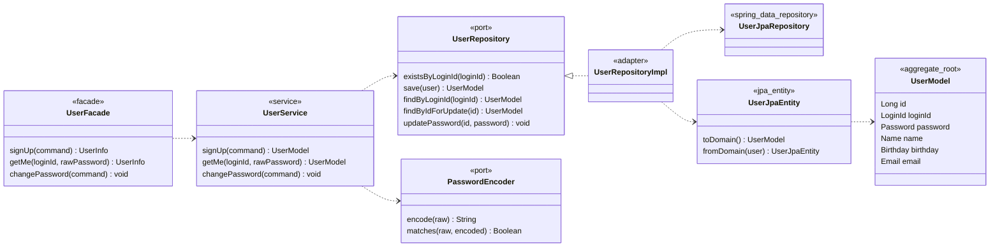

### Value Objects

| VO | 책임 | 제약사항 |
| --- | --- | --- |
| `LoginId` | 사용자 로그인 식별자 | 영문/숫자 4~20자, 시스템 전체 유일 |
| `Password` | 인증 비밀값 정책과 인코딩 결과 표현 | 8~16자, 문자종류 조건 충족, 생년월일 토큰 포함 불가, BCrypt 인코딩 보관 |
| `Name` | 사용자 이름 | 공백 제외 1~50자 |
| `Birthday` | 사용자 생년월일 | `LocalDate`, 과거 날짜만 허용 |
| `Email` | 사용자 이메일 주소 | RFC 5322 간이 형식 |

### 객체 책임/불변식

- `UserModel`은 사용자 식별자와 프로필 값을 VO로 보관하는 애그리거트 루트다.
- 현재 구현에서는 사용자 값 규칙을 VO가 보유하고, 회원가입/인증/비밀번호 변경 유스케이스 규칙은 `UserService`가 조합한다.
- `Password`는 생성 시점에 평문 정책을 검증한 뒤 인코딩된 문자열만 보관한다. 평문 비밀번호는 도메인 객체 상태로 남기지 않는다.
- 로그인 ID 유일성은 `UserRepository.existsByLoginId` 사전 검사와 DB unique constraint가 함께 보장한다.

해석:

- `UserModel`은 VO 를 필드로 갖는 순수 도메인 모델이다.
- `UserService`는 비밀번호 검증/변경과 회원가입 규칙을 수행하고, `UserRepository`와 `PasswordEncoder` port에만 의존한다.
- `UserJpaEntity`가 도메인 변환 책임을 가지며, 도메인 모델은 JPA를 알지 않는다.

## 2. User/Admin 식별 컨텍스트 목표 구조

관리자와 관리자 변경 로그는 사용자/관리자 식별 컨텍스트에 둔다.
관리자 변경 로그는 브랜드/상품 변경 작업만 기록하며 조회 작업은 기록하지 않는다.

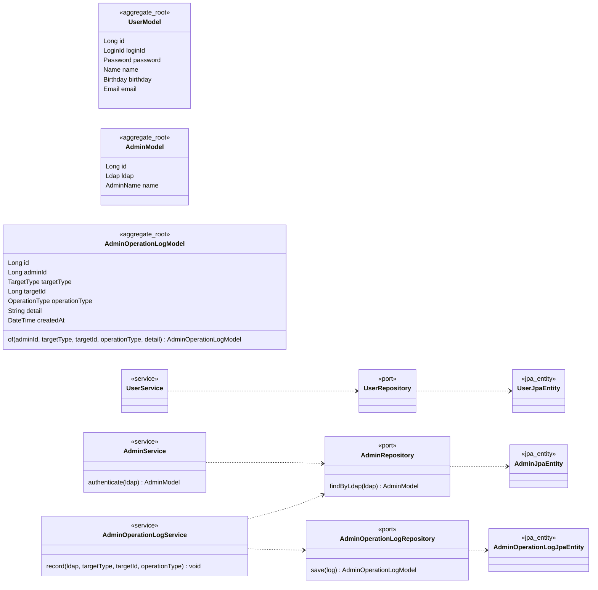

### Value Objects

| VO | 책임 | 제약사항 |
| --- | --- | --- |
| `Ldap` | 관리자 LDAP 식별자 | 시스템 전체 유일 |
| `AdminName` | 관리자 이름 | User `Name` 과 같은 규칙 |
| `TargetType` | 변경 대상 종류 | `BRAND` / `PRODUCT` 만 허용 |
| `OperationType` | 변경 종류 | `CREATED` / `UPDATED` / `DELETED` 만 허용 |

### 객체 책임/불변식

- `AdminModel`은 관리자 요청자의 식별 컨텍스트다. 관리자 권한은 `Ldap` 값으로 식별한다.
- `AdminOperationLogModel`은 브랜드/상품 변경 작업의 결과를 기록하는 독립 애그리거트다.
- `targetType`과 `targetId`는 다형 참조다. DB FK를 걸지 않는 대신, Facade가 변경 대상 존재 여부와 작업 성공 여부를 확인한 뒤 로그를 생성한다.
- 실패한 변경 요청이나 조회 작업은 성공 이력으로 기록하지 않는다.
- 조회 작업은 변경 로그 대상이 아니다. 변경 전/후 값 감사가 필요해지면 `detail`에 JSON/TEXT 스냅샷을 담는다.

해석:

- 관리자 인증은 `X-Loopers-Ldap` 헤더를 기준으로 수행한다.
- `AdminOperationLogModel.targetId`는 브랜드와 상품을 모두 가리키는 다형 대상이다. DB FK를 강제하지 않는다.
- 변경 전/후 값 감사가 필요해지면 `detail`을 JSON/TEXT 스냅샷으로 구체화한다.

## 3. Brand

브랜드는 상품의 소속 기준이다. 브랜드 삭제는 상품 soft delete cascade를 동반하므로 `BrandFacade`가 `ProductService`와 관리자 로그 서비스를 조합한다.

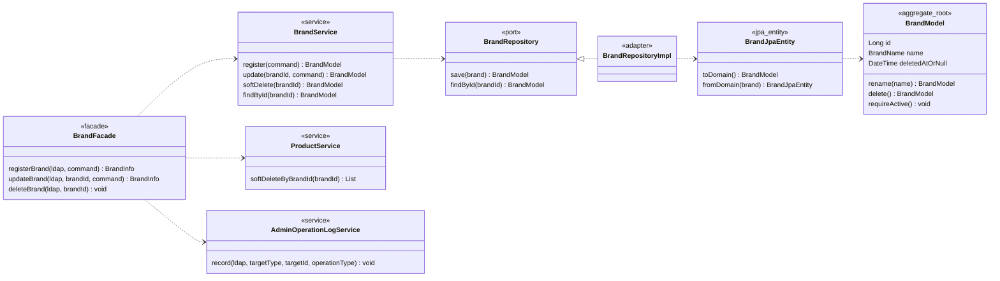

### Value Objects

| VO | 책임 | 제약사항 |
| --- | --- | --- |
| `BrandName` | 브랜드 이름 | 등록·수정 시 도메인 정책 검증 |

### 객체 책임/불변식

- `BrandModel`은 상품이 소속될 수 있는 카탈로그 기준이다.
- 삭제된 브랜드는 상품 등록/수정의 유효한 소속 대상이 될 수 없다.
- 브랜드 삭제는 브랜드 자신을 soft delete하고, `BrandFacade`가 소속 상품 soft delete와 관리자 변경 로그 기록을 같은 유스케이스로 묶는다.
- DB cascade가 아니라 애플리케이션 유스케이스가 소속 상품 삭제를 명시적으로 수행한다.

해석:

- 브랜드 등록/수정/삭제는 관리자 변경 로그 대상이다.
- 브랜드 삭제 시 DB cascade가 아니라 애플리케이션 유스케이스에서 소속 상품을 함께 soft delete한다.

## 4. Product

상품은 브랜드에 속하고, 재고는 상품 생명주기에 종속되는 부속 모델이다.
`StockModel`은 `updatedAt`/`deletedAt` 없이 현재 주문 가능 수량과 생성 시점만 가진다.

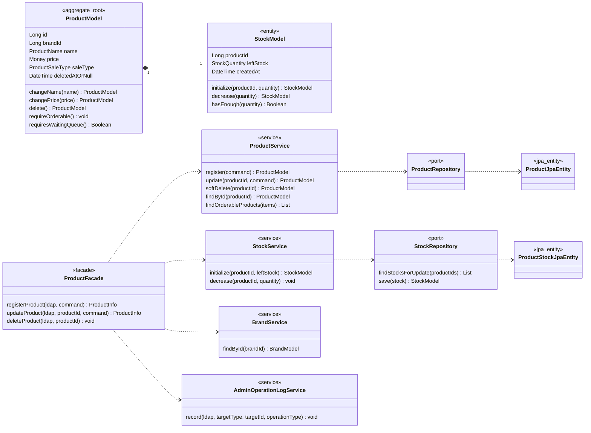

### Value Objects

| VO | 책임 | 제약사항 |
| --- | --- | --- |
| `ProductName` | 상품 이름 | 공백 문자열 불가 |
| `Money` | 가격 표현 — `OrderModel`/`OrderItemModel` 에서도 재사용 | 음수 불가, 단위 표준화 |
| `Quantity` | 주문 요청 수량 | 자연수만 허용 |
| `StockQuantity` | 재고 수량 | 0 이상 정수만 허용 |
| `ProductSaleType` | 대기열 적용 판매 유형 | `NORMAL`은 일반 주문, `LIMITED`는 선착순 주문 |

### 객체 책임/불변식

- `ProductModel`은 상품의 판매 정보와 삭제 상태를 보관하는 애그리거트 루트다.
- `brandId`는 다른 애그리거트인 브랜드를 ID로 참조한다. 브랜드 존재 검증은 `ProductFacade`가 `BrandService`를 통해 수행한다.
- 삭제된 상품은 주문 가능 상품으로 사용할 수 없다. `requireOrderable()`은 주문 생성 전 상품 상태 검증 지점이다.
- `ProductModel.requiresWaitingQueue()`는 `saleType == LIMITED`를 판별한다. 주문 항목 중 하나라도 참이면 주문 전체를 대기열 관문 대상으로 본다.
- `StockModel`은 상품 생명주기에 종속된 엔티티이며 재고 음수 방지 규칙을 직접 가진다.
- 재고 차감 책임은 `StockService`와 `StockModel.decrease`에 둔다. `ProductService`가 재고 저장소를 직접 다루지 않게 해 상품 정보 변경과 재고 변경 책임을 분리한다.

해석:

- 상품 등록은 `BrandService.findById`로 브랜드 존재를 먼저 검증한다.
- 재고 차감은 주문 유스케이스 트랜잭션 안에서 `StockService`를 통해 수행되어야 한다.
- 입고, 수동 보정, 재고 실사가 필요해지면 별도 `StockMovementModel`과 `stock_movements` 테이블을 추가한다.

## 5. Like

좋아요는 사용자와 상품 사이의 현재 상태다. 한 사용자와 한 상품 쌍은 하나의 좋아요만 가질 수 있다.

```mermaid
classDiagram
    direction LR

    class LikeModel {
        <<aggregate_root>>
        Long userId
        Long productId
        of(userId, productId) LikeModel
    }

    class LikeFacade {
        <<facade>>
        like(userId, productId) void
        unlike(userId, productId) void
    }

    class LikeService {
        <<service>>
        like(userId, productId) LikeModel
        unlike(userId, productId) void
        initializeCount(productId) void
        countByProductId(productId) Long
        countByProductIds(productIds) Map
    }

    class ProductService {
        <<service>>
        getById(productId) ProductModel
    }

    class LikeRepository {
        <<port>>
        save(like) Int
        delete(userId, productId) Int
    }

    class LikeRepositoryImpl {
        <<adapter>>
    }

    class LikeJpaEntity {
        <<jpa_entity>>
        LikeJpaId id
        ZonedDateTime createdAt
        toDomain() LikeModel
        fromDomain(like) LikeJpaEntity
    }

    class LikeJpaId {
        <<embeddable_id>>
        Long userId
        Long productId
    }

    class LikeJpaRepository {
        <<spring_data_repository>>
        insertIgnore(userId, productId) Int
        deleteByUserIdAndProductId(userId, productId) Int
    }

    class ProductLikeCountJpaEntity {
        <<jpa_entity>>
        Long productId
        Long likeCount
        Long salesCount
        Long viewCount
        ZonedDateTime? lastEventAt
        ZonedDateTime? lastLikeEventAt
        ZonedDateTime? lastSalesEventAt
        ZonedDateTime? lastViewEventAt
        ZonedDateTime updatedAt
        touch() void
    }

    class ApplicationEventPublisher {
        <<port>>
        publishEvent(event) void
    }

    class CommerceApplicationEventOutboxListener {
        <<listener>>
        onLikeChanged(event) void
        logLikeChanged(event) void
    }

    class OutboxRepository {
        <<port>>
        save(event) OutboxEventModel
    }

    class OutboxEventModel {
        <<outbox_event>>
        UUID eventId
        String type
        String aggregateType
        Long aggregateId
        String? topicName
        String? partitionKey
        String payload
        ZonedDateTime createdAt
    }

    class ProductMetricsKafkaEvent {
        <<consumer_event>>
        UUID eventId
        String eventType
        String? aggregateType
        Long? aggregateId
        String? payload
        String? createdAt
        Long? productId
        Long? userId
        Int? delta
    }

    class LikeChangedApplicationEvent {
        <<application_event>>
        Long productId
        Long userId
        Int delta
        ZonedDateTime occurredAt
    }

    class ProductLikeCountRepository {
        <<api_port>>
        create(productId) void
        countByProductId(productId) Long
        countByProductIds(productIds) Map
        rebuildFromLikes() void
        countProductRows() Long
        countLikeRows() Long
        countProjectionRows() Long
    }

    class ProductLikeCountProjectionRepository {
        <<streamer_projection_port>>
        applyDelta(productId, likeDelta, salesDelta, viewDelta, occurredAt) ProductMetricsUpdateStatus
    }

    class ProductLikeCountProjectionRepositoryImpl {
        <<streamer_adapter>>
        applyDelta(productId, likeDelta, salesDelta, viewDelta, occurredAt) ProductMetricsUpdateStatus
    }

    class ProductLikeCountJpaRepository {
        <<streamer_spring_data_repository>>
        applyDelta(productId, likeDelta, salesDelta, viewDelta, occurredAt) Int
        insertDeltaIfAbsent(productId, likeDelta, salesDelta, viewDelta, occurredAt) Int
    }

    class ProductMetricsUpdateStatus {
        <<enum>>
        APPLIED
        INVALID
    }

    class ProductMetricsDelta {
        <<application_dto>>
        Long productId
        Int likeDelta
        Long salesDelta
        Int viewDelta
    }

    class ProductMetricsProjectionCommand {
        <<application_command>>
        UUID eventId
        String consumerGroup
        String eventType
        ZonedDateTime occurredAt
        List~ProductMetricsDelta~ deltas
    }

    class LikeCountEventConsumer {
        <<streamer_consumer>>
        consume(event, acknowledgment) void
    }

    class ProductMetricsProjectionService {
        <<projection_service>>
        project(command) ProductMetricsProjectionResult
    }

    class ProcessedKafkaEventRepository {
        <<dedupe_port>>
        recordIfAbsent(eventId, consumerGroup, eventType) Boolean
    }

    LikeFacade ..> ProductService
    LikeFacade ..> LikeService
    LikeService ..> LikeRepository
    LikeService ..> ProductLikeCountRepository
    LikeService ..> ApplicationEventPublisher
    ApplicationEventPublisher ..> LikeChangedApplicationEvent
    CommerceApplicationEventOutboxListener ..> LikeChangedApplicationEvent
    CommerceApplicationEventOutboxListener ..> OutboxRepository
    OutboxRepository ..> OutboxEventModel
    LikeCountEventConsumer ..> ProductMetricsKafkaEvent
    LikeCountEventConsumer ..> ProductMetricsProjectionCommand
    ProductMetricsProjectionCommand *-- ProductMetricsDelta
    LikeCountEventConsumer ..> ProductMetricsProjectionService
    ProductMetricsProjectionService ..> ProductLikeCountProjectionRepository
    ProductMetricsProjectionService ..> ProcessedKafkaEventRepository
    ProductLikeCountProjectionRepository <|.. ProductLikeCountProjectionRepositoryImpl
    ProductLikeCountProjectionRepositoryImpl ..> ProductLikeCountJpaRepository
    ProductLikeCountJpaRepository ..> ProductLikeCountJpaEntity
    ProductLikeCountProjectionRepository ..> ProductMetricsUpdateStatus
    LikeRepository <|.. LikeRepositoryImpl
    LikeRepositoryImpl ..> LikeJpaRepository
    LikeJpaRepository ..> LikeJpaEntity
    LikeJpaEntity *-- LikeJpaId
    LikeJpaEntity ..> LikeModel
```

### Value Objects

`LikeModel`에는 별도 값 객체가 없다. `userId`와 `productId`를 양수 식별자로 검증하고, 영속성에서는 `LikeJpaId`가 두 값을 복합 키로 묶는다.

### 객체 책임/불변식

- `LikeModel`은 사용자와 상품 사이의 현재 관심 상태를 나타내는 관계 애그리거트다.
- 좋아요는 이력보다 현재 상태가 중요하므로 취소 시 hard delete를 기본으로 한다.
- 같은 `(userId, productId)` 쌍은 하나만 존재할 수 있다. `LikeService`는 `LikeRepository.save/delete`의 변경 행 수를 기준으로 실제 상태 전이만 구분하고, DB 복합 PK가 최종 중복을 막는다.
- `LikeModel`은 `UserModel`이나 `ProductModel` 객체를 직접 들고 있지 않는다. 다른 애그리거트와는 식별자로만 연결한다.
- `LikeService`는 `likes` INSERT/DELETE가 실제 상태 전이를 만들 때만 `LikeChangedApplicationEvent`를 발행한다. `CommerceApplicationEventOutboxListener`가 `BEFORE_COMMIT`에서 같은 트랜잭션에 `LIKE_COUNT_CHANGED_V1` outbox row를 저장하며 UUID `eventId`, `productId`, `userId`, `delta=+1/-1`, topic=`catalog-events`, partitionKey=`productId`를 고정한다. 이미 좋아요가 있거나 이미 취소된 멱등 no-op 요청은 이벤트를 만들지 않는다.
- `product_metrics`는 별도 도메인 모델 없이 API와 streamer의 `ProductLikeCountJpaEntity`가 같은 컬럼을 매핑한다. 이 projection은 `likeCount`/`salesCount`/`viewCount`, 전체·원천별 마지막 이벤트 시각, 갱신 시각을 보관한다.
- `LikeCountEventConsumer`는 `LIKE_COUNT_CHANGED_V1`, `ORDER_PAID_V1`, `PRODUCT_VIEWED_V1`을 `ProductMetricsDelta` 목록으로 변환한다. `ProductMetricsProjectionService`는 `ProcessedKafkaEventRepository.recordIfAbsent`로 중복을 거른 뒤 상품 ID 순서로 `ProductLikeCountProjectionRepository.applyDelta`를 호출한다.
- `OutboxRelay`는 짧은 claim 트랜잭션, DB 트랜잭션 밖 Kafka 발행, 짧은 결과 트랜잭션을 분리한다. 현재 claim id 소유자만 완료할 수 있고, 최초 시도를 포함한 5번째 실패는 `OutboxEventStatus.DEAD`와 마지막 오류를 남겨 자동 재발행을 끝낸다.
- `KafkaConfig`는 일반 JSON producer template과 DLT 전용 byte-array template을 분리한다. `DeadLetterPublishingRecoverer`는 후자를 사용해 consumer record의 value bytes를 그대로 실패 주제로 전달한다.
- API의 `ProductLikeCountRepository`는 상품 생성 시 projection 행 생성, 좋아요 수 단건·일괄 조회, `likes` 원천 기준 좋아요 수 재구성과 정합성 진단용 row count를 담당한다. streamer의 `ProductLikeCountProjectionRepository`는 좋아요·판매·조회 delta를 한 번의 `applyDelta` 계약으로 받는다. adapter는 update, insert-if-absent, update 재시도 순으로 동시 생성을 수렴시키고 합계가 음수가 되는 갱신은 `INVALID`로 거부한다.
- projection lag가 있을 수 있으므로 상품 조회(`ProductFacade`)의 지표는 짧은 지연을 허용한다. 좋아요 수 장기 불일치는 `rebuildFromLikes`, 전체 이벤트 지표 불일치는 Kafka replay를 기준으로 보정한다.

해석:

- `POST`는 이미 존재하면 그대로 성공하고, 없으면 생성한다.
- `DELETE`는 이미 없더라도 삭제 완료 상태로 보고 성공한다.
- 사용자나 상품에서 likes 컬렉션을 양방향 매핑하지 않는다. 현재 공개 흐름은 `LikeFacade.like/unlike`만 제공한다.

## 6. Order

주문은 주문자와 하나 이상의 주문 항목을 가진다.
주문 항목은 주문 당시 상품명과 단가를 스냅샷으로 보관한다.

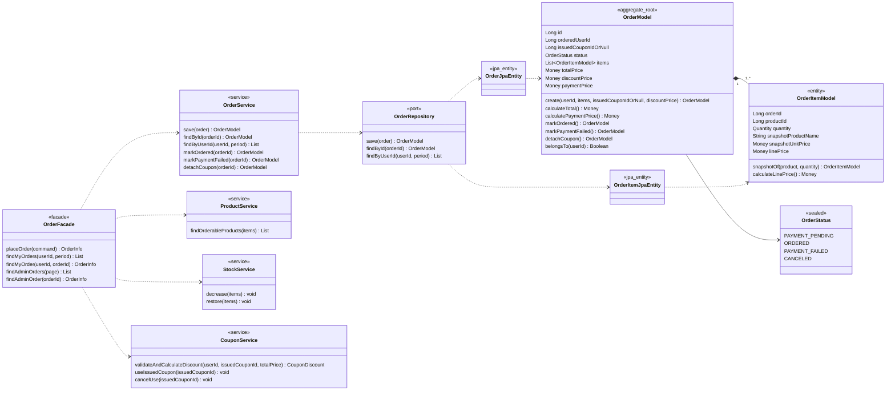

### Value Objects

| VO | 책임 | 제약사항 |
| --- | --- | --- |
| `Money` | 주문 합계·할인·결제 금액과 주문 항목 단가 표현 | Product §4 와 동일 VO, 원 단위 정수 표현, 음수 불가, 결제 금액은 0 이상 |
| `Quantity` | 주문 항목 수량 | 양수만 허용 |
| `OrderStatus` | 주문 상태 전이 표현 | `PAYMENT_PENDING`에서 `ORDERED` 또는 `PAYMENT_FAILED`로만 전이, `CANCELED`는 확장 후보 |

### 객체 책임/불변식

- `OrderModel`은 주문자와 주문 항목 목록을 일관성 경계로 묶는 애그리거트 루트다.
- 주문은 항목을 1개 이상 가져야 하며, 총액은 항목별 `linePrice` 합계로 계산한다.
- `OrderModel.create()`는 주문을 항상 `PAYMENT_PENDING` 상태로 생성한다.
- 주문 상태 전이는 sealed/FSM으로 통제한다. 현재 허용되는 전이는 `PAYMENT_PENDING -> ORDERED`, `PAYMENT_PENDING -> PAYMENT_FAILED`뿐이다.
- `markPaymentFailed()`는 현재 상태가 `PAYMENT_PENDING`일 때만 성공한다. 이 상태 가드가 중복 콜백이나 회복 프로세스의 이중 보상을 막는다.
- `issuedCouponIdOrNull`은 주문에 실제 적용된 발급 쿠폰 식별자 스냅샷이다. 쿠폰 정책 전체를 주문이 직접 참조하지 않는다.
- `discountPrice`는 주문 생성 시점에 확정된 할인 금액이다. 이후 쿠폰 템플릿이 수정되거나 삭제되어도 과거 주문 금액은 바뀌지 않는다.
- 결제 실패 보상 후 `issuedCouponIdOrNull`은 `NULL`로 분리될 수 있다. 이때 `discountPrice`는 실패 주문 시도 당시 할인 계산 스냅샷으로 유지한다.
- `OrderItemModel`은 주문 시점 상품명과 단가를 스냅샷으로 보관한다. 이후 상품명/가격이 바뀌어도 과거 주문 항목 값은 바뀌지 않는다.
- 본인 주문 조회 검증은 `OrderModel.belongsTo(userId)` 같은 도메인 행위로 표현한다. 외부 응답은 자원 존재 노출을 피하기 위해 정책에 맞는 상태로 변환한다.
- 주문 생성 유스케이스는 `OrderFacade`가 상품 주문 가능성 조회, 쿠폰 검증·할인 계산, 재고 차감, 주문 저장을 조합한다. 결제 기록과 외부 결제 호출은 `OrderFacade` 책임이 아니다.
- 결제 결과에 따른 주문 전이는 `PaymentResultHandler`가 `PaymentOrderPort`를 통해 요청한다. 실패 시 `PaymentCompensationPort`가 재고와 쿠폰을 복구하고, `PaymentOrderPort`가 주문의 쿠폰 연결을 해제한다.

해석:

- 주문 생성(`PAYMENT_PENDING`), 재고 차감, 쿠폰 사용 처리는 주문 트랜잭션으로 묶는다. 결제 요청 기록과 결과 반영은 §8의 별도 경계를 따른다.
- 재고 부족 시 `409 Conflict`로 전체 주문을 거부하고, 어떤 항목도 차감하지 않는다.
- 쿠폰 사용 조건 불일치나 동시 사용 경쟁이 발생하면 `409 Conflict`로 전체 주문을 거부하고, 재고와 주문 저장은 함께 rollback한다.
- 결제 승인 시 주문은 `ORDERED`, 결제 실패 보상 완료 시 주문은 `PAYMENT_FAILED`가 된다.

## 7. Coupon

쿠폰은 관리자 정의인 `CouponTemplateModel`과 사용자 보유 상태인 `IssuedCouponModel`로 분리한다.
할인 계산은 쿠폰 템플릿의 도메인 행위로 두고, 주문은 확정된 할인 금액과 발급 쿠폰 식별자만 스냅샷으로 보관한다.

```mermaid
classDiagram
    direction LR

    class CouponTemplateModel {
        <<aggregate_root>>
        Long id
        CouponName name
        DiscountPolicy discountPolicy
        Money minOrderAmount
        LocalDateTime expiredAt
        Long totalQuantity
        Long issuedQuantity
        LocalDateTime? deletedAt
        calculateDiscount(totalPrice) Money
        requireIssuable(now) void
        requireUsable(totalPrice, now) void
        changePolicy(name, discountPolicy, minOrderAmount, expiredAt, totalQuantity) CouponTemplateModel
        increaseIssuedQuantity(now) CouponTemplateModel
        delete(now) CouponTemplateModel
        withId(id) CouponTemplateModel
    }

    class IssuedCouponModel {
        <<aggregate_root>>
        Long id
        Long couponTemplateId
        Long userId
        IssuedCouponStatus status
        LocalDateTime issuedAt
        LocalDateTime? usedAt
        issue(userId, couponTemplateId, now) IssuedCouponModel
        withId(id) IssuedCouponModel
        requireOwnedBy(userId) void
        requireAvailable() void
        use(now) IssuedCouponModel
        revertUse() IssuedCouponModel
        displayStatus(expiredAt, now) IssuedCouponDisplayStatus
    }

    class CouponIssueRequestModel {
        <<aggregate_root>>
        Long id
        UUID requestId
        Long couponTemplateId
        Long userId
        CouponIssueRequestStatus status
        Long? issuedCouponId
        String? failureReason
        ZonedDateTime requestedAt
        ZonedDateTime? completedAt
        markIssued(issuedCouponId, now) CouponIssueRequestModel
        markDuplicate(now) CouponIssueRequestModel
        markSoldOut(reason, now) CouponIssueRequestModel
        markFailed(reason, now) CouponIssueRequestModel
    }

    class CouponIssueRequestStatus {
        <<enum>>
        PENDING
        ISSUED
        DUPLICATE
        SOLD_OUT
        FAILED
    }

    class DiscountPolicy {
        <<sealed>>
        CouponType couponType
        calculate(totalPrice) Money
    }

    class FixedAmountDiscountPolicy {
        <<value_object>>
        Money amount
        calculate(totalPrice) Money
    }

    class PercentageDiscountPolicy {
        <<value_object>>
        Int percent
        calculate(totalPrice) Money
    }

    class CouponFacade {
        <<facade>>
        createTemplate(command) CouponTemplateInfo
        updateTemplate(templateId, command) CouponTemplateInfo
        deleteTemplate(templateId) void
        findTemplates(page, size) PageResult
        findTemplate(templateId) CouponTemplateInfo
        issue(userId, templateId) IssuedCouponInfo
        requestIssue(userId, templateId) CouponIssueRequestInfo
        findIssueRequest(userId, requestId) CouponIssueRequestInfo
        findMyCoupons(userId) List
        findIssuedCouponsByTemplate(templateId, page, size) PageResult
    }

    class CouponService {
        <<service>>
        createTemplate(command) CouponTemplateModel
        updateTemplate(templateId, command) CouponTemplateModel
        softDeleteTemplate(templateId) CouponTemplateModel
        issue(userId, templateId) IssuedCouponModel
        getTemplate(templateId) CouponTemplateModel
        getTemplatesByIds(templateIds) List
        findTemplates(page, size) PageResult
        findMyCoupons(userId) List
        findIssuedCouponsByTemplate(templateId, page, size) PageResult
        validateAndCalculateDiscount(userId, issuedCouponId, totalPrice) Money
        useIssuedCoupon(issuedCouponId) IssuedCouponModel
        cancelUse(issuedCouponId) IssuedCouponModel
    }

    class CouponIssueRequestService {
        <<service>>
        requestIssue(userId, couponTemplateId) CouponIssueRequestModel
        getRequest(userId, requestId) CouponIssueRequestModel
    }

    class CouponIssueRequestConsumer {
        <<consumer>>
        consume(event, acknowledgment) void
    }

    class CouponIssueRequestWorker {
        <<worker>>
        process(eventId, consumerGroup, eventType, requestId) CouponIssueRequestStatus
    }

    class CouponTemplateRepository {
        <<port>>
        save(template) CouponTemplateModel
        findByIdOrNull(templateId) CouponTemplateModel?
        findByIdForUpdateOrNull(templateId) CouponTemplateModel?
        findAllByIds(templateIds) List
        findAll(page, size) PageResult
    }

    class IssuedCouponRepository {
        <<port>>
        save(issuedCoupon) IssuedCouponModel
        existsByUserIdAndTemplateId(userId, templateId) Boolean
        findByIdOrNull(issuedCouponId) IssuedCouponModel?
        findByUserId(userId) List
        findByTemplateId(templateId, page, size) PageResult
    }

    class CouponIssueRequestRepository {
        <<port>>
        save(request) CouponIssueRequestModel
        insertIfAbsent(request) Int
        findByRequestIdOrNull(requestId) CouponIssueRequestModel?
        findByRequestIdAndUserIdOrNull(requestId, userId) CouponIssueRequestModel?
        findByRequestIdForUpdateOrNull(requestId) CouponIssueRequestModel?
        findByUserIdAndCouponTemplateIdOrNull(userId, couponTemplateId) CouponIssueRequestModel?
    }

    class CouponIssueRequestKafkaEvent {
        <<event>>
        UUID eventId
        String eventType
        String aggregateType
        Long aggregateId
        String payload
    }

    class CouponIssueRequestedApplicationEvent {
        <<application_event>>
        UUID requestId
        Long requestAggregateId
        Long couponTemplateId
        Long userId
        ZonedDateTime occurredAt
    }

    class CouponIssueEventHandledRepository {
        <<dedupe_port>>
        recordIfAbsent(eventId, consumerGroup, eventType) Boolean
        exists(eventId, consumerGroup) Boolean
    }

    class CouponTemplateJpaEntity {
        <<jpa_entity>>
        String couponName
        String couponType
        Long discountValue
        Long minOrderAmount
        LocalDateTime expiredAt
        Long totalQuantity
        Long issuedQuantity
        updateFrom(template) void
        toDomain() CouponTemplateModel
        fromDomain(template) CouponTemplateJpaEntity
    }

    class CouponTemplateRepositoryImpl {
        <<adapter>>
    }

    class CouponTemplateJpaRepository {
        <<spring_data_repository>>
        findWithLockById(id) CouponTemplateJpaEntity?
    }

    class IssuedCouponJpaEntity {
        <<jpa_entity>>
        Long version
    }

    class CouponIssueRequestJpaEntity {
        <<jpa_entity>>
    }

    class IssuedCouponRepositoryImpl {
        <<adapter>>
    }

    class CouponIssueRequestRepositoryImpl {
        <<adapter>>
    }

    class CommerceApplicationEventOutboxListener {
        <<listener>>
        onCouponIssueRequested(event) void
        logCouponIssueRequested(event) void
    }

    class OutboxRepository {
        <<port>>
        save(event) OutboxEventModel
    }

    CouponTemplateModel --> DiscountPolicy
    DiscountPolicy <|.. FixedAmountDiscountPolicy
    DiscountPolicy <|.. PercentageDiscountPolicy
    CouponIssueRequestModel --> CouponIssueRequestStatus
    CouponFacade ..> CouponService
    CouponFacade ..> CouponIssueRequestService
    CouponIssueRequestService ..> CouponTemplateRepository
    CouponIssueRequestService ..> CouponIssueRequestRepository
    CouponIssueRequestService ..> ApplicationEventPublisher
    ApplicationEventPublisher ..> CouponIssueRequestedApplicationEvent
    CommerceApplicationEventOutboxListener ..> CouponIssueRequestedApplicationEvent
    CommerceApplicationEventOutboxListener ..> OutboxRepository
    CouponService ..> CouponTemplateRepository
    CouponService ..> IssuedCouponRepository
    CouponIssueRequestConsumer ..> CouponIssueRequestKafkaEvent
    CouponIssueRequestConsumer ..> CouponIssueRequestWorker
    CouponIssueRequestWorker ..> CouponService
    CouponIssueRequestWorker ..> CouponIssueRequestRepository
    CouponIssueRequestWorker ..> CouponIssueEventHandledRepository
    CouponTemplateRepository <|.. CouponTemplateRepositoryImpl
    CouponTemplateRepositoryImpl ..> CouponTemplateJpaRepository
    CouponTemplateRepositoryImpl ..> CouponTemplateJpaEntity
    IssuedCouponRepository <|.. IssuedCouponRepositoryImpl
    IssuedCouponRepositoryImpl ..> IssuedCouponJpaEntity
    CouponIssueRequestRepository <|.. CouponIssueRequestRepositoryImpl
    CouponIssueRequestRepositoryImpl ..> CouponIssueRequestJpaEntity
    CouponTemplateJpaEntity ..> CouponTemplateModel
    IssuedCouponJpaEntity ..> IssuedCouponModel
    CouponIssueRequestJpaEntity ..> CouponIssueRequestModel
```

### Value Objects

| VO | 책임 | 제약사항 |
| --- | --- | --- |
| `CouponName` | 쿠폰 템플릿 이름 | 공백 문자열 불가 |
| `DiscountPolicy` | 할인 계산 전략 | sealed 전략. `FixedAmount` / `Percentage` 구현체만 허용 |
| `FixedAmountDiscountPolicy` | 정액 할인 계산 | 원 단위 양수 금액 |
| `PercentageDiscountPolicy` | 정률 할인 계산 | 1~100 정수 퍼센트, `BigDecimal` 중간 계산 후 `RoundingMode.FLOOR`로 원 단위 정수화 |
| `IssuedCouponStatus` | 저장 상태 | `AVAILABLE` / `USED` |
| `IssuedCouponDisplayStatus` | 조회 표시 상태 | `AVAILABLE` / `USED` / `EXPIRED`, `EXPIRED`는 저장하지 않고 계산 |
| `CouponIssueRequestStatus` | 비동기 발급 요청 상태 | `PENDING` / `ISSUED` / `DUPLICATE` / `SOLD_OUT` / `FAILED` |
| `Money` | 최소 주문 금액과 할인 금액 | 원 단위 정수 표현, 음수 불가, 할인 금액은 주문 총액을 초과할 수 없음 |

### 객체 책임/불변식

- `CouponTemplateModel`은 쿠폰 정책의 기준이다. 할인 전략, 최소 주문 금액, 만료 시각, 삭제 상태를 가진다.
- `CouponTemplateModel.totalQuantity`/`issuedQuantity`는 선착순 발급 수량을 표현한다. `increaseIssuedQuantity(now)`가 삭제·만료·소진 여부를 검증하고 발급 수량을 1 증가시킨다. `CouponService.issue`는 `CouponTemplateRepository.findByIdForUpdateOrNull`로 템플릿 행을 비관적 잠금 조회한 뒤 증가된 모델을 저장하므로 `issuedQuantity`가 `totalQuantity`를 초과하지 않는다.
- `CouponTemplateModel.calculateDiscount(totalPrice)`는 `DiscountPolicy.calculate(totalPrice)`에 계산을 위임하고, 할인 금액이 주문 총액을 넘지 않도록 제한한다.
- 영속성의 `coupon_type + discount_value`는 `CouponTemplateJpaEntity.toDomain()`에서 `FixedAmountDiscountPolicy` 또는 `PercentageDiscountPolicy`로 변환한다. JPA 상속 매핑은 사용하지 않는다.
- `IssuedCouponModel`은 사용자에게 발급된 쿠폰의 현재 상태다. 한 발급 쿠폰은 한 번만 `USED`로 전환될 수 있다.
- 결제 실패 보상에서는 `IssuedCouponModel.revertUse()`로 `USED` 상태를 `AVAILABLE`로 되돌린다.
- 한 사용자와 한 쿠폰 템플릿 조합은 하나의 `IssuedCouponModel`만 가질 수 있다. 애플리케이션 사전 검사와 DB unique 제약으로 함께 보장한다.
- `CouponIssueRequestModel`은 발급 요청 접수와 실제 발급 완료 사이의 비동기 상태를 보관한다. API는 `PENDING` 요청을 반환하고, `CouponIssueRequestConsumer`가 `coupon-issue-requests` 이벤트를 받아 `CouponIssueRequestWorker`에 처리를 위임한다.
- `CouponIssueRequestWorker`는 event id 처리 이력을 먼저 남긴 뒤 요청 상태를 잠금 조회하고, `CouponService.issue`에 템플릿 수량 증가와 `IssuedCouponModel` 생성을 위임한다. 이 변경들은 같은 worker 트랜잭션에서 커밋되며, Kafka 재전달이나 같은 사용자 중복 요청은 `DUPLICATE` 또는 기존 요청 반환으로 멱등하게 끝난다.
- 쿠폰 사용 검증과 `USED` 전환은 주문 트랜잭션 안에서 사용 가능(`AVAILABLE`) 상태를 검증한 뒤 수행하며, `version` 낙관적 락으로 동시 사용 시 lost update를 감지해 한 주문만 성공시킨다. 비관적 잠금 조회(`findByIdForUpdate`)는 사용하지 않는다.
- `EXPIRED`는 저장 상태가 아니라 `expiredAt`과 현재 시각을 기준으로 응답 모델에서 계산한다.

해석:

- 쿠폰 템플릿 수정·삭제는 이미 생성된 주문의 `discountPrice`를 변경하지 않는다.
- 쿠폰 발급 요청 접수는 `CouponIssueRequestService`의 `READ_COMMITTED` 트랜잭션이다. 템플릿을 잠그지 않고 `(user_id, coupon_template_id)` unique 제약과 `INSERT IGNORE` affected rows로 동시 요청을 하나의 row로 수렴시킨다. 새 row를 삽입한 호출만 `CouponIssueRequestedApplicationEvent`를 발행하고, `CommerceApplicationEventOutboxListener`가 `BEFORE_COMMIT`에서 같은 트랜잭션에 outbox row를 저장한다. 실제 발급과 템플릿 잠금은 `CouponIssueRequestWorker`가 호출하는 `CouponService.issue`의 worker 트랜잭션에서 수행한다.
- 쿠폰 적용 주문은 `OrderFacade`가 `CouponService`를 호출해 검증·할인 계산·사용 처리를 주문 트랜잭션에 포함한다.
- 쿠폰 사용 복구는 `PaymentResultHandler.fail`의 결과 트랜잭션에서 `PaymentCompensationPort` 구현을 통해 `CouponService.cancelUse(issuedCouponId)`로 수행한다.
- 발급 가능한 쿠폰 목록 조회는 원문 필수 API가 아니므로 기본 클래스 책임에서 제외하고, 필요 시 선택 확장으로 추가한다.

## 8. Payment

결제는 주문과 연결된 지불 시도와 결과를 기록한다.
현재는 주문당 최대 하나의 결제 기록을 두고, 주문 생성과 별도인 결제 요청 API가 기록을 만든다.

```mermaid
classDiagram
    direction LR

    class PaymentModel {
        <<aggregate_root>>
        Long id
        Long orderId
        String externalTransactionKeyOrNull
        PaymentStatus status
        String failureReasonOrNull
        ZonedDateTime requestedAt
        ZonedDateTime completedAtOrNull
        request(orderId) PaymentModel
        assignTransactionKey(externalTransactionKey) PaymentModel
        markUnknown(reason) PaymentModel
        approve(externalTransactionKey, completedAt) PaymentModel
        fail(reason, completedAt) PaymentModel
    }

    class PaymentStatus {
        <<enumeration>>
        REQUESTED = 10
        UNKNOWN = 15
        APPROVED = 20
        FAILED = 30
        markUnknown() PaymentStatus
        approve() PaymentStatus
        fail() PaymentStatus
        isCompleted() Boolean
    }

    class PaymentFacade {
        <<facade>>
        request(command) PaymentInfo
        handleCallback(command) PaymentInfo
        recoverUnknownPayments() PaymentRecoveryResult
        consumeResultEvents() Int
    }

    class PaymentResultHandler {
        <<transactional_component>>
        approve(transactionKey) PaymentInfo
        fail(transactionKey, reason) PaymentInfo
    }

    class PaymentService {
        <<service>>
        request(orderId) PaymentModel
        assignTransactionKey(orderId, transactionKey) PaymentModel
        markUnknown(orderId, reason) PaymentModel
        approveByTransactionKey(transactionKey) PaymentTransitionResult
        failByTransactionKey(transactionKey, reason) PaymentTransitionResult
        getById(paymentId) PaymentModel
        getByTransactionKey(transactionKey) PaymentModel
        findPendingSyncEvents() List
        markEventProcessed(eventId) void
        consumeResultEvents() Int
    }

    class PaymentRepository {
        <<port>>
        save(payment) PaymentModel
        findByIdOrNull(paymentId) PaymentModel
        findByOrderIdOrNull(orderId) PaymentModel
        findByOrderIdForUpdateOrNull(orderId) PaymentModel
        findByExternalTransactionKeyOrNull(key) PaymentModel
        findByExternalTransactionKeyForUpdateOrNull(key) PaymentModel
    }

    class PaymentGatewayPort {
        <<port>>
        request(request) PaymentGatewayResult
        getTransaction(userId, transactionKey) PaymentGatewayResult
        findByOrderId(userId, orderId) List
    }

    class PaymentOrderPort {
        <<port>>
        getPayableOrder(userId, orderId) OrderModel
        getPendingOrder(orderId) OrderModel
        markOrdered(orderId) void
        markPaymentFailed(orderId) void
        detachCoupon(orderId) void
    }

    class PaymentCompensationPort {
        <<port>>
        restore(order) void
    }

    class PaymentRepositoryImpl {
        <<adapter>>
    }

    class PaymentRecordJpaEntity {
        <<jpa_entity>>
        Long paymentRecordId
        Long orderId
        String externalTransactionKeyOrNull
        PaymentStatus status
        String failureReasonOrNull
        ZonedDateTime requestedAt
        ZonedDateTime completedAtOrNull
    }

    class OutboxRepository {
        <<port>>
        save(event) OutboxEventModel
        findPendingByType(type) List
        markInternalProcessed(eventId, processedAt) void
    }

    class PaymentApprovedApplicationEvent {
        <<application_event>>
        Long paymentId
        Long orderId
        List items
        ZonedDateTime occurredAt
    }

    class PaymentFailedApplicationEvent {
        <<application_event>>
        Long paymentId
        Long orderId
        ZonedDateTime occurredAt
    }

    class CommerceApplicationEventOutboxListener {
        <<transactional_event_listener>>
        onPaymentApproved(event) void
        onPaymentFailed(event) void
    }

    PaymentModel --> PaymentStatus
    PaymentFacade ..> PaymentService
    PaymentFacade ..> PaymentGatewayPort
    PaymentFacade ..> PaymentOrderPort
    PaymentFacade ..> PaymentResultHandler
    PaymentResultHandler ..> PaymentService
    PaymentResultHandler ..> PaymentOrderPort
    PaymentResultHandler ..> PaymentCompensationPort
    PaymentResultHandler ..> PaymentApprovedApplicationEvent
    PaymentResultHandler ..> PaymentFailedApplicationEvent
    PaymentService ..> PaymentRepository
    PaymentService ..> OutboxRepository
    PaymentRepository <|.. PaymentRepositoryImpl
    PaymentRepositoryImpl ..> PaymentRecordJpaEntity
    PaymentRecordJpaEntity ..> PaymentModel
    CommerceApplicationEventOutboxListener ..> PaymentApprovedApplicationEvent
    CommerceApplicationEventOutboxListener ..> PaymentFailedApplicationEvent
    CommerceApplicationEventOutboxListener ..> OutboxRepository
```

### 도메인 값

| 값 | 책임 | 제약사항 |
| --- | --- | --- |
| `PaymentStatus` | 결제 상태와 허용 전이 표현 | `REQUESTED -> UNKNOWN/APPROVED/FAILED`, `UNKNOWN -> APPROVED/FAILED`만 허용. `APPROVED`, `FAILED`는 완료 상태 |
| `externalTransactionKey` | 외부 거래 식별 | 공백 불가, 한 번 배정하면 다른 값으로 변경 불가, DB에서 고유 |
| `requestedAt` / `completedAt` | 요청과 완료 시각 | 완료 상태에만 `completedAt` 필수, 미완료 상태에는 `completedAt` 금지 |

### 객체 책임/불변식

- `PaymentModel`은 주문 ID, 외부 거래 키, 상태, 실패 사유, 요청·완료 시각을 보관한다. 결제 수단과 금액은 외부 요청에만 쓰며 모델에 중복 저장하지 않는다.
- 하나의 주문은 최대 하나의 결제 기록을 가진다. `payment_records.order_id` 고유 제약으로 보장한다.
- `PaymentFacade`는 결제 가능 주문 확인, 외부 결제 요청, 콜백 해석, `UNKNOWN` 회복 흐름을 조정한다. 외부 결제 호출을 포함하므로 DB 트랜잭션을 갖지 않는다.
- `PaymentService`는 결제 기록 단일 상태 변경과 결제용 내부 outbox 저장을 담당한다. 요청·거래 키 배정·상태 불명·완료 전이는 각각의 트랜잭션이며, 주문 ID 또는 외부 거래 키 잠금 조회로 경합을 직렬화한다.
- `PaymentResultHandler`는 확정 결과를 여러 도메인에 반영하는 트랜잭션 경계다. 승인에서는 결제 `APPROVED`, 내부 `PAYMENT_APPROVED`, 주문 `ORDERED`를 묶고, 실패에서는 결제 `FAILED`, 내부 `PAYMENT_FAILED`, 주문 실패 전이, 재고·쿠폰 복구, 주문-쿠폰 연결 해제를 묶는다.
- 최초 완료 전이에서만 `PaymentTransitionResult.changed=true`를 반환한다. 중복된 같은 결과는 주문 전이·보상·이벤트 생성을 반복하지 않고, 서로 다른 완료 상태로의 전이는 거부한다.
- `PaymentApprovedApplicationEvent`는 주문 항목의 상품 ID와 수량 사실을 함께 담아 listener나 relay가 결제·주문 도메인을 다시 조회하지 않게 한다. `PaymentFailedApplicationEvent`는 결제 ID와 주문 ID를 담는다.
- 결제 결과 트랜잭션의 `BEFORE_COMMIT` listener는 외부 발행 원천인 `ORDER_PAID_V1` 또는 `ORDER_FAILED_V1` outbox를 저장한다. 내부 `PAYMENT_APPROVED`/`PAYMENT_FAILED`는 topic/key가 없는 처리 기록이며 Kafka 발행 대상이 아니다.
- 외부 사건 발행의 단일 원천은 topic, partition key, payload가 고정된 `outbox_events` 행이다. relay는 결제나 주문을 재조회하지 않고 이 저장값을 그대로 발행한다.
- 외부 결과 미확정은 `UNKNOWN`과 route가 없는 `PAYMENT_STATUS_SYNC_REQUESTED`를 같은 트랜잭션에 저장한다. 회복은 이 내부 기록을 조회하고, 거래 키가 없을 수 있으므로 주문 ID로 외부 상태를 확인한 뒤 결과 처리와 내부 기록 완료를 수행한다.

해석:

- `PaymentGatewayPort`는 외부 결제 시스템을 추상화한다.
- `PaymentOrderPort`와 `PaymentCompensationPort`는 결제 애플리케이션이 주문·재고·쿠폰 구현에 직접 의존하지 않게 한다.
- 결제 기록은 결제 수단 자체의 상세 모델이 아니라 주문별 결제 상태를 남기기 위한 원장이다. 다중 결제 시도 이력이 필요해지면 주문과 결제를 1:N으로 확장한다.

## 9. 공유 API 인프라

이 절은 도메인 객체 설계의 핵심은 아니지만, 도메인/애플리케이션 실패가 API 응답으로 변환되는 경계를 확인하기 위한 부록이다.
API 예외 응답은 `CoreException`과 API 경계까지 전파된 도메인 예외를 `ApiControllerAdvice`가 변환한다. 애플리케이션 서비스 내부에 유스케이스 전체를 감싸는 포괄 예외 wrapper 를 두지 않는다.

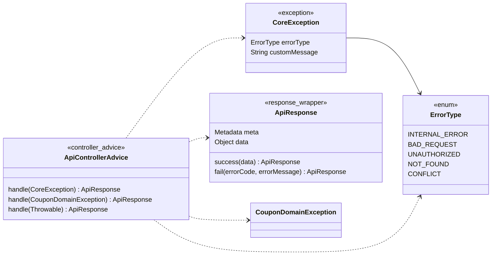

해석:

- 조회 실패, 인증 실패처럼 유스케이스 정책이 곧 API 정책인 경우 애플리케이션 계층은 `CoreException(ErrorType)`으로 실패 의미를 전달한다.
- 도메인 불변식 예외는 서비스 내부의 공통 wrapper 로 대량 매핑하지 않고, 예외 계층을 유지한 채 API 경계에서 응답 상태로 변환한다.
- 응답 상태 매핑은 API 어댑터 계층의 공통 처리로 모은다.

## 10. 도메인 간 협력 맵

도메인 간 협력은 Facade에서만 조합한다.
Service끼리 직접 의존하지 않는 것을 기본 규칙으로 둔다.

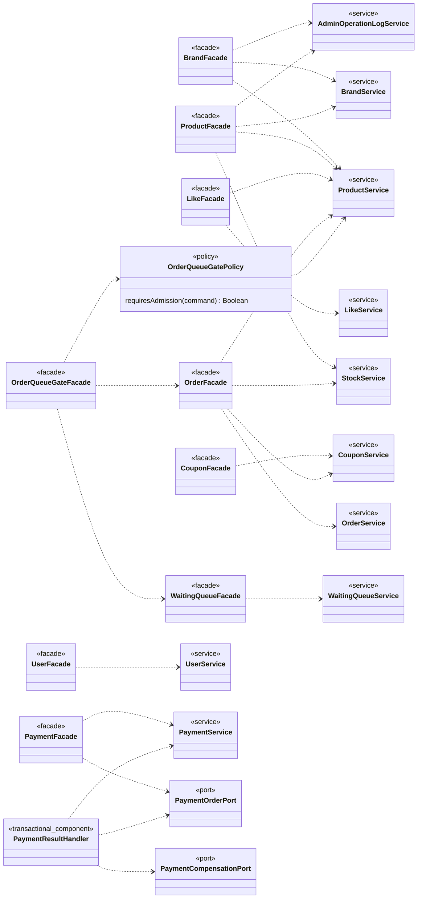

해석:

- 관리자 변경 로그는 브랜드/상품 변경을 수행하는 Facade가 기록한다.
- 상품 존재 검증, 브랜드 존재 검증, 재고 차감처럼 다른 도메인이 필요한 협력은 Facade에서 조합한다.
- 쿠폰 발급과 템플릿 관리는 `CouponFacade`가 담당하고, 쿠폰 적용 주문은 `OrderFacade`가 `CouponService`를 조합한다.
- `OrderFacade`는 주문 생성까지만 조합한다. `PaymentFacade`는 외부 결제 요청과 회복을 조정하고, `PaymentResultHandler`는 결제 확정 결과를 `PaymentOrderPort`/`PaymentCompensationPort`를 통해 주문·재고·쿠폰에 원자적으로 반영한다.
- 다중 도메인 상태 변경은 Facade 또는 결제의 `PaymentResultHandler`처럼 명시된 유스케이스 경계의 트랜잭션으로 묶어 정합성을 보장한다.
- `OrderQueueGatePolicy`가 상품 판매 유형을 조회해 `LIMITED`가 하나라도 있을 때만 대기열 관문을 적용한다. `NORMAL`-only 주문은 기존 `OrderFacade`로 바로 진행한다. 선착순 주문 예외 뒤에는 같은 멱등키 주문이 없을 때만 release하고, 커밋된 주문이 있으면 consume한다.


## 11. Waiting Queue

Round 8 대기열은 `com.loopers.domain.waitingqueue` package-by-feature 구조를 사용한다. Redis Sorted Set, 원자 sequence counter, TTL admission hash가 유일한 권위 상태이고, `WaitingQueuePort` 뒤에는 단일 `RedissonWaitingQueueAdapter`만 둔다.

### 목표 패키지 구조

```text
domain/waitingqueue/
├── application/
│   ├── WaitingQueueFacade
│   └── service/WaitingQueueService
├── model/
│   ├── AdmissionBatchResult
│   ├── WaitingQueueEntryModel
│   ├── WaitingQueueState
│   ├── AdmissionTokenCandidate
│   └── WaitingQueueStatus
├── config/
│   ├── WaitingQueueProperties
│   ├── WaitingQueueRedisKeys
│   └── constant/WaitingQueueConfigErrorMessages
├── port/
│   ├── WaitingQueuePort
│   └── TokenValidationResult
├── infrastructure/
│   └── redis/
│       ├── RedissonWaitingQueueAdapter
│       └── constant/
│           ├── WaitingQueueRedisConstants
│           └── WaitingQueueRedisScripts
├── presentation/
│   ├── WaitingQueueApiSpec
│   ├── WaitingQueueController
│   └── WaitingQueueResponse
├── scheduler/
│   └── WaitingQueueScheduler
└── constant/
    └── WaitingQueueErrorMessages
```

구현 시 모든 Kotlin 파일은 1 파일 1 top-level 선언 원칙을 따른다. 대기열 관계형 테이블/JPA Entity/DB adapter는 만들지 않으며, 도메인 model과 Redis 구현 세부는 port 경계로 분리한다.

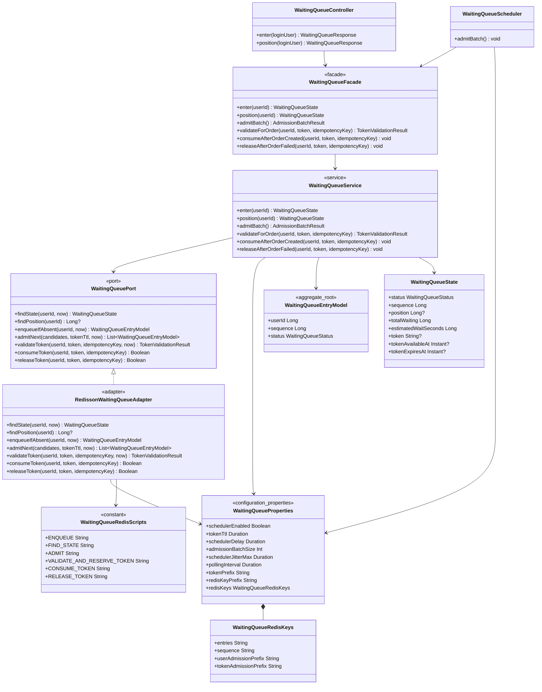

### 객체 책임/불변식

- `WaitingQueueEntryModel`: 사용자별 활성 대기/입장 상태와 필수 `sequence`를 가진다. `sequence`는 Redis `INCR`가 발급하고 권위 Sorted Set score로 사용한다.
- `WaitingQueueService`: 중복 진입 방지, batch admission, token reserve/consume/release 정책을 수행한다. Redis 접근 실패는 `503` 도메인 경계 예외로 변환한다.
- `WaitingQueuePort`: application의 테스트 대역과 저장소 경계를 위한 계약이다. 운영 infrastructure 구현체는 `RedissonWaitingQueueAdapter` 하나뿐이다.
- `RedissonWaitingQueueAdapter`: Redis Sorted Set, sequence counter, user/token admission hash의 유일한 권위 상태를 관리한다. 1-based position과 `ceil(position / batchSize) * schedulerDelay` 예상 시간을 계산하고, enqueue/admit/reserve/consume/release의 다중 command는 각각 Lua 한 번으로 원자 실행한다.
- enqueue Lua는 기존 Sorted Set member/user admission을 확인한 뒤에만 `INCR + ZADD NX`를 수행한다. admit Lua는 후보 token 충돌을 pop 전에 검사하고, 정상 후보에 대해서만 `ZPOPMIN + 양방향 hash HSET + PEXPIRE`를 묶는다.
- reserve Lua는 user/token binding과 `availableAt`을 검증해 `ACTIVE -> PROCESSING` 및 멱등키 기록을 묶는다. consume Lua는 같은 예약만 `CONSUMED`로 바꾸고 이미 같은 멱등키로 소비된 호출도 멱등 성공으로 처리하며, user hash를 삭제하고 token hash TTL은 consumed marker로 유지한다. release Lua는 주문 실패 시 같은 예약만 `ACTIVE`로 되돌리고 TTL을 연장하지 않는다.
- `PROCESSING + same Idempotency-Key`는 새 mutation 허가가 아니다. 기존 주문이 있으면 consume으로 회복하고, 없으면 `409`로 거부한다. consume/release의 `Boolean` CAS 실패는 fail-closed한다.
- `WaitingQueueScheduler`: 설정된 주기와 batch 크기로 `WaitingQueueFacade.admitBatch()`만 호출한다.
- `WaitingQueueProperties`: `commerce.waiting-queue` 단일 prefix를 바인딩한다. 기존 Redis 연결 설정을 중복하지 않는다.

### 설정 기준선

`WaitingQueueProperties`는 대기열 도메인 특화 설정만 가진다.

| 속성 | 의미 |
| --- | --- |
| `schedulerEnabled` | 입장 스케줄러 실행 여부. property name은 `scheduler-enabled`; 대기열 API나 주문 gate 전체 토글이 아니다. |
| `tokenTtl` | 입장 토큰 TTL. 기본 5분 |
| `schedulerDelay` | admission scheduler 주기. property name은 `scheduler-delay` |
| `admissionBatchSize` | scheduler 1회 입장 batch 크기. property name은 `admission-batch-size` |
| `schedulerJitterMax` | batch 내 token `availableAt` 분산 상한. property name은 `scheduler-jitter-max`; 기본 0으로 즉시 사용 가능하며 값을 늘리면 응답의 `tokenAvailableAt`을 따라야 한다. |
| `pollingInterval` | API 응답의 권장 polling 주기. property name은 `polling-interval` |
| `tokenPrefix` | 발급 token 문자열 prefix. property name은 `token-prefix`, 예: `q_` |
| `redisKeyPrefix` | 공통 Redis key namespace. property name은 `redis-key-prefix`, 예: `waiting-queue` |
| `redisKeys.entries` | 대기 Sorted Set logical key |
| `redisKeys.sequence` | 원자 sequence counter logical key |
| `redisKeys.userAdmissionPrefix` | 사용자별 admission hash key prefix |
| `redisKeys.tokenAdmissionPrefix` | token별 admission/consumed-marker hash key prefix |

파편화 방지 규칙:

- prefix는 `commerce.waiting-queue` 하나만 사용한다.
- Controller, Facade, Service, Scheduler, Adapter에 `@Value`를 흩뿌리지 않는다.
- `spring.data.redis.*` 연결 설정은 기존 공통 설정을 사용하고 이 prefix에 복제하지 않는다.
- 구현 중 `queue.*`, `waiting-queue.*`, `order-gate.*`, 별도 Redis key prefix 같은 경로를 발견하면 새 경로를 유지하지 말고 `commerce.waiting-queue`와 `WaitingQueueProperties`로 통합한다.
- 배포별로 바뀔 수 있는 token prefix와 Redis key 이름은 `token-prefix`, `redis-key-prefix`, 중첩 `redis-keys`로 주입하고 코드에 문자열로 하드코딩하지 않는다.
- Lua hash field/status/result code처럼 adapter 내부 프로토콜의 고정 값은 `infrastructure/redis/constant/WaitingQueueRedisConstants`, 도메인 예외 메시지는 `constant/WaitingQueueErrorMessages`에 계층별로 분리한다. 설정 가능성이 없는 값을 application 설정으로 올리지 않는다.

### Domain values

- `WaitingQueueEntryModel.sequence`: 0 또는 음수를 허용하지 않는 Redis `INCR` 단조 sequence 값이다.
- `WaitingQueueStatus`: 외부 API 가시 상태인 `WAITING`, `ADMITTED`만 표현한다. Redis hash 예약 상태 `ACTIVE`, `PROCESSING`, `CONSUMED`는 adapter 프로토콜 상수로 관리한다.
- `AdmissionTokenCandidate`: 빈 token을 허용하지 않고 `availableAt < expiresAt`을 보장하는 scheduler-adapter 경계 값이다.
- `AdmissionBatchSize`, `PollingInterval`, `JitterWindow`: 설정값 검증이 필요하면 VO로 분리할 수 있으나, 별도 top-level 선언은 파일당 하나만 둔다.
