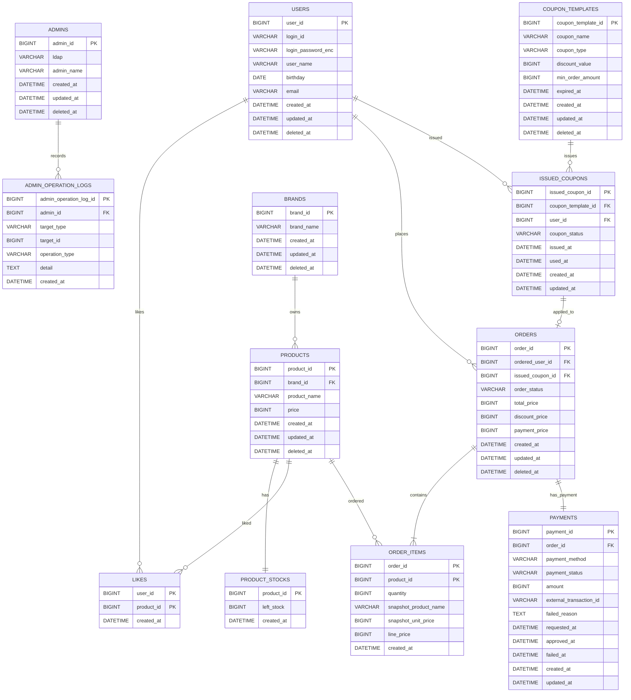

# ERD

## 설계 의도

이 ERD는 `01-requirements.md`의 사용자, 관리자, 브랜드, 상품, 재고, 좋아요, 쿠폰, 주문 흐름을 영속성 관점에서 검증하기 위한 문서다.

특히 다음 문제를 확인한다.

- 상품은 등록된 브랜드에만 속하고, 브랜드 삭제 시 소속 상품도 함께 노출에서 제외되는가?
- 좋아요는 사용자와 상품의 유일한 관계 상태로 표현되는가?
- 쿠폰 템플릿과 발급 쿠폰을 분리해 관리자 정책과 사용자 보유 상태의 생명주기를 독립적으로 관리하는가?
- 한 사용자와 한 쿠폰 템플릿 조합의 중복 발급을 막고, 한 발급 쿠폰의 중복 사용을 막을 수 있는가?
- 주문은 주문자, 주문 항목, 재고 차감 대상 상품을 연결하면서도 주문 당시 상품명과 가격 스냅샷을 보존하는가?
- 주문은 적용된 발급 쿠폰 식별자와 할인 금액 스냅샷을 보존하는가?
- 결제 기록은 주문과 연결되어 결제 수단, 금액, 상태, 외부 거래 식별자를 추적할 수 있는가?
- DB FK와 카디널리티를 명확히 하되, JPA 객체 연관은 불필요하게 양방향으로 열지 않을 수 있는가?

## 기본 정책

- 별도 요구가 없으면 `deleted_at`이 `NULL`이 아닌 행은 삭제된 것으로 간주하는 soft delete를 사용한다.
- 좋아요는 현재 관심 상태만 필요하므로 취소 시 hard delete를 기본으로 둔다.
- ERD의 관계선은 DB FK와 카디널리티를 뜻한다. JPA 객체 그래프의 양방향 매핑을 의미하지 않는다.
- JPA Entity 연관은 기본 단방향으로 시작하고, 컬렉션 탐색이나 cascade 저장이 실제 유스케이스를 단순하게 만들 때만 추가한다.
- 쿠폰은 관리자 정의인 `coupon_templates`와 사용자 발급 상태인 `issued_coupons`로 분리한다.
- 쿠폰 템플릿 삭제는 soft delete다. 이미 발급된 쿠폰과 주문 할인 스냅샷은 유지한다.
- 발급 쿠폰의 저장 상태는 `AVAILABLE`, `USED`만 둔다. `EXPIRED`는 `coupon_templates.expired_at`과 현재 시각으로 계산한 조회 표시 상태다.
- 금액성 컬럼은 DB/JPA에서 `BIGINT` 원 단위 정수로 저장한다. 정률 할인 계산은 도메인 중간 계산에서만 `BigDecimal`을 사용하고, 저장 전 `RoundingMode.FLOOR`로 원 단위 정수화한다.
- 결제는 결제수단별 상세 정책을 확정하지 않더라도 주문별 결제 상태 추적을 위해 `payments` 기록 테이블을 둔다. 이 테이블과 관련 보상 흐름은 후속 결제 연동 단계의 목표 설계이며, Round 4 쿠폰/동시성 구현 필수 범위가 아니다.
- outbox 는 현재 ERD에 포함하지 않는다. 결제수단과 외부 연동 방식이 구체화되어 비동기 승인, 재시도, 이벤트 발행 안정성이 필요해지면 `outbox_events` 테이블을 추가한다.

## Mermaid ERD

## 관계 해석

- `products.brand_id`는 상품이 반드시 하나의 브랜드에 속한다는 요구사항을 표현한다. 브랜드 삭제 시 DB cascade 대신 애플리케이션에서 브랜드와 상품을 함께 soft delete한다.
- `product_stocks.product_id`는 상품과 재고의 1:1 관계를 표현한다. 재고 생명주기는 상품에 종속되므로 별도 `deleted_at`을 두지 않고, 재고 차감 근거는 주문 항목으로 추적한다.
- `likes`는 `(user_id, product_id)` 복합 PK로 한 사용자가 한 상품에 좋아요를 한 번만 누를 수 있게 한다. 반복 `POST`는 이미 존재하는 행을 현재 상태로 보고 성공 처리하고, 반복 `DELETE`는 삭제할 행이 없어도 성공 처리한다.
- `coupon_templates`는 관리자 정의 쿠폰 정책이다. 삭제는 `deleted_at`으로 표현하고, 삭제된 템플릿은 신규 발급 대상에서 제외한다. 외부 API의 `FIXED`/`RATE`는 저장 전 내부 `coupon_type` 값인 `FIXED_AMOUNT`/`PERCENTAGE`로 매핑한다. `discount_value`는 `FIXED_AMOUNT`에서는 원 단위 할인 금액, `PERCENTAGE`에서는 1~100 범위의 퍼센트 정수다.
- `issued_coupons`는 사용자에게 발급된 쿠폰 상태다. `(user_id, coupon_template_id)` unique 제약으로 한 사용자가 같은 템플릿을 중복 발급받지 못하게 한다.
- `issued_coupons.coupon_status`는 `AVAILABLE`, `USED`만 저장한다. `EXPIRED`는 `coupon_templates.expired_at`과 현재 시각으로 계산한다.
- `orders.order_status`는 `PAYMENT_PENDING`, `ORDERED`, `PAYMENT_FAILED`, `CANCELED`를 저장한다. 후속 결제 연동 설계의 정상 전이는 `PAYMENT_PENDING -> ORDERED`, 실패 전이는 `PAYMENT_PENDING -> PAYMENT_FAILED`다.
- `orders.issued_coupon_id`는 성공적으로 쿠폰을 점유한 주문의 발급 쿠폰을 선택적으로 참조한다. 쿠폰 미사용 주문은 `NULL`이며, unique nullable 제약으로 하나의 발급 쿠폰이 여러 주문에 연결되지 않도록 한다. 결제 실패 보상 완료 주문은 발급 쿠폰을 재사용할 수 있도록 `issued_coupon_id = NULL`로 분리한다.
- 결제 실패 주문의 `discount_price`는 시도 당시 할인 스냅샷으로 보존될 수 있다. 따라서 `discount_price > 0`이면서 `issued_coupon_id = NULL`인 주문은 쿠폰 점유가 해제된 실패 이력으로 해석한다.
- `order_items`는 `(order_id, product_id)` 복합 PK로 한 주문 안의 동일 상품을 하나의 항목으로 합산한다. 주문 당시 상품명과 단가를 스냅샷 컬럼에 보관해 이후 상품 정보 변경이나 soft delete와 독립적으로 과거 주문 내역을 유지한다.
- `payments`는 주문별 결제 상태를 기록한다. 후속 결제 연동 구현에서는 `payments.order_id` unique 제약으로 주문과 1:1 관계를 보장한다. 결제 재시도나 결제수단 변경 이력이 필요해지면 주문과 1:N 관계로 확장한다.
- `admin_operation_logs`는 관리자 변경 작업만 기록한다. `target_type`은 `BRAND` 또는 `PRODUCT`, `operation_type`은 `CREATED`, `UPDATED`, `DELETED`를 기준으로 한다.

## 주요 제약과 인덱스 후보

| 대상 | 제약/인덱스 | 이유 |
| --- | --- | --- |
| `users.login_id` | unique | 로그인 ID 시스템 전체 유일성 보장 |
| `admins.ldap` | unique | 관리자 LDAP 식별자 중복 방지 |
| `likes(user_id, product_id)` | primary key | 좋아요 멱등성과 중복 방지 |
| `coupon_templates(deleted_at, expired_at)` | index | 발급 가능한 쿠폰 템플릿 조회 |
| `issued_coupons(user_id, coupon_template_id)` | unique | 사용자별 동일 쿠폰 템플릿 중복 발급 방지 |
| `issued_coupons(user_id, coupon_status, issued_at)` | index | 내 쿠폰 목록 조회와 상태별 필터링 |
| `issued_coupons(coupon_template_id, issued_at)` | index | 관리자 쿠폰 템플릿별 발급 이력 조회 |
| `orders(issued_coupon_id)` | unique nullable | 하나의 발급 쿠폰이 둘 이상의 주문에 적용되는 것을 방지 |
| `orders(order_status, created_at)` | index | 관리자 실패/대기 주문 모니터링과 미결 주문 회복 대상 조회 |
| `order_items(order_id, product_id)` | primary key | 주문 내 동일 상품 항목 중복 방지 |
| `payments(order_id)` | unique | 후속 결제 연동 구현의 주문-결제 1:1 보장 |
| `payments(external_transaction_id)` | unique nullable | 외부 결제 거래 중복 반영 방지 |
| `products(brand_id, created_at)` | index | 브랜드 필터와 최신순 상품 목록 조회 |
| `orders(ordered_user_id, created_at)` | index | 사용자의 주문 기간 조회 |
| `product_stocks(product_id)` | primary key | 주문 시 재고 행 단건 잠금/갱신 기준 |
| `admin_operation_logs(admin_id, created_at)` | index | 관리자별 변경 작업 이력 조회 |
| `admin_operation_logs(target_type, target_id, created_at)` | index | 특정 브랜드/상품 변경 이력 조회 |

## JPA 매핑 방향

DB 관계는 FK로 표현하지만, JPA에서는 다음처럼 단방향을 기본값으로 둔다.

| 관계 | JPA 기본 방향 | 비고 |
| --- | --- | --- |
| 상품 - 브랜드 | `ProductJpaEntity -> BrandJpaEntity` | 상품 등록/조회 시 브랜드 검증에 필요 |
| 재고 - 상품 | `ProductStockJpaEntity -> ProductJpaEntity` 또는 `productId` 값 보관 | shared PK라 단순 ID 매핑도 가능 |
| 좋아요 - 사용자/상품 | `LikeJpaEntity -> UserJpaEntity`, `LikeJpaEntity -> ProductJpaEntity` | 사용자나 상품에서 likes 컬렉션을 열 필요는 낮음 |
| 쿠폰 템플릿 - 발급 쿠폰 | `IssuedCouponJpaEntity -> CouponTemplateJpaEntity` 또는 `couponTemplateId` 값 보관 | 내 쿠폰 조회에서 템플릿 정보가 필요하므로 query/fetch join 후보 |
| 발급 쿠폰 - 사용자 | `IssuedCouponJpaEntity -> UserJpaEntity` 또는 `userId` 값 보관 | 사용자에서 issuedCoupons 컬렉션을 열 필요는 낮음 |
| 주문 - 발급 쿠폰 | `OrderJpaEntity -> IssuedCouponJpaEntity` 또는 `issuedCouponId` 값 보관 | 주문은 할인 스냅샷을 보존하므로 쿠폰 객체 그래프 의존은 최소화 |
| 주문 - 사용자 | `OrderJpaEntity -> UserJpaEntity` | 주문자 식별과 본인 자원 검증에 필요 |
| 주문 항목 - 주문/상품 | `OrderItemJpaEntity -> OrderJpaEntity`, `OrderItemJpaEntity -> ProductJpaEntity` 또는 ID 값 보관 | 주문 상세 조회는 query/fetch join으로 해결 가능 |
| 결제 - 주문 | `PaymentJpaEntity -> OrderJpaEntity` 또는 `orderId` 값 보관 | 후속 결제 연동 구현에서는 `orderId` unique로 주문당 결제 1개를 보장 |
| 관리자 변경 로그 - 관리자 | `AdminOperationLogJpaEntity -> AdminJpaEntity` | 관리자에서 로그 컬렉션을 열 필요는 낮음 |

주문 생성 저장에서 `OrderJpaEntity.items` 컬렉션과 cascade가 구현을 크게 단순화한다면 주문 - 주문 항목만 예외적으로 컬렉션을 열 수 있다. 이 경우에도 도메인 모델과 JPA Entity는 분리하고, 양방향 동기화 책임은 JPA Entity 내부 helper로 제한한다.

`coupon_templates`는 단일 테이블로 유지한다. JPA 상속 매핑은 사용하지 않고, `CouponTemplateJpaEntity.toDomain()`에서 `coupon_type + discount_value`를 도메인 계층의 sealed `DiscountPolicy`로 변환한다. `OrderStatus`도 DB에는 문자열 enum 값으로 저장하고, 도메인에서는 sealed/FSM으로 전이 규칙을 통제한다.

## 잠재 리스크

- soft delete를 쓰면 FK cascade만으로 브랜드 삭제 요구사항을 만족할 수 없다. 브랜드 삭제 유스케이스에서 소속 상품을 함께 soft delete하고, 재고 노출 여부는 상품 삭제 상태를 기준으로 판단해야 한다.
- `PAYMENT_PENDING` 주문은 TX1 이후 TX2가 누락된 orphan일 수 있다. 회복 프로세스는 외부 결제 상태를 확인한 뒤 주문 실패 전이, 재고 복구, 쿠폰 복구, `orders.issued_coupon_id = NULL` 분리를 멱등하게 수행해야 한다.
- 재고 차감 근거는 주문 항목으로 추적한다. 입고, 수동 보정, 재고 실사처럼 주문 외 재고 변경이 필요해지면 별도 `stock_movements` 이력 테이블을 추가해야 한다.
- 주문에서 여러 상품 재고 행과 발급 쿠폰 행을 함께 잠그면 교착 가능성이 있다. 주문 대상 상품 ID 정렬 순서로 재고 행을 잠그고, 발급 쿠폰 잠금 위치를 유스케이스 전반에서 일관되게 유지해야 한다.
- `EXPIRED`를 저장 상태로 두지 않는 설계는 상태 동기화 부담을 줄이지만, 발급 쿠폰 데이터가 많이 쌓이면 만료 여부 계산과 조인 비용이 커질 수 있다. 대량 데이터 구간에서는 만료 배치나 만료 조건 인덱스 전략을 재검토한다.
- 좋아요 hard delete는 이력 분석 요구가 생기면 부족하다. 좋아요 변경 이력이 필요해지면 `likes`에 `deleted_at`을 두거나 별도 이벤트/히스토리 테이블을 추가해야 한다.
- 상품 상세에서 좋아요 수를 매 요청마다 `COUNT`로 계산하면 읽기 병목이 될 수 있다. 트래픽이 커지면 캐시 컬럼, 집계 테이블, Redis 카운터 같은 읽기 최적화를 검토한다.
- `order_items.product_id` FK는 상품 hard delete와 충돌한다. 과거 주문 스냅샷 보존을 위해 상품은 soft delete를 유지하는 편이 안전하다.
- 외부 결제 호출은 DB 트랜잭션 밖에서 수행한다. TX1 (주문·재고·쿠폰 적용 시 쿠폰 사용·결제 요청 기록) 커밋 이후 TX2 (결제 결과 반영과 보상) 도달 전에 프로세스가 종료되면 `orders.order_status = PAYMENT_PENDING`, `payments.payment_status = REQUESTED`, 차감된 재고, `USED` 쿠폰이 남을 수 있다. 미결 결제 회수(상태 폴링·웹훅 수신·운영자 보정)와 외부 연동 안정성이 요구되면 outbox 패턴을 별도 테이블로 추가한다.
- 실패 주문에서 쿠폰 시도 이력은 현재 ERD에서 별도 테이블로 보존하지 않는다. 운영 감사가 필요해지면 append-only `coupon_usage_records(coupon_usage_record_id, issued_coupon_id, coupon_template_id, user_id, order_id, discount_amount, used_at)`를 검토한다. 주문은 여러 상품을 가질 수 있으므로 `product_id`는 기본 컬럼으로 두지 않는다.
- 결제 재시도나 다중 결제 이력이 필요해지면 `payments`를 주문 1:N 구조로 확장한다.
- 주문 취소나 환불이 필요해지면 `OrderStatus.CANCELED` 전이와 재고·쿠폰·결제 보상 정책을 별도로 추가한다.
- `admin_operation_logs.target_id`는 브랜드와 상품을 함께 가리키는 다형 참조라 DB FK를 강제하지 않는다. Facade가 변경 대상 검증과 저장 성공을 확인한 뒤 로그를 기록해야 하며, 대상별 무결성이나 변경 전/후 값 감사가 필요해지면 로그 detail 형식을 JSON/TEXT 스냅샷으로 구체화해야 한다.
- `likes_desc` 정렬을 대량 트래픽에서 안정적으로 제공해야 하면 실시간 집계 조인 대신 상품별 좋아요 수 캐시 컬럼이나 집계 테이블을 검토해야 한다.
