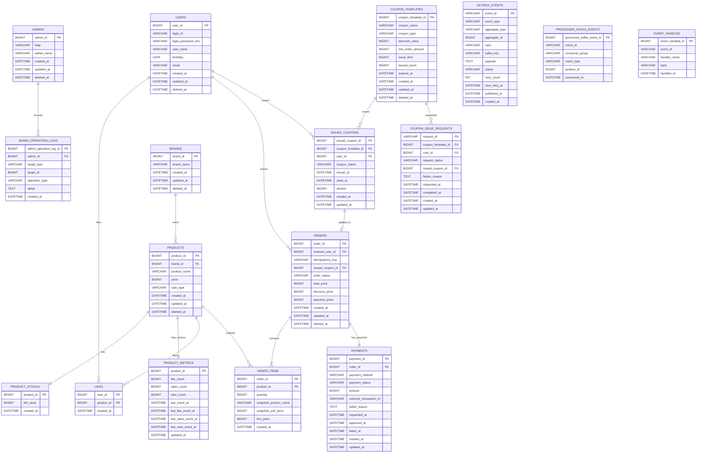

# ERD

## 설계 의도

이 ERD는 `01-requirements.md`의 사용자, 관리자, 브랜드, 상품, 재고, 좋아요, 쿠폰, 주문 흐름을 영속성 관점에서 검증하기 위한 문서다.

특히 다음 문제를 확인한다.

- 상품은 등록된 브랜드에만 속하고, 브랜드 삭제 시 소속 상품도 함께 노출에서 제외되는가?
- 좋아요는 사용자와 상품의 유일한 관계 상태로 표현되는가?
- 상품별 좋아요 수, 판매 수, 조회 수를 매 조회마다 집계하지 않고, 원천 상태와 이벤트에서 파생되는 eventually consistent projection 테이블로 비정규화할 수 있는가?
- 쿠폰 템플릿과 발급 쿠폰을 분리해 관리자 정책과 사용자 보유 상태의 생명주기를 독립적으로 관리하는가?
- 한 사용자와 한 쿠폰 템플릿 조합의 중복 발급을 막고, 한 발급 쿠폰의 중복 사용을 막을 수 있는가?
- 주문은 주문자, 주문 항목, 재고 차감 대상 상품을 연결하면서도 주문 당시 상품명과 가격 스냅샷을 보존하는가?
- 주문은 적용된 발급 쿠폰 식별자와 할인 금액 스냅샷을 보존하는가?
- 결제 기록은 주문과 연결되어 결제 수단, 금액, 상태, 외부 거래 식별자를 추적할 수 있는가?
- 쿠폰 발급 API가 요청 접수와 실제 발급을 분리하고, 요청 상태 polling과 worker 멱등 처리를 영속성으로 보장할 수 있는가?
- DB FK와 카디널리티를 명확히 하되, JPA 객체 연관은 불필요하게 양방향으로 열지 않을 수 있는가?
- Round 8 대기열이 Redis-only source of truth라는 결정을 관계형 테이블로 잘못 중복 모델링하지 않았는가?

## 기본 정책

- 별도 요구가 없으면 `deleted_at`이 `NULL`이 아닌 행은 삭제된 것으로 간주하는 soft delete를 사용한다.
- 좋아요는 현재 관심 상태만 필요하므로 취소 시 hard delete를 기본으로 둔다.
- 상품별 좋아요 수, 판매 수, 조회 수는 `product_metrics` projection 테이블에 비정규화해 보관한다. `likes` 레코드, 주문/주문 항목, 상품 조회 이벤트가 권위 상태이며, 실제 상태 전이나 커밋된 조회 이벤트만 outbox row를 남긴다. Kafka consumer가 `catalog-events`/`order-events`에서 상품 key 이벤트를 소비해 카운터를 반영하므로 `product_metrics`는 eventually consistent projection이다. 같은 지표의 오래된 이벤트는 `last_like_event_at`, `last_sales_event_at`, `last_view_event_at`으로 무시하고, 기존 `product_like_counts`의 역할은 `product_metrics.like_count`가 흡수한다.
- 이벤트는 UUID `eventId`를 갖는다. consumer는 `processed_kafka_events` 또는 `event_handled`에 `(consumer_group, event_id)`를 저장해 Kafka 재전달 시 같은 delta/증분을 중복 반영하지 않는다.
- 발급 쿠폰 사용 상태 변경은 낙관적 락(`version`)으로 lost update를 방지하고, 사용 가능 여부는 `coupon_status`/`used_at` 상태 검증으로 판단한다. 두 장치를 함께 적용해 동일 쿠폰 동시 주문에서 단 한 번만 사용되도록 보장한다.
- ERD의 관계선은 DB FK와 카디널리티를 뜻한다. JPA 객체 그래프의 양방향 매핑을 의미하지 않는다.
- JPA Entity 연관은 기본 단방향으로 시작하고, 컬렉션 탐색이나 cascade 저장이 실제 유스케이스를 단순하게 만들 때만 추가한다.
- 쿠폰은 관리자 정의인 `coupon_templates`와 사용자 발급 상태인 `issued_coupons`로 분리한다.
- 쿠폰 템플릿 삭제는 soft delete다. 이미 발급된 쿠폰과 주문 할인 스냅샷은 유지한다.
- 발급 쿠폰의 저장 상태는 `AVAILABLE`, `USED`만 둔다. `EXPIRED`는 `coupon_templates.expired_at`과 현재 시각으로 계산한 조회 표시 상태다.
- 금액성 컬럼은 DB/JPA에서 `BIGINT` 원 단위 정수로 저장한다. 정률 할인 계산은 도메인 중간 계산에서만 `BigDecimal`을 사용하고, 저장 전 `RoundingMode.FLOOR`로 원 단위 정수화한다.
- 결제는 결제수단별 상세 정책을 확정하지 않더라도 주문별 결제 상태 추적을 위해 `payments` 기록 테이블을 둔다. 이 테이블과 관련 보상 흐름은 후속 결제 연동 단계의 목표 설계이며, Round 4 쿠폰/동시성 구현 필수 범위가 아니다.
- 커밋 이후 전파가 필요한 `ApplicationEvent`는 `@TransactionalEventListener(phase = AFTER_COMMIT)`에서 `outbox_events`에 저장하고, 별도 relay가 Kafka broker ack 이후 발행 완료로 표시한다. 이벤트 유실을 막기 위한 저장소 권위는 outbox row이며, Kafka publish는 도메인 쓰기 트랜잭션 밖에서 수행한다. producer 설정은 `acks=all`, `idempotence=true`를 전제로 한다.
- 쿠폰 발급 요청은 `coupon_issue_requests`에 `PENDING`으로 저장하고, `coupon-issue-requests` outbox/Kafka 이벤트를 통해 worker가 실제 발급을 수행한다. 발급 쿠폰 사용은 주문/쿠폰 유스케이스의 동기 트랜잭션 경계를 유지한다.
- Round 8 대기열은 관계형 DB에 저장하지 않는다. Redis Sorted Set, 원자 sequence counter, TTL admission hash가 유일한 권위 상태이므로 Mermaid ERD에는 대기열 엔티티나 관계가 나타나지 않는다. Redis 비관계 저장 모델은 아래 별도 절에서 정의한다.
- `products.sale_type`은 `NORMAL`, `LIMITED`를 저장한다. 주문 항목 중 `LIMITED` 상품이 하나라도 있으면 주문 전체가 Redis 대기열 관문 대상이고, `NORMAL`-only 주문은 기존 Round 7 주문 흐름으로 바로 진행한다.

## Mermaid ERD

## 관계 해석

- `products.brand_id`는 상품이 반드시 하나의 브랜드에 속한다는 요구사항을 표현한다. 브랜드 삭제 시 DB cascade 대신 애플리케이션에서 브랜드와 상품을 함께 soft delete한다.
- `products.sale_type`은 일반 상품 `NORMAL`과 선착순 상품 `LIMITED`를 구분한다. `OrderQueueGatePolicy`는 주문 상품을 조회해 `LIMITED`가 하나라도 있으면 `X-Queue-Token`과 공백이 아닌 `Idempotency-Key`를 요구한다.
- `product_stocks.product_id`는 상품과 재고의 1:1 관계를 표현한다. 재고 생명주기는 상품에 종속되므로 별도 `deleted_at`을 두지 않고, 재고 차감 근거는 주문 항목으로 추적한다.
- `likes`는 `(user_id, product_id)` 복합 PK로 한 사용자가 한 상품에 좋아요를 한 번만 누를 수 있게 한다. 반복 `POST`는 이미 존재하는 행을 현재 상태로 보고 성공 처리하고, 반복 `DELETE`는 삭제할 행이 없어도 성공 처리한다.
- `product_metrics`는 `product_id`를 PK로 갖는 상품 1:1 projection 테이블이다. 좋아요 수, 판매 수, 조회 수를 매 조회마다 계산하는 대신 비정규화 컬럼으로 보관해 목록·정렬의 읽기 비용을 낮춘다. `likes`, 주문/주문 항목, 상품 조회 이벤트가 권위 상태이며, `product_metrics`는 Kafka consumer가 `LIKE_COUNT_CHANGED_V1`, 주문/결제 이벤트, 상품 조회 이벤트를 처리한 뒤 갱신하는 eventually consistent projection이다. 상품 생성 시 `like_count = 0`, `sales_count = 0`, `view_count = 0` 행을 함께 만들고, consumer 장애나 누락 의심 시 Kafka replay 또는 원천 테이블 기준 backfill/rebuild로 projection을 복구한다.
- `outbox_events`는 커밋 이후 발행할 durable event 저장소다. `LIKE_COUNT_CHANGED_V1` row는 UUID `eventId`, `event_type`, `aggregate_type=PRODUCT`, `aggregate_id=productId`, `topic=catalog-events`, `kafka_key=productId`, `payload(delta, userId, occurredAt)`를 보관한다. 주문·결제 지표 이벤트는 `topic=order-events`, 쿠폰 발급 요청은 `topic=coupon-issue-requests`를 사용한다. relay는 Kafka broker ack 이후에만 `PUBLISHED`로 변경하고, 실패 시 retry metadata를 갱신한다.
- `processed_kafka_events`는 projection consumer의 idempotency 테이블이다. UUID `eventId`를 `event_id`에 저장하고, 같은 `consumer_group`에서 이미 처리한 이벤트면 `product_metrics`에 증분을 다시 적용하지 않는다. 운영 DDL에서는 `(consumer_group, event_id)` unique 제약을 둔다.
- `event_handled`는 command worker의 idempotency 테이블이다. `coupon-issue-requests` 재전달 시 같은 `event_id`를 이미 처리했다면 발급 수량 차감과 발급 쿠폰 생성을 반복하지 않고 ack한다.
- `coupon_templates`는 관리자 정의 쿠폰 정책이다. 삭제는 `deleted_at`으로 표현하고, 삭제된 템플릿은 신규 발급 대상에서 제외한다. 외부 API의 `FIXED`/`RATE`는 저장 전 내부 `coupon_type` 값인 `FIXED_AMOUNT`/`PERCENTAGE`로 매핑한다. `discount_value`는 `FIXED_AMOUNT`에서는 원 단위 할인 금액, `PERCENTAGE`에서는 1~100 범위의 퍼센트 정수다. `issue_limit`과 `issued_count`는 선착순 발급 수량을 표현한다.
- `coupon_issue_requests`는 비동기 발급 요청 상태다. API는 요청 row를 `PENDING`으로 저장하고 `202 Accepted`로 반환한다. worker는 별도 트랜잭션에서 요청을 잠금 조회하고, 발급 성공 시 `ISSUED`, 중복이면 `DUPLICATE`, 수량 소진이면 `SOLD_OUT`, 예외면 `FAILED`로 저장한다. 사용자는 request id로 polling한다.
- `issued_coupons`는 사용자에게 발급된 쿠폰 상태다. `(user_id, coupon_template_id)` unique 제약으로 한 사용자가 같은 템플릿을 중복 발급받지 못하게 한다.
- `issued_coupons.coupon_status`는 `AVAILABLE`, `USED`만 저장한다. `EXPIRED`는 `coupon_templates.expired_at`과 현재 시각으로 계산한다.
- `issued_coupons.version`은 사용 상태 변경(`AVAILABLE -> USED` 및 보상 복구 `USED -> AVAILABLE`)에 적용하는 낙관적 락 컬럼이다. 동일 발급 쿠폰에 대한 동시 주문에서 lost update를 차단한다. 단 "이미 사용된 쿠폰의 재사용"을 막는 것은 `version`이 아니라 `coupon_status = AVAILABLE`(및 `used_at IS NULL`) 상태 검증이며, 두 장치를 함께 적용해 단 한 번만 사용되도록 보장한다. 경합 주체가 쿠폰 소유자 본인으로 한정되어 충돌 확률이 낮으므로 비관적 락 대신 낙관적 락을 선택한다.
- `orders.order_status`는 `PAYMENT_PENDING`, `ORDERED`, `PAYMENT_FAILED`, `CANCELED`를 저장한다. 후속 결제 연동 설계의 정상 전이는 `PAYMENT_PENDING -> ORDERED`, 실패 전이는 `PAYMENT_PENDING -> PAYMENT_FAILED`다.
- `orders.issued_coupon_id`는 성공적으로 쿠폰을 점유한 주문의 발급 쿠폰을 선택적으로 참조한다. 쿠폰 미사용 주문은 `NULL`이며, unique nullable 제약으로 하나의 발급 쿠폰이 여러 주문에 연결되지 않도록 한다. 결제 실패 보상 완료 주문은 발급 쿠폰을 재사용할 수 있도록 `issued_coupon_id = NULL`로 분리한다.
- 결제 실패 주문의 `discount_price`는 시도 당시 할인 스냅샷으로 보존될 수 있다. 따라서 `discount_price > 0`이면서 `issued_coupon_id = NULL`인 주문은 쿠폰 점유가 해제된 실패 이력으로 해석한다.
- `order_items`는 `(order_id, product_id)` 복합 PK로 한 주문 안의 동일 상품을 하나의 항목으로 합산한다. 주문 당시 상품명과 단가를 스냅샷 컬럼에 보관해 이후 상품 정보 변경이나 soft delete와 독립적으로 과거 주문 내역을 유지한다.
- `payments`는 주문별 결제 상태를 기록한다. 후속 결제 연동 구현에서는 `payments.order_id` unique 제약으로 주문과 1:1 관계를 보장한다. 결제 재시도나 결제수단 변경 이력이 필요해지면 주문과 1:N 관계로 확장한다.
- `admin_operation_logs`는 관리자 변경 작업만 기록한다. `target_type`은 `BRAND` 또는 `PRODUCT`, `operation_type`은 `CREATED`, `UPDATED`, `DELETED`를 기준으로 한다.

## Round 8 Redis 비관계 저장 모델

대기열은 관계형 ERD 대상이 아니다. 아래 Redis 자료구조가 유일한 source of truth이며, `WaitingQueuePort`의 운영 구현체인 `RedissonWaitingQueueAdapter`가 설정으로 주입된 logical key를 조합한다.

| 자료구조 | 설정/실제 key 형태 | 값과 역할 | 수명 |
| --- | --- | --- | --- |
| Sorted Set | `${redis-key-prefix}:${redis-keys.entries}` | member=`userId`, score=Redis `INCR` sequence. `ZRANK + 1`이 실시간 순번이고 `ZCARD`가 전체 대기 인원 | 입장 Lua가 member를 pop할 때까지 |
| String counter | `${redis-key-prefix}:${redis-keys.sequence}` | 새 대기 member의 양의 단조 sequence를 `INCR`로 발급 | 대기열 namespace 수명 동안 유지 |
| User admission Hash | `${redis-key-prefix}:${redis-keys.user-admission-prefix}:${userId}` | token, userId, sequence, availableAt, expiresAt, status, idempotencyKey를 보관하는 사용자 역조회 | 발급 시 `token-ttl`; consume 시 삭제, release 시 TTL 연장 없음 |
| Token admission Hash | `${redis-key-prefix}:${redis-keys.token-admission-prefix}:${token}` | user binding과 `ACTIVE/PROCESSING/CONSUMED` 상태를 보관하는 token 검증 및 consumed marker | 발급 시 `token-ttl`; consume/release 후에도 최초 TTL 유지 |

- 발급 token 문자열 자체의 prefix는 `commerce.waiting-queue.token-prefix`로 주입한다. Redis namespace/key 이름은 `redis-key-prefix`와 중첩 `redis-keys.entries`, `sequence`, `user-admission-prefix`, `token-admission-prefix`로 주입한다.
- 현재 queue scope는 모든 `LIMITED` 주문이 공유하는 전역 사용자 대기열이다. token은 사용자에만 귀속되며 상품/캠페인 ID는 저장하지 않는다. 독립 행사가 필요하면 scope를 모든 ZSET/counter/hash key와 token binding에 동일하게 추가해야 한다.
- enqueue Lua는 기존 ZSET member와 user admission을 확인한 뒤 `INCR + ZADD NX`를 원자 실행한다.
- admit Lua는 후보 token key의 중복/기존 존재를 pop 전에 검사한다. 충돌하면 기존 binding과 ZSET을 그대로 유지하고, 정상 후보일 때만 `ZPOPMIN batchSize`, user/token hash 생성, 두 hash의 `PEXPIRE tokenTtl`을 원자 실행한다.
- reserve Lua는 user/token binding과 `availableAt`을 검증하고 `ACTIVE -> PROCESSING` 및 `Idempotency-Key` 기록을 원자 실행한다.
- consume Lua는 같은 멱등키의 예약만 `PROCESSING -> CONSUMED`로 바꾸고 user hash를 삭제한다. 이미 `CONSUMED`인 같은 멱등키 호출도 멱등 성공이다. token hash는 남은 TTL 동안 같은 멱등키 consumed marker로 유지하며 CAS 결과는 `Boolean`이다.
- release Lua는 커밋된 주문이 없을 때 같은 멱등키의 예약만 `PROCESSING -> ACTIVE`로 되돌리고 양쪽 hash의 예약 멱등키를 지운다. TTL은 다시 시작하지 않으며 CAS 결과는 `Boolean`이다.
- `PROCESSING + same key` 재시도는 기존 주문이 확인되면 consume으로 회복하고, 없으면 `409`로 거부한다. 주문 처리 예외 뒤에도 멱등키 주문이 커밋됐으면 release하지 않으며, consume/release CAS 실패는 fail-closed한다.
- 위 key가 모두 같은 Redis에 있다는 전제에서 Lua가 원자성을 보장한다. 현재 Redisson 설정은 single server와 master-replica만 지원한다. Redis Cluster는 한 script의 multi-key가 같은 hash slot에 위치하도록 공통 hash tag를 key에 반영하고 cluster client 설정을 추가하기 전까지 지원하지 않는다.

## 주요 제약과 인덱스 후보

| 대상 | 제약/인덱스 | 이유 |
| --- | --- | --- |
| `users.login_id` | unique | 로그인 ID 시스템 전체 유일성 보장 |
| `admins.ldap` | unique | 관리자 LDAP 식별자 중복 방지 |
| `likes(user_id, product_id)` | primary key | 좋아요 멱등성과 중복 방지 |
| `product_metrics(product_id)` | primary key | 상품 1:1 지표 projection 조회·갱신 기준 |
| `product_metrics(like_count)` | index | `likes_desc` 정렬 후보 |
| `outbox_events(event_id)` | unique | Kafka 발행 전 durable event 식별자 보장 |
| `outbox_events(status, next_retry_at, created_at)` | index | 발행 대기·재시도 대상 조회 |
| `processed_kafka_events(consumer_group, event_id)` | unique | projection 이벤트 재전달 시 증분 중복 반영 방지 |
| `event_handled(handler_name, event_id)` | unique | command worker 이벤트 재전달 시 중복 실행 방지 |
| `coupon_templates(deleted_at, expired_at)` | index | 발급 가능한 쿠폰 템플릿 조회 |
| `coupon_templates(issue_limit, issued_count)` | check/guard | 선착순 발급 수량 초과 방지 |
| `coupon_issue_requests(user_id, coupon_template_id)` | unique 또는 partial unique | 같은 사용자·템플릿의 중복 pending 요청 방지 |
| `coupon_issue_requests(request_status, requested_at)` | index | worker 처리 대상과 polling 조회 보조 |
| `issued_coupons(user_id, coupon_template_id)` | unique | 사용자별 동일 쿠폰 템플릿 중복 발급 방지 |
| `issued_coupons(user_id, coupon_status, issued_at)` | index | 내 쿠폰 목록 조회와 상태별 필터링 |
| `issued_coupons(coupon_template_id, issued_at)` | index | 관리자 쿠폰 템플릿별 발급 이력 조회 |
| `issued_coupons.version` | optimistic lock | 발급 쿠폰 사용/복구 시 동시 변경 lost update 방지 |
| `orders(issued_coupon_id)` | unique nullable | 하나의 발급 쿠폰이 둘 이상의 주문에 적용되는 것을 방지 |
| `orders(ordered_user_id, idempotency_key)` | unique nullable | 사용자 범위 주문 멱등성 보장과 교차 사용자 주문 정보 노출 방지 |
| `orders(order_status, created_at)` | index | 관리자 실패/대기 주문 모니터링과 미결 주문 회복 대상 조회 |
| `order_items(order_id, product_id)` | primary key | 주문 내 동일 상품 항목 중복 방지 |
| `payments(order_id)` | unique | 후속 결제 연동 구현의 주문-결제 1:1 보장 |
| `payments(external_transaction_id)` | unique nullable | 외부 결제 거래 중복 반영 방지 |
| `products(brand_id, created_at)` | index | 브랜드 필터와 최신순 상품 목록 조회 |
| `products(sale_type)` | index 후보 | 선착순 상품 운영 조회가 실제로 필요할 때 적용. 주문 gate는 요청 상품 ID 조회 결과로 판별 |
| `orders(ordered_user_id, created_at)` | index | 사용자의 주문 기간 조회 |
| `product_stocks(product_id)` | primary key | 주문 시 재고 행 단건 잠금/갱신 기준 |
| `admin_operation_logs(admin_id, created_at)` | index | 관리자별 변경 작업 이력 조회 |
| `admin_operation_logs(target_type, target_id, created_at)` | index | 특정 브랜드/상품 변경 이력 조회 |

## JPA 매핑 방향

DB 관계는 FK로 표현하지만, JPA에서는 다음처럼 단방향을 기본값으로 둔다.

| 관계 | JPA 기본 방향 | 비고 |
| --- | --- | --- |
| 상품 - 브랜드 | `ProductJpaEntity -> BrandJpaEntity` | 상품 등록/조회 시 브랜드 검증에 필요 |
| 재고 - 상품 | `ProductStockJpaEntity -> ProductJpaEntity` 또는 `productId` 값 보관 | shared PK라 단순 ID 매핑도 가능 |
| 좋아요 - 사용자/상품 | `LikeJpaEntity -> UserJpaEntity`, `LikeJpaEntity -> ProductJpaEntity` | 사용자나 상품에서 likes 컬렉션을 열 필요는 낮음 |
| Outbox 이벤트 | `OutboxEventJpaEntity` 값 보관 | `@TransactionalEventListener(AFTER_COMMIT)`가 topic/key/payload를 저장. Kafka publish는 relay가 트랜잭션 밖에서 수행 |
| 상품 지표 projection - 상품 | `ProductMetricsJpaEntity` shared PK `productId` 값 보관 | 상품과 1:1 projection 행. Kafka consumer가 좋아요·판매·조회 이벤트를 반영하고, 조회는 상품 목록/상세 조립 시 bulk 조회 |
| Kafka 처리 이력 - 이벤트 | `ProcessedKafkaEventJpaEntity` 값 보관 | UUID `eventId`, `consumerGroup`, `eventType`, `productId`, `processedAt` 저장. `(consumerGroup, eventId)` unique로 projection 중복 처리 방지 |
| Worker 처리 이력 - 이벤트 | `EventHandledJpaEntity` 값 보관 | UUID `eventId`, `handlerName`, `topic`, `handledAt` 저장. `(handlerName, eventId)` unique로 command 중복 실행 방지 |
| 쿠폰 템플릿 - 발급 쿠폰 | `IssuedCouponJpaEntity -> CouponTemplateJpaEntity` 또는 `couponTemplateId` 값 보관 | 현재 구현은 `couponTemplateId` 값 보관 후 내 쿠폰 조회에서 템플릿 bulk 조회로 조립 |
| 쿠폰 템플릿 - 발급 요청 | `CouponIssueRequestJpaEntity` 값 보관 | 요청 상태 polling과 worker 처리를 위한 durable command row |
| 발급 쿠폰 - 사용자 | `IssuedCouponJpaEntity -> UserJpaEntity` 또는 `userId` 값 보관 | 사용자에서 issuedCoupons 컬렉션을 열 필요는 낮음 |
| 주문 - 발급 쿠폰 | `OrderJpaEntity -> IssuedCouponJpaEntity` 또는 `issuedCouponId` 값 보관 | 주문은 할인 스냅샷을 보존하므로 쿠폰 객체 그래프 의존은 최소화 |
| 주문 - 사용자 | `OrderJpaEntity -> UserJpaEntity` | 주문자 식별과 본인 자원 검증에 필요 |
| 주문 항목 - 주문/상품 | `OrderItemJpaEntity -> OrderJpaEntity`, `OrderItemJpaEntity -> ProductJpaEntity` 또는 ID 값 보관 | 현재 구현은 `orderId` 값 보관 후 주문 목록 조회에서 주문항목 bulk 조회로 조립 |
| 결제 - 주문 | `PaymentJpaEntity -> OrderJpaEntity` 또는 `orderId` 값 보관 | 후속 결제 연동 구현에서는 `orderId` unique로 주문당 결제 1개를 보장 |
| 관리자 변경 로그 - 관리자 | `AdminOperationLogJpaEntity -> AdminJpaEntity` | 관리자에서 로그 컬렉션을 열 필요는 낮음 |

주문 생성 저장에서 `OrderJpaEntity.items` 컬렉션과 cascade가 구현을 크게 단순화한다면 주문 - 주문 항목만 예외적으로 컬렉션을 열 수 있다. 이 경우에도 도메인 모델과 JPA Entity는 분리하고, 양방향 동기화 책임은 JPA Entity 내부 helper로 제한한다.

목록 조회 성능은 Lazy 연관관계만으로 해결하지 않는다. Lazy 는 지연 로딩 시점을 늦출 뿐이며, 목록 결과를 순회하며 연관 Entity 또는 repository 단건 조회를 반복하면 N+1 이 된다. 현재 Round 4 구현은 도메인-JPA 분리를 유지하기 위해 쿠폰 목록과 주문 목록 모두 식별자 기반 bulk query 로 필요한 하위 데이터를 조립한다. 향후 DTO projection 또는 fetch join 을 도입할 때도 pagination, 중복 row, 영속성 컨텍스트 적재 비용을 함께 검토한다.

`coupon_templates`는 단일 테이블로 유지한다. JPA 상속 매핑은 사용하지 않고, `CouponTemplateJpaEntity.toDomain()`에서 `coupon_type + discount_value`를 도메인 계층의 sealed `DiscountPolicy`로 변환한다. `OrderStatus`도 DB에는 문자열 enum 값으로 저장하고, 도메인에서는 sealed/FSM으로 전이 규칙을 통제한다.

## 잠재 리스크

- 대기열이 Redis-only source of truth이므로 Redis 장애 중에는 순번과 토큰을 확인할 수 없다. application은 다른 저장소로 우회하지 않고 `503`으로 fail-closed하며, Redis persistence/replication/backup과 `noeviction` 계열 메모리 정책은 운영 환경에서 별도로 보장해야 한다.
- enqueue/admit/reserve/consume/release Lua가 접근하는 key는 Redis Cluster에서 같은 hash slot이어야 한다. Cluster 도입 시 설정 key에 공통 hash tag를 적용하지 않으면 multi-key script가 실패한다.
- consumed marker는 token hash의 남은 TTL까지만 유지된다. 그 이후에도 인증된 사용자와 같은 `Idempotency-Key`의 커밋 주문을 조회해 새 mutation 없이 기존 결과를 반환하므로, 주문 저장소의 멱등키 보존 기간이 최종 중복 방어선이다.
- 주문 DB commit 뒤 consume Lua가 실패하면 주문은 생성됐지만 token은 `PROCESSING`으로 남아 최초 응답이 `503`일 수 있다. marker가 남아 있으면 같은 token·멱등키로 consume을 회복하고, 이미 만료됐으면 사용자 범위 주문 멱등 조회로 기존 결과를 회복한다.
- 기존 운영 스키마에는 배포 전에 [`docs/migrations/round8-waiting-queue.sql`](../migrations/round8-waiting-queue.sql)을 적용한다. 이 migration은 `products.sale_type`을 `NORMAL`로 backfill한 뒤 `NOT NULL`로 전환하고, 기존 전역 `orders.idempotency_key` unique를 `(ordered_user_id, idempotency_key)` 복합 unique로 교체한다. 운영 profile은 `ddl-auto: none`이므로 애플리케이션이 이 변경을 대신 수행하지 않는다.
- soft delete를 쓰면 FK cascade만으로 브랜드 삭제 요구사항을 만족할 수 없다. 브랜드 삭제 유스케이스에서 소속 상품을 함께 soft delete하고, 재고 노출 여부는 상품 삭제 상태를 기준으로 판단해야 한다.
- `PAYMENT_PENDING` 주문은 TX1 이후 TX2가 누락된 orphan일 수 있다. 회복 프로세스는 외부 결제 상태를 확인한 뒤 주문 실패 전이, 재고 복구, 쿠폰 복구, `orders.issued_coupon_id = NULL` 분리를 멱등하게 수행해야 한다.
- 재고 차감 근거는 주문 항목으로 추적한다. 입고, 수동 보정, 재고 실사처럼 주문 외 재고 변경이 필요해지면 별도 `stock_movements` 이력 테이블을 추가해야 한다.
- 재고는 비관적 락, 발급 쿠폰은 낙관적 락으로 동시성 전략이 다르다. 여러 상품 재고 행은 주문 대상 상품 ID 정렬 순서로 잠가 교착을 방지한다. 발급 쿠폰은 비관적 락으로 함께 잠그지 않고 사용 상태 변경 시 `version` 충돌로 동시 사용을 감지하므로, 충돌 시 주문을 실패시키는 재처리/응답 정책을 유스케이스 전반에서 일관되게 유지해야 한다.
- `EXPIRED`를 저장 상태로 두지 않는 설계는 상태 동기화 부담을 줄이지만, 발급 쿠폰 데이터가 많이 쌓이면 만료 여부 계산과 조인 비용이 커질 수 있다. 대량 데이터 구간에서는 만료 배치나 만료 조건 인덱스 전략을 재검토한다.
- 좋아요 hard delete는 이력 분석 요구가 생기면 부족하다. 좋아요 변경 이력이 필요해지면 `likes`에 `deleted_at`을 두거나 별도 이벤트/히스토리 테이블을 추가해야 한다.
- 상품 지표는 `product_metrics` projection 테이블로 비정규화해 매 요청 집계 계산을 제거한다. 대신 쓰기 직후 상품 목록·상세 응답의 지표가 원천 상태보다 늦을 수 있다. consumer lag, Kafka 재전달, backfill/rebuild 절차를 운영 지표와 runbook으로 관리해야 하며, 초인기 상품에서 projection 갱신 병목이 관측되면 분산 카운터(샤딩)나 Redis 카운터를 추가로 검토한다.
- `order_items.product_id` FK는 상품 hard delete와 충돌한다. 과거 주문 스냅샷 보존을 위해 상품은 soft delete를 유지하는 편이 안전하다.
- 외부 결제 호출은 DB 트랜잭션 밖에서 수행한다. TX1 (주문·재고·쿠폰 적용 시 쿠폰 사용·결제 요청 기록) 커밋 이후 TX2 (결제 결과 반영과 보상) 도달 전에 프로세스가 종료되면 `orders.order_status = PAYMENT_PENDING`, `payments.payment_status = REQUESTED`, 차감된 재고, `USED` 쿠폰이 남을 수 있다. 미결 결제 회수(상태 폴링·웹훅 수신·운영자 보정)와 외부 연동 안정성이 요구되면 outbox 패턴을 별도 테이블로 추가한다.
- 실패 주문에서 쿠폰 시도 이력은 현재 ERD에서 별도 테이블로 보존하지 않는다. 운영 감사가 필요해지면 append-only `coupon_usage_records(coupon_usage_record_id, issued_coupon_id, coupon_template_id, user_id, order_id, discount_amount, used_at)`를 검토한다. 주문은 여러 상품을 가질 수 있으므로 `product_id`는 기본 컬럼으로 두지 않는다.
- 결제 재시도나 다중 결제 이력이 필요해지면 `payments`를 주문 1:N 구조로 확장한다.
- 주문 취소나 환불이 필요해지면 `OrderStatus.CANCELED` 전이와 재고·쿠폰·결제 보상 정책을 별도로 추가한다.
- `admin_operation_logs.target_id`는 브랜드와 상품을 함께 가리키는 다형 참조라 DB FK를 강제하지 않는다. Facade가 변경 대상 검증과 저장 성공을 확인한 뒤 로그를 기록해야 하며, 대상별 무결성이나 변경 전/후 값 감사가 필요해지면 로그 detail 형식을 JSON/TEXT 스냅샷으로 구체화해야 한다.
- `likes_desc` 정렬은 `product_metrics.like_count`를 기준으로 수행해 실시간 집계 조인을 피한다. 정렬 성능이 더 필요해지면 `product_metrics(like_count)` 보조 인덱스나 커버링 인덱스를 검토한다.
