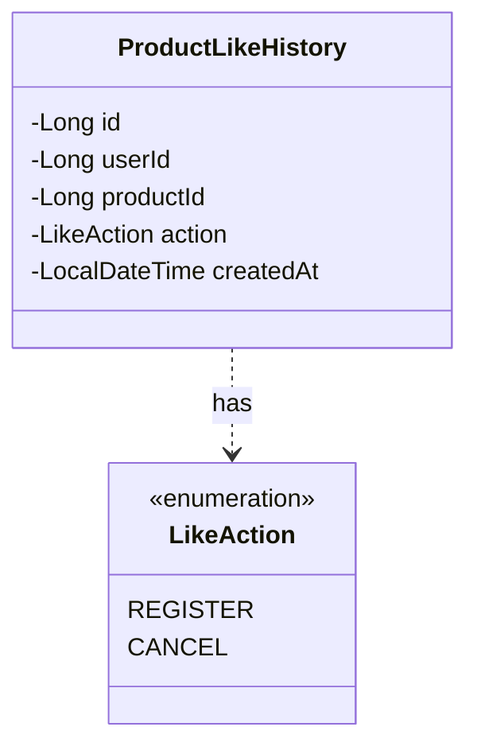
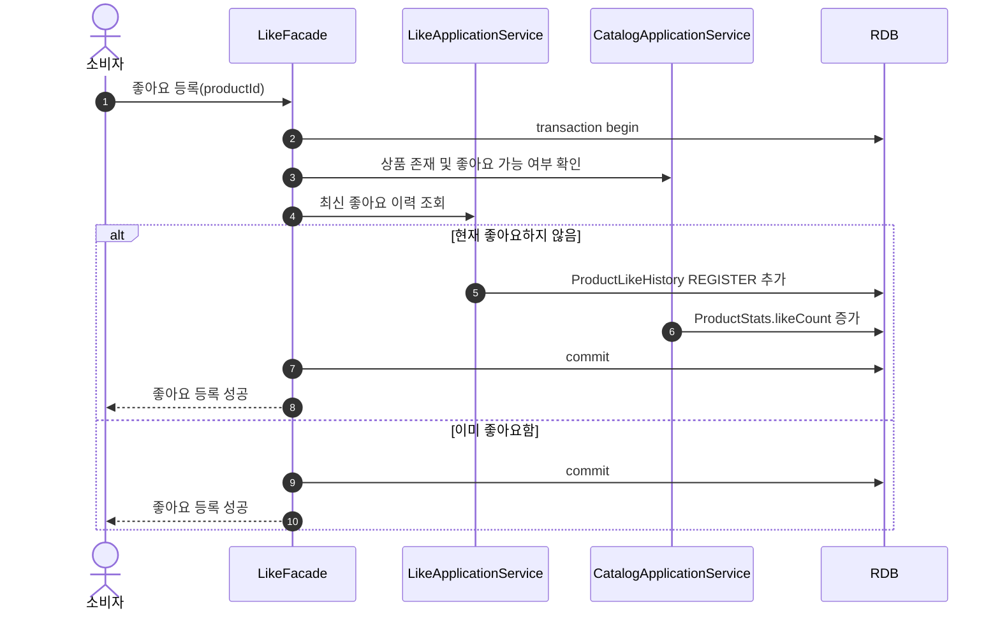
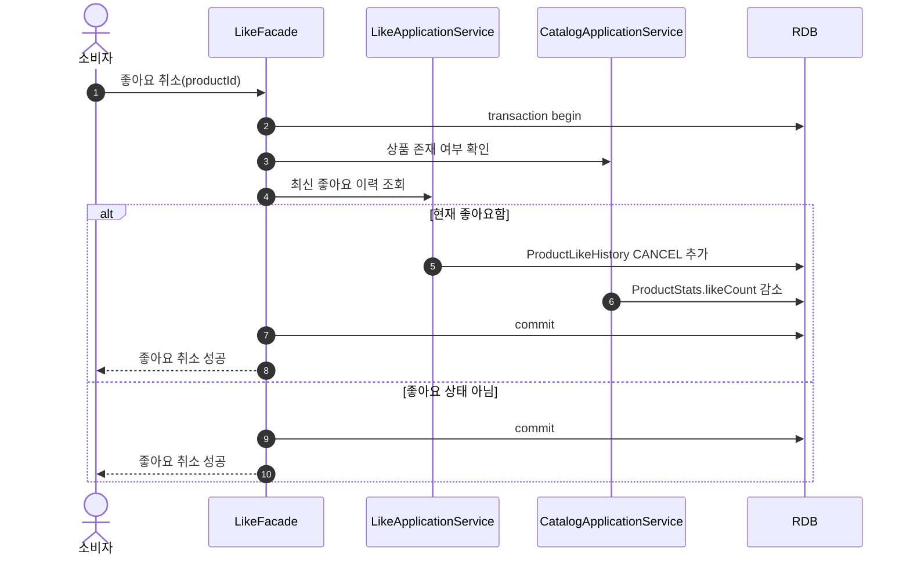

# Like Context 설계

## 1. 설계 기준

이 문서는 `docs/HLD.md`의 상품 좋아요 등록/취소 요구사항을 기준으로 Like Context를 정의한다.

현재 설계의 우선순위는 단순함과 이력 보존이다.

- Like는 소비자와 상품 사이의 선호 표현을 관리한다.
- Like는 좋아요 등록/취소 이력을 append-only record로 남긴다.
- Like는 Product 정보를 소유하지 않고 `productId`만 참조한다.
- Catalog는 상품별 좋아요 수 집계를 소유한다.
- Like Context는 Catalog의 `ProductStats`를 직접 수정하지 않는다.

## 2. Context 경계

### Like가 소유하는 것

- `ProductLikeHistory`: 소비자가 상품에 좋아요를 등록하거나 취소한 이력
- 사용자별 상품 좋아요 현재 상태 계산

### Like가 소유하지 않는 것

- 상품명, 가격, 브랜드, 전시 상태
- 상품별 좋아요 수 집계 저장
- 좋아요 기반 추천
- 관리자 통계 리포트

Catalog는 상품 조회에 필요한 `likeCount`를 `ProductStats`로 가진다. Like는 실제 좋아요 상태 전이가 발생했을 때 application/facade를 통해 Catalog의 집계 변경 command를 요청한다.

## 3. Ubiquitous Language

| 용어 | 의미 |
| :--- | :--- |
| Like | 소비자가 상품에 선호를 표시하는 행위 |
| 좋아요 등록 | 현재 좋아요하지 않은 상품에 좋아요 상태를 만드는 행위 |
| 좋아요 취소 | 현재 좋아요한 상품의 좋아요 상태를 끝내는 행위 |
| ProductLikeHistory | 좋아요 등록/취소가 실제로 발생한 이력 record |
| Current Like State | 특정 소비자와 상품 사이의 현재 좋아요 여부 |
| Like Count | 상품별 현재 좋아요 수 집계. Catalog가 소유한다 |

## 4. 모델

### 이유

좋아요는 사용자별 현재 상태도 중요하지만, 이후 추천이나 분석에 사용할 수 있도록 등록/취소 이력을 잃지 않아야 한다. 따라서 현재 상태를 덮어쓰는 테이블이 아니라 상태 전이를 이력 record로 저장한다.

### 다이어그램



### 해석

`ProductLikeHistory`는 append-only record다. 좋아요 등록이나 좋아요 취소가 실제 상태 전이를 만들 때만 새 record를 추가한다.

현재 좋아요 여부는 `(userId, productId)`의 가장 최근 `ProductLikeHistory`로 판단한다. 같은 시각에 여러 record가 생기는 경우를 피하기 위해 최신 record 기준은 `createdAt DESC, id DESC`로 둔다.

별도 current-state 테이블은 현재 범위에 포함하지 않는다. 조회 성능 문제가 생기면 Like Context 내부 projection으로 추가할 수 있지만, 그 projection도 이력 record를 대체하지 않는다.

## 5. 좋아요 등록/취소 규칙

좋아요 등록은 멱등이다.

- 최신 이력이 없으면 `REGISTER` record를 추가한다.
- 최신 이력이 `CANCEL`이면 `REGISTER` record를 추가한다.
- 최신 이력이 `REGISTER`이면 아무 record도 추가하지 않는다.

좋아요 취소도 멱등이다.

- 최신 이력이 `REGISTER`이면 `CANCEL` record를 추가한다.
- 최신 이력이 없으면 아무 record도 추가하지 않는다.
- 최신 이력이 `CANCEL`이면 아무 record도 추가하지 않는다.

Catalog 좋아요 수 집계는 실제 상태 전이가 발생한 경우에만 변경한다.

- 좋아요 등록 전이가 발생하면 `increaseLikeCount(productId)`를 요청한다.
- 좋아요 취소 전이가 발생하면 `decreaseLikeCount(productId)`를 요청한다.
- 멱등 요청으로 상태가 변하지 않으면 Catalog 집계도 변경하지 않는다.

## 6. 주요 흐름

### 좋아요 등록

#### 이유

좋아요 등록은 Like 이력 생성과 Catalog 집계 증가가 같은 use case 안에서 성공해야 한다.

#### 다이어그램



#### 해석

이미 좋아요한 상품에 대한 등록 요청은 성공으로 응답하지만 이력과 집계를 바꾸지 않는다.

### 좋아요 취소

#### 이유

좋아요 취소도 이력 기반으로 상태 전이를 남겨야 하며, 중복 취소 요청은 집계를 감소시키면 안 된다.

#### 다이어그램



#### 해석

좋아요 취소는 상품이 삭제되었더라도 기존 사용자 상태를 정리할 수 있어야 한다. 따라서 등록은 Catalog 기준 좋아요 가능 여부를 확인하지만, 취소는 상품 존재 여부만 확인한다.

## 7. 조회 계약

상품 목록과 상품 상세는 Like Context의 이력 record를 직접 읽지 않는다.

조회 use case는 필요한 상품 ID 목록에 대해 Like Context에 현재 좋아요 상태를 요청한다.

```text
getLikedProductIds(userId, productIds)
isLiked(userId, productId)
```

Like Context는 각 `(userId, productId)`의 최신 이력을 기준으로 현재 좋아요 여부를 반환한다.

## 8. 동시성 원칙

같은 소비자가 같은 상품에 동시에 좋아요 등록/취소 요청을 보낼 수 있다.

기본 처리는 `(userId, productId)` 단위 최신 이력을 조회한 뒤 새 이력을 추가하는 방식이다. 같은 transaction 안에서 같은 사용자와 상품의 최신 이력 범위를 잠그고 판단한다.

중복 요청으로 인해 같은 상태 전이가 두 번 기록되면 Catalog 집계가 틀어질 수 있으므로, 실제 구현에서는 다음 중 하나를 선택한다.

- `(userId, productId)` 단위 lock row를 둔다.
- 최신 이력 조회를 pessimistic lock으로 처리할 수 있는 구조를 둔다.

현재 설계에서는 첫 번째 방식을 기본으로 한다. `ProductLikeCursor`는 좋아요 상태를 저장하는 current-state 모델이 아니라 동시성 제어용 cursor다.

```text
ProductLikeCursor
- userId
- productId
- lastHistoryId
```

`lastHistoryId`는 최신 이력 판단과 lock 획득을 위한 값이며, 좋아요 이력의 원천은 항상 `ProductLikeHistory`다.

## 9. 영속성 모델

### `product_like_histories`

| 컬럼 | 의미 |
| :--- | :--- |
| `id` | 물리 PK |
| `user_id` | 소비자 식별자 |
| `product_id` | 상품 식별자 |
| `action` | `REGISTER`, `CANCEL` |
| `created_at` | 생성 시각 |

조회 기준:

- `(user_id, product_id, created_at, id)` 기준으로 최신 이력을 조회한다.
- 이력 record는 domain command로 삭제하지 않는다.

### `product_like_cursors`

| 컬럼 | 의미 |
| :--- | :--- |
| `id` | 물리 PK |
| `user_id` | 소비자 식별자 |
| `product_id` | 상품 식별자 |
| `last_history_id` | 최신 이력 record 식별자 |
| `created_at` | 생성 시각 |
| `updated_at` | 수정 시각 |

제약과 조회 기준:

- `(user_id, product_id)`는 unique다.
- 좋아요 등록/취소 command는 이 row를 lock한 뒤 최신 상태를 판단한다.

## 10. 현재 제외하는 것

다음은 현재 Like 설계 범위에 포함하지 않는다.

- 좋아요한 상품 모아보기 전용 화면
- 추천 모델
- 관리자 분석 리포트
- Like history 보관 기간 정책
- 비회원 좋아요
