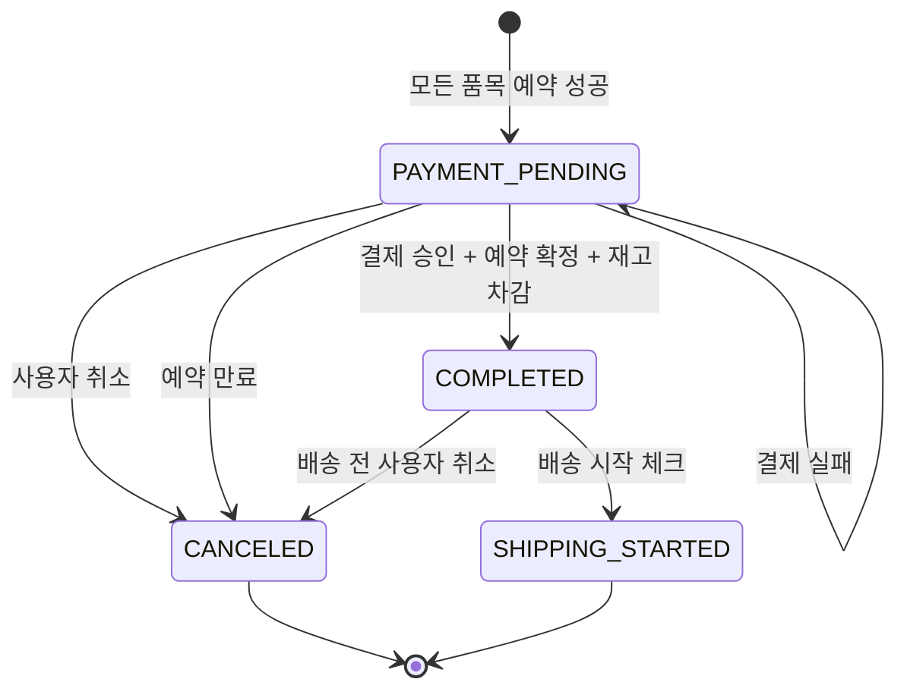
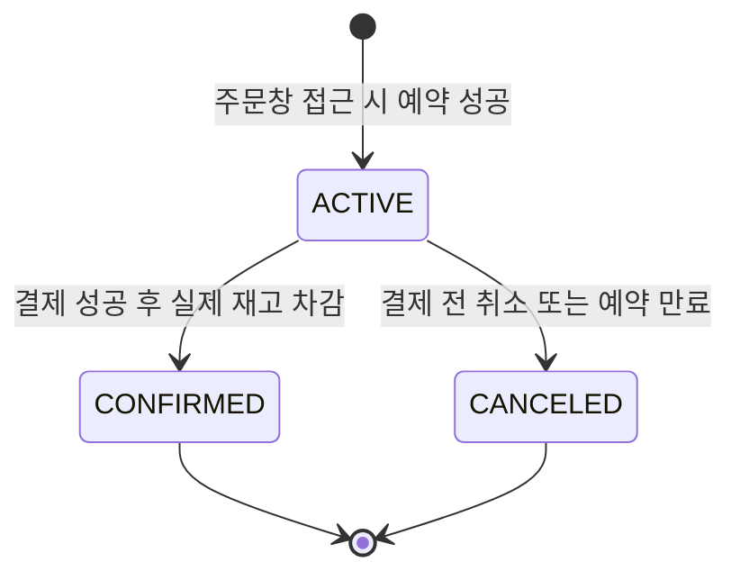
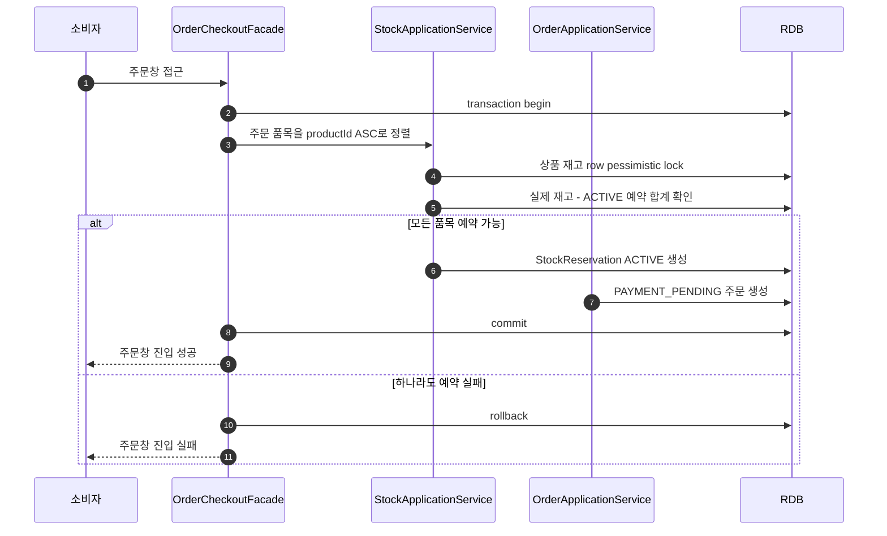
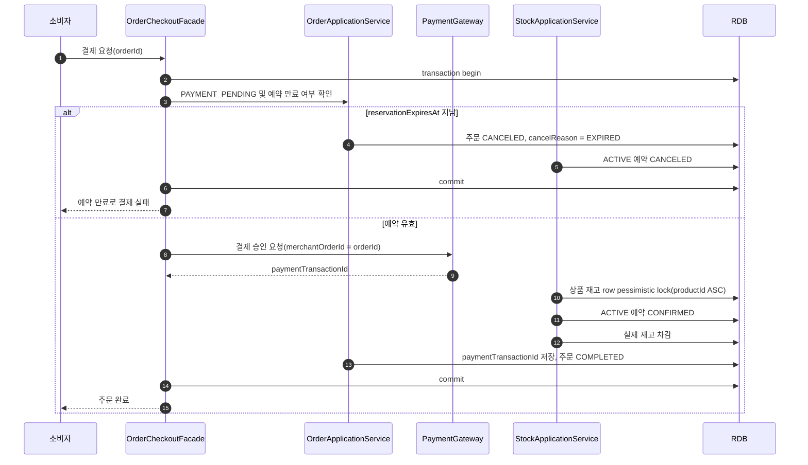
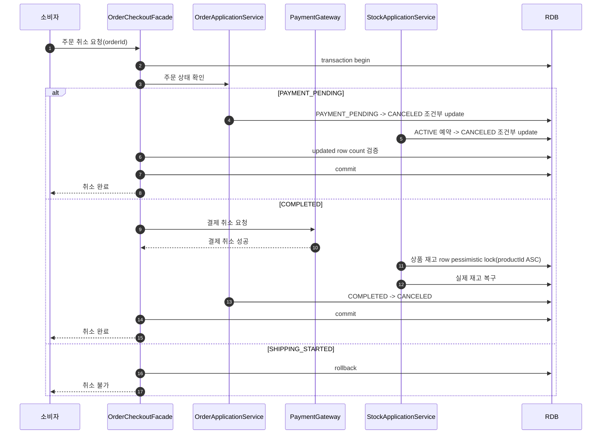

# 주문 생명주기 설계

## 1. 설계 기준

이 문서는 `docs/HLD.md`의 주문 생성 및 결제 흐름을 기준으로 주문 생명주기를 정의한다.

- 쇼핑카트는 재고를 확인하지만 예약하지 않는다.
- 주문창 접근 시 모든 주문 품목의 재고 예약이 성공해야 `결제대기` 주문이 생성된다.
- 결제 실패는 주문 상태를 변경하지 않는다.
- 결제 성공 후 예약 확정, 실제 재고 차감, 주문 완료가 같은 요청 흐름 안에서 처리된다.
- 예약 만료는 자동 주문 취소로 처리한다.
- 배송 시작 전까지만 주문 취소가 가능하다.

현재 시스템은 모놀리식 구조와 단일 RDB를 전제로 한다. 요청 1회당 하나의 transaction을 사용하며, 외부 결제 요청 중에도 transaction을 유지하는 리스크는 현재 단계에서 감수한다.

## 2. 서비스 경계

추후 분리가 쉬워지도록 use case 조율과 도메인별 처리는 application 레이어에서 나눈다.

- `OrderCheckoutFacade`: 주문창 진입, 결제 요청, 주문 취소 등 bounded context를 넘는 use case를 조율한다.
- `OrderApplicationService`: 주문 생성, 주문 상태 전이, 주문 스냅샷 관리를 담당한다.
- `StockApplicationService`: 재고 확인, 재고 예약, 예약 취소, 예약 확정, 실제 재고 차감/복구를 담당한다.
- `PaymentGateway`: 외부 결제 승인과 결제 취소를 담당한다.

주문 도메인 모델은 재고와 결제의 구현을 알지 않는다. 주문은 자기 상태 전이 규칙만 가진다.

## 3. 주문 상태

주문 상태는 다음 네 가지로 둔다.

```text
OrderStatus
- PAYMENT_PENDING
- COMPLETED
- CANCELED
- SHIPPING_STARTED
```

`PAYMENT_PENDING`은 주문이 생성되었지만 아직 계약이 체결되지 않은 상태다. 모든 주문 품목의 재고 예약이 성공한 뒤에만 생성된다.

`COMPLETED`는 외부 결제 승인, 예약 확정, 실제 재고 차감, 주문 완료가 모두 끝난 상태다.

`CANCELED`는 주문 취소의 최종 상태다. 결제 전 취소, 예약 만료, 결제 후 배송 전 취소가 모두 이 상태로 수렴한다.

`SHIPPING_STARTED`는 관리자가 배송 시작을 체크한 상태다. 이후 소비자 취소는 불가능하다.

### 주문 상태 전이

#### 이유

결제 실패, 예약 만료, 배송 시작 전 취소가 주문 상태에 어떤 영향을 주는지 한눈에 확인하기 위해 주문 상태 전이를 별도로 표현한다.

#### 다이어그램



#### 해석

결제 실패는 주문 상태를 바꾸지 않는다. `PAYMENT_PROCESSING` 같은 중간 상태도 두지 않는다. 현재 transaction 모델에서는 결제 처리 중 상태를 안정적으로 관측할 수 없기 때문이다.

예약 만료는 별도 `EXPIRED` 주문 상태가 아니라 `CANCELED` 상태와 취소 사유로 표현한다.

## 4. 재고 예약 상태

재고 예약은 실제 재고 차감과 분리된 원장으로 저장한다.

```text
StockReservationStatus
- ACTIVE
- CONFIRMED
- CANCELED
```

`ACTIVE`는 결제대기 주문이 잡고 있는 예약이다. 활성 예약 합산 대상이다.

`CONFIRMED`는 결제 성공 후 실제 재고 차감에 사용된 예약이다. 결제 후 주문 취소가 발생해도 `CONFIRMED`로 유지한다.

`CANCELED`는 결제 전 사용자 취소 또는 예약 만료로 해제된 예약이다. 만료도 별도 상태 없이 `CANCELED`로 처리한다.

### 예약 상태 전이

#### 이유

예약 원장은 주문 상태와 다르게 실제 재고 차감에 사용되었는지 여부를 보존해야 한다.

#### 다이어그램



#### 해석

`CONFIRMED`는 차감 이력이다. `COMPLETED` 주문이 배송 전 취소되어 실제 재고가 복구되어도 예약 상태는 `CONFIRMED`로 유지한다.

## 5. 주문창 접근 흐름

#### 이유

주문창 접근은 재고 예약과 `PAYMENT_PENDING` 주문 생성을 하나의 성공 단위로 묶는다. 하나의 품목이라도 예약에 실패하면 주문은 생성되지 않는다.

#### 다이어그램



#### 해석

예약 가능 수량은 저장된 단일 값이 아니라 `실제 재고 - ACTIVE 예약 합계`로 판단한다. 여러 상품을 예약할 때는 deadlock 위험을 줄이기 위해 항상 같은 순서로 재고 row lock을 잡는다. 기본 순서는 `productId ASC`다.

## 6. 결제 성공 흐름

#### 이유

결제 성공 이후 내부 처리 실패가 발생할 수 있으므로, 외부 결제 성공 결과를 재시도할 수 있는 구조가 필요하다.

#### 다이어그램



#### 해석

결제 요청 시점에 예약이 이미 만료되었다면 외부 결제 승인을 시도하지 않는다. scheduler가 아직 만료 처리를 하지 않았더라도 결제 use case에서 한 번 더 방어한다.

외부 결제 승인 성공 후 내부 DB 처리에서 실패하면 transaction은 rollback된다. 이 실패는 정상 비즈니스 상태가 아니라 장애 케이스로 본다. 이 경우 외부 결제 시스템의 성공 결과를 `orderId` 기준으로 다시 조회하거나 재전달받아 같은 완료 처리를 재시도한다.

## 7. 주문 취소 흐름

#### 이유

결제 전 취소와 결제 후 취소는 같은 `CANCELED` 상태로 수렴하지만 부수효과가 다르다.

#### 다이어그램



#### 해석

`PAYMENT_PENDING` 취소는 실제 재고 수량을 변경하지 않는다. 재고 row lock은 잡지 않고 주문과 예약 row를 조건부 update한 뒤 update된 row 수를 검증한다.

`COMPLETED` 취소는 외부 결제 취소가 성공한 뒤 실제 재고를 복구하고 주문을 `CANCELED`로 전이한다. 이때 예약은 `CONFIRMED`로 유지한다.

외부 결제 취소 성공 후 내부 DB 처리에서 실패하면 transaction은 rollback된다. 이 실패도 정상 비즈니스 상태가 아니라 장애 케이스로 본다. 같은 취소 요청이 다시 들어오면 외부 결제 취소는 같은 `paymentTransactionId` 기준으로 멱등 성공해야 하고, 내부 처리는 다시 재고 복구와 주문 취소를 수행한다.

## 8. 예약 만료 처리

예약 만료 기준 시각은 주문에 둔다.

```text
Order.reservationExpiresAt
```

한 주문의 모든 예약은 같은 생명주기를 가지므로 `StockReservation.expiresAt`은 두지 않는다.

예약 만료는 batch 또는 scheduler가 처리한다. 구체적인 실행 주기나 retry interval은 이 문서에서 정하지 않는다.

```text
대상:
- Order.status = PAYMENT_PENDING
- Order.reservationExpiresAt < now

처리:
- Order.status = CANCELED
- Order.cancelReason = EXPIRED
- StockReservation.status = CANCELED
```

만료 처리는 결제 전 취소와 같은 규칙을 사용한다. 재고 row lock은 잡지 않고 조건부 update와 updated row count 검증으로 경합을 감지한다.

## 9. 결제 멱등성과 재시도

외부 결제 요청에는 우리 주문 식별자를 넘긴다.

```text
merchantOrderId = orderId
```

성공한 외부 결제 식별자는 주문에 직접 저장한다.

```text
Order.paymentTransactionId
```

별도 `PaymentRecord` 또는 `PaymentAttempt`는 현재 범위에서 만들지 않는다.

멱등 규칙은 다음과 같다.

- `PAYMENT_PENDING` 주문에 결제 성공 결과가 들어오면 예약 확정, 실제 재고 차감, `paymentTransactionId` 저장, 주문 완료를 처리한다.
- 이미 `COMPLETED`이고 같은 `paymentTransactionId`면 성공으로 응답한다.
- 이미 `COMPLETED`인데 다른 `paymentTransactionId`면 충돌로 본다.
- `CANCELED` 또는 `SHIPPING_STARTED` 주문에 결제 성공 결과가 들어오면 자동 완료하지 않고 충돌 또는 수동 확인 대상으로 본다.

transaction rollback으로 `paymentTransactionId`가 우리 DB에 저장되지 않을 수 있다. 이때 durable source는 외부 결제 시스템의 결제 성공 기록이다. 외부 결제 시스템은 `merchantOrderId = orderId` 기준으로 성공 결과를 다시 전달하거나 조회할 수 있어야 한다.

## 10. 동시성 원칙

lost update 가능성이 있는 재고 수량 변경은 pessimistic lock으로 해결한다.

적용 대상은 다음과 같다.

- 재고 예약 생성 시 가용 재고 검증
- 결제 성공 시 실제 재고 차감
- 결제 후 주문 취소 시 실제 재고 복구
- 관리자 재고 추가
- 그 외 `stock.quantity`를 변경하는 use case

여러 상품을 다루는 use case에서는 항상 같은 순서로 lock을 획득한다.

```text
productId ASC
```

`PAYMENT_PENDING` 취소와 예약 만료는 실제 재고 수량을 변경하지 않으므로 재고 row lock을 잡지 않는다. 대신 주문과 예약 상태 전이를 조건부 update로 처리하고, updated row count를 검증한다.

```sql
update orders
set status = 'CANCELED',
    cancel_reason = :reason
where id = :orderId
  and status = 'PAYMENT_PENDING';

update stock_reservations
set status = 'CANCELED'
where order_id = :orderId
  and status = 'ACTIVE';
```

기대한 row 수와 실제 update된 row 수가 다르면 다른 상태 전이와 경합한 것으로 보고 rollback한다.

주문 상태 전이는 항상 현재 상태를 조건으로 둔다. 예를 들어 배송 시작은 `COMPLETED -> SHIPPING_STARTED`, 결제 후 취소는 `COMPLETED -> CANCELED` 조건을 만족할 때만 성공한다. 조건을 만족하지 않으면 이미 다른 상태 전이가 먼저 일어난 것으로 본다.

## 11. 모델 요약

```text
Order
- id
- status
- reservationExpiresAt
- paymentTransactionId
- cancelReason
- deliveryAddress
- deliveryRequest
- phoneNumber
- orderItems

OrderItem
- orderId
- productId
- productNameSnapshot
- brandNameSnapshot
- priceSnapshot
- quantity

StockReservation
- id
- orderId
- productId
- quantity
- status
```

주문 스냅샷은 상품이나 브랜드가 수정되거나 삭제되어도 변경하지 않는다.
