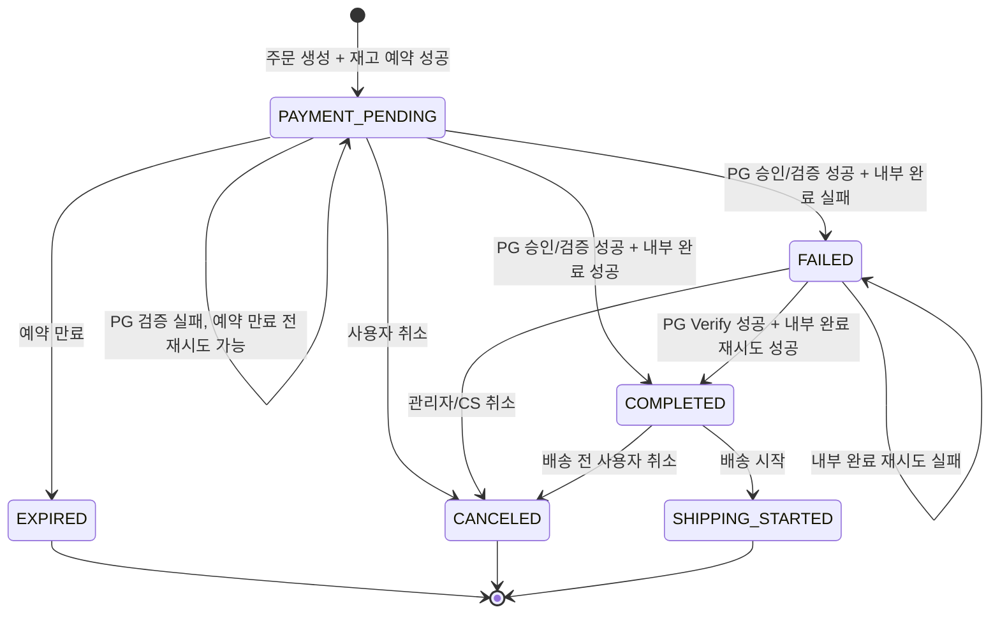
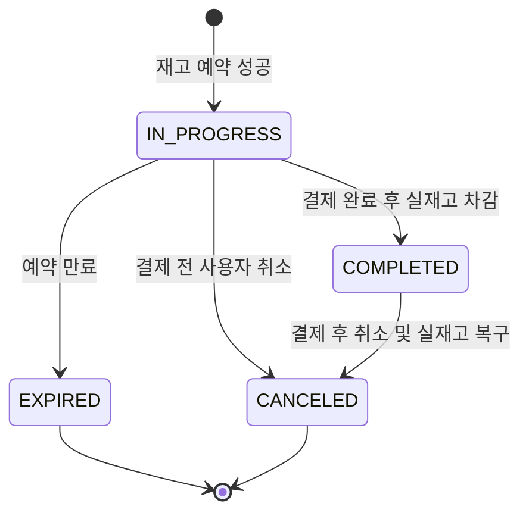

# 주문/결제/재고 예약 설계 v2

## 1. 설계 범위

이 문서는 주문, 결제, 재고 예약의 정합성을 보장하기 위한 v2 설계를 정의한다.

### 포함 범위

- 결제 시스템 조작 방지를 위한 결제 검증 절차
- 재고 예약과 실재고 차감의 동시성 제어
- 결제가 지연된 예약 재고 반환
- 사용자 취소 또는 예약 재고 반환 시 보상 트랜잭션을 통한 상태 복구
- 주문, 결제, 예약 상태 모델
- DB 테이블 설계

### 제외 범위

- API 엔드포인트, request/response DTO 설계
- 정산 및 결제 대사 과정
- 네트워크 오류 발생 시 상세 처리 과정
- 외부 PG사별 실제 연동 프로토콜

## 2. 핵심 원칙

### 외부 네트워크 호출과 DB 트랜잭션 분리

PG 승인, 검증, 취소 같은 모든 외부 네트워크 호출은 DB 트랜잭션 밖에서 실행한다.

외부 호출 전후로 트랜잭션이 끊기기 때문에 중간 상태는 주문, 결제, 예약 상태 전이로 관리한다. 네트워크 호출 중 애플리케이션이 종료되더라도 이후 상태를 기준으로 재시도하거나 수동 처리할 수 있어야 한다.

### 재고 변경은 조건부 atomic update 사용

재고 예약, 예약 확정, 예약 만료, 사용자 취소, 결제 후 재고 복구는 모두 조건부 atomic update로 처리한다.

변경되어야 하는 row가 변경되지 않았거나, expected affected row 수와 실제 affected row 수가 다르면 동시성 충돌로 판단한다. 이 경우 해당 DB 트랜잭션은 롤백한다.

### 결제 이력은 append-only 이벤트로 남긴다

`payments`는 주문별 현재 유효한 결제 상태를 표현한다. 사용자 결제 상태 추적과 결제 조작 방지를 위해 조회되는 현재 projection이다.

`payment_events`는 모든 결제 시도를 append-only로 남기는 감사 로그다. 이벤트는 수정하지 않는다.

### DB FK는 사용하지 않는다

논리 관계는 애플리케이션에서 관리한다. 모든 테이블에는 DB 레벨 FK를 걸지 않는다.

## 3. 전체 주문 흐름

사용자 주문 흐름은 다음 순서를 따른다.

```text
주문창 진입
-> 주문 정보 생성 및 재고 예약
-> 사용자 결제 요청 정보 생성
-> 외부 PG 결제
-> PG 결제 승인/검증
-> 예약 재고 확정 및 실재고 감소
-> 주문 완료
```

각 단계는 독립된 DB 트랜잭션을 가질 수 있다. 트랜잭션 경계 사이의 불일치는 상태 기반 재시도와 보상 트랜잭션으로 복구한다.

## 4. 주문 상태

```text
OrderStatus
- PAYMENT_PENDING
- COMPLETED
- FAILED
- EXPIRED
- CANCELED
- SHIPPING_STARTED
```

`PAYMENT_PENDING`은 주문이 생성되고 재고 예약이 완료되었지만 아직 결제와 주문 완료 처리가 끝나지 않은 상태다.

`COMPLETED`는 PG 결제 승인 또는 검증, 예약 재고 확정, 실재고 차감, 주문 완료 처리가 모두 끝난 상태다.

`FAILED`는 PG 결제 승인 또는 검증은 성공했지만 내부 완료 처리에 실패한 상태다. 내부 완료 처리는 예약 재고 확정, 실재고 차감, 주문 완료 상태 변경을 의미한다. `FAILED` 주문은 사용자 직접 취소 대상이 아니며, 사용자/관리자/배치 재시도 또는 CS 수동 처리 대상이다.

`EXPIRED`는 결제 대기 중 예약 시간이 만료되어 주문이 더 이상 진행될 수 없는 상태다.

`CANCELED`는 사용자가 취소했거나 관리자/CS가 취소 처리한 상태다.

`SHIPPING_STARTED`는 배송이 시작되어 사용자 취소가 불가능한 상태다.

### 주문 상태 전이



## 5. 예약 상태

```text
StockReservationStatus
- IN_PROGRESS
- EXPIRED
- CANCELED
- COMPLETED
```

`IN_PROGRESS`는 주문이 결제 완료 전 확보한 예약 재고다.

`EXPIRED`는 예약 만료로 반환된 예약이다.

`CANCELED`는 사용자 취소, 관리자/CS 취소, 결제 후 취소로 무효화된 예약이다. 결제 전 취소와 결제 후 취소를 별도 상태로 분리하지 않는다.

`COMPLETED`는 예약된 재고가 실제 판매 재고 차감으로 확정된 상태다.

### 예약 상태 전이



## 6. 결제 상태

```text
PaymentStatus
- READY
- APPROVED
- VERIFY_FAILED
- COMPLETION_FAILED
- EXPIRED
- CANCELED
```

`READY`는 외부 결제 요청 정보가 생성되었지만 아직 PG 승인/검증이 완료되지 않은 상태다.

`APPROVED`는 PG 승인 또는 검증이 성공했고, 결제 금액과 주문 식별자 검증을 통과한 상태다.

`VERIFY_FAILED`는 PG 승인 또는 검증 결과가 주문 정보와 일치하지 않거나 결제 승인이 거절된 상태다.

처리 방침:

- 주문 완료 처리를 진행하지 않는다.
- 예약 재고는 즉시 반환하지 않고 기존 예약 만료 정책에 맡긴다.
- 주문이 `PAYMENT_PENDING`이고 예약이 만료되지 않았다면 사용자는 결제 인증을 다시 시도할 수 있다.
- 예약 만료 시 주문은 `EXPIRED`, 예약은 `EXPIRED`, 결제는 `EXPIRED`로 전환한다.
- 네트워크 오류는 이 상태로 분류하지 않는다.

`COMPLETION_FAILED`는 PG 결제는 승인되었지만 주문 완료 또는 재고 확정 처리에 실패한 상태다.

처리 방침:

- 주문은 `FAILED` 상태로 남긴다.
- 예약 재고는 반환하지 않고 `IN_PROGRESS`로 유지한다.
- 사용자, 관리자, 배치 재시도로 PG 상태를 Verify 한 뒤 주문 완료 처리를 다시 시도한다.
- 자동 환불 및 정산 대사는 현재 범위 밖이다.
- `completion_retry_count >= 3`이면 더 이상 자동/사용자 재시도를 진행하지 않고 수동 처리 대상으로 본다.

`EXPIRED`는 예약 만료로 해당 결제 요청이 더 이상 유효하지 않은 상태다.

`CANCELED`는 결제 요청 또는 승인된 결제가 취소된 상태다.

## 7. PG Provider

PG사는 결제 식별자의 namespace로 저장한다.

```text
PgProvider
- FAKE
```

현재 구현 대상은 `FAKE`만 둔다. 추후 실제 PG사가 추가되더라도 `payment_key`, `pg_transaction_id`의 유일성은 PG사별로 판단한다.

## 8. 결제 요청 command 위치

PG 관련 요청을 다루는 인터페이스와 구현 클래스는 결제 영역에 둔다. PG command도 결제 영역에 위치한다.

사용자 요청 처리, 관리자 처리, 배치는 각각 필요한 방식으로 동일한 결제 command를 호출한다. 구체적인 API 설계는 이 문서 범위에 포함하지 않는다.

PG command에는 `Approve`와 `Verify`의 차이를 주석으로 명확히 남긴다.

`Approve`는 사용자가 PG 결제를 마친 직후, 클라이언트가 전달한 `paymentKey`를 서버가 PG에 제출해 이 결제를 우리 주문의 결제로 승인해도 되는지 확인하고 승인 처리하는 요청이다. 성공 시 최초 PG 거래 식별자가 확정될 수 있다.

`Verify`는 이미 승인되었거나 승인되었을 가능성이 있는 결제 건을 기준으로 PG의 현재 결제 상태와 금액, 주문 식별자를 재검증하는 요청이다. 주문 복구, 재시도, 관리자 처리, 배치 처리에서 사용한다. 새 결제를 만들거나 중복 승인하는 목적이 아니다.

## 9. 결제 승인과 내부 완료 처리

PG사가 제공한 `payment_key`는 PG 승인 호출 직전에 별도 DB 트랜잭션으로 저장한다.

```text
1. 결제 요청 생성
   - payment_request_id 저장
   - requested_amount 저장
   - payment.status = READY

2. 사용자가 PG 결제 수행

3. 결제 승인 요청 진입
   - 별도 트랜잭션으로 PG payment_key 저장
   - payment_events에 APPROVE_REQUESTED 기록
   - 커밋

4. PG approve 호출
   - DB 트랜잭션 밖에서 실행

5. PG 응답 저장 및 검증 결과 반영
   - 성공: payment.status = APPROVED
   - 검증 실패: payment.status = VERIFY_FAILED
   - payment_events append

6. 내부 완료 처리
   - 예약 확정
   - 실재고 차감
   - reservation.status = COMPLETED
   - order.status = COMPLETED
```

PG 승인 또는 Verify는 성공했지만 내부 완료 처리에 실패하면 다음 상태로 둔다.

```text
order.status = FAILED
payment.status = COMPLETION_FAILED
reservation.status = IN_PROGRESS
```

`FAILED` 주문은 예약 만료 대상에서 제외한다. 이미 결제 승인 성공 가능성이 있는 상태이므로 예약 재고를 자동 반환하지 않는다.

## 10. FAILED 재시도 정책

`FAILED` 주문은 `reservation_expires_at`이 지났더라도 재시도를 허용한다.

재시도는 PG Verify를 먼저 수행한 뒤 내부 완료 처리를 다시 실행한다.

```text
재시도 허용 조건:
- order.status = FAILED
- payment.status = COMPLETION_FAILED
- payment.completion_retry_count < 3
- PG Verify 성공
```

재시도에 실패하면 `payment.completion_retry_count`를 증가시킨다.

`completion_retry_count >= 3`이면 더 이상 자동/사용자 재시도를 진행하지 않는다. 이 경우 상세 error 로그를 남기고 개발자 조사 또는 CS 수동 처리 대상으로 전환한다.

error 로그에는 최소한 다음 정보를 포함한다.

- orderId
- paymentId
- pgProvider
- pgTransactionId
- reservationIds
- productId별 quantity
- failure reason
- stack trace
- retryCount

## 11. 예약 재고 처리

`product_stock`은 실제 재고 수량과 예약 수량을 함께 가진다.

```text
stock_quantity
reserved_quantity
```

가용 수량은 다음처럼 계산한다.

```text
available_quantity = stock_quantity - reserved_quantity
```

### 예약 생성

예약 생성은 상품별 조건부 atomic update가 모두 성공한 뒤 예약 row를 생성한다.

```sql
UPDATE product_stock
   SET reserved_quantity = reserved_quantity + :quantity
 WHERE product_id = :productId
   AND deleted_at IS NULL
   AND stock_quantity - reserved_quantity >= :quantity;
```

처리 순서:

```text
1. 상품별 product_stock.reserved_quantity 조건부 증가
2. 모든 상품의 affectedRows == 1 확인
3. stock_reservations IN_PROGRESS 생성
4. 하나라도 실패하면 전체 롤백
```

### 예약 확정

결제 완료 후 실재고 차감은 `product_stock` 확정 atomic update를 먼저 수행하고, 성공한 뒤 `stock_reservations`를 `COMPLETED`로 변경한다.

```sql
UPDATE product_stock
   SET stock_quantity = stock_quantity - :quantity,
       reserved_quantity = reserved_quantity - :quantity
 WHERE product_id = :productId
   AND deleted_at IS NULL
   AND stock_quantity >= :quantity
   AND reserved_quantity >= :quantity;
```

처리 순서:

```text
1. IN_PROGRESS 예약 목록 조회
2. productId별 quantity 합계 계산
3. product_stock 확정 atomic update
4. 모든 상품 affectedRows == 1 확인
5. stock_reservations IN_PROGRESS -> COMPLETED 조건부 atomic update
6. affectedRows == expected reservation count 확인
7. 실패 시 전체 롤백
```

### 예약 만료

예약 만료는 `PAYMENT_PENDING` 주문만 대상으로 한다. `FAILED` 주문은 만료 대상에서 제외한다.

```text
만료 대상:
- order.status = PAYMENT_PENDING
- reservation.status = IN_PROGRESS
- now >= reservation_expires_at

만료 제외:
- order.status = FAILED
```

처리 결과:

```text
order.status = EXPIRED
reservation.status = EXPIRED
payment.status = EXPIRED
```

예약 만료 처리 순서:

```text
1. IN_PROGRESS 예약 목록 조회
2. reservation ids, productId별 quantity 합계, expected reservation count 계산
3. stock_reservations IN_PROGRESS -> EXPIRED 조건부 atomic update
4. affectedRows == expected reservation count 확인
5. product_stock.reserved_quantity 감소 조건부 atomic update
6. 모든 상품 affectedRows == 1 확인
7. order.status = EXPIRED
8. payment.status = EXPIRED
9. payment_events append
10. 실패 시 전체 롤백
```

### 결제 전 사용자 취소

사용자가 `PAYMENT_PENDING` 주문을 취소하면 PG cancel 호출은 하지 않는다.

처리 결과:

```text
order.status = CANCELED
reservation.status = CANCELED
payment.status = CANCELED
```

처리 순서:

```text
1. IN_PROGRESS 예약 목록 조회
2. reservation ids, productId별 quantity 합계, expected reservation count 계산
3. stock_reservations IN_PROGRESS -> CANCELED 조건부 atomic update
4. affectedRows == expected reservation count 확인
5. product_stock.reserved_quantity 감소 조건부 atomic update
6. 모든 상품 affectedRows == 1 확인
7. order.status = CANCELED
8. payment.status = CANCELED
9. payment_events append
10. 실패 시 전체 롤백
```

### 결제 후 사용자 취소

사용자는 `COMPLETED` 주문을 배송 시작 전까지만 취소할 수 있다.

PG cancel은 DB 트랜잭션 밖에서 실행한다. PG cancel 성공 이후 DB 트랜잭션에서 실재고 복구와 상태 전이를 수행한다.

처리 결과:

```text
order.status = CANCELED
reservation.status = CANCELED
payment.status = CANCELED
```

처리 순서:

```text
1. 취소 요청 검증 트랜잭션
   - order.status = COMPLETED 확인
   - payment.status = APPROVED 확인
   - 취소 가능한 PG 거래 식별자 확보
   - payment_events CANCEL_REQUESTED append

2. PG cancel 호출
   - DB 트랜잭션 밖에서 실행

3. 취소 성공 처리 트랜잭션
   - COMPLETED 예약 목록 조회
   - productId별 quantity 합계 계산
   - product_stock.stock_quantity 증가 atomic update
   - 모든 상품 affectedRows == 1 확인
   - stock_reservations COMPLETED -> CANCELED 조건부 atomic update
   - affectedRows == expected reservation count 확인
   - order.status = CANCELED
   - payment.status = CANCELED
   - payment_events CANCEL_SUCCEEDED append
```

PG cancel 성공 후 DB 복구에 실패하면 다음 상태로 남기고 상세 error 로그를 기록한다.

```text
order.status = FAILED
payment.status = COMPLETION_FAILED
```

### 사용자 취소 가능 상태

```text
사용자 취소 가능:
- PAYMENT_PENDING
- COMPLETED, 단 SHIPPING_STARTED 전

사용자 취소 불가:
- FAILED
- EXPIRED
- CANCELED
- SHIPPING_STARTED
```

`FAILED` 주문은 PG 결제 승인 성공 가능성이 있는 상태이므로 사용자 직접 취소를 허용하지 않는다. 관리자 또는 CS 플로우에서 PG Verify 후 취소한다.

## 12. 결제 이벤트 기록 원칙

상태 갱신과 이벤트 append는 같은 DB 트랜잭션에서 처리한다.

```text
1. payments 상태 갱신
2. payment_events append
3. 함께 커밋
```

코드상 이벤트 append는 상태 갱신 뒤에 둔다. 이벤트는 실제 반영된 결과를 설명하는 감사 로그로 사용한다.

## 13. 논리 데이터 관계

```text
orders 1 : 1 payments
orders 1 : N payment_events
payments - payment_events 직접 관계 없음
```

`payment_events.payment_id`는 nullable snapshot 값으로 남긴다. DB FK는 걸지 않는다.

## 14. DB 테이블 설계

컬럼 타입은 구현 시 현재 프로젝트의 JPA 및 MySQL 매핑 규칙에 맞춰 조정한다. 아래 설계는 논리 컬럼과 제약 조건을 정의한다.

### orders

| 컬럼 | 설명 |
| :--- | :--- |
| id | 주문 ID |
| user_id | 주문 사용자 ID |
| status | `OrderStatus` |
| reservation_expires_at | 예약 만료 시각 |
| delivery_address | 배송 주소 |
| delivery_request | 배송 요청 사항 |
| phone_number | 수령자 전화번호 |
| cancel_reason | 취소 사유 |
| created_at | 생성 시각 |
| updated_at | 수정 시각 |
| deleted_at | soft delete 시각 |

추천 index:

```text
idx_orders_status_reservation_expires_at(status, reservation_expires_at)
idx_orders_user_id(user_id)
```

### order_items

| 컬럼 | 설명 |
| :--- | :--- |
| id | 주문 품목 ID |
| order_id | 주문 ID. FK 없음 |
| product_id | 상품 ID. FK 없음 |
| product_name_snapshot | 주문 시점 상품명 |
| brand_name_snapshot | 주문 시점 브랜드명 |
| price_snapshot | 주문 시점 가격 |
| quantity | 주문 수량 |
| created_at | 생성 시각 |
| updated_at | 수정 시각 |
| deleted_at | soft delete 시각 |

추천 index:

```text
idx_order_items_order_id(order_id)
idx_order_items_product_id(product_id)
```

### product_stock

| 컬럼 | 설명 |
| :--- | :--- |
| id | 상품 재고 ID |
| product_id | 상품 ID. FK 없음 |
| stock_quantity | 실제 재고 수량 |
| reserved_quantity | 예약 재고 수량 |
| created_at | 생성 시각 |
| updated_at | 수정 시각 |
| deleted_at | soft delete 시각 |

권장 제약:

```text
uk_product_stock_product_id(product_id)
check(stock_quantity >= 0)
check(reserved_quantity >= 0)
```

추천 index:

```text
idx_product_stock_product_id(product_id)
```

### stock_reservations

| 컬럼 | 설명 |
| :--- | :--- |
| id | 예약 ID |
| order_id | 주문 ID. FK 없음 |
| product_id | 상품 ID. FK 없음 |
| quantity | 예약 수량 |
| status | `StockReservationStatus` |
| created_at | 생성 시각 |
| updated_at | 수정 시각 |
| deleted_at | soft delete 시각 |

추천 index:

```text
idx_stock_reservations_order_status(order_id, status)
idx_stock_reservations_product_status(product_id, status)
idx_stock_reservations_order_id(order_id)
```

### payments

`payments`는 주문별 현재 유효한 결제 상태를 저장한다. 주문당 활성 payment row는 하나만 유지한다.

| 컬럼 | 설명 |
| :--- | :--- |
| id | 결제 ID |
| order_id | 주문 ID. FK 없음 |
| status | `PaymentStatus` |
| pg_provider | `PgProvider` |
| payment_request_id | 서버가 생성한 결제 요청 식별자 |
| payment_key | PG사가 제공한 결제 key |
| pg_transaction_id | PG 승인 후 확정되는 거래 ID |
| requested_amount | 서버가 요청한 결제 금액 |
| approved_amount | PG가 승인한 결제 금액 |
| failure_reason | 마지막 실패 사유 |
| completion_retry_count | 내부 완료 처리 재시도 횟수 |
| approved_at | 승인 시각 |
| canceled_at | 취소 시각 |
| last_failed_at | 마지막 실패 시각 |
| created_at | 생성 시각 |
| updated_at | 수정 시각 |
| deleted_at | soft delete 시각 |

권장 제약:

```text
uk_payments_order_id(order_id)
uk_payments_provider_payment_request_id(pg_provider, payment_request_id)
uk_payments_provider_payment_key(pg_provider, payment_key)
uk_payments_provider_pg_transaction_id(pg_provider, pg_transaction_id)
check(requested_amount >= 0)
check(approved_amount IS NULL OR approved_amount >= 0)
check(completion_retry_count >= 0)
```

MySQL에서는 nullable unique 컬럼에 `NULL`이 여러 개 들어갈 수 있다. `payment_key`, `pg_transaction_id`가 승인 전에는 null일 수 있으므로 이 특성을 허용한다.

추천 index:

```text
idx_payments_status(status)
idx_payments_order_status(order_id, status)
idx_payments_provider_payment_key(pg_provider, payment_key)
idx_payments_provider_pg_transaction_id(pg_provider, pg_transaction_id)
```

### payment_events

`payment_events`는 모든 결제 시도를 append-only로 저장한다. 감사, 추적, 장애 분석, 추후 대사 준비에 사용한다.

| 컬럼 | 설명 |
| :--- | :--- |
| id | 결제 이벤트 ID |
| order_id | 주문 ID. FK 없음 |
| payment_id | 당시 payment ID snapshot. nullable, FK 없음 |
| event_type | `PaymentEventType` |
| pg_provider | `PgProvider` |
| payment_request_id | 서버 결제 요청 식별자 snapshot |
| payment_key | PG payment key snapshot |
| pg_transaction_id | PG 거래 ID snapshot |
| requested_amount | 요청 금액 snapshot |
| approved_amount | 승인 금액 snapshot |
| pg_status | PG 응답 상태 snapshot |
| failure_reason | 실패 사유 |
| raw_response_summary | PG 응답 요약. 민감정보는 저장하지 않는다 |
| created_at | 이벤트 생성 시각 |

추천 이벤트 타입:

```text
PaymentEventType
- REQUEST_CREATED
- APPROVE_REQUESTED
- APPROVE_SUCCEEDED
- APPROVE_FAILED
- VERIFY_REQUESTED
- VERIFY_SUCCEEDED
- VERIFY_FAILED
- CANCEL_REQUESTED
- CANCEL_SUCCEEDED
- CANCEL_FAILED
- COMPLETION_FAILED
- EXPIRED
```

추천 index:

```text
idx_payment_events_order_id(order_id)
idx_payment_events_payment_id(payment_id)
idx_payment_events_event_type(event_type)
idx_payment_events_provider_payment_key(pg_provider, payment_key)
idx_payment_events_provider_pg_transaction_id(pg_provider, pg_transaction_id)
```
