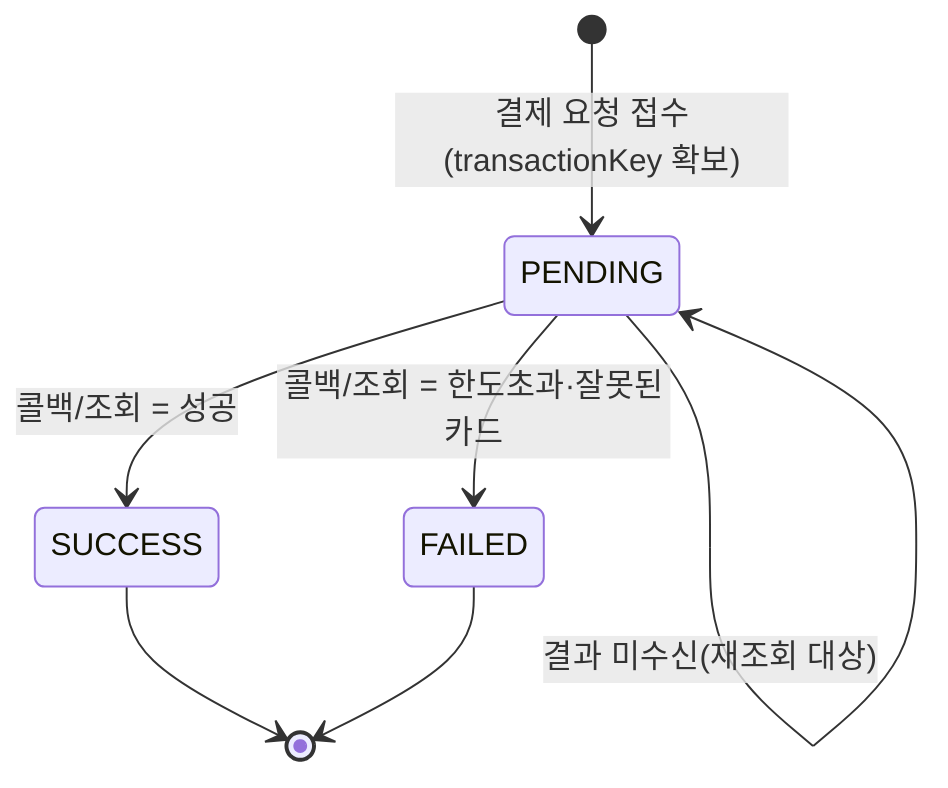
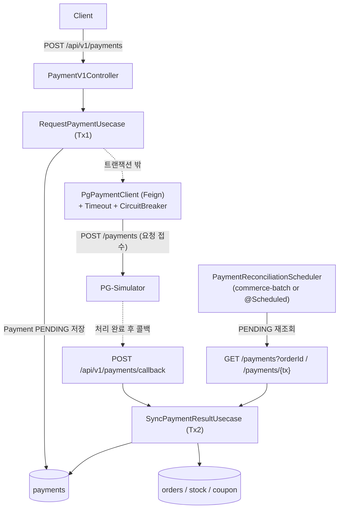
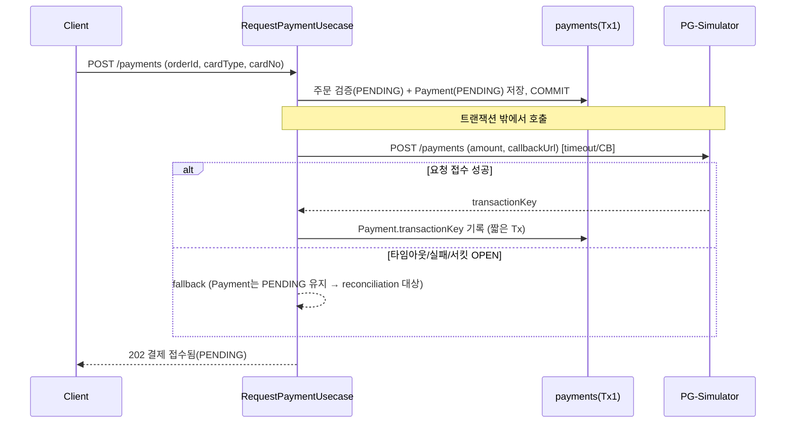
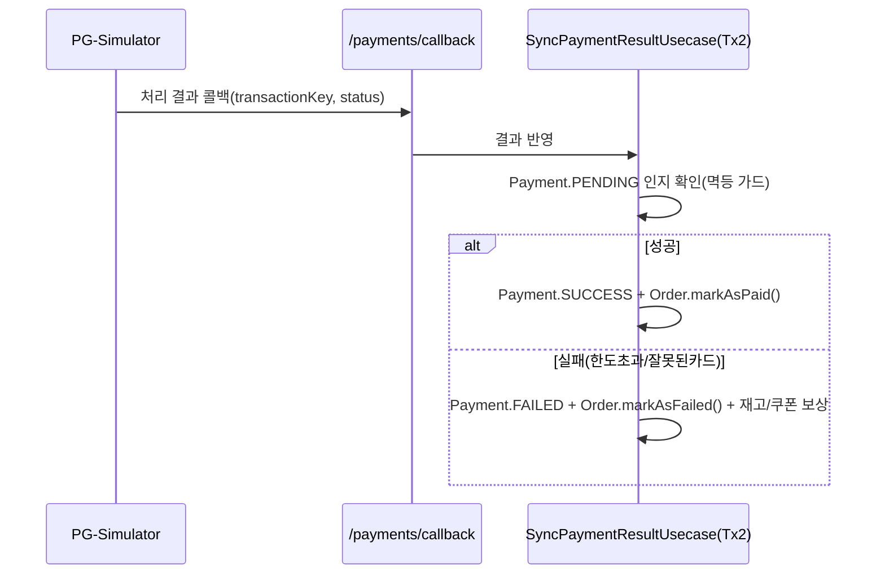
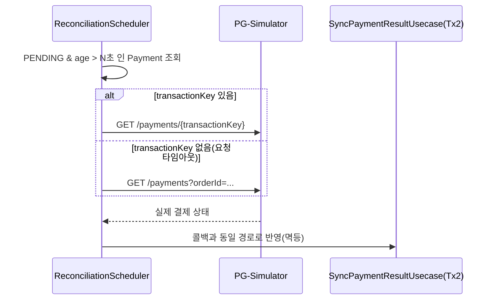

# Round6 결제 기능 — 외부 PG 카드 결제 연동 설계

## TL;DR

PENDING 주문에 대해 **비동기 PG 카드 결제**를 연동한다. 외부 호출은 **DB 트랜잭션 밖**에서 수행하고, 결제 요청이 접수되면(트랜잭션 키 확보) 즉시 `PENDING`으로 응답한다. 최종 결과는 **콜백**으로 `Payment`/`Order` 상태를 전이하며, 콜백 유실·요청 타임아웃은 **주기적/수동 상태 조회(reconciliation)** 로 복구한다. PG 호출은 **타임아웃 + 서킷브레이커**로 격리해 외부 장애가 내부로 전파되지 않게 한다.

## Introduction & Goals

- **Context / Background**
  - volume-4까지 주문 생성(재고 비관적 락 차감 + 쿠폰 사용 + `OrderModel` `PENDING` 저장)이 단일 트랜잭션으로 구현되어 있다. `OrderStatus`에는 `PENDING/PAID/FAILED/CANCELLED`, `OrderModel`에는 `markAsPaid()`/`markAsFailed()`(둘 다 `PENDING`에서만 전이)가 이미 존재한다.
  - 이번 라운드는 이 PENDING 주문을 실제로 결제 처리하는 단계로, 외부 PG-Simulator(별도 SpringBootApp)와 연동한다.
  - PG는 **비동기**다: 요청과 실제 처리가 분리된다. 요청 자체 성공 60%, 요청 지연 100~500ms, 처리 지연 1~5s, 처리 결과 성공 70% / 한도초과 20% / 잘못된카드 10%.
- **Goals**
  - `POST /api/v1/payments`로 주문 결제를 요청하고, 외부 PG와 연동해 주문 상태를 **안전하게** `PAID`/`FAILED`로 확정한다.
  - 외부 응답 지연·실패에 타임아웃과 서킷브레이커로 대응하고, 외부 장애 시에도 내부 API는 정상 응답한다.
  - 콜백 + 상태 조회 API를 이용해 결제 결과를 누락 없이 시스템에 반영한다(콜백 유실·요청 타임아웃 복구 포함).
- **Non-Goals (이번 범위 밖, 단 확장 가능하게 설계)**
  - 실제 카드 인증/정산, 부분 결제, 결제 취소·환불.
  - 다중 결제수단(분할 결제). 이번엔 카드 1건만.

## 도메인 / 상태 모델

결제를 주문과 분리된 별도 애그리거트 `Payment`로 둔다. 결제의 source of truth는 `payments` + PG이며, `orders.status`는 결제 결과를 반영하는 파생 상태다.

- `Payment` (내부 결제 기록 / 외부 연동 상태)
  - `orderId`, `amount`, `cardType`, `cardNo`(마스킹 저장), `transactionKey`(PG 발급, 접수 후 확보), `status`, `failureReason?`
  - `PaymentStatus`: `PENDING`(접수/처리 대기) → `SUCCESS` | `FAILED`
  - `failureReason`: `LIMIT_EXCEEDED`, `INVALID_CARD`, `TIMEOUT_UNKNOWN`(요청 결과 불명) 등

- 주문 상태 연동: `Payment.SUCCESS → Order.markAsPaid()`, `Payment.FAILED → Order.markAsFailed()` + **보상**(재고 복구, 쿠폰 원복).
  - 주문 생성 시 재고가 이미 차감되어 있으므로, 결제 실패는 반드시 재고/쿠폰 보상을 동반한다.

## Detailed Design

### System Architecture

### Transaction Flow

외부 호출을 트랜잭션 경계로 끊는 것이 핵심이다. **세 개의 독립 흐름**으로 구성한다.

**(1) 결제 요청**

**(2) 콜백(정상 경로)**

**(3) 복구(콜백 유실 · 요청 타임아웃)**

### Data Models

| 테이블 | 컬럼 | 역할 | 비고 |
|--------|------|------|------|
| `payments` | `id`, `order_id`, `amount`, `card_type`, `card_no`(마스킹), `transaction_key`, `status`, `failure_reason`, `created_at`, `updated_at` | 결제 요청/결과 원본 | `order_id`에 부분 유니크(활성 결제 1건) 고려, `transaction_key` 유니크 |
| `orders` | `status` | 결제 결과 반영 | `markAsPaid`/`markAsFailed` 통해서만 전이 |

### API Design

- `POST /api/v1/payments` (대고객)
  - 헤더: `X-Loopers-LoginId`, `X-Loopers-LoginPw`
  - 요청: `orderId`, `cardType`, `cardNo`
  - 응답: `paymentId`, `status=PENDING`, `transactionKey?` — **즉시 반환(처리 대기 1~5s를 동기 대기하지 않음)**
  - 실패: 주문 없음/소유자 불일치 `NOT_FOUND`, 주문이 PENDING 아님 `CONFLICT`, 이미 결제 진행중 `CONFLICT`
- `POST /api/v1/payments/callback` (PG → 우리)
  - 본문: `transactionKey`, `orderId`, `status`(SUCCESS/한도초과/잘못된카드)
  - 멱등: 같은 콜백 재수신 시 결과 동일(no-op)
- 조회: `GET /api/v1/orders/{id}`(주문 상태로 결제 결과 확인) / 내부 reconciliation은 PG의 `GET /payments?orderId=`, `GET /payments/{tx}` 사용
- 운영 복구: `POST /api/v1/payments/{id}/sync`(수동 상태 재조회) — 콜백 미수신 대비

### 외부 연동 (PG Client)

- **FeignClient**로 PG 호출(`spring-cloud-openfeign`). 헤더 `X-USER-ID`, 본문에 `amount`(= `order.paidPrice`), `callbackUrl`(우리 콜백 엔드포인트) 포함.
- 외부 응답 DTO는 infrastructure에서 도메인 모델로 변환 후 application으로 전달(도메인이 외부 DTO에 의존하지 않음 — CLAUDE.md 규칙).
- 카드번호는 마스킹 저장/로깅, 전체 PAN은 로그/응답에 남기지 않는다.

### Resilience

- **타임아웃**: 동기로 기다리는 것은 "요청 접수"뿐이므로 처리지연(1~5s)은 대기하지 않는다.
  - PG 요청 호출: connect ~수백 ms, read ~1s(요청지연 100~500ms + 여유). 상태조회 GET도 유사한 짧은 타임아웃.
- **서킷브레이커(Resilience4j)**: PG 요청 호출에 적용. 실패율 임계 초과 시 OPEN → fallback은 "Payment PENDING 유지 + 접수 응답" 후 reconciliation에 위임. half-open 프로빙으로 회복.
- **재시도**: 네트워크/timeout/5xx에 한해 제한적 재시도. **멱등성 위에서만** 켠다(아래 참고). 결제 거절(한도초과/잘못된카드)은 비즈니스 결과이므로 재시도하지 않는다.
- **멱등성 / 중복 방지**
  - 우리 API: 주문당 활성 결제 1건 보장(상태 검사 + DB 제약).
  - PG 요청 재시도: 재시도 전 `GET /payments?orderId=`로 기존 접수 여부 확인 후, 없을 때만 신규 요청(중복 결제 방지).
  - 콜백/조회 반영: `Payment`가 `PENDING`일 때만 전이(이미 SUCCESS/FAILED면 no-op) → 콜백 중복/조회 중복 안전.
- **복구(reconciliation)**: `PENDING` 상태가 임계 시간 이상 지속된 결제를 주기적으로(@Scheduled 또는 `commerce-batch`) 재조회해 반영. `transactionKey`가 없으면(요청 타임아웃) `GET /payments?orderId=`로 실제 접수 여부까지 확인한다.

### Constraints

- 외부 호출은 `@Transactional` 내부에서 하지 않는다(커넥션 점유·락 확대 방지).
- 결제 결과가 미수신이어도 내부 API는 즉시 정상 응답(PENDING)한다.
- 동시성/정합성 검증은 H2가 아닌 MySQL Testcontainers, PG는 stub/WireMock로 검증한다.

## Alternatives Considered

| 주제 | 선택지 | 결정 | 트레이드오프 |
|------|--------|------|--------------|
| 결과 반영 방식 | A 동기 대기 / B 콜백 / C 폴링 | **B 콜백 + C 폴링 보강** | 동기 대기는 처리지연 1~5s 동안 스레드/커넥션 점유 + 외부 장애 전파. 콜백은 유실 가능 → 폴링으로 보강 |
| 결제-주문 트랜잭션 | A 단일 트랜잭션 / B 분리 | **B 분리** | 외부 호출을 트랜잭션 밖으로 빼 일관성은 상태기계+보상으로 확보 |
| PG 클라이언트 | A RestTemplate / B FeignClient | **B FeignClient** | Spring Cloud 스택 일관성, 선언적 + Resilience4j 연동 용이 |
| 장애 대응 | A 재시도만 / B 서킷브레이커(+제한 재시도) | **B** | 재시도만으로는 장애 확산. 서킷브레이커로 빠른 차단 후 reconciliation |
| 요청 중복 방지 | A PG가 orderId로 dedup 가정 / B 우리가 GET으로 선확인 | **B** | PG dedup 보장이 명세에 없음 → 재시도 전 조회로 중복 결제 방지 |

## Cross-cutting Concerns

- **Consistency**: 결제 상태기계 + 실패 시 재고/쿠폰 보상으로 최종 일관성 확보. 주문 상태 전이는 도메인 메서드로만.
- **Availability**: 서킷브레이커 + 비동기 접수로 PG 장애가 결제 API 가용성을 무너뜨리지 않음.
- **Latency**: 처리지연(1~5s)을 동기 대기하지 않아 응답이 빠름.
- **Observability**: 결제 요청/콜백/복구 이벤트 로깅, PENDING 적체/서킷 상태 모니터링.
- **Security**: 카드번호 마스킹, 콜백 진위 확인(transactionKey↔order↔amount 매칭).
- **Verification**: 타임아웃, 서킷 OPEN fallback, 콜백 성공/실패, 콜백 중복, 요청 타임아웃 후 조회 복구, 결제 실패 보상 롤백을 각각 테스트.

## Reference

- 기존 주문 흐름: `application/order/usecase/CreateOrderUsecase.kt`, `domain/order/OrderModel.kt`(`markAsPaid/markAsFailed`), `domain/order/OrderStatus.kt`
- 과제: PG-Simulator `POST /api/v1/payments`, `GET /api/v1/payments/{tx}`, `GET /api/v1/payments?orderId=`
- 리뷰 스킬: `.claude/skills/analyze-external-integration/SKILL.md`
