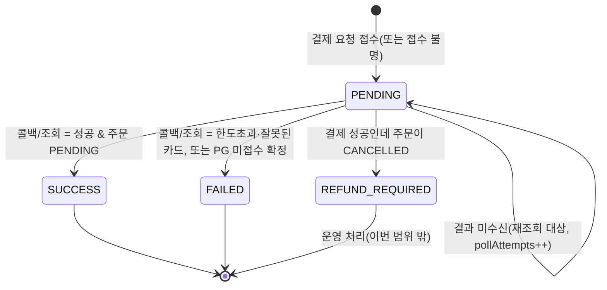
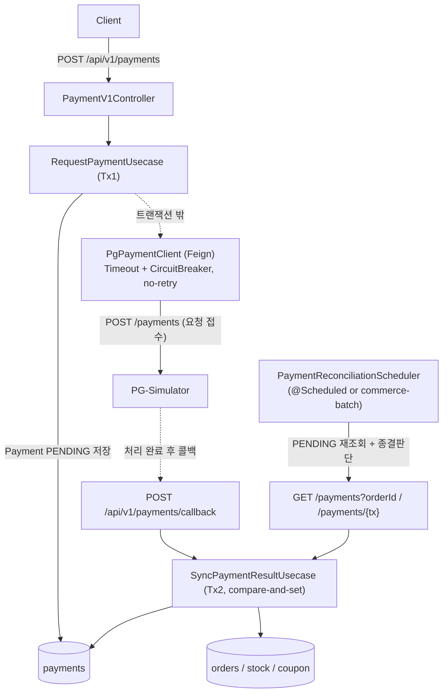
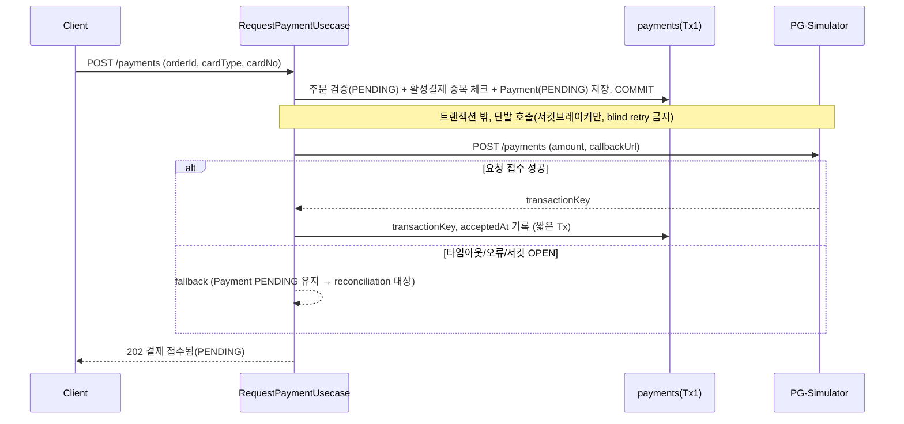
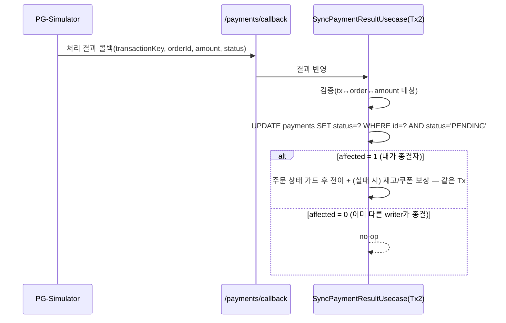

# Round6 결제 기능 — 외부 PG 카드 결제 연동 설계

> v2 (2026-06-24): 설계 리뷰(`analyze-external-integration`) 반영. 보강 항목은 본문에 통합하고, 추적용 요약을 "리뷰 반영 보강 결정" 섹션에 정리했다. (R1·R2·R4·R3·R6·R7)

## TL;DR

PENDING 주문에 대해 **비동기 PG 카드 결제**를 연동한다. 외부 호출은 **DB 트랜잭션 밖**에서 수행하고, 결제 요청이 접수되면(트랜잭션 키 확보) 즉시 `PENDING`으로 응답한다. 최종 결과는 **콜백**으로 반영하되, 콜백 유실·요청 타임아웃·미접수는 **상태 조회(reconciliation)** 로 복구하고 **무기한 PENDING이 없도록 종결 정책(SLA)** 을 둔다. 결과 반영은 **조건부 상태 전이(compare-and-set)** 로 콜백/폴링 동시 반영을 멱등화하고, 실패 시 **재고/쿠폰 보상까지 단일 트랜잭션**으로 묶어 롤백 시 재시도가 안전하도록 한다. PG 호출은 **타임아웃 + 서킷브레이커**로 격리한다.

## Introduction & Goals

- **Context / Background**
  - volume-4까지 주문 생성(재고 비관적 락 차감 + 쿠폰 사용 + `OrderModel` `PENDING` 저장)이 단일 트랜잭션으로 구현되어 있다. `OrderStatus`에는 `PENDING/PAID/FAILED/CANCELLED`, `OrderModel`에는 `markAsPaid()`/`markAsFailed()`(둘 다 `PENDING`에서만 전이)가 이미 존재한다.
  - 이번 라운드는 이 PENDING 주문을 실제로 결제 처리하는 단계로, 외부 PG-Simulator(별도 SpringBootApp)와 연동한다.
  - PG는 **비동기**다: 요청과 실제 처리가 분리된다. **요청 자체 성공 60%**, 요청 지연 100~500ms, 처리 지연 1~5s, 처리 결과 성공 70% / 한도초과 20% / 잘못된카드 10%.
- **Goals**
  - `POST /api/v1/payments`로 주문 결제를 요청하고, 외부 PG와 연동해 주문 상태를 **안전하게** `PAID`/`FAILED`로 확정한다.
  - 외부 응답 지연·실패에 타임아웃과 서킷브레이커로 대응하고, 외부 장애 시에도 내부 API는 정상 응답한다.
  - 콜백 + 상태 조회 API로 결제 결과를 **누락 없이, 무기한 PENDING 없이** 반영한다.
- **Non-Goals (이번 범위 밖, 단 종결 분기만 명시)**
  - 실제 카드 인증/정산, 부분 결제, 결제 취소·**환불 처리**. (단, 환불이 필요한 상태는 `REFUND_REQUIRED`로 격리해 방치하지 않는다 — R6.)
  - 다중 결제수단(분할 결제).

## 도메인 / 상태 모델

결제를 주문과 분리된 별도 애그리거트 `Payment`로 둔다. 결제의 source of truth는 `payments` + PG이며, `orders.status`는 결제 결과를 반영하는 파생 상태다.

- `Payment` (내부 결제 기록 / 외부 연동 상태)
  - `orderId`, `amount`, `cardType`, `cardNo`(마스킹 저장), `transactionKey`(PG 발급, 접수 후 확보), `status`, `failureReason?`
  - **추적 필드(R1)**: `lastPolledAt`, `pollAttempts`, `acceptedAt?`(요청 접수 시각) — reconciliation 종결 판단에 사용
  - `PaymentStatus`: `PENDING`(접수/처리 대기) → `SUCCESS` | `FAILED` | `REFUND_REQUIRED`(성공했으나 주문이 더 이상 결제 대상이 아님 — 격리/경보)
  - `failureReason`: `LIMIT_EXCEEDED`, `INVALID_CARD`, `NOT_ACCEPTED`(PG에 접수 기록 없음으로 확인됨), `UNRESOLVED`(T_max 초과·상태 불명 — 수동 처리 격리)

- 주문 상태 연동: `Payment.SUCCESS → Order.markAsPaid()`, `Payment.FAILED → Order.markAsFailed()` + **보상**(재고 복구, 쿠폰 원복).
  - 주문 생성 시 재고가 이미 차감되어 있으므로, 결제 실패는 반드시 재고/쿠폰 보상을 동반한다.
  - 보상의 멱등성을 위해 "`Order`가 `PENDING → FAILED`로 전이되는 그 트랜잭션에서만 복구"를 불변식으로 둔다(중복 복구 방지 — R4).

## Detailed Design

### System Architecture

### Transaction Flow

외부 호출을 트랜잭션 경계로 끊는 것이 핵심이다. **세 개의 독립 흐름**으로 구성한다.

**(1) 결제 요청** — 외부 호출은 트랜잭션 밖, 재시도 없음(R3)

**(2) 콜백(정상 경로)** — compare-and-set으로 멱등(R2), 보상까지 단일 Tx(R4), 검증·가드(R6)

**(3) 복구(콜백 유실 · 요청 타임아웃 · 미접수)** — 종결 정책(R1)

```mermaid
sequenceDiagram
    participant SCH as ReconciliationScheduler
    participant PG as PG-Simulator
    participant SYNC as SyncPaymentResultUsecase(Tx2)

    SCH->>SCH: PENDING & age>임계 인 Payment 조회
    alt transactionKey 있음
        SCH->>PG: GET /payments/{transactionKey}
        PG-->>SCH: 성공/실패/처리중
    else transactionKey 없음(요청 타임아웃/미접수)
        SCH->>PG: GET /payments?orderId=...
        alt PG에 결제건 있음(응답 유실)
            PG-->>SCH: transactionKey + 상태
        else PG에 없음(미접수 확정)
            PG-->>SCH: 없음 → FAILED(NOT_ACCEPTED) 확정 대상
        end
    end
    SCH->>SYNC: 콜백과 동일 경로(compare-and-set)로 반영
    Note over SCH: T_max 초과 & 상태 불명 → UNRESOLVED 격리 + 경보
```

### Data Models

| 테이블 | 컬럼 | 역할 | 비고 |
|--------|------|------|------|
| `payments` | `id`, `order_id`, `amount`, `card_type`, `card_no`(마스킹), `transaction_key`, `status`, `failure_reason`, `accepted_at`, `last_polled_at`, `poll_attempts`, `created_at`, `updated_at` | 결제 요청/결과 원본 + 추적 | `order_id`에 활성 결제 1건 보장(부분 유니크/상태검사), `transaction_key` 유니크 |
| `orders` | `status` | 결제 결과 반영 | `markAsPaid`/`markAsFailed`(PENDING에서만)로만 전이 |

### API Design

- `POST /api/v1/payments` (대고객)
  - 헤더: `X-Loopers-LoginId`, `X-Loopers-LoginPw`
  - 요청: `orderId`, `cardType`, `cardNo`
  - 응답: `paymentId`, `status=PENDING`, `transactionKey?` — **즉시 반환(처리 1~5s를 동기 대기하지 않음)**
  - 실패: 주문 없음/소유자 불일치 `NOT_FOUND`, 주문이 PENDING 아님 `CONFLICT`, 이미 활성 결제 존재 `CONFLICT`
- `POST /api/v1/payments/callback` (PG → 우리)
  - 본문: `transactionKey`, `orderId`, `amount`, `status`
  - **검증(R6)**: `transactionKey`로 우리 Payment를 찾고 `orderId`/`amount`가 우리 기록과 일치하는지 확인. 불일치 시 반영하지 않고 거부 + 경보.
  - **멱등**: compare-and-set으로 PENDING일 때만 반영, 재수신은 no-op.
- 운영/복구: `POST /api/v1/payments/{id}/sync`(수동 상태 재조회), 조회는 `GET /api/v1/orders/{id}`로 결제 결과 확인.

### 외부 연동 (PG Client)

- **FeignClient**로 PG 호출(`spring-cloud-openfeign`). 헤더 `X-USER-ID`, 본문에 `amount`(= `order.paidPrice`), `callbackUrl`(우리 콜백 엔드포인트) 포함.
- 외부 응답 DTO는 infrastructure에서 도메인 모델로 변환 후 application으로 전달(도메인이 외부 DTO에 의존하지 않음 — CLAUDE.md 규칙).
- 카드번호는 마스킹 저장/로깅, 전체 PAN은 로그/응답/저장에 남기지 않는다.

### Resilience

- **타임아웃 (R7 — 근거)**
  - 동기로 기다리는 것은 "요청 접수"뿐이다. 처리 지연(1~5s)은 비동기이므로 **요청 호출 타임아웃에 포함하지 않는다.**
  - 요청 호출 read timeout = 요청지연 상한(≈500ms) + 네트워크/지터 여유 → **약 1s**(상한의 ~2배). connect timeout은 짧게(예: ~250ms).
  - reconciliation GET 호출도 동일 수준의 짧은 read timeout.
  - 콜백 미수신 판단(1차 폴링 시작) age = 처리지연 상한(5s) + 콜백 전송 여유 → 예: **10~30s** 후, 이후 백오프.
  - 종결 추적 상한 `T_max`(운영 기준, 예: 5~10분) 초과 & 상태 불명 → `UNRESOLVED` 격리 + 경보.
- **서킷브레이커 (Resilience4j, R7 — 핵심)**
  - PG 요청 호출에 적용. **정상 요청 성공률이 60%이므로**, "정상적인 요청 거부(40%)"를 서킷 실패로 세면 정상 트래픽에도 자주 OPEN된다.
  - 따라서 서킷 실패 카운트는 **타임아웃 / 5xx / 커넥션 오류 등 "통신 실패"만 집계**하고, PG가 정상 응답으로 돌려준 요청 거부는 제외한다. 임계는 그 위에서 설정(예: 통신 실패율 50% over sliding window).
  - OPEN 시 fallback = "Payment PENDING 유지 + 202 응답" 후 reconciliation에 위임. half-open 프로빙으로 회복.
- **재시도 / 중복 방지 (R3)**
  - 요청 호출은 **자동 재시도하지 않는다(blind retry 금지).** 재시도와 요청지연이 겹치면 중복 결제 위험(TOCTOU)이 있기 때문.
  - 타임아웃/실패는 PENDING으로 두고, reconciliation이 `GET /payments?orderId=`로 **실제 접수 여부를 확인한 뒤(없을 때만)** 재요청한다.
  - 우리 API 자체 중복: 주문당 활성 결제 1건 보장(상태 검사 + DB 제약).
  - (가정) PG가 멱등키를 지원하면 `paymentId` 기반 멱등키를 요청에 실어 추가 방어. 명세에 필드가 없어 현재는 "조회 후 재요청"을 1차 방어로 둔다.
- **결과 반영 동시성 (R2)**
  - 콜백과 reconciliation이 같은 Payment를 동시에 반영할 수 있다. **조건부 UPDATE(`... WHERE status='PENDING'`)** 로 한 writer만 종결자가 되게 한다(affected=0이면 no-op). 락 경합 없이 멱등 보장.
- **보상 재처리 (R4)**
  - 실패 결과 반영(상태 전이) + 주문 `markAsFailed()` + 재고/쿠폰 보상을 **단일 트랜잭션**으로 묶는다.
  - 트랜잭션이 실패하면 전체 롤백 → `Payment`는 `PENDING` 유지 → 다음 reconciliation이 다시 시도(at-least-once). compare-and-set과 보상 불변식("FAILED 전이 트랜잭션에서만 복구") 덕분에 재시도해도 이중 보상이 없다.

### Constraints

- 외부 호출은 `@Transactional` 내부에서 하지 않는다(커넥션 점유·락 확대 방지).
- 결제 결과가 미수신이어도 내부 API는 즉시 정상 응답(PENDING)하며, **PENDING은 종결 정책에 의해 유한 시간 내 종료**된다.
- 동시성/정합성 검증은 H2가 아닌 MySQL Testcontainers, PG는 stub/WireMock로 검증한다.

## 리뷰 반영 보강 결정 (R1·R2·R4·R3·R6·R7)

리뷰에서 드러난 리스크를 우선순위 순서로, 선택지·결정·트레이드오프로 정리한다.

### R1. 미접수/응답유실 구분 + PENDING 종결 정책
- 문제: 요청 자체 실패(40%)·콜백 유실·요청 타임아웃이 모두 PENDING으로 남아 **무기한 PENDING**이 될 수 있다.
- 선택지: A) 일정 시간 후 자동 FAILED 확정 / B) GET 조회로 실제 상태 확인 후에만 종결, 불명은 격리 / C) 자동 재요청.
- **결정: B 우선.** reconciliation이 `transactionKey`로 `GET /payments/{tx}`, 없으면 `GET /payments?orderId=`로 실제 접수 여부까지 확인한다. PG에 **없음으로 확인**되면 `FAILED(NOT_ACCEPTED)` + 보상. 처리중/불명은 `T_max`까지 추적, 초과 시 `UNRESOLVED`로 격리 + 경보.
- 트레이드오프: 자동 FAILED 오판(돈 빠진 케이스)을 피하는 대신, 불명 케이스에 운영 개입이 필요하다.

### R2. 콜백 vs 폴링 동시 반영 동시성 제어
- 문제: 콜백 핸들러와 reconciliation이 같은 PENDING Payment를 동시에 읽고 둘 다 반영 → 이중 전이/이중 보상.
- 선택지: A) Payment 비관적 락 / B) `@Version` 낙관적 락 / C) 조건부 UPDATE(compare-and-set) / D) 단일 큐 직렬화.
- **결정: C.** `UPDATE payments SET status=? WHERE id=? AND status='PENDING'`로 종결자를 하나로 못박고, affected=0이면 no-op. 락 경합이 없고 멱등이 자연스럽다.
- 트레이드오프: 상태 전이가 SQL 한 줄에 묶여 도메인 메서드 호출 순서를 신경 써야 한다(전이 성공 후 주문/보상 반영).

### R4. 보상 트랜잭션 실패의 재처리
- 문제: 실패 결제의 재고/쿠폰 보상 트랜잭션이 실패하면 재고가 영구 미복구.
- 선택지: A) 결과 반영+보상을 단일 Tx로 묶고 실패 시 롤백→재시도 / B) 보상을 outbox/이벤트로 비동기 재시도.
- **결정: A.** compare-and-set 전이 + 주문 전이 + 보상을 한 Tx로. 실패 시 전체 롤백 → PENDING 유지 → reconciliation 재시도(at-least-once, 멱등). outbox는 이번 범위에 과함(비목표).
- 트레이드오프: 재시도까지 보상이 지연될 수 있으나, 정합성(이중 보상 없음)이 우선.

### R3. 재시도 중복 결제(멱등키)
- 문제: 요청 재시도와 요청지연이 겹쳐 중복 결제 가능(GET 선확인의 TOCTOU).
- 선택지: A) 멱등키를 PG에 전달 / B) orderId dedup을 PG에 가정 / C) blind retry 금지 + 조회 후 재요청.
- **결정: C(+A는 PG 지원 시).** 요청 호출은 단발(서킷브레이커만). 재요청은 reconciliation이 `GET ?orderId`로 미접수 확인 후에만. 멱등키는 PG 지원 시 추가.
- 트레이드오프: 실패한 요청의 재시도 지연(다음 폴링까지). 대신 중복 결제 위험 제거.

### R6. 콜백 진위·금액 검증 + 결제성공↔주문취소 종결
- 문제: 위변조/오발송 콜백, 금액 불일치, 그리고 "결제 성공인데 주문이 CANCELLED"인 종결 불가 분기.
- **결정:** 콜백/조회 반영 전 `transactionKey↔order↔amount` 매칭 검증(불일치 거부+경보). 주문 상태 가드 — `PENDING`이면 정상 전이, `PAID/FAILED`면 멱등 no-op, `CANCELLED`면 `REFUND_REQUIRED`로 격리(환불은 비목표지만 방치하지 않음).
- 트레이드오프: 환불 자동화는 안 함 → 운영 처리 필요. 다만 모델상 "미결" 상태가 남지 않는다.

### R7. 타임아웃 수치 근거
- 문제: 타임아웃이 "가정"이고, 60% 요청 성공률이 서킷 기준을 왜곡할 수 있음.
- **결정:** 요청 read timeout ≈ 요청지연 상한(500ms)×2 ≈ 1s, connect ~250ms. 처리지연(1~5s)은 비동기라 미대기. 폴링 시작 age 10~30s, `T_max` 5~10분. 서킷 실패 카운트는 **통신 실패(타임아웃/5xx/커넥션)만** 집계하고 정상 거절은 제외.
- 트레이드오프: 수치는 측정으로 보정 대상(초기값). 통신 실패만 세므로 비즈니스 거절 급증은 서킷이 못 막지만, 그건 서킷이 아니라 사용자 응답으로 다룰 문제다.

## Cross-cutting Concerns

- **Consistency**: compare-and-set 전이 + 단일 Tx 보상 + 종결 정책으로 최종 일관성 확보. 주문 상태 전이는 도메인 메서드로만.
- **Availability**: 서킷브레이커 + 비동기 접수로 PG 장애가 결제 API 가용성을 무너뜨리지 않음.
- **Latency**: 처리지연(1~5s)을 동기 대기하지 않아 응답이 빠름.
- **Observability**: 요청/콜백/복구 로깅, PENDING 적체·`UNRESOLVED`·서킷 상태 모니터링/경보.
- **Security**: 카드번호 마스킹, 콜백 매칭 검증(tx↔order↔amount).
- **Verification**: 타임아웃, 서킷 OPEN fallback, 콜백 성공/실패, 콜백 중복(compare-and-set), 콜백/폴링 동시 도착, 요청 타임아웃 후 조회 복구, 미접수 FAILED 확정, 보상 Tx 실패 후 재시도, CANCELLED→REFUND_REQUIRED를 각각 테스트.

## Reference

- 기존 주문 흐름: `application/order/usecase/CreateOrderUsecase.kt`, `domain/order/OrderModel.kt`(`markAsPaid/markAsFailed`), `domain/order/OrderStatus.kt`
- 과제: PG-Simulator `POST /api/v1/payments`, `GET /api/v1/payments/{tx}`, `GET /api/v1/payments?orderId=`
- 리뷰 스킬: `.claude/skills/analyze-external-integration/SKILL.md`
