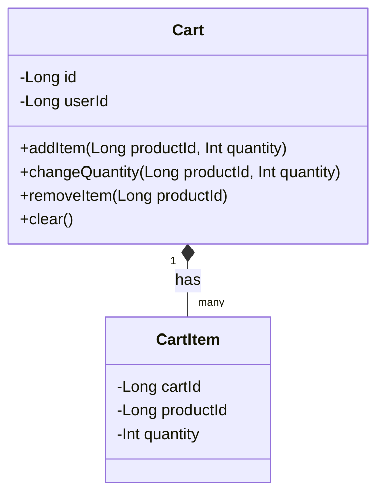
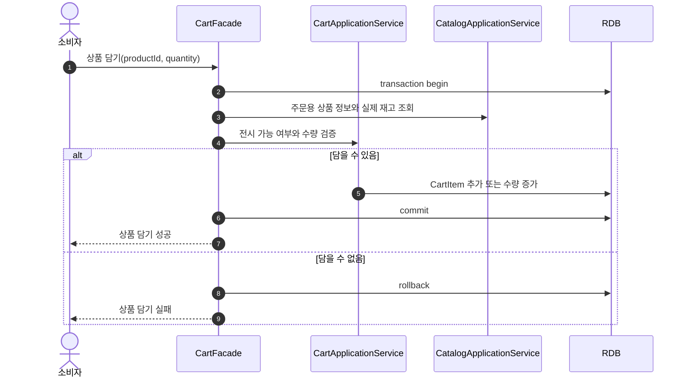
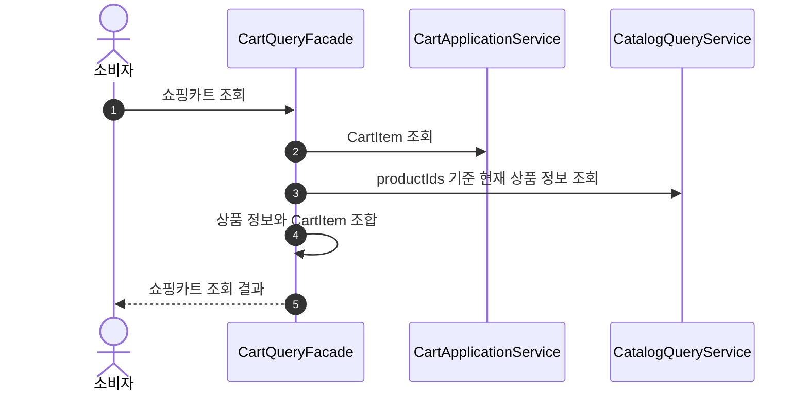
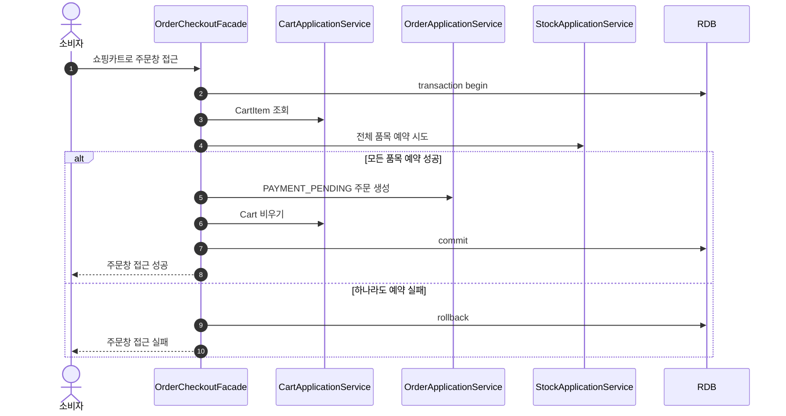

# Shopping Cart 설계

## 1. 설계 기준

이 문서는 `docs/HLD.md`의 쇼핑카트 요구사항을 기준으로 Shopping Cart를 정의한다.

쇼핑카트는 Order Context에 속한다.

- 쇼핑카트는 소비자의 주문 의도를 임시로 담는다.
- 쇼핑카트는 상품 정보를 소유하지 않고 `productId`만 가진다.
- 쇼핑카트에 담을 때 재고를 확인하지만 예약하지 않는다.
- 주문창 접근 시점에 실제 예약과 `PAYMENT_PENDING` 주문 생성이 일어난다.

## 2. Context 경계

### Shopping Cart가 소유하는 것

- `Cart`: 소비자별 쇼핑카트
- `CartItem`: 쇼핑카트에 담긴 상품과 수량

### Shopping Cart가 소유하지 않는 것

- 상품명, 가격, 브랜드, 전시 상태
- 실제 재고 수량
- 재고 예약
- 주문 스냅샷
- 결제 상태

Catalog는 상품 존재 여부, 전시 가능 여부, 현재 가격, 실제 재고 수량을 제공한다. Order checkout은 쇼핑카트의 상품과 수량을 주문 스냅샷과 예약으로 전환한다.

## 3. Ubiquitous Language

| 용어 | 의미 |
| :--- | :--- |
| Cart | 소비자가 구매하고 싶은 상품과 수량을 임시로 담는 공간 |
| CartItem | Cart 안의 상품 한 줄. `productId`와 `quantity`를 가진다 |
| Add To Cart | 상품을 쇼핑카트에 담는 행위 |
| Change Quantity | CartItem 수량을 변경하는 행위 |
| Checkout Handoff | CartItem을 주문창 접근 use case로 넘기는 행위 |

## 4. 모델

### 이유

쇼핑카트는 주문 계약이 아니라 소비자의 임시 의도다. 따라서 상품명, 가격, 브랜드명은 스냅샷으로 저장하지 않고 조회 시 Catalog의 현재 정보를 조합한다.

### 다이어그램

### 해석

Cart는 소비자별로 하나만 가진다. 같은 상품을 다시 담으면 기존 CartItem의 수량을 증가시킨다.

CartItem의 수량은 1 이상이어야 한다. 수량을 0으로 만드는 command는 두지 않고, 제거는 `removeItem(productId)`로 표현한다.

## 5. 쇼핑카트 규칙

상품을 쇼핑카트에 담거나 수량을 변경할 때는 Catalog에 현재 주문 가능 여부와 실제 재고 수량을 확인한다.

- 상품이 없으면 실패한다.
- Catalog 기준 전시 가능하지 않으면 실패한다.
- 요청 수량이 1 미만이면 실패한다.
- 요청 후 CartItem 수량이 현재 실제 재고 수량보다 크면 실패한다.

이 검증은 예약이 아니다. 쇼핑카트에 담은 뒤 다른 주문으로 재고가 줄어들 수 있고, 주문창 접근 시 예약 실패가 발생할 수 있다.

상품명, 가격, 브랜드가 변경되어도 CartItem은 변경하지 않는다. 쇼핑카트 조회와 주문창 접근은 항상 Catalog의 현재 상품 정보를 사용한다.

## 6. 주요 흐름

### 상품 담기

#### 이유

쇼핑카트 담기는 재고 예약 없이 현재 시점에 담을 수 있는지만 확인한다.

#### 다이어그램

#### 해석

같은 상품이 이미 담겨 있으면 기존 수량과 요청 수량을 합산한 결과로 재고를 확인한다.

### 쇼핑카트 조회

#### 이유

Cart는 상품 스냅샷을 저장하지 않으므로 조회 시점에 Catalog 정보와 조합해야 한다.

#### 다이어그램

#### 해석

상품이 비활성화되었거나 삭제되었거나 재고가 부족해졌다면 조회 결과에서 주문 불가 상태로 표시한다. CartItem을 자동 삭제하지 않는다.

### 주문창 접근

#### 이유

쇼핑카트의 임시 의도는 주문창 접근이 성공하면 `PAYMENT_PENDING` 주문과 주문 스냅샷으로 넘어간다.

#### 다이어그램

#### 해석

주문창 접근이 성공하면 Cart는 비운다. 이 시점부터 주문하려는 상품과 수량은 Order와 OrderItem 스냅샷이 소유한다.

예약 실패 시 Cart는 유지한다. 소비자는 수량을 줄이거나 상품을 제거한 뒤 다시 시도할 수 있다.

## 7. 영속성 모델

### `carts`

| 컬럼 | 의미 |
| :--- | :--- |
| `id` | 물리 PK |
| `user_id` | 소비자 식별자 |
| `created_at` | 생성 시각 |
| `updated_at` | 수정 시각 |

제약과 조회 기준:

- `user_id`는 unique다.

### `cart_items`

| 컬럼 | 의미 |
| :--- | :--- |
| `id` | 물리 PK |
| `cart_id` | Cart 식별자 |
| `product_id` | 상품 식별자 |
| `quantity` | 담은 수량 |
| `created_at` | 생성 시각 |
| `updated_at` | 수정 시각 |

제약과 조회 기준:

- `(cart_id, product_id)`는 unique다.
- `quantity`는 1 이상이어야 한다.

## 8. 현재 제외하는 것

다음은 현재 Shopping Cart 설계 범위에 포함하지 않는다.

- 여러 배송지로 나누어 주문하기
- 선택 상품만 주문하기
- 장바구니 상품 가격 변경 알림
- 품절 상품 자동 삭제
- 비회원 쇼핑카트
- 장바구니 만료 정책
