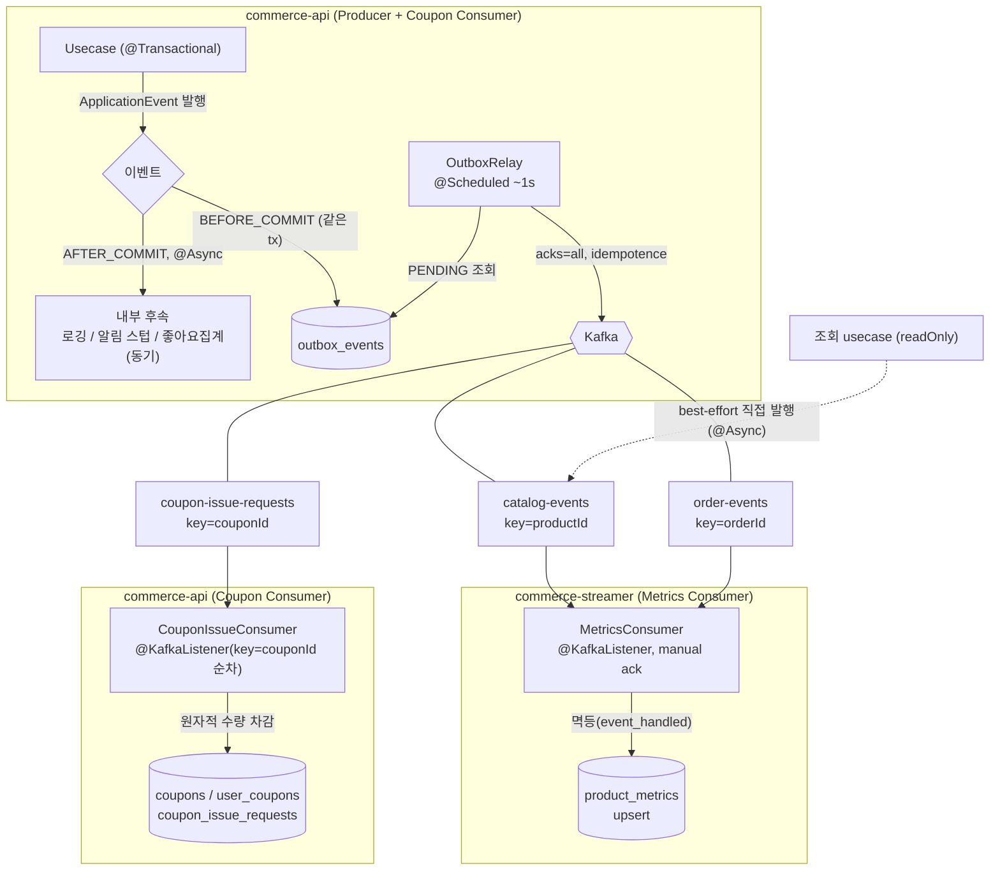
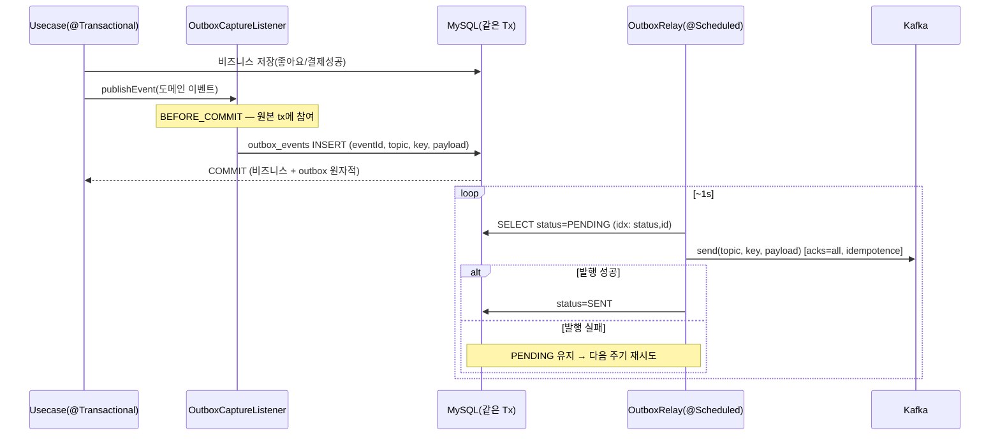
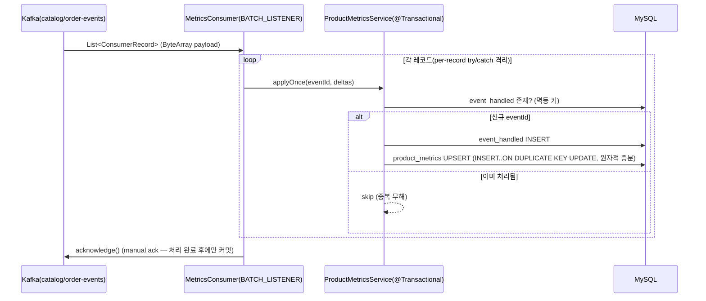
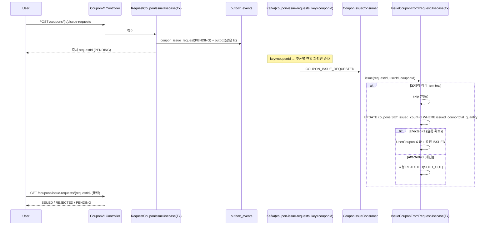
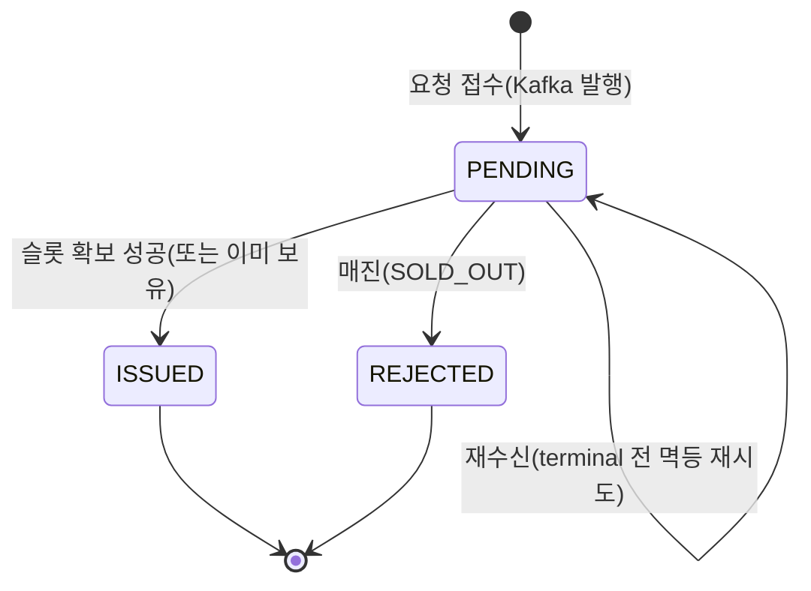

# [Design Doc] 이벤트 기반 아키텍처 — ApplicationEvent 경계, Kafka Transactional Outbox, 선착순 쿠폰 (7주차 · 6팀 · 김연주)

### TL;DR

주문·결제·좋아요·조회 흐름에서 **주 로직과 부가/전파 로직의 경계**를 이벤트로 나눈다. 한 JVM 내부 후속은 Spring `ApplicationEvent`(`AFTER_COMMIT` + `@Async`), **시스템 간 전파**는 Kafka로 보낸다. Kafka 발행은 **Transactional Outbox**로 비즈니스 커밋과 원자적으로 묶어 **at-least-once**를 보장하고, 소비자는 **멱등 처리 + 원자적 upsert**로 최종적으로 exactly-once 효과를 얻는다. 선착순 쿠폰은 요청을 Kafka에 **접수만**(즉시 `requestId` 응답)하고, Consumer가 **쿠폰별 단일 파티션 순차 + 원자적 수량 차감**으로 초과발급·중복발급을 0으로 막는다. 2주차 좋아요(eventual, in-JVM)·6주차 결제(신뢰 불가한 외부 시스템, 상태기계)와 달리, 이번엔 **이벤트/메시지로 트랜잭션을 나누고 브로커의 신뢰성을 다이얼(`acks`·멱등)로 조절**하는 것이 핵심이다.

### 본문

## Introduction & Goals

- **Context / Background**
  - 지금까지 후속 로직(집계·로깅·알림)이 주 트랜잭션 또는 동기 호출에 묶여 있었다. 부가 로직 실패가 주 로직에 전파되고, 트랜잭션이 길어지며, `User/Product/Coupon/Payment` 도메인이 한 흐름에 결합됐다.
  - 2주차에 좋아요→카운트 집계가 이미 `ApplicationEvent`(`@TransactionalEventListener(AFTER_COMMIT)` + `REQUIRES_NEW` + 원자적 `UPDATE`)로 부분 적용돼 있고(`ProductLikeCountEventHandler`), 6주차에 결제가 주문 트랜잭션에서 분리됐다. 즉 "이벤트로 경계를 나눈다"는 감각의 토대는 있으나, **시스템 간 전파(Kafka)와 그 신뢰성 보장**은 미구현이다.
  - 시스템 간 지표(조회수·판매량·좋아요수) 집계 파이프라인이 없고, 선착순 수량 한정 쿠폰 개념도 없다(쿠폰은 1인 1매 유니크 제약만).
- **Goals**
  - **(Why)** "이걸 이벤트로 분리해야 하는가"의 **판단 기준**을 세운다. 무조건 분리가 아니라 주 로직/부가 로직 경계와 트랜잭션 상관관계로 결정한다.
  - **(How)** 시스템 간 전파가 필요한 이벤트를 Kafka로 발행하되, **Transactional Outbox**로 유실 없이(at-least-once) 발행하고 소비자가 **멱등**하게 집계한다(`product_metrics`).
  - **(Scale)** 선착순 쿠폰 발급을 Kafka 버퍼 + 순차 소비 + 원자적 수량 제어로 구현하여 트래픽 급증에도 **초과발급 0**을 보장한다.
- **Non-Goals (이번 범위 밖)**
  - Exactly-once **transaction**(Kafka 트랜잭션): 대신 at-least-once 발행 + 멱등 소비로 exactly-once **효과**만 달성.
  - DLQ, Consumer Group 관심사별 분리, Consumer 배치 튜닝(모두 Nice-to-have).
  - 멀티 인스턴스 릴레이의 `SKIP LOCKED`, 발행 완료 행 pruning(프로덕션 스케일 이슈로 문서화만).
  - admin의 선착순 수량 입력 UI(쿠폰은 직접/테스트로 생성).

## Detailed Design

### System Architecture

핵심 원칙 네 가지:

1. **핵심 tx 최소화** — 주문/좋아요/쿠폰요청은 커밋만 빠르게, 부가·전파는 커밋 이후로.
2. **내부 이벤트 vs 시스템간 이벤트 분리** — 한 JVM 내 후속은 `ApplicationEvent`, 시스템 간은 Kafka. 같은 도메인 사실을 둘 다 소비 가능(좋아요는 in-JVM 카운트 + Kafka product_metrics 병존).
3. **At-least-once 발행 + 멱등 소비** — Outbox로 발행 보장, 소비자가 중복을 무해화.
4. **순서는 파티션 키로** — `productId`/`orderId`/`couponId` 기준 파티셔닝(파티션 단위 순서만 보장됨을 전제).

### Event vs Command — 경계를 나누는 판단 기준 (Step 1)

| 항목 | Command | Event |
|------|---------|-------|
| 의미 | "~을 해라"(명령) | "~이 발생했다"(사실 통지) |
| 흐름 제어 | 호출자가 제어 | 호출자가 제어하지 않음, 후속이 반응 |
| 결합 | 강결합(직접 호출) | 통지만, 처리는 외부 위임 |

**무엇을 이벤트로 뺐는가 / 왜:**

| 흐름 | 분리 여부 | 리스너 | 근거 |
|------|-----------|--------|------|
| 좋아요 → **카운트 집계** | 이벤트(기존) | `AFTER_COMMIT` + `REQUIRES_NEW` + 원자적 UPDATE, **동기** | 집계 실패와 무관하게 좋아요는 성공해야 함(eventual). 정합성 위해 동기 유지 |
| 주문/조회/좋아요/결제 → **유저행동 로깅** | 이벤트 | `AFTER_COMMIT` + `@Async` | 사용자 응답과 무관한 부가 관심사. 커밋된 사실만 로깅 |
| 결제 성공 → **알림(스텁)** | 이벤트 | `AFTER_COMMIT` + `@Async` | 주 로직(결제 확정)과 부가 로직(알림)의 경계 |
| 좋아요/결제 → **시스템 간 전파** | 이벤트 → **Outbox → Kafka** | `BEFORE_COMMIT`(캡처) | 반드시 전달돼야 함 → 비즈니스 tx와 원자적 |
| 조회 → **시스템 간 전파** | 이벤트 → **Kafka 직접** | `@Async @EventListener` | 비즈니스 쓰기 없음(readOnly) + 유실 허용 → best-effort |

> 판단 축: **(1) 주 로직인가 부가 로직인가**, **(2) 트랜잭션 결과와의 상관(집계는 동기·정합성 / 로깅·알림은 비동기)**, **(3) 반드시 전달인가 유실 허용인가(Outbox vs 직접)**.

### Transaction Flow

**(1) Transactional Outbox — 발행 유실 방지(at-least-once)**

`dual-write`(커밋 후 바로 Kafka 발행) 문제를 피하기 위해, 이벤트를 비즈니스 트랜잭션 안에서 outbox 행으로 기록하고 별도 릴레이가 발행한다.

**(2) Metrics Consumer — 멱등 집계(exactly-once 효과)**

**(3) 선착순 쿠폰 — 접수/발급 분리 + 원자적 수량 제어**

발급 요청 상태 모델:

### Data Models

| 테이블 | 소유 앱 | 핵심 컬럼 | 역할 |
|--------|---------|----------|------|
| `outbox_events` | commerce-api | `id`, `event_id`(UUID uniq, 멱등키·payload와 동일), `topic`, `partition_key`, `payload`(JSON), `status`(PENDING/SENT), 인덱스 `(status,id)` | 발행 보장(Outbox) |
| `product_metrics` | commerce-streamer | `product_id`(PK), `like_count`, `sales_count`, `view_count` | 시스템 간 지표 집계(upsert) |
| `event_handled` | commerce-streamer | `event_id`(PK), `handled_at` | 소비자 멱등(중복 dedup 전용) |
| `coupons`(+컬럼) | commerce-api | `total_quantity`(nullable=무제한), `issued_count` | 선착순 수량 |
| `coupon_issue_requests` | commerce-api | `id`, `request_id`(UUID uniq), `user_id`, `coupon_id`, `status`, `reason` | 비동기 발급 요청/결과(폴링) |

> **왜 `event_handled`와 (원본 이벤트) 로그 테이블을 분리하는가?** `event_handled`는 멱등 **dedup 전용**(핫패스, 처리키만, 보존기간 후 prune 가능)이고, 원본 이벤트 로그는 **감사·재처리·디버깅용**(append-only, 장기 보존)이다. 관심사·수명·접근 패턴이 달라 분리한다. 이번 범위에선 `event_handled`만 구현(로그 테이블은 Nice-to-have).

### Message Delivery Semantics

| 구간 | 목표 | 수단 |
|------|------|------|
| Producer → Broker | **At Least Once** | Transactional Outbox(원자적 기록) + 릴레이 재시도 + `acks=all`, `enable.idempotence=true` |
| Broker → Consumer | **최종 1회 반영(멱등)** | `event_handled`(eventId) / 쿠폰은 요청 `status` terminal + `(user,coupon)` 유니크 / 원자적 upsert |

### 선착순 동시성 제어

- **1차 방어 — 쿠폰별 단일 파티션 순차**: `key=couponId`라 같은 쿠폰의 요청은 한 파티션 → 한 컨슈머 스레드가 순차 처리 → 수량 경합 직렬화.
- **2차 방어 — 원자적 조건부 UPDATE**: `UPDATE coupons SET issued_count=issued_count+1 WHERE issued_count<total_quantity`. InnoDB row lock 하 단일 문장이라, 파티션 직렬화가 없어도(최악 조건) 초과발급이 불가능. → 동시성 테스트(`runConcurrently`, 300 요청·100 슬롯)로 **정확히 100 발급** 증명.
- **중복 방지**: `user_coupons (user_id, coupon_id)` 유니크 + 요청 terminal 멱등.

### Constraints

- 외부/네트워크 발행은 릴레이가 담당하고, 캡처는 비즈니스 tx에서 outbox 행만 기록한다.
- 조회(readOnly) 이벤트는 비즈니스 쓰기가 없어 Outbox에 못 실으므로 직접 발행(유실 허용)으로 분리한다.
- streamer는 commerce-api 도메인에 의존하지 않는다(메시지 JSON 계약으로만 소통, 자체 DTO 역직렬화).
- 동시성/정합성은 MySQL + Kafka Testcontainers로 검증한다.

## Alternatives Considered

| 주제 | 선택지 | 결정 | 트레이드오프 |
|------|--------|------|--------------|
| 발행 방식 | A 커밋 후 직접 발행(dual-write) / B Transactional Outbox | **B** | A는 커밋 후 발행 실패 시 유실. B는 원자적이나 릴레이·테이블 추가 |
| 릴레이 위치 | A commerce-api `@Scheduled` / B commerce-batch 잡 | **A** | 프로듀서 자기완결·단순. B는 부하 분리되나 상시 스케줄링 필요 |
| 조회수 발행 | A Outbox 단일경로 / B best-effort 직접 발행 | **B** | 조회는 비즈니스 쓰기 없음(readOnly) → Outbox 부적합. 유실 허용이라 직접이 적합 |
| 소비자 멱등 | A 오프셋만 신뢰 / B `event_handled` + 원자적 upsert | **B** | at-least-once라 중복 옴 → 멱등 필수 |
| 선착순 수량 | A 비관적 락 / B 원자적 조건부 UPDATE(+단일 파티션) | **B** | 락 경합↓, 단일 문장 원자성으로 초과발급 0 |
| 쿠폰 Consumer 위치 | A commerce-streamer(+api 의존) / B commerce-api | **B** | 쿠폰 도메인이 api에 있음 → 최단·결합 없음. 앱 분리는 metrics로 이미 시연 |
| product_metrics vs 기존 likeCount | A 단일화 / B 병존 | **B** | in-JVM likeCount(정렬용)와 product_metrics(분석용)는 소비 주체가 달라 병존 |

## 내부 이벤트 vs 시스템 간 이벤트 (2주차·6주차와 비교)

| 관점 | 2주차 좋아요(eventual, in-JVM) | 6주차 결제(외부 시스템) | 7주차 이벤트/Kafka |
|------|-------------------------------|------------------------|--------------------|
| 전송 범위 | 단일 JVM(ApplicationEvent) | 외부 PG(HTTP) | JVM 내부(Event) + 시스템 간(Kafka) |
| 신뢰성 | 앱 내부 — 손실 가능(메모리) | 외부 — 신뢰 불가, 상태기계 | 브로커 저장 — 재처리 가능, `acks`로 내구성 다이얼 |
| 일관성 | 최종 일관성(집계) | 트랜잭션 밖 + 보상 | 최종 일관성(Outbox at-least-once + 멱등 소비) |
| 순서 | 필요 없음 | 상태 전이 가드 | 파티션 키(productId/orderId/couponId) 단위 보장 |
| 실패 처리 | 집계만 재시도(REQUIRES_NEW) | compare-and-set + 보상 | 발행 재시도(PENDING) + 소비 멱등 + per-record 격리 |

핵심: 좋아요는 한 JVM 안이라 `ApplicationEvent`로 충분했고, 결제는 신뢰 불가한 외부라 트랜잭션을 끊고 상태기계로 맞췄다. 7주차는 그 사이 — **시스템 간 전파의 신뢰성을 브로커의 다이얼(`acks=all` vs `1`, 멱등 on/off, offset reset)로 조절**하며, Outbox로 발행을, 멱등으로 소비를 각각 보장한다. "내결함성과 처리량은 양립 불가"라는 트레이드오프를 config로 선택하는 것이 카프카 활용의 본질이다.

## 리뷰 반영 보강 결정

서브에이전트 기반 TDD(태스크별 spec+quality 리뷰) + Step별 whole-branch 리뷰(opus)에서 드러난 리스크를 반영했다.

- **Outbox 스캔 성능**: `PENDING` 폴링에 인덱스 부재 → 복합 인덱스 `(status, id)` 추가.
- **멱등 키 상관**: 행 `event_id` 컬럼과 메시지 payload `eventId`가 서로 다른 UUID로 갈려 유니크 제약이 무의미했음 → **한 번만 생성**해 상관(감사·소비자 dedup 일관).
- **소비자 poison-pill 격리**: 배치 내 한 레코드 실패가 전체 배치 재전송 루프를 유발 → **per-record `runCatching`** 로그·skip(정상 record는 처리·ack).
- **consumer 역직렬화 버그**: `kafka.yml`의 consumer `value-serializer` 오타 → `value-deserializer`(ByteArrayDeserializer)로 정정(이게 없으면 소비 자체 불가였음).
- **크로스앱 정합**: commerce-batch가 재사용하는 결제 usecase에서 `PaymentSucceeded`가 배치에서도 발행 → outbox 행은 commerce-api 릴레이가 공유 DB에서 배수(배치엔 스케줄러 없음). CAS `affected==1` 가드로 이중발행 없음.

### Cross-cutting Concerns

- **Consistency**: Outbox(원자적 기록) + 소비자 멱등 + 원자적 upsert/UPDATE로 최종 일관성. 발행 실패는 재시도(무손실), 중복은 무해화.
- **Availability**: 발행/소비 앱 분리(streamer). Consumer 장애가 API를 무너뜨리지 않음. 선착순은 Kafka가 버퍼 역할.
- **Latency**: 부가 로직·발급을 비동기화 → 사용자 응답 빠름(선착순은 즉시 requestId).
- **Ordering / Throughput**: 파티션 키로 순서 보장, `concurrency`·`acks`·`max.poll` 등 config 다이얼로 처리량/정합성 균형.
- **Observability**: outbox PENDING 적체, consumer lag, `event_handled` 중복률, poison-pill ERROR 로그 모니터링.
- **미해결/이월(프로덕션 스케일)**: 멀티 인스턴스 릴레이 `SKIP LOCKED`, SENT pruning, DLQ, consumer group 분리.

### Reference

- 구현 PR: https://github.com/loopers-labs/loop-pack-be-l2-vol4-kotlin/pull/107
- 설계 문서: `docs/superpowers/specs/2026-07-03-round7-event-driven-kafka-design.md`
- 구현 계획: `docs/superpowers/plans/2026-07-03-round7-step1-application-events.md`, `…-step2-kafka-outbox-producer.md`, `…-step2-kafka-consumer-metrics.md`, `…-step3-coupon-issue.md`
- 비교 대상 이슈: #7(6주차 외부 PG 결제 트랜잭션 경계), #5(4주차 재고/주문), #3(2주차 Like 카운트)
