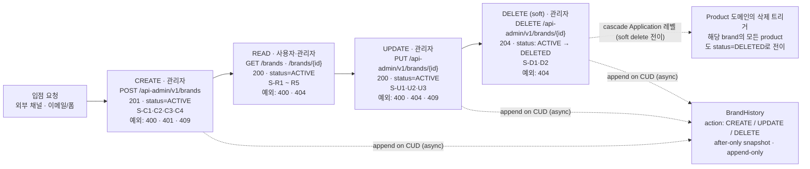
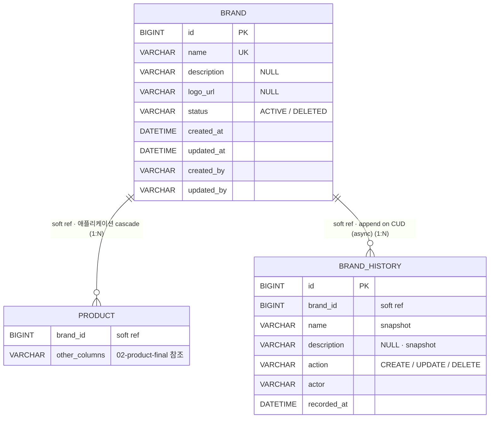
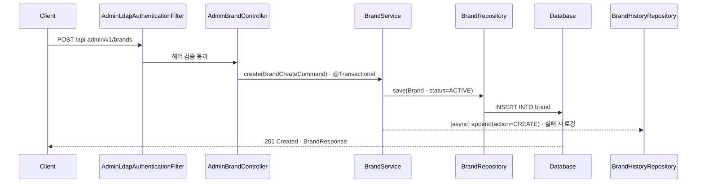
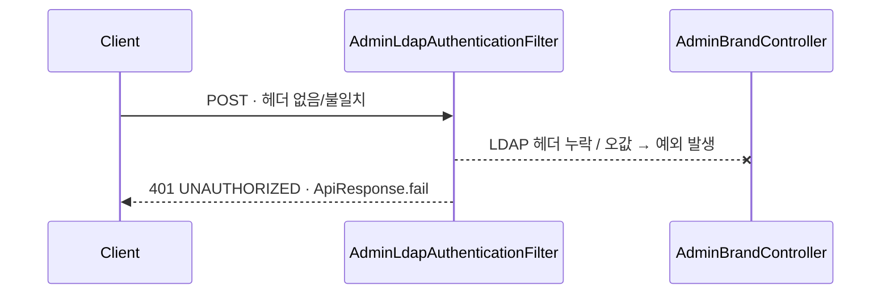
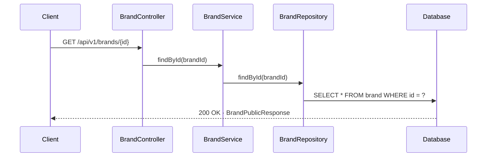
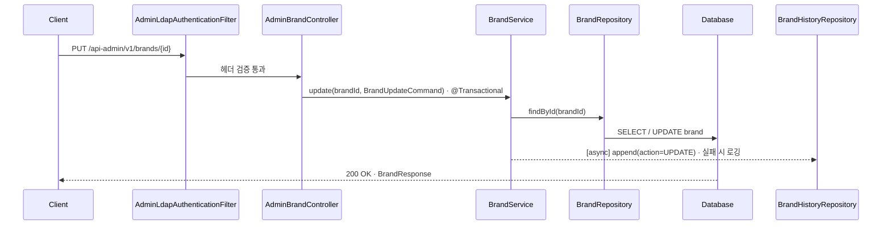
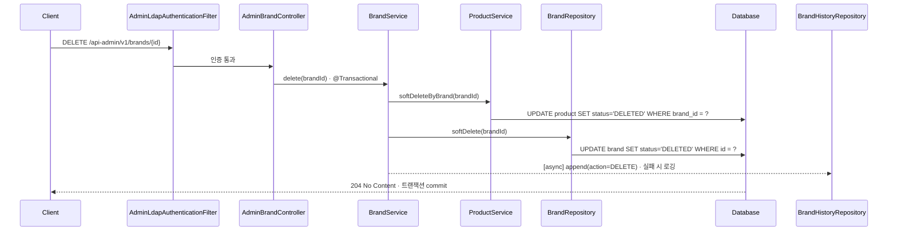

# Brand · 시나리오 → 추출 모델

> Week 2 / Domain 1 of 4 — `01-brand-final.html` 기반 정제본
> 시나리오 명세가 1차 입력이고, 도메인 / DB / API 시퀀스는 모두 거기서 도출됨.

## 1. 유저 시나리오 명세

이 도메인이 가져야 할 모든 동작을 한 문장씩 정리한다. **이게 1차 입력이고, 아래 모든 섹션은 여기서 도출된다.** 누락이 보이면 이 섹션에 한 줄 추가 → 그 변경이 라이프사이클 / 도메인 / DB / 시퀀스 어디에 영향 가는지 점검.

### CREATE · 관리자 브랜드 등록 (4건)

- **S-C1** `정상 201` 관리자 계정은 브랜드를 생성할 수 있다. ※ 변경 이력이 `brand_history`에 비동기로 append됩니다.
- **S-C2** `예외 401` 관리자 LDAP 헤더(`X-Loopers-Ldap`)가 없거나 값이 `loopers.admin`이 아니면 예외가 발생한다.
- **S-C3** `예외 409` 이미 존재하는 brandName으로 등록을 시도하면 예외가 발생한다.
- **S-C4** `예외 400` 필수 필드가 누락되거나 형식이 잘못되면 예외가 발생한다.

### READ · 조회 (5건)

- **S-R1** `정상 200` 사용자는 단건 브랜드를 조회할 수 있다.
- **S-R2** `정상 200` 관리자는 등록된 브랜드 목록을 페이지네이션으로 조회할 수 있다.
- **S-R3** `정상 200` 관리자는 단건 브랜드를 조회할 수 있다 (사용자보다 풍부한 응답).
- **S-R4** `예외 404` 존재하지 않는 brandId로 조회 시 예외가 발생한다.
- **S-R5** `예외 400` brandId 형식이 잘못된 요청이면 예외가 발생한다.

### UPDATE · 관리자 브랜드 수정 (3건)

- **S-U1** `정상 200` 관리자는 브랜드 정보를 수정할 수 있다 (brandId는 불변). ※ 변경 이력이 `brand_history`에 비동기로 append됩니다.
- **S-U2** `예외 404` 존재하지 않는 브랜드 수정 시 예외가 발생한다.
- **S-U3** `예외 409` 중복된 brandName으로 변경 시도 시 예외가 발생한다.

### DELETE · 관리자 브랜드 삭제 (2건)

- **S-D1** `정상 204` 관리자가 브랜드를 삭제하면 해당 브랜드의 `status`가 `DELETED`로 전이되고, 해당 브랜드의 Product도 cascade로 함께 `DELETED`로 전이된다 (**soft delete**). ※ 변경 이력이 `brand_history`에 비동기로 append됩니다.
- **S-D2** `예외 404` 존재하지 않는 브랜드 삭제 시 예외가 발생한다.

## 2. 시나리오 → 라이프사이클 흐름

시나리오들을 데이터의 라이프사이클(들어옴 → 노출 → 변경 → 사라짐)로 정렬. 각 박스 안에 해당 시나리오 ID + 예외 코드.

> Brand 삭제 시 product 정리는 application 레벨 cascade로 한 트랜잭션 안에서 수행한다 (DB ON DELETE CASCADE 사용 X). status를 `DELETED`로 전이하는 soft delete 방식.

## 3. 시나리오 → 도메인 모델

위 시나리오에서 추출된 Brand 도메인의 책임. 각 항목 옆에 출처 시나리오 ID.

### Brand 엔티티 필드

| 필드 | 타입 | 설명 | 출처 시나리오 |
|---|---|---|---|
| `id` | Long (PK) | 시스템 부여 식별자 | 모든 시나리오 |
| `name` | String | 브랜드 이름 (유일성) | S-C1, S-C3, S-U1, S-U3 |
| `description` | String? | 브랜드 소개문 | — |
| `logoUrl` | String? | 로고 이미지 URL | — |
| `status` | `Status` (ACTIVE / DELETED) | 생명주기 상태. soft delete 시 DELETED로 전이 | S-D1 |
| `createdAt` | LocalDateTime | 생성 시각 (BaseEntity, 응답 비노출) | 감사 |
| `updatedAt` | LocalDateTime | 최종 수정 시각 (BaseEntity, 응답 비노출) | S-U1 |
| `createdBy` | String | 생성 actor (BaseEntity, 응답 비노출) | 감사 |
| `updatedBy` | String | 최종 수정 actor (BaseEntity, 응답 비노출) | 감사 |

### 도메인 invariant

- `name` 유일성 — 출처 S-C3, S-U3
- `name` 길이 제약 (예: 1~50자) — 출처 S-C4
- `id`는 시스템 부여, 불변 — 출처 S-U1 (brandId 수정 불가)
- `status` 상태 전이는 **ACTIVE → DELETED 단방향** (DELETED에서 ACTIVE로 복원하는 시나리오 없음)

### 연관 관계

- Brand → Product (1:N) · 삭제 시 application 레벨 cascade (Product도 `status=DELETED`로 전이) — 출처 S-D1
- Brand → BrandHistory (1:N, soft reference) · CUD 시 BrandHistory append (비동기) — 출처 S-C1, S-U1, S-D1

### BrandHistory 엔티티 필드 — after-only snapshot (변경 후 상태만 기록)

| 필드 | 타입 | 설명 | 출처 시나리오 |
|---|---|---|---|
| `id` | Long (PK) | 시스템 부여 식별자 | 감사 |
| `brandId` | Long | 대상 Brand의 id (**soft reference, FK 아님**) | S-C1, S-U1, S-D1 |
| `name` | String | 변경 후 브랜드 이름 (snapshot) | 감사 |
| `description` | String? | 변경 후 설명 (snapshot) | 감사 |
| `action` | `Action` (CREATE / UPDATE / DELETE) | 변경 종류 | S-C1, S-U1, S-D1 |
| `actor` | String | 변경을 일으킨 주체 (관리자 식별자) | 감사 |
| `recordedAt` | LocalDateTime | 이력 적재 시각 | 감사 |

#### BrandHistory invariant

- `brandId`는 soft reference — Brand 삭제 후에도 BrandHistory는 유지된다 (FK 제약 없음)
- after-only snapshot — 변경 전 상태는 저장하지 않는다 (필요 시 이전 row를 조회)
- append-only — UPDATE / DELETE 안 함, 새 row만 추가

## 4. 시나리오 → DB 테이블

naming은 Spring Boot 기본 `SpringPhysicalNamingStrategy` 가정 (camelCase → snake_case).

### brand 테이블

| 컬럼 | 타입 | 제약 | 출처 |
|---|---|---|---|
| `id` | BIGINT | PK, AUTO_INCREMENT | 전부 |
| `name` | VARCHAR(50) | NOT NULL, UK | S-C1, S-C4 |
| `description` | VARCHAR(500) | NULL | — |
| `logo_url` | VARCHAR(500) | NULL | — |
| `status` | VARCHAR(20) | NOT NULL · ACTIVE / DELETED | S-D1 |
| `created_at` | DATETIME(6) | NOT NULL | BaseEntity |
| `updated_at` | DATETIME(6) | NOT NULL | S-U1, BaseEntity |
| `created_by` | VARCHAR(50) | NOT NULL | BaseEntity |
| `updated_by` | VARCHAR(50) | NOT NULL | BaseEntity |

**제약**: `UNIQUE KEY uk_brand_name (name)` — 출처 S-C3, S-U3

### brand_history 테이블

| 컬럼 | 타입 | 제약 | 출처 |
|---|---|---|---|
| `id` | BIGINT | PK, AUTO_INCREMENT | 감사 |
| `brand_id` | BIGINT | NOT NULL · **soft reference (FK 없음)** | S-C1, S-U1, S-D1 |
| `name` | VARCHAR(50) | NOT NULL · 변경 후 snapshot | 감사 |
| `description` | VARCHAR(500) | NULL · 변경 후 snapshot | 감사 |
| `action` | VARCHAR(20) | NOT NULL · CREATE / UPDATE / DELETE | S-C1, S-U1, S-D1 |
| `actor` | VARCHAR(50) | NOT NULL | 감사 |
| `recorded_at` | DATETIME(6) | NOT NULL | 감사 |

**append-only**: CUD 시 새 row append (비동기). brand 삭제 후에도 row 유지.

### product (참조 정책만)

| 컬럼 | 타입 | 제약 | 출처 |
|---|---|---|---|
| `brand_id` | BIGINT | NOT NULL · **soft reference (FK 없음)** | S-D1 |

**Cascade**: Application 레벨 (`BrandService.delete` → `ProductService.softDeleteByBrand`). Brand `status`가 `DELETED`로 전이될 때 Product도 `status=DELETED`로 함께 전이. 주문 스냅샷 등 다른 도메인 영향을 명시적으로 통제.

### ER 다이어그램

> **DB 제약(FK) 없음.** 위 ERD의 모든 관계선(brand ↔ product, brand ↔ brand_history)은 `brand_id` 같은 **논리 참조(soft reference)**일 뿐 DB 레벨 FK 제약을 두지 않습니다. 무결성·cascade는 애플리케이션 레이어 책임 (예: `BrandService.delete`가 Product의 soft delete를 명시적으로 호출). 자세한 규칙은 `docs/conventions.md` 참조.

## 5. 시나리오 → API 시퀀스

대표 시나리오에 대한 호출 흐름. 실선 = 호출, 점선(녹/적) = return / 에러 응답.

### S-C1 — 관리자가 브랜드를 생성한다 (정상)

LDAP 헤더 검증 통과 → 도메인 객체 생성 (status=ACTIVE) → DB persist → 201 응답. 별도로 BrandHistory에 비동기 append.

### S-C2 — LDAP 헤더 누락/오값으로 등록 시도 (예외)

관리자 인증 단계에서 예외가 발생하여 컨트롤러까지 도달하지 못하고 401 응답이 반환된다.

### S-R1 — 사용자가 단건 브랜드를 조회한다 (정상)

`user_required: X` · 인증 우회 → 조회 → 200 응답.

### S-U1 — 관리자가 브랜드 정보를 수정한다 (정상)

LDAP 헤더 검증 통과 → 도메인 객체 수정 (dirty checking) → 200 응답. 별도로 BrandHistory에 비동기 append.

### S-D1 — 관리자가 브랜드를 삭제한다 (soft delete · cascade)

한 트랜잭션 안에서 product를 `status=DELETED`로 전이 → brand를 `status=DELETED`로 전이. Application 레벨 cascade. 별도로 BrandHistory에 비동기 append.

## 6. 결정 이력

본 주차에 확정한 설계 결정. 구현 디테일(JPA 매핑, 인덱스 등)은 본 절에 포함하지 않는다.

### B-?1 — Brand의 도메인 필드

**결정**: id + name + description + logoUrl + contactEmail + status (+ BaseEntity 4컬럼).
**근거**: 운영용 contactEmail은 사용자 응답에서 숨기고 관리자 응답에서만 노출 (B-?2 연결). status는 soft delete의 상태 머신.

### B-?2 — 사용자 응답 vs 관리자 응답 차이

**결정**: 응답 DTO 두 종 분리 — `BrandPublicResponse` / `BrandAdminResponse`.
**근거**: 같은 도메인 객체에서 권한별로 필드 노출 차등. 사용자에는 id/name/description/logoUrl, 관리자에는 위 + contactEmail/createdAt/updatedAt/(집계: productCount 등).

### B-?3 — 삭제 방식 (hard vs soft)

**결정**: **Soft delete + Application 레벨 cascade**. `status: ACTIVE / DELETED` 2-state machine, 단방향 전이.
**근거**: 주문 도메인이 brand/product 정보를 스냅샷으로 보존하지만, 운영 복원/감사 요구에 대응하기 위해 row를 보존. cascade는 한 트랜잭션 안에서 application 레벨로 명시 호출(`BrandService.delete` → `ProductService.softDeleteByBrand`).

### B-?4 — brandName 유일성

**결정**: 유일성 강제 — 409 응답.
**근거**: 시나리오 S-C3/S-U3이 이 가정에서 출발.

## 7. 미래 확장 마킹

### B-F1 — Brand staff self-service · Brand = Tenant

Brand 단위 운영자 계정이 자기 brand의 정보 수정 / 상품 CRUD를 직접 수행. 상세는 `docs/big-picture.md`의 "추가 비전" 섹션.

**이번 주 설계가 받아내야 할 것**:
- brand 정보를 product 내부에 비정규화하지 않음 (`brand_id` 분리 유지)
- 관리자 인증 필터를 인터페이스 레이어에 두되 추후 Role 기반 분리 가능하게
- 응답 DTO를 권한별로 나누는 패턴을 Brand staff용에도 확장 가능

### B-F2 — history 비동기 적재 인프라

`BrandHistoryRepository`가 어떤 메커니즘으로 비동기 적재되는가 — 메시지 큐(Kafka 등) / outbox 패턴 / retry policy.

이번 주는 의도만 박고 구현 미설계. 현재는 `BrandHistoryRepository`를 인터페이스로 노출하고, 실패 시 로깅한다는 정책만 시퀀스에 표기. 적재 채널 / 보장 수준(at-least-once / exactly-once) / 재시도 정책은 인프라 도입 시점에 결정.

### B-F3 — history 외부 노출 endpoint

`brand_history`를 조회할 수 있는 API — 누가 자기 브랜드의 변경 이력을 볼 수 있는가.

seller(Brand staff) 도입 시점에 추가. B-F1과 연결 — Brand staff가 자기 브랜드의 변경 이력을 self-service로 조회. 현재 관리자 only 컨텍스트에서는 시나리오에 포함하지 않음.

---

> 원본 HTML: [`01-brand-final.html`](./01-brand-final.html) · 변경 시 HTML과 동기화 필요
