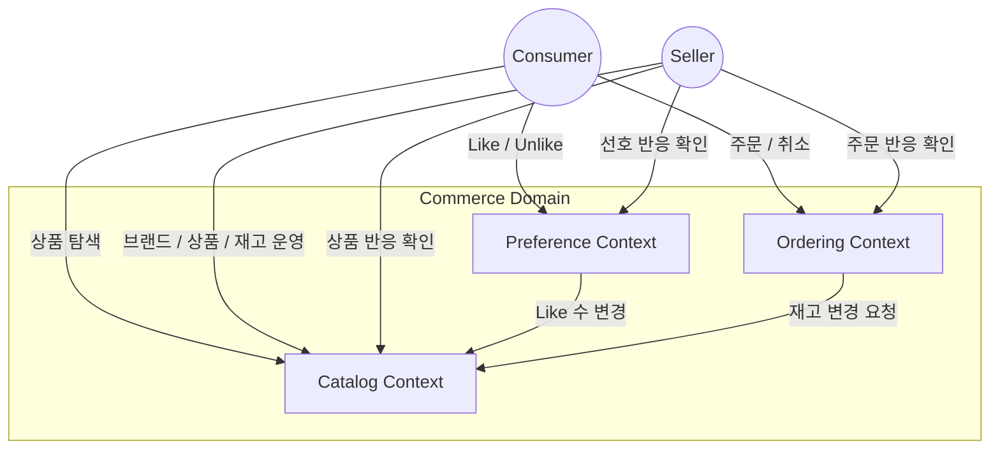

# 01. 요구사항 및 도메인 모델

이 문서는 도메인 전문가와 함께 검증할 비즈니스 언어와 요구사항을 정의한다. 구현 방법은 다른 설계 문서에서 다룬다.

## 1. 현재 비즈니스 범위

현재 범위는 상품 운영, 소비자 반응, 주문 흐름을 다룬다.

- Consumer는 상품을 탐색하고 Like/Unlike, 주문, 취소를 수행한다.
- Seller는 브랜드와 상품을 등록하고, 가격/판매상태/재고를 관리하며, 상품에 대한 소비자 반응을 확인한다.
- 개인화 추천과 고급 통계 대시보드는 미래 확장 후보이며 현재 범위의 핵심 도메인에는 포함하지 않는다.

## 2. Actor

| Actor | 정의 | 주요 관심사 |
| :--- | :--- | :--- |
| Consumer | 상품을 탐색하고 구매하는 고객 | 상품 발견, 선호 표현, 주문, 취소 |
| Seller | 브랜드와 상품을 운영하는 판매자 또는 브랜드 운영자 | 브랜드/상품 운영, 재고 관리, 소비자 반응 확인 |

## 3. Bounded Context별 유비쿼터스 언어

같은 단어라도 Bounded Context마다 의미가 다를 수 있다. 이 문서는 Context별 의미를 우선한다.

### 3.1 Catalog Context

목적: Seller가 운영하고 Consumer가 탐색하는 상품 정보를 정의한다.

| 용어 | 의미 |
| :--- | :--- |
| Seller | 브랜드와 상품을 운영하고 상품 반응 요약을 확인하는 주체 |
| Brand | Seller가 운영하는 상품 묶음 또는 상표 |
| Product | Consumer에게 판매되는 상품 단위 |
| Product Status | 상품이 판매 가능한지, 품절인지, 판매 중지인지 나타내는 상태 |
| Stock | 현재 주문 가능한 수량 |
| Stock Adjustment | Seller의 수동 조정 또는 주문/취소로 발생하는 재고 변화 |
| Product Like Count | Product가 현재 받은 Like의 총합 |
| Product Reaction Summary | Seller가 확인하는 Like/Unlike, 주문/취소 반응 요약 |

### 3.2 Preference Context

목적: Consumer가 Product에 보이는 선호 반응과 그 이력을 정의한다.

| 용어 | 의미 |
| :--- | :--- |
| Consumer | Product에 Like 또는 Unlike 반응을 남기는 고객 |
| Seller | 자신이 운영하는 Product의 Consumer 반응을 확인하는 주체 |
| Product | Like/Unlike의 대상 |
| Like | Consumer가 Product를 선호한다고 표시하는 상태 전환 |
| Unlike | Consumer가 Product 선호 표시를 해제하는 상태 전환 |
| Current Like State | Consumer와 Product 사이의 현재 선호 상태 |
| Like History | Like/Unlike 상태 전환의 이력 |
| ProductLiked | Product가 실제로 Like 되었다는 사건 |
| ProductUnliked | Product가 실제로 Unlike 되었다는 사건 |

### 3.3 Ordering Context

목적: Consumer의 구매 의사와 취소 흐름을 정의한다.

| 용어 | 의미 |
| :--- | :--- |
| Consumer | 주문을 생성하고 취소하는 고객 |
| Seller | 자신이 운영하는 Product의 주문/취소 반응을 확인하는 주체 |
| Order | Consumer가 상품 구매 의사를 확정해 생성한 기록 |
| Order Line | 주문에 포함된 개별 상품의 주문 시점 정보 |
| Ordered Product | 주문 안에서의 상품. 현재 Catalog Product가 아니라 주문 시점의 상품을 의미한다 |
| Cancel | 생성된 Order를 취소 상태로 전이하는 행위 |
| Order Status History | Order의 상태 변화 이력 |
| OrderPlaced | Order가 생성되었다는 사건 |
| OrderCancelled | Order가 취소되었다는 사건 |

## 4. Bounded Context 책임

### 4.1 Catalog Context

- Seller의 브랜드 추가와 상품 추가를 다룬다.
- Seller의 상품명, 가격, 판매 상태, 재고 관리를 다룬다.
- Consumer의 상품 목록, 상품 상세, 브랜드별 상품 탐색을 지원한다.
- 상품의 현재 Like 수를 보여준다.
- Seller의 Product Reaction Summary를 제공한다.

### 4.2 Preference Context

- Consumer의 Like/Unlike를 다룬다.
- 같은 상태로 반복되는 Like/Unlike 요청은 결과를 바꾸지 않는다.
- Like/Unlike 이력을 보존한다.
- 상품의 현재 Like 수 변경을 Catalog Context에 알린다.
- Seller가 상품별 Like/Unlike 반응을 확인할 수 있게 한다.

### 4.3 Ordering Context

- Consumer의 주문 생성을 다룬다.
- 주문 시점의 상품 정보를 주문 안에 보존한다.
- Consumer의 주문 취소를 다룬다.
- 주문과 취소에 따른 재고 변화를 Catalog Context에 요청한다.
- Seller가 상품별 주문/취소 반응을 확인할 수 있게 한다.

## 5. Context Map

목적: 현재 비즈니스 범위의 Bounded Context와 Actor 관계만 표현한다.

읽는 법:

1. 이 다이어그램은 비즈니스 관계만 표현한다.
2. 비즈니스 관계 외의 내용은 표현하지 않는다.
3. Seller의 상품 반응 확인은 현재 범위의 조회 요구사항이다.

## 6. 도메인 사건

목적: Context 사이에서 중요하게 다뤄야 하는 비즈니스 사건을 정의한다.

| 사건 | 발생 Context | 비즈니스 의미 |
| :--- | :--- | :--- |
| BrandCreated | Catalog | Seller가 Brand를 추가했다 |
| ProductCreated | Catalog | Seller가 Product를 추가했다 |
| ProductStockChanged | Catalog | Product의 주문 가능 수량이 변경되었다 |
| ProductLiked | Preference | Consumer가 Product를 Like 상태로 전환했다 |
| ProductUnliked | Preference | Consumer가 Product를 Unlike 상태로 전환했다 |
| OrderPlaced | Ordering | Consumer의 Order가 생성되었다 |
| OrderCancelled | Ordering | Consumer의 Order가 취소되었다 |

사건 규칙:

- 사건 이름은 이미 발생한 사실을 과거형으로 표현한다.
- 사건은 도메인 전문가와 대화할 수 있는 비즈니스 사실이어야 한다.
- 사건 처리 방식은 이 문서에서 다루지 않는다.

## 7. 기능 요구사항

### 7.1 상품 탐색

- Consumer는 상품 목록을 볼 수 있다.
- Consumer는 상품 상세를 볼 수 있다.
- Consumer는 브랜드별 상품을 볼 수 있다.
- Consumer는 상품의 현재 Like 수를 볼 수 있다.

### 7.2 Seller 상품 운영

- ACTIVE 상태의 Seller만 Brand/Product 운영 행위를 할 수 있다.
- Seller는 Brand를 추가할 수 있다.
- Seller는 자신이 운영하는 Brand에 Product를 추가할 수 있다.
- Seller는 Product의 이름, 가격, 판매 상태를 변경할 수 있다.
- Seller는 Product의 Stock을 조정할 수 있다.
- Seller는 자신이 운영하는 Brand와 Product에 대해서만 운영 행위를 할 수 있다.

### 7.3 Seller 상품 반응 확인

- Seller는 자신이 운영하는 Product의 현재 Like 수를 볼 수 있다.
- Seller는 자신이 운영하는 Product의 Like/Unlike 반응을 볼 수 있다.
- Seller는 자신이 운영하는 Product의 주문/취소 반응을 볼 수 있다.

### 7.4 Like / Unlike

- Consumer는 Product를 Like 할 수 있다.
- Consumer는 Product를 Unlike 할 수 있다.
- 이미 Like 상태인 Product를 다시 Like 해도 상태와 이력은 바뀌지 않는다.
- 이미 Unlike 상태인 Product를 다시 Unlike 해도 상태와 이력은 바뀌지 않는다.
- Like 수는 실제 상태 전환이 발생했을 때만 바뀐다.
- Like 수는 음수가 될 수 없다.

### 7.5 주문 생성

- Consumer는 하나 이상의 Product로 Order를 생성할 수 있다.
- 판매 가능한 상태의 Product만 주문할 수 있다.
- Order는 주문 시점의 상품명, 가격, 수량을 보존한다.
- 주문 가능한 Stock이 부족하면 Order는 생성되지 않는다.
- Order가 생성되면 해당 Product의 Stock은 주문 수량만큼 줄어든다.

### 7.6 주문 취소

- Consumer는 취소 가능한 Order를 취소할 수 있다.
- Order가 취소되면 취소 상태와 취소 사유를 남긴다.
- Order가 취소되면 주문으로 줄어든 Stock을 복구한다.
- 이미 취소된 Order를 다시 취소해도 상태와 재고는 다시 바뀌지 않는다.
