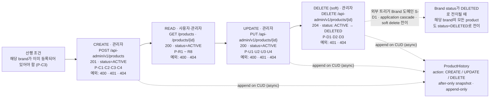
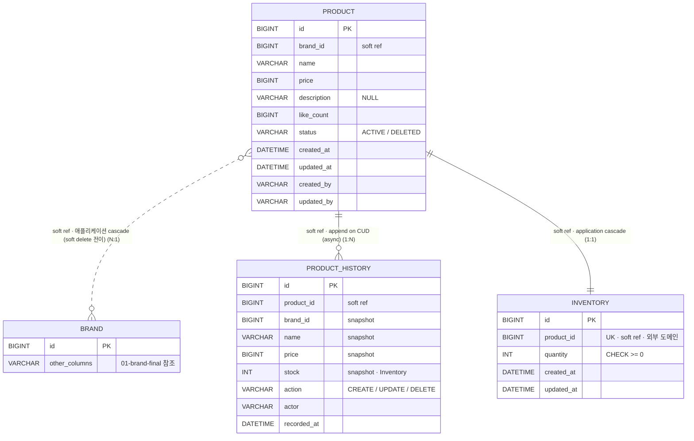
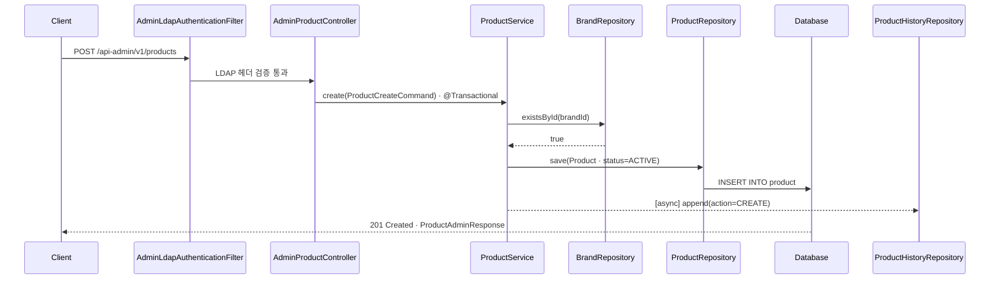
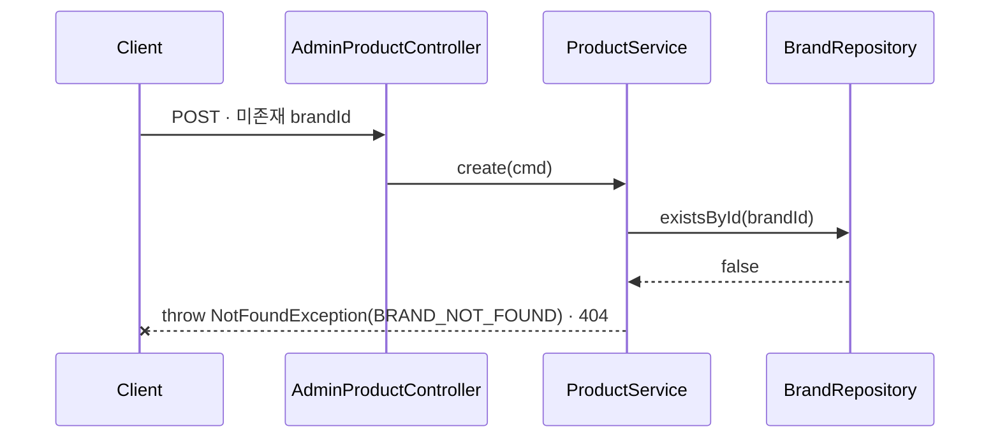
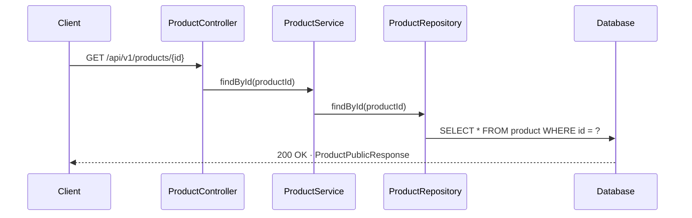
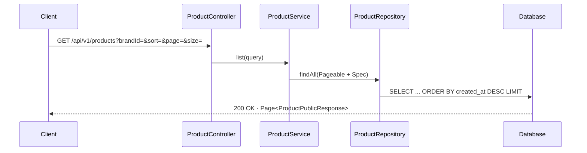
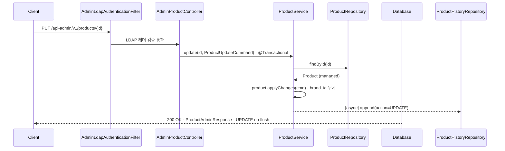
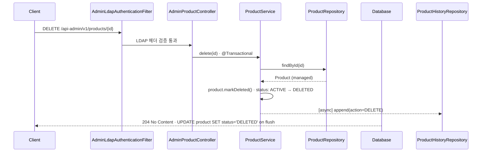
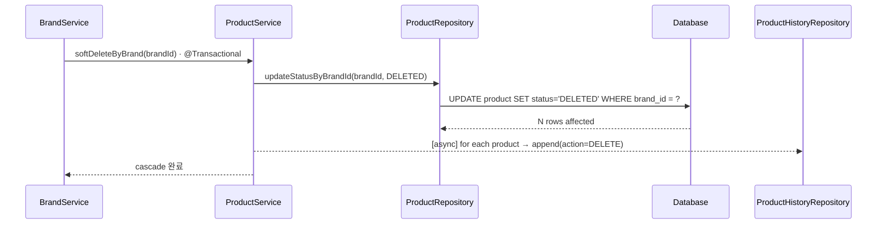

# Product · 시나리오 → 추출 모델

> Week 2 / Domain 2 of 4 — `02-product-final.html` 기반 정제본
> 시나리오 명세가 1차 입력이고, 도메인 / DB / API 시퀀스는 모두 거기서 도출됨.

## 1. 유저 시나리오 명세

이 도메인이 가져야 할 모든 동작을 한 문장씩 정리한다. **이게 1차 입력이고, 아래 모든 섹션은 여기서 도출된다.**

### CREATE · 관리자 상품 등록 (4건)

- **P-C1** `정상 201` 관리자는 이미 등록된 brandId 아래에 상품을 생성할 수 있다. ※ 변경 이력이 `product_history`에 비동기로 append됩니다.
- **P-C2** `예외 401` 관리자 LDAP 헤더(`X-Loopers-Ldap`)가 없거나 값이 `loopers.admin`이 아니면 예외가 발생한다.
- **P-C3** `예외 404` 존재하지 않는 brandId로 상품 등록을 시도하면 예외가 발생한다.
- **P-C4** `예외 400` 필수 필드가 누락되거나 형식이 잘못되면 예외가 발생한다.

### READ · 조회 (8건)

- **P-R1** `정상 200` 사용자는 단건 상품을 조회할 수 있다.
- **P-R2** `정상 200` 사용자는 상품 목록을 페이지네이션으로 조회할 수 있다 (기본 정렬: latest).
- **P-R3** `정상 200` 사용자는 brandId 쿼리로 특정 브랜드의 상품만 필터링해서 조회할 수 있다.
- **P-R4** `정상 200` 사용자는 `sort=price_asc` / `likes_desc`로 정렬해서 조회할 수 있다 (선택 구현).
- **P-R5** `정상 200` 관리자는 등록된 상품 목록을 페이지네이션과 brandId 필터로 조회할 수 있다.
- **P-R6** `정상 200` 관리자는 단건 상품을 조회할 수 있다 (사용자보다 풍부한 응답).
- **P-R7** `예외 404` 존재하지 않는 productId로 조회 시 예외가 발생한다.
- **P-R8** `예외 400` productId / brandId / page / size 형식이 잘못된 요청이면 예외가 발생한다.

### UPDATE · 관리자 상품 수정 (4건)

- **P-U1** `정상 200` 관리자는 상품 정보를 수정할 수 있다 (brandId는 불변). ※ 변경 이력이 `product_history`에 비동기로 append됩니다.
- **P-U2** `예외 400/무시` 요청에 다른 brandId가 포함되어도 brandId는 변경되지 않는다 (무시 또는 거부).
- **P-U3** `예외 404` 존재하지 않는 productId 수정 시 예외가 발생한다.
- **P-U4** `예외 401` 관리자 LDAP 헤더(`X-Loopers-Ldap`)가 없거나 값이 `loopers.admin`이 아니면 예외가 발생한다.

### DELETE · 관리자 상품 삭제 (3건)

- **P-D1** `정상 204` 관리자가 상품을 삭제하면 해당 상품의 `status`가 `DELETED`로 전이된다 (**soft delete**). 주문 스냅샷은 보존되므로 과거 주문 기록에는 영향이 없다. ※ 변경 이력이 `product_history`에 비동기로 append됩니다.
- **P-D2** `예외 404` 존재하지 않는 productId 삭제 시 예외가 발생한다.
- **P-D3** `예외 401` 관리자 LDAP 헤더(`X-Loopers-Ldap`)가 없거나 값이 `loopers.admin`이 아니면 예외가 발생한다.

## 2. 시나리오 → 라이프사이클 흐름

시나리오들을 데이터의 라이프사이클(들어옴 → 노출 → 변경 → 사라짐)로 정렬. 각 박스 안에 해당 시나리오 ID + 예외 코드.

## 3. 시나리오 → 도메인 모델

위 시나리오에서 추출된 Product 도메인의 책임. 각 항목 옆에 출처 시나리오 ID.

### Product 엔티티 필드

| 필드 | 타입 | 설명 | 출처 |
|---|---|---|---|
| `id` | Long (PK) | 시스템 부여 식별자 | 모든 시나리오 |
| `brandId` | Long | 상품이 속한 브랜드 식별자 (soft reference) | P-C1, P-C3, P-R3 |
| `name` | String | 상품명 | P-C4 |
| `price` | Money / Long | 판매가 (`sort=price_asc` 정렬 키) | P-R4 |
| `description` | String? | 상세 설명 | — |
| `likeCount` | Long | 좋아요 집계 (`likes_desc` 정렬용 · 비정규화) | P-R4 |
| `status` | `Status` (ACTIVE / DELETED) | 생명주기 상태. soft delete 시 DELETED로 전이 | P-D1 |
| `createdAt` | LocalDateTime | 생성 시각 (`sort=latest` 정렬 키, BaseEntity, 응답 비노출) | P-R2 |
| `updatedAt` | LocalDateTime | 최종 수정 시각 (BaseEntity, 응답 비노출) | P-U1 |
| `createdBy` | String | 생성 actor (BaseEntity, 응답 비노출) | 감사 |
| `updatedBy` | String | 최종 수정 actor (BaseEntity, 응답 비노출) | 감사 |

> **재고 수량은 Product 필드가 아니다.** `Inventory` 도메인으로 분리되어 별도 테이블 `inventory`에 보관하며 `inventory.product_id` (1:1)로 연결한다. 분리 근거(라이프사이클 / 정합성 모델 / 캐시 전략 차이)는 `docs/ubiquitous-language.md` §7 참조.

### 도메인 invariant

- `brandId`는 존재하는 brand여야 함 — 출처 P-C1, P-C3
- `brandId`는 생성 후 불변 — 출처 P-U1, P-U2
- `id`는 시스템 부여, 불변 — 출처 P-U1
- `price >= 0` (음수 금지) — 출처 P-C4
- `name` 길이 제약 (예: 1~100자) — 출처 P-C4
- `status` 상태 전이는 **ACTIVE → DELETED 단방향** — 출처 P-D1
- 재고 invariant(`quantity >= 0`, 주문 차감 보장 등)는 Inventory 도메인이 소유

### 연관 관계

- Product → Brand (N:1) · `brand_id` soft reference · Brand 삭제(soft) 시 application cascade로 Product도 `status=DELETED`로 함께 전이 — 출처 P-C1, P-D1 (Brand 도메인 S-D1과 연동)
- Product ↔ Inventory (1:1) · 별도 도메인 · `inventory.product_id` (UK) · Product 생성 시 함께 생성, 삭제 시 application cascade로 함께 archive
- Product ↔ Like (1:N) · `likeCount` 비정규화로 정렬 지원
- Product → ProductHistory (1:N, soft reference) · CUD 시 ProductHistory append (비동기) — 출처 P-C1, P-U1, P-D1
- Product → OrderItem (스냅샷) · Product 삭제(soft)가 과거 주문 기록에 영향 X — 출처 P-D1

### ProductHistory 엔티티 필드 — after-only snapshot (변경 후 상태만 기록)

| 필드 | 타입 | 설명 | 출처 |
|---|---|---|---|
| `id` | Long (PK) | 시스템 부여 식별자 | 감사 |
| `productId` | Long | 대상 Product의 id (**soft reference, FK 아님**) | P-C1, P-U1, P-D1 |
| `brandId` | Long | 변경 후 brandId (snapshot) | 감사 |
| `name` | String | 변경 후 상품명 (snapshot) | 감사 |
| `price` | Long | 변경 후 가격 (snapshot) | 감사 |
| `stock` | Int | 변경 후 재고 수량 (snapshot, Inventory에서 조회) | 감사 |
| `action` | `Action` (CREATE / UPDATE / DELETE) | 변경 종류 | P-C1, P-U1, P-D1 |
| `actor` | String | 변경을 일으킨 주체 (관리자 식별자) | 감사 |
| `recordedAt` | LocalDateTime | 이력 적재 시각 | 감사 |

#### ProductHistory invariant

- `productId`는 soft reference — Product 삭제(soft) 후에도 ProductHistory는 유지된다 (FK 제약 없음)
- after-only snapshot — 변경 전 상태는 저장하지 않는다
- append-only — UPDATE / DELETE 안 함, 새 row만 추가
- 비동기 적재 — CUD 트랜잭션 commit 후 비동기로 append (인프라는 P-F3에서 결정)

## 4. 시나리오 → DB 테이블

naming은 Spring Boot 기본 `SpringPhysicalNamingStrategy` 가정 (camelCase → snake_case).

### product 테이블

| 컬럼 | 타입 | 제약 | 출처 |
|---|---|---|---|
| `id` | BIGINT | PK, AUTO_INCREMENT | 전부 |
| `brand_id` | BIGINT | NOT NULL · **soft reference (FK 없음)** | P-C1, P-C3 |
| `name` | VARCHAR(100) | NOT NULL | P-C4 |
| `price` | BIGINT | NOT NULL, CHECK ≥ 0 | P-R4 |
| `description` | VARCHAR(1000) | NULL | — |
| `like_count` | BIGINT | NOT NULL DEFAULT 0 | P-R4, P-?5 |
| `status` | VARCHAR(20) | NOT NULL · ACTIVE / DELETED | P-D1, P-?6 |
| `created_at` | DATETIME(6) | NOT NULL | BaseEntity, P-R2 |
| `updated_at` | DATETIME(6) | NOT NULL | P-U1, BaseEntity |
| `created_by` | VARCHAR(50) | NOT NULL | BaseEntity |
| `updated_by` | VARCHAR(50) | NOT NULL | BaseEntity |

**Cascade**: Application 레벨 (`BrandService.delete` → `ProductService.softDeleteByBrand`). Brand 도메인 S-D1 참조. 주문 스냅샷은 별도 테이블에 보존되므로 영향 없음 (P-D1). Inventory 행은 Product 생성/삭제 트랜잭션 내에서 application cascade로 함께 생성/archive.

> `stock` 컬럼은 `product` 테이블에 두지 않는다 — 별도 `inventory` 테이블 소유 (P-?4).

### product_history 테이블

| 컬럼 | 타입 | 제약 | 출처 |
|---|---|---|---|
| `id` | BIGINT | PK, AUTO_INCREMENT | 감사 |
| `product_id` | BIGINT | NOT NULL · **soft reference (FK 없음)** | P-C1, P-U1, P-D1 |
| `brand_id` | BIGINT | NOT NULL · 변경 후 snapshot | 감사 |
| `name` | VARCHAR(100) | NOT NULL · 변경 후 snapshot | 감사 |
| `price` | BIGINT | NOT NULL · 변경 후 snapshot | 감사 |
| `stock` | INT | NOT NULL · 변경 후 snapshot (Inventory에서 조회) | 감사 |
| `action` | VARCHAR(20) | NOT NULL · CREATE / UPDATE / DELETE | P-C1, P-U1, P-D1 |
| `actor` | VARCHAR(50) | NOT NULL | 감사 |
| `recorded_at` | DATETIME(6) | NOT NULL | 감사 |

**append-only**: CUD 시 새 row append (비동기). product 삭제(soft) 후에도 row 유지. 외부 노출 endpoint는 P-F4에서 결정.

### inventory 테이블 (참조 — Inventory 외부 도메인)

| 컬럼 | 타입 | 제약 | 비고 |
|---|---|---|---|
| `id` | BIGINT | PK, AUTO_INCREMENT | — |
| `product_id` | BIGINT | NOT NULL, **UK**, **soft reference** (FK 없음) | 1:1 매핑, application cascade |
| `quantity` | INT | NOT NULL, CHECK ≥ 0 | Inventory 도메인 소유 |
| `created_at` | DATETIME(6) | NOT NULL | BaseEntity |
| `updated_at` | DATETIME(6) | NOT NULL | BaseEntity |

구체 컬럼/제약은 Inventory 도메인 시나리오의 결정 사항. 본 문서에서는 Product와의 관계만 명시.

### ER 다이어그램

> **DB 제약(FK) 없음.** 위 ERD의 모든 관계선(product ↔ brand, product ↔ product_history, product ↔ inventory)은 `brand_id` / `product_id` 같은 **논리 참조(soft reference)**일 뿐 DB 레벨 FK 제약을 두지 않습니다. 무결성·cascade는 애플리케이션 레이어 책임 (예: `BrandService.delete`가 `ProductService.softDeleteByBrand`를 명시적으로 호출, Product 삭제(soft) 시 ProductHistory append와 Inventory archive를 함께 수행).

## 5. 시나리오 → API 시퀀스

대표 시나리오에 대한 호출 흐름. 실선 = 호출, 점선(녹/적) = return / 에러 응답.

### P-C1 — 관리자가 상품을 생성한다 (정상)

LDAP 헤더 검증 통과 → brand 존재 검증 → 도메인 객체 생성 → DB persist → 201 응답 → `product_history` 비동기 append.

### P-C3 — 존재하지 않는 brandId로 등록 시도 (예외)

brand 존재 검증에서 단락. product persist 도달 못함.

### P-R1 — 사용자가 단건 상품을 조회한다 (정상)

`user_required: X` · 인증 우회 → 조회 → 200 응답 (사용자용 응답 DTO).

### P-R2 — 사용자 목록 조회 (정렬 + 페이지네이션)

기본 `sort=latest`, `brandId` 필터 + page/size 처리.

### P-U1 — 관리자가 상품을 수정한다 (정상, brand_id 불변)

LDAP 통과 → 기존 product 로드 → 도메인 메서드로 부분 수정 (brand_id 변경 시도는 거부/무시) → dirty checking → 200 응답 → `product_history` 비동기 append.

### P-D1 — 관리자가 상품을 삭제한다 (soft delete)

LDAP 통과 → 기존 product 로드 → `status`를 `DELETED`로 전이 → 204 응답 → `product_history` 비동기 append.

### P-D1 cascade — Brand 삭제 cascade (soft delete 전이)

Brand `status`가 `DELETED`로 전이될 때 application cascade로 해당 brand의 모든 Product도 `status=DELETED` 일괄 전이. Brand 도메인 S-D1과 연동.

## 6. 결정 이력

본 주차에 확정한 설계 결정. 구현 디테일(JPA 매핑, 동시성 메커니즘, 인덱스 등)은 본 절에 포함하지 않는다.

### P-?1 — Product의 도메인 필드

**결정**: `brandId` + `name` + `price` + `description` + `imageUrl` + `status` (+ BaseEntity 4컬럼).
**근거**: 첫 등록 시점에 단일 URL 컬럼으로 시작 — 다중 이미지/상세 본문 확장은 미룸. 재고 수량은 Inventory 도메인 소유 (P-?4). `status`는 soft delete의 상태 머신.

### P-?2 — 사용자 응답 vs 관리자 응답 차이

**결정**: 응답 DTO 두 종 분리 — `ProductPublicResponse` / `ProductAdminResponse`.
**근거**: big-picture가 "고객/관리자 정보 차등을 고민하라" 명시. 사용자에는 재고 상태 derived(`inStock`/`stockStatus`)만, 관리자에는 정확 수량(`stockQuantity`) + createdAt/updatedAt 노출. Inventory 합성은 application 레이어 책임.

### P-?3 — 정렬 옵션

**결정**: `latest` 필수 + `price_asc` / `likes_desc` 선택. 화이트리스트 enum, 잘못된 값은 400.
**근거**: `likes_desc`는 P-?5 비정규화에 의존.

### P-?4 — 재고 모델

**결정**: 별도 `Inventory` 도메인 / `inventory` 테이블 (1:1). `product.stock` 컬럼 두지 않음.
**근거**: 라이프사이클·정합성 모델·캐시 전략이 Product와 본질적으로 다름. DDD Bounded Context 관점 일치. 외부 노출은 derived 표현(`inStock`/`stockStatus`)만.
**미래 결정으로 넘김**: 단일 quantity vs available/reserved 분리, 차감 시점(O-?2), 동시성 제어(O-?3), 이력 테이블, 멀티-warehouse.

### P-?5 — likeCount 비정규화

**결정**: `product.like_count` 컬럼 비정규화 (POST/DELETE like 시점에 증감).
**근거**: `likes_desc` 정렬을 매 요청 COUNT(*) JOIN으로 처리하면 비용. 실시간성 vs 비용 균형. Like 도메인 L-?3와 동시 결정.

### P-?6 — 삭제 방식

**결정**: **Soft delete + 2-state machine** (`status: ACTIVE → DELETED` 단방향).
**근거**: 주문 도메인이 product 정보를 스냅샷으로 보존하므로 row 자체는 가벼이 보존해도 무영향. 운영 복원/감사 요구에 대응하기 위해 row를 남김. Brand 도메인의 cascade도 soft delete로 전이 (`ProductService.softDeleteByBrand`).

### P-?7 — brand 미존재 응답

**결정**: 이번 주는 404 (`BRAND_NOT_FOUND`)만.
**근거**: brand가 soft delete된 경우(상태=DELETED) 라도 본 주차는 404로 통일. 비활성=409(`BRAND_INACTIVE`) 분기는 도입 시점에 검토.

## 7. 미래 확장 마킹

### P-F1 — Brand staff (Brand = Tenant) 의 자기 brand 상품 CRUD

Brand 단위 운영자 계정이 자기 brand의 상품만 CRUD. Platform Admin과 동일한 API 모양을 권한만 분리. 상세는 `docs/big-picture.md`의 "추가 비전".

**이번 주 설계가 받아내야 할 것**:
- `brand_id`를 product에 분리 컬럼으로 유지 — 권한 격리의 축. 비정규화 금지
- 관리자 인증 필터를 LDAP 정확 일치로 단순하게 두되, Role enum (Customer / Platform Admin / Brand Staff) 도입 여지를 막지 않는다
- 응답 DTO를 권한별로 나누는 패턴(P-?2)을 Brand staff용으로 확장 가능하게
- `brand_id`가 수정 불가(P-U1, P-U2)이어야 Brand staff 권한 우회를 차단 가능

### P-F2 — 행동 데이터 기반 랭킹 · 추천

좋아요 / 주문 / 노출 등 유저 행동 데이터를 비동기 집계 → 정렬·추천에 활용. `likes_desc` 정렬이 그 첫 단계.

**이번 주 설계가 받아내야 할 것**:
- `like_count` 비정규화(P-?5) — 실시간 정렬 지원과 미래 배치 랭킹 양쪽에 입력
- 주문 스냅샷에서 product 정보를 보존(P-D1) — product 삭제 후에도 과거 행동 데이터 추적 가능
- 정렬 옵션을 화이트리스트 enum으로 둠 — 미래 `trending`, `recommended` 등 enum 확장이 자연스러움

### P-F3 — product_history 비동기 적재 인프라

이번 주는 "변경 이력이 `product_history`에 비동기로 append된다"는 계약만 확정. 실제 비동기 메커니즘은 미래 결정.

**이번 주 설계가 받아내야 할 것**:
- after-only snapshot 구조 — 변경 후 상태만 기록하므로 적재 인프라 교체 시 스키마는 그대로
- soft reference(FK 없음) — Product 삭제(soft) 후에도 `product_history`는 유지
- CUD 트랜잭션 commit 후 적재 — Product 본 트랜잭션에 영향 없음. 적재 실패 시 비즈니스 트랜잭션은 성공으로 간주

**후속 결정 후보**:
- Spring `@TransactionalEventListener(AFTER_COMMIT)` — 단순, 단일 인스턴스 한정
- Outbox 패턴 + Kafka / SQS — 적재 보장 + 다른 소비자(검색 인덱싱 등)와 공유
- CDC (Debezium 등) — product 테이블 변경을 직접 감지. 트랜잭션 코드 무침투

### P-F4 — product_history 외부 노출 endpoint

현재는 `product_history`를 내부 감사 로그로만 사용. 외부 노출은 seller(브랜드 입점 운영자) 자기 상품 변경 이력 추적 같은 use case가 명시될 때 도입.

**이번 주 설계가 받아내야 할 것**:
- append-only / after-only snapshot — 노출 시점에도 invariant 유지
- `actor` 컬럼 보유 — 미래 권한 격리(자기 브랜드 product의 이력만 노출)의 축
- response DTO 분리 패턴(P-?2)이 ProductHistory에도 그대로 적용 가능

**도입 트리거**: Brand staff(P-F1) self-service가 도입되어 자기 brand 상품의 변경 이력을 직접 확인해야 하는 시점.

---

> 원본 HTML: [`02-product-final.html`](./02-product-final.html) · 변경 시 HTML과 동기화 필요
