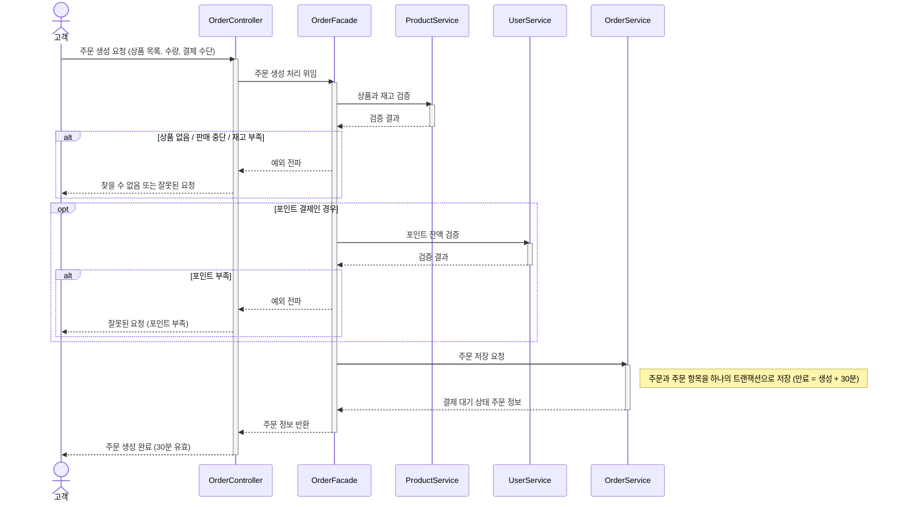
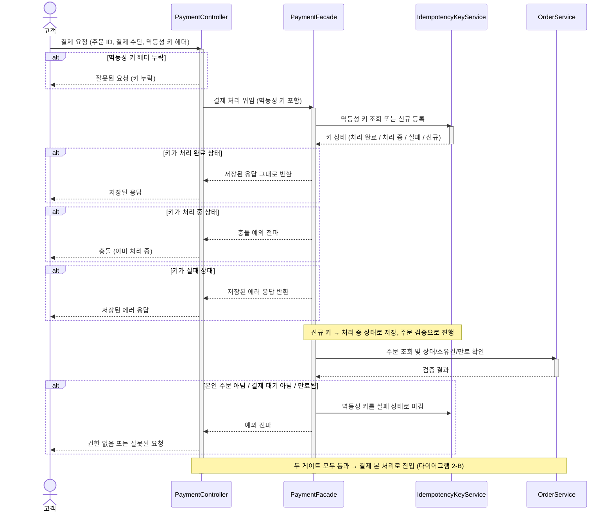
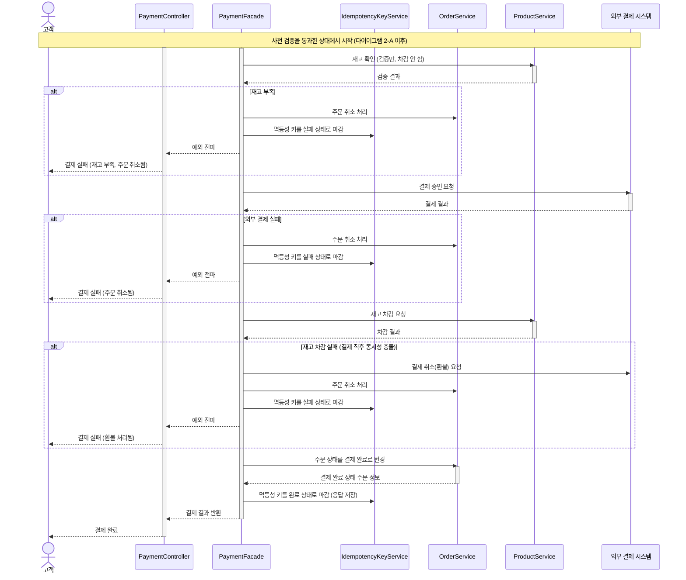
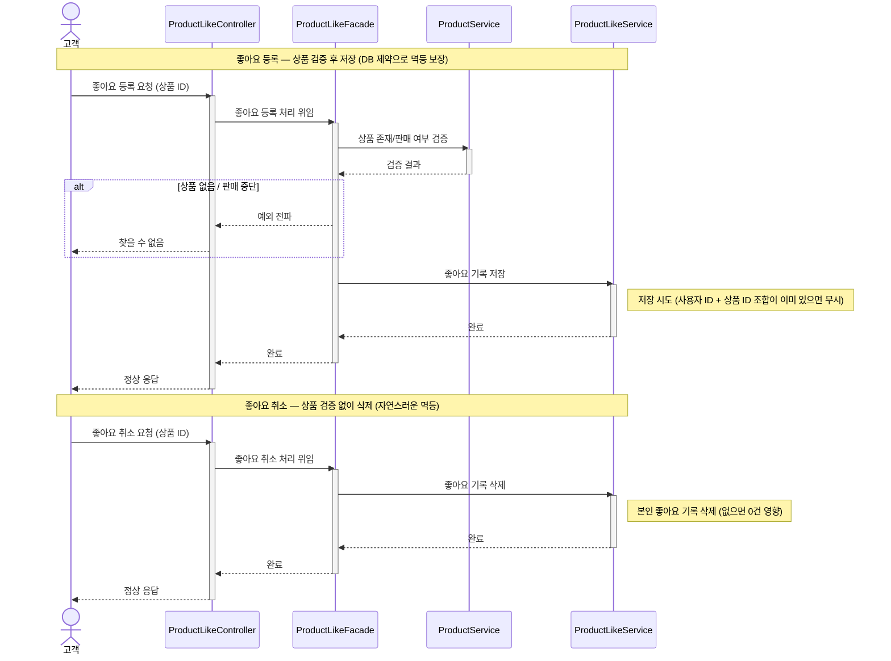

# 시퀀스 다이어그램

## 문서의 목적

이 문서는 커머스 핵심 흐름의 **호출 순서와 책임 경계**를 시퀀스 다이어그램으로 명세한다.
요구사항 명세서가 "무엇을 만들 것인가"를 다룬다면, 이 문서는 "각 도메인이 어떤 책임을 갖고, 어떤 순서로 협력하는가"를 다룬다.

다이어그램은 다음 세 가지를 검증하기 위해 그린다.

1. **책임 분리** — 어느 클래스가 어떤 결정을 내리는가
2. **호출 순서** — 검증과 부수 효과(side effect)의 순서가 비즈니스 규칙과 일치하는가
3. **트랜잭션 경계** — 일관성을 깨뜨릴 수 있는 지점이 어디인가

## 공통 컨벤션

- 참여자는 **레이어/클래스 기준**으로 표현한다. 도메인 객체나 추상 컴포넌트가 아닌 실제 클래스명을 사용한다.
- Repository는 시퀀스에서 생략한다. 영속화 디테일은 클래스 다이어그램에서 다룬다.
- 예외 흐름은 `alt` 블록으로 명시하고, 조건부 흐름은 `opt` 블록으로 표현한다.
- 모든 비즈니스 예외는 `CoreException`으로 통일하고, `ErrorType`에 따라 HTTP 응답으로 변환된다.

---

## 다이어그램 1. 주문 생성 → 결제 대기

### 배경

주문은 단순히 "어떤 상품을 몇 개 산다"의 기록이 아니라, **상품·재고·포인트라는 서로 다른 도메인의 상태가 동시에 유효함을 보장하는 약속**이다.
따라서 주문 생성은 단일 도메인 호출이 아니라 **여러 도메인 검증의 조합**이며, 어느 시점에 어느 검증을 실행하느냐가 사용자 경험과 시스템 성능 모두에 영향을 준다.

### 설계 의도

이 흐름은 다음 두 가지를 가시화한다.

- **검증 책임은 각 도메인 서비스가 갖는다.** `OrderService`가 상품·포인트 검증을 직접 수행하지 않는다. 도메인 간 결합을 줄이기 위함이다.
- **검증은 조기 종료(fail-fast) 구조다.** 없는 상품에 대해 재고와 포인트를 검증하는 낭비가 발생하지 않도록, 가장 근본적인 조건부터 순차적으로 확인한다.

검증 순서는 "**상품(재고) → 포인트**" 다. 상품이 유효하지 않으면 포인트는 의미가 없고, 재고가 있다는 것은 곧 상품이 유효하다는 의미이므로 두 검증을 별도로 분리하지 않는다.

### 시퀀스



### 핵심 설계 결정

| 결정 | 이유 |
|------|------|
| `OrderFacade`가 검증을 조합한다 | `OrderService`가 다른 도메인 서비스에 직접 의존하면 양방향 결합이 생긴다. 조합은 응용 계층(Facade)의 책임으로 둔다. |
| `validateStock` 하나로 상품 유효성과 재고를 함께 확인한다 | "재고가 있다 = 상품이 유효하다"가 성립한다. 분리하면 동일 상품을 두 번 조회하게 되어 비효율적이다. |
| 포인트 검증은 `opt` 블록 | 결제 수단이 포인트가 아닐 때 불필요한 도메인 호출을 막는다. |
| 주문은 `PENDING`으로만 생성한다 | 주문 생성과 결제는 별도 API다. 주문 접수와 결제 시도는 시간차가 있을 수 있다는 비즈니스 전제를 반영한다. |

### 알려진 한계

> **재고 동시성**
> 주문 생성 시점에는 재고를 **검증만** 하고 차감은 결제 시점(다이어그램 2)에 한다.
> 따라서 동시에 들어온 주문들이 모두 재고 검증을 통과하고, 결제 단계에서 실패하는 경우가 발생할 수 있다.
> 이 한계는 결제 단계의 락 전략(낙관적/비관적)으로 보완한다.

---

## 다이어그램 2-A. 결제 흐름 — 사전 검증

### 배경

결제 본 처리에 진입하기 전에 **두 가지 게이트**를 통과해야 한다.

1. **중복 요청 차단**: 동일한 결제 요청이 두 번 처리되지 않도록 멱등성 키로 차단
2. **무자격 주문 차단**: 다른 사용자의 주문, 이미 결제된 주문, 만료된 주문은 처리하지 않음

이 두 검증을 본 결제 로직과 분리해서 보여주는 이유는, **검증 실패 시 어떤 부수 효과도 일어나지 않아야** 하기 때문이다. 사전 검증 단계에서 차단된 요청은 포인트 차감, 재고 차감, 외부 결제 어느 것도 진행하지 않는다.

### 설계 의도

- **멱등성 키 검증이 가장 먼저다.** 동일 요청이 이미 처리됐다면 본 로직에 진입하지 않고 저장된 응답을 그대로 반환한다.
- **주문 검증은 본 처리 직전이다.** 멱등성 키가 신규로 확인된 뒤에야 주문의 상태·소유권·만료를 확인한다.
- **검증 실패는 멱등성 키에 즉시 반영된다.** 실패도 하나의 "결과"이므로 키 상태를 `FAILED`로 마감해서 동일 요청이 재시도되어도 같은 응답이 나가게 한다.

### 시퀀스



### 핵심 설계 결정

| 결정 | 이유 |
|------|------|
| 멱등성 키는 가장 먼저 검증한다 | 중복 요청이 본 로직에 진입하면 부수 효과가 두 번 발생할 수 있다. 키 검증을 가장 앞단에 둬서 차단한다. |
| 키 발급은 클라이언트가 담당한다 | UUID 충돌 확률은 사실상 0이고, 클라이언트가 재시도 시에도 같은 키를 재사용할 수 있어 안전하다. Stripe·토스·카카오페이 등 결제 업계 표준 방식이다. |
| 주문 검증 실패도 키에 기록한다 | 동일 요청이 재시도되어도 같은 응답(거부)을 반환해야 한다. 검증 실패 자체가 멱등하게 처리되어야 한다. |
| 검증 통과 시 부수 효과는 일어나지 않는다 | 본 처리에 진입하기 전까지는 포인트·재고·외부 결제 어느 것도 건드리지 않는다. 검증 실패 시 보상이 필요 없도록 게이트 구조로 분리한다. |

---

## 다이어그램 2-B. 결제 흐름 — 본 처리 및 보상

### 배경

사전 검증을 통과한 결제는 **세 단계**로 진행된다.

1. **재고 확인 (검증만, 차감 안 함)**
2. **외부 결제 승인 요청**
3. **재고 차감**

이 흐름의 가장 위험한 시나리오는 **"외부 결제는 성공했는데 재고를 차감할 수 없는 상황"** 이다. 돈은 빠져나갔는데 상품을 줄 수 없는 상황이며, 사용자 관점에서 가장 나쁜 사고다.

이를 막기 위해 **이중 안전망**을 둔다.

- **사전 확인**: 외부 결제 전에 재고를 한 번 검증한다. 동시성 충돌 윈도우를 짧게 줄인다.
- **사후 보상**: 그럼에도 결제 후 재고 차감이 실패하면 외부 결제 시스템에 **환불을 요청**한다.

### 설계 의도

- **외부 결제 호출 전에 발견 가능한 실패는 미리 발견한다.** 재고가 명확히 부족한 경우를 결제 전에 차단하면 PG 호출과 환불 부담이 줄어든다.
- **재고는 두 번 다룬다 (확인 → 차감).** 확인은 비싸지 않으므로 결제 직전에 한 번 더 한다. 차감은 결제 성공 이후에만 한다.
- **결제 후 재고 차감 실패는 PG 환불로 보상한다.** 가장 무거운 보상이지만, 재고가 동시성으로 사라진 경우에는 이 방법뿐이다.
- **모든 실패 분기는 멱등성 키를 실패로 마감한다.** 본 처리 중 어떤 단계에서 실패하든 키 상태가 명확히 정리되어 재시도에 안전하게 응답할 수 있다.

### 시퀀스



### 핵심 설계 결정

| 결정 | 이유 |
|------|------|
| 보상 처리는 `PaymentFacade`에 둔다 | 보상은 여러 도메인(재고·주문·외부 결제)을 가로지른다. 어느 한 도메인 서비스가 다른 도메인을 복구시키는 구조는 책임 경계를 깨뜨린다. |
| 단계 순서는 "재고 확인 → 외부결제 → 재고 차감" 이다 | 외부 결제 호출 전 재고를 검증해 충돌 윈도우를 줄이고, 결제 성공이 확정된 뒤에만 재고를 차감해 "돈만 받고 상품을 못 주는" 시나리오를 가능한 한 줄인다. |
| 재고는 확인과 차감을 분리한다 | 확인은 가볍고, 차감은 결제 성공의 결과로만 일어나야 한다. 결제 실패 시 재고를 복구할 필요가 없도록 흐름을 단순화한다. |
| 결제 후 재고 차감 실패는 PG 환불로 보상한다 | 가장 무거운 보상이지만, 재고가 동시성으로 사라진 경우 PG에 들어간 결제를 되돌려야 한다. 환불을 한 트랜잭션 단계로 명시한다. |
| 외부 결제는 트랜잭션 경계 밖이다 | PG 호출은 DB 트랜잭션에 묶을 수 없다. 따라서 결제 흐름 전체를 단일 트랜잭션으로 처리하지 않고, 단계별 보상 구조로 설계한다. |
| 모든 실패 분기에서 멱등성 키를 실패로 마감한다 | 본 처리 도중 어떤 단계에서 실패하든 키 상태가 명확히 정리되어, 재시도 시 같은 응답이 일관되게 반환된다. |

### 알려진 한계

> **재고 확인과 차감 사이의 동시성 윈도우**
> 옵션 C는 결제 직전에 재고를 확인하고, 결제 후에 차감한다.
> 이 사이 시간이 짧긴 하지만 0은 아니므로, 다른 사용자가 동일 상품을 사서 재고가 사라지는 경우가 여전히 가능하다.
> 이 경우 PG 환불로 보상하지만, 가장 무거운 보상이므로 운영 모니터링이 필요하다.
> 락 전략(낙관적/비관적)으로 윈도우를 더 줄일 수 있다.
> - **비관적 락 (`SELECT ... FOR UPDATE`)**: 재고 확인 시점에 잠금, 결제 후 차감 시점까지 유지. 락 점유 시간이 길어져 인기 상품에선 부담이 큼.
> - **낙관적 락 (`@Version`)**: 차감 시점에 충돌 감지. 충돌 시 환불 흐름으로 보상.
>
> 클래스 다이어그램 단계에서 락 전략을 명시한다.

> **PG 환불 자체의 실패**
> 재고 차감 실패 시 PG 환불 요청을 보내지만, 환불 API 호출 자체가 실패할 가능성이 있다 (네트워크, PG 장애 등).
> 이 경우 시스템은 "결제는 됐지만 상품도 못 주고 환불도 못 한 상태"가 된다.
> 운영 단계에서는 다음 보완이 필요하다.
> - 환불 실패 시 운영 알람 발생
> - 환불 재시도 큐 또는 배치
> - 운영자 수동 환불 처리 절차

> **PG 호출 성공 후 `markAsPaid` 실패**
> 외부 결제는 성공했는데 주문 상태 변경이 실패하는 시나리오는 다이어그램에 포함하지 않았다.
> 이 경우 PG와 DB 상태가 불일치하며, 운영 단계에서는 다음 중 하나로 보정한다.
> - 결제 완료 후 별도 정합성 보정 배치
> - 결제 상태를 PG에 재조회해서 동기화
> - 이벤트 기반 비동기 처리로 결제 완료 후 처리를 분리

> **보상 자체의 실패**
> `restoreStock` 또는 `restorePoint`가 실패하는 시나리오 역시 다루지 않았다.
> 운영 단계에서는 보상 실패에 대한 재시도 또는 운영 알람이 별도로 필요하다.

> **PENDING 주문의 만료 처리 (배치)**
> 본 다이어그램은 사용자 요청 흐름만 표현한다.
> 별도로 `commerce-batch` 모듈에서 다음 배치가 1분 주기로 실행된다.
> ```
> UPDATE orders
> SET status='CANCELLED', cancel_reason='EXPIRED', updated_at=NOW()
> WHERE status='PENDING' AND expires_at < NOW();
> ```
> 결제 단계에서도 만료 검증이 한 번 더 일어나므로(`ensureNotExpired`), 배치가 잠시 지연돼도 만료된 주문에 결제가 일어나지는 않는다.
> 배치와 결제 단계의 만료 검증은 **이중 안전망**으로 동작한다.

> **외부 결제 시스템의 비동기 응답 (중요)**
> 본 다이어그램은 외부 결제(PG) 호출을 **동기**로 가정하고 있다.
> 즉, `requestPayment()`를 호출하면 즉시 성공/실패 응답을 받는 구조다.
>
> 그러나 실제 PG(토스페이먼츠, KCP, 나이스페이 등) 연동은 통상 다음과 같이 비동기로 동작한다.
> 1. 결제창(PG가 호스팅) 띄움
> 2. 사용자가 카드 정보 입력
> 3. PG가 카드사와 통신 (수 초~수 분)
> 4. PG가 우리 서버의 콜백/Webhook 엔드포인트를 호출하여 결과 통보
> 5. 우리 서버가 콜백을 받아 주문 상태를 최종 확정
>
> 이번 설계는 **학습 단계의 단순화**로 동기 가정을 채택했으며, 실제 PG를 연동할 때는 다음 요소들을 추가로 설계해야 한다.
> - `Payment.status`에 `PENDING`(처리 중) 상태 추가
> - 별도 콜백 엔드포인트 (`POST /api/v1/payments/callback`)
> - 콜백 보안 (서명 검증, 멱등 처리)
> - 콜백 누락 대비 폴링/배치 또는 PG 거래 조회 API
>
> 이 단순화는 `PaymentGateway` 인터페이스를 통해 추상화한다.
> 학습/테스트 단계에서는 동기 stub 구현을, 실제 운영에서는 비동기 흐름을 감춘 구현을 끼우는 방식으로 확장한다.

---

## 다이어그램 3. 상품 좋아요 등록 / 취소

### 배경

좋아요는 본질적으로 **"한 사용자와 한 상품 사이의 1:1 관계"** 다.
같은 상품에 좋아요를 두 번 누르거나, 이미 취소한 좋아요를 다시 취소하는 시도는 시스템 입장에서 결과가 같아야 한다(멱등).

문제는 사용자의 실제 행동에서 이 시도가 흔하다는 점이다.

- 모바일 환경에서 따닥 클릭, 통신 지연으로 인한 재전송
- 동기화되지 않은 다중 디바이스에서의 동시 요청

따라서 좋아요는 **"중복 요청을 오류로 만들지 않으면서, 동시 요청에 대해서도 일관된 결과를 보장"** 해야 한다.

### 설계 의도

좋아요 흐름은 **등록과 취소가 대칭적**이지만, **검증 책임은 비대칭**이다.
이 다이어그램은 다음을 가시화한다.

- **등록은 상품 유효성을 검증한다.** 없는 상품에 좋아요를 누르는 것은 의미가 없다.
- **취소는 상품 유효성을 검증하지 않는다.** 좋아요를 누른 뒤 상품이 판매 중단된 경우에도, 사용자는 본인 좋아요 기록을 정리할 수 있어야 한다.
- **멱등 보장의 책임은 데이터베이스에 둔다.** Service 레이어에서 사전 조회로 분기하지 않는다. 동시 요청 시 race condition을 피하고, 비즈니스 로직을 단순하게 유지하기 위함이다.
  - **등록**: `(user_id, product_id)` UNIQUE 제약 위반 시 무시 (`INSERT IGNORE` 또는 충돌 예외 무시)
  - **취소**: `DELETE WHERE user_id=? AND product_id=?` — 매칭되는 행이 없어도 0행 영향, 본질적으로 멱등

### 시퀀스



### 핵심 설계 결정

| 결정 | 이유 |
|------|------|
| 멱등성을 Service가 아닌 DB에 위임한다 | Service에서 `findByUserIdAndProductId()` 후 분기하면 동시 요청 시 둘 다 "없음"으로 판단해 둘 다 INSERT를 시도하는 race condition이 발생한다. DB UNIQUE 제약은 이를 원천 차단한다. |
| 등록은 상품을 검증하고, 취소는 검증하지 않는다 | 등록은 "존재하는 상품에 대한 의사 표현"이지만, 취소는 "내 행위 기록의 정리"다. 책임의 성격이 다르므로 검증 범위도 다르다. |
| 다른 사용자의 좋아요는 자동으로 보호된다 | DELETE 쿼리의 `WHERE user_id=?` 조건이 본인 기록만 삭제되도록 보장한다. 별도 권한 체크 분기가 필요 없다. |
| 좋아요 취소는 물리 삭제다 | 이력 보존이 비즈니스 요구사항에 없다(F-05). soft delete를 사용하면 `(user_id, product_id, deleted_at)` 조합으로 UNIQUE 제약을 다시 설계해야 하므로 복잡도가 커진다. |

### 알려진 한계

> **좋아요 수 집계 (`like_count`) 갱신은 다루지 않았다.**
> 다이어그램에는 좋아요 수를 어떻게 보여줄지 표현하지 않았다.
> 옵션은 두 가지다.
> - **실시간 COUNT**: 정합성은 항상 보장되지만 인기 상품에서 비용이 큼
> - **상품 테이블에 캐싱 컬럼 유지**: 빠르지만 동시성·정합성 보장 로직이 필요함
>
> 이 선택은 ERD 단계에서 결정한다.

> **인증/인가 처리는 다이어그램에 명시하지 않았다.**
> 401 (비로그인) 응답은 Controller 진입 전 인증 필터에서 처리된다는 전제다.
> 본 다이어그램은 "인증을 통과한 사용자가 좋아요 흐름에 들어왔을 때"를 다룬다.
