# 02. 시퀀스 다이어그램

이 문서는 현재 모놀리식 구현에서 필요한 동적 흐름만 설명한다. 모든 다이어그램은 하나의 개념만 다루며, 참여자는 `Consumer`, `Seller`, `Commerce Server`, `Database`를 기본으로 한다. 캐시, 메시지 브로커, 검색 엔진, 별도 분석 시스템은 현재 범위에 포함하지 않는다.

## 1. 상품 조회 흐름

목적: 상품 조회가 별도 캐시 없이 서버와 DB만으로 처리된다는 점을 표현한다.

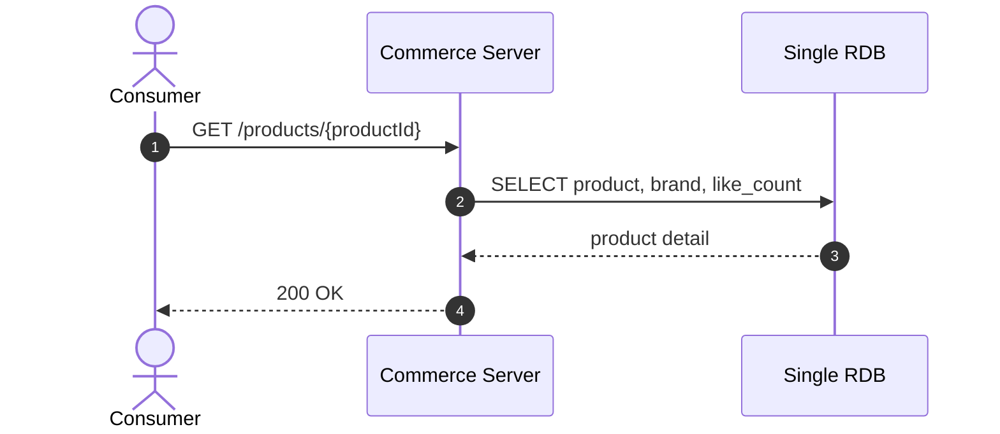

읽는 법:

1. 서버는 DB를 직접 조회한다.
2. `like_count`는 `products` 테이블의 현재 집계 값을 사용한다.
3. 캐시 미스, 캐시 무효화, 검색 인덱스 동기화 흐름은 현재 설계에 없다.

## 2. Seller 브랜드 추가 흐름

목적: Seller가 Brand를 추가할 때 권한 기준인 Seller와 Brand, Domain Event가 같은 트랜잭션에 저장된다는 점을 표현한다.

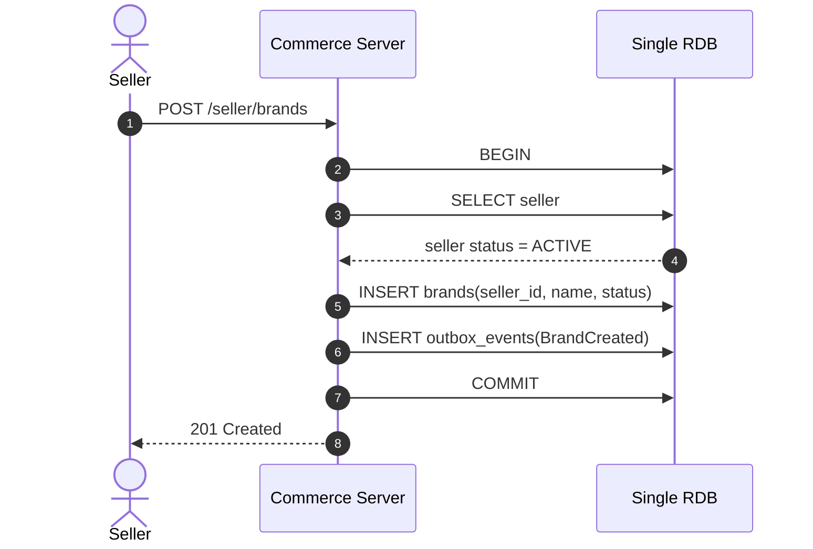

읽는 법:

1. Seller는 Brand 운영 권한의 시작점이다.
2. Brand 생성과 `BrandCreated` 이벤트 저장은 같은 DB 트랜잭션에서 처리한다.
3. 현재 범위에서는 Brand 생성 이벤트를 외부 시스템으로 발행하지 않는다.

## 3. Seller 상품 추가 흐름

목적: Seller가 자신이 관리하는 Brand에만 Product를 추가할 수 있고, Product 생성 이벤트가 같은 트랜잭션에 저장된다는 점을 표현한다.

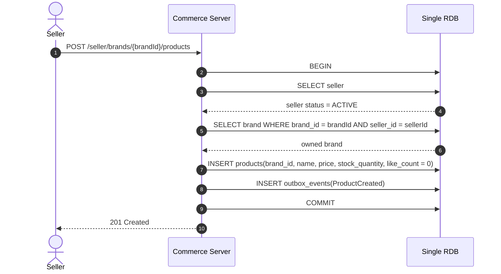

읽는 법:

1. Product 추가 전 Seller가 활성 상태인지 확인한다.
2. Product 추가 전 Seller의 Brand 관리 권한을 확인한다.
3. 새 Product의 `like_count` 기본값은 0이다.
4. Product 생성과 `ProductCreated` 이벤트 저장은 같은 DB 트랜잭션에서 처리한다.

## 4. Seller 재고 조정 흐름

목적: Seller의 수동 재고 변경이 Product의 재고 불변식을 거치고, 재고 변경 이벤트가 같은 트랜잭션에 저장된다는 점을 표현한다.

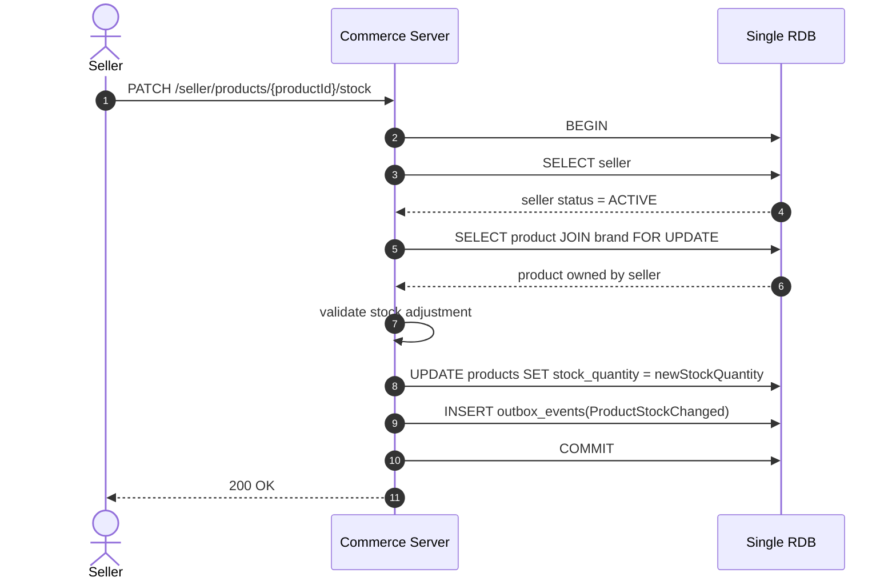

읽는 법:

1. 재고 조정 전 Seller가 활성 상태인지 확인한다.
2. 재고 조정은 Seller가 관리하는 Product에 대해서만 가능하다.
3. 재고 수량은 0 미만이 될 수 없다.
4. Seller의 수동 조정도 `ProductStockChanged` 이벤트를 만든다.

## 5. Seller 상품 반응 분석 조회 흐름

목적: Seller가 상품 반응을 볼 때 별도 분석 저장소 없이 단일 DB에서 현재 집계와 이력을 조회한다는 점을 표현한다.

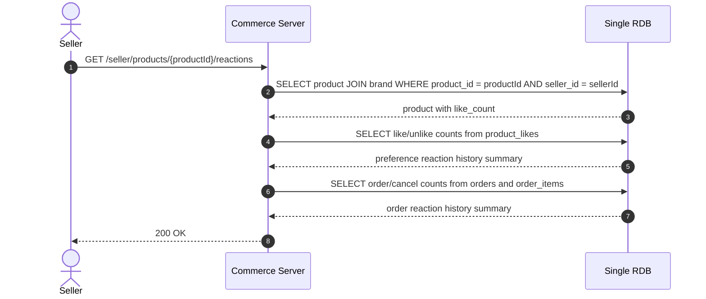

읽는 법:

1. 이 흐름은 Seller의 조회 유스케이스이며 별도 Statistics Context가 아니다.
2. 현재 좋아요 수는 `products.like_count`를 사용한다.
3. 상세 반응 요약은 `product_likes`, `orders`, `order_items`, `order_status_histories`를 조회해 만든다.

## 6. Like 상태 전환 흐름

목적: 고객의 `LIKE` 명령이 상태 전환일 때만 이력, 상품 집계, 도메인 이벤트를 같은 트랜잭션에 저장한다는 점을 표현한다.

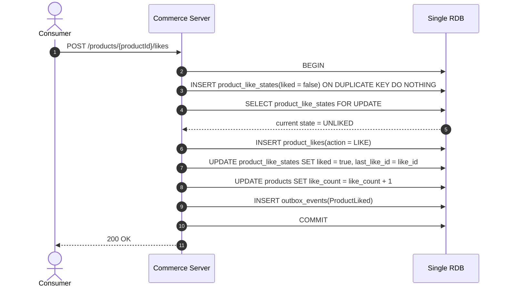

읽는 법:

1. `product_likes`는 Like/Unlike 이력 테이블이다.
2. `product_like_states`는 멱등성과 동시성 제어를 위한 현재 상태 테이블이다.
3. `products.like_count`는 같은 트랜잭션에서 증가한다.
4. `ProductLiked` 이벤트는 외부 브로커로 보내지지 않고 `outbox_events`에 저장된다.

## 7. Like 멱등 성공 흐름

목적: 이미 liked 상태인 고객의 중복 `LIKE` 요청이 이력과 집계를 변경하지 않는다는 점을 표현한다.

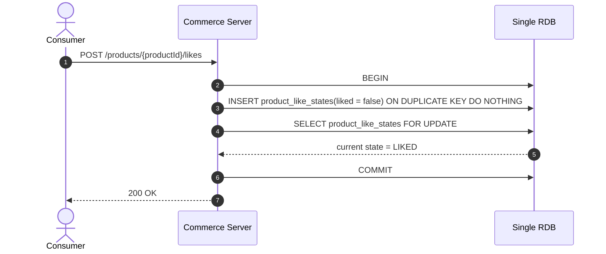

읽는 법:

1. 중복 요청은 성공으로 응답한다.
2. `product_likes`에 새 이력을 쓰지 않는다.
3. `products.like_count`를 변경하지 않는다.
4. `outbox_events`에 새 이벤트를 쓰지 않는다.

## 8. Unlike 상태 전환 흐름

목적: 고객의 `UNLIKE` 명령이 상태 전환일 때만 이력, 상품 집계, 도메인 이벤트를 같은 트랜잭션에 저장한다는 점을 표현한다.

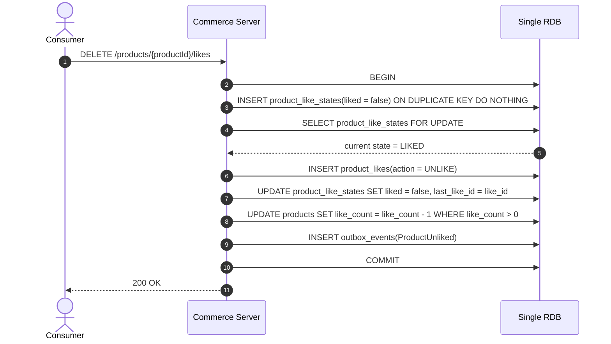

읽는 법:

1. `UNLIKE`도 이력으로 남긴다.
2. `products.like_count`는 0 미만이 되지 않도록 DB 조건과 도메인 검증을 함께 둔다.
3. 이미 unliked 상태인 요청은 멱등 성공으로 처리하며 새 이력과 이벤트를 만들지 않는다.

## 9. 주문 생성 흐름

목적: 주문 생성, 재고 차감, 주문 이력, 도메인 이벤트 저장이 하나의 DB 트랜잭션으로 처리된다는 점을 표현한다.

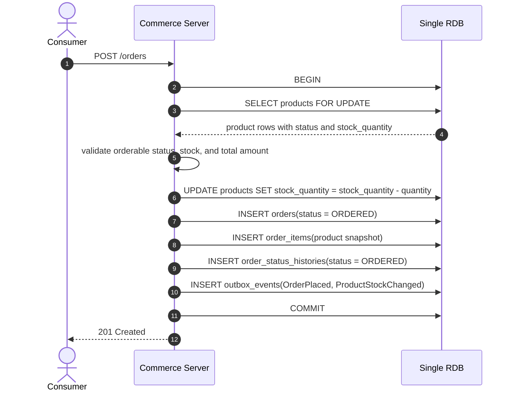

읽는 법:

1. 재고 차감과 주문 저장은 분리되지 않는다.
2. `order_items`는 주문 시점의 상품명과 가격을 스냅샷으로 저장한다.
3. 주문 가능한 판매 상태와 재고가 모두 유효해야 주문을 생성한다.
4. 주문 생성 실패 시 재고 차감도 커밋되지 않는다.
5. 이벤트는 같은 DB의 `outbox_events`에 저장된다.

## 10. 주문 취소 흐름

목적: 주문 취소가 주문 상태 변경과 재고 복구를 같은 트랜잭션으로 처리한다는 점을 표현한다.

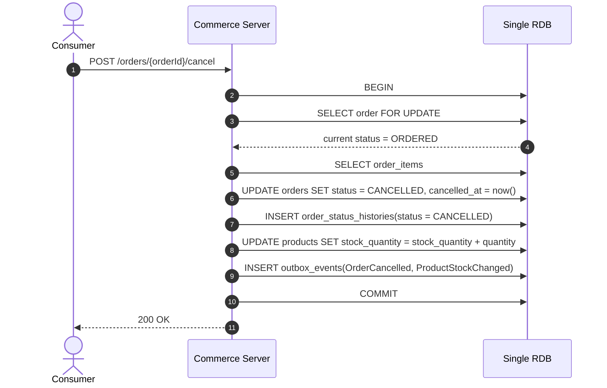

읽는 법:

1. 취소된 주문은 삭제하지 않는다.
2. 주문 취소 이력은 `orders`와 `order_status_histories`에 남는다.
3. 이미 취소된 주문에 대한 취소 요청은 멱등 성공으로 응답하고 재고를 다시 복구하지 않는다.

## 11. Outbox 재시도 흐름

목적: `outbox_events`가 외부 메시지 브로커가 아니라, 같은 서버 안의 로컬 이벤트 처리 실패를 복구하기 위한 영속 재시도 테이블임을 표현한다.

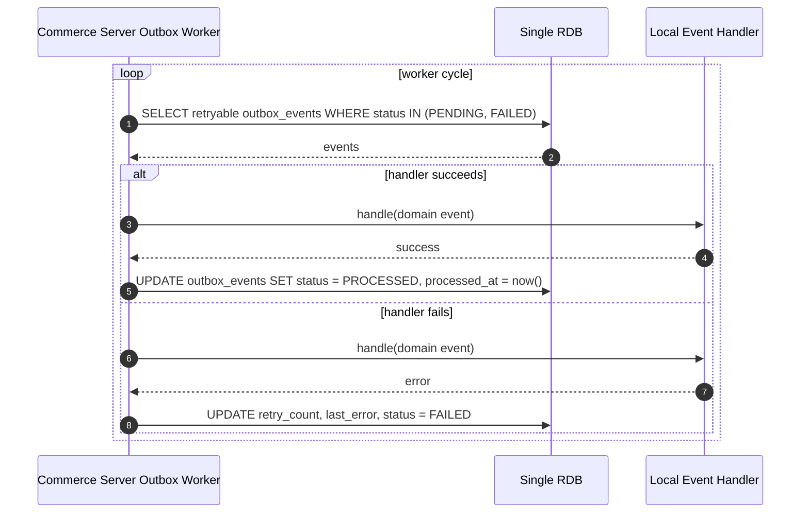

읽는 법:

1. 현재 범위에서 이벤트는 외부 브로커로 발행하지 않는다.
2. 로컬 핸들러가 실패하면 `outbox_events` 상태를 갱신하고 이후 재시도 대상으로 남긴다.
3. Recommendation/Statistics용 소비자는 현재 구현 대상이 아니다.
