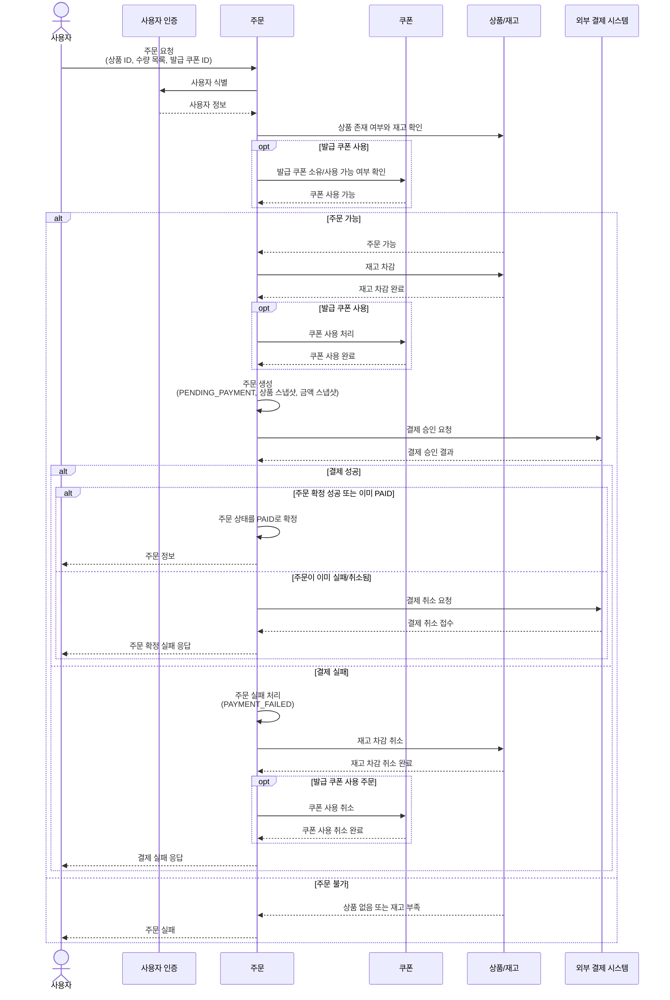
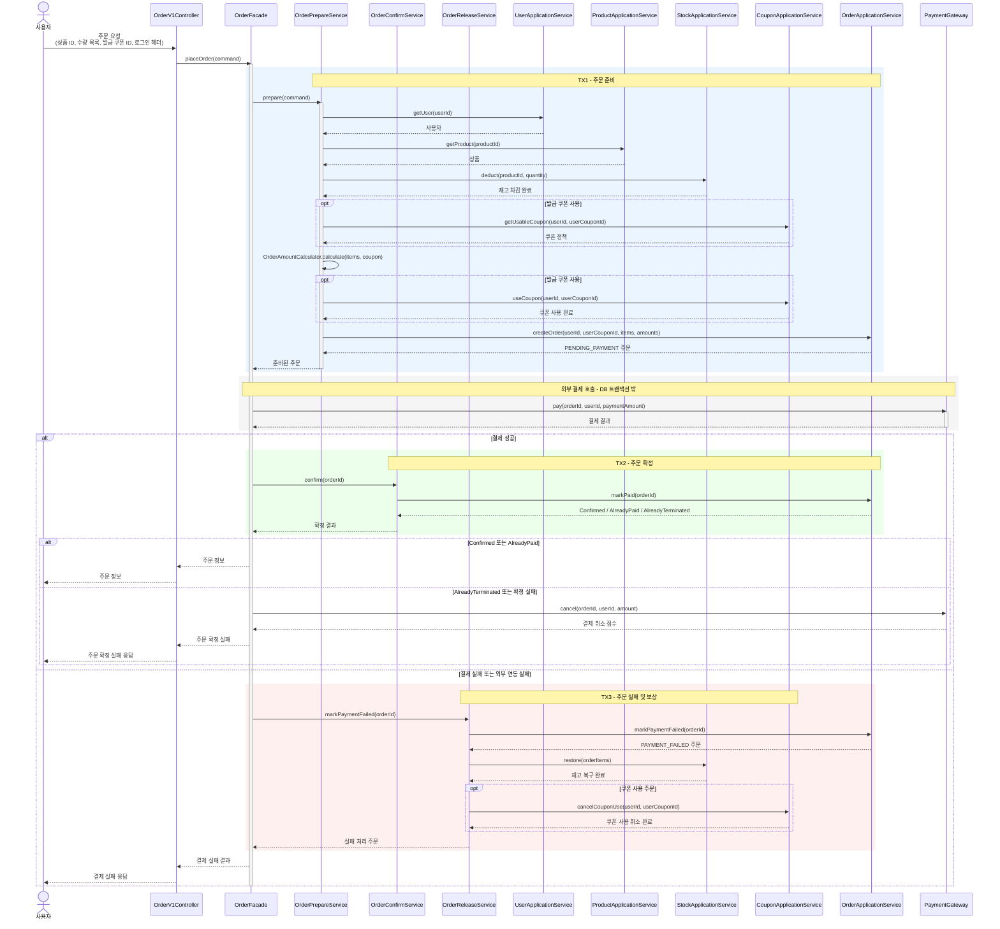
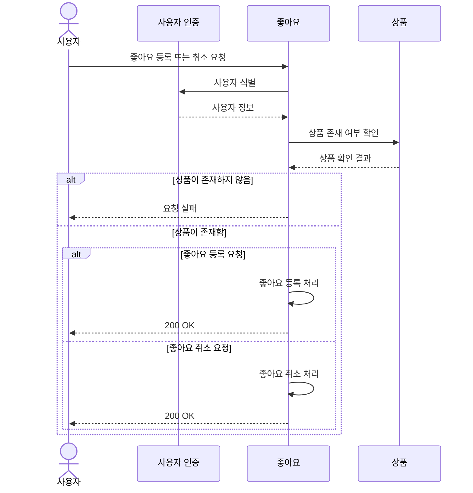
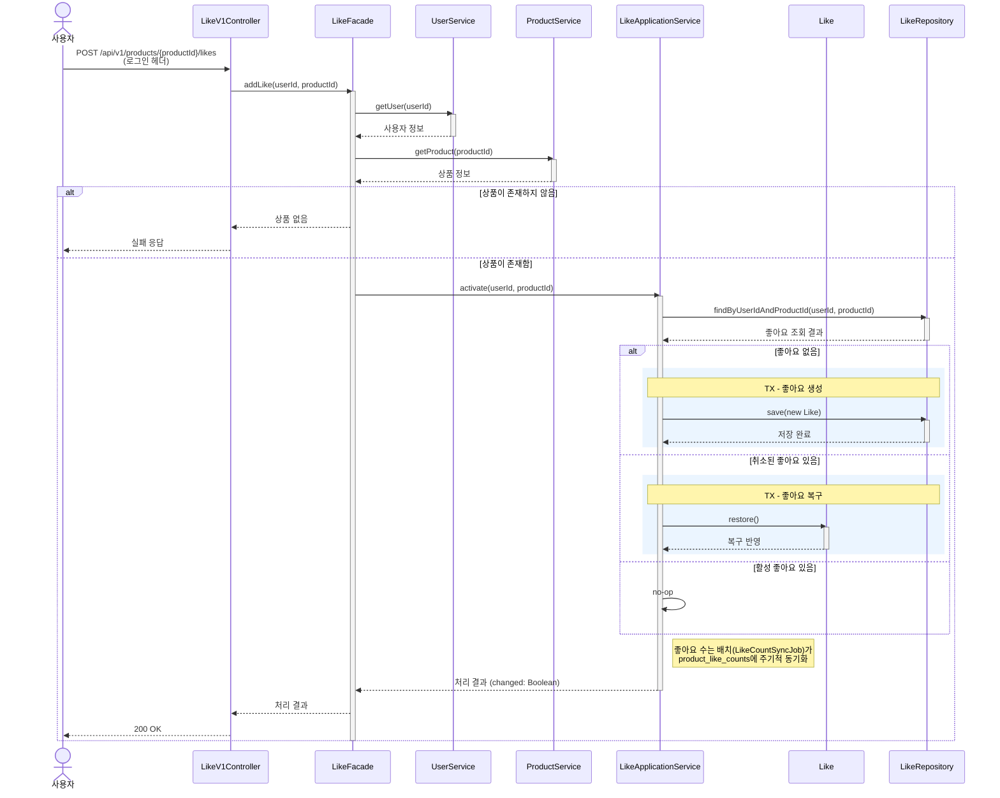
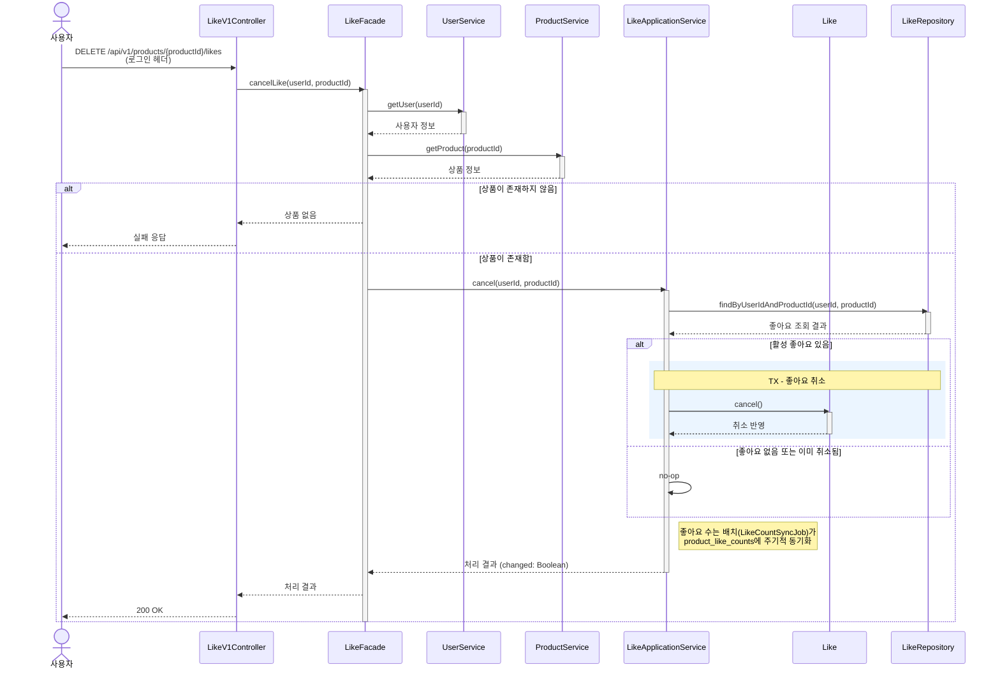
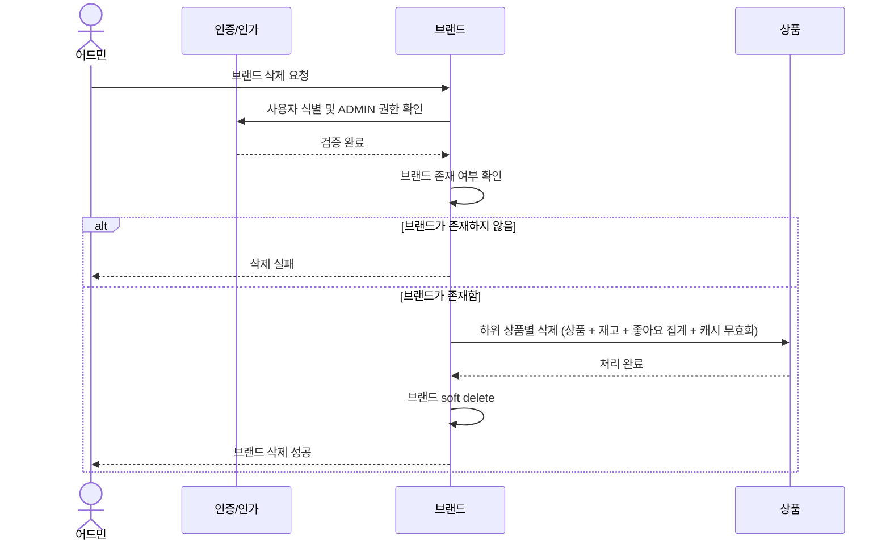
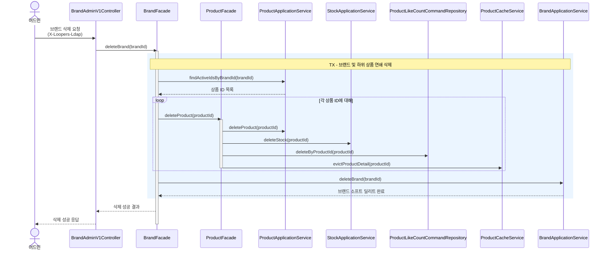

# 02. Sequence Diagrams

`01-requirements.md`의 기능 요구사항 중 상태 변경, 멱등성, 연쇄 처리, 외부 시스템 연동이 드러나는 핵심 유스케이스를 시퀀스 다이어그램으로 작성한다.

## 1. 작성 기준

- 각 유스케이스는 도메인 중심 흐름과 구현을 위한 내부 클래스 흐름 두 가지 관점으로 작성한다.
  - 도메인 중심 흐름은 비개발자도 이해할 수 있는 책임과 상태 변화를 중심으로 표현한다.
  - 내부 클래스 흐름은 개발자가 구현 책임과 호출 순서를 파악할 수 있도록 Controller, Facade, Service, Repository 단위로 표현한다.

## 2. 다이어그램 목록

| 흐름 | 핵심 관점 |
|---|---|
| 주문 생성 및 결제 | 재고 차감, 주문 스냅샷, 외부 결제, 실패 보상이 함께 발생하는 핵심 흐름 |
| 상품 좋아요 등록/취소 | 멱등성 정책이 중요하며, 기존 좋아요 존재 여부에 따라 분기가 발생하는 흐름 |
| 브랜드 삭제 및 상품 연쇄 삭제 | 브랜드 삭제 시 하위 상품도 함께 소프트 딜리트되는 연쇄 정책 흐름 |

## 3. 주문 생성 및 결제 흐름

### 3.1 개요

주문 생성 및 결제 흐름은 재고 확보, 주문 생성, 외부 결제 연동, 실패 보상이 한 유스케이스 안에서 이어지는 흐름이다.
이 다이어그램에서는 외부 결제를 DB 트랜잭션과 분리하고, 결제 결과에 따라 주문 상태와 재고를 후속 처리하는 구조를 중심으로 표현한다.

### 3.2 도메인 중심 흐름

### 3.3 내부 클래스 흐름

## 4. 상품 좋아요 등록/취소 흐름

### 4.1 개요

상품 좋아요 등록/취소 흐름은 같은 요청이 반복되어도 결과가 안정적으로 유지되는 멱등성 정책을 중심으로 작성했다. 도메인 중심 흐름은 등록/취소 요청의 큰 흐름만 표현하고, 기존 좋아요 상태에 따른 생성, 복구, 취소 처리, no-op 분기는 내부 클래스 흐름에서 표현한다.

> **변경 사항**: 좋아요 등록/취소 시 `Product.likeCount`를 즉시 변경하지 않는다. 좋아요 수는 `LikeCountSyncJob` 배치가 `product_like_counts` 프로젝션 테이블에 주기적으로 동기화한다.

### 4.2 도메인 중심 흐름

### 4.3 좋아요 등록 내부 클래스 흐름

### 4.4 좋아요 취소 내부 클래스 흐름

## 5. 브랜드 삭제 및 상품 연쇄 삭제 

### 5.1 개요

브랜드 삭제는 브랜드 자체 삭제뿐 아니라 하위 상품 전체를 함께 삭제하는 연쇄 정책을 포함한다.

도메인 중심 흐름은 사용자 식별과 어드민 권한 확인, 브랜드 존재 확인, 하위 상품 삭제, 브랜드 삭제의 큰 순서를 표현한다.
내부 클래스 흐름은 하위 상품별로 상품, 재고, 좋아요 수 집계를 개별 삭제하고 캐시를 무효화한 뒤, 브랜드를 소프트 딜리트하는 구조를 표현한다.

### 5.2 도메인 중심 흐름

### 5.3 내부 클래스 흐름

