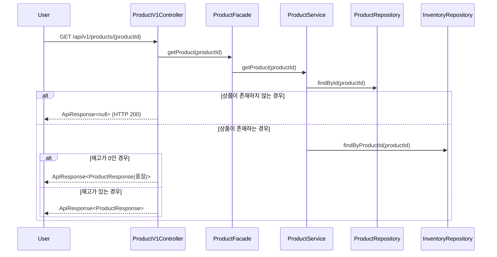
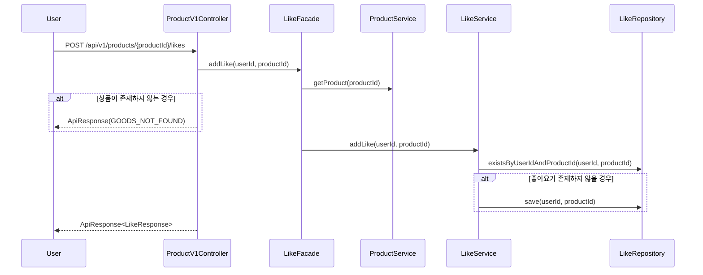
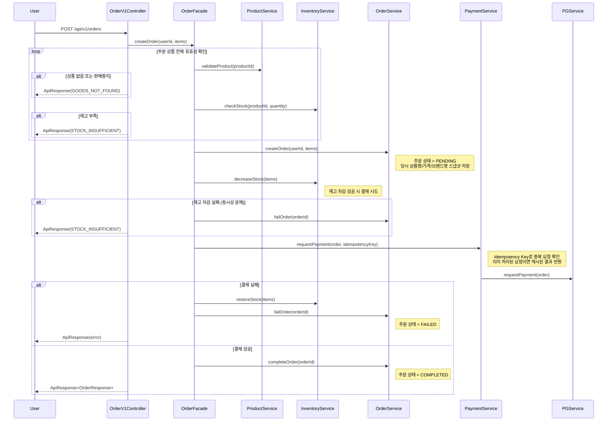
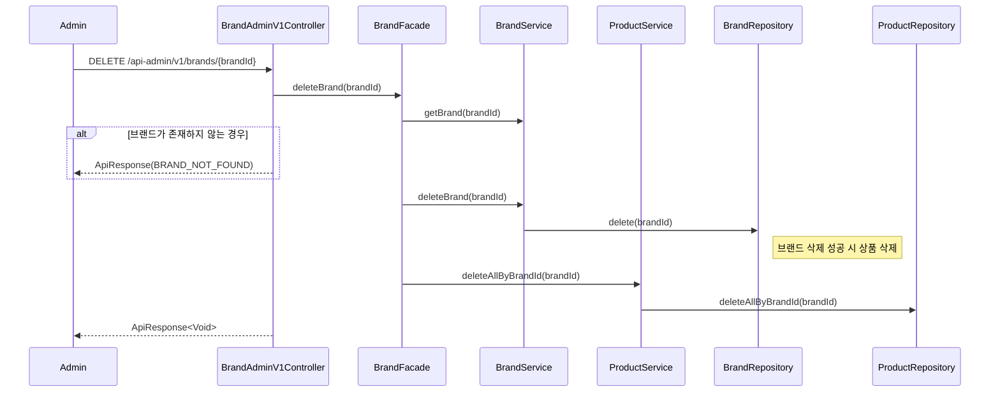
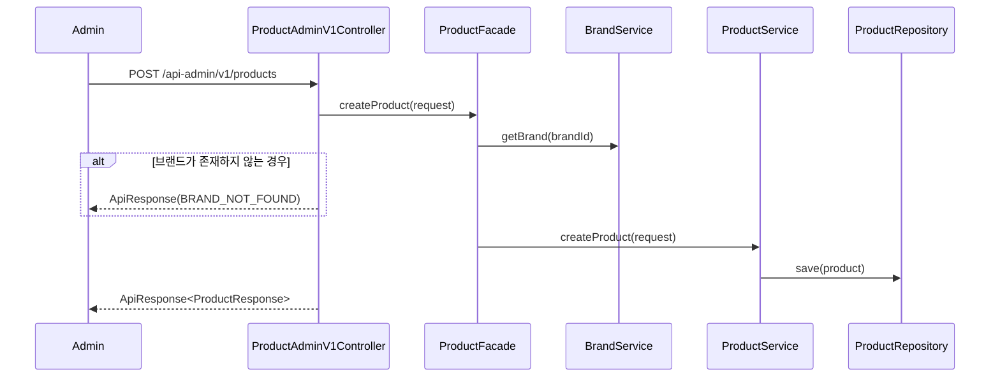

# 02. 시퀀스 다이어그램

## 유비쿼터스 언어

```
고객     -> User
상품     -> Product
브랜드   -> Brand
좋아요   -> Like
주문     -> Order
재고     -> Inventory
결제     -> Payment
```

---

## 고객 관점

### 1. 상품 상세 조회

> **한 줄 요약:** 상품 번호로 상세 정보를 조회하며, 재고가 0이면 품절 표시와 함께 반환한다. 존재하지 않는 상품이면 고객에게 에러코드 노출 없이 빈 응답을 반환한다.

> **설계 고민:**
> 단건 조회에서 상품이 없을 때 고객 API와 어드민 API의 응답 방식을 구분했다.
> 고객 API는 존재하지 않는 상품 페이지에 접근하는 것이므로 **404**가 HTTP 의미론적으로 정확하다.
> 어드민 API는 잘못된 ID 입력 여부를 프로그래밍적으로 확인해야 하므로 **HTTP 200 + 에러코드(GOODS_NOT_FOUND)**로 처리한다.



---

### 2. 상품 좋아요 등록

> **한 줄 요약:** 회원이 상품에 좋아요를 누르면 중복 여부를 확인해 처음이면 등록하고, 이미 등록된 경우에도 정상 응답을 반환한다. (멱등 동작)

> **설계 고민:**
> 좋아요 엔드포인트가 `/products/{productId}/likes`라 `ProductV1Controller` vs `LikeV1Controller` 고민했다.
> URL 구조상 `ProductV1Controller`에 두는 게 자연스럽다고 판단했다.
> 멱등성 처리는 요구사항에 명시했으므로 시퀀스에서 별도 분기 없이 존재하지 않을 경우만 save 처리한다.



---

### 3. 주문 생성

> **한 줄 요약:** 회원이 상품을 주문하면 상품 유효성·재고를 확인하고 재고를 차감한 뒤 결제를 진행한다. 결제 실패 시 재고를 자동 복구하며, 주문 시점의 상품 정보는 스냅샷으로 보존된다.

> **설계 고민:**
> PG사 연동을 `OrderFacade`에서 직접 호출할지, `PaymentService` 도메인으로 분리할지 고민했다.
> 이벤트 스토밍에서 Payment가 별도 Aggregate로 분리되어 있고, 결제 관련 기능 확장 시 Order 도메인 영향을 최소화하기 위해 `PaymentService`로 분리했다.
> `checkStock` 통과 후 `decreaseStock` 시점에 동시 요청으로 재고가 소진될 수 있어 차감 실패 케이스를 별도로 추가했다.



---

## 관리자(어드민) 관점

### 4. 브랜드 삭제 (상품 cascade 삭제)

> **한 줄 요약:** 관리자가 브랜드를 삭제하면 소속 상품도 함께 삭제된다. 존재하지 않거나 이미 삭제된 브랜드 요청도 오류 없이 정상 응답한다. (멱등 삭제)

> **설계 고민:**
> 상품 삭제 후 브랜드 삭제 vs 브랜드 삭제 후 상품 삭제 순서를 고민했다.
> DB FK 제약을 사용하지 않고 soft delete를 고민했으므로 순서 제약이 없어, 비즈니스 의미상 자연스러운 "브랜드 삭제 성공 시 상품 삭제" 순서로 결정했다.



---

### 5. 상품 등록 (어드민)

> **한 줄 요약:** 관리자가 상품을 등록할 때 선택한 브랜드가 실제로 존재하는지 먼저 확인한다. 존재하지 않는 브랜드이면 등록에 실패한다.

