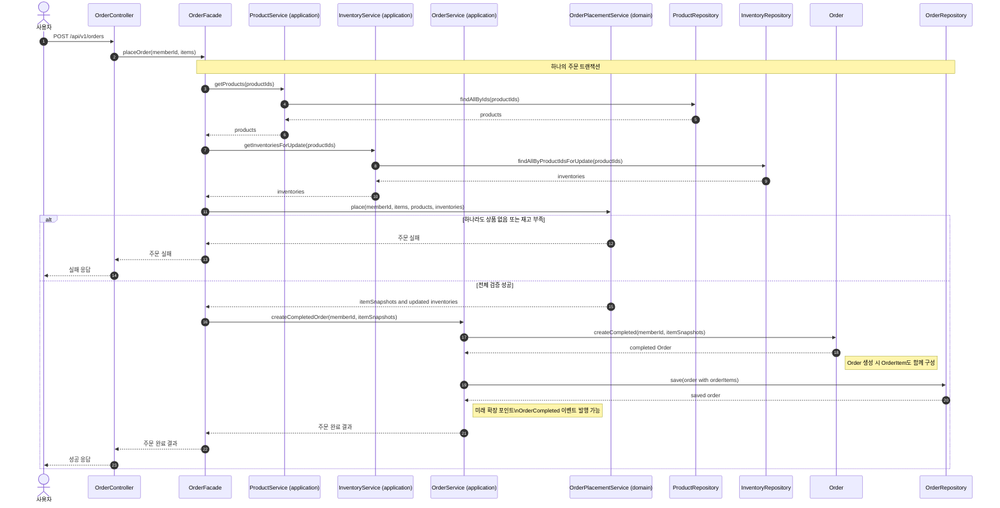

# Sequence 01 - 주문 생성

## 1. Why

주문 생성은 이번 범위에서 정합성 위험이 가장 큰 흐름이다.  
재고 확인, 재고 차감, 주문 스냅샷 저장이 하나의 책임 흐름으로 맞물려야 하므로, 트랜잭션 경계와 실패 지점을 먼저 드러내야 한다.

## 2. Diagram

## 3. Key Points

- 주문 생성의 성공 조건은 "모든 항목 재고 확인 성공"이다. 한 항목이라도 부족하면 전체 주문이 실패한다.
- `OrderFacade`가 상품 조회, 재고 잠금 조회, 주문 생성 저장 흐름을 하나의 유스케이스로 조정한다.
- `ProductService`, `InventoryService`, `OrderService`는 application layer 에 위치하며 각자 repository interface 를 통해 자기 도메인의 데이터를 조회하거나 저장한다.
- 상품 존재 여부 확인, 재고 검증, 재고 차감, 주문 스냅샷 생성 같은 도메인 협력은 의존성이 없는 `OrderPlacementService`(domain)가 담당한다.
- 재고 차감과 주문 저장은 같은 트랜잭션 경계 안에 있어야 한다. 그래야 주문 저장만 되고 재고 차감이 누락되는 상태를 막을 수 있다.
- `OrderItem`은 `Order` aggregate 내부 구성요소로 함께 생성되고 저장된다. JPA 설계에서는 보통 `Order` 저장 시 cascade 또는 aggregate 저장 규칙으로 같이 반영된다고 해석한다.
- 결제/외부 연동은 현재 흐름에 넣지 않되, 주문 완료 이후 이벤트나 포트로 확장할 수 있게 남겨둔다.
