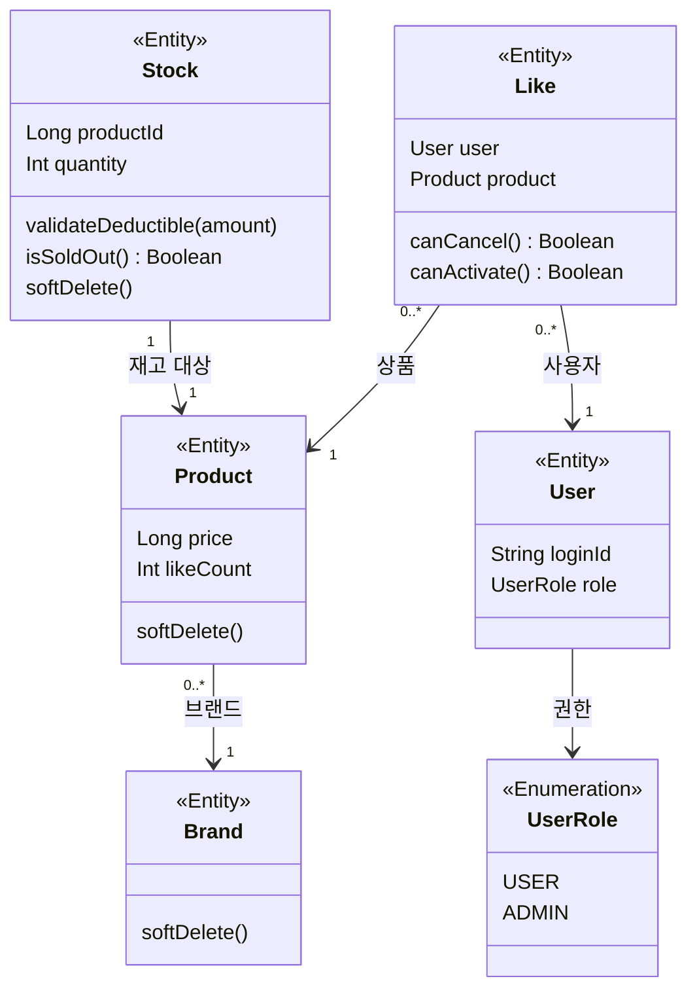
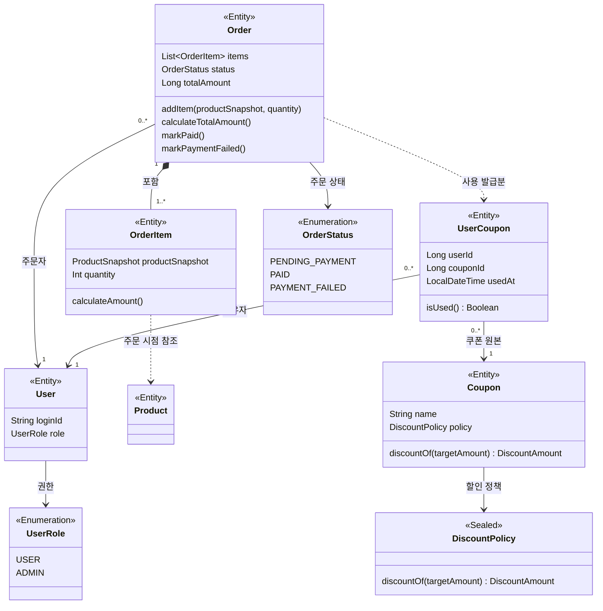

# 03. Class Diagram

`01-requirements.md`와 `02-sequence-diagrams.md`에서 정리한 요구사항과 핵심 흐름을 바탕으로, 주요 도메인 객체의 상태, 책임, 관계를 정리한다.

## 1. 작성 기준

- 클래스 내부에는 도메인 책임을 이해하는 데 필요한 핵심 상태만 포함한다.
- 객체 간 관계는 기본적으로 관계선으로 표현하고, 해당 객체의 핵심 책임을 설명하는 데 필요한 경우에만 연관 필드로 포함한다.
- 상속된 감사 필드는 ERD에서 다루고, 클래스 다이어그램에는 표기하지 않는다.
- 메서드는 도메인 규칙이나 상태 변화를 드러내는 행위만 포함한다.

## 2. 객체 구분

### 2.1 Entity

| 객체 | 역할 |
|---|---|
| `User` | 상품 좋아요와 주문을 수행하는 사용자 |
| `Brand` | 상품을 소유하거나 대표하는 브랜드 |
| `Product` | 사용자가 조회하고 주문할 수 있는 판매 상품 |
| `Stock` | 상품별 주문 가능 재고 수량 |
| `Like` | 사용자가 특정 상품에 표시한 관심 상태 |
| `Coupon` | 정액/정률 할인 정책을 가진 쿠폰 원본 |
| `UserCoupon` | 사용자가 보유한 발급 쿠폰 1장 |
| `Order` | 사용자의 주문 요청과 결제 이후 상태를 관리하는 주문 |
| `OrderItem` | 주문에 포함된 개별 상품 항목 |

### 2.2 Value Object

| 객체 | 역할 |
|---|---|
| `ProductSnapshot` | 주문 시점의 상품명과 가격을 보존한다. |
| `DiscountAmount` | 쿠폰 정책이 계산한 할인 금액을 표현한다. |

### 2.3 Enum

| 객체 | 역할 |
|---|---|
| `UserRole` | 사용자와 어드민 권한을 구분한다. |
| `OrderStatus` | 주문의 상태 전이를 표현한다. |
| `DiscountPolicy.Type` | 쿠폰 할인 정책의 정액/정률 종류를 구분한다. |

## 3. 클래스 다이어그램

### 3.1 상품/브랜드/좋아요 모델

상품은 브랜드에 속하고, 재고는 상품 ID를 기준으로 별도 애그리거트에서 관리한다.
좋아요는 사용자와 상품 사이의 관심 상태를 표현한다.
`Product.likeCount`는 `likes_desc` 정렬을 위한 집계 값으로, `Like` 등록/취소 결과에 따라 원자적으로 변경된다.
`Brand.softDelete()`는 하위 상품 연쇄 소프트 딜리트 정책의 출발점이다.

### 3.2 주문 모델

주문은 사용자, 주문 항목, 주문 상태를 중심으로 표현한다.
`OrderItem`은 주문 이후 상품 정보가 변경되더라도 주문 이력이 유지되도록 주문 시점의 상품 정보를 `ProductSnapshot`으로 보존한다.

쿠폰은 정책 원본인 `Coupon`과 발급 쿠폰 1장을 의미하는 `UserCoupon`으로 분리한다.
주문에서 쿠폰을 사용할 때는 `Coupon.id`가 아니라 `UserCoupon.id`로 특정 발급분을 식별한다.

