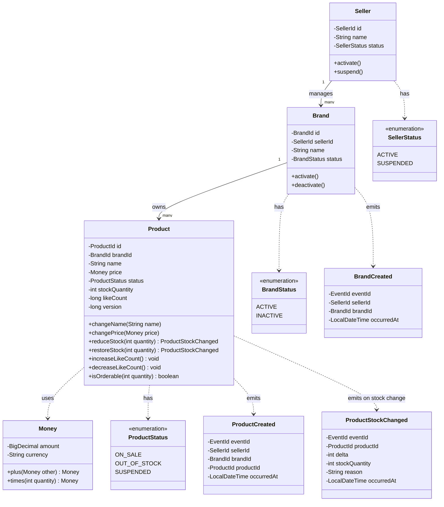
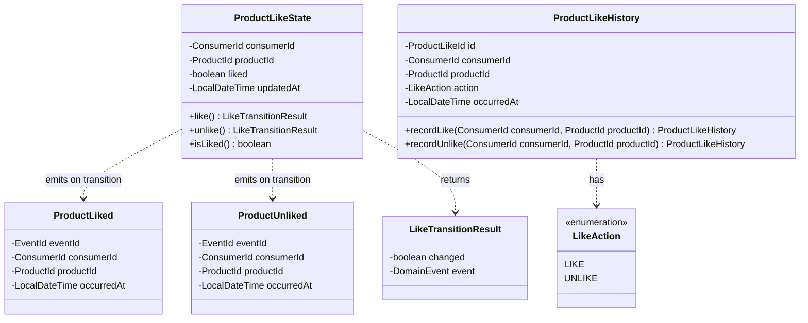
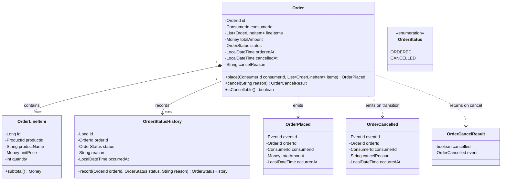
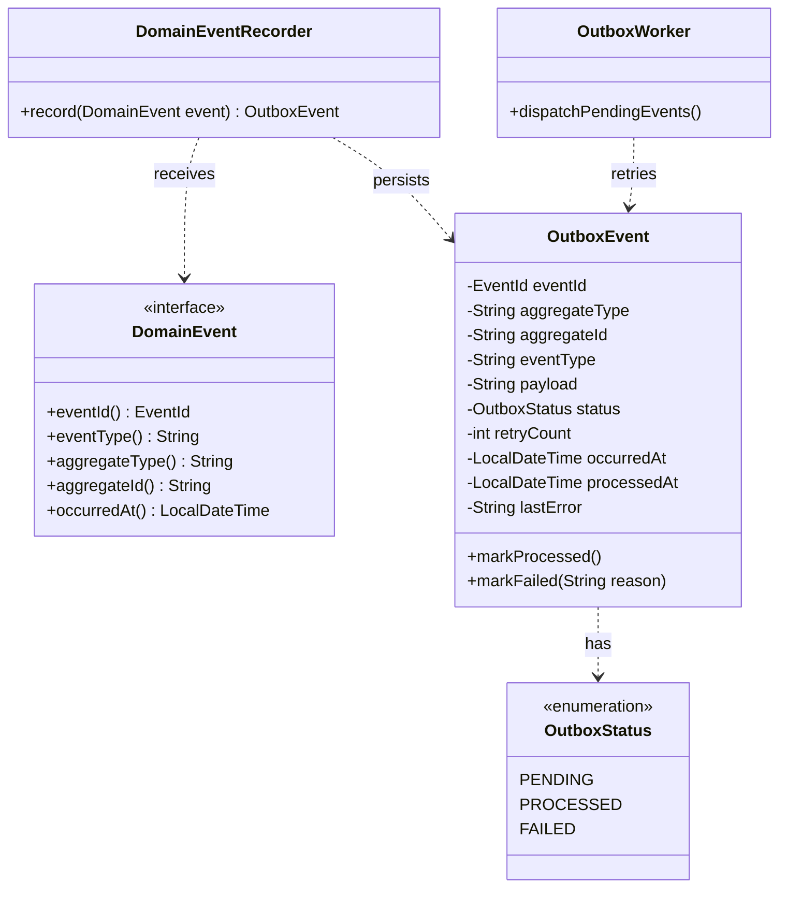

# 03. 클래스 다이어그램

이 문서는 현재 모놀리식 구현의 도메인 객체와 Aggregate 경계를 정의한다. Bounded Context는 물리 서비스가 아니라 같은 서버 안의 패키지/모듈 경계다.

## 1. Catalog Context

목적: 상품, 브랜드, 재고, 좋아요 집계 수가 Catalog Context의 책임임을 표현한다.

읽는 법:

1. `Seller`는 브랜드와 상품 운영 권한의 기준이다.
2. `Product`는 상품 재고와 좋아요 집계 수의 변경 규칙을 가진다.
3. `likeCount`는 단순 조회 최적화를 위한 현재 집계 값이며 `ProductLikeHistory`를 대체하지 않는다.
4. 재고 변경은 Seller의 수동 조정, 주문, 취소 유스케이스에서 호출되지만, 수량 불변식은 `Product`가 보호한다.

## 2. Preference Context

목적: Like/Unlike의 현재 상태와 이력이 분리되어야 멱등성과 고객 행동 이력을 동시에 만족한다는 점을 표현한다.

읽는 법:

1. `ProductLikeHistory`는 고객의 Like/Unlike 이력이다. 상태 전환이 발생할 때만 append한다.
2. `ProductLikeState`는 `(consumerId, productId)`의 현재 상태다. 중복 요청은 이벤트를 반환하지 않는다.
3. Application Service는 상태 전환 이벤트가 존재할 때만 `Product.likeCount`를 갱신하고 `outbox_events`에 저장한다.

## 3. Ordering Context

목적: 주문은 삭제되지 않는 고객 주문 이력이며, 취소는 상태 전이와 이력으로 남는다는 점을 표현한다.

읽는 법:

1. `Order`는 Aggregate Root다.
2. `OrderLineItem`은 주문 시점의 상품 스냅샷을 가진다.
3. 이미 취소된 주문의 `cancel()`은 새 이벤트를 만들지 않아야 한다.
4. 주문 취소는 주문 삭제가 아니라 `CANCELLED` 상태 전이다.

## 4. Domain Event와 Outbox

목적: Domain Event가 현재 모놀리식 내부의 핵심 통합 방식이며, `OutboxEvent`는 재시도를 위한 영속 레코드임을 표현한다.

읽는 법:

1. Aggregate는 Domain Event를 생성한다.
2. Application Service는 Aggregate 변경과 `OutboxEvent` 저장을 같은 DB 트랜잭션에 포함한다.
3. `OutboxWorker`는 같은 서버 프로세스 안에서 실패한 로컬 이벤트 처리를 재시도한다.
4. 현재 설계에는 외부 브로커 생산자, 외부 소비자, 미래 분석 Context 핸들러가 없다.
