# 03. 클래스 다이어그램 (Volume 2)

## 도메인 객체 설계 원칙

| 원칙 | 설명 |
|------|------|
| Entity vs VO | ID를 가지고 생명 주기가 있으면 Entity, 값 자체가 식별자면 VO |
| 연관 관계 | 단방향 기본, 양방향 최소화 |
| 비즈니스 책임 | 도메인 객체 내부에 비즈니스 로직 포함 |
| Soft Delete | `deletedAt` 필드로 논리 삭제 (Like 제외) |
| Audit | 어드민이 관리하는 엔티티는 `insertId`, `modifyId` 포함 |

---

## 전체 도메인 관계도

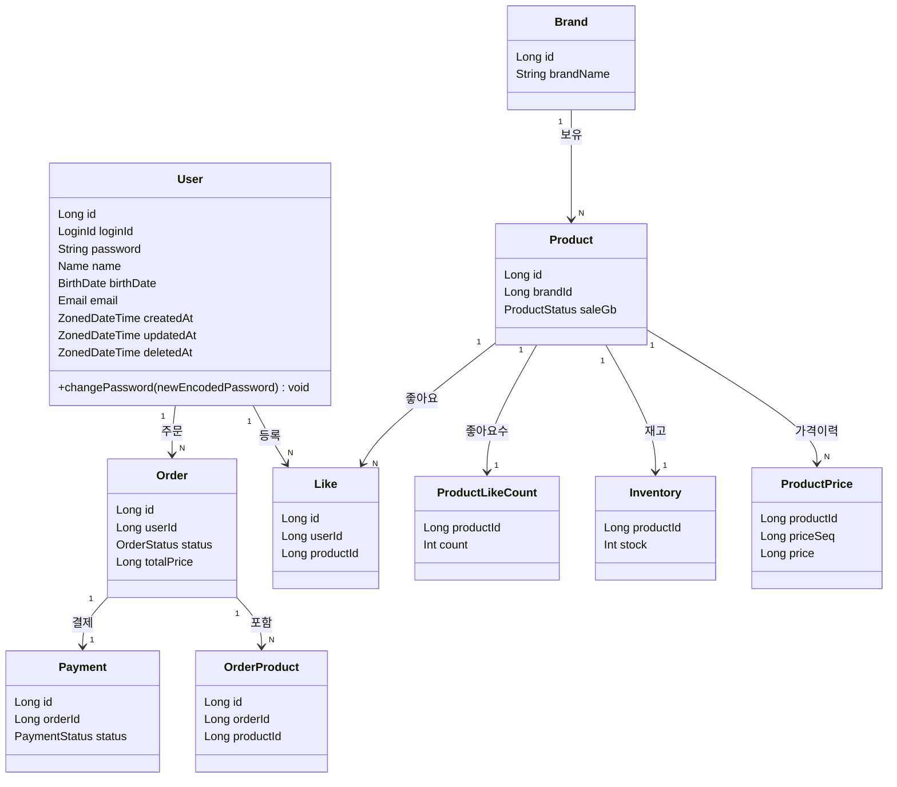

---

## 도메인별 설계 상세

### User

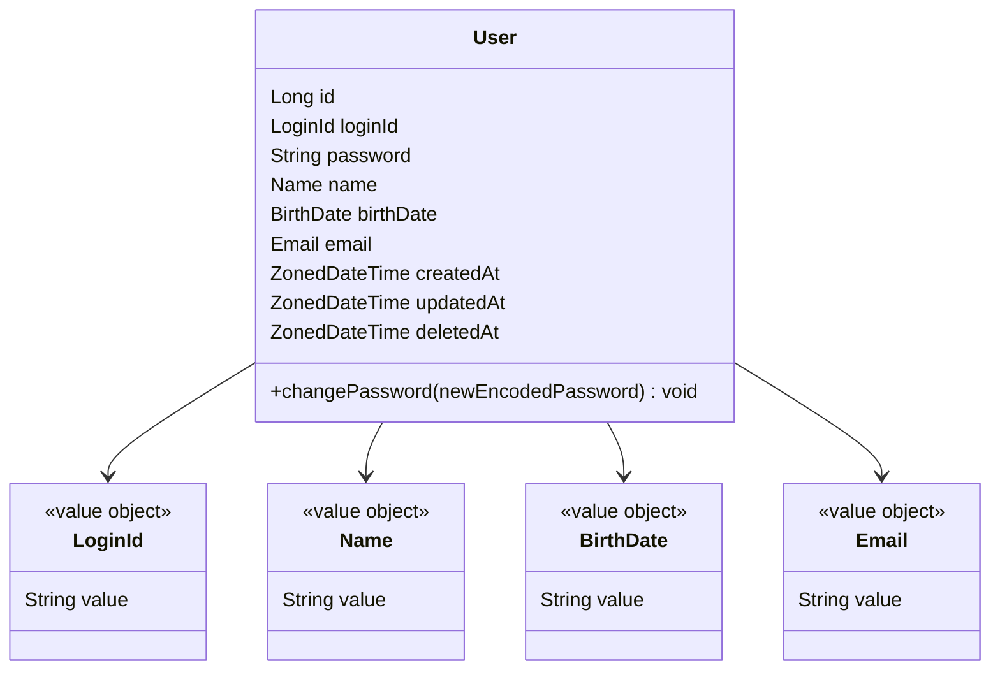

| 필드 | 타입 | 설명 |
|------|------|------|
| id | Long | PK (auto-increment) |
| loginId | LoginId | 로그인 ID VO (영문 대소문자/숫자, 4~20자) |
| password | String | BCrypt 암호화 비밀번호 |
| name | Name | 회원 이름 VO (한글, 2~20자) |
| birthDate | BirthDate | 생년월일 VO |
| email | Email | 이메일 주소 VO |
| createdAt | ZonedDateTime | 생성 일시 (UTC) |
| updatedAt | ZonedDateTime | 수정 일시 (UTC) |
| deletedAt | ZonedDateTime? | 삭제 일시 (UTC, nullable) |

| 메서드 | 설명 |
|--------|------|
| `changePassword(newEncodedPassword)` | BCrypt 해시 비밀번호로 교체 |

| 규칙 | 설명 |
|------|------|
| 삭제 정책 | soft delete (`deletedAt != null` 이면 삭제된 회원) |
| Volume 1 | 회원 가입 / 로그인은 Volume 1에서 설계 완료. Volume 2는 주문·좋아요에서 참조만 함 |

---

### Brand

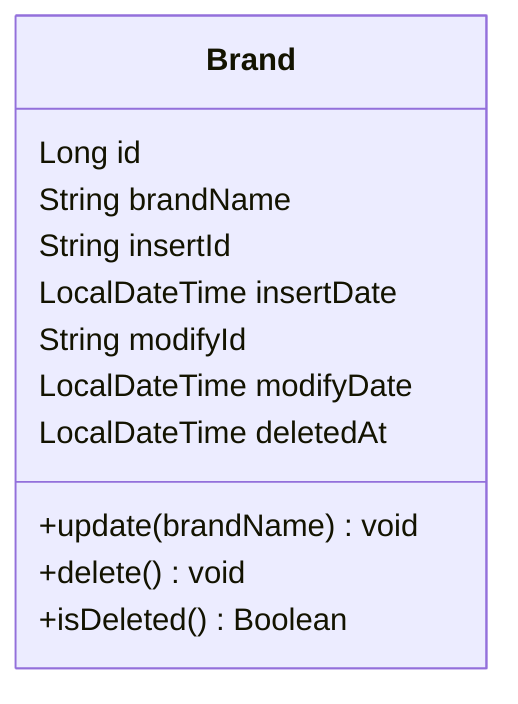

| 필드 | 타입 | 설명 |
|------|------|------|
| id | Long | PK (auto-increment) |
| brandName | String | 브랜드명 |
| insertId | String | 등록한 어드민 Ldap ID |
| insertDate | LocalDateTime | 등록일시 |
| modifyId | String | 수정한 어드민 Ldap ID |
| modifyDate | LocalDateTime | 수정일시 |
| deletedAt | LocalDateTime | soft delete |

| 규칙 | 설명 |
|------|------|
| 삭제 정책 | soft delete |
| Cascade 삭제 | 브랜드 삭제 시 소속 상품 전체 삭제 |

---

### Product

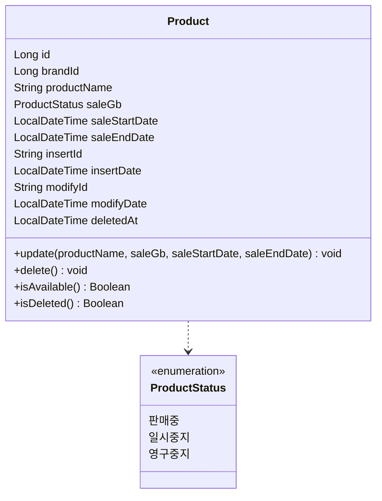

| 필드 | 타입 | 설명 |
|------|------|------|
| id | Long | PK (auto-increment) |
| brandId | Long | Brand FK (DB 제약 없음) |
| productName | String | 상품명 |
| saleGb | ProductStatus | 판매중 / 일시중지 / 영구중지 |
| saleStartDate | LocalDateTime | 판매 시작일 |
| saleEndDate | LocalDateTime | 판매 종료일 |
| insertId | String | 등록한 어드민 Ldap ID |
| insertDate | LocalDateTime | 등록일시 |
| modifyId | String | 수정한 어드민 Ldap ID |
| modifyDate | LocalDateTime | 수정일시 |
| deletedAt | LocalDateTime | soft delete |

| 규칙 | 설명 |
|------|------|
| 삭제 정책 | soft delete |
| 브랜드 변경 | 등록 후 변경 불가 |
| `isAvailable()` | `saleGb == 판매중` AND 현재 시각이 `saleStartDate ~ saleEndDate` 범위 안 |
| 품절 여부 | `Inventory.stock == 0`에서 파생 (ProductStatus에 포함하지 않음) |

---

### ProductPrice

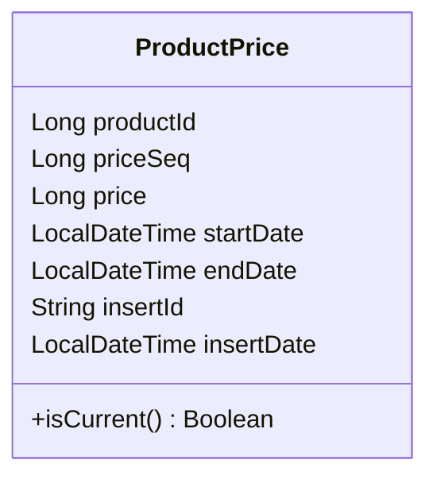

| 필드 | 타입 | 설명 |
|------|------|------|
| productId | Long | PK + FK (composite) |
| priceSeq | Long | PK (가격 이력 순번) |
| price | Long | 가격 |
| startDate | LocalDateTime | 가격 유효 시작일 |
| endDate | LocalDateTime | 가격 유효 종료일 (null이면 현재 유효) |
| insertId | String | 등록한 어드민 Ldap ID |
| insertDate | LocalDateTime | 등록일시 |

| 규칙 | 설명 |
|------|------|
| 운영 방식 | insert-only (수정 없음) |
| 현재 유효 가격 | `startDate <= NOW() AND (endDate IS NULL OR endDate >= NOW())` |
| 설계 이유 | 가격 변경 시 Product 테이블 UPDATE 없이 이력 보존 |

> **설계 고민:**
> 가격을 Product에 직접 저장할지 고민했지만, 가격 이력 관리와 Product 테이블 락 경합 최소화를 위해 `ProductPrice`로 분리하고 insert-only로 운영한다.
> 데이터 누적 성능 우려가 있지만, `productId + startDate` 복합 인덱스로 최적화하고 필요 시 아카이빙 정책으로 해결한다.

---

### Inventory

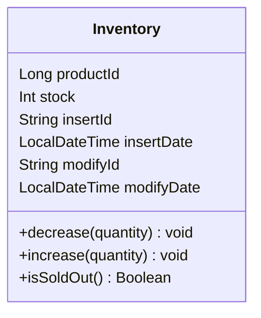

| 필드 | 타입 | 설명 |
|------|------|------|
| productId | Long | PK + FK (Product 1:1) |
| stock | Int | 재고 수량 (0 이상) |
| insertId | String | 등록한 어드민 Ldap ID |
| insertDate | LocalDateTime | 등록일시 |
| modifyId | String | 수정한 어드민 Ldap ID |
| modifyDate | LocalDateTime | 수정일시 |

| 규칙 | 설명 |
|------|------|
| `decrease()` | 재고가 요청 수량보다 적으면 실패 |
| `increase()` | 주문 실패 / 결제 실패 시 재고 복구 |
| `isSoldOut()` | stock == 0이면 품절 |
| 설계 이유 | 주문마다 재고 변경 → Product 테이블 락 경합 최소화를 위해 분리 |

---

### Like

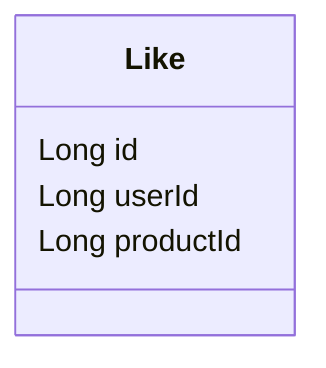

| 필드 | 타입 | 설명 |
|------|------|------|
| id | Long | PK |
| userId | Long | 회원 FK |
| productId | Long | 상품 FK |

| 규칙 | 설명 |
|------|------|
| 삭제 정책 | hard delete (이력 보존 불필요) |
| 유니크 제약 | userId + productId 조합 중복 불가 (애플리케이션 레벨 관리) |
| 멱등성 | 중복 등록 / 중복 취소 모두 정상 응답 |

---

### ProductLikeCount

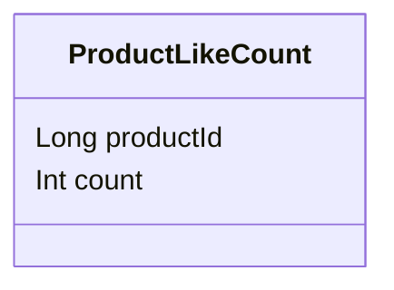

| 필드 | 타입 | 설명 |
|------|------|------|
| productId | Long | PK + FK (Product 1:1) |
| count | Int | 좋아요 수 (0 이상) |

| 규칙 | 설명 |
|------|------|
| 갱신 방식 | `commerce-batch`에서 3~4시간 주기로 Like 테이블 COUNT 집계 |
| 설계 이유 | 상품 목록 `likes_desc` 정렬 시 매번 COUNT 쿼리 방지 |

> **설계 고민:**
> 좋아요 수를 실시간 갱신(등록/취소마다 UPDATE)할지, 배치 집계로 관리할지 고민했다.
> 실시간 갱신은 항상 정확하지만 쓰기 부하가 증가한다.
> 좋아요 수는 정확한 실시간성보다 정렬 기능에 활용되는 참고값이므로,
> 3~4시간 주기 배치 집계로 결정했다. 정합성과 성능의 균형점.

---

### Order

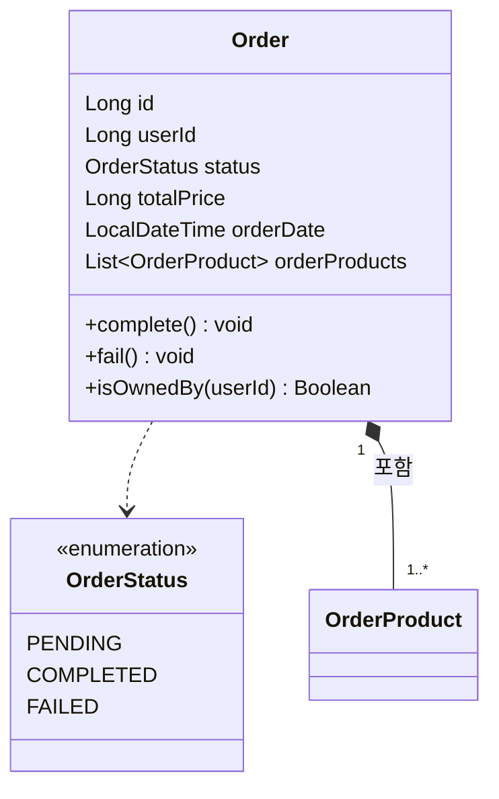

| 필드 | 타입 | 설명 |
|------|------|------|
| id | Long | PK |
| userId | Long | 회원 FK |
| status | OrderStatus | PENDING / COMPLETED / FAILED |
| totalPrice | Long | 총 주문 금액 |
| orderDate | LocalDateTime | 주문 생성 시각 |
| orderProducts | List\<OrderProduct\> | 주문 상품 목록 |

| 메서드 | 설명 |
|--------|------|
| `complete()` | 주문 상태를 COMPLETED로 변경 |
| `fail()` | 주문 상태를 FAILED로 변경 |
| `isOwnedBy(userId)` | 본인 주문 여부 확인 |

| 규칙 | 설명 |
|------|------|
| 삭제 정책 | soft delete |
| 부분 주문 | 불가 (하나라도 실패 시 전체 실패) |

---

### OrderProduct

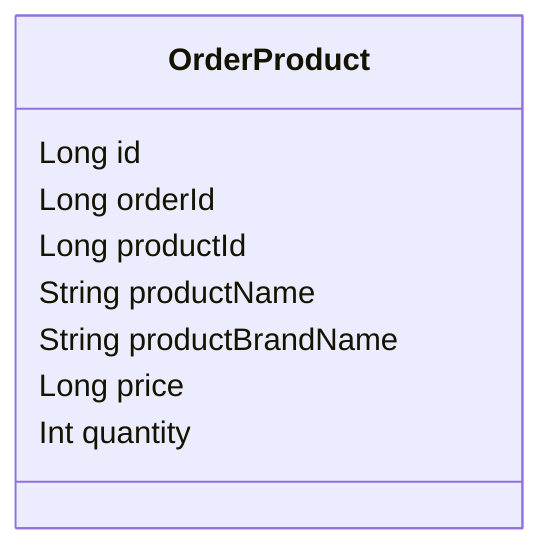

| 필드 | 타입 | 설명 |
|------|------|------|
| id | Long | PK (auto-increment) |
| orderId | Long | Order FK |
| productId | Long | Product FK (참조용) |
| productName | String | 주문 당시 상품명 스냅샷 |
| productBrandName | String | 주문 당시 브랜드명 스냅샷 |
| price | Long | 주문 당시 가격 스냅샷 |
| quantity | Int | 주문 수량 |

| 규칙 | 설명 |
|------|------|
| 스냅샷 | 주문 시점 정보 보존 → 이후 상품 정보 변경과 무관 |
| 유니크 | orderId + productId 조합 중복 불가 (애플리케이션 레벨 관리) |

> **설계 고민:**
> `orderId + productId` 복합 PK vs 별도 `id` 중 고민했다.
> 복합 PK는 비즈니스 의미가 명확하지만 JPA에서 `@EmbeddedId` / `@IdClass`가 필요해 코드 복잡도가 올라간다.
> 별도 auto-increment `id`를 두고 `orderId + productId` 유니크 제약은 애플리케이션 레벨에서 관리하기로 결정했다.

---

### Payment

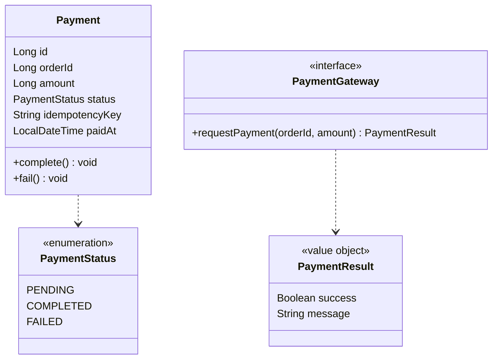

| 필드 | 타입 | 설명 |
|------|------|------|
| id | Long | PK |
| orderId | Long | Order FK (1:1) |
| amount | Long | 결제 금액 |
| status | PaymentStatus | PENDING / COMPLETED / FAILED |
| idempotencyKey | String | 중복 결제 방지 키 |
| paidAt | LocalDateTime | 결제 완료 시각 |

| 메서드 | 설명 |
|--------|------|
| `complete()` | 결제 상태를 COMPLETED로 변경 |
| `fail()` | 결제 상태를 FAILED로 변경 |

| 규칙 | 설명 |
|------|------|
| `PaymentGateway` | 외부 PG사 연동 인터페이스 — DIP 원칙 적용으로 PG사 교체 용이 |
| `PaymentResult` | 결제 결과를 담는 값 객체 (성공 여부, 메시지) |
| `idempotencyKey` | 동일 키로 재요청 시 PG사 재호출 없이 캐시된 결과 반환 |

---

## 레이어 구조

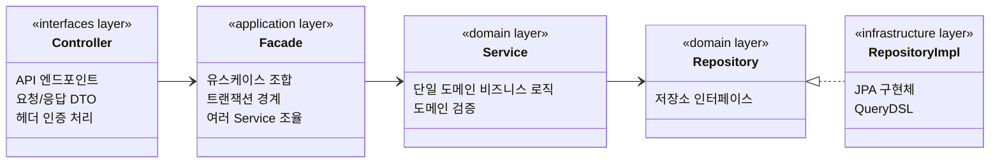

| 레이어 | 패키지 | 역할 |
|--------|--------|------|
| interfaces | `com.loopers.interfaces.api` | Controller, ApiSpec, Dto |
| application | `com.loopers.application` | Facade (유스케이스 조합, 트랜잭션 경계) |
| domain | `com.loopers.domain` | 도메인 객체, Service, Repository 인터페이스 |
| infrastructure | `com.loopers.infrastructure` | JpaRepository 구현체, QueryDSL |