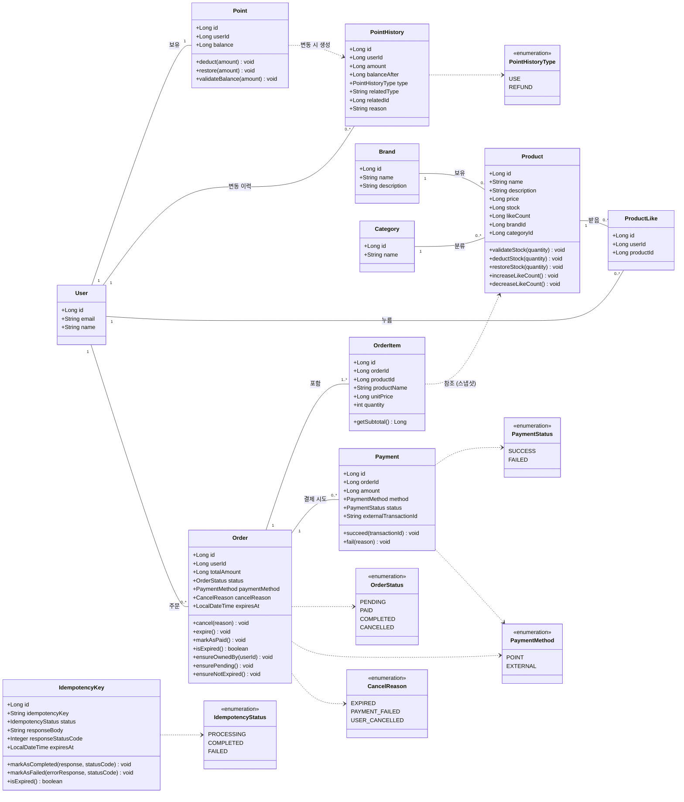

# 클래스 다이어그램

## 문서의 목적

이 문서는 커머스 시스템을 구성하는 **도메인 객체(엔티티)** 의 구조와 관계를 정의한다.
요구사항 명세서가 "무엇을 만들 것인가", 시퀀스 다이어그램이 "어떤 순서로 동작할 것인가"를 다룬다면,
이 문서는 **"우리 시스템에 어떤 것들이 살고 있고, 누가 누구와 연결되어 있는가"** 를 다룬다.

다이어그램은 다음 세 가지를 검증하기 위해 그린다.

1. **도메인 책임** — 각 객체가 어떤 비즈니스 동작을 갖는가
2. **의존 방향** — 누가 누구를 알고 있는가 (단방향/양방향)
3. **응집도** — 함께 변경되는 정보가 한 객체 안에 모여 있는가

## 공통 표기 규칙

- **도메인 객체(엔티티)** 중심으로 표현한다. Service, Facade, Repository는 시퀀스 다이어그램에서 다뤘으므로 본 문서에서는 생략한다.
- 모든 엔티티는 `BaseEntity`를 상속하므로 `id`, `createdAt`, `updatedAt`, `deletedAt`은 생략한다.
- 메서드는 **비즈니스 의미가 있는 동작**만 표시한다. getter/setter, equals/hashCode 등은 생략한다.
- 관계는 **연관(`--`)** 과 **의존(`..>`)** 으로 구분한다.
  - 연관: 객체가 다른 객체를 필드로 보유함
  - 의존: 일시적으로 다른 객체를 참조함
- 다중도(multiplicity)는 `"1"`, `"0..*"`, `"1..*"` 형식으로 표기한다.

## 사용자 도메인 안내

`User` 엔티티는 이전 단계에서 이미 구현되어 있다(회원가입, 내 정보 조회 기능 포함).
본 문서에서는 다른 도메인이 `User`를 참조하는 관계를 표현하기 위해 최소한의 속성만 표기하고, `User` 자체의 상세 설계는 다루지 않는다.

---

## 전체 클래스 다이어그램

---

## 도메인 그룹별 설명

도메인 객체를 세 그룹으로 묶어 각 그룹의 역할과 핵심 설계를 설명한다.

### ① 사용자 & 포인트

| 객체 | 역할 |
|------|------|
| `User` | 회원 정보 (이미 구현됨) |
| `Point` | 사용자의 현재 포인트 잔액 |
| `PointHistory` | 포인트 변동 이력 (사용, 복구 등) |

**핵심 설계 결정**

- **Point와 PointHistory를 분리했다.** `Point`는 현재 잔액만, `PointHistory`는 모든 변동을 기록한다. 잔액 조회는 빠르게, 추적은 정확하게 양립시키기 위함이다.
- **PointHistory에 `balanceAfter`를 둔다.** 변동 후 잔액을 함께 저장하면 운영 중 "이 시점에 포인트가 얼마였는지" 추적이 즉시 가능하다.
- **PointHistory에 `relatedType` + `relatedId`를 둔다.** 어떤 주문 때문에 차감/복구되었는지 추적할 수 있게 한다. 운영 디버깅과 결제 보상 흐름 추적에 직결된다.
- **음수 잔액 방지는 `Point.deduct()` 내부에서 강제한다.** 잔액 부족 시 `CoreException(BAD_REQUEST)`를 던진다.

### ② 상품 카탈로그 (Brand, Category, Product, ProductLike)

| 객체 | 역할 |
|------|------|
| `Brand` | 브랜드 정보 |
| `Category` | 상품 분류 (플랫 구조) |
| `Product` | 상품 (가격, 재고, 좋아요 수 보유) |
| `ProductLike` | 사용자-상품 좋아요 기록 |

**핵심 설계 결정**

- **Product와 Brand/Category는 N:1 관계다.** 한 상품은 하나의 브랜드와 하나의 카테고리에 속한다.
- **Category는 플랫 구조다.** 부모-자식 관계를 두지 않는다. 요구사항에 계층 탐색이 없고, 추후 필요해지면 `parentId` 컬럼을 추가하는 마이그레이션으로 확장한다.
- **Product에 `likeCount` 컬럼을 캐싱한다.** 상품 목록/상세 조회 시 매번 `COUNT(*)`를 실행하지 않기 위함이다. `ProductLike` 변경 시 같은 트랜잭션 안에서 함께 갱신한다.
- **`ProductLike`는 (userId, productId) 조합에 UNIQUE 제약을 둔다.** Service 레이어의 사전 조회 분기 없이 DB가 멱등성을 보장한다. 동시 요청에 대한 race condition을 원천 차단한다.
- **재고 조작은 `Product`의 메서드로 캡슐화한다.** `validateStock`, `deductStock`, `restoreStock`을 통해서만 재고가 변경되도록 한다. 음수 재고나 잘못된 차감은 메서드 내부에서 차단한다.

### ③ 주문 & 결제 (Order, OrderItem, Payment, IdempotencyKey)

| 객체 | 역할 |
|------|------|
| `Order` | 주문 (사용자, 총액, 상태) |
| `OrderItem` | 주문에 포함된 상품 항목 (수량 + 상품 스냅샷) |
| `Payment` | 결제 시도 기록 (성공/실패) |
| `IdempotencyKey` | 결제 요청의 중복 처리를 차단하는 멱등성 키 |

**핵심 설계 결정**

- **Order와 OrderItem은 1:N 관계다.** 한 주문에 여러 상품을 담을 수 있다.
- **OrderItem은 상품 정보를 스냅샷으로 저장한다.** `productId`로 참조는 유지하되, 주문 당시의 `productName`과 `unitPrice`를 함께 박제한다. 상품 가격이나 이름이 변경되어도 과거 주문 내역은 영향받지 않는다.
- **Order와 Payment는 1:N 관계다.** 한 주문에 여러 결제 시도를 허용한다. 현재 요구사항에는 재시도가 없지만, 모델이 1:N을 지원하면 추후 재시도 기능을 추가할 때 스키마 변경 없이 확장 가능하다.
- **주문 상태 변경은 `Order`의 메서드로 캡슐화한다.** `cancel()`, `markAsPaid()`, `expire()`를 통해서만 상태가 변경되도록 한다. 잘못된 상태 전이는 메서드 내부에서 차단한다.
- **`ensureOwnedBy`, `ensurePending`, `ensureNotExpired`** 같은 가드 메서드를 통해 권한 및 상태 검증을 도메인 모델 안에서 수행한다. Facade는 이 가드를 호출만 한다.
- **`expiresAt`으로 주문의 결제 가능 시간을 제한한다.** 생성 시점 + 30분이 기본이며, `commerce-batch`가 1분 주기로 만료된 PENDING 주문을 자동으로 취소한다. 결제 단계에서도 `ensureNotExpired`가 호출되어 배치 지연 시에도 만료된 주문에 결제가 일어나지 않는다.
- **취소 사유(`CancelReason`)를 별도 enum으로 분리한다.** 만료, 사용자 취소, 결제 실패를 같은 `CANCELLED` 상태로 표현하되 사유로 구분한다. 상태 머신을 단순하게 유지하면서도 운영 분석은 정확하게 수행할 수 있다.
- **`IdempotencyKey`는 결제 도메인과 직접 연관 관계를 갖지 않는다.** 결제 결과를 응답 형태로 저장만 한다. Payment 엔티티와 FK로 연결하지 않는 이유는, 멱등성 키는 결제뿐 아니라 다른 변경 API로도 확장 가능한 범용 패턴이기 때문이다.

---

## 핵심 설계 결정 요약

| # | 결정 | 이유 |
|---|------|------|
| 1 | Point과 PointHistory 분리 | 잔액 조회 속도와 이력 추적을 양립. 결제 보상 흐름과 운영 디버깅에 필수. |
| 2 | PaymentHistory.balanceAfter, relatedType/Id 컬럼 | 변동 추적과 관련 도메인 매핑으로 운영성 강화. |
| 3 | Order-Payment를 1:N 관계 | 결제 재시도 확장을 위해 처음부터 1:N 구조로 설계. |
| 4 | OrderItem에 상품 정보 스냅샷 저장 | 상품 변경/삭제가 과거 주문에 영향을 주지 않도록 격리. |
| 5 | Product에 likeCount 캐싱 컬럼 | 상품 목록 조회 시 COUNT 쿼리 회피. ProductLike 테이블도 함께 유지. |
| 6 | ProductLike (userId, productId) UNIQUE 제약 | 멱등성을 Service가 아닌 DB에 위임. 동시 요청 race condition 차단. |
| 7 | Category 플랫 구조 | 요구사항에 계층 탐색이 없으므로 단순화. 추후 parentId 추가로 확장 가능. |
| 8 | 비즈니스 동작을 도메인 모델에 캡슐화 | `deductStock`, `validateBalance`, `markAsPaid` 등을 통해서만 상태 변경. anemic 모델을 피한다. |
| 9 | IdempotencyKey를 결제와 무관한 범용 엔티티로 분리 | 결제 외 다른 변경 API로 확장할 여지를 남기고, 결제 도메인이 멱등성 메커니즘에 결합되지 않도록 한다. |

---

## 알려진 한계 / 다음 단계로 미루는 결정

> **재고 차감 시 동시성 제어**
> `Product.deductStock`의 동시 호출 시 락 전략(낙관적/비관적)이 필요하다.
> 본 문서에서는 도메인 책임만 정의하고, 구체적인 락 전략은 구현 단계에서 결정한다.
> - 비관적 락: `Product` 엔티티에 `@Lock(LockModeType.PESSIMISTIC_WRITE)` 적용
> - 낙관적 락: `Product`에 `@Version` 추가
>
> 인기 상품 비율과 트래픽 패턴에 따라 결정한다.

> **포인트 차감 시 동시성 제어**
> `Point.deduct`도 동일한 동시성 이슈를 가진다.
> 일반적으로 같은 사용자가 동시에 두 결제를 시도하는 경우는 드물지만, 비관적 락으로 보호하는 것이 안전하다.

> **likeCount와 ProductLike의 정합성**
> 같은 트랜잭션 안에서 갱신하더라도, 운영 사고나 데이터 마이그레이션 과정에서 어긋날 수 있다.
> 운영 단계에서는 주기적 정합성 검증 배치(`SELECT product_id, COUNT(*) FROM product_like GROUP BY product_id` vs `Product.like_count`)가 필요하다.

> **Payment의 외부 PG 응답 저장 범위**
> 현재 모델은 `externalTransactionId`만 보유한다.
> 실제 운영에서는 승인번호, 카드 종류, 할부 개월, 영수증 URL 등 PG가 반환하는 추가 정보를 저장해야 할 수 있다.
> 이는 PG 사업자 스펙이 확정된 후 컬럼을 추가한다.

> **User-Point의 1:1 관계 보장**
> `Point` 테이블의 `user_id` 컬럼에 UNIQUE 제약을 둬 한 사용자가 하나의 Point 레코드만 갖도록 강제한다.
> 본 문서에는 표시하지 않았으나 ERD에서 명시한다.
