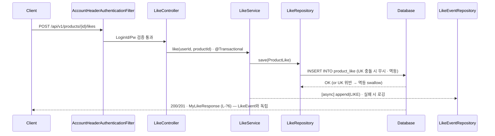
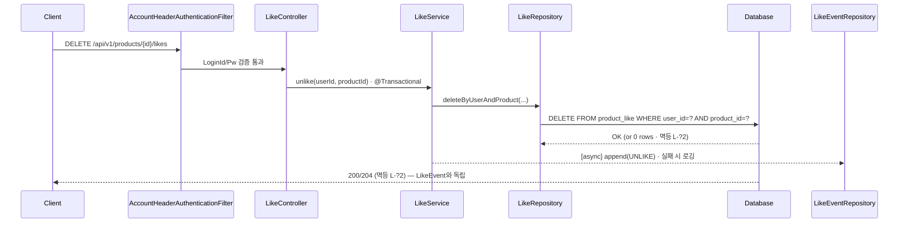
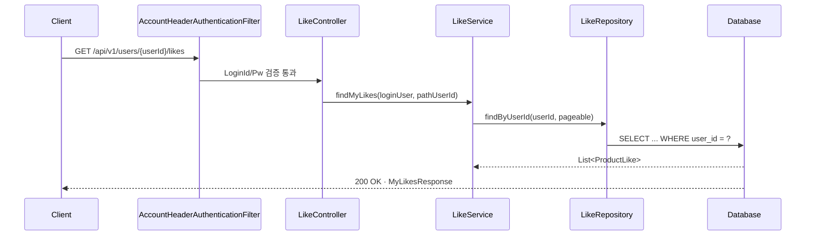
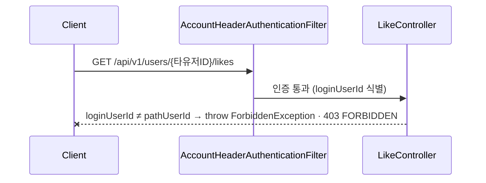

# Likes · 시나리오 → 추출 모델

> Week 2 / Domain 3 of 4 — `03-likes-final.html` 기반 정제본
> 시나리오 명세가 1차 입력이고, 도메인 / DB / API 시퀀스는 모두 거기서 도출됨.
> Likes는 toggle / 조회만 — UPDATE 그룹은 존재하지 않는다. 인증은 모든 동작이 `user_required: O`.
> **현재 상태**는 `ProductLike` (hard delete), **이력**은 `LikeEvent` (append-only)로 책임 분리.

## 1. 유저 시나리오 명세

이 도메인이 가져야 할 모든 동작을 한 문장씩 정리한다. **이게 1차 입력이고, 아래 모든 섹션은 여기서 도출된다.**

### CREATE · 좋아요 등록 (5건)

- **L-C1** `정상 200/201` 로그인 사용자가 상품에 좋아요를 등록한다. ※ LIKE 액션이 `LikeEvent`에 비동기로 append됩니다.
- **L-C2** `예외 401` 인증 헤더가 없거나 잘못된 요청이면 예외가 발생한다.
- **L-C3** `예외 404` 존재하지 않는 productId로 좋아요를 시도하면 예외가 발생한다.
- **L-C4** `정상` 이미 좋아요한 상품에 다시 좋아요를 시도할 때의 동작 (멱등 200 vs 충돌 409). — L-?1
- **L-C5** `예외 400` productId 형식이 잘못된 요청이면 예외가 발생한다.

### DELETE · 좋아요 취소 (5건)

- **L-D1** `정상 200/204` 로그인 사용자가 좋아요한 상품의 좋아요를 취소한다. ※ UNLIKE 액션이 `LikeEvent`에 비동기로 append됩니다.
- **L-D2** `예외 401` 인증 헤더가 없거나 잘못된 요청이면 예외가 발생한다.
- **L-D3** `정상` 좋아요한 적이 없는 상품에 대해 취소를 시도할 때의 동작 (멱등 204 vs 404). — L-?2
- **L-D4** `예외 404` 존재하지 않는 productId로 좋아요 취소를 시도하면 예외가 발생한다.
- **L-D5** `예외 400` productId 형식이 잘못된 요청이면 예외가 발생한다.

### READ · 내가 좋아요한 상품 목록 조회 (4건)

- **L-R1** `정상 200` 로그인 사용자가 본인의 좋아요 상품 목록을 조회한다.
- **L-R2** `예외 401` 인증 헤더가 없거나 잘못된 요청이면 예외가 발생한다.
- **L-R3** `예외 403` 로그인 사용자가 본인이 아닌 다른 userId로 조회를 시도하면 예외가 발생한다. — L-?5
- **L-R4** `예외 400/404` 존재하지 않는 userId 형식의 path로 조회 시 예외가 발생한다.

## 2. 라이프사이클 흐름

> Likes는 toggle 도메인 — 등록 ↔ 취소가 양방향으로 반복되고, READ는 그 위에 별도 축으로 얹힌다. UPDATE는 의미적으로 존재하지 않음. **현재 상태**(ProductLike)의 INSERT/DELETE 토글과 **이력**(LikeEvent)의 append-only 축이 별도로 존재.

```mermaid
flowchart TB
    Entry["사용자 인증<br/>(X-Loopers-LoginId / X-Loopers-LoginPw)"]
    Entry --> C
    Entry --> D
    C["CREATE · 사용자<br/>POST /api/v1/products/{productId}/likes<br/>200/201 · INSERT<br/>L-C1~C5<br/>예외: 400 · 401 · 404 · (409)"]
    D["DELETE · 사용자<br/>DELETE /api/v1/products/{productId}/likes<br/>200/204 · hard DELETE<br/>L-D1~D5<br/>예외: 400 · 401 · 404"]
    C <--> D
    C --> R
    D --> R
    R["READ · 사용자 (본인만)<br/>GET /api/v1/users/{userId}/likes<br/>200 OK<br/>L-R1~R4<br/>예외: 400 · 401 · 403/404"]
    C -.append LIKE (async).-> Event
    D -.append UNLIKE (async).-> Event
    Event["LikeEvent — 이력 (append-only)<br/>action: LIKE / UNLIKE<br/>매 토글마다 새 row insert<br/>UPDATE/DELETE 없음 · UK 없음"]
    Event -.->|side effect (미래)| F["좋아요 행동 데이터 → 랭킹/추천<br/>비동기 집계 (L-F1)"]
```

> ProductLike는 `(none) → ACTIVE → (none)` 토글 — `(user_id, product_id)` UK로 멱등성 보장. LikeEvent는 같은 토글을 append-only로 누적.

## 3. 도메인 모델

위 시나리오에서 추출된 좋아요 도메인의 책임. **현재 상태**는 `ProductLike` (hard delete), **이력**은 `LikeEvent` (append-only)로 책임 분리.

### ProductLike 엔티티 필드 — 현재 상태 · hard delete

| 필드 | 타입 | 설명 | 출처 시나리오 |
|---|---|---|---|
| `id` | Long (PK) | 시스템 부여 식별자 | 모든 시나리오 |
| `userId` | Long | 좋아요를 누른 사용자 (soft ref) | L-C1, L-R1, L-R3 |
| `productId` | Long | 좋아요 대상 상품 (soft ref) | L-C1, L-C3, L-D1 |
| `createdAt` | LocalDateTime | BaseEntity 중 `createdAt`만 채택 (응답 노출 X) | BaseEntity |

#### ProductLike invariant

- (`userId`, `productId`) 유일성 — 동일 유저가 같은 상품에 좋아요를 두 번 가질 수 없음. **UK로 멱등성 보장** — 출처 L-C4 / L-?1
- **status 컬럼 없음 · state machine 없음** — UNLIKE 시 row hard delete, 다시 LIKE 시 새 row INSERT
- `userId`는 존재하는 사용자 — application 레벨 검증 (FK 없음). 출처 L-C1
- `productId`는 존재하는 상품 — 404 처리. 출처 L-C3, L-D4
- 좋아요 자체는 mutable 필드 없음 — UPDATE 그룹이 없는 이유
- **BaseEntity 부분 채택** — ProductLike는 immutable이므로 `createdAt`만 사용. `updatedAt`은 영원히 `createdAt`과 동일해 dead column이며, `createdBy`/`updatedBy`는 `userId`와 의미가 중복되고 토글 이력 audit은 `LikeEvent`가 책임지므로 미사용

### LikeEvent 엔티티 필드 — 이력 · append-only (신규)

> big-picture.md "유저 행동은 모두 기록되고, 그 데이터는 이후 다양한 기능으로 확장될 수 있어요" 근거. 매 토글마다 새 row insert — UPDATE/DELETE 없음.

| 필드 | 타입 | 설명 | 출처 |
|---|---|---|---|
| `id` | Long (PK, auto-increment) | 시스템 부여 식별자 | 신규 |
| `userId` | Long | 액션 주체 (soft ref) | L-C1, L-D1 |
| `productId` | Long | 액션 대상 (soft ref) | L-C1, L-D1 |
| `action` | Enum (LIKE / UNLIKE) | 토글 액션 종류 | 신규 |
| `recordedAt` | LocalDateTime | 이벤트 발생 시각 | 신규 |

#### LikeEvent invariant

- **append-only** — UPDATE/DELETE 없음. 매 토글마다 새 row insert
- **UK 없음** — 같은 (`userId`, `productId`)가 LIKE → UNLIKE → LIKE 식으로 여러 row 생성 가능
- **책임 분리**: 현재 상태는 ProductLike가, 이력은 LikeEvent가 보유

#### LikeEvent 책임 / 활용

- 통계 · 행동 분석 · 이력 보존
- 미래 비동기 집계의 소스 (L-F1)
- LikeEvent → User / Product (논리 참조) · FK 없음

### 연관 관계

- ProductLike → User (N:1, 논리 참조) · `userId` — 유저 탈퇴 시 cascade 정책은 결정 보류
- ProductLike → Product (N:1, 논리 참조) · `productId` — 상품 삭제 시 cascade 정책 (Brand 도메인의 cascade 흐름과 정합 필요)
- `Product.likeCount` 비정규화 — L-?3 (Product 도메인의 `likes_desc` 정렬과 연동)
- ProductLike의 INSERT/DELETE는 LikeEvent에 비동기 append를 트리거 — L-?7

## 4. DB 테이블

naming은 Spring Boot 기본 `SpringPhysicalNamingStrategy` 가정 (camelCase → snake_case).

### product_like — 현재 상태 · hard delete

| 컬럼 | 타입 | 제약 | 출처 |
|---|---|---|---|
| `id` | BIGINT | PK, AUTO_INCREMENT | 전부 |
| `user_id` | BIGINT | NOT NULL · (논리 참조) | L-C1, L-R1 |
| `product_id` | BIGINT | NOT NULL · (논리 참조) | L-C1, L-C3 |
| `created_at` | DATETIME(6) | NOT NULL (BaseEntity 중 단독 채택) | BaseEntity |

**제약**:
- `UNIQUE KEY uk_product_like_user_product (user_id, product_id)` — 도메인 유일성. 출처 L-C4

**status 컬럼 없음**: UNLIKE 시 row hard delete, 다시 LIKE 시 새 row INSERT.

### like_event — 이력 · append-only (신규)

| 컬럼 | 타입 | 제약 | 출처 |
|---|---|---|---|
| `id` | BIGINT | PK, AUTO_INCREMENT | 신규 |
| `user_id` | BIGINT | NOT NULL · (논리 참조) | L-C1, L-D1 |
| `product_id` | BIGINT | NOT NULL · (논리 참조) | L-C1, L-D1 |
| `action` | VARCHAR or ENUM | NOT NULL · LIKE / UNLIKE | 신규 |
| `recorded_at` | DATETIME(6) | NOT NULL | 신규 |

**append-only**: UPDATE/DELETE 없음. 매 토글마다 새 row INSERT.
**UK 없음**: 같은 (user_id, product_id) 페어가 여러 row를 가질 수 있음.
**책임**: 통계 · 행동 분석 · 이력 보존 (미래 비동기 집계 소스 L-F1).

### product (likeCount 비정규화)

| 컬럼 | 타입 | 제약 | 출처 |
|---|---|---|---|
| `like_count` | BIGINT | NOT NULL DEFAULT 0 | L-?3 |

**비정규화**: Product의 `sort=likes_desc` 정렬 성능을 위해 `product.like_count`를 두는 결정 (L-?3 / P-?5와 통일). 토글 시 동기 증감. 미래 비동기 집계와도 연결 (L-F1).

### ER 다이어그램

```mermaid
erDiagram
    USER ||--o{ PRODUCT_LIKE : "user_id (논리) (1:N)"
    PRODUCT ||--o{ PRODUCT_LIKE : "product_id (논리) (1:N)"
    USER ||--o{ LIKE_EVENT : "user_id (논리) (1:N)"
    PRODUCT ||--o{ LIKE_EVENT : "product_id (논리) (1:N)"
    USER {
        BIGINT id PK
        OTHER other_columns "User 도메인"
    }
    PRODUCT_LIKE {
        BIGINT id PK
        BIGINT user_id
        BIGINT product_id
        DATETIME created_at
        UK user_id_product_id "(user_id, product_id) 복합 UK"
    }
    LIKE_EVENT {
        BIGINT id PK
        BIGINT user_id
        BIGINT product_id
        VARCHAR action "LIKE / UNLIKE"
        DATETIME recorded_at
    }
    PRODUCT {
        BIGINT id PK
        BIGINT like_count "비정규화"
        OTHER other_columns "Product 도메인"
    }
```

> **DB 제약(FK) 없음.** `user_id`, `product_id` 등은 논리 참조입니다. 무결성은 애플리케이션 레이어 책임 — 자세한 정책은 `docs/conventions.md` 참조.

## 5. API 시퀀스

대표 시나리오에 대한 호출 흐름. 실선 = 호출, 점선(녹/적) = return / 에러 응답.

### L-C1 — 좋아요 등록 (정상)

LoginAuth 헤더 검증 → product_like INSERT (UK 위반 시 멱등 200) → LikeEvent에 LIKE 액션 비동기 append (실패 시 로깅).



### L-D1 — 좋아요 취소 (정상)

LoginAuth 헤더 검증 → product_like DELETE → LikeEvent에 UNLIKE 액션 비동기 append.



### L-R1 — 본인 좋아요 목록 (정상)

LoginAuth → path userId가 인증된 사용자와 일치하는지 검증 → product_like 조회.



### L-R3 — 타 사용자 userId로 조회 시도 (예외 · L-?5 → 403)

AccountHeaderAuthenticationFilter는 통과 (인증은 OK) → LikeController에서 path `{userId}`와 인증된 사용자 ID 불일치 → 차단. **403 FORBIDDEN** (L-?5).



## 6. 결정 이력

본 주차에 확정한 설계 결정. 구현 디테일(JPA 매핑, 동시성 메커니즘, 인덱스 등)은 본 절에 포함하지 않는다.

### L-?1 — 중복 좋아요 동작

**결정**: **멱등 200** — 이미 좋아요된 경우 200으로 조용히 성공.
**근거**: 토글 UX 표준 + 네트워크 재시도 안전. UK는 도메인 invariant로 유지.

### L-?2 — 좋아요 안 한 상품에 대한 취소

**결정**: **멱등 204**.
**근거**: DELETE의 RFC 7231 idempotent 시맨틱. L-?1 등록 멱등 결정과 짝.

### L-?3 — likeCount 비정규화

**결정**: `product.like_count` 비정규화 + 토글 시 증감 (P-?5와 통일).
**근거**: Product의 `sort=likes_desc` 정렬 비용. 정합성 100%인 매 조회 COUNT(*)는 정렬 성능 부담. 미래 비동기 집계로 전환 여지 (L-F1).

### L-?5 — 타 사용자 userId 접근 시 응답 status

**결정**: **403 FORBIDDEN**.
**근거**: 인증은 OK이지만 권한 없음이라 의미상 정확. 학습 프로젝트 + 의미 정합성 우선. 운영 보안 단계(정보 누설 회피, OWASP A01:2021)에서 404로 전환 가능.

### L-?6 — 좋아요 등록 응답 형태

**결정**: **200 OK + Body** (좋아요 상태 / likeCount).
**근거**: 멱등(L-?1)과 정합 — "이미 있음"에 201은 어색. 토글 UX에서 즉시 갱신 데이터를 받을 수 있음.

### L-?7 — LikeEvent 적재

**결정**: **비동기 append, 실패 시 로깅**.
**근거**: ProductLike(현재 상태)와 LikeEvent(이력)의 책임 분리. LikeEvent 적재 실패가 본 트랜잭션을 막지 않도록. 적재 인프라(메시지 큐 / outbox / `@TransactionalEventListener` 등)는 미래 결정.

## 7. 미래 확장 마킹

### L-F1 — 좋아요 행동 데이터 → 랭킹 / 추천 비동기 집계

big-picture "추가 비전" — 좋아요/주문 행동 데이터를 비동기 집계해 정렬/추천 모델로 활용. 이번 주는 미설계.

**이번 주 설계가 받아내야 할 것**:
- `like_event` 테이블이 원천 이벤트 소스로 본 주차에 자리 잡음 — 미래 비동기 집계가 자연스럽게 붙음
- `like_count` 비정규화(L-?3)는 동기 +/- 대신 비동기 집계로 옮기는 길도 열어둠
- 좋아요 토글에 도메인 이벤트 발행 훅을 둘 자리를 마련 (LikeEvent append가 그 첫 단계)

### L-F2 — Role 분리 · Brand staff 좋아요 통계 조회

big-picture "추가 비전" — Brand=Tenant 비전 하에서 Brand staff가 자기 brand 상품의 좋아요 통계만 조회 (총 좋아요 수 / 트렌드). 이번 주는 Role enum 미결정.

**이번 주 설계가 받아내야 할 것**:
- 좋아요 row가 `user_id`, `product_id`의 정규화된 형태로 남아야 `brand_id` 기반 집계가 가능 (product → brand_id join)
- Role 분리 시 어떤 권한이 `/admin/brands/{brandId}/likes/stats` 같은 엔드포인트를 가질지는 미결정 — 본 도메인 설계는 권한 축에 종속되지 않게 유지

---

> 원본 HTML: [`03-likes-final.html`](./03-likes-final.html) · 변경 시 HTML과 동기화 필요
