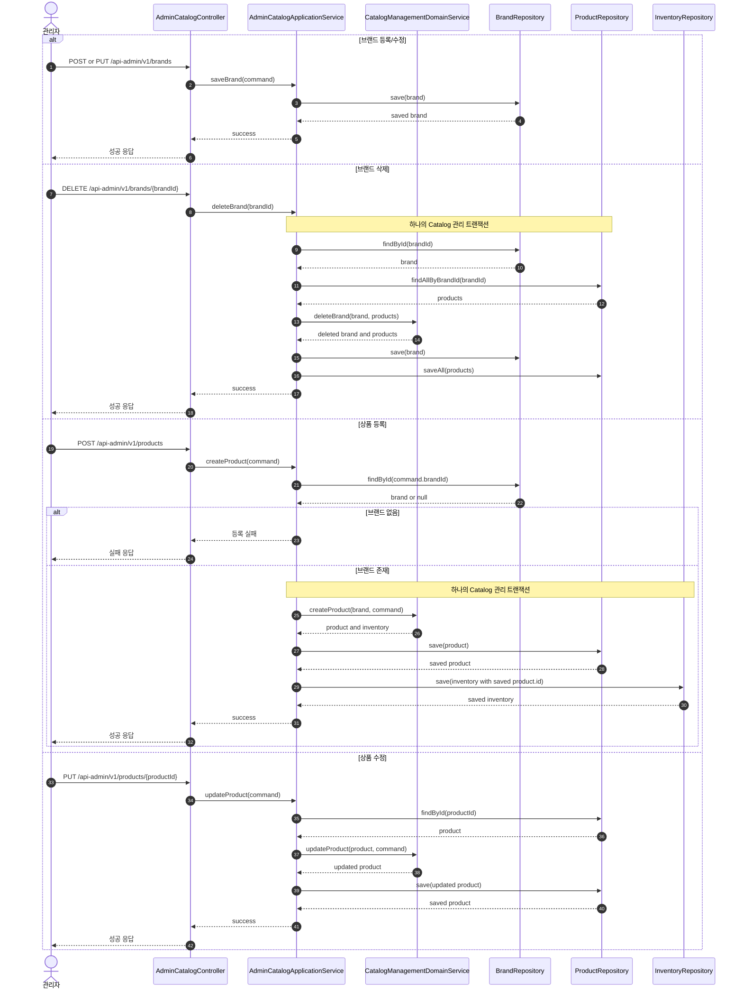

# Sequence 03 - 관리자 브랜드/상품 관리

## 1. Why

관리자 Catalog 흐름은 같은 `Brand`, `Product` 도메인을 사용하지만 고객 조회와는 책임이 다르다.  
운영자가 어떤 규칙으로 브랜드와 상품을 생성, 수정, soft delete 하는지 드러내야 고객용 조회 모델과 쓰기 모델이 섞이지 않는다.

## 2. Diagram

## 3. Key Points

- `AdminCatalogApplicationService`가 repository interface 를 통해 필요한 도메인 데이터를 조회하고 관리자 유스케이스 흐름을 조정한다.
- 브랜드 삭제, 상품 생성, 상품 수정처럼 여러 도메인 객체가 함께 움직이는 규칙은 `CatalogManagementDomainService`가 담당한다.
- 브랜드 삭제는 연관 상품 soft delete 정책을 동반하므로 Application Service 단위 트랜잭션 경계를 함께 고려해야 한다.
- 상품 등록은 브랜드 존재 검증이 먼저고, 상품과 `Inventory`를 함께 만들어야 한다. 상품 수정의 `brandId` 변경 금지 정책은 `CatalogManagementDomainService`에서 다루는 편이 자연스럽다.
