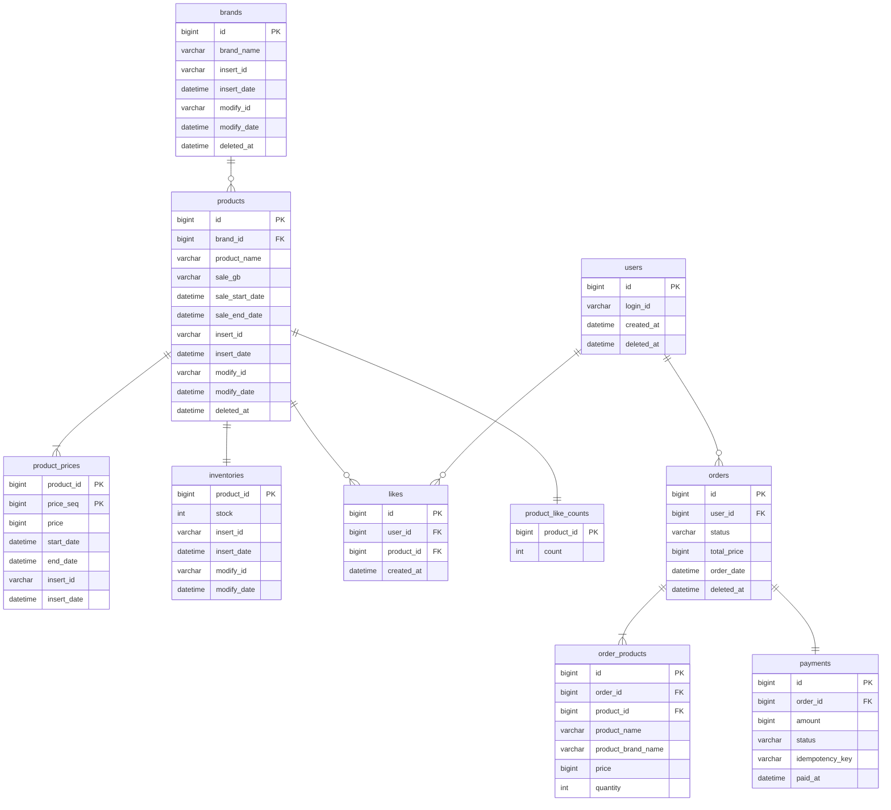
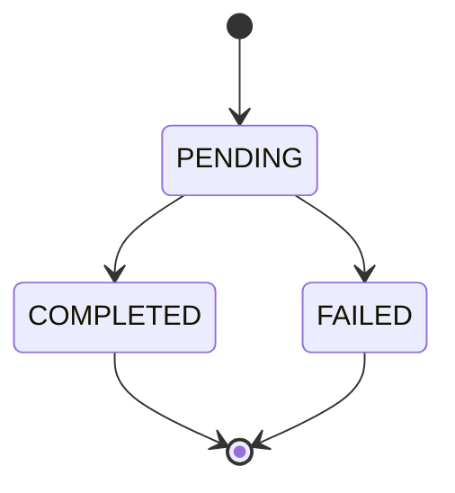

# 04. ERD (Volume 2)

## 설계 원칙

| 원칙 | 설명 |
|------|------|
| DB FK 제약 없음 | 데이터 정합성은 애플리케이션 레벨에서 관리 |
| Soft Delete | `deleted_at` 컬럼으로 논리 삭제 (likes, product_like_counts 제외) |
| Audit 필드 | 어드민이 관리하는 테이블은 `insert_id`, `insert_date`, `modify_id`, `modify_date` 포함 |

---

## 전체 ERD

---

## 관계 차수 및 참여 요약

| 관계 | 차수 | 좌측 참여 | 우측 참여 | 비고 |
|------|------|-----------|-----------|------|
| brands → products | 1:N | 필수 | 선택 | 상품은 반드시 브랜드에 속함, 브랜드에 상품 없어도 됨 |
| products → product_prices | 1:N | 필수 | 필수 | 상품 등록 시 최초 가격 이력 필수 |
| products → inventories | 1:1 | 필수 | 필수 | 상품 등록 시 재고 함께 생성 |
| products → product_like_counts | 1:1 | 필수 | 필수 | 상품 등록 시 count=0 초기 생성 |
| products → likes | 1:N | 필수 | 선택 | 좋아요 없는 상품 가능 |
| users → orders | 1:N | 필수 | 선택 | 주문 없는 회원 가능 |
| users → likes | 1:N | 필수 | 선택 | 좋아요 없는 회원 가능 |
| orders → order_products | 1:N | 필수 | 필수 | 주문에 최소 1개 상품 필수 |
| orders → payments | 1:1 | 필수 | 필수 | 주문 생성 시 결제 PENDING으로 함께 생성 |

---

## 테이블별 상세

### brands

| 컬럼 | 타입 | 제약 | 설명 |
|------|------|------|------|
| id | BIGINT | PK, AUTO_INCREMENT | |
| brand_name | VARCHAR(100) | NOT NULL | 브랜드명 |
| insert_id | VARCHAR(50) | NOT NULL | 등록 어드민 Ldap ID |
| insert_date | DATETIME | NOT NULL | 등록일시 |
| modify_id | VARCHAR(50) | | 수정 어드민 Ldap ID |
| modify_date | DATETIME | | 수정일시 |
| deleted_at | DATETIME | | soft delete |

---

### products

| 컬럼 | 타입 | 제약 | 설명 |
|------|------|------|------|
| id | BIGINT | PK, AUTO_INCREMENT | |
| brand_id | BIGINT | NOT NULL | brands.id 참조 (DB FK 없음) |
| product_name | VARCHAR(200) | NOT NULL | 상품명 |
| sale_gb | VARCHAR(20) | NOT NULL | 판매중 / 일시중지 / 영구중지 |
| sale_start_date | DATETIME | | 판매 시작일 |
| sale_end_date | DATETIME | | 판매 종료일 |
| insert_id | VARCHAR(50) | NOT NULL | 등록 어드민 Ldap ID |
| insert_date | DATETIME | NOT NULL | 등록일시 |
| modify_id | VARCHAR(50) | | 수정 어드민 Ldap ID |
| modify_date | DATETIME | | 수정일시 |
| deleted_at | DATETIME | | soft delete |

**인덱스**
- `idx_products_brand_id` (brand_id) — 브랜드별 상품 조회
- `idx_products_sale_gb` (sale_gb, deleted_at) — 판매중 상품 필터링

---

### product_prices

| 컬럼 | 타입 | 제약 | 설명 |
|------|------|------|------|
| product_id | BIGINT | PK | products.id 참조 |
| price_seq | BIGINT | PK | 가격 이력 순번 |
| price | BIGINT | NOT NULL | 가격 |
| start_date | DATETIME | NOT NULL | 가격 유효 시작일 |
| end_date | DATETIME | | 가격 유효 종료일 (null = 현재 유효) |
| insert_id | VARCHAR(50) | NOT NULL | 등록 어드민 Ldap ID |
| insert_date | DATETIME | NOT NULL | 등록일시 |

**인덱스**
- `idx_product_prices_current` (product_id, start_date) — 현재 유효 가격 조회

---

### inventories

| 컬럼 | 타입 | 제약 | 설명 |
|------|------|------|------|
| product_id | BIGINT | PK | products.id 참조 (1:1) |
| stock | INT | NOT NULL, DEFAULT 0 | 재고 수량 |
| insert_id | VARCHAR(50) | NOT NULL | 등록 어드민 Ldap ID |
| insert_date | DATETIME | NOT NULL | 등록일시 |
| modify_id | VARCHAR(50) | | 수정 어드민 Ldap ID |
| modify_date | DATETIME | | 수정일시 |

---

### likes

| 컬럼 | 타입 | 제약 | 설명 |
|------|------|------|------|
| id | BIGINT | PK, AUTO_INCREMENT | |
| user_id | BIGINT | NOT NULL | users.id 참조 |
| product_id | BIGINT | NOT NULL | products.id 참조 |
| created_at | DATETIME | NOT NULL | 좋아요 등록 시각 |

**인덱스**
- `uk_likes_user_product` (user_id, product_id) UNIQUE — 중복 좋아요 방지

---

### product_like_counts

| 컬럼 | 타입 | 제약 | 설명 |
|------|------|------|------|
| product_id | BIGINT | PK | products.id 참조 (1:1) |
| count | INT | NOT NULL, DEFAULT 0 | 좋아요 수 |

> `commerce-batch`에서 3~4시간 주기로 likes 테이블 COUNT 집계하여 갱신

---

### orders

| 컬럼 | 타입 | 제약 | 설명 |
|------|------|------|------|
| id | BIGINT | PK, AUTO_INCREMENT | |
| user_id | BIGINT | NOT NULL | users.id 참조 |
| status | VARCHAR(20) | NOT NULL | PENDING / COMPLETED / FAILED |
| total_price | BIGINT | NOT NULL | 총 주문 금액 |
| order_date | DATETIME | NOT NULL | 주문 생성 시각 |
| deleted_at | DATETIME | | soft delete |

**인덱스**
- `idx_orders_user_id` (user_id, order_date) — 회원별 주문 목록 조회

---

### order_products

| 컬럼 | 타입 | 제약 | 설명 |
|------|------|------|------|
| id | BIGINT | PK, AUTO_INCREMENT | |
| order_id | BIGINT | NOT NULL | orders.id 참조 |
| product_id | BIGINT | NOT NULL | products.id 참조 (참조용) |
| product_name | VARCHAR(200) | NOT NULL | 주문 당시 상품명 스냅샷 |
| product_brand_name | VARCHAR(100) | NOT NULL | 주문 당시 브랜드명 스냅샷 |
| price | BIGINT | NOT NULL | 주문 당시 가격 스냅샷 |
| quantity | INT | NOT NULL | 주문 수량 |

**인덱스**
- `idx_order_products_order_id` (order_id) — 주문별 상품 조회
- `uk_order_products_order_product` (order_id, product_id) UNIQUE — 같은 주문에 동일 상품 중복 방지

---

### payments

| 컬럼 | 타입 | 제약 | 설명 |
|------|------|------|------|
| id | BIGINT | PK, AUTO_INCREMENT | |
| order_id | BIGINT | NOT NULL, UNIQUE | orders.id 참조 (1:1) |
| amount | BIGINT | NOT NULL | 결제 금액 |
| status | VARCHAR(20) | NOT NULL | PENDING / COMPLETED / FAILED |
| idempotency_key | VARCHAR(100) | NOT NULL, UNIQUE | 중복 결제 방지 키 |
| paid_at | DATETIME | | 결제 완료 시각 |

---

## Enum 정의

### OrderStatus (주문 상태)

| 값 | 설명 |
|------|------|
| `PENDING` | 주문 생성 (결제 대기) |
| `COMPLETED` | 결제 완료 |
| `FAILED` | 결제 실패 |

### PaymentStatus (결제 상태)

| 값 | 설명 |
|------|------|
| `PENDING` | 결제 진행 중 |
| `COMPLETED` | 결제 성공 |
| `FAILED` | 결제 실패 |

### ProductStatus (상품 판매 상태)

| 값 | 설명 |
|------|------|
| `판매중` | 현재 판매 가능 |
| `일시중지` | 일시적으로 판매 중단 (재개 가능) |
| `영구중지` | 영구적으로 판매 중단 |

---

## 삭제 정책 요약

| 테이블 | 삭제 정책 | 비고 |
|------|------|------|
| `brands` | soft delete | `deleted_at`, 삭제 시 소속 상품 전체 soft delete |
| `products` | soft delete | `deleted_at`, 브랜드 삭제에 cascade |
| `product_prices` | 삭제 없음 | insert-only 이력 테이블 |
| `inventories` | 삭제 없음 | 상품과 동일 생명주기, 상품 삭제 시 함께 관리 |
| `likes` | hard delete | 이력 보존 불필요, 상품/브랜드 삭제 시 cascade |
| `product_like_counts` | hard delete | 상품 삭제 시 함께 삭제 |
| `orders` | soft delete | `deleted_at`, 상태 변경으로 관리 |
| `order_products` | 삭제 없음 | 주문에 종속, 독립 삭제 없음 |
| `payments` | 삭제 없음 | 결제 이력은 보존, 상태 변경으로 관리 |

---

## 유니크 제약조건

| 테이블 | 컬럼 | 인덱스명 | 설명 |
|------|------|------|------|
| `likes` | `user_id, product_id` | `uk_likes_user_product` | 동일 회원-상품 좋아요 1건 |
| `order_products` | `order_id, product_id` | `uk_order_products_order_product` | 같은 주문에 동일 상품 중복 방지 |
| `payments` | `order_id` | (컬럼 UNIQUE) | 주문당 결제 1건 |
| `payments` | `idempotency_key` | (컬럼 UNIQUE) | 중복 결제 방지 |
| `product_like_counts` | `product_id` | (PK) | 상품당 좋아요 수 1건 |
| `inventories` | `product_id` | (PK) | 상품당 재고 1건 |