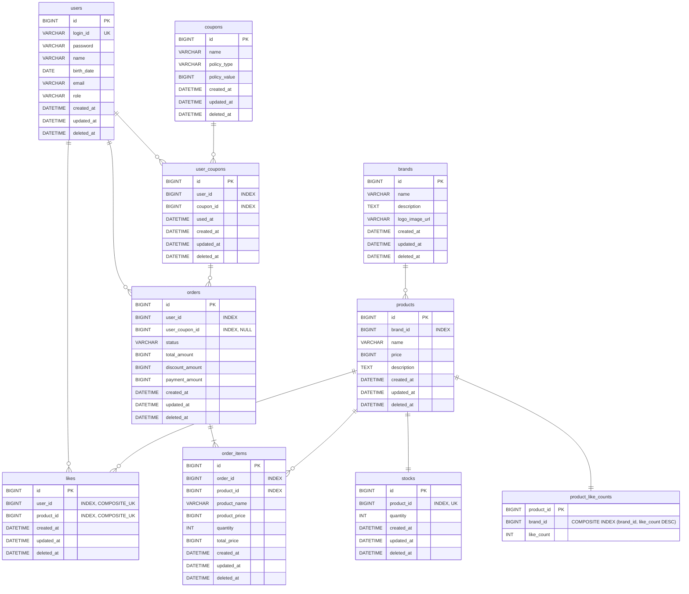

# 04. ERD

`01-requirements.md`, `02-sequence-diagrams.md`, `03-class-diagram.md`를 바탕으로 이커머스 도메인의 전체 테이블 구조와 관계를 정리한다.

## 1. 설계 결정

- 대부분의 도메인 테이블은 `BaseEntity`를 상속하므로 `id`, `created_at`, `updated_at`, `deleted_at` 컬럼을 공통으로 가진다.
- DB 레벨 FK 제약은 사용하지 않고, 참조 무결성은 애플리케이션 레이어에서 보장한다.
- 참조 ID 컬럼에는 조회 성능을 위해 인덱스를 건다.
- `users.password`는 인코딩된 비밀번호를 저장하며, 평문 비밀번호는 저장하지 않는다.
- 사용자는 `role` 컬럼으로 일반 사용자와 어드민을 구분하며, 별도 권한 테이블은 두지 않는다.
- soft delete는 공통 `deleted_at` 컬럼으로 표현한다.
- 재고는 상품 카탈로그 정보와 분리해 `stocks` 테이블에서 관리한다.
- `stocks.product_id`는 상품별 재고를 식별하는 논리 참조이며, 한 상품은 하나의 재고 행을 가진다.
- 상품 삭제 시 상품, 재고, 좋아요 수 집계(`product_like_counts`)는 같은 유스케이스 트랜잭션에서 함께 삭제한다.
- 좋아요 수는 `products` 테이블이 아닌 `product_like_counts` 프로젝션 테이블에서 관리하며, `LikeCountSyncJob` 배치가 주기적으로 동기화한다.
- 좋아요는 `(user_id, product_id)` 조합의 중복을 허용하지 않는다.
- `likes`는 취소 후 재등록 시 기존 레코드의 `deleted_at`을 null로 복구한다.
- 주문 상품은 원본 상품 ID와 주문 시점 상품 스냅샷을 함께 저장한다.
- 주문은 사용한 발급 쿠폰 ID와 할인 전 금액, 할인 금액, 최종 결제 금액을 함께 저장한다.
- 쿠폰 정책 원본은 `coupons`에 저장하고, 사용자에게 발급된 쿠폰 1장은 `user_coupons`에 저장한다.
- 동일한 쿠폰 정책은 한 사용자에게 여러 장 발급될 수 있으므로 `user_coupons.user_id + coupon_id`에는 unique constraint를 두지 않는다.
- 결제 이력 테이블은 두지 않고, 외부 결제 결과는 주문 상태에 반영한다.
- 결제 성공 후 주문 확정이 경합에서 실패하면 외부 결제 취소를 요청한다. 결제 취소 이력은 현재 범위에서는 별도 테이블로 저장하지 않는다.
- 주문 상태는 현재 설계 범위에서 `PENDING_PAYMENT`, `PAID`, `PAYMENT_FAILED`, `CANCELED`를 사용하며, 별도 상태 테이블은 두지 않는다.
- 주문 상태 전이는 `PENDING_PAYMENT` 조건부 UPDATE로 원자화하여 결제 성공 확정과 실패/취소 보상이 동시에 성공하지 않도록 한다.

## 2. ERD

아래 관계선은 DB 레벨 FK 제약이 아니라, 애플리케이션에서 관리하는 논리적 참조 관계를 의미한다.

