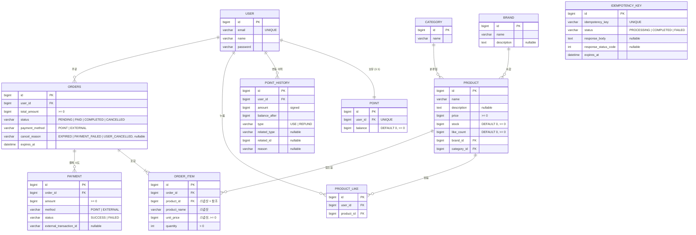

# ERD (Entity Relationship Diagram)

## 문서의 목적

이 문서는 클래스 다이어그램에서 정의한 도메인 객체를 **실제 데이터베이스 테이블 구조**로 표현한다.
클래스 다이어그램이 "객체 모델"이라면, ERD는 "**저장 모델**" 이다.

다이어그램은 다음 세 가지를 검증하기 위해 그린다.

1. **영속화 구조** — 각 도메인 객체가 어떤 테이블로 매핑되는가
2. **관계의 주인** — 외래키(FK)가 어느 쪽 테이블에 위치하는가
3. **정규화/비정규화 의도** — 어떤 컬럼이 의도적으로 중복 저장되는가

## 공통 규칙

- 테이블명은 `snake_case`, 단수형을 기본으로 한다. SQL 예약어와 충돌하는 경우만 복수형을 사용한다 (예: `order` → `orders`).
- 모든 테이블은 `BaseEntity`를 따라 다음 컬럼을 공통으로 가진다.
  - `id BIGINT PRIMARY KEY AUTO_INCREMENT`
  - `created_at DATETIME NOT NULL`
  - `updated_at DATETIME NOT NULL`
  - `deleted_at DATETIME` (NULL 허용, soft delete)
- 외래키는 데이터 무결성을 위해 명시한다. `ON DELETE CASCADE`는 사용하지 않는다 (모든 도메인은 soft delete가 기본).
- 인덱스는 **자주 사용되는 조회 패턴**을 기준으로 설계한다.

---

## 전체 ERD



---

## 도메인 그룹별 테이블 명세

### ① 사용자 & 포인트

#### `user` (기존 구현)

회원 정보. 본 문서 범위에서는 외래키 참조 대상으로만 다룬다.

| 컬럼 | 타입 | 제약 | 비고 |
|------|------|------|------|
| id | BIGINT | PK | |
| email | VARCHAR(255) | UNIQUE, NOT NULL | |
| name | VARCHAR(100) | NOT NULL | |
| password | VARCHAR(255) | NOT NULL | 해시 저장 |

#### `point`

사용자의 **현재 포인트 잔액**.

| 컬럼 | 타입 | 제약 | 비고 |
|------|------|------|------|
| id | BIGINT | PK | |
| user_id | BIGINT | FK → user.id, **UNIQUE**, NOT NULL | 사용자당 1행 |
| balance | BIGINT | NOT NULL, DEFAULT 0, CHECK >= 0 | 음수 차단 |

**인덱스**: `user_id` (UNIQUE 제약으로 자동 생성)

#### `point_history`

포인트의 **모든 변동 이력**. append-only로 동작한다.

| 컬럼 | 타입 | 제약 | 비고 |
|------|------|------|------|
| id | BIGINT | PK | |
| user_id | BIGINT | FK → user.id, NOT NULL | |
| amount | BIGINT | NOT NULL | 양수=적립/복구, 음수=차감 |
| balance_after | BIGINT | NOT NULL | 변동 직후 잔액 (운영 추적용) |
| type | VARCHAR(20) | NOT NULL | `USE`, `REFUND` |
| related_type | VARCHAR(30) | NULL | 예: `ORDER` |
| related_id | BIGINT | NULL | 예: order.id |
| reason | VARCHAR(255) | NULL | 사람이 읽을 수 있는 설명 |

**인덱스**
- `idx_point_history_user_id_created_at (user_id, created_at)` — 사용자별 이력 조회
- `idx_point_history_related (related_type, related_id)` — 특정 주문의 포인트 변동 추적

---

### ② 상품 카탈로그

#### `brand`

| 컬럼 | 타입 | 제약 | 비고 |
|------|------|------|------|
| id | BIGINT | PK | |
| name | VARCHAR(100) | NOT NULL | |
| description | TEXT | NULL | |

#### `category`

| 컬럼 | 타입 | 제약 | 비고 |
|------|------|------|------|
| id | BIGINT | PK | |
| name | VARCHAR(100) | NOT NULL | |

#### `product`

상품. **좋아요 수(`like_count`)를 비정규화하여 보유**한다.

| 컬럼 | 타입 | 제약 | 비고 |
|------|------|------|------|
| id | BIGINT | PK | |
| name | VARCHAR(255) | NOT NULL | |
| description | TEXT | NULL | |
| price | BIGINT | NOT NULL, CHECK >= 0 | 원 단위 |
| stock | BIGINT | NOT NULL, DEFAULT 0, CHECK >= 0 | |
| like_count | BIGINT | NOT NULL, DEFAULT 0, CHECK >= 0 | 캐싱 컬럼 |
| brand_id | BIGINT | FK → brand.id, NOT NULL | |
| category_id | BIGINT | FK → category.id, NOT NULL | |

**인덱스**
- `idx_product_brand_id (brand_id)` — 브랜드별 필터
- `idx_product_category_id (category_id)` — 카테고리별 필터
- `idx_product_brand_category (brand_id, category_id)` — 복합 필터

#### `product_like`

좋아요 기록. **(user_id, product_id)** 조합으로 멱등성을 보장한다.

| 컬럼 | 타입 | 제약 | 비고 |
|------|------|------|------|
| id | BIGINT | PK | |
| user_id | BIGINT | FK → user.id, NOT NULL | |
| product_id | BIGINT | FK → product.id, NOT NULL | |

**인덱스 및 제약**
- `uniq_product_like_user_product (user_id, product_id)` — **UNIQUE 제약, 멱등성 보장의 핵심**
- `idx_product_like_product_id (product_id)` — 상품별 좋아요 수 검증/집계용
- 좋아요 취소는 **물리 삭제** (`DELETE`). `deleted_at` 컬럼은 BaseEntity로 인해 존재하지만 사용하지 않는다.

---

### ③ 주문 & 결제

#### `orders`

> SQL 예약어 `ORDER`와 충돌하므로 테이블명은 복수형 `orders`를 사용한다.

| 컬럼 | 타입 | 제약 | 비고 |
|------|------|------|------|
| id | BIGINT | PK | |
| user_id | BIGINT | FK → user.id, NOT NULL | |
| total_amount | BIGINT | NOT NULL, CHECK >= 0 | 주문 총액 (스냅샷 합계) |
| status | VARCHAR(20) | NOT NULL | `PENDING`, `PAID`, `COMPLETED`, `CANCELLED` |
| payment_method | VARCHAR(20) | NOT NULL | `POINT`, `EXTERNAL` |
| cancel_reason | VARCHAR(20) | NULL | `EXPIRED`, `PAYMENT_FAILED`, `USER_CANCELLED`. status가 CANCELLED일 때만 채워짐 |
| expires_at | DATETIME | NOT NULL | 결제 가능 만료 시각 (생성 시각 + 30분) |

**인덱스**
- `idx_orders_user_id_created_at (user_id, created_at DESC)` — 사용자의 주문 내역 조회 (최신순)
- `idx_orders_status (status)` — 상태별 배치 처리용
- `idx_orders_status_expires_at (status, expires_at)` — 만료 배치 쿼리 최적화 (`WHERE status='PENDING' AND expires_at < NOW()`)

#### `order_item`

주문에 포함된 각 상품. **상품 정보를 스냅샷으로 보존**한다.

| 컬럼 | 타입 | 제약 | 비고 |
|------|------|------|------|
| id | BIGINT | PK | |
| order_id | BIGINT | FK → orders.id, NOT NULL | |
| product_id | BIGINT | FK → product.id, NOT NULL | 참조용 (스냅샷이 우선) |
| product_name | VARCHAR(255) | NOT NULL | **주문 당시** 상품명 (스냅샷) |
| unit_price | BIGINT | NOT NULL, CHECK >= 0 | **주문 당시** 단가 (스냅샷) |
| quantity | INT | NOT NULL, CHECK > 0 | |

**인덱스**
- `idx_order_item_order_id (order_id)` — 주문별 항목 조회

#### `payment`

결제 시도 기록. 한 주문에 여러 결제 시도가 존재할 수 있다.

| 컬럼 | 타입 | 제약 | 비고 |
|------|------|------|------|
| id | BIGINT | PK | |
| order_id | BIGINT | FK → orders.id, NOT NULL | |
| amount | BIGINT | NOT NULL, CHECK >= 0 | |
| method | VARCHAR(20) | NOT NULL | `POINT`, `EXTERNAL` |
| status | VARCHAR(20) | NOT NULL | `SUCCESS`, `FAILED` |
| external_transaction_id | VARCHAR(100) | NULL | 외부 PG 거래번호 (EXTERNAL일 때) |

**인덱스**
- `idx_payment_order_id (order_id)` — 주문별 결제 이력 조회
- `idx_payment_external_transaction_id (external_transaction_id)` — PG 대사 시 거래번호 검색

#### `idempotency_key`

결제 요청의 **중복 처리를 차단**하는 멱등성 키 저장소.

| 컬럼 | 타입 | 제약 | 비고 |
|------|------|------|------|
| id | BIGINT | PK | |
| idempotency_key | VARCHAR(100) | **UNIQUE**, NOT NULL | 클라이언트가 보낸 키 (UUID 등) |
| status | VARCHAR(20) | NOT NULL | `PROCESSING`, `COMPLETED`, `FAILED` |
| response_body | TEXT | NULL | 저장된 응답 (JSON 직렬화) |
| response_status_code | INT | NULL | 저장된 HTTP 상태 코드 |
| expires_at | DATETIME | NOT NULL | 만료 시각 (생성 시점 + 24시간) |

**인덱스**
- `uniq_idempotency_key (idempotency_key)` — UNIQUE 제약, 중복 키 차단
- `idx_idempotency_key_expires_at (expires_at)` — 만료 키 정리 배치용

**라이프사이클**
1. 신규 요청 시 `PROCESSING` 상태로 INSERT
2. 본 결제 로직 완료 후 결과에 따라 `COMPLETED` 또는 `FAILED`로 갱신
3. `expires_at` 경과 후 별도 배치가 물리 삭제

---

## 핵심 설계 결정 요약

| # | 결정 | 이유 |
|---|------|------|
| 1 | `point.user_id`에 UNIQUE 제약 | 한 사용자에 단 하나의 잔액 레코드만 존재함을 DB가 보장. 잔액 분산 사고를 원천 차단. |
| 2 | `point_history`에 `balance_after` 컬럼 | 변동 직후 잔액을 박제. 운영 디버깅과 정합성 검증의 핵심 자료. |
| 3 | `point_history`에 `related_type` + `related_id` | 특정 주문의 포인트 변동을 추적 가능. 결제 보상 흐름의 감사 추적에 필수. |
| 4 | `product.like_count` 비정규화 | 상품 목록 조회 시 `COUNT(*) JOIN`을 회피. 정합성은 `product_like` 변경과 같은 트랜잭션에서 보장. |
| 5 | `product_like (user_id, product_id)` UNIQUE | 멱등성을 Service 분기 없이 DB에 위임. 동시 요청 race condition 차단. |
| 6 | `order_item`에 상품명/단가 스냅샷 | 상품 변경/삭제가 과거 주문에 영향을 주지 않도록 격리. 회계·환불 계산의 정합성 보장. |
| 7 | `orders` → `payment` 1:N 관계 | 결제 재시도 확장을 위해 처음부터 1:N 스키마로 설계. 현재 요구사항에는 1건만 존재. |
| 8 | 모든 FK에 `ON DELETE CASCADE` 미사용 | soft delete가 기본이므로 row 자체가 삭제되지 않음. CASCADE는 실수로 인한 대량 삭제 위험만 키운다. |
| 9 | `product_like`는 물리 삭제 | 좋아요 취소는 이력 보존이 요구사항에 없음. soft delete 시 UNIQUE 제약을 재설계해야 하므로 복잡도가 커진다. |
| 10 | `idempotency_key`는 결제와 FK로 연결되지 않음 | 멱등성 키는 결제 외 변경 API로 확장 가능한 범용 패턴이며, 결제 도메인과 강결합을 만들지 않기 위함. 응답 자체를 통째로 저장해 매핑 없이도 재현이 가능하다. |
| 11 | `idempotency_key.expires_at` 컬럼으로 만료 관리 | 키 테이블이 무한히 커지지 않도록 만료 후 정리 배치를 운영한다. 만료 기간 24시간은 일반적인 결제 재시도 윈도우를 포괄한다. |
| 12 | `orders.expires_at` + 만료 배치 | 결제 의도가 없는 PENDING 주문이 영구히 쌓이지 않도록, 생성 시점 + 30분 만료 정책을 적용. `commerce-batch`가 주기적으로 만료된 주문을 자동 취소한다. |
| 13 | 만료/취소 사유를 `cancel_reason`으로 표현 | `OrderStatus`에 `EXPIRED` 상태를 추가하지 않고 `CANCELLED` + 사유로 통일. 상태 머신을 단순하게 유지하면서 분석은 정확하게 한다. |

---

## 정규화/비정규화 의도

이 ERD에는 **의도적인 비정규화**가 두 군데 있다.

### 1. `product.like_count`

- **정상 정규화**: `product_like` 테이블에서 매번 `COUNT(*)` 집계
- **이번 설계**: `product` 테이블에 `like_count` 컬럼을 보유

**이유**: 상품 목록은 가장 자주 호출되는 화면이며, 페이지당 20~50개 상품에 대해 매번 `COUNT(*)` JOIN을 실행하면 성능 부담이 크다.
**대가**: `product_like` 변경 시 `product.like_count`도 함께 갱신해야 한다. 같은 트랜잭션 안에서 처리하면 일반적인 정합성은 보장된다.
**보완**: 운영 단계에서 주기적 정합성 검증 배치를 운영한다.

### 2. `order_item.product_name`, `order_item.unit_price`

- **정상 정규화**: `order_item.product_id`로 `product` 테이블에서 매번 조회
- **이번 설계**: `order_item`에 주문 당시의 `product_name`, `unit_price`를 박제

**이유**: 과거 주문 내역은 **그 시점의 사실**이어야 한다. 상품 가격이나 이름이 바뀌어도 과거 주문이 영향을 받으면 안 된다.
**대가**: 데이터 중복이 발생한다.
**판단**: 회계·환불·고객 응대의 정합성이 저장 공간보다 훨씬 중요하므로 명확히 비정규화한다.

두 비정규화 모두 "**조회 성능을 위한 캐싱**"과 "**시점 정보의 박제**"라는 명백한 의도가 있다. 단순한 중복이 아니다.

---

## 알려진 한계 / 운영 시 고려사항

> **재고 동시성 (낙관적/비관적 락 미적용 상태)**
> `product.stock`은 결제 흐름에서 차감되며 동시성 충돌이 발생할 수 있다.
> 구현 단계에서 다음 중 하나로 보호한다.
> - **비관적 락**: `SELECT ... FOR UPDATE`
> - **낙관적 락**: `product`에 `version BIGINT NOT NULL DEFAULT 0` 컬럼 추가
>
> 컬럼 추가가 필요한 경우 ERD에 반영한다.

> **포인트 동시 차감**
> `point.balance`도 동일한 동시성 이슈를 가진다. 비관적 락이 일반적으로 안전하다.

> **`like_count` ↔ `product_like` 정합성**
> 운영 사고나 마이그레이션 과정에서 어긋날 수 있다.
> 다음과 같은 검증 쿼리를 주기적으로 실행해 어긋남을 감지한다.
> ```sql
> SELECT p.id, p.like_count, COUNT(pl.id) AS actual_count
> FROM product p
> LEFT JOIN product_like pl ON pl.product_id = p.id
> GROUP BY p.id
> HAVING p.like_count <> COUNT(pl.id);
> ```

> **`order_item.product_id` 참조의 의미**
> 스냅샷 정책상 `product_name`과 `unit_price`가 진실의 원천이다.
> `product_id`는 "원본 상품으로 이동"하는 UX 링크 정도로만 사용한다.
> 상품 삭제(soft delete) 시 링크가 깨질 수 있으며, 이때 클라이언트는 스냅샷 정보로 fallback 처리해야 한다.

> **`external_transaction_id` 길이**
> PG 사업자에 따라 거래번호 길이가 다르다.
> 현재 `VARCHAR(100)`으로 두지만, 실제 PG 스펙 확정 후 조정한다.

> **인덱스 추가 가능성**
> 운영 모니터링 후 다음 인덱스가 추가될 수 있다.
> - `product` 정렬 인덱스 (가격순, 인기순)
> - `orders` 날짜 범위 검색용 인덱스
> - `point_history` 의 `type` 별 통계용 인덱스
