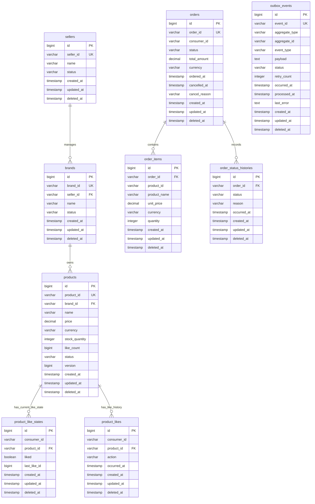

# 04. ERD 및 영속성 규칙

이 문서는 현재 구현 범위의 물리 저장 모델을 정의한다. 요구사항 문서의 비즈니스 규칙을 단일 서버와 단일 관계형 데이터베이스로 구현하기 위한 테이블, 제약, 트랜잭션 규칙만 다룬다.

## 0. 구현 범위

- 배포 단위는 하나의 백엔드 서버 애플리케이션이다.
- 저장소는 하나의 관계형 데이터베이스다.
- Bounded Context는 같은 DB 안에서 테이블 소유권과 접근 규칙으로 구분한다.
- Cache Store, Message Broker, Search Engine, 별도 Read Model은 현재 구현 범위에 포함하지 않는다.
- `outbox_events`는 Domain Event의 영속화와 재시도 용도로만 사용한다.

## 1. 단일 DB 영속성 모델

목적: 현재 시스템이 서버 하나와 DB 하나만 사용하며, Seller 소유권, Like/Unlike 이력, Order/Cancel 이력, 상품 좋아요 집계, Outbox 재시도 테이블을 같은 DB에 저장한다는 점을 표현한다.

읽는 법:

1. 모든 테이블은 하나의 DB에 존재한다.
2. 모든 JPA Entity 테이블은 `BaseEntity`의 `id`를 물리 기본 키로 사용한다.
3. `seller_id`, `brand_id`, `product_id`, `order_id`, `event_id`는 도메인 식별자로 별도 컬럼에 둔다.
4. `sellers`와 `brands.seller_id`는 Seller의 브랜드/상품 관리 권한을 판단하는 기준이다.
5. `product_likes`는 고객 Like/Unlike 이력이다.
6. `product_like_states`는 현재 상태와 멱등 처리를 위한 테이블이다.
7. `products.like_count`는 현재 좋아요 총합이다.
8. `orders`는 고객 주문/취소의 현재 상태와 주요 이력을 보존한다.
9. `order_status_histories`는 주문 상태 전이를 append-only로 기록한다.
10. `outbox_events`는 Domain Event의 영속화와 재시도 용도다.

## 2. 테이블별 규칙

### 2.1 `sellers`

- `seller_id`는 Seller의 도메인 식별자이며 물리 기본 키가 아니다.
- Seller는 Brand/Product 운영 권한의 기준이다.
- Seller가 비활성 상태이면 Brand/Product 변경 명령을 수행할 수 없다.

권장 인덱스:

- `uk_sellers_seller_id (seller_id)`
- `idx_sellers_status (status)`

### 2.2 `brands`

- `brand_id`는 Brand의 도메인 식별자이며 물리 기본 키가 아니다.
- `seller_id`는 Brand를 관리하는 Seller를 가리킨다.
- Seller는 자신이 관리하는 Brand에만 Product를 추가할 수 있다.
- Brand는 물리 삭제하지 않고 `deleted_at`으로 삭제 상태를 남긴다.

권장 인덱스:

- `uk_brands_brand_id (brand_id)`
- `idx_brands_seller_status (seller_id, status)`

### 2.3 `products`

- `product_id`는 Product의 도메인 식별자이며 물리 기본 키가 아니다.
- `like_count` 기본값은 0이다.
- `like_count`는 `ProductLiked` 상태 전환 시 1 증가한다.
- `like_count`는 `ProductUnliked` 상태 전환 시 1 감소한다.
- `like_count`는 0 미만이 될 수 없다.
- 주문은 판매 가능한 상태의 Product에 대해서만 생성할 수 있다.
- `stock_quantity`는 주문 생성 시 감소하고 주문 취소 시 증가한다.
- 재고 동시성은 `SELECT FOR UPDATE` 또는 `version` 기반 낙관적 잠금 중 하나를 구현에서 선택한다.
- Product는 물리 삭제하지 않고 `deleted_at`으로 삭제 상태를 남긴다.

권장 인덱스:

- `uk_products_product_id (product_id)`
- `idx_products_brand_status (brand_id, status)`
- `idx_products_like_count (like_count)`

### 2.4 `product_like_states`

- 기본 키는 `BaseEntity.id`다.
- `(consumer_id, product_id)`는 한 고객의 한 상품에 대한 현재 상태를 보장하는 유니크 키다.
- 현재 좋아요 상태를 `liked`로 저장한다.
- Like/Unlike 명령 처리 시 이 행을 잠그고 현재 상태를 판단한다.
- 상태가 바뀌지 않는 중복 요청은 이력과 이벤트를 만들지 않는다.

권장 인덱스:

- `uk_product_like_states_consumer_product (consumer_id, product_id)`
- `idx_product_like_states_product (product_id, liked)`

### 2.5 `product_likes`

- 고객의 Like/Unlike 이력을 append-only로 저장한다.
- `action` 값은 `LIKE`, `UNLIKE`만 허용한다.
- 실제 상태 전환이 발생한 경우에만 행을 추가한다.
- 이 테이블은 현재 좋아요 수 계산의 기준 로그지만, 조회 시마다 집계하지 않는다. 현재 집계는 `products.like_count`를 사용한다.

권장 인덱스:

- `idx_product_likes_consumer_product_time (consumer_id, product_id, occurred_at)`
- `idx_product_likes_product_time (product_id, occurred_at)`

### 2.6 `orders`

- `order_id`는 Order의 도메인 식별자이며 물리 기본 키가 아니다.
- 주문은 삭제하지 않는다.
- 주문 생성 시 `ORDERED` 상태로 저장한다.
- 주문 취소 시 `CANCELLED` 상태, `cancelled_at`, `cancel_reason`을 저장한다.
- 이미 `CANCELLED`인 주문의 취소 요청은 멱등 성공으로 처리한다.

권장 인덱스:

- `uk_orders_order_id (order_id)`
- `idx_orders_consumer_ordered_at (consumer_id, ordered_at)`
- `idx_orders_status_ordered_at (status, ordered_at)`

### 2.7 `order_items`

- 주문 시점의 상품 스냅샷을 저장한다.
- `product_name`, `unit_price`, `currency`는 주문 후 상품 정보가 바뀌어도 변경하지 않는다.
- `product_id`는 상품 추적용 식별자이며 주문 이력의 가격/이름 기준은 스냅샷 필드다.

권장 인덱스:

- `idx_order_items_order (order_id)`
- `idx_order_items_product (product_id)`

### 2.8 `order_status_histories`

- 주문 상태 전이를 append-only로 저장한다.
- 주문 생성 시 `ORDERED` 이력을 저장한다.
- 주문 취소 시 `CANCELLED` 이력을 저장한다.
- 이미 취소된 주문에 대한 중복 취소 요청은 새 이력을 만들지 않는다.

권장 인덱스:

- `idx_order_status_histories_order_time (order_id, occurred_at)`

### 2.9 `outbox_events`

- `event_id`는 Domain Event의 도메인 식별자이며 물리 기본 키가 아니다.
- 모든 Domain Event는 비즈니스 변경과 같은 DB 트랜잭션 안에서 저장한다.
- `status` 값은 `PENDING`, `PROCESSED`, `FAILED`만 허용한다.
- 처리 성공 시 `PROCESSED`, `processed_at`을 저장한다.
- 처리 실패 시 `FAILED`, `retry_count`, `last_error`를 저장한다.
- 재시도 대상 판단은 구현 정책으로 둔다.
- 현재 범위에서는 외부 브로커 발행 상태를 저장하지 않는다.

권장 인덱스:

- `uk_outbox_events_event_id (event_id)`
- `idx_outbox_events_retry (status, occurred_at)`
- `idx_outbox_events_aggregate (aggregate_type, aggregate_id)`

## 3. 트랜잭션 규칙

### 3.1 Like 전환 트랜잭션

한 트랜잭션 안에서 다음을 모두 처리한다.

1. `product_like_states` 행이 없으면 `liked = false`로 먼저 생성
2. `product_like_states` 현재 상태 잠금
3. 상태 전환 여부 판단
4. 전환이 있으면 `product_likes` 이력 추가
5. 전환이 있으면 `product_like_states` 갱신
6. 전환이 있으면 `products.like_count` 증감
7. 전환이 있으면 `outbox_events` 저장

### 3.2 Seller 상품 운영 트랜잭션

한 트랜잭션 안에서 다음을 모두 처리한다.

1. Seller 활성 상태와 Brand/Product 관리 권한 검증
2. Brand/Product 생성 또는 상품 정보/재고 변경
3. 필요한 경우 `products.stock_quantity` 변경
4. `BrandCreated`, `ProductCreated`, `ProductStockChanged` 중 필요한 `outbox_events` 저장

### 3.3 주문 생성 트랜잭션

한 트랜잭션 안에서 다음을 모두 처리한다.

1. 주문 대상 `products` 행 잠금
2. 판매 가능 상태와 재고 검증
3. `products.stock_quantity` 차감
4. `orders` 저장
5. `order_items` 저장
6. `order_status_histories` 저장
7. `outbox_events` 저장

### 3.4 주문 취소 트랜잭션

한 트랜잭션 안에서 다음을 모두 처리한다.

1. `orders` 행 잠금
2. 취소 가능 상태 검증
3. `orders` 상태를 `CANCELLED`로 변경
4. `order_status_histories` 저장
5. `products.stock_quantity` 복구
6. `outbox_events` 저장

## 4. 현재 범위에서 제외하는 저장소

다음 저장소는 현재 구현 대상이 아니다.

- Cache Store
- Message Broker
- Search Engine
- Recommendation 전용 DB
- Statistics/Data Mart 전용 DB
- 별도 Read Replica나 CQRS Read Model
