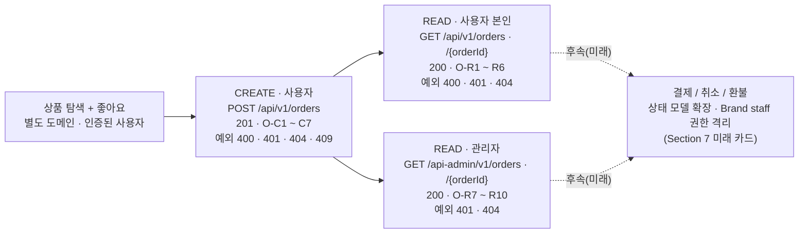
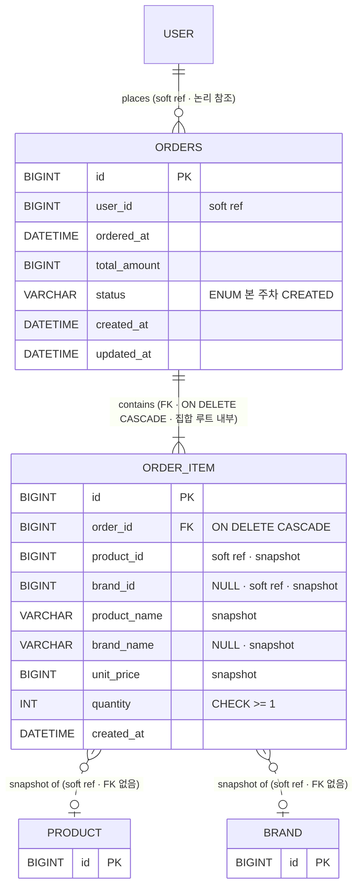
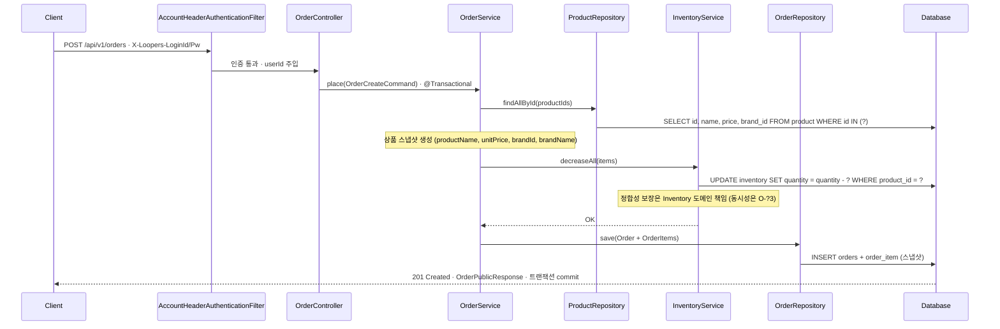
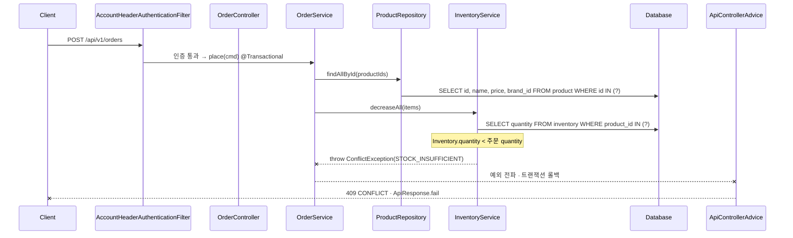
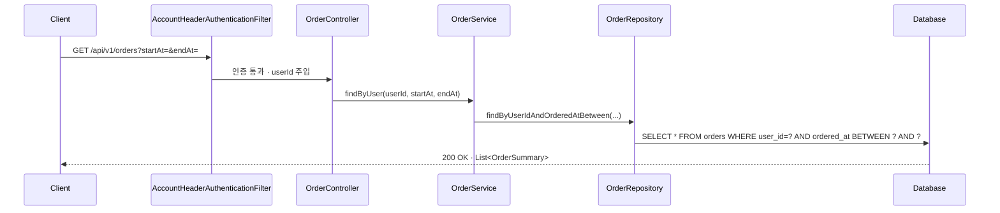
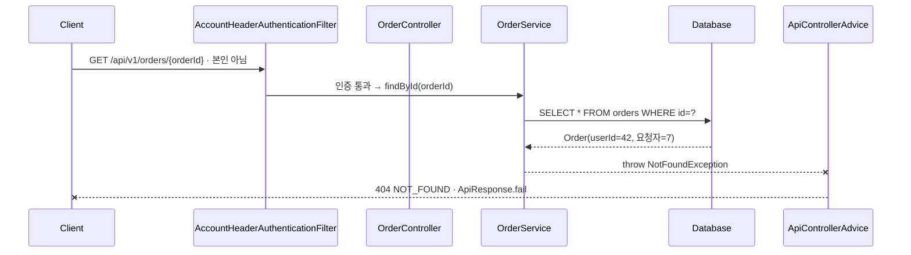
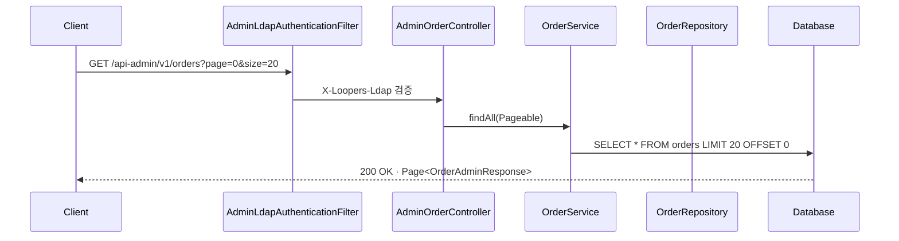

# Orders · 시나리오 → 추출 모델

> Week 2 / Domain 4 of 4 — `04-orders-final.html` 기반 정제본
> 시나리오 명세가 1차 입력이고, 도메인 / DB / API 시퀀스는 모두 거기서 도출됨.
> ⚠️ 본 주차는 **주문 생성 + 조회**까지. UPDATE/DELETE(결제 / 취소 / 환불)는 미래 카드.

## 1. 유저 시나리오 명세

> 이 도메인이 가져야 할 모든 동작을 한 문장씩 정리한다. 이게 1차 입력이고, 아래 모든 섹션은 여기서 도출된다.
> 본 도메인은 **주문 생성 + 조회**까지만 다룬다 — 결제/취소/환불은 후속 단계(Section 7 미래 카드).

### CREATE · 사용자 주문 요청 (7건)

- **O-C1** `정상 201` 로그인 사용자가 여러 상품을 한 번에 주문하면, 주문 시점의 상품 정보가 스냅샷으로 보존되고 재고가 차감된다.
- **O-C2** `예외 401` 로그인 인증 헤더(`X-Loopers-LoginId` / `X-Loopers-LoginPw`)가 없거나 잘못된 요청이면 예외가 발생한다.
- **O-C3** `예외 404` items 중 하나라도 존재하지 않는 productId면 예외가 발생한다.
- **O-C4** `예외 409` 주문 시점에 재고가 요청 수량을 충족하지 못하는 상품이 하나라도 있으면 예외가 발생한다 (서버 재고 상태와의 충돌).
- **O-C5** `예외 400` 요청 본문의 quantity 입력값이 1 미만(0 또는 음수)이면 예외가 발생한다 (입력값 무효).
- **O-C6** `예외 400` items 배열이 비어있거나 누락되면 예외가 발생한다.
- **O-C7** `정상 201` 같은 상품에 대해 동시 주문이 몰려도 재고 차감이 누락 없이 보장된다 (본 주차는 인터페이스만 명시 — 동시성 구현은 후속).

### READ · 사용자 본인 주문 조회 (6건)

- **O-R1** `정상 200` 로그인 사용자는 본인 주문 목록을 startAt/endAt 날짜 범위로 조회한다.
- **O-R2** `정상 200` 로그인 사용자는 본인 주문 단건을 orderId로 조회한다.
- **O-R3** `예외 400` 날짜 범위 파라미터가 누락되거나 형식이 잘못되면 예외가 발생한다.
- **O-R4** `예외 404` 타 사용자의 orderId로 조회를 시도하면 거부한다 (O-?7: 주문은 PII 성격, ID enumeration 차단).
- **O-R5** `예외 404` 존재하지 않는 orderId로 조회하면 예외가 발생한다.
- **O-R6** `예외 401` 로그인 인증 헤더가 없거나 잘못된 요청이면 예외가 발생한다.

### READ · 관리자 주문 조회 (4건)

- **O-R7** `정상 200` 관리자는 전체 주문 목록을 페이지네이션으로 조회한다.
- **O-R8** `정상 200` 관리자는 단건 주문 상세를 orderId로 조회한다 (사용자보다 풍부한 응답).
- **O-R9** `예외 401` 관리자 LDAP 헤더(`X-Loopers-Ldap`)가 없거나 값이 `loopers.admin`이 아니면 예외가 발생한다.
- **O-R10** `예외 404` 관리자가 존재하지 않는 orderId로 조회하면 예외가 발생한다.

## 2. 라이프사이클 흐름

> 시나리오들을 주문의 라이프사이클(요청 → 조회)로 정렬. 본 주차는 Update/Delete 없음 — 결제/취소/환불은 후속.

## 3. 도메인 모델

> 위 시나리오에서 추출된 Order 도메인의 책임. 각 항목 옆에 출처 시나리오 ID.
> 핵심은 **주문 시점 스냅샷 보존**과 **재고 차감의 인터페이스 보장**.

### Order 엔티티 필드 (주문 본체)

| 필드 | 타입 | 설명 | 출처 시나리오 |
|---|---|---|---|
| `id` | Long (PK) | 시스템 부여 식별자 | 모든 시나리오 |
| `userId` | Long | 주문한 사용자 (soft ref) · 본인 검증의 축 | O-C1, O-R1, O-R4 |
| `orderedAt` | LocalDateTime | 주문 시각 (날짜 범위 조회 키) | O-R1 |
| `totalAmount` | Long | 주문 총액 = Σ(unitPrice × quantity) 스냅샷 | O-C1 |
| `status` | enum (`CREATED`) | 주문 상태 — 본 주차는 `CREATED` 단일 값 | O-?1 |
| `createdAt` | LocalDateTime | 레코드 생성 시각 (BaseEntity) | 감사 |
| `updatedAt` | LocalDateTime | 최종 수정 시각 (BaseEntity) · status 변경 추적 | 감사 |

### OrderItem 엔티티 필드 (주문 상품 스냅샷)

| 필드 | 타입 | 설명 | 출처 시나리오 |
|---|---|---|---|
| `id` | Long (PK) | 시스템 부여 식별자 | 전부 |
| `orderId` | Long | 소속 주문 (composition · ON DELETE CASCADE) | O-C1 |
| `productId` | Long | 참조용 — **soft reference** (FK 없음) | O-C1, O-?4 |
| `brandId` | Long? | 주문 시점 brand 식별자 스냅샷 (Brand=Tenant 미래 집계용) | O-?4, O-F5 |
| `productName` | String | 주문 시점 상품명 스냅샷 (product 변경/삭제와 무관) | O-C1 |
| `brandName` | String? | 주문 시점 brand 이름 스냅샷 | O-?4 |
| `unitPrice` | Long | 주문 시점 단가 스냅샷 | O-C1 |
| `quantity` | Int | 주문 수량 (≥ 1) | O-C1, O-C5 |
| `createdAt` | LocalDateTime | 레코드 생성 시각 (BaseEntity 중 단독 채택 · OrderItem은 스냅샷 immutable) | 감사 |

### 도메인 invariant

- Order.items 최소 1개 — 출처 O-C6
- OrderItem.quantity ≥ 1 — 출처 O-C5
- 주문 시점 스냅샷(productName, unitPrice, brandName)은 생성 이후 불변 — 출처 O-C1 (big-picture 명시)
- Product soft delete는 기존 OrderItem snapshot에 영향 없음 — Brand cascade로 Product가 `status='DELETED'`가 되어도 OrderItem 기록은 그대로 유지
- Order.totalAmount = Σ(item.unitPrice × item.quantity) — 출처 O-C1
- 주문 생성 트랜잭션 내에서 **Inventory 도메인의 재고 확인 + 차감 인터페이스**가 모두 성공해야 한다 — 출처 O-C1, O-C4, O-C7 (재고 정합성 자체는 Inventory 도메인 책임)
- 주문 단건 조회는 `Order.userId === 요청자 userId`여야 한다 — 출처 O-R4
- **BaseEntity 부분 채택** — Order는 `createdAt` + `updatedAt`만 사용 (`updatedAt`은 미래 status 변경 추적용 · O-?1). OrderItem은 스냅샷 immutable이라 `createdAt`만. 양쪽 모두 `createdBy`/`updatedBy` 미사용 — 행위자는 `userId`가 보유, audit은 미래 OrderEvent(append-only, O-F6) 책임

### 연관 관계

- Order 1 : N OrderItem (composition · cascade persist) — 출처 O-C1
- Order N : 1 User (`userId`, soft ref) — 출처 O-C1, O-R4
- OrderItem → Product (참조만, **스냅샷 보존** — product 삭제가 주문 기록에 영향 없음 / soft reference) — 출처 O-C1 (big-picture)
- OrderItem → Brand (참조만, **스냅샷** — 미래 brand별 집계 받아냄) — 출처 O-?4, O-F5
- **주문 트랜잭션 → Inventory** (협업, 같은 트랜잭션 내 차감 호출) · OrderItem과 직접 FK는 없음 — 재고 잔량은 주문 스냅샷의 일부가 아님 — 출처 O-C1, O-C4, O-C7 (Inventory 도메인은 `02-product-final.html` P-?4 본문 참조)

## 4. DB 테이블

> Naming은 Spring Boot 기본 `SpringPhysicalNamingStrategy` 가정 (camelCase → snake_case).

### orders 테이블

| 컬럼 | 타입 | 제약 | 출처 |
|---|---|---|---|
| `id` | BIGINT | PK, AUTO_INCREMENT | 전부 |
| `user_id` | BIGINT | NOT NULL · **soft reference** (FK 없음) | O-C1, O-R4 |
| `ordered_at` | DATETIME(6) | NOT NULL | O-R1 |
| `total_amount` | BIGINT | NOT NULL | O-C1 |
| `status` | VARCHAR(32) | NOT NULL · 본 주차는 `CREATED` 단일 값 | O-?1 |
| `created_at` | DATETIME(6) | NOT NULL | BaseEntity |
| `updated_at` | DATETIME(6) | NOT NULL · status 변경 추적 | BaseEntity |

**인덱스 후보:** `(user_id, ordered_at)` — 본인 주문 목록 날짜 범위 조회 (O-R1).

### order_item 테이블

| 컬럼 | 타입 | 제약 | 출처 |
|---|---|---|---|
| `id` | BIGINT | PK, AUTO_INCREMENT | 전부 |
| `order_id` | BIGINT | NOT NULL · **FK** → `orders(id)` · **ON DELETE CASCADE** (집합 루트 내부) | O-C1 |
| `product_id` | BIGINT | NOT NULL · **soft reference** (FK 없음) | O-C1, O-?4 |
| `brand_id` | BIGINT | NULL · 스냅샷 · **soft reference** (FK 없음) | O-?4, O-F5 |
| `product_name` | VARCHAR(255) | NOT NULL (스냅샷) | O-C1 |
| `brand_name` | VARCHAR(50) | NULL (스냅샷) | O-?4 |
| `unit_price` | BIGINT | NOT NULL (스냅샷) | O-C1 |
| `quantity` | INT | NOT NULL, CHECK ≥ 1 | O-C1, O-C5 |
| `created_at` | DATETIME(6) | NOT NULL (BaseEntity 중 단독 채택 · 스냅샷 immutable) | BaseEntity |

**스냅샷 정책:** product/brand 행이 사라지거나 변경되어도 주문 기록은 보존. 따라서 `product_id`/`brand_id`로의 FK는 두지 않음 (O-C1, big-picture 명시). Product가 brand cascade로 soft delete(`status='DELETED'`)되어도 OrderItem snapshot은 영향 없음.

### ER 다이어그램

> **도메인 간 DB 제약(FK) 없음.** `user_id`, `product_id`, `brand_id`는 논리 참조. 무결성은 애플리케이션 레이어 책임. `order_item.order_id`만 집합 루트 내부의 FK + ON DELETE CASCADE — Order ↔ OrderItem composition을 보장. 자세한 정책은 `docs/conventions.md` 참조.

## 5. API 시퀀스

> 대표 시나리오에 대한 호출 흐름. 실선 = 호출, 점선 = return / 에러 응답.

### O-C1 — 사용자가 여러 상품을 주문한다 (정상 · 스냅샷 + 재고 차감)

AccountHeaderAuthenticationFilter 통과 → `@Transactional` 내에서 (1) Product 조회로 스냅샷 생성 → (2) **Inventory 도메인의 차감 인터페이스 호출** → (3) Order/OrderItem 저장. 재고 정합성은 Inventory 도메인이 책임.

### O-C4 — 재고 부족으로 주문 거부 (예외 · 트랜잭션 롤백)

Product 조회까지 진행 후 Inventory 도메인의 차감 인터페이스에서 부족 감지 → 트랜잭션 롤백 → 409 응답. 차감은 절대 발생하지 않음.

### O-R1 — 사용자가 본인 주문 목록을 날짜 범위로 조회한다 (정상)

`user_required: O` · userId + (startAt, endAt) 범위 조회.

### O-R4 — 타 사용자의 주문 단건 조회 시도 (예외 · O-?7 → 404)

orderId는 존재하지만 `Order.userId !== 요청자 userId`. **404 NOT_FOUND**로 응답 (ID enumeration 차단 — O-?7).

### O-R7 — 관리자가 전체 주문 목록을 페이지네이션으로 조회 (정상)

AdminLdapAuthenticationFilter → AdminOrderController → 페이지네이션 조회. 관리자는 본인 검증 없음.

## 6. 결정 이력

본 주차에 확정한 설계 결정. 구현 디테일(JPA 매핑, 동시성 메커니즘, 인덱스 등)은 본 절에 포함하지 않는다.

### O-?1 — 주문 상태 모델

**결정**: enum 컬럼 자리는 잡되 본 주차는 `CREATED` 단일 값.
**근거**: 결제가 후속이라 `PAID`/`CANCELLED`를 미리 두면 YAGNI. 결제 단계에서 enum 값 추가만 하면 됨.

### O-?2 — 재고 차감 시점

**결정**: 주문 생성 시 즉시 차감 (`InventoryService.decreaseAll(items)`을 주문 트랜잭션 내 호출).
**근거**: big-picture "주문 시에 재고 확인 및 차감 보장" 문구 그대로. 결제 도입 시 reserve→commit 전환 자리는 Inventory 도메인 내부에 두고 Order 인터페이스는 그대로 유지.

### O-?3 — 동시 주문 경합 처리

**결정**: 본 주차는 인터페이스/시그니처만 보장 — Order 트랜잭션이 Inventory 도메인의 검증 + 차감 인터페이스를 동기 호출. 동시성 구현 자체는 Inventory 도메인의 후속 결정.
**근거**: 본 주차 범위는 도메인 경계 설정. 동시성 메커니즘(락/원자 UPDATE/MQ 등) 선택은 Inventory 컨텍스트에서 별도 카드로 진행.

### O-?4 — 스냅샷 범위

**결정**: 필수 — `productId`, `productName`, `unitPrice`, `quantity` / 강추 — `brandId`, `brandName`.
**근거**: big-picture "주문 시점 상품 정보 스냅샷" + Brand=Tenant 미래(O-F5)에서 product/brand 삭제 후에도 brand별 집계 가능해야 함. productImageUrl 같은 UI 항목은 요구 발생 시 추가.

### O-?5 — 사용자 응답 vs 관리자 응답 차이

**결정**: 응답 DTO 두 종 분리 — `OrderResponse` / `OrderAdminResponse`.
**근거**: B-?2와 동일 패턴. 사용자에는 orderId/orderedAt/totalAmount/items, 관리자에는 위 + userId/status/createdAt/updatedAt.

### O-?6 — 멱등키 (Idempotency-Key)

**결정**: 본 주차 미도입.
**근거**: PG 연동/webhook과 같이 다뤄야 의미가 살아남 — 결제 도입 시점에 함께 도입.

### O-?7 — 타 사용자 주문 접근 status

**결정**: **404 NOT_FOUND**.
**근거**: 주문은 PII 성격이 강함. ID enumeration으로 타인 주문 존재 여부가 노출되지 않도록 차단 (OWASP A01:2021). Like 도메인(L-?5)이 의미 정합성 우선으로 403을 택한 것과 의도적으로 갈리는 결정.

### O-?8 — 본인 주문 목록의 날짜 범위 제약

**결정**: `startAt`/`endAt` 둘 다 필수 강제. 최대 범위 제약은 본 주차 미도입.
**근거**: O-R3 시나리오 가정. max range 제약은 성능 이슈가 실제 관측되면 추가.

### O-?9 — OrderItem 모델링

**결정**: `@Entity` (Order `@OneToMany` OrderItem).
**근거**: 관리자 응답에서 item 단위 식별/표시 가능성. JPA cascade 표준 패턴.

## 7. 미래 확장 마킹

### O-F1 — 결제 (PG 연동 · 멱등키 · webhook)

big-picture 명시: "결제는 과정 진행 중, 추가로 개발". 외부 PG 연동 + 멱등키 + webhook → 주문 상태 모델 확장.

**이번 주 설계가 받아내야 할 것**:
- `orders.status`를 enum 자리로 둠 (O-?1) → 결제 도입 시 enum 값 추가만
- 재고 차감 시점이 주문 생성 시(O-?2) → 결제 실패 시 보상 로직 필요해질 수 있음을 인지
- `idempotency_key` 컬럼 자리는 비워두고, 결제 도입 시 추가 (O-?6)

### O-F2 — 주문 취소 / 환불 / 부분 환불

결제 후 단계. 상태 머신(`PAID → CANCELLED, PARTIAL_REFUNDED`) + 재고 복원 로직.

**받아낼 것**: Order/OrderItem이 불변 스냅샷이므로 환불은 별도 `RefundLog` 같은 이벤트 테이블로 분리 가능.

### O-F3 — 쿠폰 적용

big-picture "추가 비전" 명시. 발급 → 적용 → 사용 흐름이 주문 totalAmount 계산에 합류.

**받아낼 것**: `totalAmount`를 Σ(unitPrice × quantity)로 단순 계산하되, 후속에 `appliedDiscount` / `couponId` 컬럼 추가 자리 둠.

### O-F4 — 행동 데이터(주문) → 랭킹 / 추천 비동기 집계

big-picture "추가 비전" 명시. 좋아요/주문 행동을 비동기로 집계해 정렬/추천 모델로.

**받아낼 것**: `orders` / `order_item`이 `ordered_at` 시계열 컬럼을 보유 → 후속 집계 ETL이 쉽게 붙음. 도메인 이벤트(`OrderPlaced`) 발행 자리 잡기는 후속.

### O-F5 — Brand staff (Brand = Tenant) — 자기 brand 주문 / 매출만 조회

big-picture "추가 비전" 명시. 각 Brand가 자기 운영자를 가지고 자기 brand 내 주문/통계만 접근.

**이번 주 설계가 받아내야 할 것**:
- `order_item`에 `brand_id` 스냅샷 보존 (O-?4) → product/brand 삭제 후에도 brand별 매출 집계 가능
- brand 정보를 product 내부에 비정규화하지 않음 → brand 변경/이름 충돌이 주문 기록 무결성을 깨지 않음
- 관리자 응답 DTO 분리 패턴(O-?5)을 Brand staff용에도 확장 가능

### O-F6 — Order Event 로그 — 상태 전이 이벤트 누적

결제 도메인 도입 시점에 같이 설계. 상태 전이 이벤트(`ORDER_CREATED`, `PAYMENT_REQUESTED`, `PAID`, `SHIPPED`, `CANCELLED` 등)를 별도 테이블에 누적.

**설계 의도**: snapshot은 OrderItem이 이미 보존하므로 event는 "무엇이 일어났는가"만 기록.

**이번 주 받아낼 것**: 기존 status 컬럼 모델 유지 — 본 주차는 Order에 별도 `DELETED` state를 추가하지 않음 (cancel/refund는 미래 항목, O-F2와 묶어 진행).

---

> 원본 HTML: [`04-orders-final.html`](./04-orders-final.html) · 변경 시 HTML과 동기화 필요
