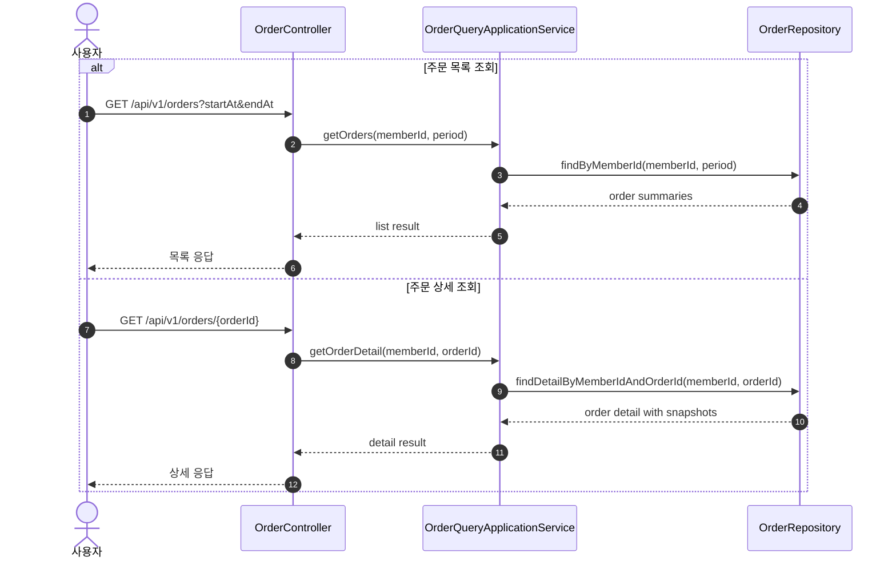

# Sequence 02 - 주문 조회

## 1. Why

주문 조회는 상태 변경이 없는 단순 읽기 흐름이지만, 주문 도메인의 책임이 쓰기 모델과 읽기 모델 어디서 끝나는지를 보여준다.  
특히 주문 상세가 현재 상품 정보가 아니라 주문 시점 스냅샷을 읽어야 한다는 점을 분명히 해야 한다.

## 2. Diagram

## 3. Key Points

- 주문 조회는 로그인 사용자 기준으로만 허용된다. 조회 모델에서도 사용자 경계가 먼저 적용돼야 한다.
- 이 흐름은 복잡한 도메인 협력보다 조회 권한과 응답 반환이 핵심이므로, Application Service 가 repository interface 를 통해 직접 읽는 구조가 자연스럽다.
- 주문 상세는 현재 상품 테이블을 다시 조합하는 것이 아니라, 주문 시점 스냅샷을 기준으로 응답해야 한다.
- 조회는 단순하지만, 쓰기 모델의 스냅샷 전략을 읽기 모델이 그대로 반영해야 한다.
