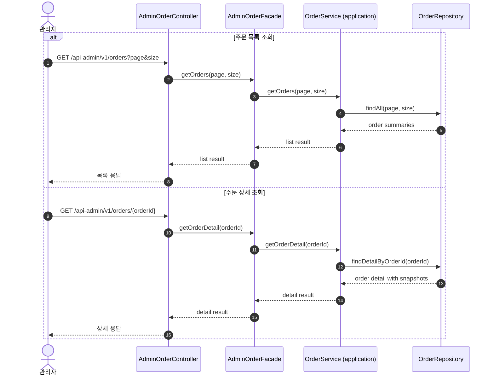

# Sequence 05 - 관리자 주문 조회

## 1. Why

관리자 주문 조회는 같은 `Order` 스냅샷을 사용하지만, 사용자 조회와 달리 소유권 제한이 없다.  
같은 도메인을 사용자 관점과 운영 관점에서 어떻게 다르게 읽는지 보여주기 위해 별도 시퀀스로 분리한다.

## 2. Diagram

## 3. Key Points

- 관리자 주문 조회는 사용자 소유권 검증 없이 전체 주문을 조회할 수 있다.
- `AdminOrderFacade`가 관리자 주문 조회 유스케이스의 진입점이 되고, `OrderService`(application)가 repository interface 를 통해 주문 스냅샷을 읽는다.
- 그래도 읽는 데이터는 주문 시점 스냅샷을 기준으로 해야 하므로, 사용자 조회와 같은 정합성 원칙을 공유한다.
- 운영 관점 필터와 페이징은 별도 조회 모델로 최적화할 수 있다.
