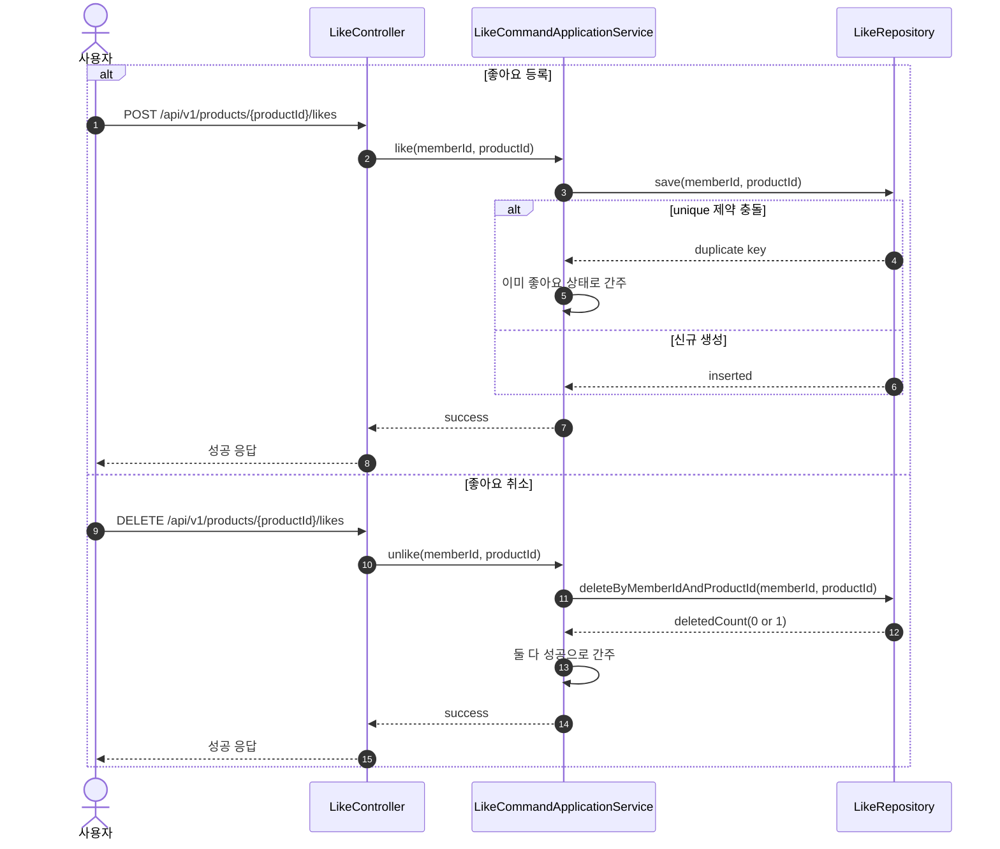

# Sequence 03 - 좋아요 등록/취소

## 1. Why

좋아요는 비즈니스 복잡도는 낮지만, 멱등 처리 정책이 명확해야 클라이언트와 서버 모두 단순해진다.  
중복 요청과 이미 없는 상태의 취소 요청을 어떻게 흡수하는지가 이 시퀀스의 핵심이다.

## 2. Diagram

## 3. Key Points

- 좋아요 명령의 의미는 "좋아요 상태로 만든다 / 좋아요 아님 상태로 만든다"이다. 현재 상태를 맞히는 것이 목적이지, 행 수 자체가 목적이 아니다.
- 이 유스케이스는 복잡한 도메인 간 협력보다 멱등 명령 처리와 저장이 핵심이라서, Application Service 가 repository interface 를 직접 다루는 구조로도 충분하다.
- `(member_id, product_id)` unique 제약은 멱등성을 단순하게 보장하는 핵심 장치다.
- 삭제 결과가 0건이어도 오류로 보지 않으므로, 클라이언트는 안전하게 재시도할 수 있다.
