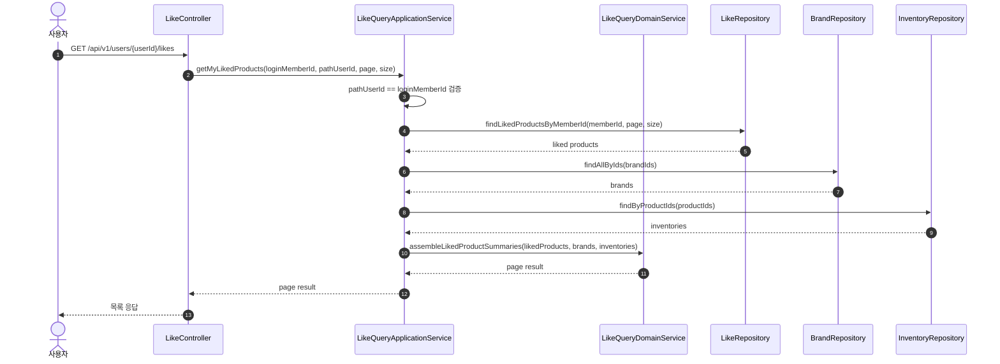

# Sequence 04 - 내 좋아요 목록 조회

## 1. Why

좋아요 목록 조회는 사용자 선호 데이터를 어떤 읽기 모델로 보여줄지를 설명한다.  
Like 자체는 조인 성격의 쓰기 모델이지만, 사용자에게는 상품 중심의 결과를 보여줘야 하므로 조회 책임을 분리해서 보는 것이 중요하다.

## 2. Diagram

## 3. Key Points

- URI에 `userId`가 있어도 의미는 "내 좋아요 목록"이다. 권한 정책이 먼저 검증돼야 한다.
- Application Service 가 사용자 경계를 검증하고 필요한 도메인 데이터를 조회한 뒤, 응답 조합은 Domain Service 로 위임한다.
- 조회 결과는 `Like` 행 자체가 아니라 상품 카드에 필요한 정보로 조합된 읽기 모델이어야 한다.
- 좋아요 도메인은 쓰기 모델은 단순하지만, 조회 모델은 상품/브랜드 정보를 함께 묶어 사용자 중심으로 보여준다.
