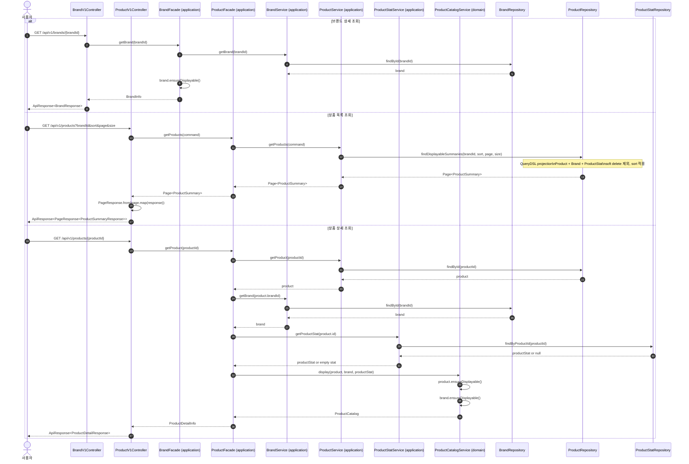

# Sequence 05 - 브랜드/상품 조회

## 1. Why

브랜드와 상품 조회는 전체 구매 흐름의 진입점이다.
이번 구현에서는 고객용 조회에서 재고를 노출하지 않고, 상품 목록은 `Product + Brand + ProductStat` 조회 projection 으로 구성한다.

상세 조회는 삭제 정책 검증이 필요하므로 `ProductCatalogService`(domain)를 통해 `Product`와 `Brand`의 노출 가능 여부를 확인한다.

## 2. Diagram

## 3. Key Points

- Controller 는 Facade 로 진입하고, Facade 는 application service 와 domain service 를 조합해 유스케이스 흐름을 조정한다.
- 상품 목록은 read model 성격이 강하므로 QueryDSL projection 으로 `ProductSummary`를 바로 조회한다.
- 목록 조회는 `Product`, `Brand`, `ProductStat`을 다시 도메인별로 재조회하지 않는다. 중복 조회를 피하고 page boundary 를 DB에서 확정하기 위해서다.
- `latest`, `price_asc`, `likes_desc` 정렬은 모두 `ProductRepository.findDisplayableSummaries(...)`에서 처리한다.
- 목록/상세 응답에는 브랜드 정보와 좋아요 수가 포함된다. 고객용 조회에는 재고 수량을 포함하지 않는다.
- 상품 상세는 `ProductCatalogService`(domain)가 `Product`와 `Brand`의 soft delete 정책을 검증한다.
- `PageResponse`는 interface layer 의 공통 응답 DTO이며, `data`와 `meta`를 분리하고 최종적으로 `ApiResponse`로 감싼다.
