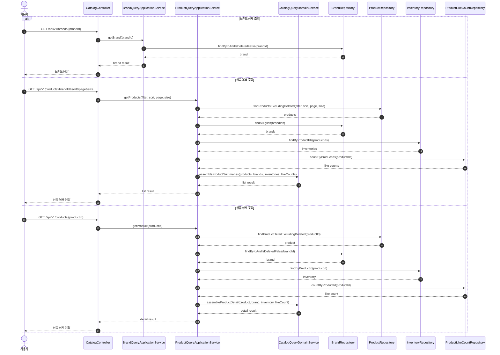

# Sequence 05 - 브랜드/상품 조회

## 1. Why

브랜드와 상품 조회는 전체 구매 흐름의 진입점이다.  
복잡한 쓰기 정책은 없지만, 어떤 정보를 Catalog 책임으로 보고 어떤 조합을 조회 계층에서 해결할지 분명히 해야 한다.

## 2. Diagram

## 3. Key Points

- Controller 는 각 Application Service 로 진입하고, Application Service 가 repository interface 를 통해 필요한 도메인 데이터를 조회한다.
- 브랜드와 상품은 같은 Catalog 문맥 안에 있지만, 상품 목록/상세는 브랜드 정보, 재고 정보, 좋아요 수가 함께 조합된 읽기 모델이 된다.
- 도메인 간 조합 규칙은 상태 없는 `CatalogQueryDomainService`가 담당하고, Application Service 는 조회 흐름 orchestration 에 집중한다.
- 좋아요 여부, 좋아요 수 같은 부가 정보는 조회 모델에서 조합할 수 있으며, 필요 시 캐시/프로젝션으로 최적화할 수 있다.
- soft delete 된 브랜드와 상품은 고객 조회에서 기본적으로 제외돼야 한다.
