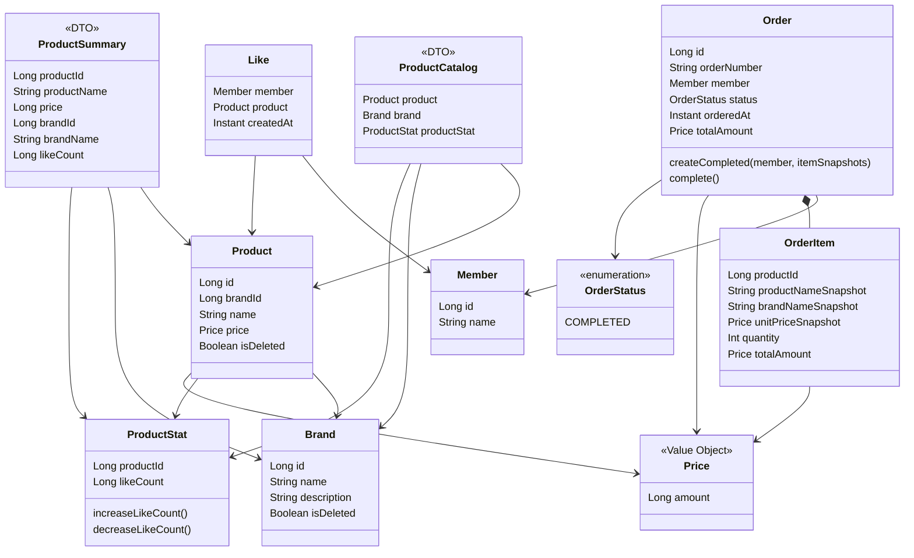

# 클래스 다이어그램

## 1. Why

이 다이어그램은 서비스나 저장소가 아니라, 이번 범위의 도메인 개념이 서로 어떤 책임과 관계를 가지는지 보여주기 위한 것이다.  
설계에서 코드로 넘어갈 때 Aggregate, 엔티티, 값 객체, 참조 관계를 자연스럽게 옮길 수 있도록 도메인 중심으로만 표현한다.

## 2. Diagram

## 3. 책임과 관계

| 도메인 개념 | 핵심 책임 |
| --- | --- |
| `Brand` | 상품이 소속되는 브랜드 정보를 가진다 |
| `Product` | 판매 정보와 소속 브랜드 참조를 가진다 |
| `ProductStat` | 상품의 좋아요 수 같은 조회/정렬용 집계 값을 가진다 |
| `ProductCatalog` | 상품 상세 조회에서 `Product`, `Brand`, `ProductStat` 조합 결과를 표현한다 |
| `ProductSummary` | 상품 목록 조회에서 필요한 상품/브랜드/좋아요 수 요약 정보를 표현한다 |
| `Like` | 특정 사용자가 특정 상품을 좋아요 했다는 선호 관계를 표현한다 |
| `Member` | 좋아요와 주문의 주체를 식별한다 |
| `Order` | 주문 완료 결과와 주문 전체 합계를 보존한다 |
| `OrderItem` | 주문 시점의 상품 스냅샷, 수량, 해당 품목의 총 주문 금액을 보존한다 |
| `Price` | 현재 범위에서 상품 가격과 주문 금액을 표현하는 값 객체다 |

## 4. 설계 메모

- `Like`는 `Member`와 `Product` 사이의 관계를 표현하는 조인 성격의 도메인이다.
- `Order`는 별도 Factory 없이 `createCompleted(...)` 같은 도메인 팩토리 메서드로 `OrderItem`을 함께 생성한다.
- `OrderItem`은 상품 엔티티 자체보다 `productId`와 스냅샷 정보를 보존하는 쪽에 가깝다. 그래서 관계선도 직접 참조 대신 스냅샷 중심으로 단순화했다.
- `Price`는 독립 테이블이 아니라 도메인 값 객체다. 현재는 한국 단일 통화 전제를 두고 금액 값 중심으로 해석한다.
- `ProductStat`은 좋아요 수 정렬과 목록/상세 응답의 `likeCount` 제공을 위해 `Product`와 분리한다.
- `Inventory`는 주문/관리자 상품 작업에서 별도 모델로 분리할 예정이다. 현재 브랜드/상품 조회 구현에서는 고객 응답에 재고를 노출하지 않는다.
- `Product`, `Brand`의 삭제는 hard delete가 아니라 `isDeleted` 기반 soft delete로 해석한다.
- `Member`는 이번 범위에서 상세 회원 도메인으로 확장하지 않고, 주문과 좋아요의 주체를 드러내기 위한 개념으로만 둔다.
