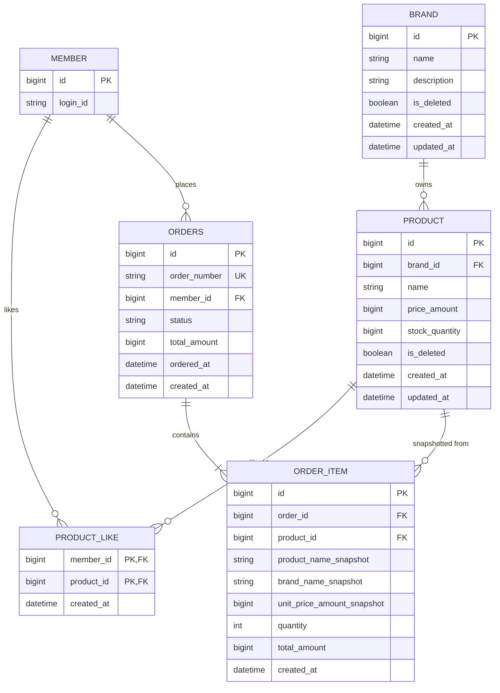

# ERD

## 1. Why

이 ERD는 데이터 정합성을 기준으로 최소한의 저장 구조를 정리한다.  
특히 좋아요의 멱등성, 주문 스냅샷 보존, 주문-재고 정합성, 관리자 운영 기능이 어떤 기존 테이블을 사용해 동작하는지를 드러내는 것이 목적이다.

## 2. Diagram

## 3. 데이터 정합성 포인트

| 항목 | 정합성 규칙 |
| --- | --- |
| 브랜드-상품 | `product.brand_id`는 반드시 존재하는 `brand.id`를 참조해야 한다. |
| 관리자 Catalog 관리 | 관리자 브랜드/상품 관리는 별도 테이블 없이 `brand`, `product`를 직접 관리한다. 삭제는 `is_deleted` 기반 soft delete 로 해석한다. |
| 좋아요 멱등성 | `product_like(member_id, product_id)` 복합 PK로 동일 사용자의 동일 상품 좋아요를 단일 row로 보장한다. |
| 주문 소유권 | `orders.member_id`는 주문의 소유 사용자를 가리킨다. 조회 시 이 키를 기준으로 권한을 제한한다. |
| 관리자 주문 조회 | 관리자 조회는 `orders.member_id`로 권한을 제한하지 않지만, 같은 주문/주문상세 스냅샷 데이터를 읽는다. |
| 주문 상세 무결성 | `order_item.order_id`는 반드시 존재하는 주문을 참조해야 한다. |
| 주문 스냅샷 | `product_name_snapshot`, `brand_name_snapshot`, `unit_price_*_snapshot`은 주문 당시 값을 고정 저장한다. |
| 재고 정합성 | `product.stock_quantity`는 음수가 되면 안 되며, 주문 트랜잭션 안에서 검증 후 차감돼야 한다. |

## 4. 컬럼 설명

### 4.1 MEMBER

| 컬럼 | 의미 |
| --- | --- |
| `id` | 회원 식별자 |
| `login_id` | 로그인 식별자 |

### 4.2 BRAND

| 컬럼 | 의미 |
| --- | --- |
| `id` | 브랜드 식별자 |
| `name` | 브랜드명 |
| `description` | 브랜드 소개 문구 |
| `is_deleted` | soft delete 여부 |
| `created_at` | 브랜드 생성 시각 |
| `updated_at` | 브랜드 수정 시각 |

### 4.3 PRODUCT

| 컬럼 | 의미 |
| --- | --- |
| `id` | 상품 식별자 |
| `brand_id` | 소속 브랜드 식별자 |
| `name` | 상품명 |
| `price_amount` | 현재 상품 판매 금액 |
| `stock_quantity` | 현재 주문 가능한 재고 수량 |
| `is_deleted` | soft delete 여부 |
| `created_at` | 상품 생성 시각 |
| `updated_at` | 상품 수정 시각 |

### 4.4 PRODUCT_LIKE

| 컬럼 | 의미 |
| --- | --- |
| `member_id` | 좋아요를 누른 회원 식별자 |
| `product_id` | 좋아요 대상 상품 식별자 |
| `created_at` | 좋아요 생성 시각 |

### 4.5 ORDERS

| 컬럼 | 의미 |
| --- | --- |
| `id` | 주문 식별자 |
| `order_number` | 외부 노출용 주문 번호 |
| `member_id` | 주문한 회원 식별자 |
| `status` | 주문 상태 |
| `total_amount` | 주문 전체 총 금액 |
| `ordered_at` | 실제 주문 시각 |
| `created_at` | 주문 레코드 생성 시각 |

### 4.6 ORDER_ITEM

| 컬럼 | 의미 |
| --- | --- |
| `id` | 주문 품목 식별자 |
| `order_id` | 소속 주문 식별자 |
| `product_id` | 주문 당시 참조한 상품 식별자 |
| `product_name_snapshot` | 주문 당시 상품명 |
| `brand_name_snapshot` | 주문 당시 브랜드명 |
| `unit_price_amount_snapshot` | 주문 당시 개당 가격 |
| `quantity` | 주문 수량 |
| `total_amount` | 해당 주문 품목 총 금액 |
| `created_at` | 주문 품목 생성 시각 |

## 5. 권장 제약 조건

| 테이블 | 권장 제약 |
| --- | --- |
| `product_like` | `PRIMARY KEY(member_id, product_id)` |
| `orders` | `UNIQUE(order_number)` |
| `product` | `CHECK(stock_quantity >= 0)` |
| `brand`, `product` | 고객 조회 기본 조건으로 `is_deleted = false` 인덱스 또는 조회 조건을 권장 |

## 6. 설계 메모

- `MEMBER`는 이번 설계 범위 밖이지만, `Like`와 `Order`의 외래키 정합성을 설명하기 위해 최소한으로 표시했다.
- 관리자 인증 정보는 이번 설계에서 별도 테이블로 모델링하지 않는다. 운영 API 접근 제어는 외부 인증/헤더 정책 전제로 둔다.
- `BRAND`, `PRODUCT`의 삭제는 hard delete 가 아니라 `is_deleted` 기반 soft delete 로 본다.
- `PRODUCT_LIKE`는 별도 surrogate key 없이 `(member_id, product_id)` 복합키를 식별자로 사용한다.
- `PRODUCT`와 `ORDER_ITEM` 사이 관계는 현재 상품 자체를 다시 읽기 위한 용도라기보다, 어떤 상품에서 스냅샷이 만들어졌는지 추적하기 위한 참조로 본다.
- 결제 테이블은 현재 넣지 않는다. 실제 결제 정책이 확정되면 `orders`와 별도 `payments` 관계를 추가하는 편이 경계를 유지하기 쉽다.
